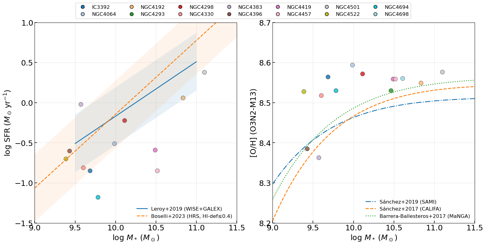
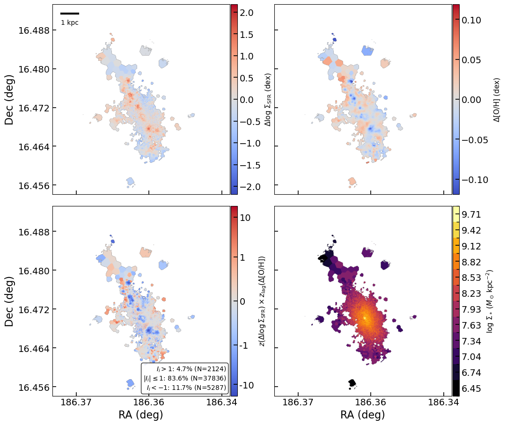
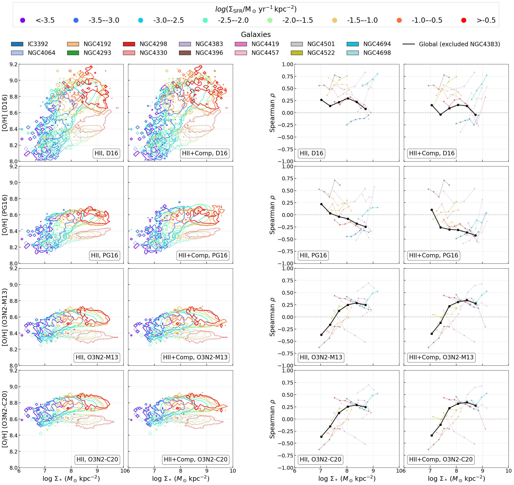

# 20260413 Integrated SFMS, MZR and dispersion cut at NGC4383

It looks like our galaxies are relatively metal-richer.

For NGC4383, it still has the low-mass tail after i apply $\sigma(\mathrm{H}\alpha)<77.5\ \mathrm{km/s}$ cut to remove the outflow regions. 

