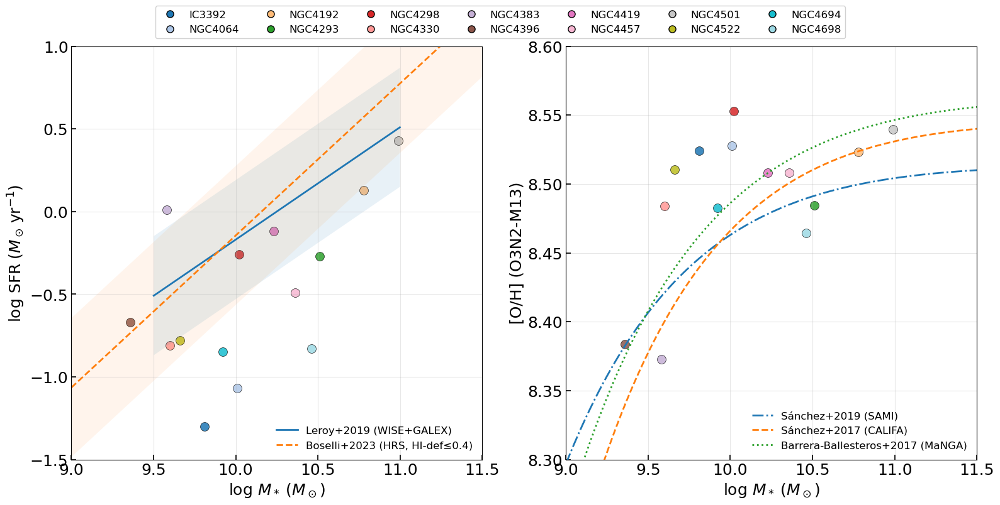
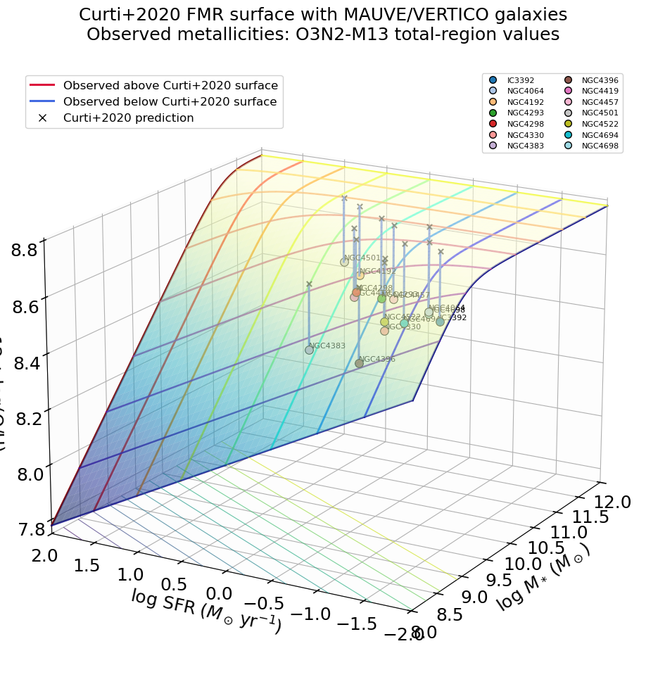
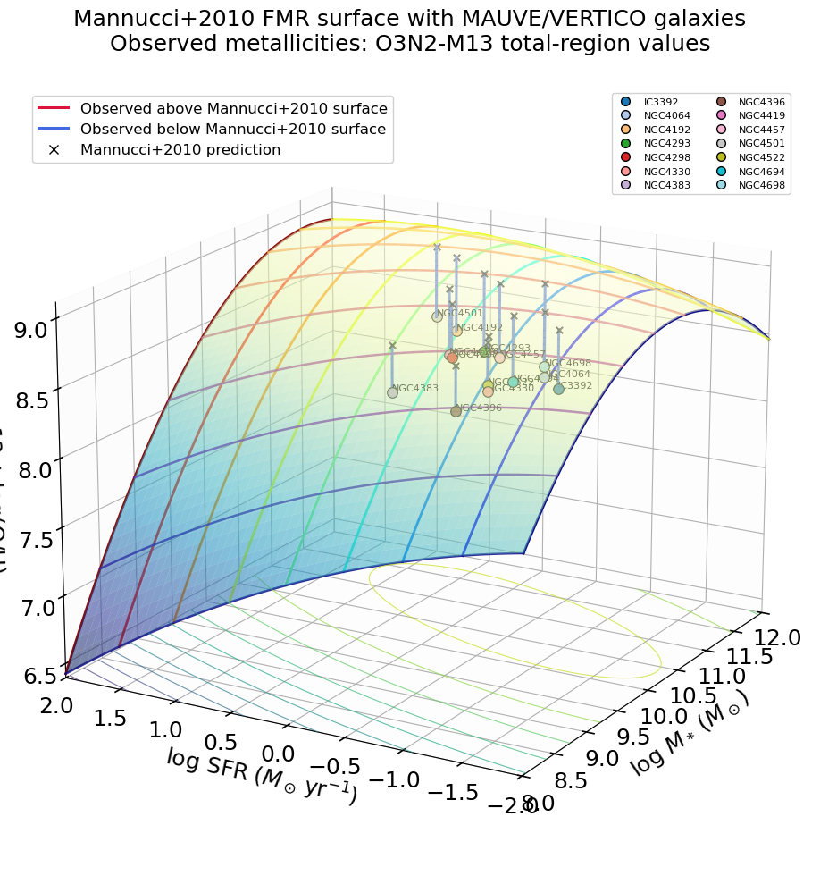

# 20260414 GM Integrated SFMS, MZR and FMR

```python
Loaded published integrated properties for target galaxies:
  IC3392: logM*=9.810 +/- 0.060 [Villanueva+2022]; logSFR=-1.300 +/- 0.200 [Leroy+2021]
  NGC4064: logM*=10.010 +/- 0.090 [Villanueva+2022]; logSFR=-1.070 +/- 0.200 [Leroy+2021]
  NGC4192: logM*=10.780 +/- 0.100 [Leroy+2021]; logSFR=0.130 +/- 0.200 [Leroy+2021]
  NGC4293: logM*=10.510 +/- 0.070 [Villanueva+2022]; logSFR=-0.270 +/- 0.200 [Leroy+2021]
  NGC4298: logM*=10.020 +/- 0.070 [Villanueva+2022]; logSFR=-0.260 +/- 0.200 [Leroy+2021]
  NGC4330: logM*=9.600 [local mass log]; logSFR=-0.810 [local sfr log]
  NGC4383: logM*=9.580 +/- 0.070 [Villanueva+2022]; logSFR=0.010 +/- 0.200 [Leroy+2021]
  NGC4396: logM*=9.360 +/- 0.100 [Leroy+2021]; logSFR=-0.670 +/- 0.200 [Leroy+2021]
  NGC4419: logM*=10.230 +/- 0.080 [Villanueva+2022]; logSFR=-0.120 +/- 0.200 [Leroy+2021]
  NGC4457: logM*=10.360 +/- 0.080 [Villanueva+2022]; logSFR=-0.490 +/- 0.200 [Leroy+2021]
  NGC4501: logM*=10.990 +/- 0.080 [Villanueva+2022]; logSFR=0.430 +/- 0.200 [Leroy+2021]
  NGC4522: logM*=9.660 +/- 0.100 [Leroy+2021]; logSFR=-0.780 +/- 0.200 [Leroy+2021]
  NGC4694: logM*=9.920 +/- 0.070 [Villanueva+2022]; logSFR=-0.850 +/- 0.200 [Leroy+2021]
  NGC4698: logM*=10.460 +/- 0.080 [Villanueva+2022]; logSFR=-0.830 +/- 0.200 [Leroy+2021]
```





