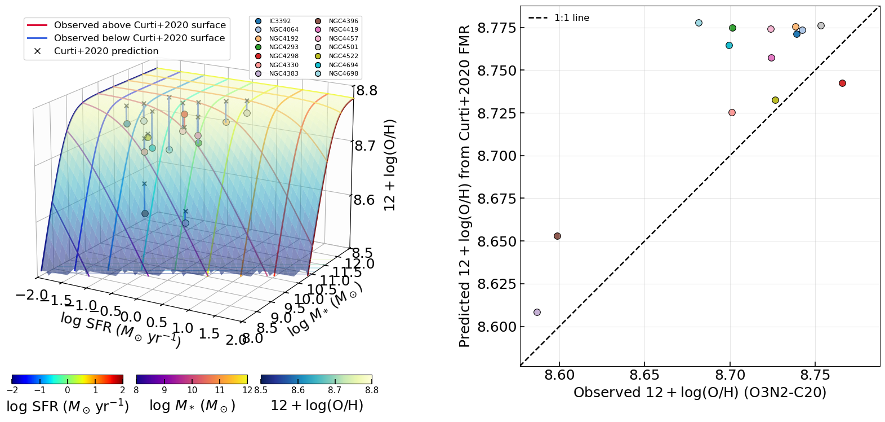

# 20260414 Integrated SFMS, MZR and FMR

```python
Loaded published integrated properties for target galaxies:
  IC3392: logM*=9.810 +/- 0.060 [Villanueva+2022]; logSFR=-1.300 +/- 0.200 [Leroy+2021]
  NGC4064: logM*=10.010 +/- 0.090 [Villanueva+2022]; logSFR=-1.070 +/- 0.200 [Leroy+2021]
  NGC4192: logM*=10.780 +/- 0.100 [Leroy+2021]; logSFR=0.130 +/- 0.200 [Leroy+2021]
  NGC4293: logM*=10.510 +/- 0.070 [Villanueva+2022]; logSFR=-0.270 +/- 0.200 [Leroy+2021]
  NGC4298: logM*=10.020 +/- 0.070 [Villanueva+2022]; logSFR=-0.260 +/- 0.200 [Leroy+2021]
  NGC4330: logM*=9.600 [local mass log]; logSFR=-0.810 [local sfr log]
  NGC4383: logM*=9.580 +/- 0.070 [Villanueva+2022]; logSFR=0.010 +/- 0.200 [Leroy+2021]
  NGC4396: logM*=9.360 +/- 0.100 [Leroy+2021]; logSFR=-0.670 +/- 0.200 [Leroy+2021]
  NGC4419: logM*=10.230 +/- 0.080 [Villanueva+2022]; logSFR=-0.120 +/- 0.200 [Leroy+2021]
  NGC4457: logM*=10.360 +/- 0.080 [Villanueva+2022]; logSFR=-0.490 +/- 0.200 [Leroy+2021]
  NGC4501: logM*=10.990 +/- 0.080 [Villanueva+2022]; logSFR=0.430 +/- 0.200 [Leroy+2021]
  NGC4522: logM*=9.660 +/- 0.100 [Leroy+2021]; logSFR=-0.780 +/- 0.200 [Leroy+2021]
  NGC4694: logM*=9.920 +/- 0.070 [Villanueva+2022]; logSFR=-0.850 +/- 0.200 [Leroy+2021]
  NGC4698: logM*=10.460 +/- 0.080 [Villanueva+2022]; logSFR=-0.830 +/- 0.200 [Leroy+2021]
```


```python
Curti+2020 FMR residuals (O3N2-C20, total region) for the 14 galaxies
Galaxy     logM*    logSFR    Z_obs    Z_pred   Delta(obs-pred)
IC3392     9.810    -1.300    8.739    8.771     -0.032
NGC4064   10.010    -1.070    8.742    8.774     -0.031
NGC4192   10.780     0.130    8.738    8.776     -0.037
NGC4293   10.510    -0.270    8.701    8.775     -0.073
NGC4298   10.020    -0.260    8.766    8.743     +0.023
NGC4330    9.600    -0.810    8.701    8.725     -0.024
NGC4383    9.580     0.010    8.587    8.608     -0.022
NGC4396    9.360    -0.670    8.599    8.653     -0.054
NGC4419   10.230    -0.120    8.724    8.757     -0.033
NGC4457   10.360    -0.490    8.724    8.774     -0.050
NGC4501   10.990     0.430    8.753    8.776     -0.023
NGC4522    9.660    -0.780    8.726    8.732     -0.006
NGC4694    9.920    -0.850    8.699    8.765     -0.065
NGC4698   10.460    -0.830    8.681    8.778     -0.096

N                = 14
Mean delta_Z     = -0.037 dex
Median delta_Z   = -0.033 dex
RMS delta_Z      = 0.047 dex
Std(delta_Z)     = 0.030 dex
```



So the median deviatiion from the FMR surface for our 14 MAUVE-MUSE galaxies is -0.033 dex, which is similar to the value reported by Curti+2020, 0.028 dex. 