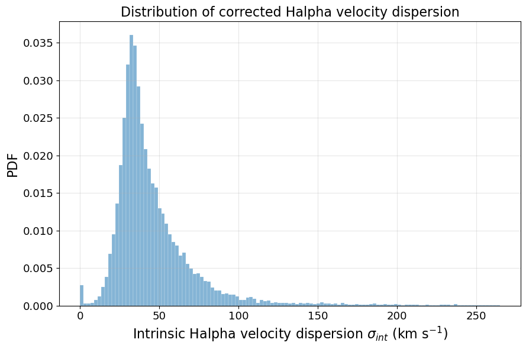
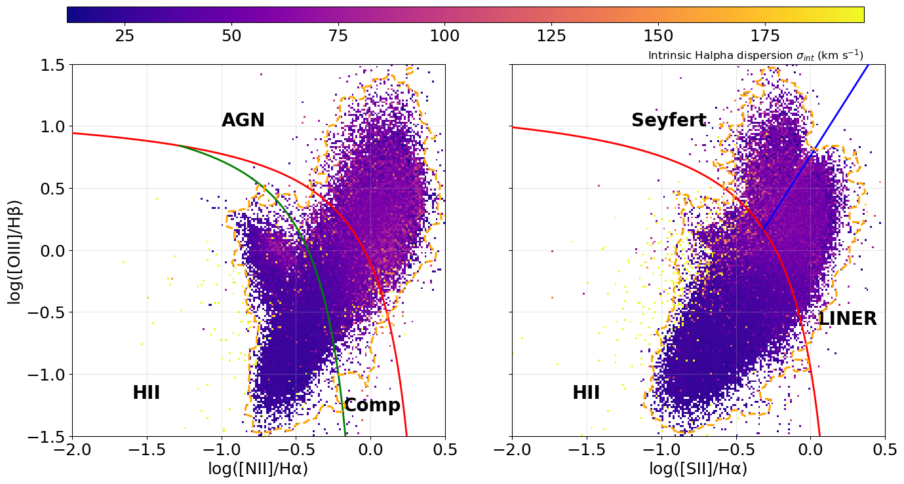

# 20260420 Halpha dispersion

Here I subctract the observed H$\alpha$ dispersion by instrumental boardening ($48.69\,\mathrm{km/s}$) in quadrature to obtain the intrinsic dispersion. Below I show the distrubution of intrinsic dispersion first. 



Then i colorcode the BPT diagram with the intrinsic dispersion. So again, only a few spaxels are rejected in the selectioin. 



Finally, I show the table that report the numbers and fractions of our selection criteria in each galaxy and combined case. In total, HII gives 31.61%, HII+EW gives 29.89% and HII+EW+dispersion gives 29.28%.

```python
Selection chain (per galaxy):
  Base(Cell1) -> HII -> HII+EW>6 -> HII+EW>6+sigma_int<77.5

Galaxy       Base(C1)        HII     f(HII)     HII+EW>6    f(HII+EW)   HII+EW+sig<77.5   f(final)
--------------------------------------------------------------------------------------------------
IC3392          49984      14906     0.2982        13877       0.2776             13811     0.2763
NGC4064        111655       6946     0.0622         6343       0.0568              6172     0.0553
NGC4192        458926     146165     0.3185       139526       0.3040            139472     0.3039
NGC4293        141156       4222     0.0299          517       0.0037               502     0.0036
NGC4298        277437     156571     0.5643       143910       0.5187            143910     0.5187
NGC4330         88572      42589     0.4808        38371       0.4332             37672     0.4253
NGC4383        127766      75134     0.5881        74737       0.5850             59747     0.4676
NGC4396        155963      81729     0.5240        81493       0.5225             81470     0.5224
NGC4419        126953       7288     0.0574         5810       0.0458              5588     0.0440
NGC4457        227739       6280     0.0276         6050       0.0266              5798     0.0255
NGC4501        578518     261414     0.4519       251053       0.4340            251045     0.4339
NGC4522         82367      39285     0.4770        38194       0.4637             38112     0.4627
NGC4694         59616       2584     0.0433         1935       0.0325              1935     0.0325
NGC4698        218649      10141     0.0464         6891       0.0315              6869     0.0314
--------------------------------------------------------------------------------------------------
ALL           2705301     855254     0.3161       808707       0.2989            792103     0.2928
```

