# 20260427 v3tk_v7.6.8 and v3_v7.2.1 comparison

In general, line maps all seems fine; but visual inspection on stellar velocity maps shows a bit residual patterns and new SFH maps seem to suggest a bit older but metal-poorer population due to skyline. 

## 1. Parameters and comparison metrics

The comparison is done between the older `v3_v7.2.1` `ngist` runs and the newer `v3tk_v7.6.8` `ngist` runs for three initial galaxies: IC3392, NGC4383, and NGC4419. For each galaxy, we read the same set of `ngist` maps from the two runs and compares the matched map extensions. 

The stellar kinematic maps read and compared are: `V`, `SIGMA`, `H3` and `H4`. For `V` and `SIGMA`, the expected behaviour is that the spatial pattern should remain broadly consistent between the two runs, with only modest amplitude differences. `H3` and `H4` are also compared, but note that the new run uses an optimized bias while the old run used the default constant value.

The SFH maps read and compared are: `AGE`, `METAL` and `EBV`. `AGE` and `METAL`. The expected behaviour is that their broad spatial trends should be reasonably similar, although we extend the fitting range from $4800-7000\AA$ to $4800-9100\AA$. However, due to more severe skyline contamination in redder end, we may expect to see a bit older but metal-poorer population in new maps. `EBV` should be definitely different since `ngist` handle extinction differently across versions.  

The gas maps are restricted to flux maps for the selected strong lines: `HB4861_FLUX`, `OIII5006_FLUX`, `NII6548_FLUX`, `HA6562_FLUX`, `SII6716_FLUX` and `SII6730_FLUX`. For these gas flux maps, the expected behaviour is that the old and new maps should have very similar spatial structure. 

For each compared map, the basic difference map is defined as:

```text
DIFF = new - old
```

The percent-difference map is defined as:

```text
PCT DIFF = 100 * (new - old) / abs(old)
```

The notebooks show the following visual checks for each map (see details in Section 3):

- old map
- new map
- `DIFF = new - old`
- `PCT DIFF = 100 * (new - old) / abs(old)`
- old-vs-new scatter plot with the 1:1 line

The conclusion uses two metrics (check details in Section 2):

- `pearson_r`: the Pearson correlation coefficient between old and new finite pixels. This checks whether the old and new maps follow the same spatial pattern.
- `median_abs_pct_change`: the median of `abs(PCT DIFF)`. This checks the typical fractional amplitude change.

The current automatic classification rule is:

- if `pearson_r < 0.9`, classify the quantity as `changes a lot`
- if `pearson_r >= 0.9` and `median_abs_pct_change <= 10%`, classify it as `similar`
- if `pearson_r >= 0.9` and `median_abs_pct_change > 10%`, classify it as `somewhat similar`

Thus, the first requirement is that the map morphology agrees well enough (`pearson_r >= 0.9`). If that is satisfied, the percent change then decides whether the amplitude agreement is tight (`similar`) or still noticeably offset (`somewhat similar`).

## 2. Conclusion tables

### 2.1 IC3392

<table border="1" class="dataframe">
  <thead>
    <tr style="text-align: right;">
      <th></th>
      <th>quantity</th>
      <th>family</th>
      <th>auto_conclusion</th>
      <th>decision_metrics</th>
    </tr>
  </thead>
  <tbody>
    <tr>
      <th>0</th>
      <td>KIN_V</td>
      <td>kin_velocity</td>
      <td>similar</td>
      <td>pearson_r=0.995; median_abs_pct_change=9.54</td>
    </tr>
    <tr>
      <th>1</th>
      <td>KIN_SIGMA</td>
      <td>kin_velocity</td>
      <td>changes a lot</td>
      <td>pearson_r=0.314; median_abs_pct_change=17.5</td>
    </tr>
    <tr>
      <th>2</th>
      <td>KIN_H3</td>
      <td>kin_moment</td>
      <td>changes a lot</td>
      <td>pearson_r=0.361; median_abs_pct_change=569</td>
    </tr>
    <tr>
      <th>3</th>
      <td>KIN_H4</td>
      <td>kin_moment</td>
      <td>changes a lot</td>
      <td>pearson_r=0.168; median_abs_pct_change=1.134e+03</td>
    </tr>
    <tr>
      <th>4</th>
      <td>SFH_AGE</td>
      <td>sfh_age</td>
      <td>changes a lot</td>
      <td>pearson_r=0.229; median_abs_pct_change=79</td>
    </tr>
    <tr>
      <th>5</th>
      <td>SFH_METAL</td>
      <td>sfh_metal</td>
      <td>changes a lot</td>
      <td>pearson_r=0.241; median_abs_pct_change=113</td>
    </tr>
    <tr>
      <th>6</th>
      <td>SFH_EBV</td>
      <td>sfh</td>
      <td>expected different</td>
      <td>Expected different: due to ngist</td>
    </tr>
    <tr>
      <th>7</th>
      <td>GAS_HB4861_FLUX</td>
      <td>gas_flux</td>
      <td>somewhat similar</td>
      <td>pearson_r=0.989; median_abs_pct_change=25.5</td>
    </tr>
    <tr>
      <th>8</th>
      <td>GAS_OIII5006_FLUX</td>
      <td>gas_flux</td>
      <td>somewhat similar</td>
      <td>pearson_r=0.912; median_abs_pct_change=25.3</td>
    </tr>
    <tr>
      <th>9</th>
      <td>GAS_NII6548_FLUX</td>
      <td>gas_flux</td>
      <td>similar</td>
      <td>pearson_r=0.991; median_abs_pct_change=7.87</td>
    </tr>
    <tr>
      <th>10</th>
      <td>GAS_HA6562_FLUX</td>
      <td>gas_flux</td>
      <td>somewhat similar</td>
      <td>pearson_r=0.989; median_abs_pct_change=14</td>
    </tr>
    <tr>
      <th>11</th>
      <td>GAS_SII6716_FLUX</td>
      <td>gas_flux</td>
      <td>somewhat similar</td>
      <td>pearson_r=0.99; median_abs_pct_change=11.1</td>
    </tr>
    <tr>
      <th>12</th>
      <td>GAS_SII6730_FLUX</td>
      <td>gas_flux</td>
      <td>somewhat similar</td>
      <td>pearson_r=0.988; median_abs_pct_change=14.4</td>
    </tr>
  </tbody>
</table>
### 2.2 NGC4383

<table border="1" class="dataframe">
  <thead>
    <tr style="text-align: right;">
      <th></th>
      <th>quantity</th>
      <th>family</th>
      <th>auto_conclusion</th>
      <th>decision_metrics</th>
    </tr>
  </thead>
  <tbody>
    <tr>
      <th>0</th>
      <td>KIN_V</td>
      <td>kin_velocity</td>
      <td>changes a lot</td>
      <td>pearson_r=0.389; median_abs_pct_change=43.6</td>
    </tr>
    <tr>
      <th>1</th>
      <td>KIN_SIGMA</td>
      <td>kin_velocity</td>
      <td>changes a lot</td>
      <td>pearson_r=0.111; median_abs_pct_change=19.3</td>
    </tr>
    <tr>
      <th>2</th>
      <td>KIN_H3</td>
      <td>kin_moment</td>
      <td>changes a lot</td>
      <td>pearson_r=0.311; median_abs_pct_change=748</td>
    </tr>
    <tr>
      <th>3</th>
      <td>KIN_H4</td>
      <td>kin_moment</td>
      <td>changes a lot</td>
      <td>pearson_r=0.171; median_abs_pct_change=998</td>
    </tr>
    <tr>
      <th>4</th>
      <td>SFH_AGE</td>
      <td>sfh_age</td>
      <td>changes a lot</td>
      <td>pearson_r=0.576; median_abs_pct_change=94.9</td>
    </tr>
    <tr>
      <th>5</th>
      <td>SFH_METAL</td>
      <td>sfh_metal</td>
      <td>changes a lot</td>
      <td>pearson_r=0.599; median_abs_pct_change=23.7</td>
    </tr>
    <tr>
      <th>6</th>
      <td>SFH_EBV</td>
      <td>sfh</td>
      <td>expected different</td>
      <td>Expected different: due to ngist</td>
    </tr>
    <tr>
      <th>7</th>
      <td>GAS_HB4861_FLUX</td>
      <td>gas_flux</td>
      <td>similar</td>
      <td>pearson_r=1; median_abs_pct_change=8.72</td>
    </tr>
    <tr>
      <th>8</th>
      <td>GAS_OIII5006_FLUX</td>
      <td>gas_flux</td>
      <td>similar</td>
      <td>pearson_r=1; median_abs_pct_change=9.94</td>
    </tr>
    <tr>
      <th>9</th>
      <td>GAS_NII6548_FLUX</td>
      <td>gas_flux</td>
      <td>similar</td>
      <td>pearson_r=1; median_abs_pct_change=9.23</td>
    </tr>
    <tr>
      <th>10</th>
      <td>GAS_HA6562_FLUX</td>
      <td>gas_flux</td>
      <td>similar</td>
      <td>pearson_r=1; median_abs_pct_change=8.54</td>
    </tr>
    <tr>
      <th>11</th>
      <td>GAS_SII6716_FLUX</td>
      <td>gas_flux</td>
      <td>similar</td>
      <td>pearson_r=1; median_abs_pct_change=8.9</td>
    </tr>
    <tr>
      <th>12</th>
      <td>GAS_SII6730_FLUX</td>
      <td>gas_flux</td>
      <td>similar</td>
      <td>pearson_r=1; median_abs_pct_change=8.66</td>
    </tr>
  </tbody>
</table>
### 2.3 NGC4419

<table border="1" class="dataframe">
  <thead>
    <tr style="text-align: right;">
      <th></th>
      <th>quantity</th>
      <th>family</th>
      <th>auto_conclusion</th>
      <th>decision_metrics</th>
    </tr>
  </thead>
  <tbody>
    <tr>
      <th>0</th>
      <td>KIN_V</td>
      <td>kin_velocity</td>
      <td>similar</td>
      <td>pearson_r=0.998; median_abs_pct_change=4.59</td>
    </tr>
    <tr>
      <th>1</th>
      <td>KIN_SIGMA</td>
      <td>kin_velocity</td>
      <td>changes a lot</td>
      <td>pearson_r=0.751; median_abs_pct_change=9.37</td>
    </tr>
    <tr>
      <th>2</th>
      <td>KIN_H3</td>
      <td>kin_moment</td>
      <td>changes a lot</td>
      <td>pearson_r=0.549; median_abs_pct_change=212</td>
    </tr>
    <tr>
      <th>3</th>
      <td>KIN_H4</td>
      <td>kin_moment</td>
      <td>changes a lot</td>
      <td>pearson_r=0.332; median_abs_pct_change=331</td>
    </tr>
    <tr>
      <th>4</th>
      <td>SFH_AGE</td>
      <td>sfh_age</td>
      <td>changes a lot</td>
      <td>pearson_r=0.442; median_abs_pct_change=21.3</td>
    </tr>
    <tr>
      <th>5</th>
      <td>SFH_METAL</td>
      <td>sfh_metal</td>
      <td>changes a lot</td>
      <td>pearson_r=0.776; median_abs_pct_change=30.6</td>
    </tr>
    <tr>
      <th>6</th>
      <td>SFH_EBV</td>
      <td>sfh</td>
      <td>expected different</td>
      <td>Expected different: due to ngist</td>
    </tr>
    <tr>
      <th>7</th>
      <td>GAS_HB4861_FLUX</td>
      <td>gas_flux</td>
      <td>somewhat similar</td>
      <td>pearson_r=0.993; median_abs_pct_change=22.7</td>
    </tr>
    <tr>
      <th>8</th>
      <td>GAS_OIII5006_FLUX</td>
      <td>gas_flux</td>
      <td>somewhat similar</td>
      <td>pearson_r=0.993; median_abs_pct_change=18.5</td>
    </tr>
    <tr>
      <th>9</th>
      <td>GAS_NII6548_FLUX</td>
      <td>gas_flux</td>
      <td>similar</td>
      <td>pearson_r=0.999; median_abs_pct_change=6.79</td>
    </tr>
    <tr>
      <th>10</th>
      <td>GAS_HA6562_FLUX</td>
      <td>gas_flux</td>
      <td>somewhat similar</td>
      <td>pearson_r=0.998; median_abs_pct_change=11.1</td>
    </tr>
    <tr>
      <th>11</th>
      <td>GAS_SII6716_FLUX</td>
      <td>gas_flux</td>
      <td>somewhat similar</td>
      <td>pearson_r=0.999; median_abs_pct_change=10.5</td>
    </tr>
    <tr>
      <th>12</th>
      <td>GAS_SII6730_FLUX</td>
      <td>gas_flux</td>
      <td>somewhat similar</td>
      <td>pearson_r=0.999; median_abs_pct_change=14.5</td>
    </tr>
  </tbody>
</table>
## 3. Visualization

### 3.1 IC3392

#### 3.1.1 V

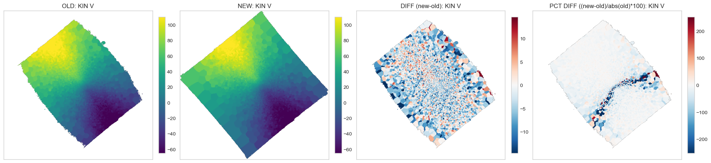


#### 3.1.2 SIGMA

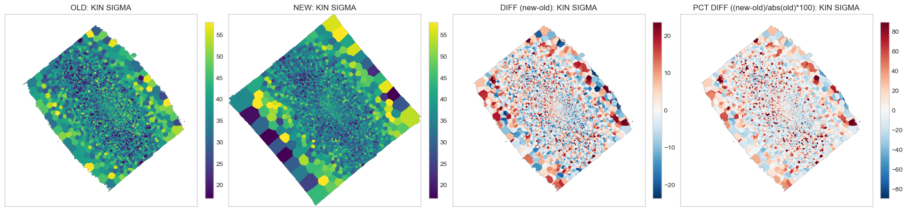


#### 3.1.3 H3

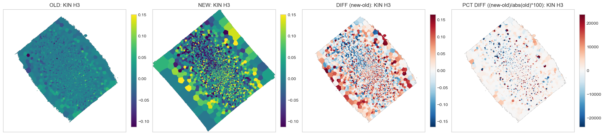


#### 3.1.4 H4

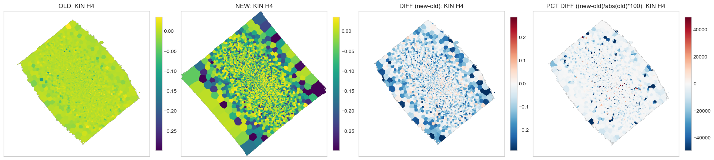


#### 3.1.5 AGE

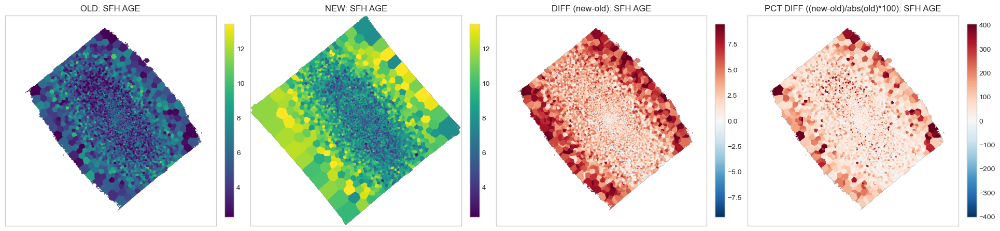


#### 3.1.6 METAL

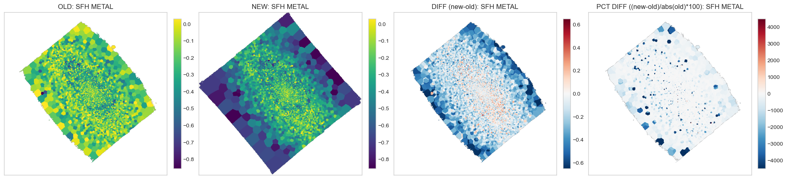


#### 3.1.7 EBV

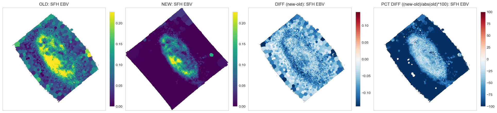


#### 3.1.8 HB4861_FLUX

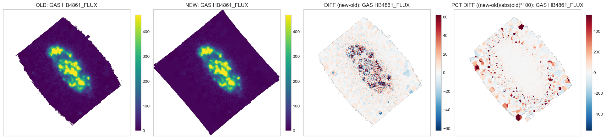


#### 3.1.9 OIII5006_FLUX

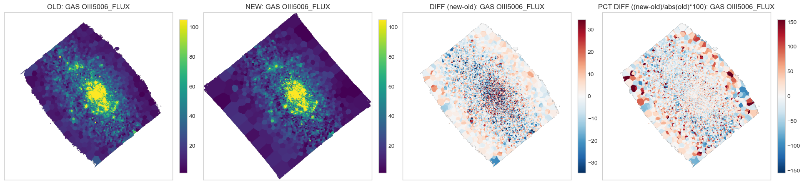


#### 3.1.10 NII6548_FLUX

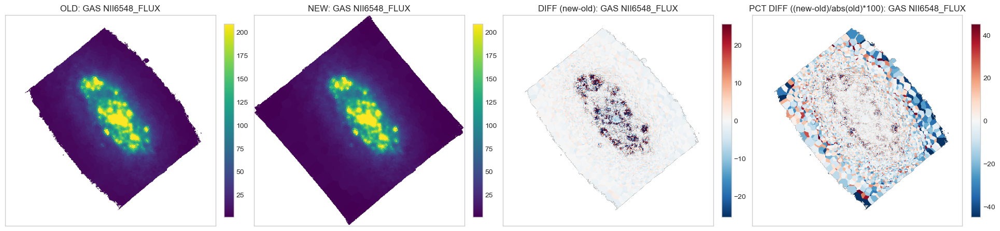


#### 3.1.11 HA6562_FLUX

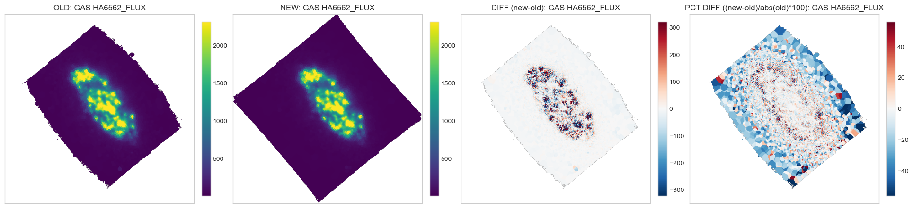


#### 3.1.12 SII6716_FLUX

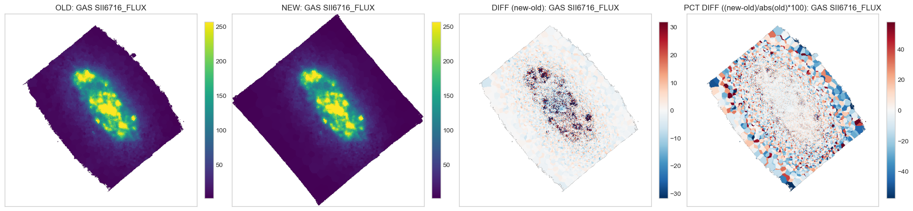


#### 3.1.13 SII6730_FLUX

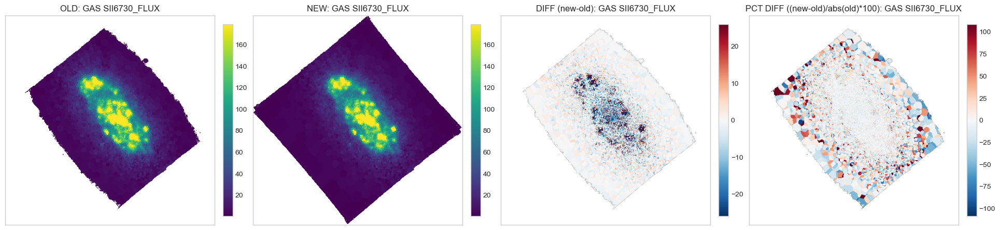


### 3.2 NGC4383

#### 3.2.1 V

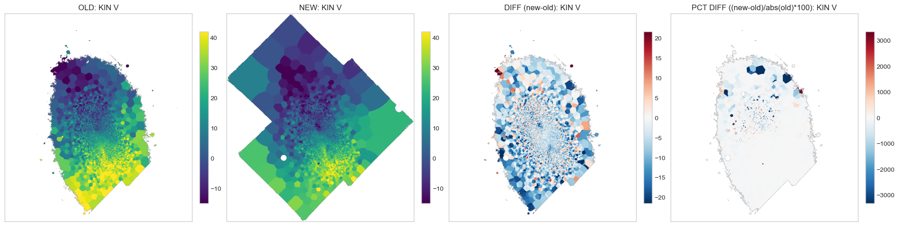


#### 3.2.2 SIGMA

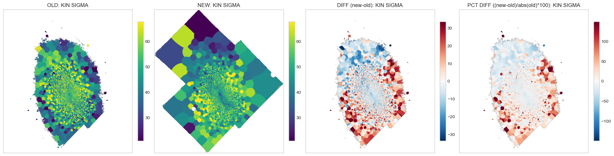


#### 3.2.3 H3

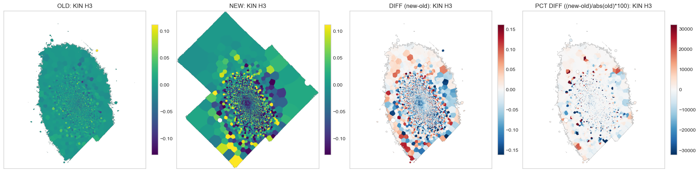


#### 3.2.4 H4

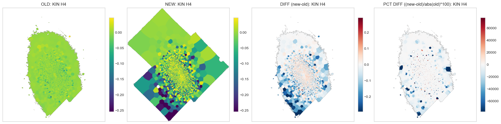


#### 3.2.5 AGE

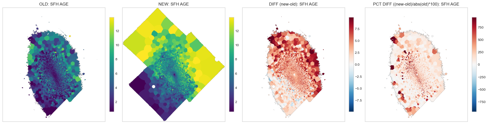


#### 3.2.6 METAL

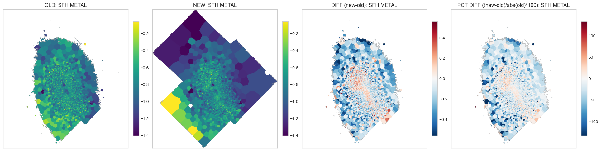


#### 3.2.7 EBV

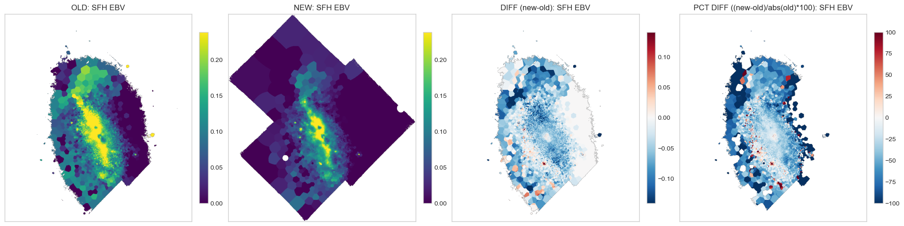


#### 3.2.8 HB4861_FLUX

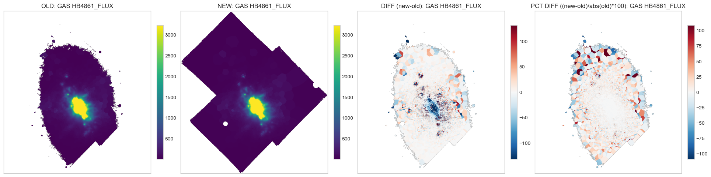


#### 3.2.9 OIII5006_FLUX

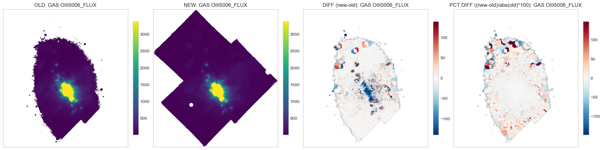


#### 3.2.10 NII6548_FLUX

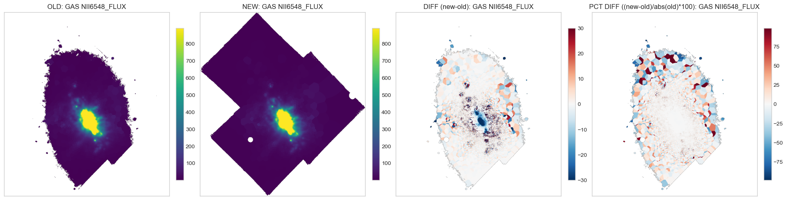


#### 3.2.11 HA6562_FLUX

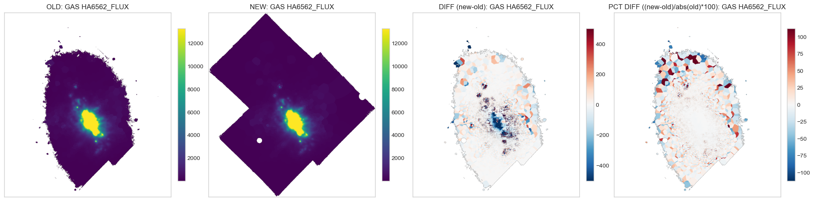


#### 3.2.12 SII6716_FLUX

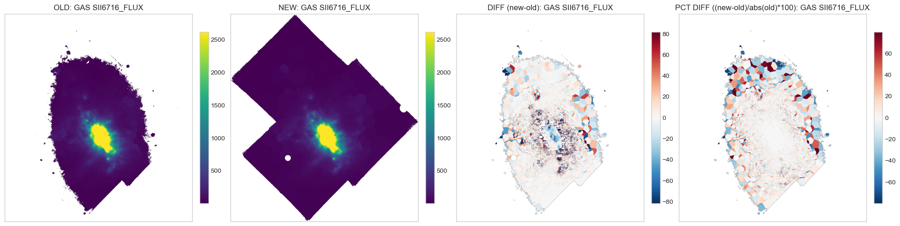


#### 3.2.13 SII6730_FLUX


### 3.3 NGC4419

#### 3.3.1 V

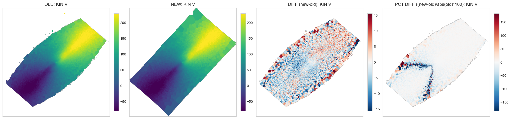


#### 3.3.2 SIGMA

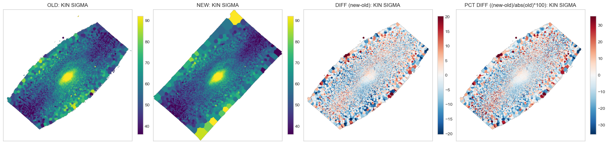


#### 3.3.3 H3

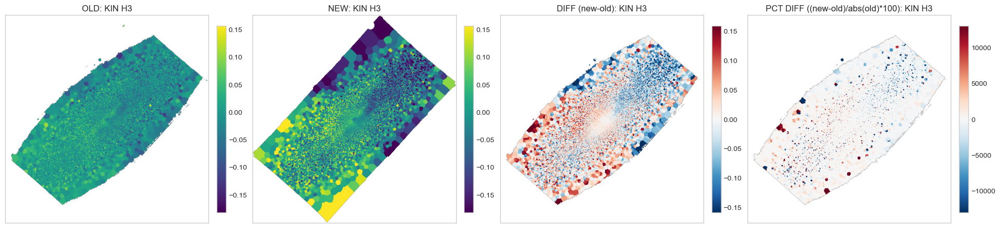


#### 3.3.4 H4

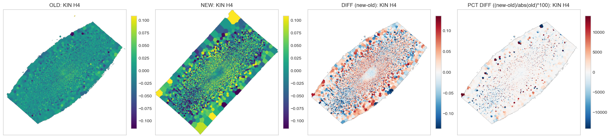


#### 3.3.5 AGE

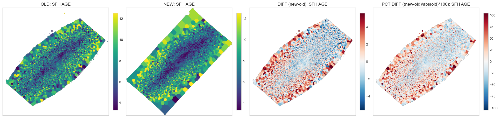


#### 3.3.6 METAL

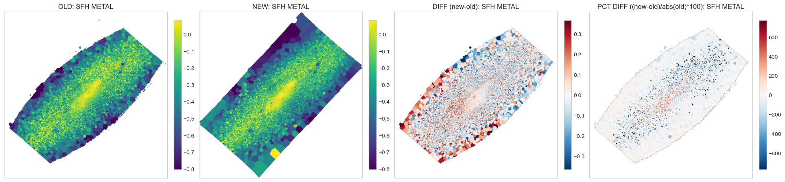


#### 3.3.7 EBV

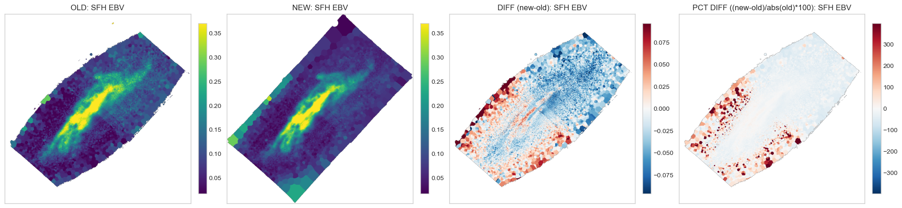


#### 3.3.8 HB4861_FLUX

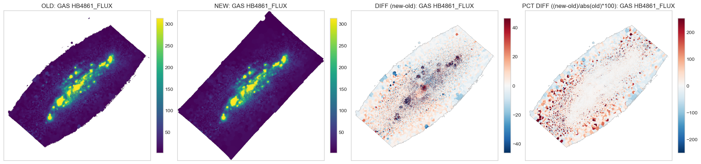


#### 3.3.9 OIII5006_FLUX

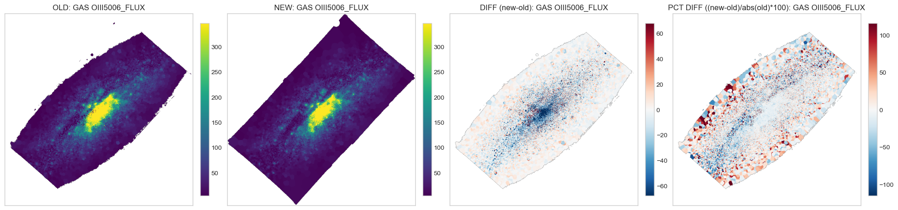


#### 3.3.10 NII6548_FLUX


#### 3.3.11 HA6562_FLUX

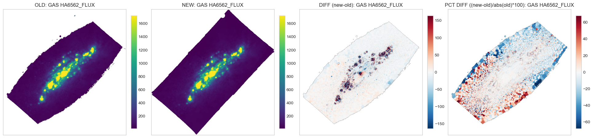


#### 3.3.12 SII6716_FLUX


#### 3.3.13 SII6730_FLUX

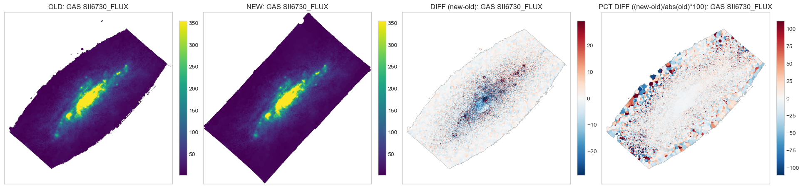

