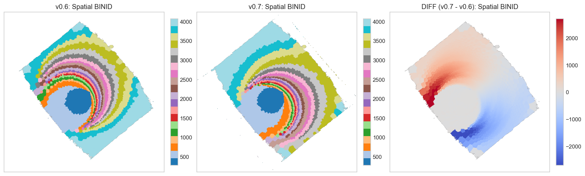
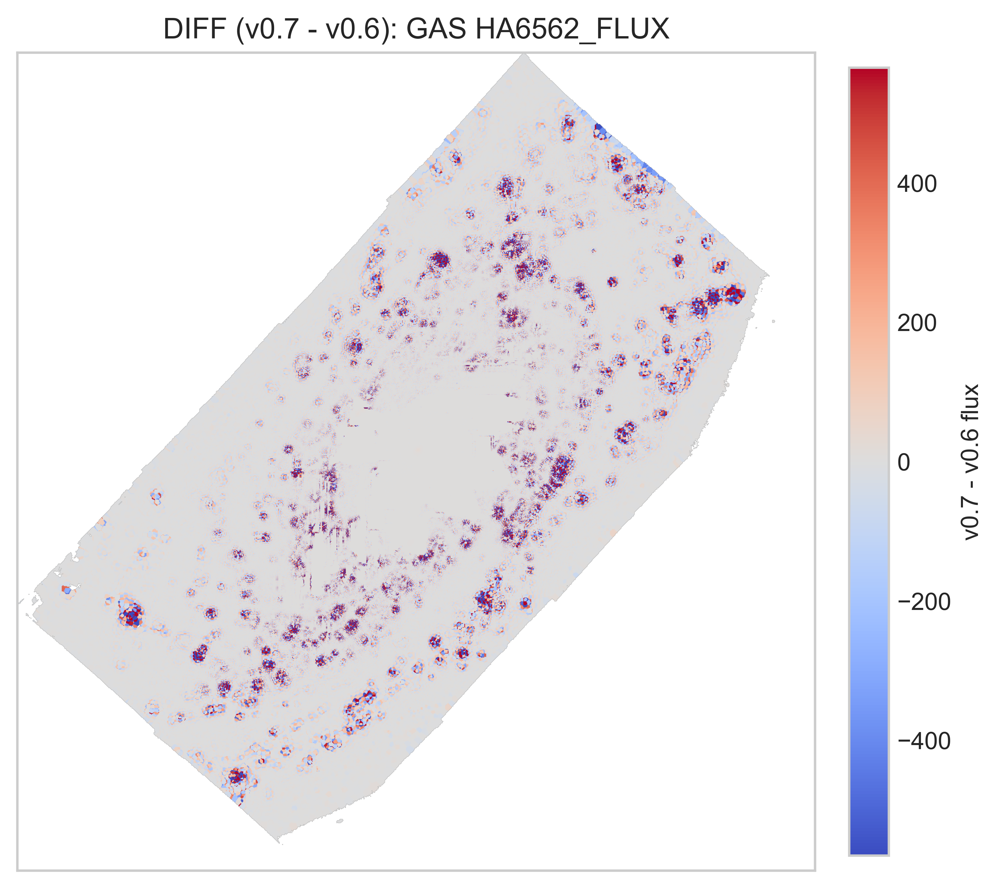

# 20260502 v0.6 and v0.7 comparison

First, for IC3392, I need to flag that it seems to be a binning issue. There are extra structures in new map. 

And then in gas flux, for NGC4501, it seems the residual map show some spiral arm structure. If you zoom in, you can see both negative and positive flux differences with similar fractions, so I think it indicates that there are more deviations in spiral arm regions.  

