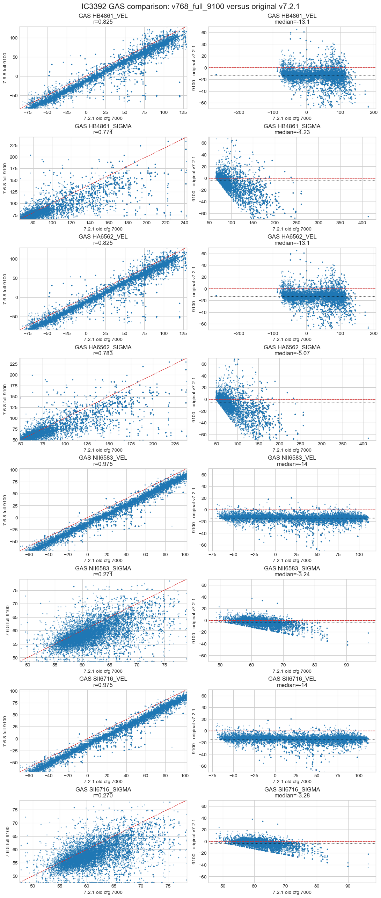
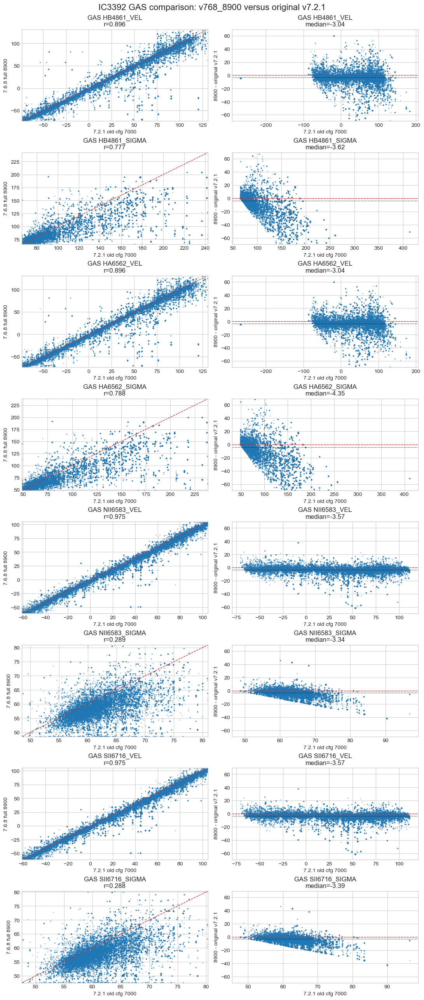
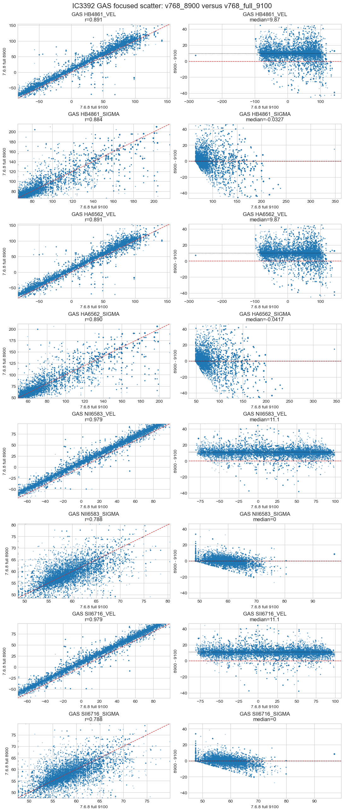

# 20260505 IC3392 GAS kinematics including 8900 test

Here we test whether the unusual gas kinematic behaviour changes when the standard v7.6.8 setup is fit over `4800-8900 A` instead of `4800-9100 A`, while keeping `VELSCALE = 41`.

Primary comparison:

```
grid_range_test = v768_8900 - v768_full_9100
```

If the log-rebin/grid hypothesis is prominent, the 8900 run should differ from the original 9100 run even though the setup is otherwise the same standard `v7.6.8` setup.

And the results confirm that the `GAS` kinematic solution is sensitive to the log-rebinned wavelength grid / fitting range.

Relative to the `v721_7000` run, recalling that the original full `4800-9100 A` run gives a coherent negative GAS velocity offset: about `-13 km/s` for `HB4861`/`HA6562` and about `-14 km/s` for `NII6583`/`SII6716`. 



Here, swithcing to `4800-8900 A`, the offset relative to `v721_7000` drops to only about `-3 km/s` for `HB4861`/`HA6562` and `-4 km/s` for `NII6583`/`SII6716`.



The isolation test is `v768_8900 - v768_full_9100`: even with the same standard setup, same full emission-line file, and `VELSCALE = 41`, changing only the wavelength end from `9100 A` to `8900 A` shifts the `GAS` velocity maps by about `+10 km/s` for `HB4861`/`HA6562` and `+11 km/s` for `NII6583`/`SII6716`. 



Ok, does it means emission lines are narrow features so that small changes in the rebinned wavelength solution can propagate into somewhat kind of coherent velocity offsets? But how can 8900-9100 region become so wrong (can be further verified by fitting everything upto 9100 but excluding [S III] line)? And then the next question is how can we fix this because we still need [S III]? 