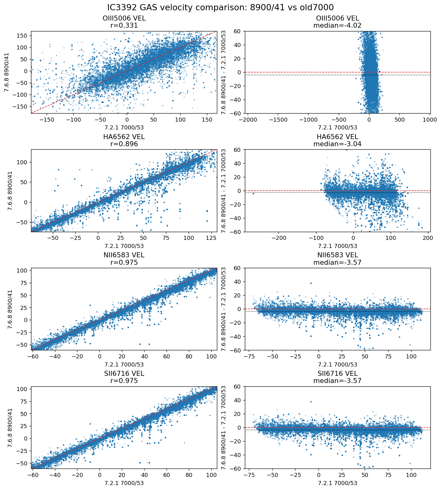
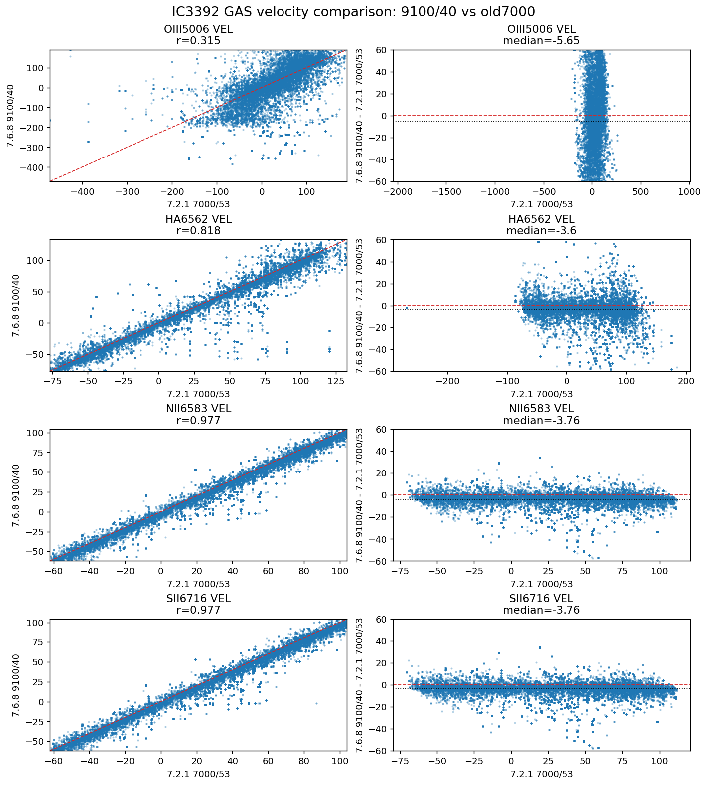
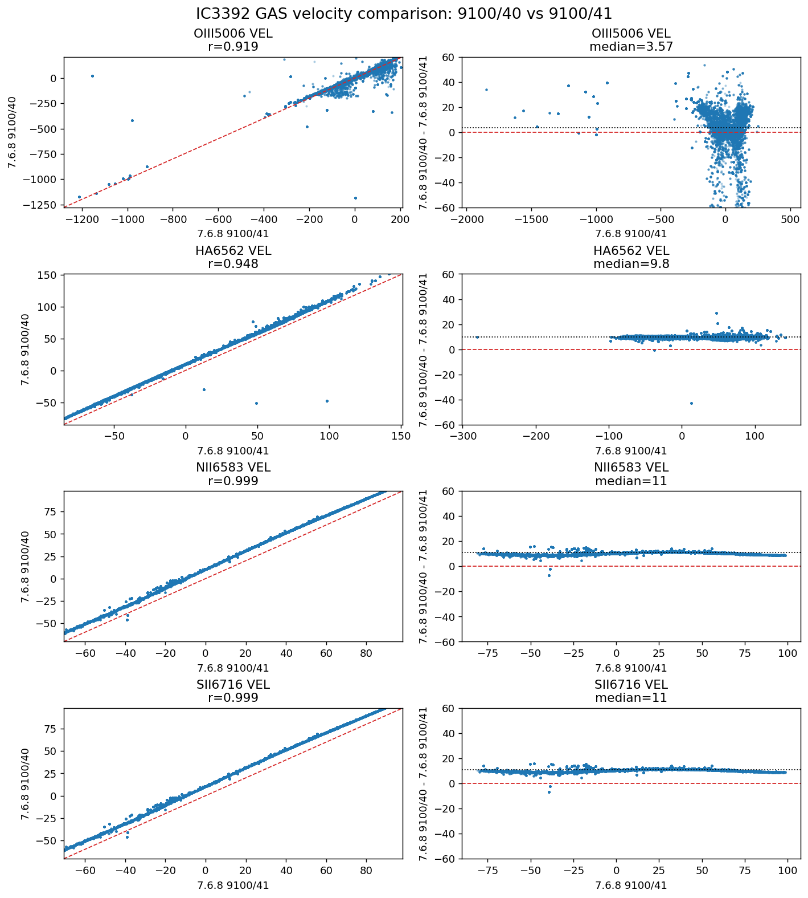
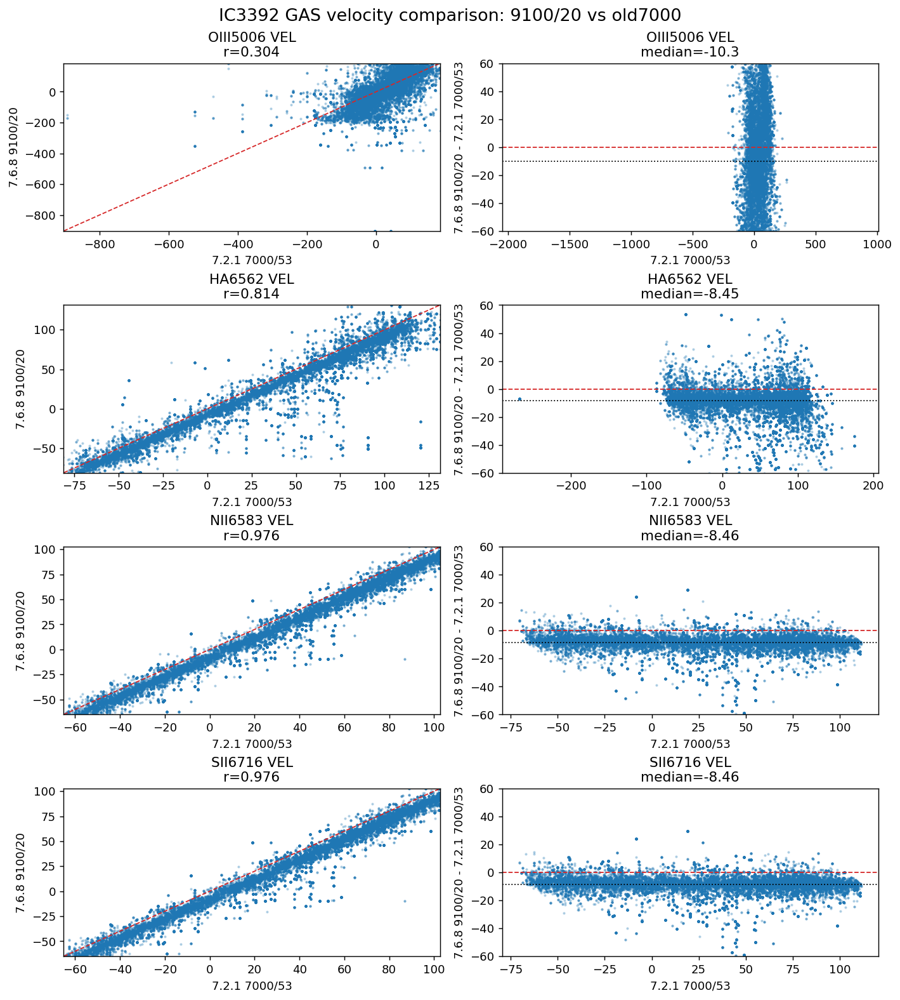
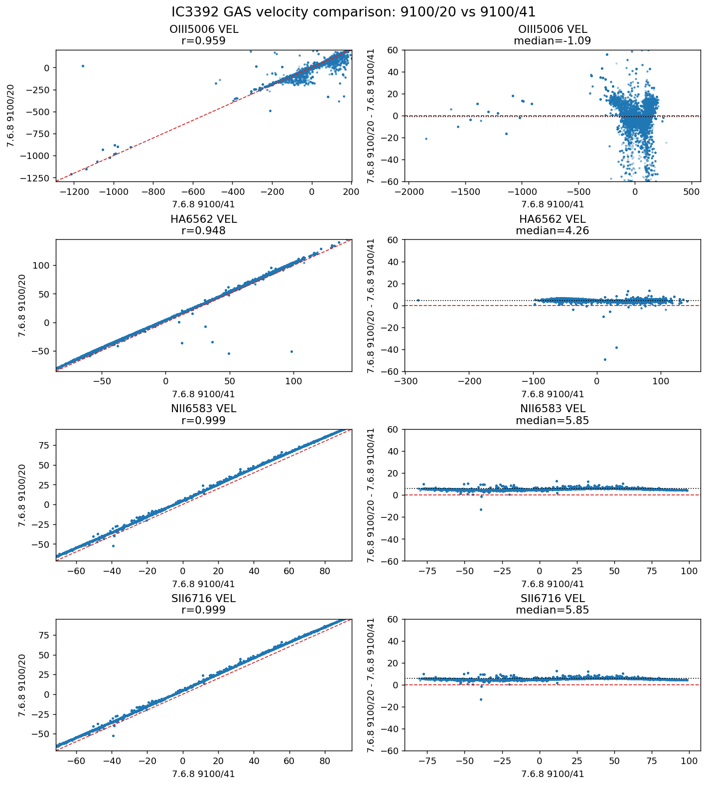
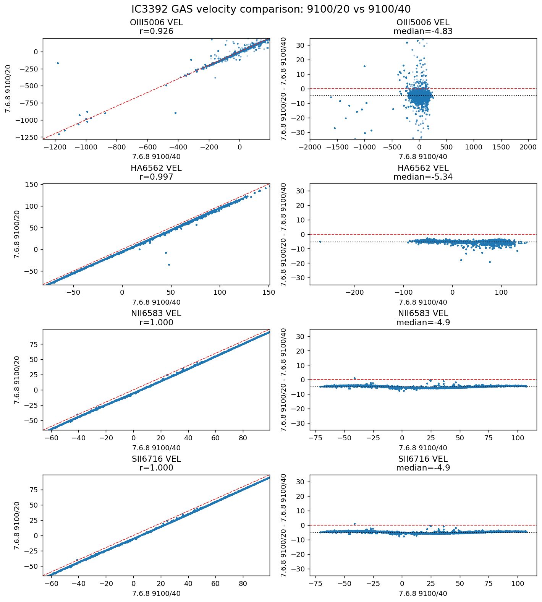

# 20260506 IC3392 GAS kinematics: VELSCALE=40 and VELSCALE=20 tests

Here we compares IC3392 GAS kinematics across the old 7000-A reference and the full 9100-A v7.6.8 tests with different log-rebin velocity scales.

Runs compared here:

- `old_v721_7000`: original v7.2.1 7000-A reference, `VELSCALE = 53`
- `v768_8900_41`: v7.6.8 full-red-line setup to 8900 A, `VELSCALE = 41`
- `v768_9100_41`: v7.6.8 full-red-line setup to 9100 A, `VELSCALE = 41`
- `v768_9100_40`: v7.6.8 full-red-line setup to 9100 A, `VELSCALE = 40`
- `v768_9100_20`: v7.6.8 full-red-line setup to 9100 A, `VELSCALE = 20`

First, recall that `v768_8900_41` shows nice agreements with `old_v721_7000`: all gas velocity offsets are $-3\sim-4$ km/s, which are similar to stellar velocity offset.  But keep an eye on [O III] line (also for the following comparison plots), it becomes much more messy in pairwise scatter plot and the deviation is slightly higher. This is probably due to we tie [S III] line's kinematics with it. 

Then, if we take `v768_9100_40`, it also shows nice agreements with the old run. 

We also compare  `v768_9100_40` with `v768_9100_41`. The [O III] line fitting is kind of self-consistent here, so maybe confirms that including [S III] fitting is risky. 

Finally, we show the oversampling `v768_9100_20` vs `old_v721_7000`. I am surprised to see that it improves relative to the problematic `9100/41`, **but** it does not converge onto the better `v768_9100_20` solution. So oversampling alone is not monotonically better and the actual log-rebin placement still matters.

Additionally, we have `v768_9100_20` vs `v768_9100_41` and  `v768_9100_20` vs `v768_9100_40` in the end. 

