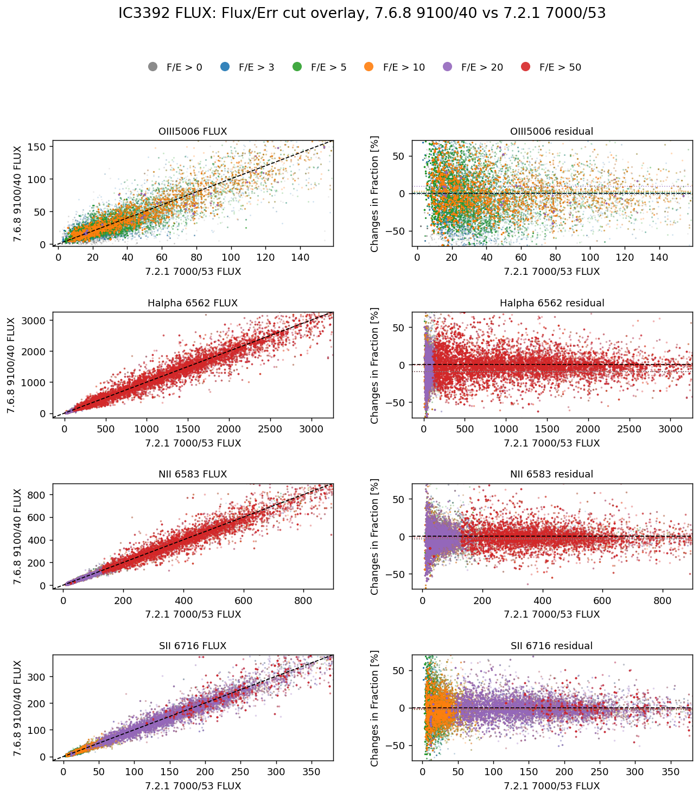
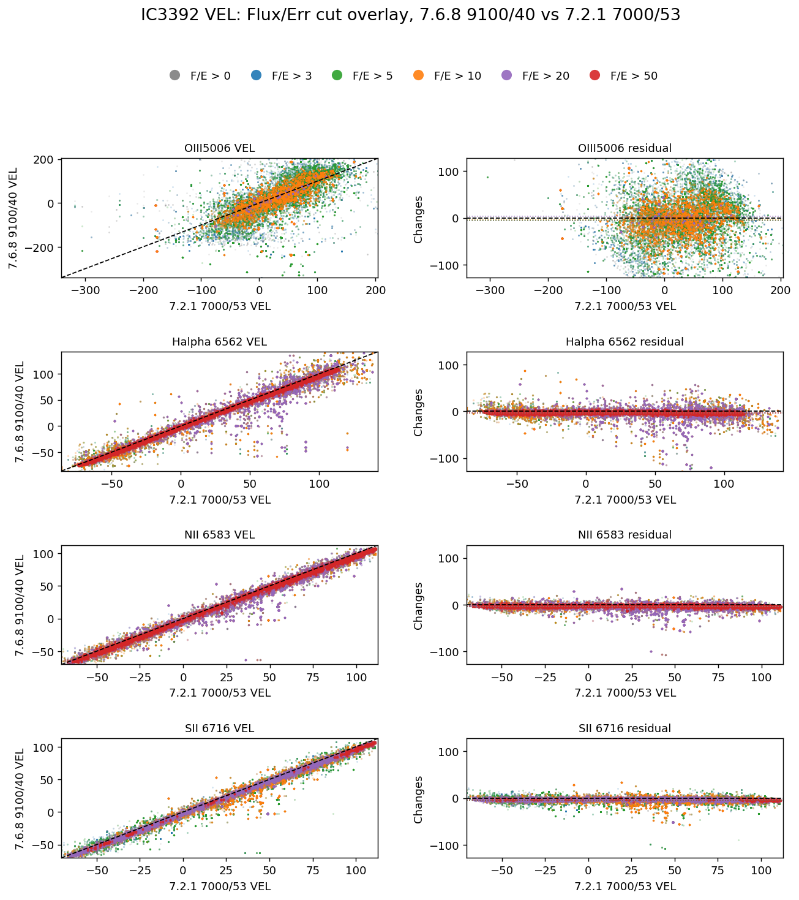
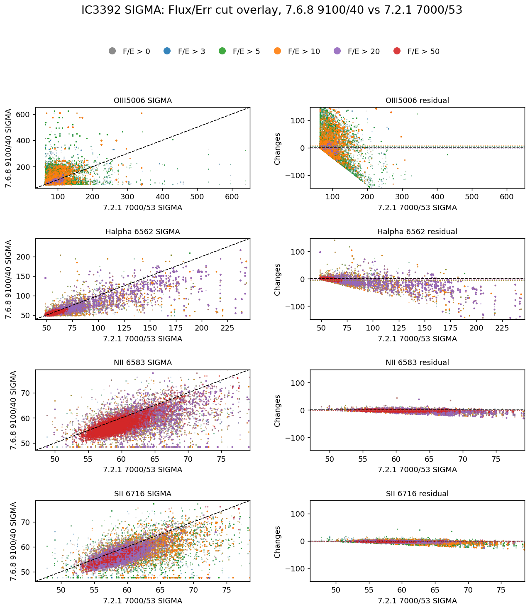
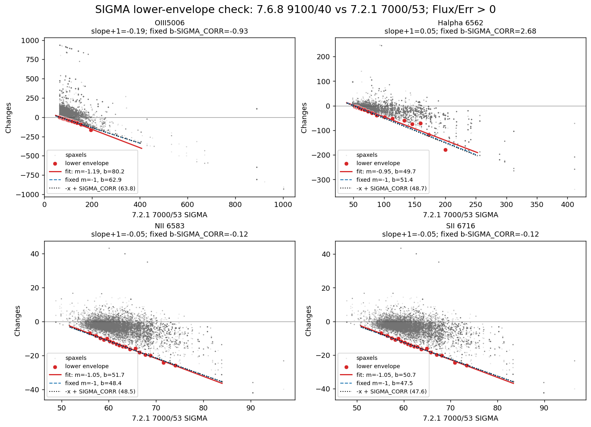

# 20260507 IC3392 GAS pairwise Flux/Error cut test

Here we focus only on `v768_9100_40` versus the old `v721_7000_53` reference.

- x axis: `old_v721_7000`, `7.2.1 7000/53`
- y axis: `v768_9100_40`, `7.6.8 9100/40`
- gas lines: `OIII5006`, `HA6562`, `NII6583`, `SII6716`
- each figure: 4 rows by 2 columns, with pairwise scatter on the left and residuals on the right

Note that for `FLUX` residual panels: y values are fractional change in percentage [%]:  (`v768_9100_40` - `v721_7000_53`) / (`v721_7000_53`); for `VEL` and `SIGMA` residual panels: y-axis remains `v768_9100_40` minus `v721_7000_53`.  

And we try color them in `Flux/Err` > 0, > 3, > 5, > 10, > 20 and > 50. 

From the pairwise plots, the `FLUX` comparison remains scattered at all tested `Flux/Err` cuts. Even the high-`Flux/Err` groups do not really form a clean 1:1 relation. This suggests that the deviations between `9100/40` and the old `7000/53` reference are not controlled only by low-S/N spaxels. They may also reflect differences in continuum subtraction, wavelength range, line fitting, or the way the two runs distribute flux between nearby/tied components.

For `VEL` and `SIGMA`, the trend is clearer: higher `Flux/Err` cuts produce a tighter 1:1 relation. This supports the idea that the kinematic comparison is strongly `Flux/Err` dependent. Low-`Flux/Err` spaxels add much of the scatter, while high-`Flux/Err` spaxels are more stable, especially in `VEL`.

Additionally, the `SIGMA` residual plots also show a boundary-like feature. The lower envelope appears to follow a diagonal relation like `y = k x - b`, or more simply a near `-1` slope boundary. A plausible interpretation is that this boundary is set by a lower allowed velocity-dispersion floor in the `v768_9100_40` run. In that case, the intercept should be simply the instrumental dispersion. And the following test confirms my idea:

