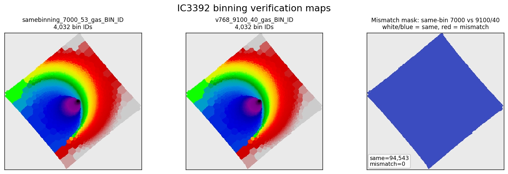
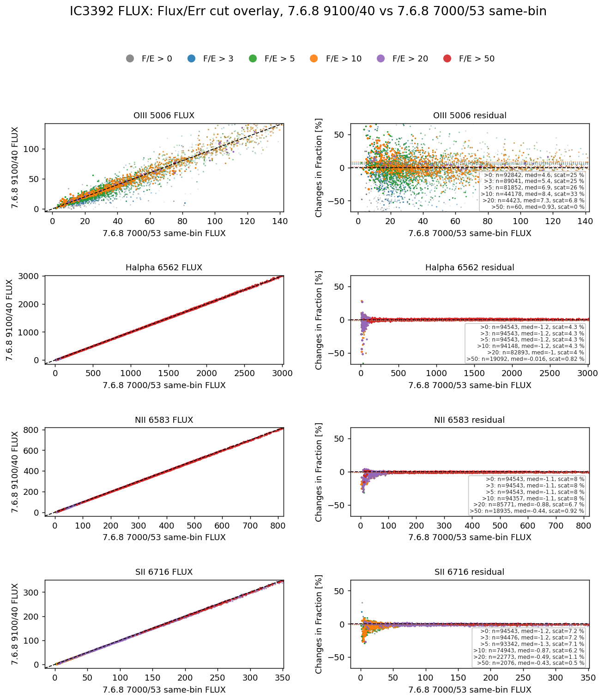
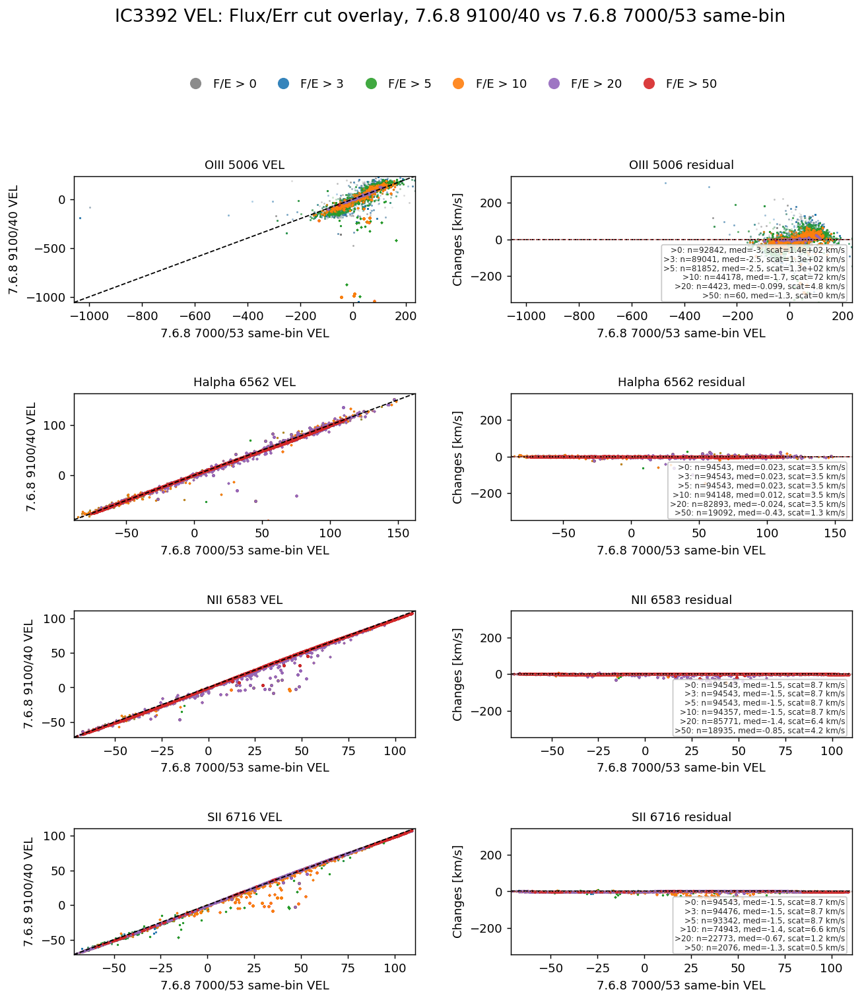
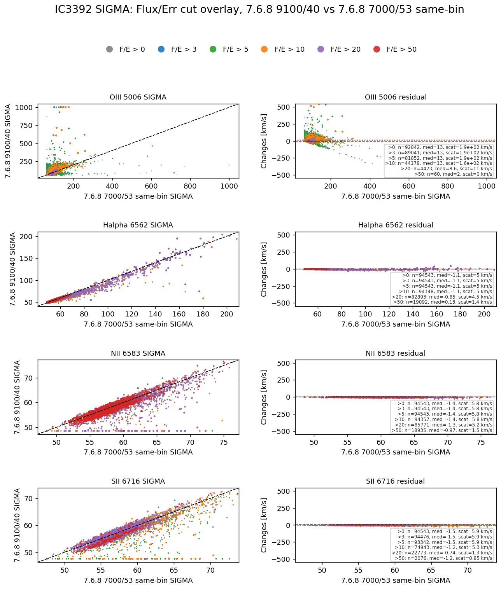
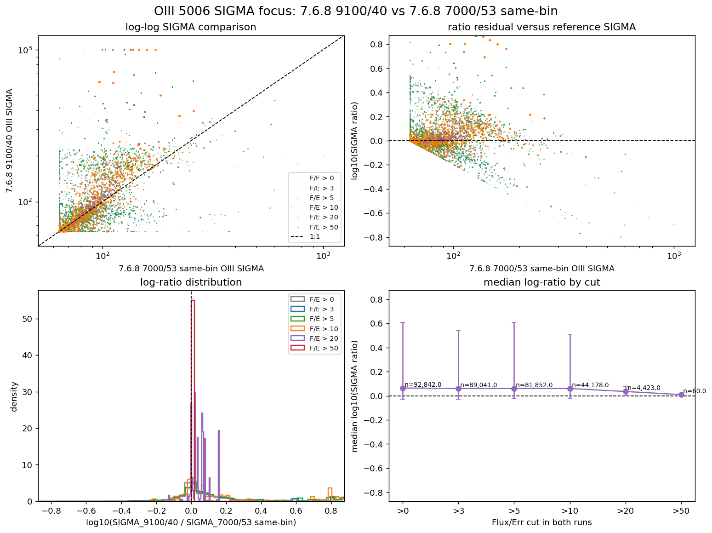

# 20260510 IC3392 GAS pairwise Flux_Error cut test in same binning

Here we redo the pairwise `GAS` comparison after adding the `v3tk_v7.6.8_7000_samebinning` run, and so we change the reference run to match the same binning scheme as `v7.6.8` runs:

- x axis / reference: `7.6.8 7000/53 same-bin`
- y axis / comparison: `7.6.8 9100/40`
- gas lines: `OIII5006`, `HA6562`, `NII6583` and `SII6716`
- each pairwise figure: 4 rows by 2 columns, with pairwise scatter on the left and residuals on the right

First, we verify that they are now truely in the same binning sacheme:

 

And clearly, with same binning scheme, all seem to follow the 1:1 relation, even velocity dispersion, though there are still a few outliers and [O III] still looks ugly. 

Below i also show the plot that focus on [O III]'s `SIGMA`:

