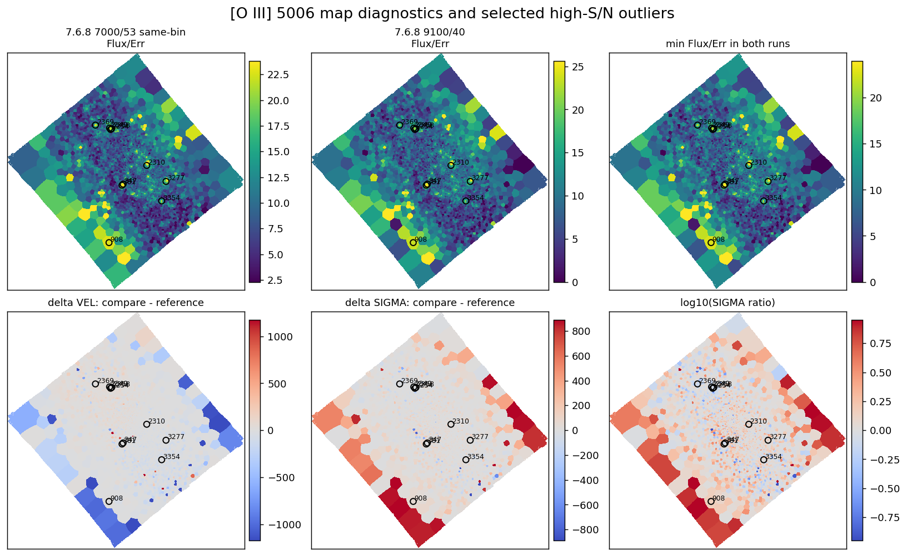
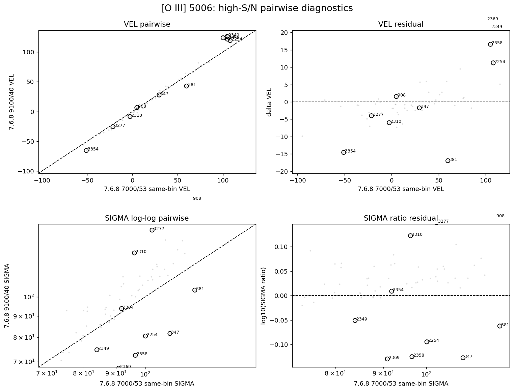
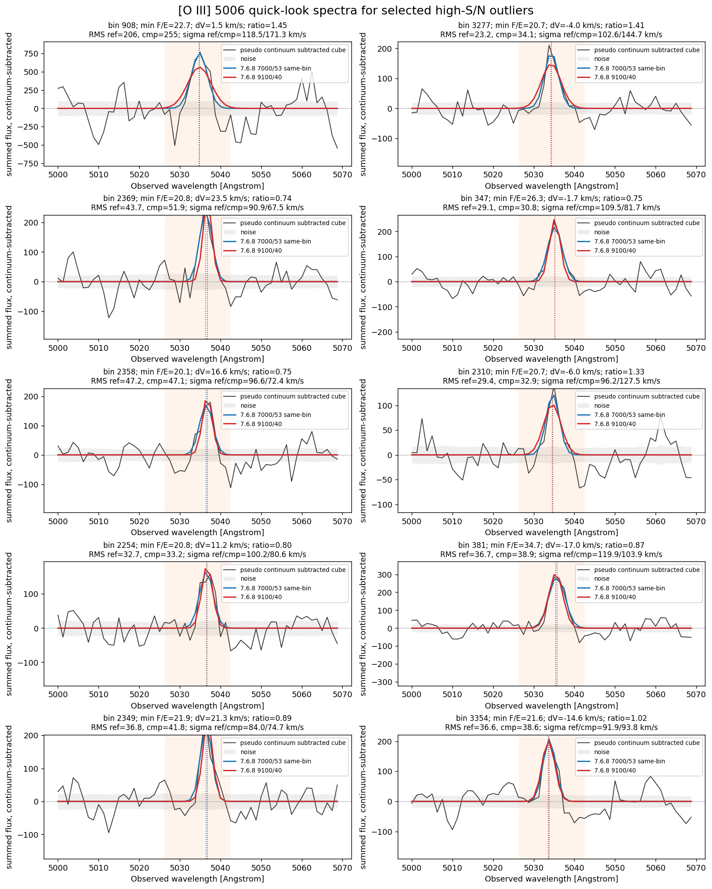
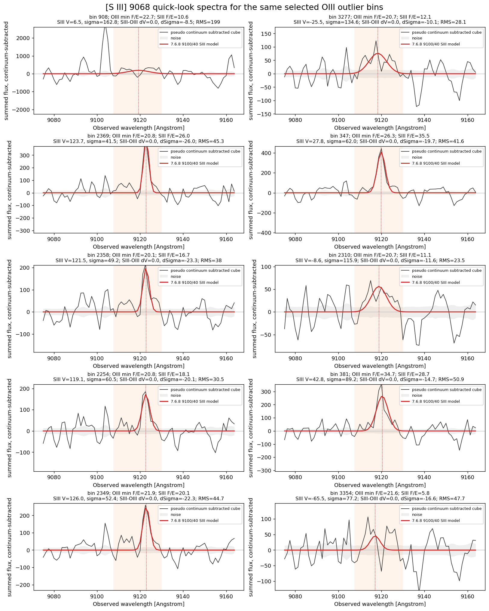
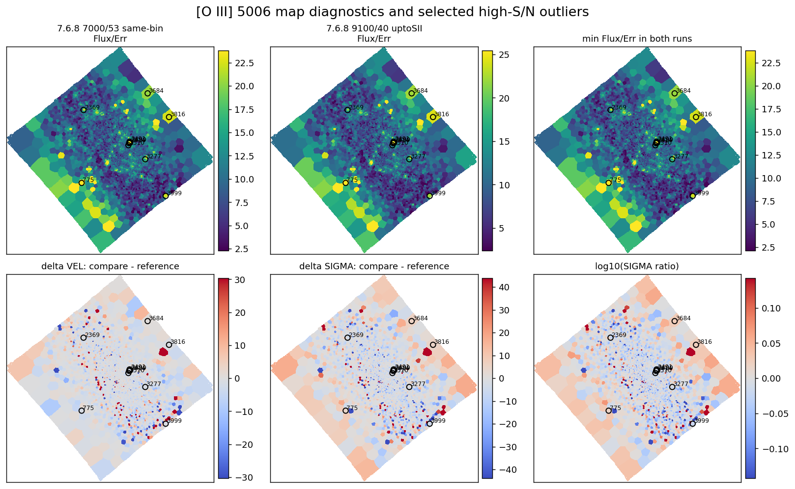
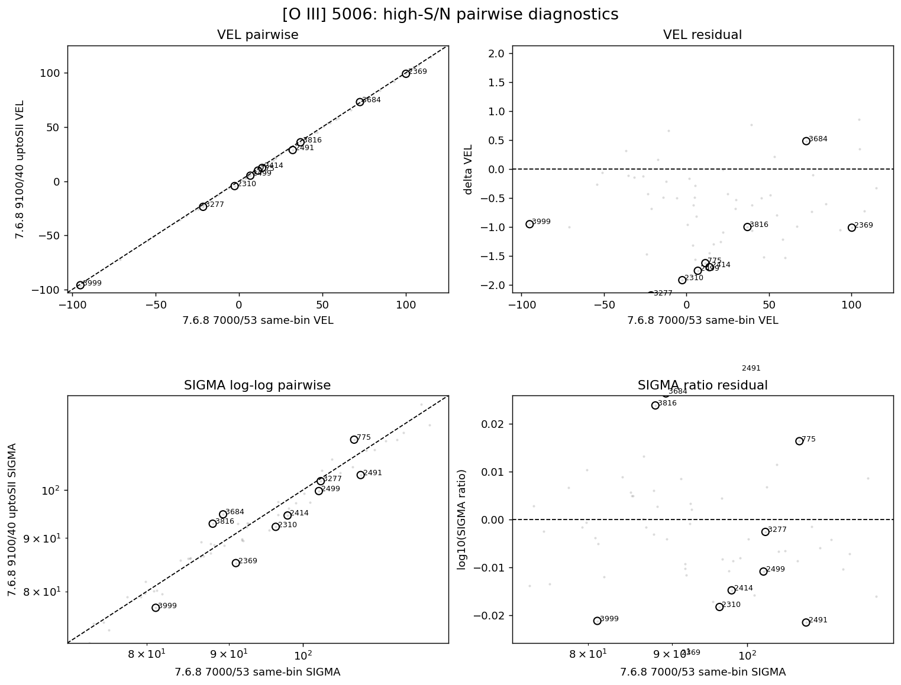
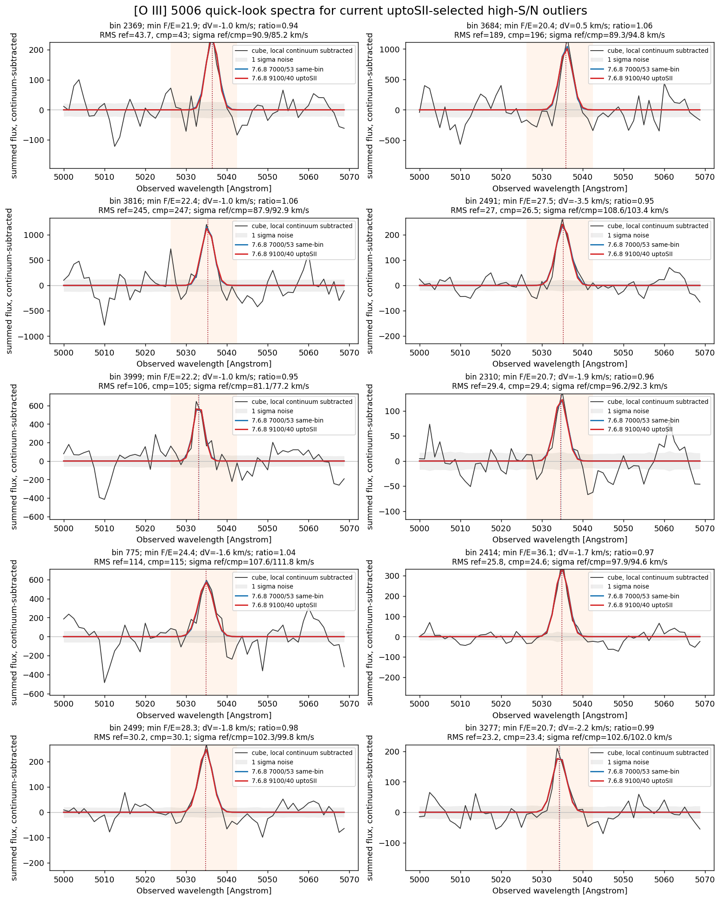
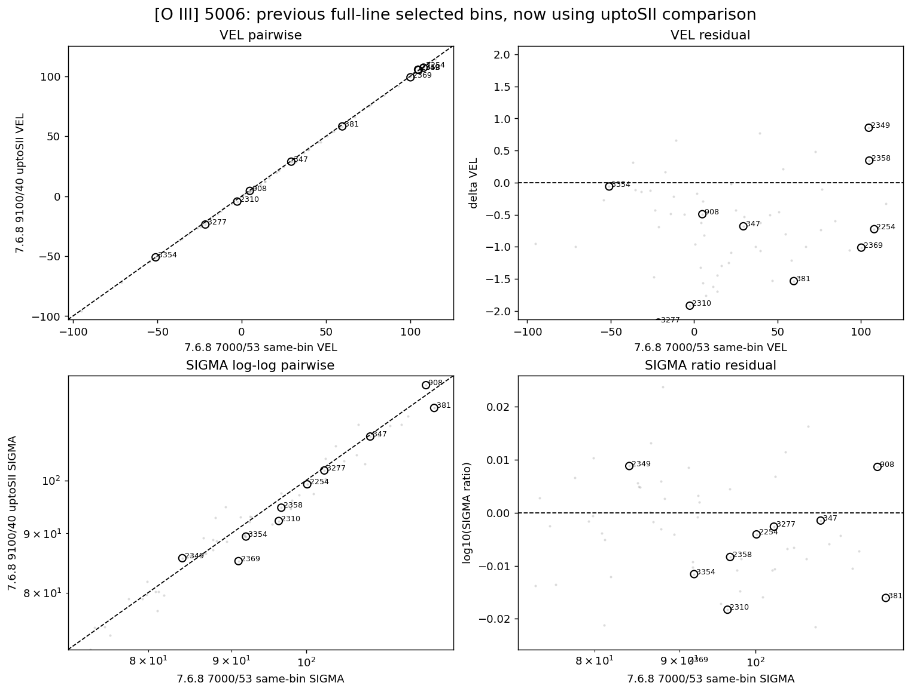
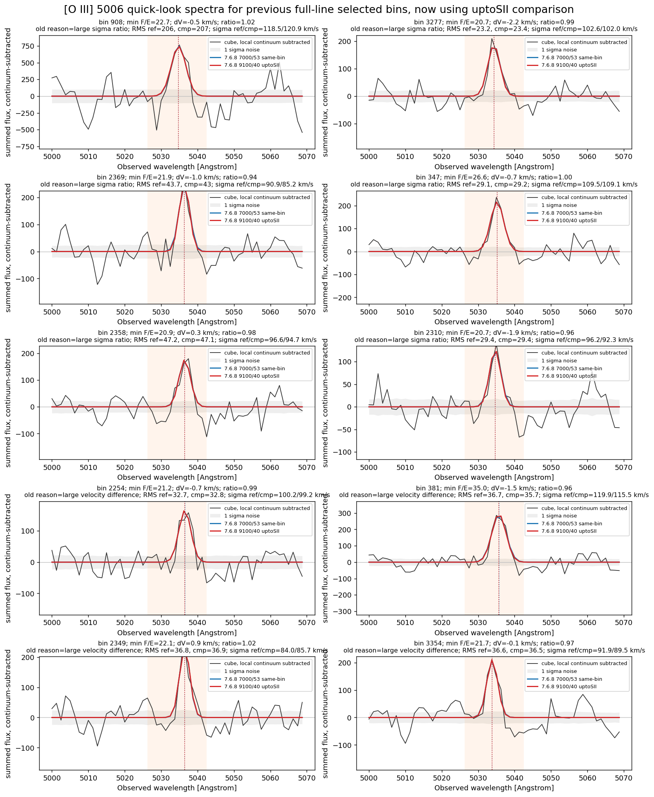

# 20260511 IC3392 OIII5006 high Flux_Err outlier inspection

## 1. [O III] $\mathrm{Flux/Err}>20$ outliers

Here we isolate `OIII5006` bins where the two same-binning runs disagree strongly in velocity or sigma, then check whether the suspicious bins look like ordinary noisy [O III] behavior or whether one run is visibly worse.

Runs compared here:

* reference / x axis: `7.6.8 7000/53 same-bin`
* comparison / y axis: `7.6.8 9100/40`

First, we set our working sample to bins with `Flux/Err > 20` in both runs (59 in total), and we pick 10 bins with largest `abs(log10 sigma ratio)` and the largest `abs(delta velocity)`. Below is their locations. 

Then, we can show their pairwise and residual plots. All seems not that bad as the most deviation is still within 20%. 

Next, we want to inspect the goodness of the `ppxf` fitting. Here we construct the psudo continuum-subctrated spectrum of each bin by subtracting the original datacube's spectrum by average continuum near `OIII5006`, while Gaussian line models are adopted by corresponding `OIII5006_VEL` and `OIII5006_SIGMA`. 

Obviously, all bins' results do not match well, especially the first two bins: `908` and `3227` (and potentially `2310`). In `7.6.8 9100/40`, it seems that `ppxf` tend to fit a shorter but wider (i.e. higher dispersion) Gaussian than the reference `7.6.8 7000/53 same-bin`. 

The plausible reason is that we tie some faint lines' kinematic to `OIII5006` and `ppxf` try to fit all the lines simultaneously. Hence, some marginally detected or problematic faint lines may bias the fitting of the tied `OIII5006`. 

And, indeed, when we inspecting the spectra near `SIII9068` of `7.6.8 9100/40` run, it seems to confirm our idea. 

## 2. **uptoSII gas-line test**

Then we test whether removing the very red/faint gas lines from the `7.6.8 9100/40` `GAS` fit (i.e. we fit up to `SII6730`, and so the only differences are the input spectrum range and polynomial degree, and therefore the continuum subctraction) makes the OIII kinematics and sigma move back toward the `7.6.8 7000/53 same-bin` reference. Hence, two runs compared here are:

* reference / x axis: `7.6.8 7000/53 same-bin`
* comparison / y axis: `7.6.8 9100/40 uptoSII`

Similarly, we can still pick the 10 most deviated bins between these two runs, and clearly, much smaller deviations than the previous comparison. 

But the most important thing is to reuse 10 previously selected bins to see their behaviours under the current comparison. As expected, they now match perfectly.

Therefore, we need to be careful when including these faint lines' fitting. 