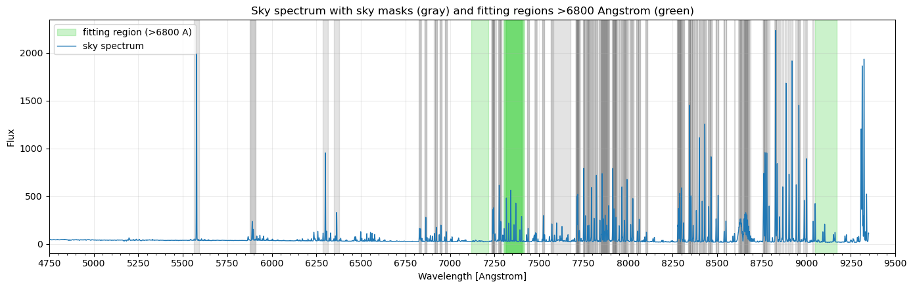
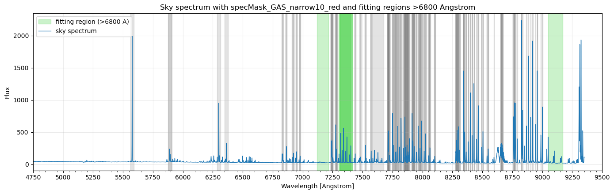
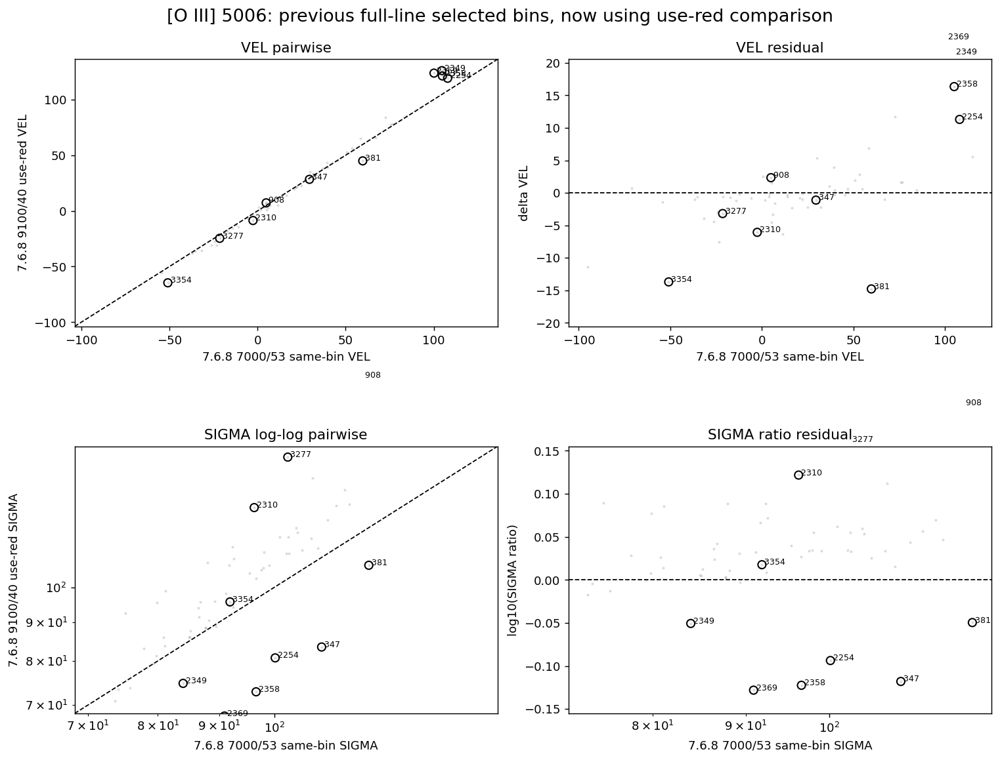
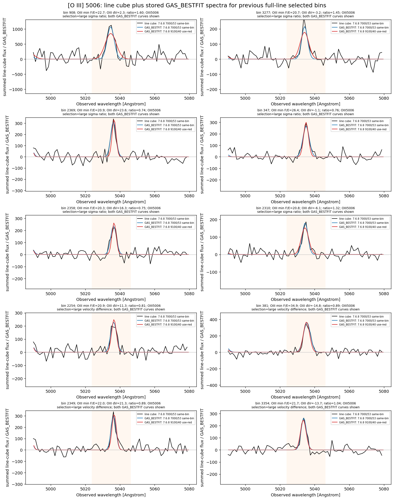
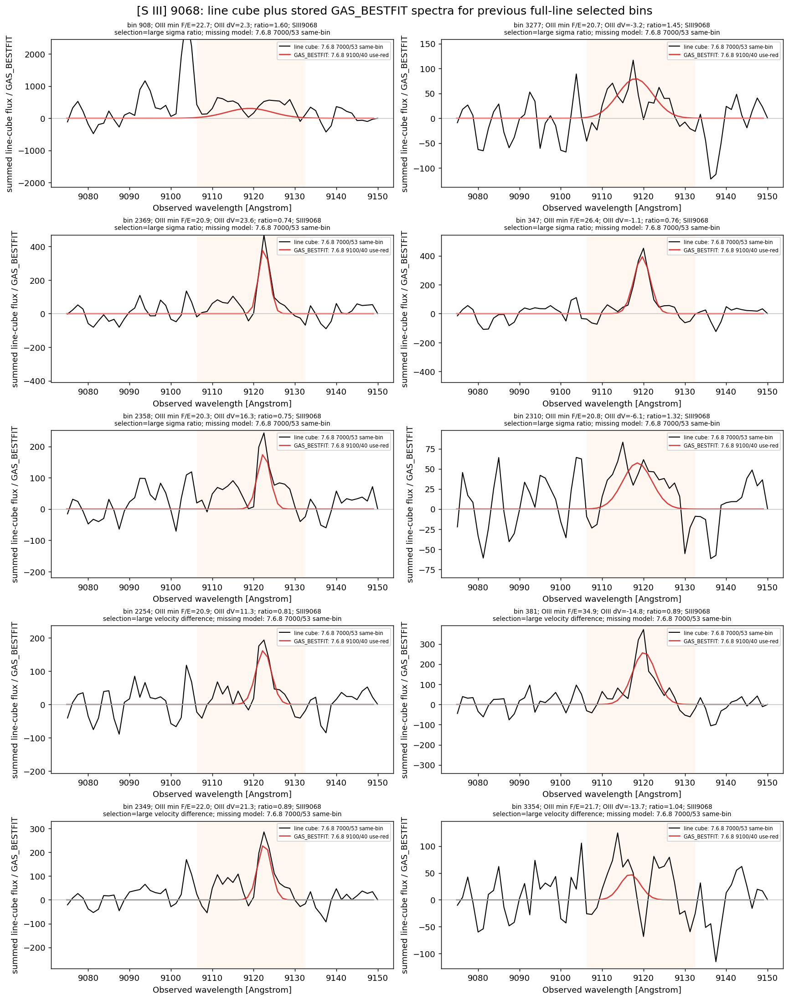

# 20260517 Original spectral masking for spectra higher than 8250A

Here we test if the `9100/40` rerun keeps the used-line gas list, including `SIII9068`, but relaxes the red-end ($>8250\AA$) spectral masking via `specMask_GAS_narrow10_red`, the `OIII5006` high-S/N outlier behavior should show whether the relative velocity and sigma residuals persist against the `7000/53 same-bin` reference.

First, we show the spectral masking of previous `specMask_GAS_narrow10` and `specMask_GAS_narrow10_red`. The updates are:

- $6800 < \lambda \leq 8250\AA$: still uses `specMask_KIN_narrow10`.
- $\lambda > 8250\AA$: uses the original `specMask_KIN` red sky masks, preserving 5 Angstrom widths.
- No extra detected-peak masks from `specMask_KIN_narrow10` are added above $8250\AA$.
- Protected emission line fitting regions (green) are still left unmasked.

Then, we check those 10 selected bins. Unfortunately, this method still cannot fix the biased [O III]$\lambda5007$ kinematics issue.

So we should think about the potential way to really fix this. 

One is just easily modifying the `ngist`'s wrapper to make it adapt more gas fitting components so that we can fit those faint but useful lines in `free` mode and so does not affect `OIII5006`'s kinematics.  

The other is that we still input 9100 spectra but only fit up to $\mathrm{[O\ II]}\lambda\lambda7320,30$, and then for the regions that `SIII6312` is detected, we do an extra `ppxf` fitting for it to include `SIII9068`. For this approach, we need to be careful with two kinematics outcomes of `SIII6312`: one ties to `OIII5006` and the other ties to `SIII9068`. I think we may fix the kinematics of the extra fitting as the outcome of previous one, but doing so may also require modification on `ngist`.  