# 20260518 SFH and Stellar Mass Check

## 1. IC3392

### 1.1 IC3392 E(B-V) and stellar mass maps.

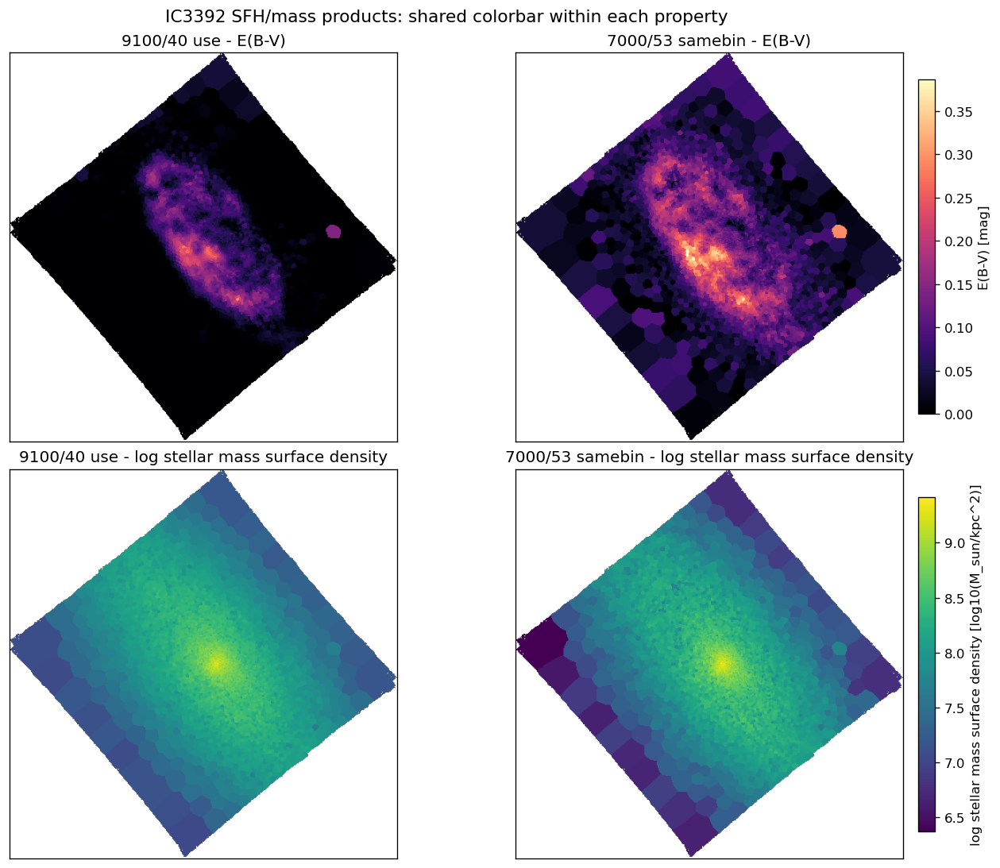

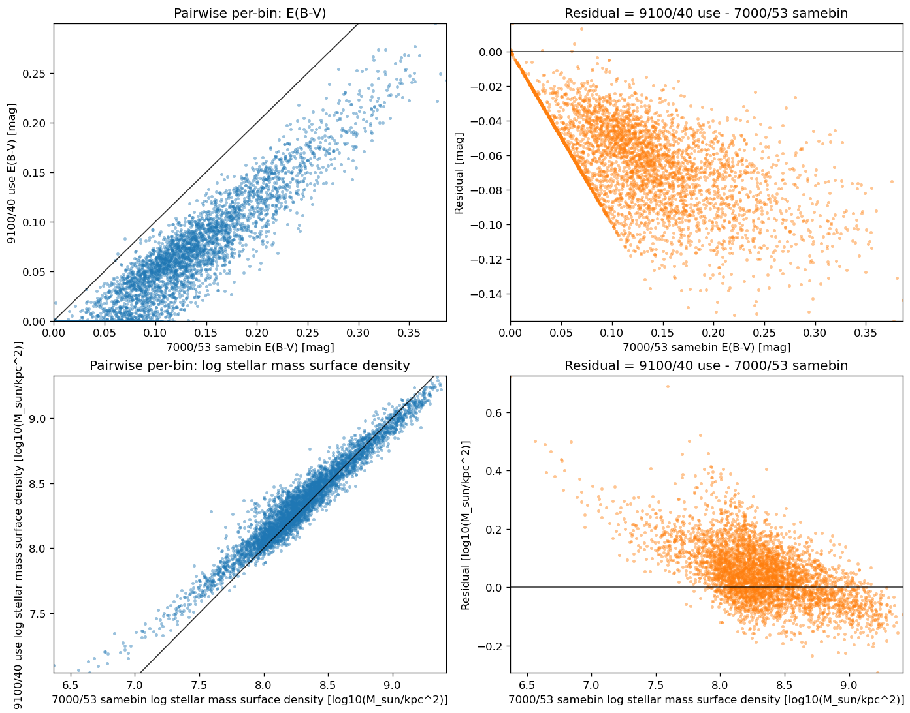

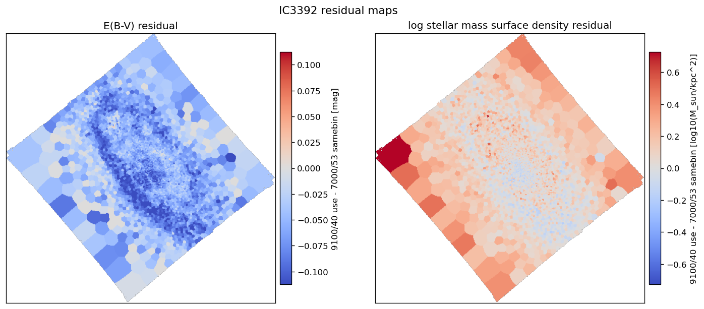

### 1.2 IC3392 SFH weights: Age and stellar metallicity [M/H]

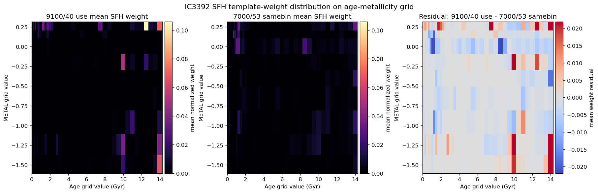

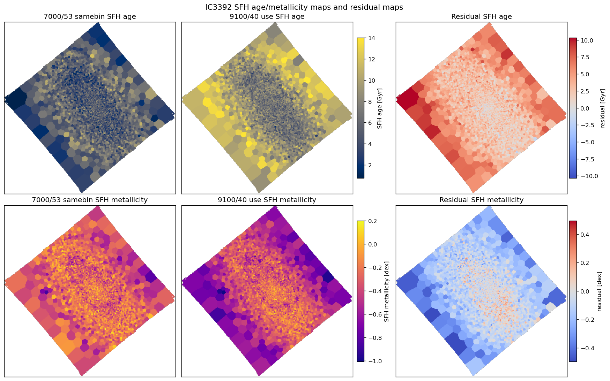

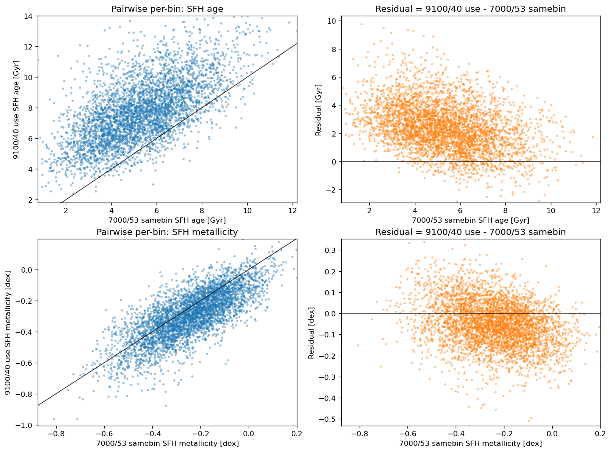

### 1.3 IC3392 Integrated values comparison

<table border="1" class="dataframe">
  <thead>
    <tr style="text-align: right;">
      <th></th>
      <th>quantity</th>
      <th>7000/53 samebin</th>
      <th>9100/40 use</th>
      <th>9100/40 use - 7000/53 samebin</th>
      <th>unit</th>
    </tr>
  </thead>
  <tbody>
    <tr>
      <th>0</th>
      <td>Total R-band magnitude (uncorrected)</td>
      <td>12.2600</td>
      <td>12.2600</td>
      <td>0.000</td>
      <td>mag AB</td>
    </tr>
    <tr>
      <th>1</th>
      <td>Total R-band magnitude (corrected)</td>
      <td>11.8650</td>
      <td>12.0770</td>
      <td>0.212</td>
      <td>mag AB</td>
    </tr>
    <tr>
      <th>2</th>
      <td>Total R-band luminosity</td>
      <td>9.5330</td>
      <td>9.4480</td>
      <td>-0.085</td>
      <td>log10(Lsun)</td>
    </tr>
    <tr>
      <th>3</th>
      <td>Total stellar mass (R)</td>
      <td>9.7210</td>
      <td>9.7790</td>
      <td>0.058</td>
      <td>log10(Msun)</td>
    </tr>
    <tr>
      <th>4</th>
      <td>Integrated stellar M/L_R</td>
      <td>1.5402</td>
      <td>2.1402</td>
      <td>0.600</td>
      <td>Msun/Lsun</td>
    </tr>
  </tbody>
</table>
### 1.4 IC3392 Sumary

For `E(B-V)`, the two maps have very similar spatial structure, but the `9100/40 use` run is systematically lower than the `7000/53 samebin` run: the median value shifts from `0.1168 mag` in `7000/53 samebin` to `0.0560 mag` in `9100/40 use`. Almost all common bins move downward: `3986 / 4032` bins have negative residuals, only `7` bins are positive, and `39` are exactly zero. 

For `LOGMASS_SURFACE_DENSITY`, the median surface density changes from `8.2787 dex` in `7000/53 samebin` to `8.3433 dex` in `9100/40 use`. 

The uncorrected total R-band magnitude is identical in the two logs, `12.260 AB`. After extinction correction, however, `9100/40 use` is fainter: `12.077 AB` compared with `11.865 AB`, giving a lower total R-band luminosity by `0.085 dex`. 

The total stellar mass is higher in `9100/40 use` by `0.058 dex`, because the integrated `M/L_R` is much higher: `2.1402` compared with `1.5402 M_sun/L_sun`.

In SFH-weight-grid check, the `9100/40 use` run shifts toward older templates: the mean linear age from the weight grid increases from `5.321 Gyr` to `7.750 Gyr`, and the fraction of weight at ages `>= 8 Gyr` increases from `0.367` to `0.570`. 

The spatial `AGE` and `METAL` maps show the same trend. The median fitted age increases from `5.242 Gyr` in `7000/53 samebin` to `7.638 Gyr` in `9100/40 use`, with a median residual of `+2.324 Gyr`; `3770 / 4032` bins are older in the `9100/40 use` run. The median metallicity decreases from `-0.238 dex` to `-0.286 dex`, with a median residual of `-0.0498 dex`; `2757 / 4032` bins are more metal-poor in the `9100/40 use` run. Age is therefore the stronger coherent shift, while metallicity also moves slightly lower.

## 2. NGC4383

### 2.1 NGC4383 E(B-V) and stellar mass maps.

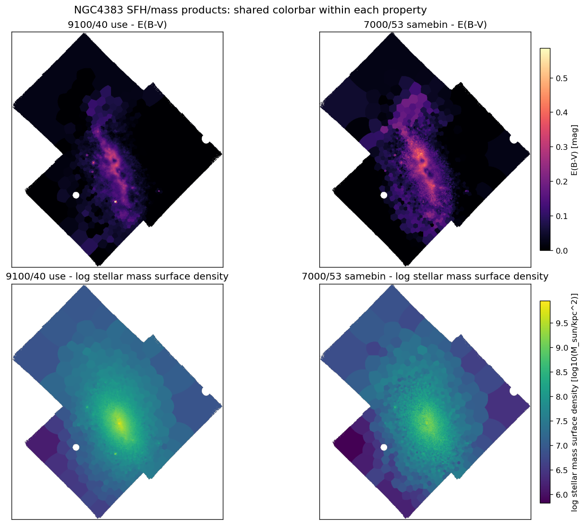

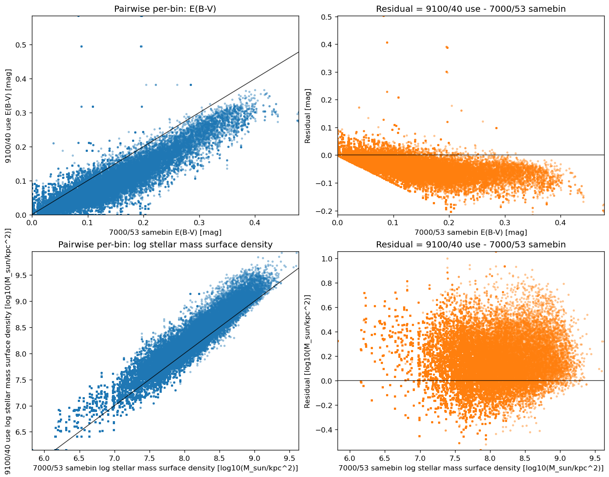

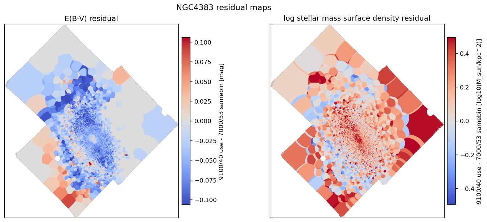

### 2.2 NGC4383 SFH weights: Age and stellar metallicity [M/H]

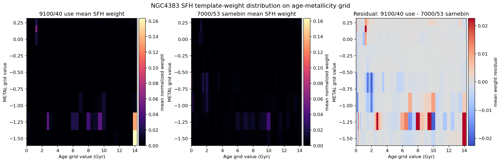

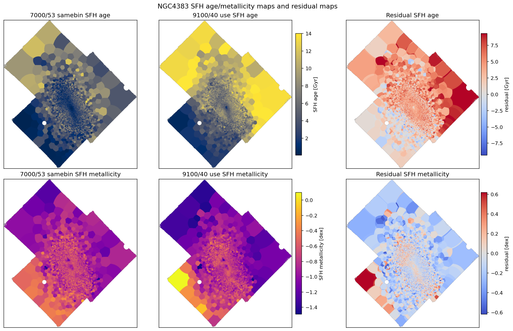

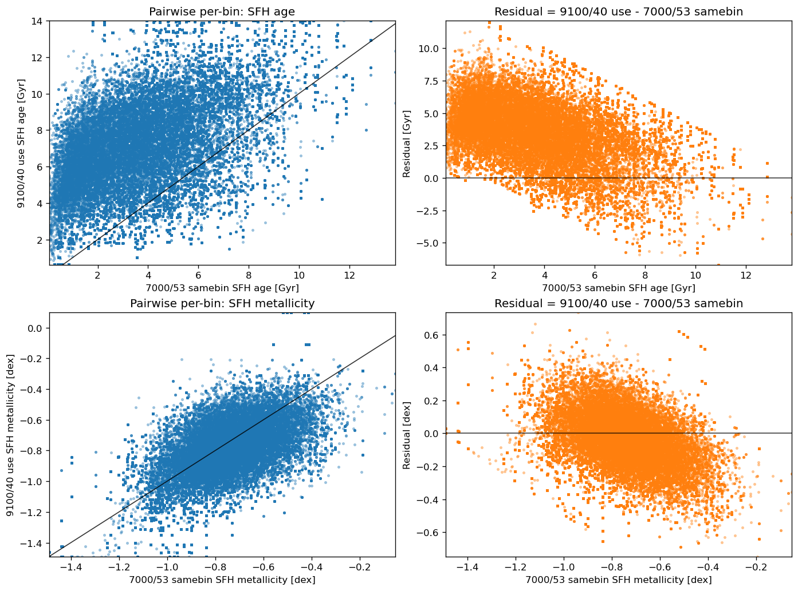

### 2.3 NGC4383 Integrated values comparison

<style scoped>
    .dataframe tbody tr th:only-of-type {
        vertical-align: middle;
    }
<table border="1" class="dataframe">
  <thead>
    <tr style="text-align: right;">
      <th></th>
      <th>quantity</th>
      <th>7000/53 samebin</th>
      <th>9100/40 use</th>
      <th>9100/40 use - 7000/53 samebin</th>
      <th>unit</th>
    </tr>
  </thead>
  <tbody>
    <tr>
      <th>0</th>
      <td>Total R-band magnitude (uncorrected)</td>
      <td>11.8420</td>
      <td>11.8420</td>
      <td>0.0000</td>
      <td>mag AB</td>
    </tr>
    <tr>
      <th>1</th>
      <td>Total R-band magnitude (corrected)</td>
      <td>11.3020</td>
      <td>11.4450</td>
      <td>0.1430</td>
      <td>mag AB</td>
    </tr>
    <tr>
      <th>2</th>
      <td>Total R-band luminosity</td>
      <td>9.7580</td>
      <td>9.7010</td>
      <td>-0.0570</td>
      <td>log10(Lsun)</td>
    </tr>
    <tr>
      <th>3</th>
      <td>Total stellar mass (R)</td>
      <td>9.6200</td>
      <td>9.7980</td>
      <td>0.1780</td>
      <td>log10(Msun)</td>
    </tr>
    <tr>
      <th>4</th>
      <td>Integrated stellar M/L_R</td>
      <td>0.7279</td>
      <td>1.2494</td>
      <td>0.5215</td>
      <td>Msun/Lsun</td>
    </tr>
  </tbody>
</table>
### 2.4 NGC4383 Sumary

For `E(B-V)`, the spatial pattern is broadly preserved but the `9100/40 use` run is lower overall. The median value changes from `0.0249 mag` in `7000/53 samebin` to `0.0243 mag` in `9100/40 use`. 

For `LOGMASS_SURFACE_DENSITY`, the median changes from `7.0749 dex` to `7.2259 dex`.

The parsed mass logs show that the uncorrected total R-band magnitude is unchanged at `11.842 AB`. After extinction correction, `9100/40 use` is fainter by `0.143 mag`, corresponding to a total R-band luminosity change of `-0.057 dex`. 

The total stellar mass changes by `0.178 dex`, and the integrated `M/L_R` changes from `0.7279` to `1.2494 M_sun/L_sun`.

In SFH weight distribution, the mean age changes from `3.022 Gyr` to `6.822 Gyr`, and the weight fraction at ages `>= 8 Gyr` changes from `0.168` to `0.450`. 

The spatial `AGE` and `METAL` products provide the map-level view of the same SFH changes. The median age changes from `4.986 Gyr` to `10.354 Gyr`. The median metallicity changes from `-0.8717 dex` to `-0.9836 dex`. 

## 3. NGC4419

### 3.1 NGC4419 E(B-V) and stellar mass maps.

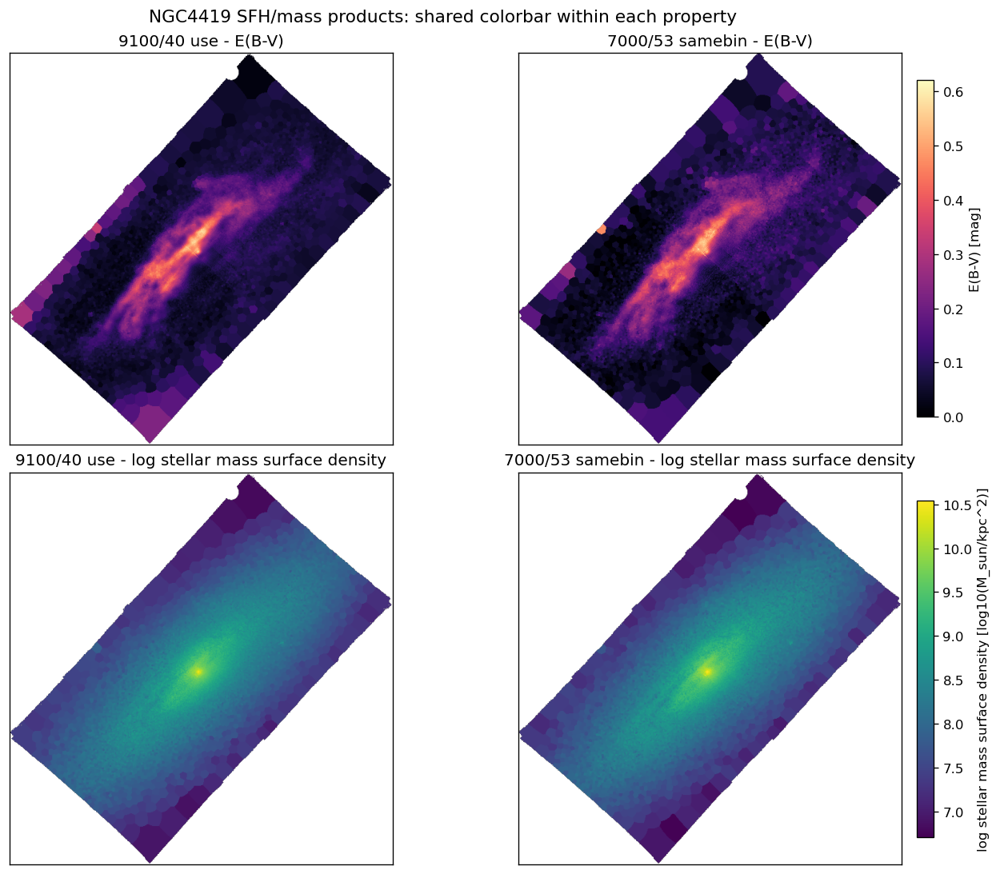

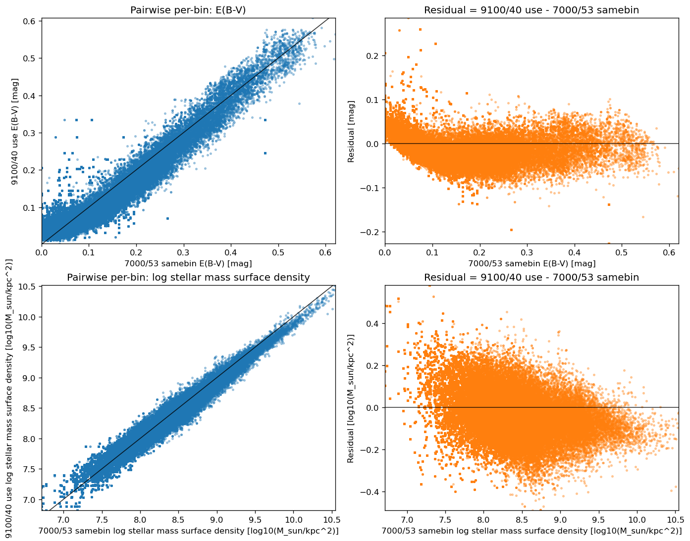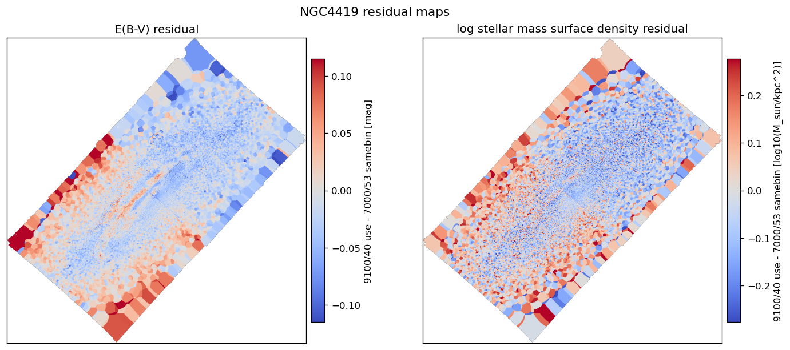

### 3.2 NGC4419 SFH weights: Age and stellar metallicity [M/H]

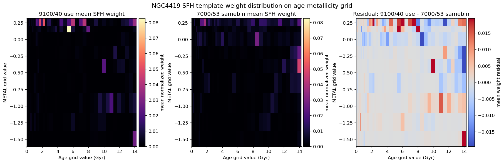

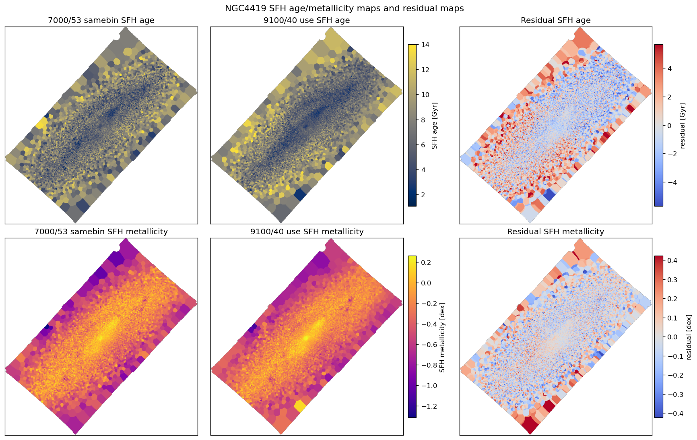

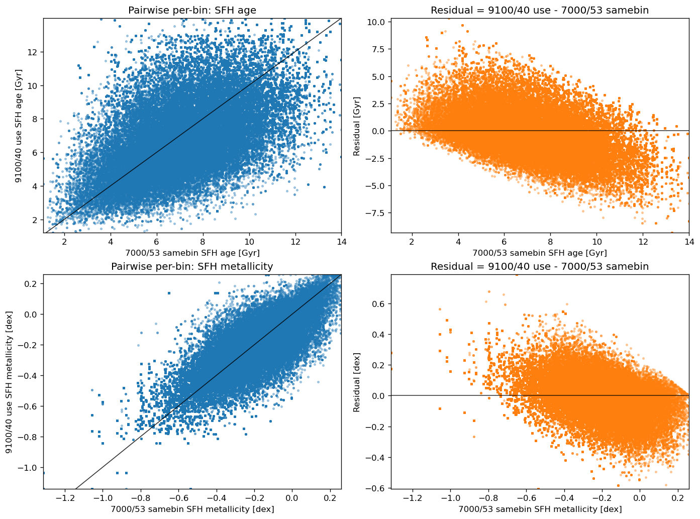

### 3.3 NGC4419 Integrated values comparison

<table border="1" class="dataframe">
  <thead>
    <tr style="text-align: right;">
      <th></th>
      <th>quantity</th>
      <th>7000/53 samebin</th>
      <th>9100/40 use</th>
      <th>9100/40 use - 7000/53 samebin</th>
      <th>unit</th>
    </tr>
  </thead>
  <tbody>
    <tr>
      <th>0</th>
      <td>Total R-band magnitude (uncorrected)</td>
      <td>10.8590</td>
      <td>10.8590</td>
      <td>0.0000</td>
      <td>mag AB</td>
    </tr>
    <tr>
      <th>1</th>
      <td>Total R-band magnitude (corrected)</td>
      <td>10.1380</td>
      <td>10.2030</td>
      <td>0.0650</td>
      <td>mag AB</td>
    </tr>
    <tr>
      <th>2</th>
      <td>Total R-band luminosity</td>
      <td>10.2240</td>
      <td>10.1980</td>
      <td>-0.0260</td>
      <td>log10(Lsun)</td>
    </tr>
    <tr>
      <th>3</th>
      <td>Total stellar mass (R)</td>
      <td>10.5090</td>
      <td>10.4540</td>
      <td>-0.0550</td>
      <td>log10(Msun)</td>
    </tr>
    <tr>
      <th>4</th>
      <td>Integrated stellar M/L_R</td>
      <td>1.9295</td>
      <td>1.8032</td>
      <td>-0.1263</td>
      <td>Msun/Lsun</td>
    </tr>
  </tbody>
</table>
### 3.4 NGC4419 Sumary

For `E(B-V)`, the spatial pattern is broadly preserved but the `9100/40 use` run is lower overall. The median value changes from `0.0896 mag` in `7000/53 samebin` to `0.0754 mag` in `9100/40 use`. 

For `LOGMASS_SURFACE_DENSITY`, the median changes from `7.8453 dex` to `7.8497 dex`. 

The parsed mass logs show that the uncorrected total R-band magnitude is unchanged at `10.859 AB`. After extinction correction, `9100/40 use` is fainter by `0.065 mag`, corresponding to a total R-band luminosity change of `-0.026 dex`. The total stellar mass changes by `-0.055 dex`, and the integrated `M/L_R` changes from `1.9295` to `1.8032 M_sun/L_sun`.

In SFH weight grids: the mean age changes from `6.608 Gyr` to `6.064 Gyr`, and the weight fraction at ages `>= 8 Gyr` changes from `0.431` to `0.293`. 

The spatial `AGE` and `METAL` products provide the map-level view of the same SFH changes. The median age changes from `7.759 Gyr` to `8.061 Gyr`. The median metallicity changes from `-0.3495 dex` to `-0.3435 dex`. 

