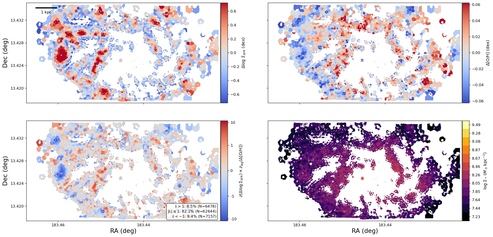
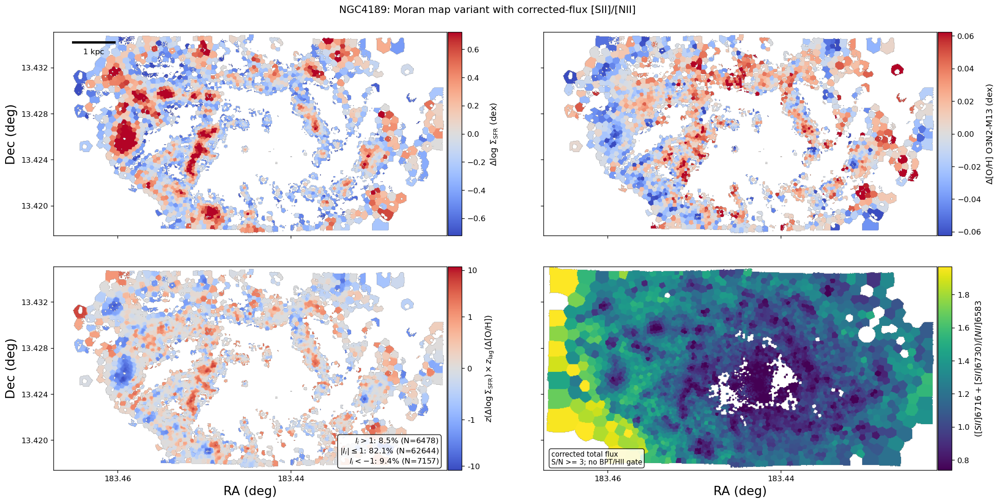
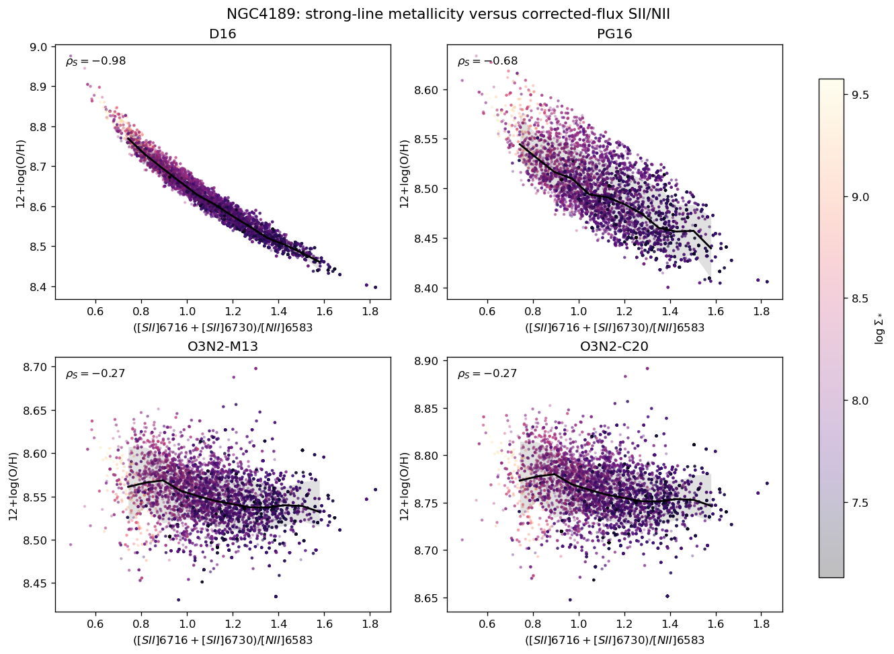
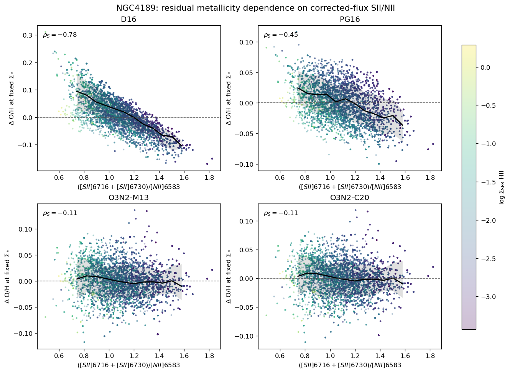
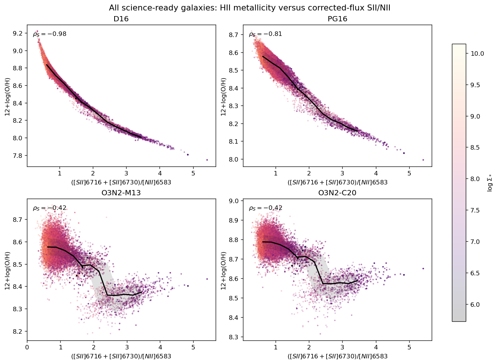
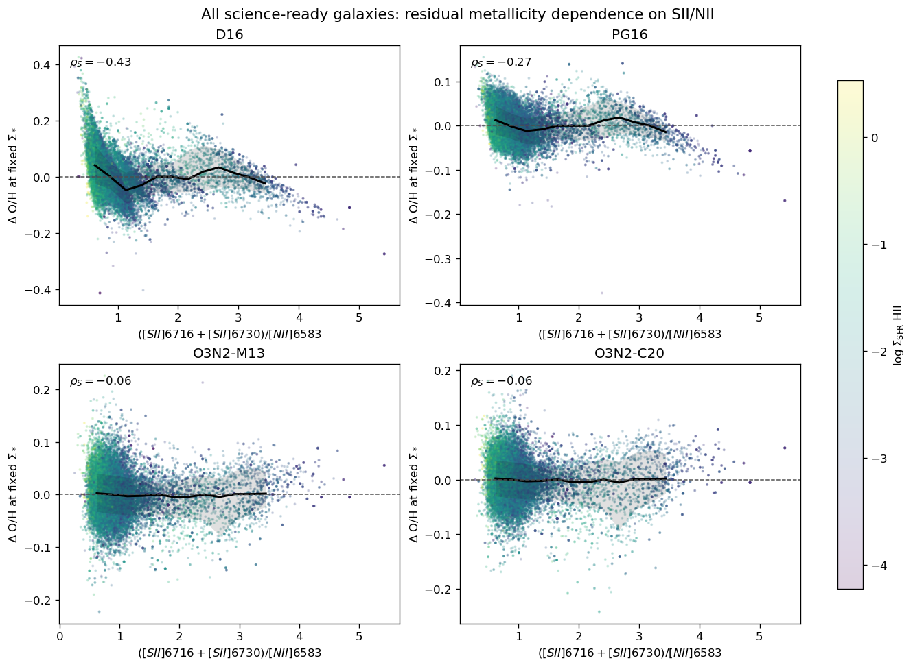
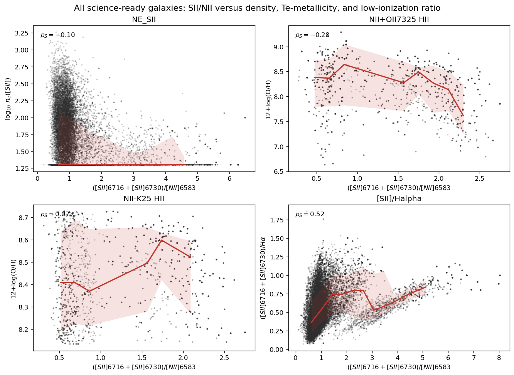

# 20260529 NGC4189 SII NII ratio

First we show the moran maps for NGC4189

Then, we replace the bottom right panel with [S II]/[N II] (note that not limited to HII spaxels) to check the HII region position. Overall,  their position match.

And we also check the the existing HII metallicity (D16, PG16, O3N2-M13, and O3N2-C20) versus [S II]/[N II], colorcoded my stellar mass. And no wonder, D16 and PG16 show strong depedence on it as they are both using N2S2 indicators, while two O3N2 calibrations are insensitive to [S II]/[N II]. 

We can also replace the y axis with $\Delta\mathrm{[O/H]}$ at fixed stellar mass, and colocoded by SFR. 

Similarly, we can repeat these two plots with all 18 science-ready galaxies we have so far:

For fun, we can have a look at $n_e$ and other $T_e$-based metallicities and clearly they are independent on [S II]/[N II] ratio.

