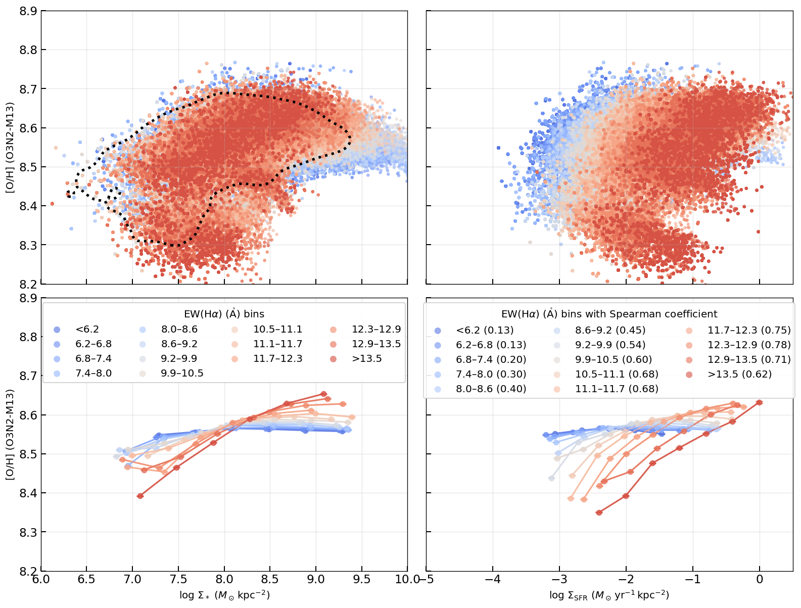
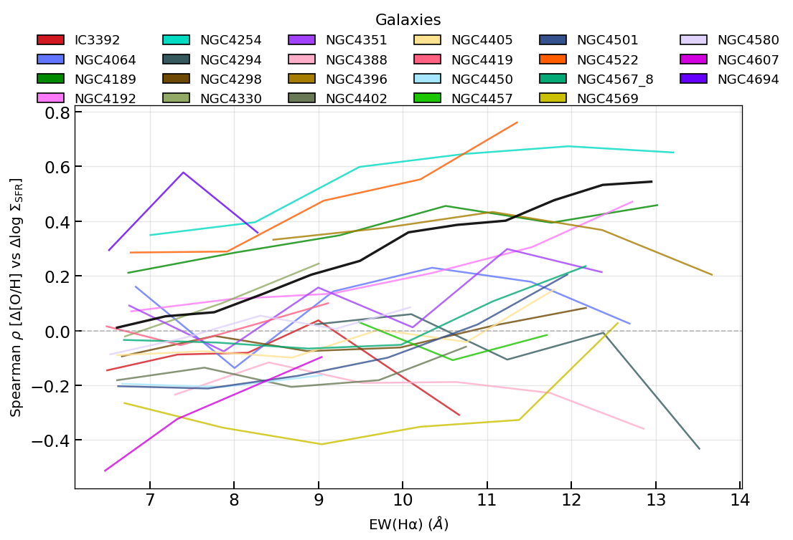
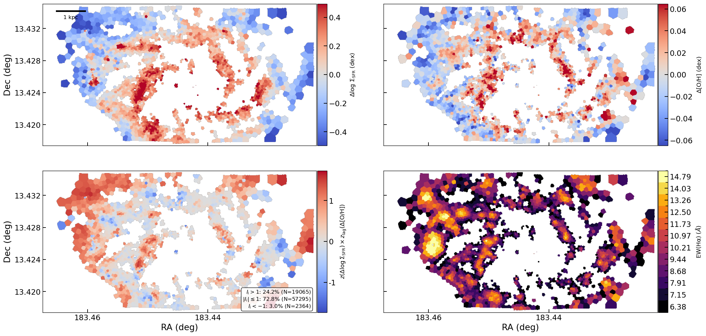
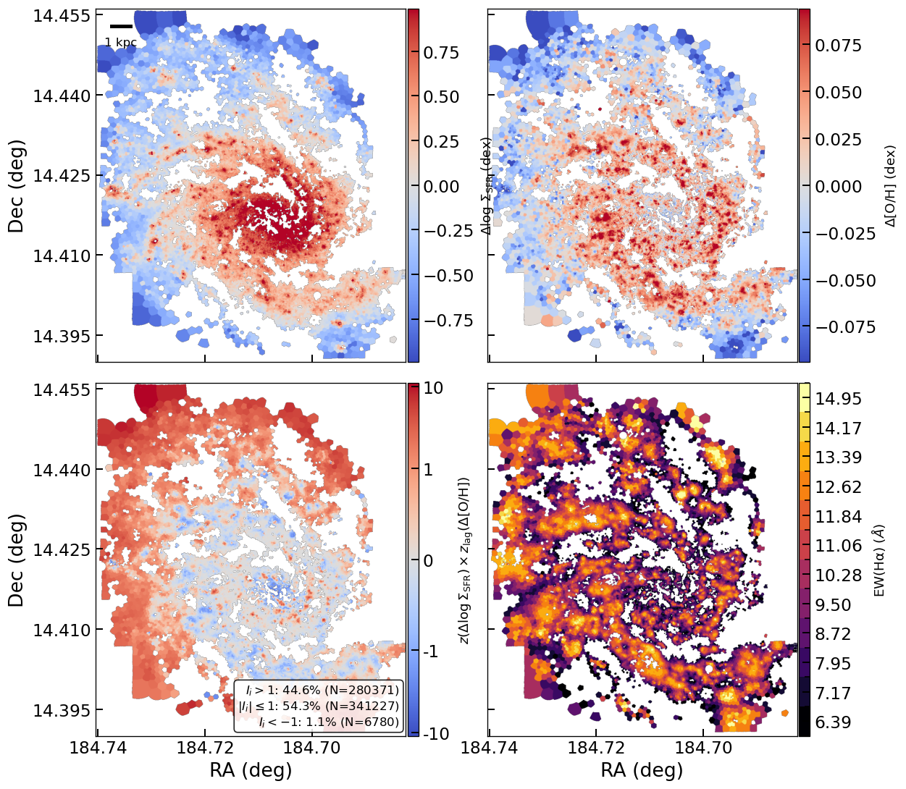
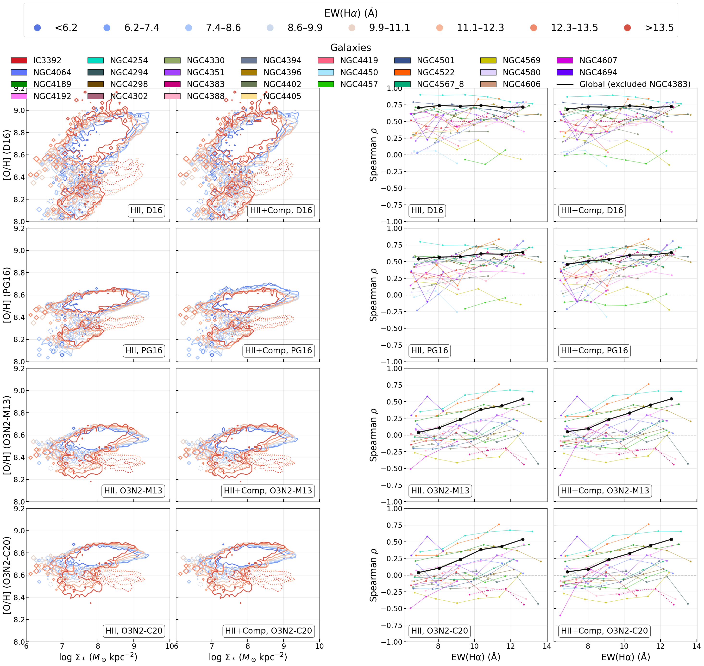
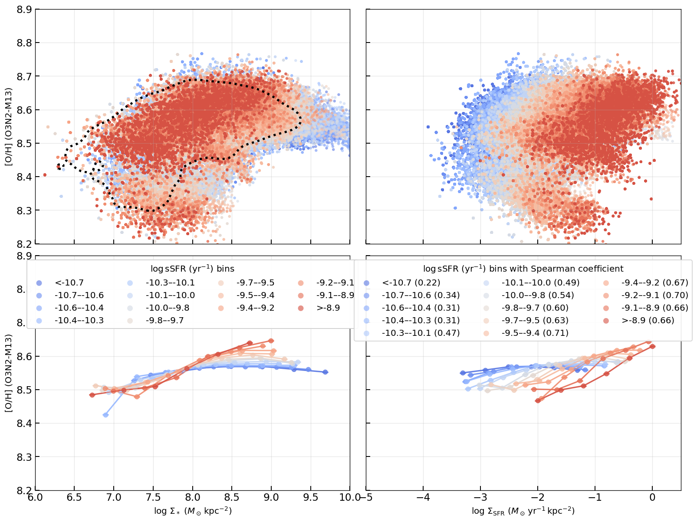
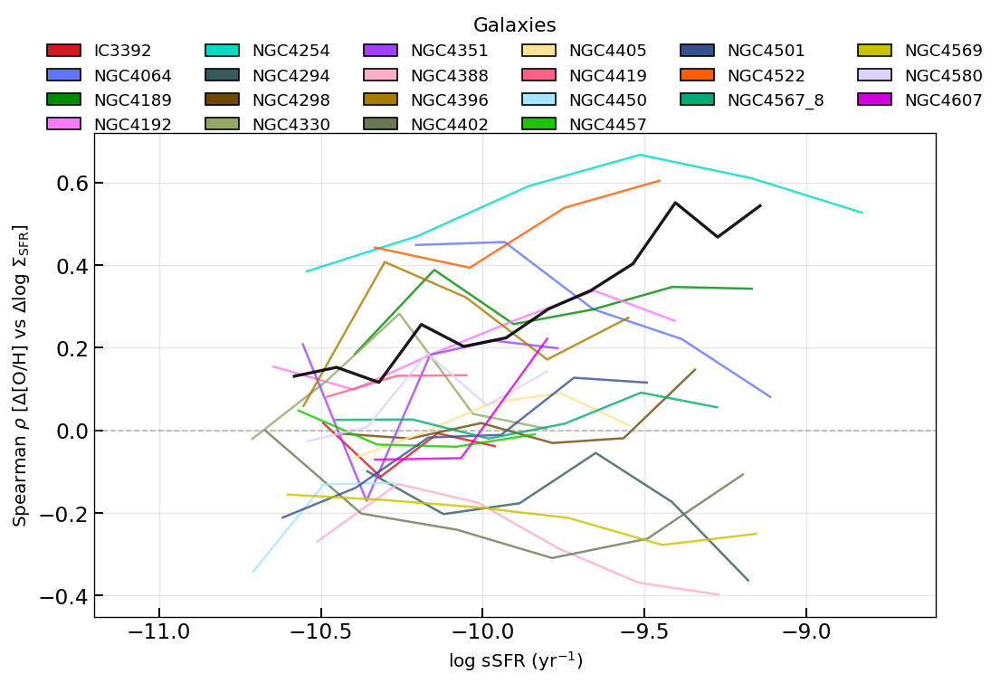
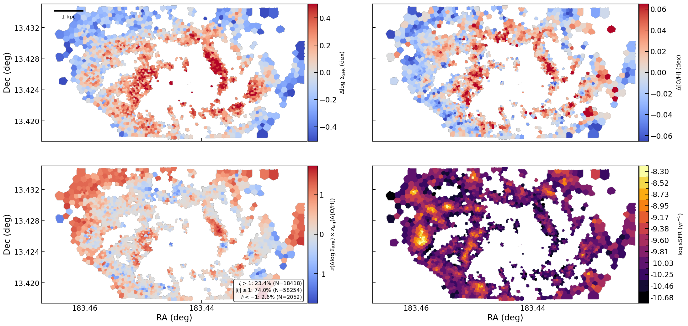
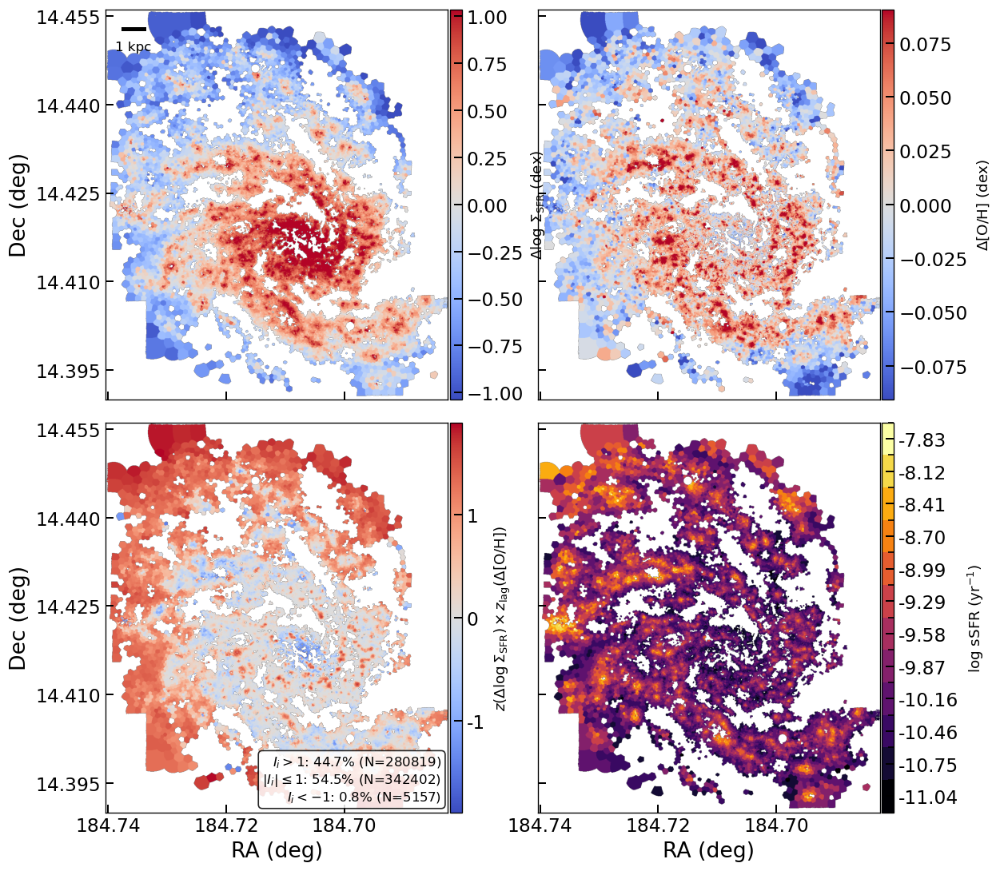
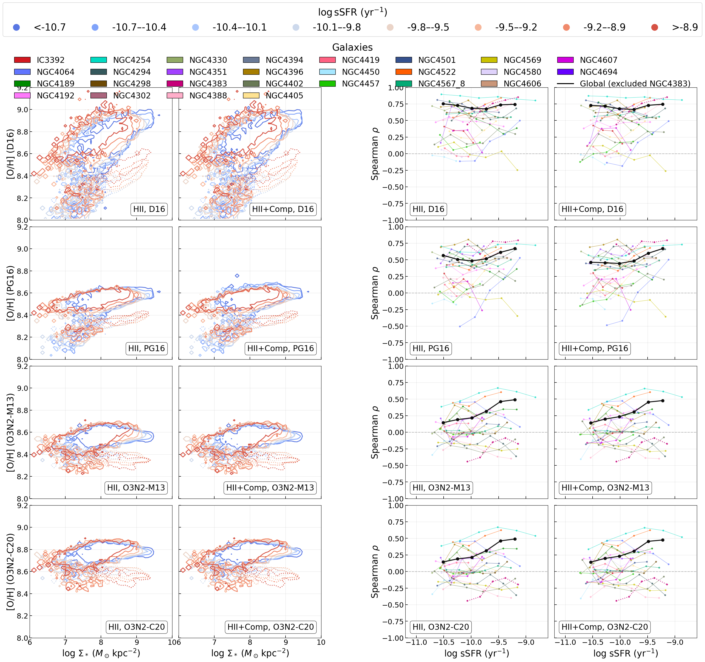

# 20260618 Bin by EWHa or sSFR

Here, instead of binning by $\Sigma_*$, we try to bin by EW(H$\alpha$) or sSFR to see if we still see the inversion. So like in rMZR and O/H-SFR relations, and when calcualting the $\Delta \log_{10}(\Sigma_\mathrm{SFR})$ and $\Delta \mathrm{[O/H]}$ to get the Moran maps and Spearman trends, we now bin by EW(H$\alpha$) or sSFR first and then do the subtraction

Unfortunately, the results are hard to comment. It seems that in ensamble trend, both binning approaches wash out the reversal. But overall, all galaxies seem to present much more flatten Spearman trends and thus no more internal reversals as well. 

My feeling is that these two may not be a good proxy to replace $\Sigma_*$ when doing $\Delta \log_{10}(\Sigma_\mathrm{SFR})$ and $\Delta \mathrm{[O/H]}$, but they should be meaningful in some senses that i still have no idea. 

As for the replacement of $\Sigma_*$, we still need to find other "truely" independent parameter, as both EW(H$\alpha$) and sSFR are still related to H$\alpha$-infered SFR.

## Bin by EW(H$\alpha$)

## Bin by sSFR

