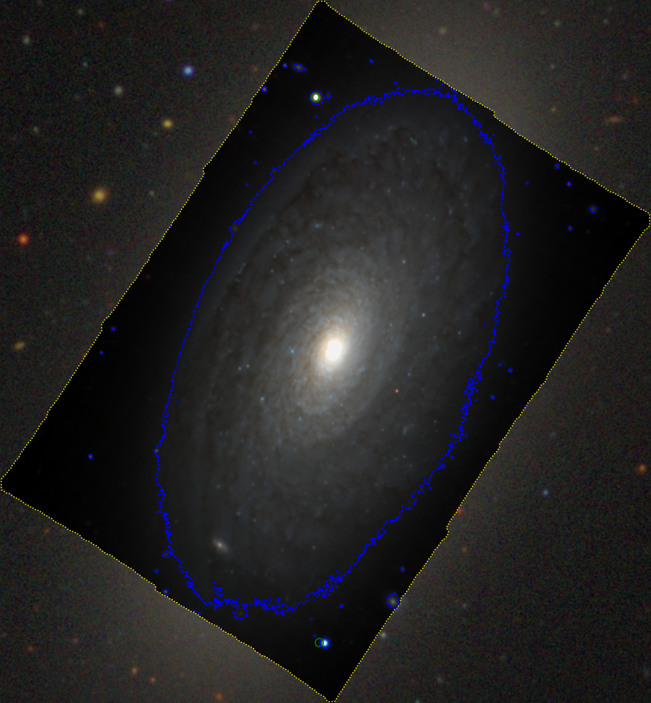
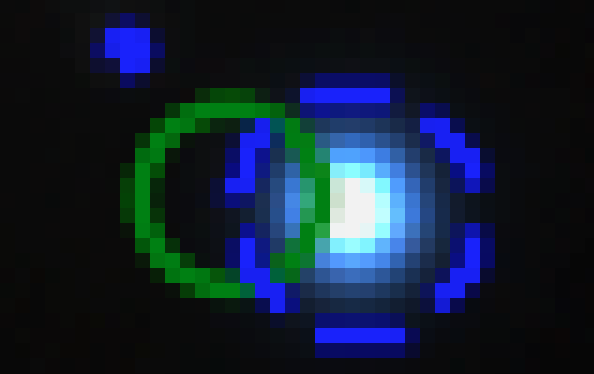
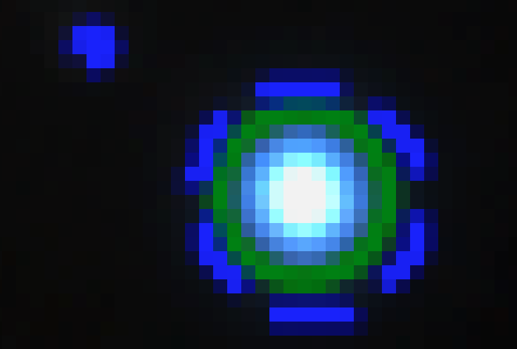

# 20260620 Fix Foreground Star Position

## Foreground star position issue

The foreground-star mask was placed using the Gaia catalogue coordinates directly.

That works for most stars, but it can fail for foreground stars with large proper motion. Gaia DR3 positions are recorded at a Gaia reference epoch, while the MUSE observations were taken much later.

For a high-proper-motion star, the real position during the MUSE observation can therefore be noticeably different from the Gaia catalogue position.



In the NGC4380 case, one Gaia foreground star has a proper motion of roughly:

```python
[STAR] Gaia DR3 3903910081318807168 (GAIA J122522.44+095933.5) ra=186.343502 dec=9.992638 RA=12:25:22.44 DEC=+09:59:33.50 GaiaG=17.69 r_arcsec=1.20 | plx=11.854±0.144 mas (SNR=82.6) | pm=172.64±0.18 mas/yr (SNR=937.7) | foreground because PARALLAX: plx≥0.002 mas and SNR≥5.0 OR PM: pm≥0.02 mas/yr and SNR≥5.0
```

Over about 9--10 years, that becomes a displacement of roughly:

```text
0.17 arcsec/yr × 9--10 yr ≈ 1.5--1.8 arcsec
```

With MUSE pixels of about:

```text
0.2 arcsec/pixel
```

this corresponds to about:

```text
7--9 pixels
```

So the Gaia-based mask can appear clearly offset from the actual star in the MUSE image.



## How to fix it

Before placing the star mask, propagate each Gaia source from the Gaia reference epoch to the MUSE observation epoch.

From the MUSE FITS file, read the observation time:

* `MJD-OBS`

From Gaia, use:

- `ra`
- `dec`
- `ref_epoch`
- `pmra`
- `pmdec`

The corrected logic should be:

```text
Gaia position at Gaia reference epoch
+ Gaia proper motion
+ MUSE observation time from FITS header
= predicted star position at the MUSE observation epoch
```

Then use this corrected position for the mask centre. For example, for that high-proper-motion star in NGC4380, it was now shifted by 1.623''. 

```python
[STAR] Gaia DR3 3903910081318807168 (GAIA J122522.44+095933.5) ra=186.343046 dec=9.992598 RA=12:25:22.33 DEC=+09:59:33.35 GaiaG=17.69 r_arcsec=1.20 | epoch_dt=9.403 yr | epoch_shift=1.623" | cat_ra=186.343502 cat_dec=9.992638 | obs_ra=186.343046 obs_dec=9.992598 | plx=11.854±0.144 mas (SNR=82.6) | pm=172.64±0.18 mas/yr (SNR=937.7) | foreground because PARALLAX: plx≥0.002 mas and SNR≥5.0 OR PM: pm≥0.02 mas/yr and SNR≥5.0
```



