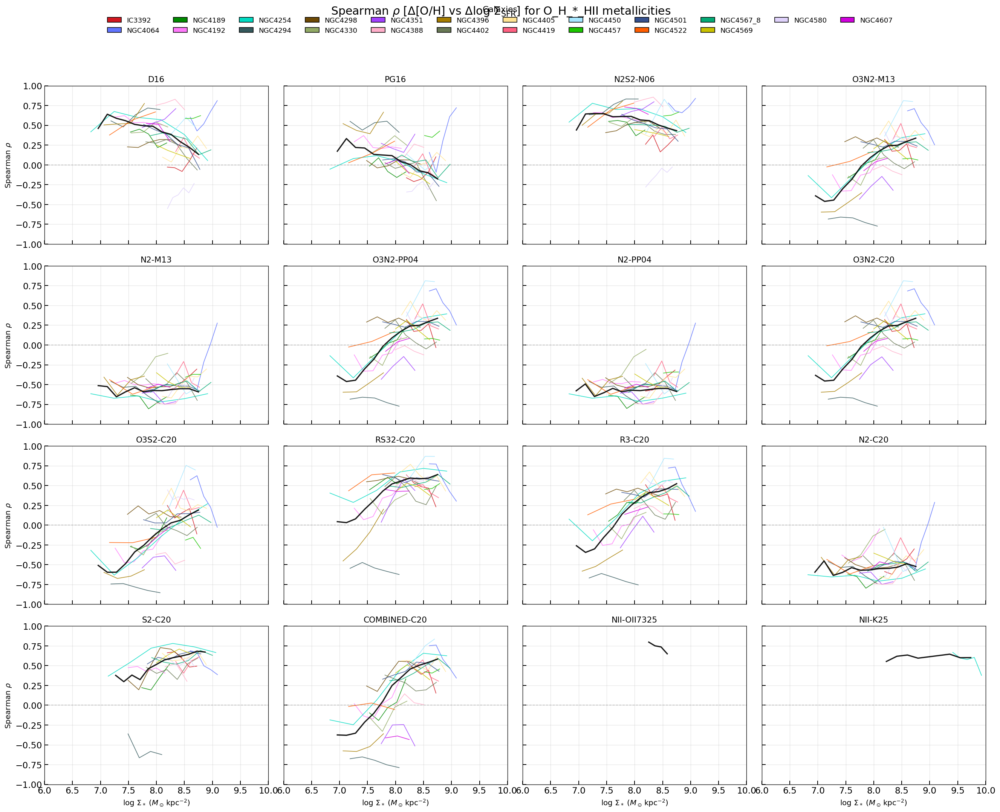
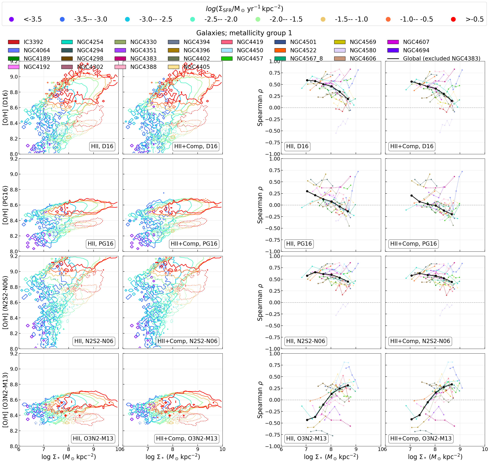
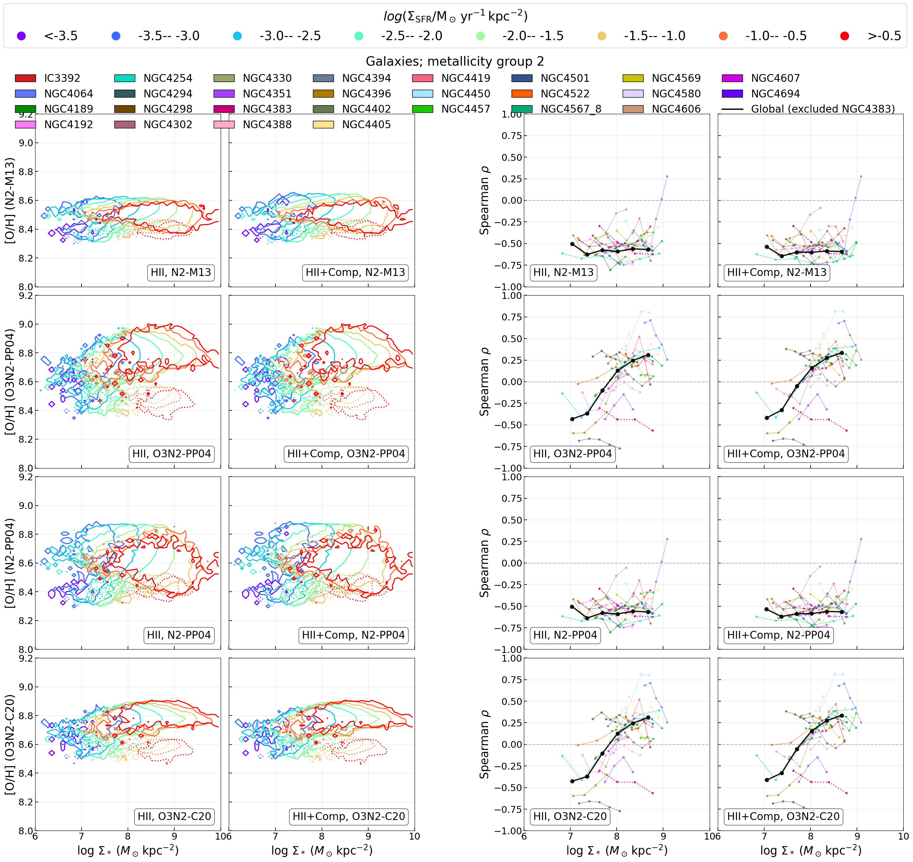
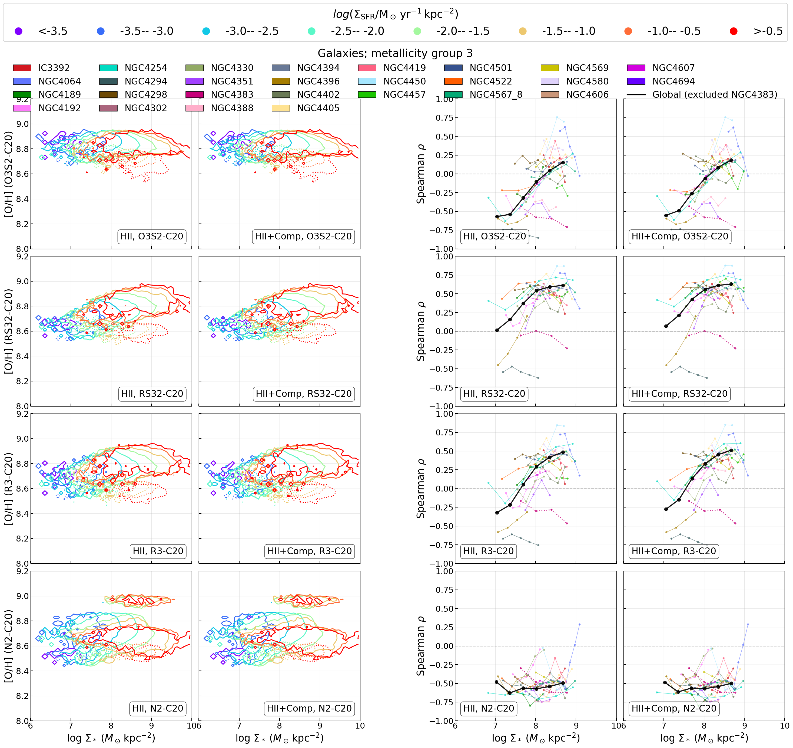
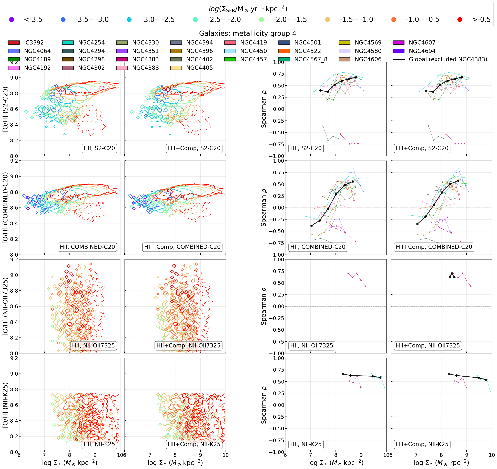

# 20260622 Spearman Trends in all Available Metallicity Calibrations

We currently have 16 metallicity calibrations (14 previous indicators and 2 less reliable $T_e$-based prescriptions). 

It seems that as long as one metallicity calibration evolves the [O III]$\lambda5007$ line then it will show the negative to positive mass-dependent inversion: O3N2-M13, O3N2-PP04, O3N2-C20, O3S2-C20, R3-C20 and COMBINED-C20 (except RS32-C20 and Scal-PG16).  

Scal-PG16 is the only that shows positive to negative mass-dependent inversion. 

D16 and other S2 only indicators tend to be positive. This can explain why RS32 is mostly positive. 

N2 only indicators tend to be negative. 

Finally, though unreliable, we can see that both $T_e$-based prescriptions give positive correlation at least $\log_{10}(\Sigma_*/M_\odot\mathrm{kpc^{-2}})>8$. I think this should inform us that the correlation at high mass end should be positive. 

