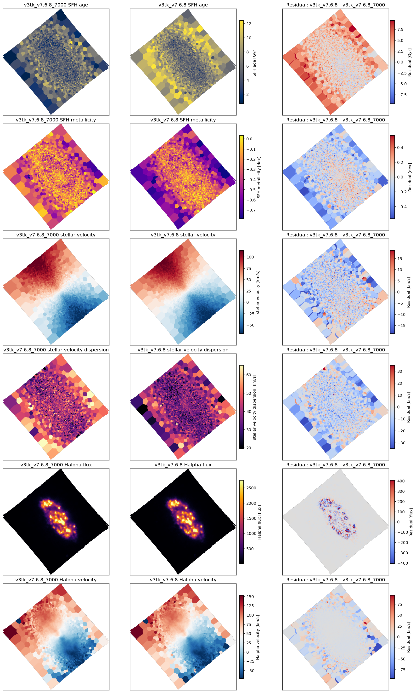
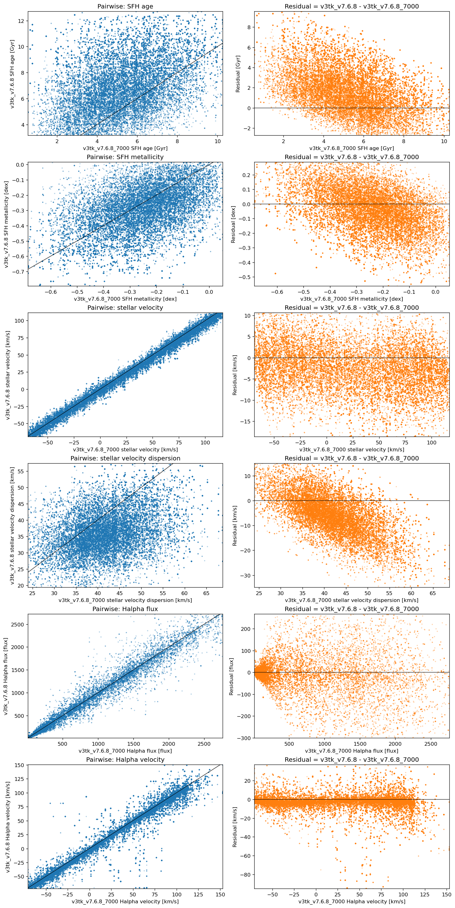

# 20260623 IC3392 7000 vs 8900

Here we compare `AGE`, `METAL`, `V`, `SIGMA`, `HA6562_FLUX` and `HA6562_VEL`. 

Now we can see the similar median velcicty offest in both stellar and gas by $\sim3$km/s. 

<table border="1" class="dataframe">
  <thead>
    <tr style="text-align: right;">
      <th></th>
      <th>property</th>
      <th>unit</th>
      <th>n_common_finite_pixels</th>
      <th>median_v3tk_v7.6.8_7000</th>
      <th>median_v3tk_v7.6.8</th>
      <th>median_residual_test_minus_fiducial</th>
    </tr>
  </thead>
  <tbody>
    <tr>
      <th>0</th>
      <td>SFH age</td>
      <td>Gyr</td>
      <td>94575</td>
      <td>5.027133</td>
      <td>8.309157</td>
      <td>2.940316</td>
    </tr>
    <tr>
      <th>1</th>
      <td>SFH metallicity</td>
      <td>dex</td>
      <td>94575</td>
      <td>-0.287328</td>
      <td>-0.413037</td>
      <td>-0.108818</td>
    </tr>
    <tr>
      <th>2</th>
      <td>stellar velocity</td>
      <td>km/s</td>
      <td>94575</td>
      <td>30.503566</td>
      <td>24.077734</td>
      <td>-3.278185</td>
    </tr>
    <tr>
      <th>3</th>
      <td>stellar velocity dispersion</td>
      <td>km/s</td>
      <td>94575</td>
      <td>45.065936</td>
      <td>37.608141</td>
      <td>-6.965165</td>
    </tr>
    <tr>
      <th>4</th>
      <td>Halpha flux</td>
      <td>flux</td>
      <td>94575</td>
      <td>29.420569</td>
      <td>26.827117</td>
      <td>-1.491645</td>
    </tr>
    <tr>
      <th>5</th>
      <td>Halpha velocity</td>
      <td>km/s</td>
      <td>94575</td>
      <td>62.535066</td>
      <td>57.867151</td>
      <td>-2.732375</td>
    </tr>
  </tbody>
</table>

Then we also show the pairwise and rediual 

