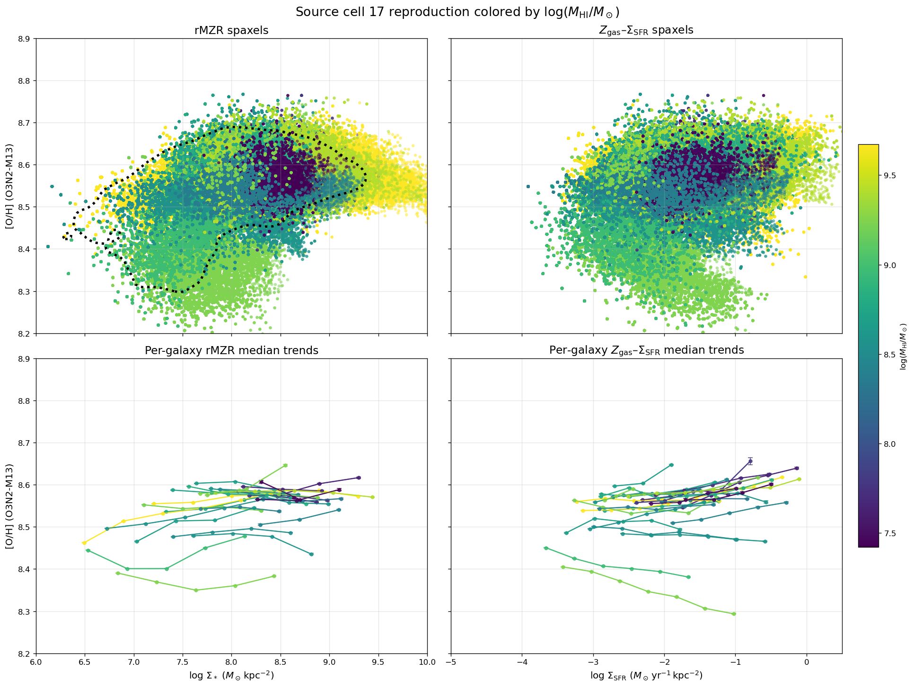
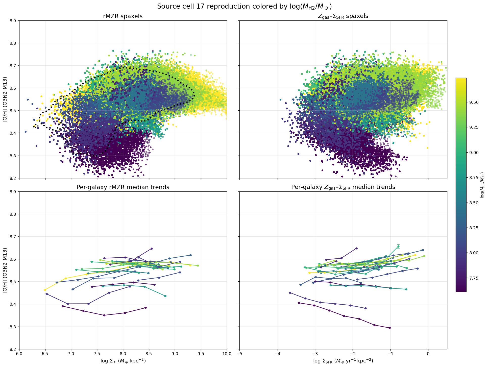
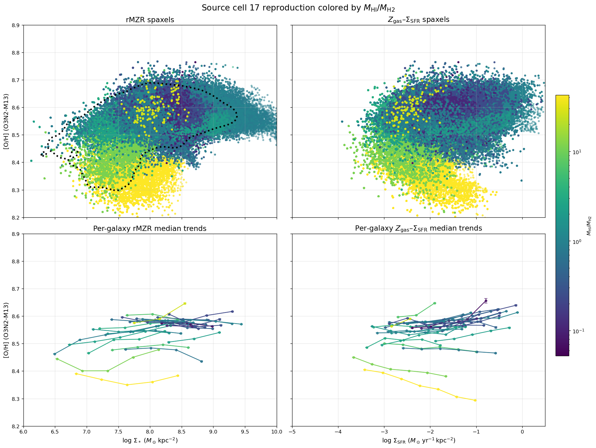
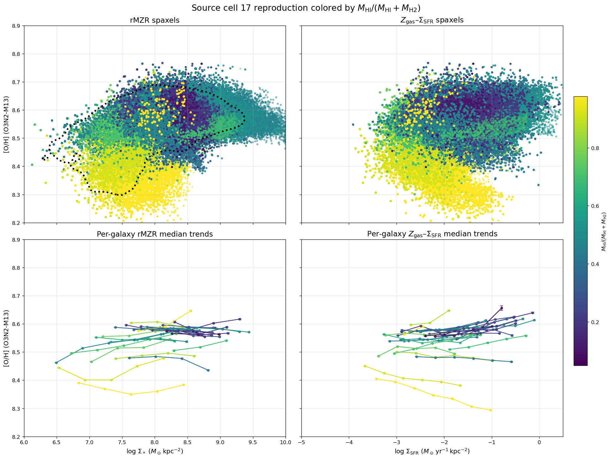
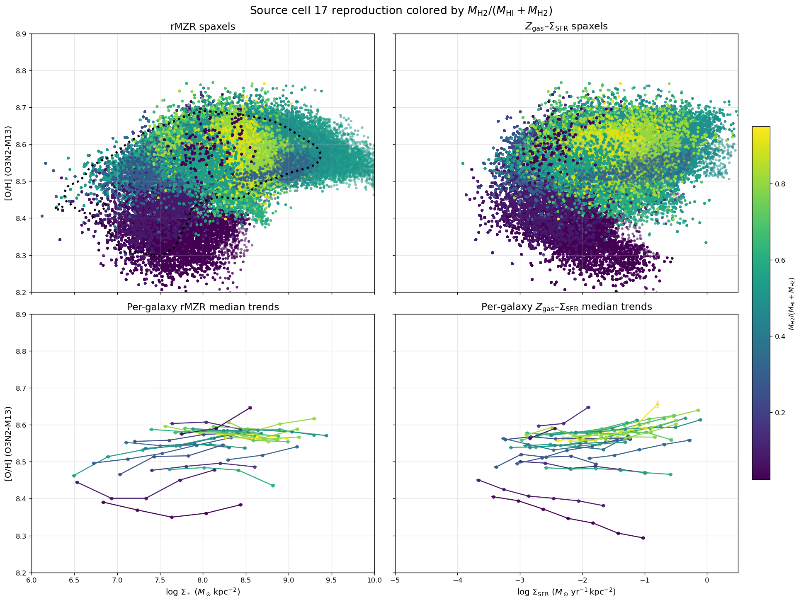
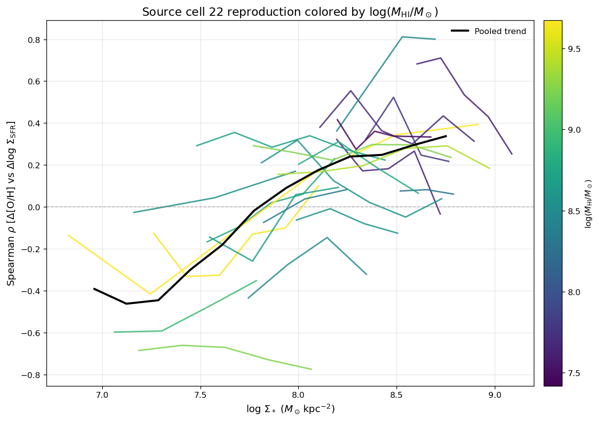
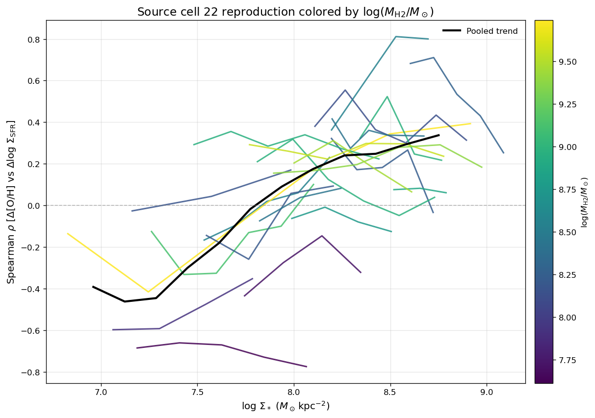
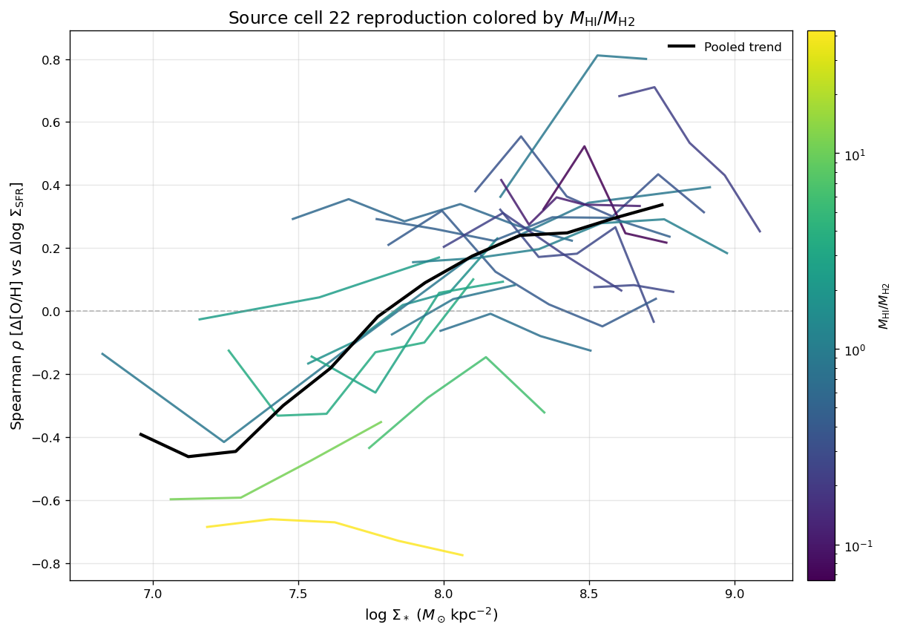
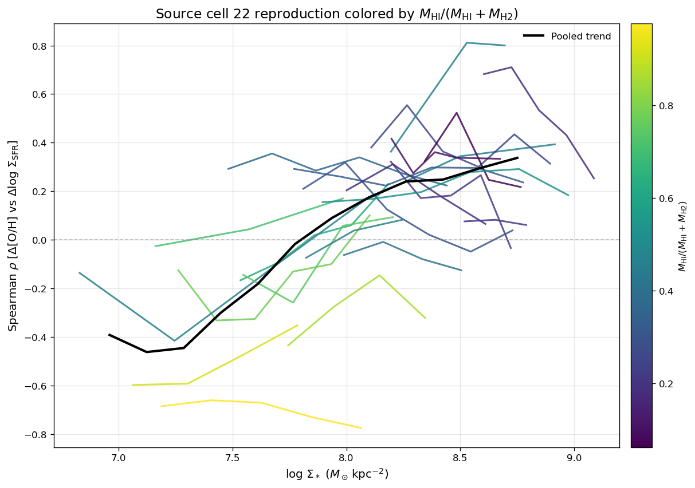
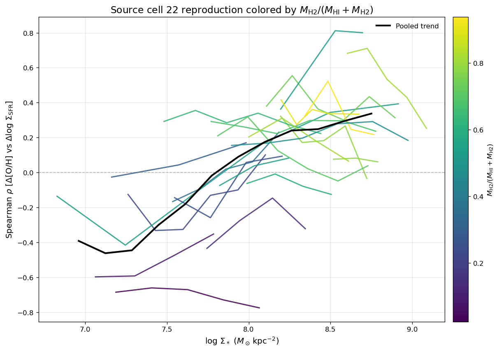

# 20260624 Before Offline

Here I show the rMZR, $\mathrm{[O/H]}-\Sigma_\mathrm{SFR}$ relation and Spearman trends colorcoded with galaxy-level properties:

1. total H I mass (`logMHI`);
2. total H$_2$ mass (`logMH2`);
3. total $M_{\rm HI}/M_{\rm H2}$;
4. total $M_{\rm HI}/(M_{\rm HI}+M_{\rm H2})$;
5. total $M_{\rm H2}/(M_{\rm HI}+M_{\rm H2})$.

All 3 ratio-binning plots show strong trends in upper (positive) and lower (negative) branches $\mathrm{[O/H]}-\Sigma_\mathrm{SFR}$ relation. So at least from the integrated point of view, we can see that the positive correlation is $\mathrm{H_2}$ dominated while the negative trend is $\mathrm{H_I}$ dominated. 

