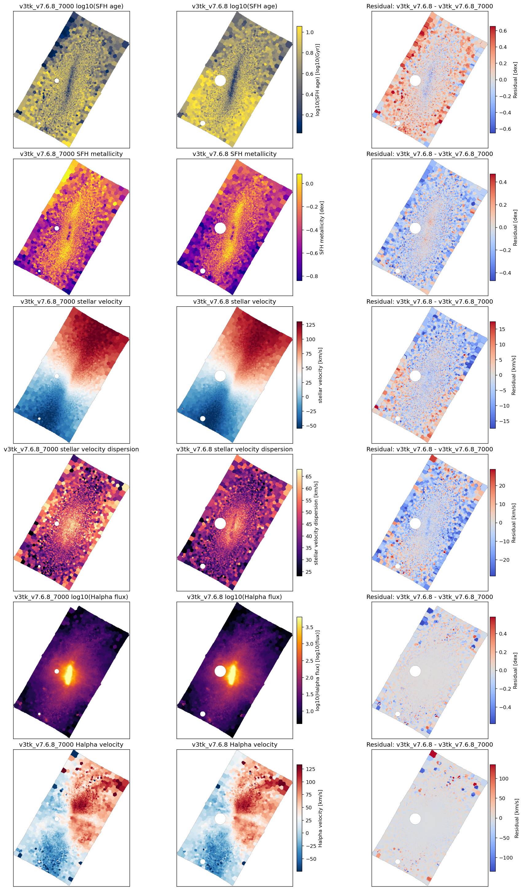
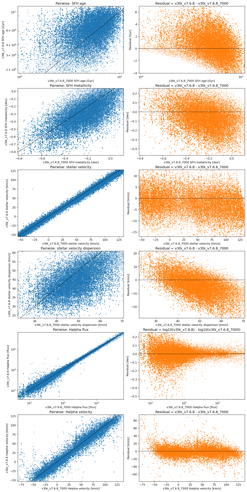

# 20260624 NGC4064 7000 vs 8900

Here we compare `AGE`, `METAL`, `V`, `SIGMA`, `HA6562_FLUX` and `HA6562_VEL`. 

Now we can see the similar median velcicty offest in both stellar and gas by $\sim2$km/s. 

<table border="1" class="dataframe">
  <thead>
    <tr style="text-align: right;">
      <th></th>
      <th>property</th>
      <th>unit</th>
      <th>n_common_finite_pixels</th>
      <th>median_v3tk_v7.6.8_7000</th>
      <th>median_v3tk_v7.6.8</th>
      <th>median_residual_test_minus_fiducial</th>
    </tr>
  </thead>
  <tbody>
    <tr>
      <th>0</th>
      <td>SFH age</td>
      <td>Gyr</td>
      <td>177500</td>
      <td>4.925873</td>
      <td>5.960473</td>
      <td>1.058817</td>
    </tr>
    <tr>
      <th>1</th>
      <td>SFH metallicity</td>
      <td>dex</td>
      <td>177500</td>
      <td>-0.303573</td>
      <td>-0.394088</td>
      <td>-0.092158</td>
    </tr>
    <tr>
      <th>2</th>
      <td>stellar velocity</td>
      <td>km/s</td>
      <td>177500</td>
      <td>53.445818</td>
      <td>49.728595</td>
      <td>-2.091342</td>
    </tr>
    <tr>
      <th>3</th>
      <td>stellar velocity dispersion</td>
      <td>km/s</td>
      <td>177500</td>
      <td>47.875719</td>
      <td>41.985591</td>
      <td>-5.356977</td>
    </tr>
    <tr>
      <th>4</th>
      <td>Halpha flux</td>
      <td>flux</td>
      <td>177500</td>
      <td>22.148083</td>
      <td>21.872223</td>
      <td>-0.160535</td>
    </tr>
    <tr>
      <th>5</th>
      <td>Halpha velocity</td>
      <td>km/s</td>
      <td>177500</td>
      <td>32.710389</td>
      <td>28.421357</td>
      <td>-2.197783</td>
    </tr>
  </tbody>
</table>

Then we also show the pairwise and rediual 

