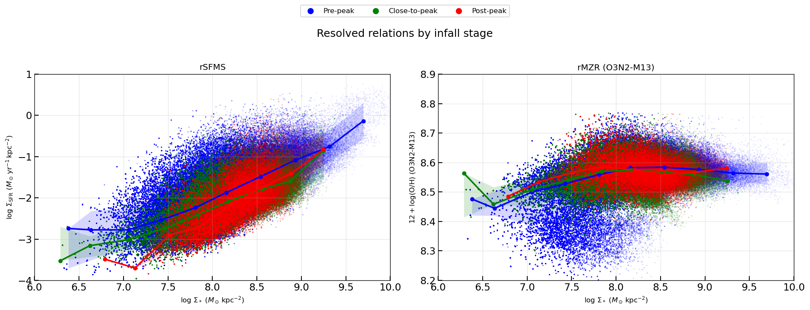

# 20260731 rSFMS and rMZR by infall stages

For rSFMS, it is clear that from $\log_{10}(\Sigma_*/M_\odot\mathrm{kpc^{-2}})$ = 7.0 to 9.0, pre-peak (blue) galaxies' median trend is $\sim0.3$ dex higher than post-peak (red) galaxies. 

For rMZR, it seems there is still kind of inversion? Post-peak (red) are a bit higher $\log_{10}(\Sigma_*/M_\odot\mathrm{kpc^{-2}}) < 8.0$, while pre-peak (blue) are a bit higher at >8.0, although the median trend difference is only $\sim0.02$ dex. 