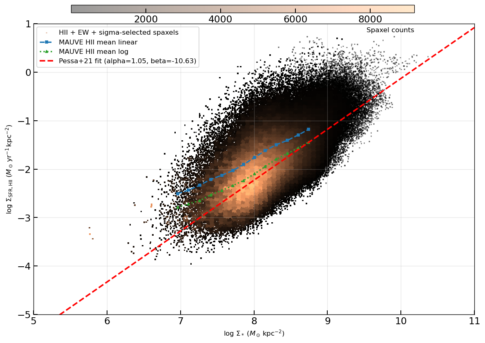
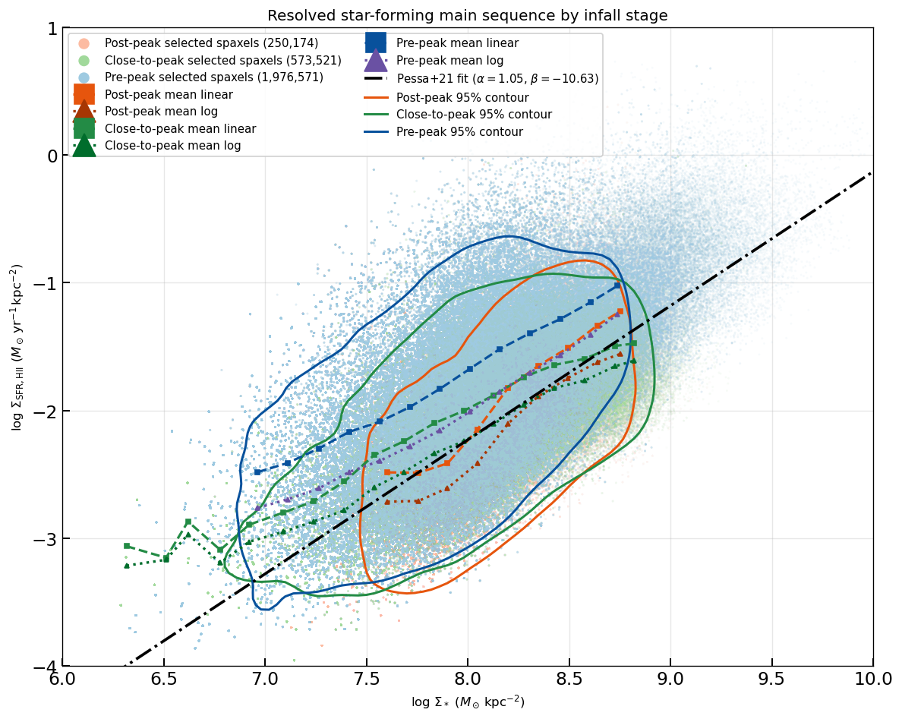
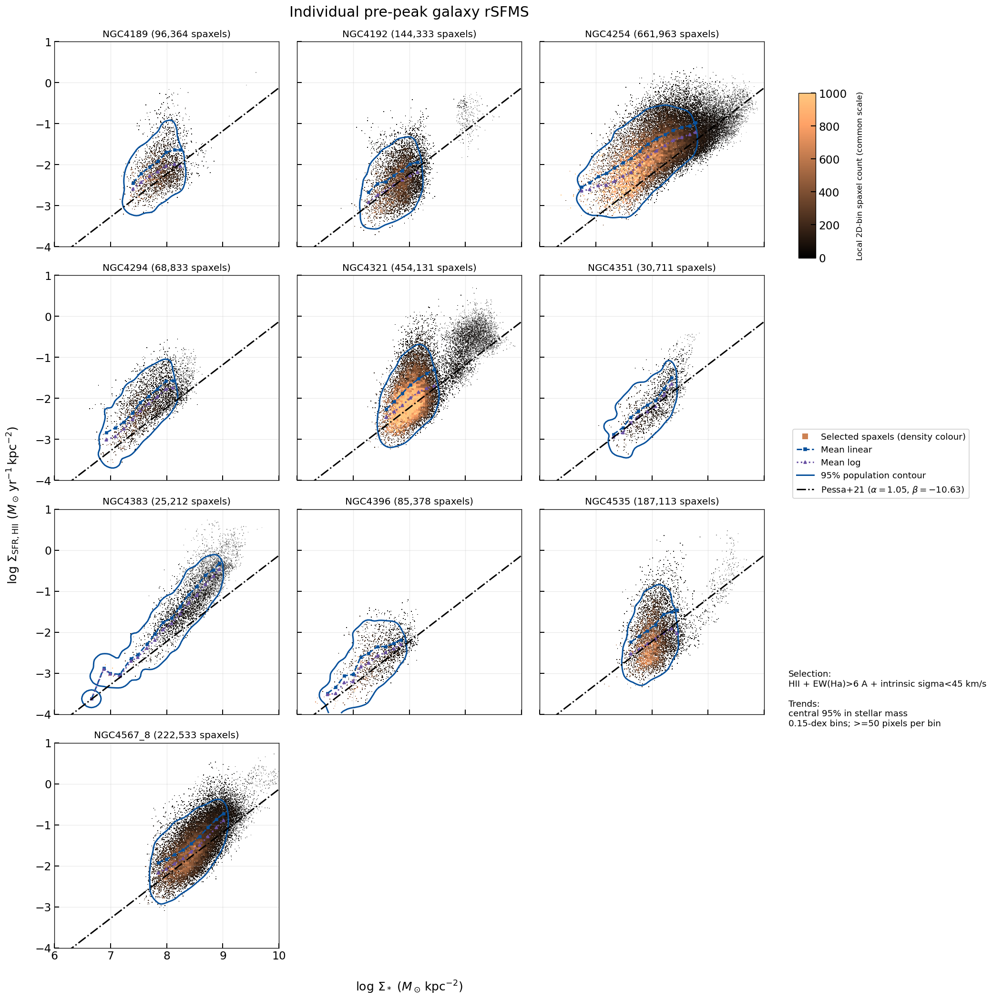
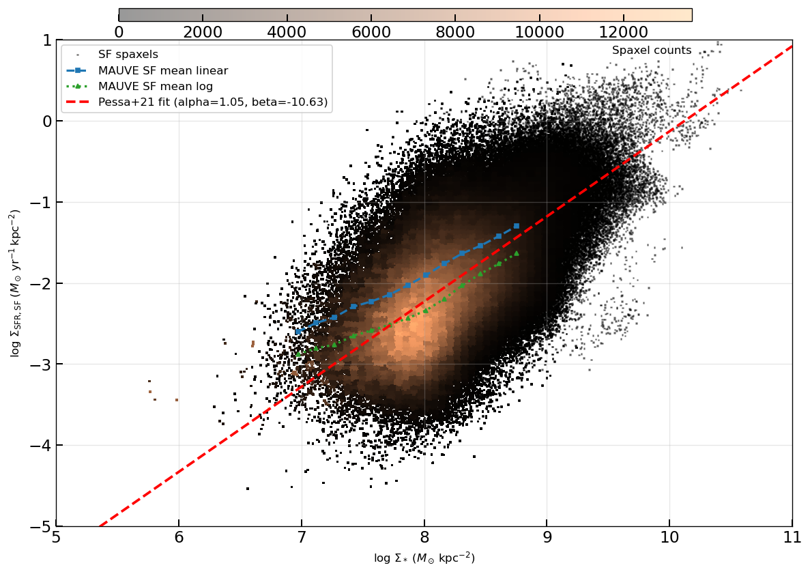
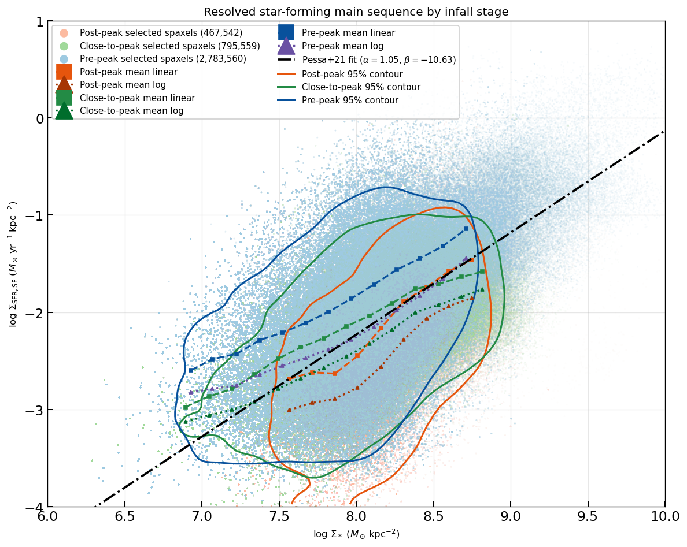
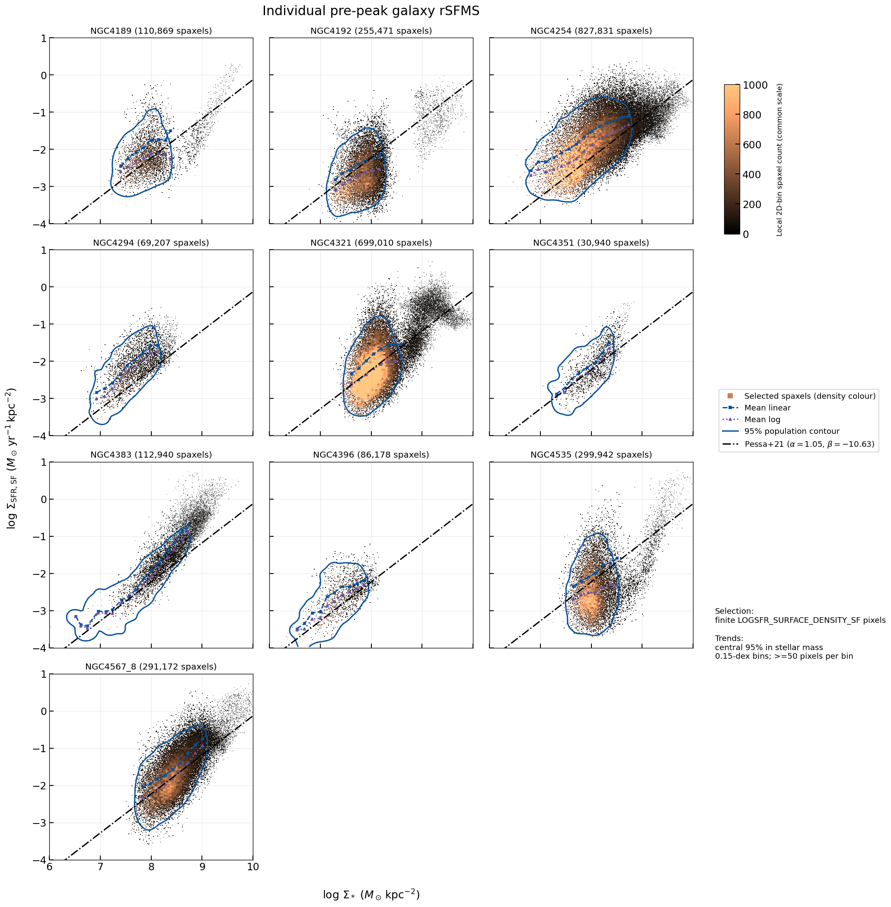

# 20260803 Pre peak rSFMS

it seems that PHANGS rSFMS is more close to our "close-to-peak" and "post-peak" sample. Or in other word, our pre-peak sample is more star-forming 

but i suspect that that might be because that they dont perform the conservative SF selection as ours

 

even those 3 phangs galaxies are still a bit SFR-enhanced (4535's mean-log aligns with Pessa21, but that fitting line is based on mean-linear)

Hoever, if i perform Pessa21 selection (SF spaxel without EW and dispersion cut), then it looks more consistent with their fitting line. So there is not any significant enhancement across the sample...

