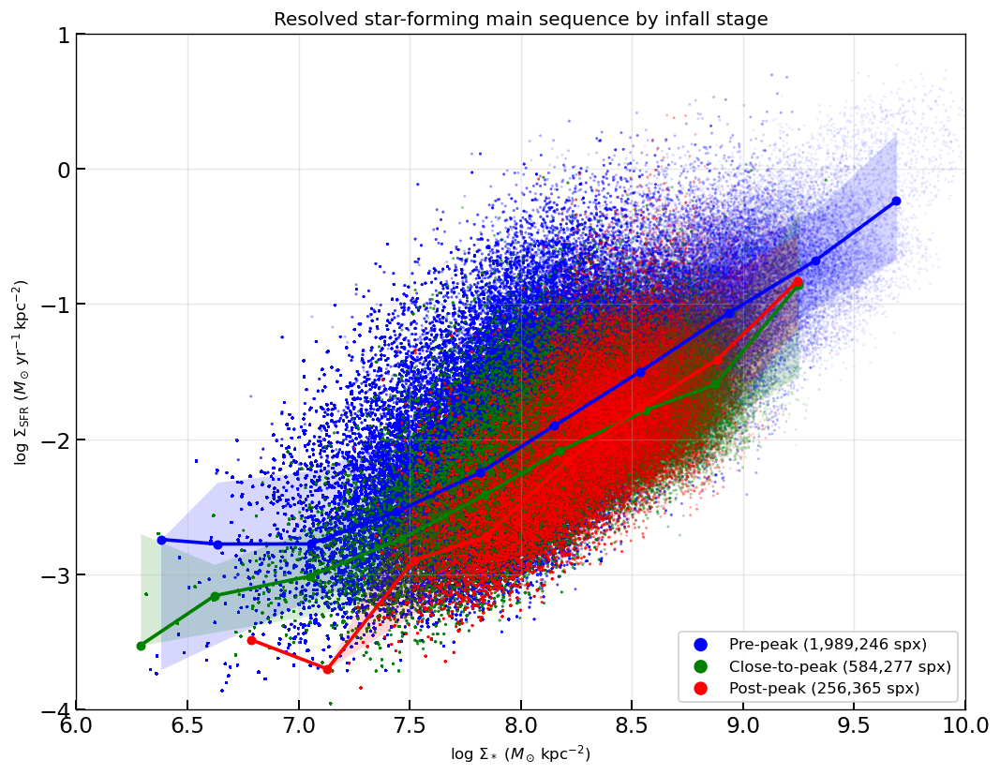
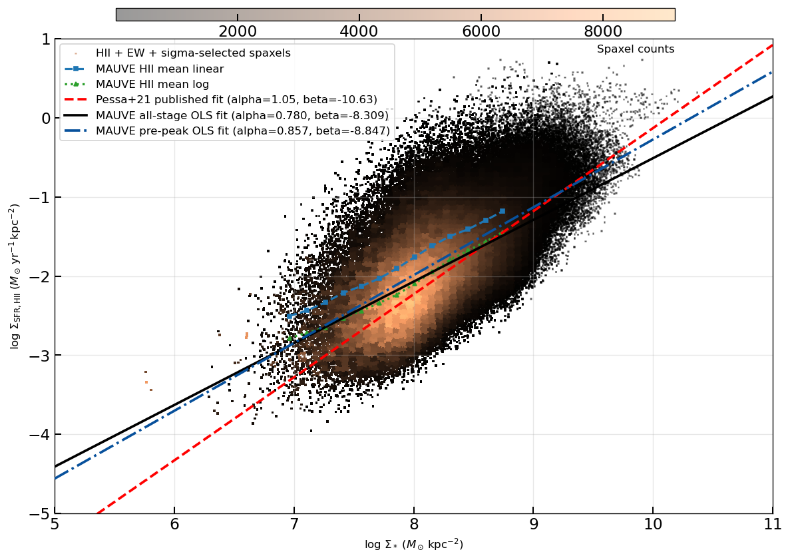
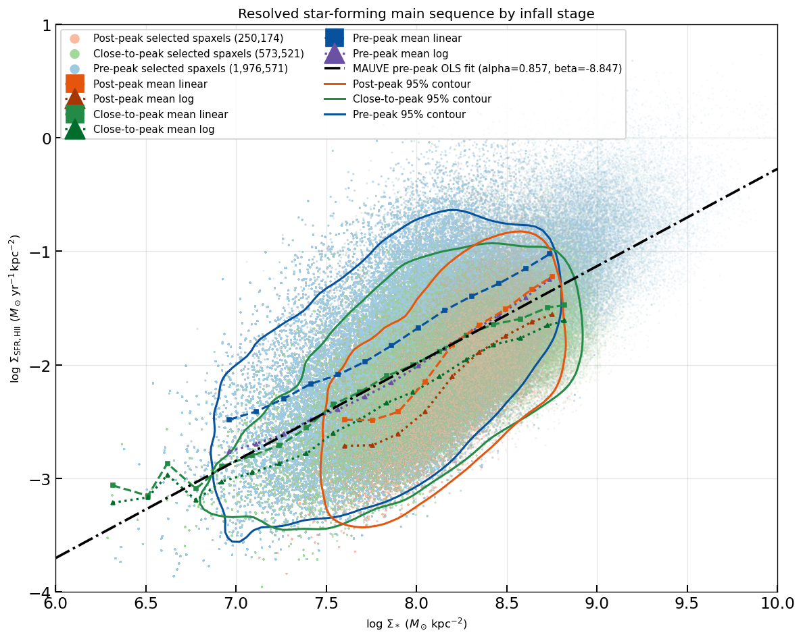
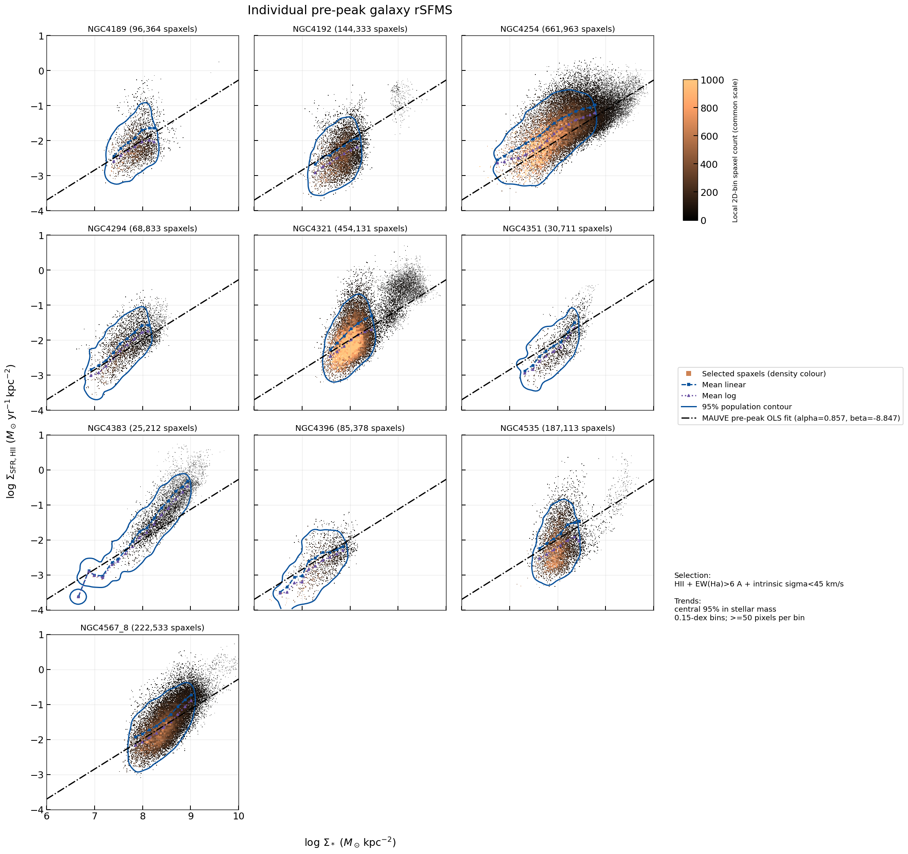
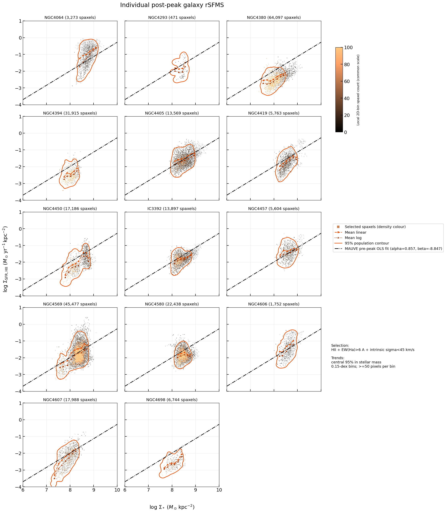
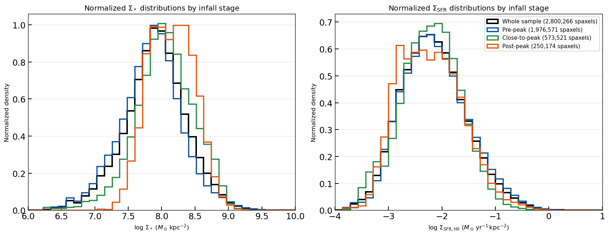
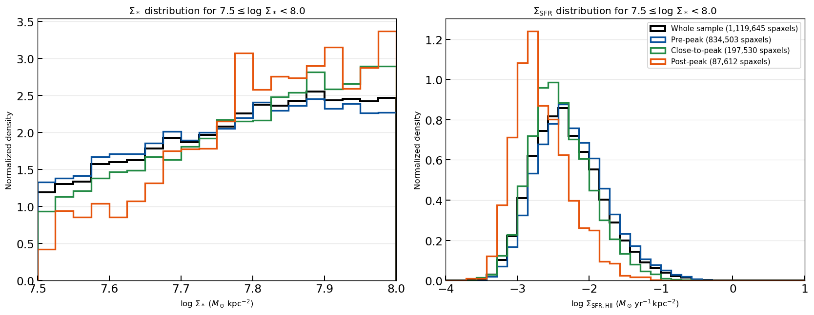
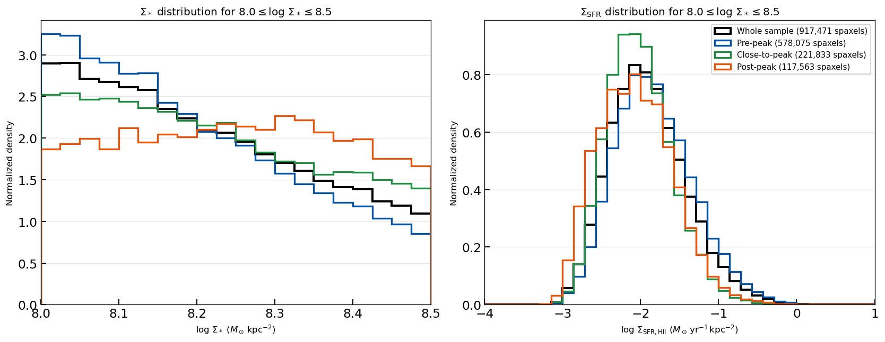
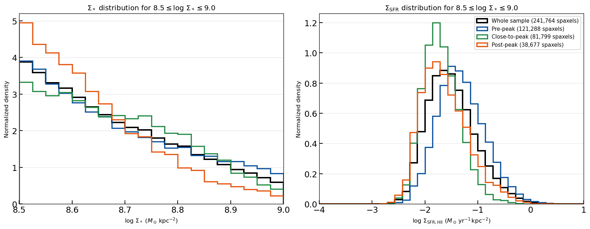
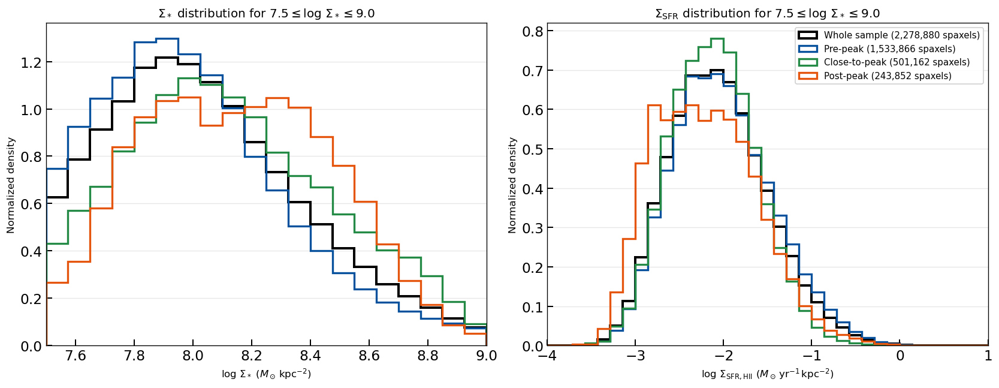

# 20260804 Pre peak and Post peak rSFMS and their histograms

## 1. rSFMS in 3 infall stages

3 infall stages: 

\- ***\*Blue\**** = Stage 1 (pre-peak): least Virgo environment effect

\- ***\*Green\**** = Stage 2 (close-to-peak): ongoing/near the peak of stripping

\- ***\*Red\**** = Stage 3 (post-peak): stripping done

Fit the rSFMS as PHANGS does

Use the pre-peak fit as reference and it seems there is a systematical decrease of SFR of infall phases. 

Comparison of pre-peak and post-peak samples: Pre-peak seems to align more with the fitting line; post-peak shows more scatter maybe due to sample selection (less extend mass range). 

## 2. rSFMS's $\Sigma_*$ and $\Sigma_\mathrm{SFR}$ in 3 infall phases

Here i show the normalized histogram of mass and SFR in 3 infall phases and the full sample. In general, as expected, the pre-peak sample dominate the full sample's distrubution due to more sample size; close-to-peak sample mostly behaves closer to pre-peak but sometimes more like post-peak; and post-peak always deviates the most than others. But I am surprised to see that it seems the mass distribution shows more differences than SFR.

We can see that post-peak sample is missing low-mass spaxels (<7.0) and SFR is a bit lower in general. 

Then I choose the mass range at 7.5-8.0, where in rSFMS that their mean trends deviate the most, then we can clearly see the different SFR distribution: more left and more asymmetric and more peaky in post-peak sample. The mass histogram of post-peak samples are steeper than others.

Then i show mass range at 8.0-8.5. Mass distribution still shows differences (almost flat distribution) but SFR seems not that different. 

Then i show mass range at 8.5-9.0. Now both mass and SFR distributions look not much differences across infall stages.  

So we also see that in higer mass regime (in other words, inner part of galaxies) spaxels show less environmental effect. 

Below i also show show mass range at 7.5-9.0, where we have enough statistics in all 3 stages, so it more clear to show that in general, from pre-peak to post-peak, galaxies are losing low mass fractions and become less SF. 

