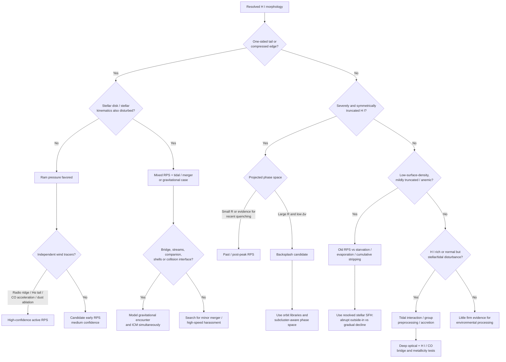

# Environmental Histories of the MAUVE Virgo Galaxy Sample

## Executive summary

The literature strongly supports the premise that the MAUVE galaxies cannot be placed on a single one-dimensional “pre-peak → close-to-peak → post-peak” sequence without losing physically important information. The three-stage MAUVE classification is useful as an orbital/stripping-stage shorthand—the uploaded survey description explicitly maps Yoon et al. classes 0/I, II, and III/IV into pre-peak, close-to-peak, and post-peak, respectively—but the same class contains galaxies undergoing very different processes, and MAUVE itself already makes two instructive exceptions: NGC 4192 is moved to pre-peak because there is no convincing present stripping signature, whereas NGC 4698 is moved to post-peak because its peculiar, externally assembled structure and stripping history make it a poor “first-infall” archetype. fileciteturn1file0 Across the **40 physical galaxies** in the supplied master file—the prompt has 39 list entries because `NGC4567_8` represents two galaxies—the clearest high-confidence environmental histories divide into several channels: ongoing or recent ram-pressure stripping (e.g. NGC 4330, 4388, 4402, 4501, 4522, 4569); old stripping/backsplash-like systems with severely truncated gas disks but little present forcing (e.g. IC 3392, NGC 4405, 4419, 4580); mixed gravitational-plus-hydrodynamic cases (NGC 4064, 4294, 4298/4302, 4424, 4654); galaxies dominated by tidal encounters, mergers or accretion rather than clean ICM stripping (NGC 4216, 4254, 4567/4568, 4694, probably 4698); and a less securely understood population with smooth, low-surface-density or moderately truncated H I disks for which slow removal, starvation, evaporation, or ancient stripping remain degenerate (NGC 4380, 4394, 4450, 4548, 4579, 4689). This is essentially the physical message already latent in VIVA and the Yoon phase-space analysis: H I morphology constrains *what happened to the gas*, phase space constrains but does not uniquely determine *when it happened*, while stellar morphology, Hα/UV star-formation histories, radio continuum, CO, and X-ray observations are required to distinguish ICM ram pressure from tides, mergers, preprocessing and feedback. citeturn27search9turn27search3turn27academia47

## Framework and data provenance

The baseline H I quantities and J2000 positions below come from **VIVA**, which provided resolved VLA H I imaging for 53 Virgo late-type systems and remains the essential morphological atlas for this exercise. citeturn27search9 I use the VIVA H I-deficiency convention: positive values indicate less H I than expected for an isolated galaxy of comparable type/size, with large positive values corresponding to severe depletion. Because H I-deficiency calibrations differ between catalogues and later gas-scaling relations, the numerical `def_HI` value should not be treated as an absolute physical observable; this matters especially for borderline cases such as NGC 4192.

For projected phase space I adopt the Yoon et al. Virgo normalization, \(R_{200}=1.55\) Mpc, cluster velocity \(v_{\rm cl}=1088\ {\rm km\,s^{-1}}\), and velocity dispersion \(\sigma_{\rm cl}=593\ {\rm km\,s^{-1}}\). Yoon et al. showed that galaxies with early, one-sided H I disturbance preferentially occupy first-infall regions; actively stripped systems occur mainly on high-speed trajectories in or around the cluster core; and severely but symmetrically stripped galaxies at large projected radius and low velocity are plausible backsplash systems. They also explicitly caution that galaxy interactions and group preprocessing can contaminate a simple ram-pressure sequence. citeturn27search3turn27academia48

For consistency with the MAUVE project rather than silently mixing catalogues, I converted VIVA's angular separation from M87 to a projected distance using the MAUVE-adopted \(D=16.5\) Mpc and used the systemic velocities in the uploaded `mauve_master_wiki_newclass.dat` to calculate \(|\Delta v|/\sigma\). Thus the quoted \(R_{\rm proj}\) values are **derived projected distances, not 3-D cluster radii**. Small velocity differences exist between VIVA and the MAUVE master file for a few objects, most notably NGC 4569; they do not materially alter the environmental conclusions.

The uploaded MAUVE survey description further establishes an important molecular-gas prior: MAUVE is drawn from VERTICO and excluded the relevant low-mass/CO-undetected systems, so the present sample is deliberately one for which resolved CO information is broadly available. fileciteturn1file1 VERTICO mapped \(^{12}\)CO(2–1), \(^{13}\)CO(2–1), and C\(^{18}\)O(2–1) in 51 Virgo systems and detected \(^{12}\)CO in 49 of them at a median physical resolution of roughly 640 pc, providing the natural molecular-gas counterpart to VIVA. citeturn27search0turn27search1

The confidence labels used below mean: **high** when the proposed mechanism is supported by resolved gas morphology plus independent information such as stellar morphology, polarized radio continuum, ionized-gas tails, a resolved star-formation truncation age, molecular-gas perturbation, X-rays, or a successful tailored dynamical model; **medium** when processing is secure but its cause or timing remains degenerate; **low** when neither an unambiguous environmental morphology nor a well-constrained interaction history exists.

## Phase-space synthesis

The figure below places all 40 physical MAUVE galaxies at their derived \((R_{\rm proj}/R_{200},|\Delta v|/\sigma)\) coordinates. The colors encode the **MAUVE survey-design classes**, not an independently re-derived mechanism. That distinction is essential: NGC 4694, for example, sits in the “close-to-peak” class because its H I is strongly disturbed, yet much of the relevant gas is a tidal bridge/debris system; conversely, NGC 4501 is a Yoon class-II/MAUVE close-to-peak object even though detailed dynamical modelling places it several \(10^8\) yr *before* maximum ram pressure. Phase-space coordinates are therefore probabilistic orbital information, not environmental diagnoses. citeturn27search3turn27academia47

[Download the projected phase-space figure](sandbox:/mnt/data/mauve_projected_phase_space.png)

Several informative concentrations are visible. NGC 4388, 4522, 4501, 4330 and 4351 combine relatively small projected radii with large line-of-sight velocities, the configuration in which strong first-passage ram pressure is expected; these systems indeed show some of the most direct stripping morphologies. At the opposite extreme, NGC 4580 lies beyond \(R_{200}\) with very small \(|\Delta v|/\sigma\) yet has a dramatically truncated gas/star-forming disk—a classic backsplash-style configuration in the Yoon picture. NGC 4064 and NGC 4457 are likewise well outside the core at low velocity despite evidence for substantial past processing, although gravitational disturbance is important in the former. Low-velocity systems such as NGC 4298/4302, NGC 4654, NGC 4694 and NGC 4698 also demonstrate why substructure and pair dynamics matter: their present M87-centric line-of-sight phase-space positions alone cannot reconstruct their orbital histories. citeturn27search3turn27academia48

## Galaxy-by-galaxy environmental histories

**IC 3392 — J2000 12:28:43.7, +15:00:05; \(R_{\rm proj}\simeq0.78\) Mpc \(=0.50R_{200}\), \(|\Delta v|/\sigma\simeq1.00\); MAUVE post-peak.** VIVA finds an extremely small, fairly symmetric H I disk and `def_HI ≈ 1.15`; the stellar disk is much more extended and comparatively undisturbed. Its Hα/star-forming disk is correspondingly truncated. Stellar-population work on stripped Virgo spirals indicates that outer-disk star formation in such systems ceased on a several-hundred-Myr timescale, naturally explaining a galaxy that is now gas-poor without showing the spectacular one-sided morphology of an instantaneous stripping event. The environmental interpretation is therefore **past strong ram-pressure stripping**, with the presently symmetric remnant disk representing relaxation after peak pressure rather than starvation alone. **Confidence: high**, because severe gas truncation, undisturbed stars and independently dated outside-in quenching give the characteristic hydrodynamic combination. VIVA/Yoon provide the H I and orbital basis; Crowl & Kenney's stripped-disk stellar-population analysis provides the timing test (DOI 10.1088/0004-6256/136/4/1623). citeturn27search9turn27search3turn20academia40

**NGC 4064 — 12:04:10.8, +18:26:34; \(R_{\rm proj}\simeq2.59\) Mpc \(=1.67R_{200}\), \(|\Delta v|/\sigma\simeq0.15\); post-peak.** This is one of the strongest demonstrations that “post-peak” need not mean a pure ram-pressure remnant. VIVA measures `def_HI ≈ 1.79`; H I survives only over roughly the inner few kiloparsecs while the outer stellar disk remains large. Hα is centrally concentrated. CO and ionized-gas kinematics show strong non-circular motions, and optical morphology/kinematics indicate gravitational disturbance. Cortés et al. concluded that the galaxy had already lost much of its gas through ICM–ISM stripping and was subsequently—or additionally—disturbed by a minor merger/tidal encounter; its large current M87-centric radius makes *ongoing core ram pressure* implausible. Outer-disk stellar populations imply relatively recent cessation of star formation. **Best history: strong past stripping + gravitational interaction/minor merger**, not starvation. **Confidence: high**, because two independent mechanisms leave different signatures in gas truncation and stellar/kinematic disturbance. Cortés et al. 2006 DOI 10.1086/499075; Crowl & Kenney 2008 DOI 10.1088/0004-6256/136/4/1623. citeturn27search9turn23academia48turn20academia40

**NGC 4189 — 12:13:46.8, +13:25:36; \(R_{\rm proj}\simeq1.27\) Mpc \(=0.82R_{200}\), \(|\Delta v|/\sigma\simeq1.53\); pre-peak.** Its H I is only mildly deficient (`def_HI ≈ 0.25`), extends to roughly/just beyond the optical disk and shows a warp/asymmetry rather than strong truncation. VIVA notes a southeastern H I/Hα/radio-continuum enhancement and nearby gas-rich dwarf companions at similar velocity; it has also often been associated with Virgo's more complex cloud/substructure population rather than an unambiguous relaxed M87 orbit. No convincing long stripped tail or severe outside-in quenching has been demonstrated. **Best status: weak environmental perturbation, with tidal/group effects at least as plausible as nascent ram pressure. Confidence: low.** The phase-space position permits first infall, but morphology does not uniquely identify the agent. A key need is substantially deeper H I plus faint-stellar-light mapping to decide whether the warp is gaseous-only or dynamically coupled to the stars. citeturn27search9turn27search3

**NGC 4192 (M98) — 12:13:48.2, +14:53:43; \(R_{\rm proj}\simeq1.41\) Mpc \(=0.91R_{200}\), \(|\Delta v|/\sigma\simeq2.03\); MAUVE pre-peak after explicit reclassification.** The H I disk is large and warped/asymmetric, with an extended southeastern side rather than a classic truncated disk; Hα remains comparatively normal. VIVA's traditional deficiency calibration gives `def_HI ≈ 0.51`, but the MAUVE survey description explicitly regards the galaxy as **not H I deficient in the adopted modern context and without clear stripping evidence**, which is why it was moved from Yoon class IV into pre-peak. fileciteturn1file0 This is an important calibration/classification conflict rather than evidence that one measurement is “wrong”: different expected-H I relations and morphology-based stages answer different questions. **Best status: possible first-infall/weak processing; warp origin unresolved. Confidence: medium**, because the absence of a decisive ram-pressure morphology is robust, whereas the degree of gas depletion is definition-dependent. citeturn27search9turn27search3

**NGC 4216 — 12:15:53.1, +13:08:58; \(R_{\rm proj}\simeq1.09\) Mpc \(=0.71R_{200}\), \(|\Delta v|/\sigma\simeq1.78\); post-peak.** VIVA gives `def_HI ≈ 0.76`: the H I distribution is lower in surface density and somewhat reduced in extent but much more regular than an actively stripped class-II disk. The decisive extra information comes from very deep optical imaging, which reveals multiple narrow stellar streams and disrupting dwarf satellites around NGC 4216. Paudel et al. interpret this as a system actively accreting satellites, with the broader context compatible with group assembly/preprocessing or an evolved Virgo orbit. Thus the gas depletion may reflect past ICM processing/slow gas removal, but **ongoing tidal accretion is independently secure**. **Confidence: medium for the full environmental history, high for tidal processing.** The ambiguity is whether its H I depletion was primarily produced during a previous cluster passage or by slower removal while its current spectacular stellar substructure was generated by satellite accretion. Paudel et al. 2013 DOI 10.1088/0004-637X/767/2/133. citeturn27search9turn27search3turn16academia46

**NGC 4222 — 12:16:22.7, +13:18:31; \(R_{\rm proj}\simeq1.07\) Mpc \(=0.69R_{200}\), \(|\Delta v|/\sigma\simeq1.46\); pre-peak.** H I extends beyond the stellar disk and is only weakly deficient (`def_HI ≈ 0.32`), with a southwestern warp rather than a strongly compressed/truncated edge. NGC 4222 lies close in projection to the much larger NGC 4216, but VIVA did not find a compelling H I signature demanding a strong encounter between them. Hα likewise does not show the kind of catastrophic outside-in truncation characteristic of the known post-stripping objects. **Best status: mildly perturbed/early-stage object; possible tidal association or weak nascent ICM interaction. Confidence: low.** It is therefore a valuable control object for MAUVE: strong environmental processing should not be assumed merely from cluster membership and phase-space position. citeturn27search9turn27search3

**NGC 4254 (M99) — 12:18:49.4, +14:25:07; \(R_{\rm proj}\simeq1.04\) Mpc \(=0.67R_{200}\), \(|\Delta v|/\sigma\simeq2.30\); pre-peak.** It is H I-normal to rich (`def_HI ≈ −0.10`) but dramatically asymmetric, with the famous one-armed optical spiral and low-column-density H I extending into a roughly **250-kpc neutral-gas tail**. Haynes et al. argued that the tail and one-armed disturbance are best explained by a high-speed tidal encounter/galaxy harassment on first infall, rather than classical stripping alone; radio-continuum asymmetries nevertheless indicate that ram pressure can already act on its ISM. Hα knots are present in stripped/debris material, and later Virgo Hα surveys detect star formation associated with low-density gas. **Best history: high-speed gravitational encounter/harassment plus early ram pressure on first infall. Confidence: medium**, because environmental processing is indisputable but the relative contributions of tidal forcing and ICM pressure remain model-dependent. Haynes et al. 2007 DOI 10.1086/521188. citeturn14academia38turn14search0turn22search7

**NGC 4293 — 12:21:13.0, +18:22:58; \(R_{\rm proj}\simeq1.87\) Mpc \(=1.21R_{200}\), \(|\Delta v|/\sigma\simeq0.63\); post-peak.** This galaxy has one of the most extreme VIVA deficiencies, `def_HI ≈ 2.25`; essentially no normal extended atomic disk remains. Hα is strongly truncated/anemic, yet its stellar structure is not a pristine axisymmetric disk—the outer stellar envelope and inner structure are misaligned/disturbed, pointing to a gravitational event in addition to gas removal. Its present location outside \(R_{200}\) makes strong *current* M87-ICM pressure unlikely, while the stripped gas disk is consistent with an earlier cluster passage or preprocessing. **Best history: severe past gas stripping with an important gravitational/tidal component. Confidence: medium.** What is well constrained is the enormous loss of H I; what is not yet uniquely constrained is whether the stellar disturbance preceded, accompanied or followed the stripping episode. citeturn27search9turn27search3

**NGC 4294 — 12:21:17.4, +11:30:40; \(R_{\rm proj}\simeq0.72\) Mpc \(=0.46R_{200}\), \(|\Delta v|/\sigma\simeq1.12\); pre-peak.** Despite `def_HI ≈ −0.11`, its H I is emphatically not undisturbed: VIVA shows a one-sided, tens-of-kpc southwestern H I extension/tail without an obvious equally extended stellar counterpart. Hα/radio continuum are asymmetric. The nearby gas-rich galaxy NGC 4299 has a small projected separation and modest velocity difference, making an encounter plausible. This combination—gas-only tail plus a plausible companion—is exactly where a binary choice between “ram pressure” and “tides” becomes unreliable. **Best history: mixed early ram pressure plus tidal interaction within a small galaxy association. Confidence: medium.** Deep H I at lower column density and deep stellar imaging are the most direct discriminants: a purely gaseous continuation aligned opposite an ICM wind would strengthen RPS, while co-spatial stellar debris would strengthen the tidal channel. citeturn27search9turn27search3

**NGC 4298 — 12:21:32.7, +14:36:25; \(R_{\rm proj}\simeq0.92\) Mpc \(=0.59R_{200}\), \(|\Delta v|/\sigma\simeq0.06\); close-to-peak.** VIVA gives `def_HI ≈ 0.41`. The H I is diffuse on one side and has a sharper/compressed boundary on the other, with radio-continuum asymmetry suggestive of external pressure. But NGC 4298 is also an exceptionally close physical pair with edge-on NGC 4302, separated by only of order ten kiloparsecs in projection and with almost identical recession velocities; gravitational forcing is therefore unavoidable in any realistic model. **Best status: active mixed processing—pair tides plus ICM ram pressure. Confidence: medium.** The very small M87-centric \(|\Delta v|/\sigma\) illustrates a limitation of line-of-sight PPS: the pair can have substantial transverse orbital speed even though its observed cluster-frame radial velocity is small. citeturn27search9turn27search3

**NGC 4302 — 12:21:42.5, +14:36:05; \(R_{\rm proj}\simeq0.92\) Mpc \(=0.59R_{200}\), \(|\Delta v|/\sigma\simeq0.04\); close-to-peak.** Its H I deficiency is moderate (`≈0.39`), but the edge-on disk is asymmetrically truncated and accompanied by extraplanar/one-sided neutral gas. It forms the interacting pair with NGC 4298, so the tidal field provides a natural way to disturb the disk while the Virgo ICM preferentially displaces low-density gas. The lack of a large stellar counterpart to every H I feature argues against tides being the sole explanation. **Best status: tidal interaction with NGC 4298 plus ongoing hydrodynamic stripping. Confidence: medium.** Joint modelling of both pair members in a moving ICM is much more informative than modelling either galaxy as an isolated Gunn–Gott disk. citeturn27search9turn27search3

**NGC 4321 (M100) — 12:22:55.2, +15:49:23; \(R_{\rm proj}\simeq1.15\) Mpc \(=0.74R_{200}\), \(|\Delta v|/\sigma\simeq0.83\); pre-peak.** VIVA finds a broadly extended H I disk with only moderate nominal deficiency (`≈0.35`) and a weak warp/extension rather than a severely truncated edge. A faint optical connection/companion relation with NGC 4323 and the well-developed asymmetric spiral structure make weak tidal forcing plausible. It lacks the decisive one-sided extraplanar H I morphology of Virgo's canonical stripping systems. PHANGS-MUSE adds exceptionally good ionized-gas/stars coverage, and VERTICO adds CO, but the published environmental case remains modest. **Best status: weak gravitational perturbation/possible earliest ICM influence, not securely ram-pressure stripped. Confidence: medium.** In a mechanism-based scheme it should be retained as a comparatively unprocessed reference rather than simply equated with other “pre-peak” galaxies such as NGC 4254 or NGC 4351. citeturn27search9turn27search3turn27search0

**NGC 4330 — 12:23:16.5, +11:22:06; \(R_{\rm proj}\simeq0.60\) Mpc \(=0.39R_{200}\), \(|\Delta v|/\sigma\simeq0.81\); close-to-peak.** This is a canonical active ram-pressure system. VIVA measures `def_HI ≈ 0.80`; the disk has a sharply truncated upstream side and a long H I extension downstream. GALEX UV, Hα and radio continuum show the same leading-edge/trailing-tail geometry. Detailed UV–optical modelling finds outside-in quenching whose age varies with radius, with stripping affecting the outer disk hundreds of Myr ago and propagating inward more recently. CO is also environmentally perturbed. **Dominant mechanism: ongoing ram-pressure stripping during first passage. Confidence: high**, because H I, UV, Hα, radio, resolved star-formation histories and molecular gas all give a self-consistent wind geometry and temporal sequence. The VESTIGE analysis has DOI 10.1051/0004-6361/201732373; Abramson et al. 2011 DOI 10.1088/0004-6256/141/5/164. citeturn12search9turn19academia2turn23search5

**NGC 4351 — 12:24:01.8, +12:12:24; \(R_{\rm proj}\simeq0.49\) Mpc \(=0.32R_{200}\), \(|\Delta v|/\sigma\simeq2.19\); pre-peak in MAUVE/Yoon's early-stripping sense.** Its global H I deficiency is only modest (`≈0.23`), but morphology is much more diagnostic: one side is sharply bounded while neutral gas extends on the opposite side, and radio-continuum emission is enhanced on the presumed leading side. The galaxy lies at high cluster-relative velocity and small projected radius—precisely where large instantaneous ram pressure is plausible. Some optical irregularity/offset structure means a gravitational contribution cannot be ruled out. **Best status: early but already strong ram-pressure interaction, possibly with a secondary gravitational disturbance. Confidence: high for RPS, medium for a purely RPS history.** This object illustrates why total H I deficiency can lag behind striking local stripping signatures. citeturn27search9turn27search3

**NGC 4380 — 12:25:22.2, +10:00:57; \(R_{\rm proj}\simeq0.78\) Mpc \(=0.50R_{200}\), \(|\Delta v|/\sigma\simeq0.26\); post-peak.** VIVA gives a substantial `def_HI ≈ 1.13`. The H I and Hα disks are truncated/anemic but lack a spectacular tail or sharp present-day leading-edge compression. This is close to the Yoon class-IV phenomenology: a rather smooth, low-density remnant disk for which an old ram-pressure event and slower disk-wide processes—starvation, evaporation/viscous interaction, or cumulative weak stripping—can produce similar present morphologies. **Best status: environmentally gas depleted, probably after an earlier stripping episode, but mechanism/timing not uniquely recovered. Confidence: medium.** Resolved stellar-age gradients from MAUVE-MUSE are especially valuable here: a sharp radial quenching front favors stripping, whereas a more globally synchronized decline would strengthen starvation. citeturn27search9turn27search3turn27academia47

**NGC 4383 — 12:25:25.6, +16:28:12; \(R_{\rm proj}\simeq1.24\) Mpc \(=0.80R_{200}\), \(|\Delta v|/\sigma\simeq0.97\); pre-peak.** This galaxy is an instructive counterexample to interpreting every disturbed gas phase as stripping. VIVA finds it extremely H I rich (`def_HI ≈ −0.81`) with an extended, somewhat irregular atomic disk rather than a truncated one. Recent MUSE work identifies a kiloparsec-scale bipolar ionized-gas outflow driven by central star formation; the H I reservoir is enormous relative to the optical disk. The outflow is therefore primarily an **internal feedback phenomenon**, although accretion, a weak encounter or first-infall environmental perturbation may have helped trigger the starburst. **Best environmental status: little evidence for strong Virgo stripping; feedback/accretion history presently more conspicuous than ICM processing. Confidence: medium.** Watts et al. 2024, DOI 10.1093/mnras/stae898. citeturn15search0turn27search9

**NGC 4388 — 12:25:47.0, +12:39:42; \(R_{\rm proj}\simeq0.37\) Mpc \(=0.24R_{200}\), \(|\Delta v|/\sigma\simeq2.45\); close-to-peak.** One of Virgo's strongest cases: `def_HI ≈ 1.16`, a truncated disk, asymmetric extraplanar H I and a spectacular neutral plume extending of order **100 kpc**. Extended Hα emission traces stripped ionized gas, while X-ray observations probe the hot component and the foreground/ambient plasma. Oosterloo & van Gorkom interpreted the huge H I plume as ram-pressure stripping, considering interaction with M86's hot halo; later X-ray work argued that the Virgo intracluster medium itself can account for the stripping. Thus the mechanism is secure but **the precise ICM/subcluster medium responsible is debated**. **Dominant mechanism: intense ongoing/recent ram-pressure stripping. Confidence: high.** Oosterloo & van Gorkom 2005 DOI 10.1051/0004-6361:200500127; extended emission-line work includes DOI 10.1086/338353 and 10.1086/380221. citeturn22search2turn19academia0turn24search3

**NGC 4394 — 12:25:56.1, +18:12:54; \(R_{\rm proj}\simeq1.70\) Mpc \(=1.10R_{200}\), \(|\Delta v|/\sigma\simeq0.53\); post-peak.** The H I is deficient (`≈0.62`), somewhat reduced in extent and low in surface density but relatively regular; Hα/radio star formation is weak/anemic. It is projected near the M85 region, yet there is no comparably dramatic stellar tidal morphology establishing a recent strong encounter. **Best status: slow gas depletion or relaxed remnant of old stripping, with starvation/evaporation/cumulative weak ICM processing plausible. Confidence: medium.** Its large M87-centric projected radius also makes subgroup-centric phase space particularly important: interpreting the system only relative to M87 may erase preprocessing in the M85 environment. citeturn27search9turn27search3

**NGC 4396 — 12:25:59.3, +15:40:19; \(R_{\rm proj}\simeq1.01\) Mpc \(=0.65R_{200}\), \(|\Delta v|/\sigma\simeq2.03\); pre-peak.** VIVA measures only mild deficiency (`≈0.30`) but a pronounced one-sided northwestern H I extension/tail and a sharper opposite edge. The high line-of-sight cluster velocity is compatible with first infall. Deep optical/UV comparisons are important because the outer stellar distribution and gaseous tail are not identical; that favors hydrodynamic displacement over a simple stellar tidal tail, although radio-continuum diagnostics are not as unequivocal as in NGC 4522 or NGC 4501. **Best status: early ram-pressure stripping; tidal contamination not excluded. Confidence: medium.** It is a high-priority target for very deep H I because the topology of gas below the VIVA column-density limit could distinguish a continuous downstream plume from a tidally warped outer disk. citeturn27search9turn27search3

**NGC 4405 — 12:26:07.5, +16:10:50; \(R_{\rm proj}\simeq1.15\) Mpc \(=0.74R_{200}\), \(|\Delta v|/\sigma\simeq1.12\); post-peak.** The atomic disk is extremely depleted (`def_HI ≈ 0.95`) and strongly truncated while the stellar disk remains comparatively normal. Hα shows similar outside-in truncation, and resolved stellar-population constraints place outer-disk quenching hundreds of Myr in the past. There is no requirement for a currently strong one-sided wind. **Dominant history: strong past ram-pressure stripping followed by relaxation. Confidence: high.** The crucial evidence is temporal as well as morphological: the old quenching front explains why a presently symmetric gas remnant can still be the product of an impulsive hydrodynamic event rather than ongoing starvation. Crowl & Kenney 2008 DOI 10.1088/0004-6256/136/4/1623. citeturn27search9turn20academia40turn27search3

**NGC 4402 — 12:26:07.9, +13:06:46; \(R_{\rm proj}\simeq0.40\) Mpc \(=0.26R_{200}\), \(|\Delta v|/\sigma\simeq1.51\); close-to-peak.** VIVA gives `def_HI ≈ 0.74`, with a compressed southeastern/upwind side and extraplanar H I/radio emission downstream. HST/optical dust morphology shows clouds and filaments being ablated from the disk, while polarized radio continuum marks the compressed leading edge. ALMA subsequently revealed disturbed molecular gas including a plume and kinematic acceleration relative to the rotating disk, showing that sufficiently strong ICM pressure can perturb even the dense molecular phase. **Dominant mechanism: active ram-pressure stripping. Confidence: high**, supported independently by H I, dust, radio continuum and CO kinematics. Crowl et al. 2005 DOI 10.1086/430526; Cramer et al. 2020 DOI 10.3847/1538-4357/abaf54. citeturn20academia39turn23search0turn23search5

**NGC 4419 — 12:26:56.9, +15:02:52; \(R_{\rm proj}\simeq0.81\) Mpc \(=0.52R_{200}\), \(|\Delta v|/\sigma\simeq2.22\); post-peak.** Its `def_HI ≈ 1.37` corresponds to severe atomic-gas loss; the remaining H I is strongly confined to the inner disk, whereas the stellar disk is much less truncated. Hα is likewise centrally restricted. Molecular gas and dust survive more effectively in the central potential, but their asymmetries are consistent with the aftermath of external gas displacement. Stellar-population work dates cessation of outer-disk star formation to roughly a few \(10^8\) yr ago. **Best history: strong past ram-pressure stripping, potentially with reaccretion/fallback of some displaced dense material. Confidence: high.** The hydrodynamic interpretation is substantially stronger than a pure starvation model because the radial discontinuity between stellar and gaseous disks is extreme. citeturn27search9turn20academia40turn27search3

**NGC 4424 — 12:27:11.5, +09:25:15; \(R_{\rm proj}\simeq0.89\) Mpc \(=0.58R_{200}\), \(|\Delta v|/\sigma\simeq1.08\); close-to-peak.** This is a textbook **compound event**. VIVA gives `def_HI ≈ 0.97` and a strongly displaced/tail-like atomic component, while the stellar body has shells, unusual isophotes and disturbed kinematics inconsistent with a hydrodynamic perturbation alone. Cortés et al. identified a merger/collision history; VESTIGE later mapped an extraordinarily extended H I/Hα stripping system and used MUSE line diagnostics to show shock/photoionization structure. Boselli et al. conclude that an unequal-mass merger occurred within roughly the last several \(10^8\) yr while the galaxy was already in Virgo, followed by/overlapping with ram-pressure stripping. **Dominant history: merger + ongoing RPS. Confidence: high.** Cortés et al. DOI 10.1086/499075; Boselli et al. 2018 DOI 10.1051/0004-6361/201833914. citeturn23academia48turn23search1turn23academia47

**NGC 4450 — 12:28:29.4, +17:05:05; \(R_{\rm proj}\simeq1.35\) Mpc \(=0.87R_{200}\), \(|\Delta v|/\sigma\simeq1.62\); post-peak.** VIVA's `def_HI ≈ 1.17` marks substantial gas loss, but the residual H I disk is relatively regular, low in surface density and only moderately/mildly truncated compared with the extreme class-III systems. Hα is anemic, and the galaxy hosts a low-luminosity active nucleus, neither of which by itself establishes the gas-removal mechanism. The lack of a conspicuous present tail/compression led Yoon to class-IV-like interpretations in which slow stripping/starvation/evaporation or an old relaxed ram-pressure episode are all possible. **Best status: environmentally depleted but mechanism/timing unresolved. Confidence: medium.** Radially resolved MUSE stellar-population ages are likely more discriminating than another global gas-deficiency measurement. citeturn27search9turn27search3turn27academia47

**NGC 4457 — 12:28:59.3, +03:34:16; \(R_{\rm proj}\simeq2.53\) Mpc \(=1.63R_{200}\), \(|\Delta v|/\sigma\simeq0.59\); post-peak.** The H I disk is significantly smaller than the stellar disk and deficient (`≈0.92`), with some asymmetry/warping but no compelling currently compressed leading edge. Hα also shows peculiar asymmetric structure. Its position well beyond \(R_{200}\) with fairly low cluster-frame line-of-sight velocity is exactly the type of configuration in which Yoon identifies previously stripped/backsplash candidates. **Best history: past cluster passage and ram-pressure stripping, now observed after the peak; a minor gravitational perturbation remains possible. Confidence: medium.** The backsplash interpretation is probabilistic rather than a direct orbital reconstruction; proper discrimination requires a Virgo substructure-aware orbit model rather than the M87-centric PPS point alone. citeturn27search9turn27search3turn27academia48

**NGC 4501 (M88) — 12:31:59.6, +14:25:17; \(R_{\rm proj}\simeq0.60\) Mpc \(=0.39R_{200}\), \(|\Delta v|/\sigma\simeq1.74\); close-to-peak.** VIVA gives `def_HI ≈ 0.58`; one side of its H I disk is sharply compressed while the opposite side is more diffuse/extended. Polarized radio continuum shows a strong leading-edge ridge. Tailored dynamical models reproduce the gas and radio morphology with an orbit on which **maximum ram pressure is still roughly 200–300 Myr in the future**, despite its MAUVE/Yoon “close-to-peak” classification. This is not a contradiction: the latter is intentionally coarse. **Dominant mechanism: strong pre-peak/ongoing ram-pressure stripping. Confidence: high**, because observed H I and polarized-radio structures have a successful quantitative wind model. Vollmer et al. 2008 DOI 10.1051/0004-6361:20078139. citeturn24search5turn27search9

**NGC 4522 — 12:33:40.0, +09:10:30; \(R_{\rm proj}\simeq0.95\) Mpc \(=0.61R_{200}\), \(|\Delta v|/\sigma\simeq2.10\); close-to-peak.** The archetypal Virgo stripping galaxy has `def_HI ≈ 0.86`; H I is truncated to a small fraction of the stellar radius and a large fraction of the remaining neutral gas is extraplanar. The stellar disk remains comparatively undisturbed, strongly favoring hydrodynamics over tides. Polarized radio, Hα, extraplanar star formation and CO all corroborate an ICM wind. Dynamical modelling places the galaxy near/just after peak pressure, while stellar populations indicate that outer-disk star formation stopped around \(10^8\) yr ago. The unexpectedly strong stripping at its projected location motivated work on a locally enhanced/dynamic Virgo ICM. **Dominant mechanism: near-peak ram-pressure stripping. Confidence: very high/high.** Kenney et al. 2004 DOI 10.1086/420805; Crowl & Kenney 2006 DOI 10.1086/508344; Vollmer et al. 2006 DOI 10.1051/0004-6361:20064954. citeturn20search7turn12search3turn21search2turn23search5

**NGC 4535 — 12:34:20.3, +08:11:53; \(R_{\rm proj}\simeq1.24\) Mpc \(=0.80R_{200}\), \(|\Delta v|/\sigma\simeq1.49\); pre-peak.** Its H I deficiency is modest (`≈0.41`) and the global disk is still extensive, but one side has a sharper boundary while lower-density gas extends in the opposite direction. Polarized-radio asymmetry adds evidence for external pressure. The stellar disk does not exhibit the degree of disruption expected if a major tidal event drove the entire gas morphology. **Best status: weak/early ram-pressure stripping during infall. Confidence: medium.** It is a particularly useful “incipient stripping” comparison against NGC 4330/4501/4522 because substantial gas remains and star formation is not yet globally extinguished. PHANGS-MUSE plus VERTICO make it unusually well suited to measuring whether environmental compression changes cloud-scale ionized/molecular star-formation efficiency before bulk gas removal. citeturn27search9turn27search3turn27search0

**NGC 4548 (M91) — 12:35:26.3, +14:29:49; \(R_{\rm proj}\simeq0.69\) Mpc \(=0.45R_{200}\), \(|\Delta v|/\sigma\simeq0.99\); post-peak.** VIVA finds `def_HI ≈ 0.82`, a low-surface-density and moderately truncated H I disk, and generally anemic star formation. There is no correspondingly spectacular current H I tail or leading-edge compression. The residual outer structure has been discussed as potentially compatible with past ram pressure, but a class-IV-style slower depletion history cannot be excluded. **Best status: post-processing/slow-depletion system; old RPS versus starvation remains degenerate. Confidence: medium.** A precise spatially resolved quenching clock from MUSE is the most direct way to discriminate an impulsive past stripping event from gradual fuel shutoff. citeturn27search9turn27search3turn27academia47

**NGC 4567 — 12:36:32.8, +11:15:31; \(R_{\rm proj}\simeq0.52\) Mpc \(=0.33R_{200}\), \(|\Delta v|/\sigma\simeq1.90\); pre-peak.** VIVA gives `def_HI ≈ 0.13`, so it remains close to gas-normal. Together with NGC 4568 it forms the “Siamese Twins,” a genuine close interacting pair with overlapping disks. High-resolution molecular-gas observations identify enhanced/structured CO at the disk interface and are consistent with an **early-stage collision before wholesale coalescence**. The key environmental process presently visible is therefore galaxy–galaxy tidal/collisional interaction rather than severe Virgo stripping, although both galaxies move through the cluster ICM and could experience simultaneous weak ram pressure. **Confidence: high for tidal interaction, medium for the ICM contribution.** The pair should be treated as a preprocessing/interaction laboratory embedded in Virgo, not as two independent “pre-peak” disks. citeturn27search9turn27search3turn10academia2

**NGC 4568 — 12:36:34.7, +11:14:15; \(R_{\rm proj}\simeq0.52\) Mpc \(=0.33R_{200}\), \(|\Delta v|/\sigma\simeq1.98\); pre-peak.** The companion of NGC 4567 is somewhat more H I deficient (`≈0.38`) but still retains an extended disk. Its optical and molecular structures participate directly in the pair collision, with high-resolution CO exposing dense gas along the interaction zone. **Dominant present mechanism: tidal/collisional interaction with NGC 4567; possible secondary ICM processing. Confidence: high for interaction, medium for stripping.** A joint orbital model constrained simultaneously by the stellar velocity fields, H I and CO is required before assigning either member a meaningful independent ram-pressure “time to peak.” The recent molecular study of the pair is published in PASJ, DOI 10.1093/pasj/psad025. citeturn10academia2turn27search9

**NGC 4569 (M90) — 12:36:50.1, +13:09:48; \(R_{\rm proj}\simeq0.49\) Mpc \(=0.32R_{200}\), \(|\Delta v|/\sigma\simeq2.21\) using the MAUVE master-file velocity; post-peak.** This is among the strongest post-peak cases. VIVA gives `def_HI ≈ 1.47`, and the H I disk is confined to roughly the inner third of the stellar disk. Very deep Hα imaging reveals ionized gas extending tens of kiloparsecs outside the disk. NGC 4569 also hosts a central starburst/AGN-driven outflow, so not all extraplanar ionized gas is stripped material; however, quantitative work finds that the mass budget and disk truncation require **ram pressure as the dominant global gas-removal process**. Dynamical and stellar-population arguments place maximum pressure several \(10^8\) yr in the past. **Confidence: high.** Boselli et al. 2016 DOI 10.1051/0004-6361/201527795. citeturn22search0turn27search9turn27search3

**NGC 4579 (M58) — 12:37:44.2, +11:49:11; \(R_{\rm proj}\simeq0.52\) Mpc \(=0.33R_{200}\), \(|\Delta v|/\sigma\simeq0.91\); post-peak.** VIVA reports substantial H I deficiency (`≈0.95`) but a comparatively regular, only moderately truncated residual disk, with no unambiguous one-sided tail demanding strong present-day ram pressure. It also hosts a prominent active nucleus, which complicates nuclear ionized-gas diagnostics but cannot naturally explain the large-scale atomic-gas deficiency. **Best status: old/slow environmental gas depletion—past RPS, starvation or related ICM processes—rather than active stripping. Confidence: medium.** The distinction should be made using resolved *disk* stellar ages and gas truncation radii, not central emission-line classifications. citeturn27search9turn27search3turn27academia47

**NGC 4580 — 12:37:48.4, +05:22:09; \(R_{\rm proj}\simeq2.07\) Mpc \(=1.34R_{200}\), \(|\Delta v|/\sigma\simeq0.23\); post-peak.** It has one of the most extreme gas-depletion signatures (`def_HI ≈ 1.53`), with sharply truncated H I and Hα but a much larger, morphologically regular stellar disk. Stellar populations outside the current star-forming disk show cessation of star formation several \(10^8\) yr ago. Yet the galaxy now lies outside \(R_{200}\) and has a small line-of-sight velocity relative to Virgo. This is the **canonical observational backsplash geometry** emphasized by Yoon et al.: a galaxy stripped during an earlier deep passage and now near orbital apocenter. **Dominant mechanism: past ram pressure; backsplash interpretation. Confidence: high.** Crowl & Kenney 2008 DOI 10.1088/0004-6256/136/4/1623. citeturn27search3turn27academia48turn20academia40

**NGC 4606 — 12:40:57.8, +11:54:41; \(R_{\rm proj}\simeq0.75\) Mpc \(=0.48R_{200}\), \(|\Delta v|/\sigma\simeq0.95\); post-peak.** VIVA finds `def_HI ≈ 1.64`, with atomic gas surviving only in a tiny inner fraction of the optical disk. Hα is similarly centrally concentrated, but unlike the cleanest stripped disks, the stellar morphology/dust structure is itself disturbed. A close projected association with NGC 4607 suggests gravitational perturbation, although their line-of-sight velocity difference is large enough that a bound slow encounter is not guaranteed. **Best history: severe gas stripping plus probable gravitational disturbance. Confidence: medium.** H I alone establishes extreme environmental gas loss; it does not establish whether tides enabled stripping, whether the pair had a high-speed encounter, or whether the stellar disturbance has a separate origin. citeturn27search9turn27search3

**NGC 4607 — 12:41:12.2, +11:53:09; \(R_{\rm proj}\simeq0.75\) Mpc \(=0.48R_{200}\), \(|\Delta v|/\sigma\simeq2.02\); post-peak.** It is H I deficient (`≈0.82`) and truncated, but its stellar disk is less obviously disturbed than NGC 4606. The large velocity offset between the projected pair means that simply assigning its gas loss to a slow tidal interaction would be unsafe. Its small cluster-centric radius and high cluster-relative velocity make ram pressure dynamically plausible. **Best status: past/ongoing ICM stripping, with a possible high-speed gravitational interaction involving NGC 4606. Confidence: medium.** Deep optical imaging plus full two-galaxy velocity modelling is needed to establish whether there is common stellar debris and hence a real shared encounter history. citeturn27search9turn27search3

**NGC 4654 — 12:43:56.6, +13:07:33; \(R_{\rm proj}\simeq0.98\) Mpc \(=0.63R_{200}\), \(|\Delta v|/\sigma\simeq0.09\); close-to-peak.** VIVA's global `def_HI ≈ 0.12` is nearly normal, but morphology is strongly asymmetric: a long southeastern H I tail accompanies a compressed opposite side, while the stellar disk is also lopsided. Vollmer's tailored simulations show that neither tides nor ram pressure alone reproduce all observables as well as a **tidal encounter with NGC 4639 roughly several \(10^8\) yr ago followed by continuing weak ram pressure**. Polarized radio morphology supplies an independent ICM-pressure diagnostic. **Dominant history: mixed tidal + ram-pressure processing. Confidence: high.** This is one of the clearest examples in MAUVE where “environmental stage” should explicitly encode two sequential mechanisms. Vollmer 2003 DOI 10.1051/0004-6361:20021729. citeturn14academia39turn14academia40turn27search9

**NGC 4689 — 12:47:45.8, +13:45:51; \(R_{\rm proj}\simeq1.30\) Mpc \(=0.84R_{200}\), \(|\Delta v|/\sigma\simeq0.73\); post-peak.** VIVA measures `def_HI ≈ 0.68`; the H I disk is moderately reduced and comparatively symmetric, and Hα is likewise mildly truncated rather than spectacularly one-sided. There is no strong present-day tidal morphology. It therefore falls into the same physically ambiguous family as NGC 4380/4548/4579: gas-poor enough to require environmental influence, but morphologically relaxed enough that **past ram pressure and slow starvation/evaporation cannot presently be separated cleanly**. **Confidence: medium.** Resolved star-formation histories across the H I edge should provide the strongest chronology test. citeturn27search9turn27search3turn27academia47

**NGC 4694 — 12:48:15.1, +10:59:07; \(R_{\rm proj}\simeq1.32\) Mpc \(=0.85R_{200}\), \(|\Delta v|/\sigma\simeq0.21\); close-to-peak by MAUVE/Yoon morphology.** Its `def_HI ≈ 0.83` and highly extended/disturbed neutral gas make it look like an “active” class-II system, but this is one of the most important **classification traps** in the sample. Much of the H I forms a bridge/debris structure toward VCC 2062, which has been interpreted as a tidal-dwarf-galaxy candidate assembled from pre-enriched material in an old interaction. Optical disturbance reinforces the gravitational interpretation. Yoon explicitly notes that the extended feature can cause a ram-pressure-like morphology classification even though it is tidal. **Dominant mechanism: tidal interaction/accretion/merger debris, with cluster gas processing possibly secondary. Confidence: high for tidal origin of the main H I structure; medium for its ICM history.** Duc et al. 2007 DOI 10.1051/0004-6361:20078335. citeturn13search2turn27search3

**NGC 4698 — 12:48:23.5, +08:29:16; \(R_{\rm proj}\simeq1.70\) Mpc \(=1.10R_{200}\), \(|\Delta v|/\sigma\simeq0.09\); MAUVE post-peak after explicit reclassification.** VIVA's `def_HI ≈ 0.02` says the galaxy is essentially H I normal, and its atomic disk is large, although modest asymmetric compression/tail-like structure can be read as weak environmental influence. Yet its stellar structure is extraordinary: the bulge/nuclear structures have near-orthogonal angular-momentum geometry and stellar-population work supports acquisition of externally supplied material, i.e. a past accretion/merger event. It also lies in a region where an M49-associated subgroup/preprocessing history is plausible. Yoon originally placed it in an early H I-stripping class; MAUVE instead moves it to post-peak, citing its peculiarity and stripping models. fileciteturn1file0 **Best status: old external accretion plus possible subgroup/cluster gas processing; orbital stripping stage genuinely disputed. Confidence: medium.** Corsini et al. 2012 DOI 10.1111/j.1745-3933.2012.01261.x; Köppen et al. 2018 DOI 10.1093/mnras/sty1610. citeturn16search2turn27academia47

## Cross-sample comparison

The table is a compressed synthesis of the individually cited evidence above. `def_HI` is the VIVA-style deficiency; “RPS” means ram-pressure stripping; “grav.” includes tides, harassment, mergers or accretion. The phase-space coordinates use the normalization described above and therefore should be interpreted statistically, not as reconstructed 3-D orbits. citeturn27search9turn27search3

| Galaxy | MAUVE stage | \(R/R_{200}\) | \(|\Delta v|/\sigma\) | VIVA `def_HI` | H I status | Best-supported environmental history | Principal evidence | Conf. |
|---|---:|---:|---:|---:|---|---|---|---|
| IC 3392 | post | 0.50 | 1.00 | 1.15 | severely, symmetrically truncated | past strong RPS | H I, Hα, stellar ages | High |
| NGC 4064 | post | 1.67 | 0.15 | 1.79 | tiny central remnant | past stripping + minor merger/tides | H I, CO, Hα, optical kinematics, SFH | High |
| NGC 4189 | pre | 0.82 | 1.53 | 0.25 | extended, warped | weak processing; group/tidal or nascent RPS | H I, Hα, radio, companions | Low |
| NGC 4192 | pre* | 0.91 | 2.03 | 0.51 | large, warped/asymmetric | little secure stripping; possible weak infall processing | H I, Hα | Medium |
| NGC 4216 | post | 0.71 | 1.78 | 0.76 | low-SB, mildly reduced | satellite accretion/tides + possible old gas stripping | H I, deep optical streams | Medium |
| NGC 4222 | pre | 0.69 | 1.46 | 0.32 | extended, warped | weak/uncertain; possible tidal association | H I, optical | Low |
| NGC 4254 | pre | 0.67 | 2.30 | −0.10 | H I rich, huge one-sided debris/tail | harassment/high-speed tide + early RPS | H I, optical, radio, Hα | Medium |
| NGC 4293 | post | 1.21 | 0.63 | 2.25 | essentially stripped | severe past gas removal + grav. disturbance | H I, Hα, optical | Medium |
| NGC 4294 | pre | 0.46 | 1.12 | −0.11 | gas-rich, long one-sided tail | RPS + tidal interaction | H I, Hα, radio, companion | Medium |
| NGC 4298 | near | 0.59 | 0.06 | 0.41 | asymmetric/compressed | pair tides + RPS | H I, radio, close pair | Medium |
| NGC 4302 | near | 0.59 | 0.04 | 0.39 | truncated + extraplanar/tail gas | pair tides + RPS | H I, optical pair geometry | Medium |
| NGC 4321 | pre | 0.74 | 0.83 | 0.35 | broadly normal; weak warp | weak tidal perturbation, limited RPS evidence | H I, optical, Hα/IFU | Medium |
| NGC 4330 | near | 0.39 | 0.81 | 0.80 | sharp edge + downstream tail | active RPS | H I, UV, Hα, radio, CO, SFH | High |
| NGC 4351 | pre | 0.32 | 2.19 | 0.23 | one-sided compression/extension | early strong RPS; possible grav. component | H I, radio, optical | High |
| NGC 4380 | post | 0.50 | 0.26 | 1.13 | truncated/anemic, relaxed | old RPS vs starvation/slow stripping | H I, Hα | Medium |
| NGC 4383 | pre | 0.80 | 0.97 | −0.81 | very H I rich/extended | little strong cluster stripping; starburst feedback/accretion | H I, Hα/MUSE, UV | Medium |
| NGC 4388 | near | 0.24 | 2.45 | 1.16 | severe truncation + ≳100-kpc plume | strong RPS; Virgo ICM vs M86 medium debated | H I, Hα, X-ray | High |
| NGC 4394 | post | 1.10 | 0.53 | 0.62 | low-SB, mildly truncated | slow depletion/old stripping; possible subgroup preprocessing | H I, Hα, radio | Medium |
| NGC 4396 | pre | 0.65 | 2.03 | 0.30 | prominent one-sided H I tail | early RPS; tidal contribution uncertain | H I, UV/optical, radio | Medium |
| NGC 4405 | post | 0.74 | 1.12 | 0.95 | severely truncated | relaxed remnant of past RPS | H I, Hα, stellar ages | High |
| NGC 4402 | near | 0.26 | 1.51 | 0.74 | compressed edge + extraplanar gas | active RPS | H I, dust, polarized radio, CO | High |
| NGC 4419 | post | 0.52 | 2.22 | 1.37 | severely truncated | strong past RPS/fallback phase | H I, Hα, CO/dust, stellar ages | High |
| NGC 4424 | near | 0.58 | 1.08 | 0.97 | displaced + long tail | unequal-mass merger + current RPS | H I, Hα, optical, MUSE, X-ray | High |
| NGC 4450 | post | 0.87 | 1.62 | 1.17 | low-SB, moderately truncated | old RPS vs starvation/slow gas loss | H I, Hα | Medium |
| NGC 4457 | post | 1.63 | 0.59 | 0.92 | smaller than stellar disk | past RPS/backsplash-like | H I, Hα, PPS | Medium |
| NGC 4501 | near | 0.39 | 1.74 | 0.58 | compressed leading side | pre-maximum active RPS | H I, polarized radio, simulations | High |
| NGC 4522 | near | 0.61 | 2.10 | 0.86 | severe truncation + extraplanar gas | near-/post-peak strong RPS | H I, Hα, radio, CO, SFH, models | High |
| NGC 4535 | pre | 0.80 | 1.49 | 0.41 | weak asymmetric truncation | early/weak RPS | H I, radio, Hα/MUSE | Medium |
| NGC 4548 | post | 0.45 | 0.99 | 0.82 | low-SB, mildly truncated | old RPS vs starvation | H I, Hα | Medium |
| NGC 4567 | pre | 0.33 | 1.90 | 0.13 | mostly retained H I | early-stage collision with NGC 4568 | optical, H I, CO | High† |
| NGC 4568 | pre | 0.33 | 1.98 | 0.38 | mostly retained H I | early-stage collision with NGC 4567 | optical, H I, CO | High† |
| NGC 4569 | post | 0.32 | 2.21 | 1.47 | extremely truncated | post-peak RPS; nuclear outflow secondary | H I, Hα, UV/SFH, modelling | High |
| NGC 4579 | post | 0.33 | 0.91 | 0.95 | moderately truncated/regular | old/slow environmental depletion | H I, Hα | Medium |
| NGC 4580 | post | 1.34 | 0.23 | 1.53 | severe symmetric truncation | past RPS; strong backsplash candidate | H I, Hα, stellar ages, PPS | High |
| NGC 4606 | post | 0.48 | 0.95 | 1.64 | tiny gas disk | severe stripping + grav. disturbance | H I, Hα, optical | Medium |
| NGC 4607 | post | 0.48 | 2.02 | 0.82 | truncated | RPS; possible high-speed interaction | H I, PPS, pair geometry | Medium |
| NGC 4654 | near | 0.63 | 0.09 | 0.12 | asymmetric, long tail | past tide + continuing weak RPS | H I, optical, polarized radio, simulations | High |
| NGC 4689 | post | 0.84 | 0.73 | 0.68 | mild symmetric truncation | old RPS vs starvation | H I, Hα | Medium |
| NGC 4694 | near | 0.85 | 0.21 | 0.83 | extended disturbed bridge/debris | tidal interaction/accretion; RPS secondary | H I, optical, tidal-dwarf chemistry | High† |
| NGC 4698 | post* | 1.10 | 0.09 | 0.02 | large, nearly H I-normal | old external accretion + uncertain group/ICM history | H I, stellar kinematics/populations, PPS | Medium |

\* Explicit MAUVE reclassification relative to Yoon et al. 2017. † Confidence is high for the listed **gravitational mechanism**, not for the magnitude/timing of Virgo ram pressure. fileciteturn1file0

A physically more informative MAUVE environmental label would therefore be multi-axis rather than ordinal. At minimum each galaxy could carry: **orbital/stripping phase** (`first infall / near pericenter / outbound / backsplash-possible / uncertain`), **gas-response morphology** (`normal / one-sided / compressed / extraplanar / symmetrically truncated / low-SB depleted`), **dominant mechanism** (`RPS / tidal / merger / mixed / slow depletion / unclear`), and **chronology** (`ongoing / <0.2 Gyr / 0.2–0.8 Gyr / old-unconstrained`). That would preserve the useful Yoon sequence while preventing NGC 4694, NGC 4388 and NGC 4298 from being treated as physically equivalent merely because all three occupy class II. citeturn27search3turn27academia47

## Conflicts, gaps, and prioritized follow-up

The highest scientific return will come from galaxies where a new observation can decide between **qualitatively different evolutionary histories**, rather than merely refine an already secure RPS diagnosis. The following prioritization therefore puts ambiguous mixed-mechanism and subgroup systems ahead of textbook strippers such as NGC 4522.

| Priority | Targets | Present ambiguity | Highest-impact observations/analysis | Decisive result sought |
|---|---|---|---|---|
| **Critical** | NGC 4698 | Yoon early-stripping class vs MAUVE post-peak; H I-normal despite peculiar accretion-built stellar structure; possible M49 preprocessing | very deep H I; deep optical; full MUSE stellar/gas kinematics and SFH; M49-centric PPS; tailored orbit + RPS/accretion simulations | distinguish old accretion/preprocessing from a genuine Virgo first-infall stripping event |
| **Critical** | NGC 4694 | H I morphology resembles class-II stripping but bridge/debris is demonstrably tidal | ultra-deep H I+CO across NGC 4694–VCC 2062; metallicity/IFU mapping; deep optical; M60-subgroup orbit model | partition tidal debris from any ICM-displaced gas |
| **Critical** | NGC 4254 | 250-kpc H I tail: harassment/high-speed flyby versus ICM contribution | MeerKAT/next-generation deep H I kinematics; faint optical light; polarized radio; tailored tide+RPS simulations | recover tail velocity field and test whether a collisionless stellar counterpart exists |
| **Critical** | NGC 4298/4302 | very close tidal pair embedded in an ICM; both H I disturbed | joint high-sensitivity H I, high-res CO, MUSE two-disk stellar/gas kinematics, coupled pair+wind simulation | separate gravitationally induced non-circular motion from wind displacement |
| **Critical** | NGC 4064, NGC 4293, NGC 4606 | severe gas stripping **and** stellar disturbance | deep optical \(>\!29–30\ {\rm mag\,arcsec^{-2}}\); IFU stellar orbit structure; high-res CO; tailored merger+RPS simulations | order the gravitational and hydrodynamic events in time |
| **High** | NGC 4216 | spectacular tidal accretion plus depleted H I; preprocessing versus cluster passage | larger-field ultra-deep H I around streams/satellites; stellar-stream velocities; group-centric orbit modelling | determine whether gas loss happened before or after satellite-group assembly |
| **High** | NGC 4294, NGC 4396 | one-sided H I tails but possible companions/gravitational effects | H I to \(N_{\rm HI}\lesssim10^{19}\ {\rm cm^{-2}}\); deep optical/UV; polarized radio | test whether tails are genuinely gas-only and aligned with an ICM wind |
| **High** | NGC 4388 | RPS certain; *which hot medium* is responsible remains debated | deep spatially resolved X-ray spectroscopy plus H I/Hα tail thermodynamics; orbit relative to M86 and M87 | separate Virgo-ICM pressure from M86-subhalo interaction |
| **High** | NGC 4606/4607 | apparent pair but large velocity separation; RPS versus high-speed encounter | deep optical debris search; extended H I velocity field; two-galaxy dynamical reconstruction | determine whether they have actually interacted |
| **High** | NGC 4380, 4394, 4450, 4548, 4579, 4689 | smooth deficient disks: old impulsive RPS versus starvation/slow stripping | homogeneous MAUVE-MUSE radial stellar SFHs + metallicities; CO/H I radial truncation; phase-space forward modelling | identify abrupt outside-in quenching versus gradual global decline |
| **High** | NGC 4457, NGC 4580 | backsplash interpretation based partly on projected PPS | precise distance constraints where feasible; substructure-aware PPS and orbit libraries; deep H I | quantify posterior probability of a previous \(<R_{200}\) passage |
| **Medium** | NGC 4189, 4192, 4222, 4321 | limited evidence for strong processing | deeper H I and optical imaging; uniform MUSE gas–star kinematic comparison | establish whether they are true minimally processed controls or weak tidal/RPS cases |
| **Medium** | NGC 4383 | enormous gas reservoir and starburst wind; environmental trigger uncertain | surrounding H I cloud search, CGM absorption where possible, stellar/CO disturbance tests | distinguish external gas accretion/weak tide from spontaneous internal starburst triggering |

Three analysis programmes would have especially high leverage across the **whole** sample.

First, the phase-space analysis should be made **substructure-aware**. M87-centric \(R/R_{200}\) and \(\Delta v/\sigma\) are useful for the main Virgo A halo but are an incomplete coordinate system for galaxies plausibly associated with M49, M60, M85 or M86. Yoon et al. already stress preprocessing and tidal contamination; a hierarchical mixture model assigning probabilities of membership in Virgo A/B and infalling groups would provide much more defensible priors for NGC 4388, 4394, 4654, 4694 and 4698. citeturn27search3turn27academia48

Second, the completed **MAUVE-MUSE** dataset should be exploited as a uniform “quenching clock.” The survey description states that 37 MAUVE galaxies were observed in the large programme and NGC 4254, NGC 4321 and NGC 4535 have PHANGS-MUSE data, with additional archival coverage for NGC 4383 and NGC 4424. fileciteturn1file0 Radially resolved stellar SFHs, gas–star velocity offsets, asymmetric velocity dispersion, shock-sensitive line ratios and metallicity discontinuities can transform qualitative words such as “post-peak” into approximate event sequences. In particular, an abrupt outward increase in quenching lookback time is a strong stripping signature, while a shallow global decline is more consistent with starvation.

Third, the molecular phase should be used not merely as a gas-mass measurement but as a **dynamical discriminator**. VERTICO already provides homogeneous CO(2–1) coverage at sub-kpc scales. citeturn27search0 The NGC 4402 case demonstrates that molecular gas can be measurably accelerated or displaced by ram pressure, while NGC 4567/4568 demonstrates that collision interfaces can instead generate compressed molecular structures through tides. High-resolution ALMA follow-up of the ambiguous systems—especially NGC 4294, 4298/4302, 4351, 4424, 4654 and 4694—could therefore distinguish “wind acting on a rotating disk” from “collisionally shocked orbit-crowding gas” more directly than global H I deficiency.

## Decision logic for a mechanism-aware MAUVE environmental classification

The following logic is intended as an **observational classification workflow**, not a claim that environmental mechanisms are mutually exclusive. It encodes the central lessons of VIVA and Yoon: gas-only asymmetry strongly favors hydrodynamics; stellar disturbance signals a gravitational component; symmetric severe truncation can be the relaxed aftermath of stripping; low-surface-density smooth disks require slower-removal alternatives; and phase space should refine—not determine—the diagnosis. citeturn27search9turn27search3turn27academia47

Applied to the present sample, this logic would retain the familiar stage labels but append mechanism tags such as **`NGC4522 = near-peak | RPS | active | high confidence`**, **`NGC4424 = near-peak | merger+RPS | sequential/overlapping | high`**, **`NGC4654 = near-peak | tide→RPS | mixed | high`**, **`NGC4694 = near-peak-by-HI-morphology | tidal debris | high`**, **`NGC4580 = post-peak | RPS | backsplash candidate | high`**, and **`NGC4698 = post-peak-adopted | accretion + uncertain subgroup/ICM processing | medium`**. That representation captures far more of the astrophysics MAUVE is positioned to test.

## References

**Chung, A., van Gorkom, J. H., Kenney, J. D. P., Crowl, H., & Vollmer, B. 2009**, “VLA Imaging of Virgo Spirals in Atomic Gas (VIVA). I. The Atlas and the H I Properties,” *AJ*, 138, 1741. **DOI: 10.1088/0004-6256/138/6/1741.** Primary source for resolved H I morphology, H I deficiency, positions and the VIVA atlas. citeturn27search6turn27search9

**Yoon, H., Chung, A., Smith, R., & Jaffé, Y. L. 2017**, “A History of H I Stripping in Virgo: A Phase-space View of VIVA Galaxies,” *ApJ*, 838, 81. **DOI: 10.3847/1538-4357/aa6579.** Primary source for the H I classes, phase-space interpretation, backsplash candidates, tidal contamination and preprocessing discussion. citeturn27search3turn27academia48

**Brown, T., Wilson, C. D., Zabel, N., et al. 2021**, “VERTICO: The Virgo Environment Traced in CO Survey,” *ApJS*, 257, 21. **DOI: 10.3847/1538-4365/ac28f5.** Primary molecular-gas survey reference. citeturn27search0turn27search1

**Köppen, J., Jáchym, P., Taylor, R., & Palouš, J. 2018**, “Ram Pressure Stripping Made Easy: An Analytical Approach,” *MNRAS*, 479, 4367. **DOI: 10.1093/mnras/sty1610.** Analytical framework distinguishing present/past Virgo strippers using peak and time-integrated ram pressure. citeturn27academia47turn27search8

**Crowl, H. H., & Kenney, J. D. P. 2008**, resolved stellar-population study of stripped Virgo spiral outer disks, *AJ*, 136. **DOI: 10.1088/0004-6256/136/4/1623.** Provides quenching clocks for several MAUVE post-stripping galaxies, including systems such as IC 3392, NGC 4064, NGC 4405, NGC 4419 and NGC 4580. citeturn20academia40

**Cortés, J. R., Kenney, J. D. P., & Hardy, E. 2006**, detailed gas and stellar kinematics of NGC 4064 and NGC 4424. **DOI: 10.1086/499075.** Establishes the importance of gravitational/merger processing in addition to gas stripping. citeturn23academia48

**Paudel, S., Duc, P.-A., Ree, C. H., & Michel-Dansac, L. 2013**, deep imaging of NGC 4216's tidal structures and disrupting satellites. **DOI: 10.1088/0004-637X/767/2/133.** citeturn16academia46

**Haynes, M. P., Giovanelli, R., & Kent, B. R. 2007**, discovery/interpretation of the enormous H I structure associated with NGC 4254. **DOI: 10.1086/521188.** Supports high-speed tidal/harassment processing on infall. citeturn14academia38

**Abramson, A., Kenney, J. D. P., Crowl, H. H., et al. 2011**, multiwavelength stripping analysis of NGC 4330. **DOI: 10.1088/0004-6256/141/5/164.** Later VESTIGE work gives a resolved quenching history; **DOI: 10.1051/0004-6361/201732373.** citeturn12search9turn19academia2

**Watts, A. B., et al. 2024**, MUSE study of the large bipolar outflow in H I-rich NGC 4383, *MNRAS*. **DOI: 10.1093/mnras/stae898.** Important for separating feedback-driven extraplanar ionized gas from environmental stripping. citeturn15search0

**Oosterloo, T., & van Gorkom, J. 2005**, H I plume of NGC 4388. **DOI: 10.1051/0004-6361:200500127.** Establishes the enormous stripped neutral-gas structure and motivates the M86/ICM environmental debate. citeturn22search2

**Crowl, H. H., Kenney, J. D. P., van Gorkom, J. H., & Vollmer, B. 2005**, detailed ram-pressure stripping signatures in NGC 4402. **DOI: 10.1086/430526.** citeturn20academia39

**Cramer, W. J., et al. 2020**, ALMA molecular-gas evidence for ram-pressure acceleration in NGC 4402. **DOI: 10.3847/1538-4357/abaf54.** citeturn23search0

**Lee, B., et al. 2017**, molecular-gas response to ram pressure in Virgo systems including NGC 4330, NGC 4402 and NGC 4522. **DOI: 10.1093/mnras/stw3162.** citeturn23search5

**Boselli, A., et al. 2018**, VESTIGE/MUSE study of NGC 4424. **DOI: 10.1051/0004-6361/201833914.** Supports an unequal-mass merger followed by or overlapping with ram-pressure stripping. citeturn23search1turn23academia47

**Vollmer, B., Soida, M., Chung, A., et al. 2008**, dynamical and polarized-radio modelling of NGC 4501. **DOI: 10.1051/0004-6361:20078139.** Places the galaxy roughly 200–300 Myr before maximum ram pressure. citeturn24search5

**Kenney, J. D. P., van Gorkom, J. H., & Vollmer, B. 2004**, NGC 4522 stripping and the dynamically active Virgo ICM. **DOI: 10.1086/420805.** citeturn20search7

**Crowl, H. H., & Kenney, J. D. P. 2006**, outer-disk stellar populations/quenching in NGC 4522. **DOI: 10.1086/508344.** citeturn12search3

**Vollmer, B., et al. 2006**, dynamical ram-pressure model of NGC 4522. **DOI: 10.1051/0004-6361:20064954.** citeturn21search2

**Boselli, A., et al. 2016**, deep ionized-gas study of NGC 4569. **DOI: 10.1051/0004-6361/201527795.** Separates large-scale ram-pressure gas removal from its central galactic outflow. citeturn22search0

**Vollmer, B. 2003**, tailored modelling of NGC 4654. **DOI: 10.1051/0004-6361:20021729.** Demonstrates that a tidal encounter with NGC 4639 plus ram pressure reproduces the system better than either mechanism alone. citeturn14academia39

**Duc, P.-A., Braine, J., Lisenfeld, U., Brinks, E., & Boquien, M. 2007**, NGC 4694/VCC 2062 and the tidal-dwarf interpretation. **DOI: 10.1051/0004-6361:20078335.** Critical for recognizing that NGC 4694's “tail” is not straightforward RPS evidence. citeturn13search2

**Corsini, E. M., et al. 2012**, stellar populations and orthogonally rotating structures in NGC 4698. **DOI: 10.1111/j.1745-3933.2012.01261.x.** Supports an externally acquired component and an accretion history distinct from a simple first-infall stripping sequence. citeturn16search2

**Molecular-gas study of NGC 4567/NGC 4568, 2023**, high-resolution evidence for an early-stage collision in the “Siamese Twins.” **DOI: 10.1093/pasj/psad025.** citeturn10academia2