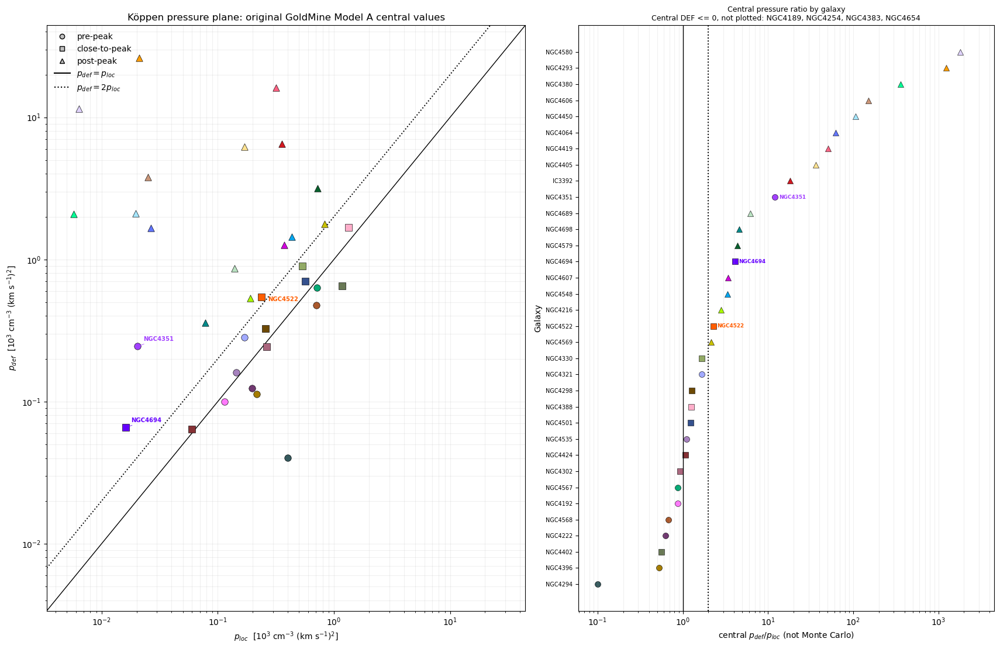
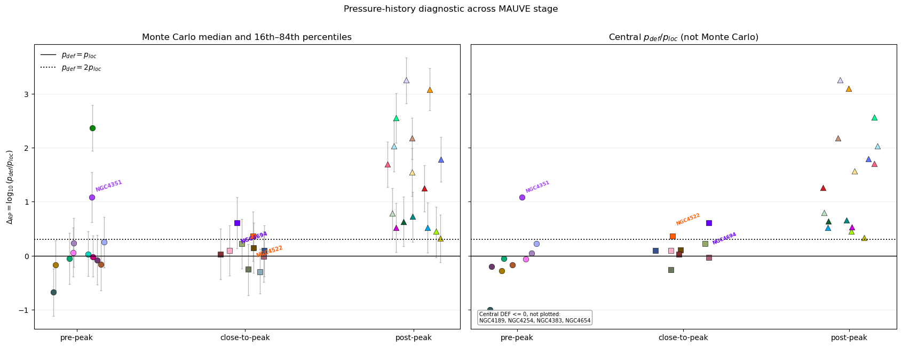
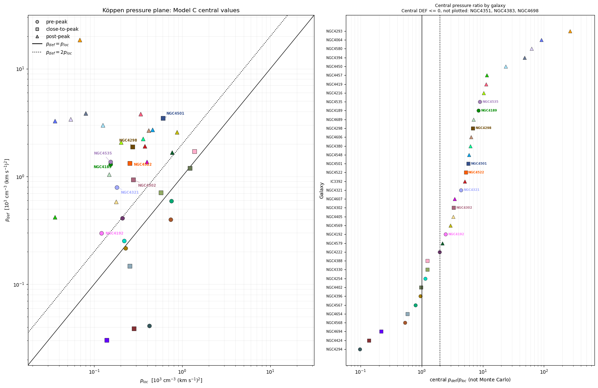
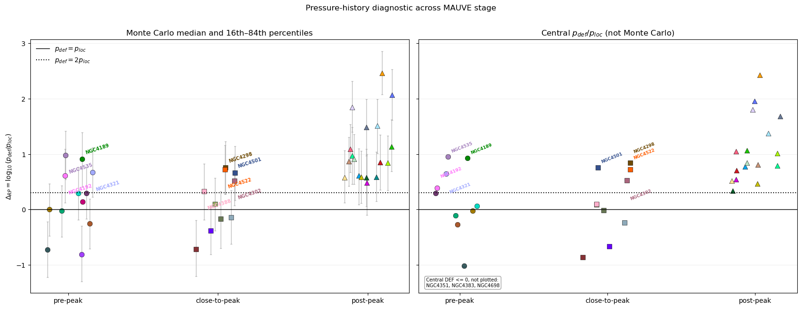

# 20260818 GM Recalculation of Koppen 2018 on MAUVE

Post-peak galaxies are still post-peak by model

## Orignial Koppen+2018 prescription:

B-band 25 magnitude diameter ($D_{25}$): GoldMine

Expected HI mass ($M_\mathrm{HI}$-$D_{25}$ relation):  Gavazzi+2013 (much shallower slope~1.38)

Expected HI diameter ($r_\mathrm{max}$):  $r_\mathrm{max} = 1.5 R_{25}$

## Updated Koppen+2018 prescription:

B-band 25 magnitude diameter ($D_{25}$): Hyperleda (same data source as Jones+2018)

Expected HI mass ($M_\mathrm{HI,expected}$-$D_{25}$ relation):  Jones+2018 (AMIGA survey, morphology-dependent, slope~1.78)

Expected HI diameter (HI size-mass relation):  Wang+2016 (new AMIGA survey also find the same relation)

