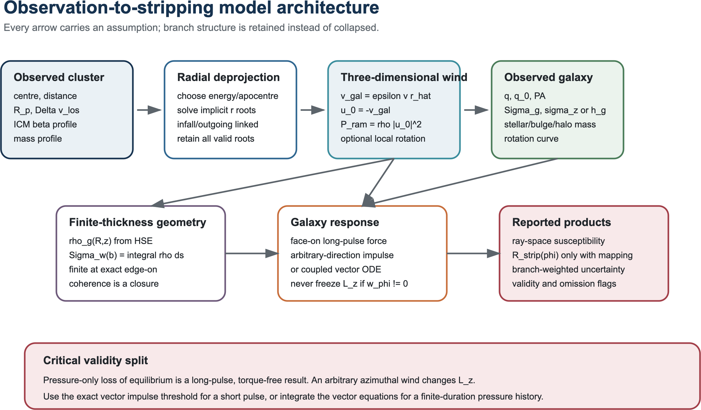
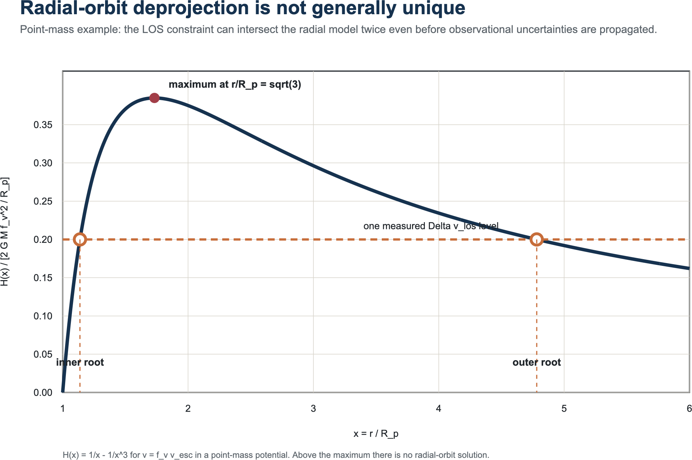
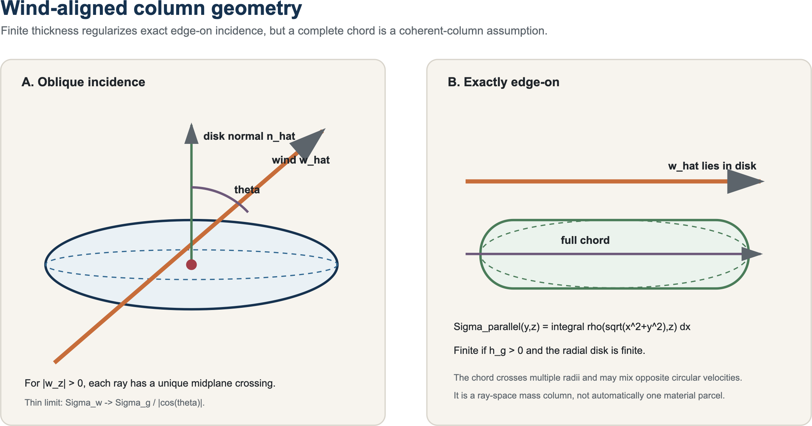
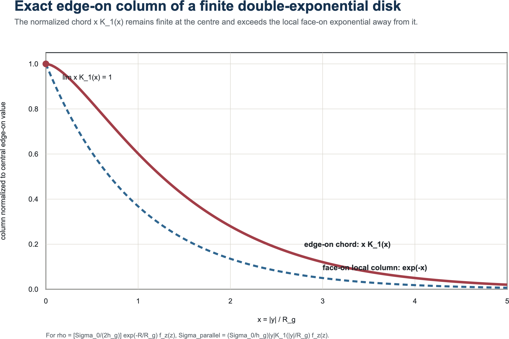

<!-- PAGEBREAK -->

# Contents

1. Executive result
2. What was recovered from the chat chain
3. Scope, assumptions, and notation
4. Cluster and sky coordinate system
5. Analytic cluster environment
6. Radial-orbit reconstruction from observables
7. Disk orientation from imaging
8. Analytic galaxy potential and finite-thickness gas
9. Wind-aligned gas columns
10. Momentum transfer and acceleration
11. Exact vector dynamics and the torque obstruction
12. Long-pulse force limits
13. Exact arbitrary-direction short-pulse criterion
14. General finite-duration response
15. Defining outputs without overclaiming
16. Observable inputs and provenance
17. Step-by-step observation-ready algorithm
18. Uncertainty and degeneracy propagation
19. Limiting-case and falsification tests
20. What Version 1 can claim scientifically
21. Deferred extensions
22. Primary-source claim audit
23. Final model hierarchy
24. References

<!-- PAGEBREAK -->

# Executive result

This document reconstructs the supplied ChatGPT discussion and both predecessor discussions, then independently re-derives the proposed model. The intended Version 1 is clear: combine an analytic cluster environment, an observable-based wind reconstruction, an axisymmetric but finite-thickness gas disk, and a direct-displacement stripping calculation that remains defined at exactly edge-on incidence. It deliberately excludes hydrodynamic simulations and simulation calibration.

The central conclusion is more precise than the chat's draft proposal:

> A finite wind-aligned gas column can be derived for every wind orientation, including exactly edge-on. A three-dimensional wind can be reconstructed under explicit radial-orbit and speed assumptions. However, a single universal, time-independent pressure threshold based on a fixed-\(L_z\) effective potential is not valid for an arbitrary wind, because any azimuthal ram force changes \(L_z\). The general response is vector and time-dependent. The rigorous algebraic arbitrary-direction limit is an impulse threshold; the rigorous pressure-only limit is the long-pulse, torque-free Gunn-Gott family.

This is not a negative result. It identifies a clean, publishable model hierarchy:

1. **Exact environmental envelope:** derive the largest possible centre-of-mass ram pressure compatible with a spherical, monotonic cluster and a bound galaxy.
2. **Branch-retaining radial deprojection:** infer possible three-dimensional positions and winds under a stated radial-orbit energy or local-speed closure.
3. **Exact finite-thickness projection:** calculate the wind-aligned mass column as a Radon transform of \(\rho_g(R,z)\); it is finite at exactly edge-on incidence.
4. **Long-pulse susceptibility:** use the generalized Gunn-Gott force criterion only where the force is torque-free or where a stated constrained-path/coherent-column approximation is acceptable.
5. **Arbitrary-direction benchmark:** use the exact vector impulse threshold, which includes prograde and retrograde azimuthal kicks and remains finite at edge-on.
6. **General finite-duration case:** integrate the coupled vector equations. A duration or pressure history is mathematically unavoidable once the wind exerts torque.

| Proposed statement | Audit result | Correct use |
|---|---|---|
| \(P_\mathrm{ram}=\rho_\mathrm{ICM}v^2\) | Correct astrophysical momentum-flux convention | Include an explicit momentum-transfer coefficient if it is not fixed to unity |
| Boundness plus observables uniquely gives the 3D wind | Incorrect | Boundness supplies an envelope; a radial-orbit energy/speed assumption and branch handling are still required |
| \(v=f_vv_\mathrm{esc}\) is a radial orbit | Only a local kinematic closure | A self-consistent radial orbit uses conserved energy or apocentre |
| \(\Sigma_w=\int\rho_g\,ds\) is finite at edge-on | Correct for an integrable finite-thickness disk | The whole chord is a coherent-column closure, not automatically a material parcel |
| Fixed-\(L_z\) effective potential works for arbitrary wind | Incorrect when \(w_\phi\ne0\) | Restrict to torque-free motion or label it a short-displacement proxy |
| A pressure-only threshold covers arbitrary orientation | Not in general | Long-pulse torque-free force limit, short-pulse vector impulse limit, or full ODE |

{width=96%}

# 1. What was recovered from the chat chain

The supplied conversation and its two linked predecessors contain three layers of development.

## 1.1 First predecessor: the Köppen pressure-pulse framework

The first predecessor derived the face-on gas-column equation

$$
\Sigma_g(R)\,\ddot z
=P_\mathrm{ram}(t)-\Sigma_g(R)\,\frac{\partial\Phi}{\partial z},
$$

and separated two limits:

- a long-pulse, quasi-static force limit controlled by peak pressure;
- a short-pulse limit controlled by the time-integrated pressure, or impulse per area.

It also recognised that an inclined kick changes radial, azimuthal, and vertical motion. That observation is essential: it already implies that a scalar vertical escape calculation cannot simply be rotated into three dimensions.

## 1.2 Second predecessor: edge-on geometry and orbital support

The second predecessor identified exact edge-on incidence as the place where a razor-thin disk fails. It distinguished direct leading-edge displacement from continuous shear/Kelvin-Helmholtz removal, proposed the edge-on chord

$$
\Sigma_\parallel(y,z)=\int_{-\infty}^{\infty}\rho_g(x,y,z)\,dx,
$$

and correctly warned that raw radial gravity cannot be used as an anchoring force because circular rotation already balances it.

It also wrote the exact cylindrical force decomposition for an in-plane wind and noted that both orbital energy and angular momentum change. That is the direct precursor of the torque correction made below.

## 1.3 Current chat: frozen Version-1 scope

The current chat froze the immediate scope to:

- no hydrodynamic simulations and no simulation-derived calibration;
- analytic cluster density and mass profiles;
- a radial-orbit construction for the wind, with assumptions exposed;
- an axisymmetric finite-thickness galaxy;
- direct ram-pressure displacement only;
- all required observables listed at each step;
- time-dependent pulses, KH stripping, multiphase structure, magnetic fields, and spiral arms deferred.

The chat then proposed a fixed-\(L_z\) effective-potential barrier along the wind. The present audit keeps the useful parts of that construction but corrects its domain: fixed \(L_z\) is incompatible with a non-zero azimuthal wind force.

## 1.4 Evidence protocol

The chats are treated as the model specification, not as literature evidence. The classic equations and boundary claims were checked against primary records for Gunn and Gott (1972), Roediger and Brüggen (2006), Köppen et al. (2018), Singh et al. (2019, 2024), Navarro, Frenk and White (1997), and Cavaliere and Fusco-Femiano (1976). No stripping coefficient, threshold, or prior in this report is calibrated to a simulation.

# 2. Scope, assumptions, and notation

## 2.1 Physical scope

Version 1 describes momentum transfer from a smooth ICM flow to cold disk gas in a fixed galaxy potential. It predicts **susceptibility to direct displacement or unbinding**. It does not claim to predict the total gas-loss rate or a unique stripping history.

The baseline assumptions are:

1. The cluster is spherical and static over the calculation interval.
2. The smooth ICM follows a spherical beta profile.
3. The cluster potential is analytic, taken below to be NFW.
4. The galaxy centre follows a radial branch in that spherical potential.
5. The galaxy potential is static and axisymmetric.
6. The cold gas has finite vertical thickness and an axisymmetric density \(\rho_g(R,z)\).
7. Ram pressure is the only external gas-removal channel.
8. The baseline ICM has zero bulk velocity in the cluster frame.
9. The wind direction is frozen during an instantaneous or short-pulse calculation.
10. A specified gas column absorbs a specified fraction of the incident momentum.

Assumptions 4, 9, and 10 dominate the interpretation. They must never be hidden inside a numerical implementation.

## 2.2 Symbols

| Symbol | Meaning |
|---|---|
| \(R_p\) | projected cluster-centric distance |
| \(z_\mathrm{cl}\) | line-of-sight cluster coordinate, positive away from the observer |
| \(r\) | three-dimensional cluster-centric radius, \(r^2=R_p^2+z_\mathrm{cl}^2\) |
| \(u_\mathrm{los}\) | observed galaxy-cluster LOS velocity difference |
| \(\epsilon\) | radial branch: \(-1\) infall, \(+1\) outgoing |
| \(\boldsymbol u_0\) | ICM velocity in the galaxy-centre frame; the global wind |
| \(\hat{\boldsymbol w}\) | force/wind direction, \(\boldsymbol u/|\boldsymbol u|\) |
| \(R,\phi,z\) | cylindrical coordinates in the galaxy disk frame |
| \(\hat{\boldsymbol n}\) | disk normal |
| \(\theta\) | angle between wind and disk normal; face-on \(0\), edge-on \(\pi/2\) |
| \(\Sigma_w\), \(\mu\) | wind-aligned or otherwise chosen coupled mass column |
| \(\mathcal{C}\) | dimensionless momentum-transfer factor, baseline \(\mathcal{C}=1\) |
| \(P_\mathrm{ram}\) | incident momentum flux, \(\rho_\mathrm{ICM}|\boldsymbol u|^2\) |
| \(J\) | pressure impulse per area, \(\int P_\mathrm{ram}\,dt\) |
| \(j\) | velocity kick, \(\mathcal{C}J/\mu\) |
| \(v_c\), \(v_\mathrm{esc}\) | local circular and galaxy escape speeds |

The astrophysical convention \(P_\mathrm{ram}=\rho v^2\), rather than \(\tfrac12\rho v^2\), is used. Any alternative drag convention is absorbed into \(\mathcal{C}\).

# 3. Cluster and sky coordinate system

Define a right-handed sky basis

$$
\hat{\boldsymbol e}_{E}\times\hat{\boldsymbol e}_{N}
=\hat{\boldsymbol e}_\mathrm{los},
$$

where east and north lie in the sky plane and \(\hat{\boldsymbol e}_\mathrm{los}\) points away from the observer. Let the projected cluster-centre-to-galaxy vector be

$$
\boldsymbol R_p=R_p\hat{\boldsymbol R}_p.
$$

For small angular separation \(\Delta\vartheta\), \(R_p\simeq D_\mathrm{cl}\Delta\vartheta\). For a wide field, use the exact angular separation from the two sky positions before multiplying by the adopted cluster distance.

The unknown three-dimensional position is

$$
\boldsymbol r=\boldsymbol R_p+z_\mathrm{cl}\hat{\boldsymbol e}_\mathrm{los},
\qquad
r=\sqrt{R_p^2+z_\mathrm{cl}^2}.
$$

The measured cluster-frame LOS velocity is

$$
u_\mathrm{los}=v_\mathrm{los,gal}-v_\mathrm{los,cl}.
$$

Its sign must be retained. Taking an absolute value too early destroys the coupling between the near/far and infall/outgoing branches.

# 4. Analytic cluster environment

## 4.1 Spherical beta-model ICM

If an X-ray analysis supplies the electron-density normalization \(n_{e0}\), use

$$
n_e(r)=n_{e0}\left[1+\left(\frac{r}{r_c}\right)^2\right]^{-3\beta/2},
$$

and convert to mass density with

$$
\rho_\mathrm{ICM}(r)=\mu_e m_p n_e(r).
$$

Here \(\mu_e\) must match the abundance convention used by the X-ray analysis. If the fit already supplies a mass-density normalization, no second conversion is permitted.

The logarithmic radial gradient is

$$
\frac{d\ln\rho_\mathrm{ICM}}{dr}
=-\frac{3\beta r}{r_c^2+r^2}.
$$

Thus a standard beta profile is monotonic for \(\beta>0\), an assumption used in the projected upper bound below.

## 4.2 NFW cluster mass and potential

Let

$$
x=\frac{r}{r_s},
\qquad
A(x)=\ln(1+x)-\frac{x}{1+x},
\qquad
r_s=\frac{r_{200}}{c_{200}}.
$$

The enclosed mass is

$$
M(<r)=M_{200}\frac{A(x)}{A(c_{200})}.
$$

For the untruncated NFW convention with \(\Phi_\mathrm{cl}(\infty)=0\),

$$
\Phi_\mathrm{cl}(r)
=-\frac{GM_{200}}{A(c_{200})}
\frac{\ln(1+r/r_s)}{r}.
$$

It obeys

$$
\frac{d\Phi_\mathrm{cl}}{dr}=\frac{GM(<r)}{r^2},
\qquad
v_\mathrm{esc,cl}(r)=\sqrt{-2\Phi_\mathrm{cl}(r)}.
$$

If the observational mass model is explicitly truncated, its consistently normalized potential and escape speed must replace these expressions. Mixing a truncated mass with an untruncated escape speed changes the pressure envelope.

## 4.3 Exact projected upper envelope

For a bound galaxy centre,

$$
v_\mathrm{gal}^2(r)\le v_\mathrm{esc,cl}^2(r).
$$

Also \(r\ge R_p\). If both \(\rho_\mathrm{ICM}(r)\) and \(v_\mathrm{esc,cl}(r)\) decrease with radius, then

$$
\rho_\mathrm{ICM}(r)v_\mathrm{gal}^2(r)
\le
\rho_\mathrm{ICM}(R_p)v_\mathrm{esc,cl}^2(R_p).
$$

Therefore

$$
\boxed{
P_\mathrm{loc,max}(R_p)
=\rho_\mathrm{ICM}(R_p)v_\mathrm{esc,cl}^2(R_p)
}
$$

is a true centre-of-mass pressure upper envelope under the spherical, static, monotonic assumptions. It is not a reconstructed pressure and it contains no galaxy anchoring model. Local disk rotation can slightly violate this centre-of-mass velocity bound for individual gas elements, so it must be treated separately.

## 4.4 Unit sanity check

If the measured quantity is electron density,

$$
P_\mathrm{ram}
\simeq 1.91\times10^{-11}
\left(\frac{\mu_e}{1.14}\right)
\left(\frac{n_e}{10^{-3}\ \mathrm{cm}^{-3}}\right)
\left(\frac{v}{1000\ \mathrm{km\ s}^{-1}}\right)^2
\ \mathrm{dyn\ cm}^{-2}.
$$

This is comparable to the thin-sheet anchoring scale

$$
2\pi G\Sigma_\star\Sigma_g
\simeq 1.83\times10^{-11}
\left(\frac{\Sigma_\star}{100\ M_\odot\,\mathrm{pc}^{-2}}\right)
\left(\frac{\Sigma_g}{10\ M_\odot\,\mathrm{pc}^{-2}}\right)
\ \mathrm{dyn\ cm}^{-2}.
$$

These numbers are unit checks, not adopted MAUVE parameters.

# 5. Radial-orbit reconstruction from observables

## 5.1 Radial branch equation

On a radial branch,

$$
\boldsymbol v_\mathrm{gal}
=\epsilon\,v(r)\,\hat{\boldsymbol r},
\qquad
\epsilon=
\begin{cases}
-1,&\text{infall},\\
+1,&\text{outgoing}.
\end{cases}
$$

Projecting along the line of sight gives

$$
u_\mathrm{los}
=\epsilon v(r)\frac{z_\mathrm{cl}}{r}.
$$

Squaring and using \(z_\mathrm{cl}^2=r^2-R_p^2\),

$$
\boxed{
u_\mathrm{los}^2
=v^2(r)\left(1-\frac{R_p^2}{r^2}\right)
}
$$

or equivalently

$$
F(r)=r\sqrt{1-\left[\frac{u_\mathrm{los}}{v(r)}\right]^2}-R_p=0,
\qquad
r\ge R_p,
\qquad
v(r)>|u_\mathrm{los}|.
$$

This is an implicit root problem. It is not, in general, a unique algebraic deprojection.

## 5.2 Physically consistent radial speed: energy or apocentre

For a time-independent spherical cluster, the radial specific energy

$$
E_\mathrm{cl}=\frac12v^2+\Phi_\mathrm{cl}(r)
$$

is conserved. Parameterizing a bound orbit by its apocentre \(r_a\), where \(v(r_a)=0\), gives

$$
E_\mathrm{cl}=\Phi_\mathrm{cl}(r_a),
$$

and hence

$$
\boxed{
v(r;r_a)=\sqrt{2\left[\Phi_\mathrm{cl}(r_a)-\Phi_\mathrm{cl}(r)\right]}
}
$$

for radii accessible to that orbit. The marginally bound limit \(r_a\rightarrow\infty\) has \(E_\mathrm{cl}=0\) and

$$
v(r)=v_\mathrm{esc,cl}(r).
$$

This is the preferred orbit closure if the calculation is meant to describe a trajectory.

## 5.3 Local speed fraction \(f_v\)

One may instead define, at the current location only,

$$
f_v(r)=\frac{v(r)}{v_\mathrm{esc,cl}(r)},
\qquad
0\le f_v<1
$$

for a bound orbit, with \(f_v=1\) the marginally bound envelope. Then

$$
u_\mathrm{los}^2
=f_v^2v_\mathrm{esc,cl}^2(r)
\left(1-\frac{R_p^2}{r^2}\right).
$$

A constant \(f_v<1\) applied at every radius is **not** a conserved radial orbit. Indeed,

$$
E_\mathrm{cl}(r)
=\frac12f_v^2v_\mathrm{esc,cl}^2(r)+\Phi_\mathrm{cl}(r)
=(1-f_v^2)\Phi_\mathrm{cl}(r),
$$

which varies with \(r\). Thus \(f_v\) is useful as a transparent one-epoch pressure bracket, while \(r_a\) or \(E_\mathrm{cl}\) is the dynamically consistent parameter.

The interval \(1/\sqrt2\le f_v\le1\) suggested in the chat is not a universal bound. A bound radial orbit has \(f_v=0\) at apocentre. The value \(1/\sqrt2\) is the circular-to-escape ratio only in a Kepler potential and does not impose a lower radial speed.

## 5.4 Zero, one, or multiple radius roots

Even after choosing \(v(r)\), the LOS equation can have zero, one, or multiple roots. A point-mass example makes this explicit. With

$$
v^2(r)=f_v^2\frac{2GM}{r},
$$

the LOS equation becomes

$$
u_\mathrm{los}^2
=2GMf_v^2\left(\frac1r-\frac{R_p^2}{r^3}\right).
$$

Differentiating the bracketed function gives

$$
-\frac1{r^2}+\frac{3R_p^2}{r^4}=0
\quad\Longrightarrow\quad
r=\sqrt3R_p.
$$

The maximum is

$$
u_\mathrm{los,max}^2
=\frac{4GMf_v^2}{3\sqrt3R_p}.
$$

Therefore a LOS velocity below this maximum usually intersects the model twice, equality gives one tangent root, and a larger velocity gives no solution.

{width=94%}

An NFW model must therefore be root-scanned over its full allowed interval. A solver initialized once near \(R_p\) is not a valid branch census.

## 5.5 Recovering position, velocity, and wind for each root

For every valid radius root and branch \(\epsilon\),

$$
z_\mathrm{cl}
=\frac{u_\mathrm{los}r}{\epsilon v(r)},
$$

$$
\boldsymbol v_{\perp}
=\epsilon v(r)\frac{R_p}{r}\hat{\boldsymbol R}_p,
$$

and

$$
\boldsymbol v_\mathrm{gal}
=\boldsymbol v_{\perp}+u_\mathrm{los}\hat{\boldsymbol e}_\mathrm{los}.
$$

The signs satisfy

$$
\operatorname{sgn}(u_\mathrm{los})
=\epsilon\operatorname{sgn}(z_\mathrm{cl}).
$$

Thus near/far and infall/outgoing are linked, not four independent binary choices. In a static ICM,

$$
\boldsymbol u_0=-\boldsymbol v_\mathrm{gal},
\qquad
\hat{\boldsymbol w}_0=\frac{\boldsymbol u_0}{|\boldsymbol u_0|},
\qquad
P_\mathrm{ram,0}=\rho_\mathrm{ICM}(r)|\boldsymbol u_0|^2.
$$

If the ICM has a measured bulk velocity \(\boldsymbol v_\mathrm{ICM}\), replace \(-\boldsymbol v_\mathrm{gal}\) with \(\boldsymbol v_\mathrm{ICM}-\boldsymbol v_\mathrm{gal}\).

# 6. Disk orientation from imaging

## 6.1 Inclination from apparent flattening

For an oblate disk with apparent axis ratio \(q=b/a\) and adopted intrinsic thickness \(q_0\),

$$
q^2=\cos^2i+q_0^2\sin^2i,
$$

so

$$
\boxed{
\cos^2i=\frac{q^2-q_0^2}{1-q_0^2}
}.
$$

The measured ratio must be clipped only within its uncertainty-consistent physical interval \(q_0\le q\le1\); an unphysical central value is a data/model warning, not permission to silently force an inclination.

## 6.2 Position angle and the two disk-plane branches

Let PA be measured north through east. A projected major-axis unit vector is

$$
\hat{\boldsymbol p}
=\sin(\mathrm{PA})\hat{\boldsymbol e}_E
+\cos(\mathrm{PA})\hat{\boldsymbol e}_N,
$$

and choose the perpendicular projected minor-axis vector

$$
\hat{\boldsymbol m}
=-\cos(\mathrm{PA})\hat{\boldsymbol e}_E
+\sin(\mathrm{PA})\hat{\boldsymbol e}_N.
$$

Imaging alone leaves two distinct disk planes:

$$
\hat{\boldsymbol n}_s
=\cos i\,\hat{\boldsymbol e}_\mathrm{los}
+s\sin i\,\hat{\boldsymbol m},
\qquad s=\pm1.
$$

The overall sign of a normal describes the same plane, but the two values of \(s\) are the unresolved near-side tilt branches.

Define a right-handed disk basis

$$
\hat{\boldsymbol e}_1=\hat{\boldsymbol p},
\qquad
\hat{\boldsymbol e}_2=\hat{\boldsymbol n}_s\times\hat{\boldsymbol e}_1.
$$

## 6.3 Wind angle and local cylindrical components

The unsigned incidence angle is

$$
\cos\theta=\left|\hat{\boldsymbol n}_s\cdot\hat{\boldsymbol w}_0\right|,
\qquad
0\le\theta\le\frac\pi2.
$$

At disk azimuth \(\phi\),

$$
\hat{\boldsymbol e}_R
=\cos\phi\,\hat{\boldsymbol e}_1
+\sin\phi\,\hat{\boldsymbol e}_2,
$$

$$
\hat{\boldsymbol e}_\phi
=-\sin\phi\,\hat{\boldsymbol e}_1
+\cos\phi\,\hat{\boldsymbol e}_2.
$$

The signed force-direction components are

$$
w_R=\hat{\boldsymbol w}\cdot\hat{\boldsymbol e}_R,
\qquad
w_\phi=\hat{\boldsymbol w}\cdot\hat{\boldsymbol e}_\phi,
\qquad
w_z=\hat{\boldsymbol w}\cdot\hat{\boldsymbol n}_s.
$$

They satisfy \(w_R^2+w_\phi^2+w_z^2=1\). The azimuthal component \(w_\phi\) is the torque term that invalidates fixed \(L_z\).

## 6.4 Local disk rotation in the relative wind

A gas element has galaxy-frame circular velocity \(v_c(R)\hat{\boldsymbol e}_\phi\). Its local ICM velocity is therefore

$$
\boldsymbol u(R,\phi)
=\boldsymbol u_0-v_c(R)\hat{\boldsymbol e}_\phi,
$$

with

$$
|\boldsymbol u|^2
=|\boldsymbol u_0|^2+v_c^2
-2|\boldsymbol u_0|v_c
(\hat{\boldsymbol w}_0\cdot\hat{\boldsymbol e}_\phi).
$$

This produces a real prograde/retrograde pressure asymmetry. It also means that local wind rays are no longer globally parallel. A consistent implementation must choose one of two modes:

- **global-ray baseline:** neglect \(v_c/|\boldsymbol u_0|\) in the ray geometry and quantify that ratio;
- **local-streamline refinement:** recompute \(\boldsymbol u\), \(\hat{\boldsymbol w}\), and the coupled column separately at each patch.

It is inconsistent to use one global set of parallel columns and simultaneously claim an exact local-rotation wind direction.

# 7. Analytic galaxy potential and finite-thickness gas

## 7.1 Axisymmetric potential decomposition

Write

$$
\Phi(R,z)=\Phi_\star+\Phi_b+\Phi_h+\Phi_g,
$$

where the gas term is included only if it is modelled self-consistently.

An analytic stellar disk can be represented by a Miyamoto-Nagai component,

$$
\Phi_\star(R,z)
=-\frac{GM_\star}
{\sqrt{R^2+\left(a_\star+\sqrt{z^2+b_\star^2}\right)^2}}.
$$

Let

$$
B=\sqrt{z^2+b_\star^2},
\qquad
D=\sqrt{R^2+(a_\star+B)^2}.
$$

Then

$$
\frac{\partial\Phi_\star}{\partial R}
=\frac{GM_\star R}{D^3},
$$

$$
\frac{\partial\Phi_\star}{\partial z}
=\frac{GM_\star(a_\star+B)z}{BD^3}.
$$

A Hernquist bulge is

$$
\Phi_b(r_g)=-\frac{GM_b}{r_g+a_b},
\qquad
r_g=\sqrt{R^2+z^2},
$$

with

$$
\frac{\partial\Phi_b}{\partial R}
=\frac{GM_b}{(r_g+a_b)^2}\frac{R}{r_g},
\qquad
\frac{\partial\Phi_b}{\partial z}
=\frac{GM_b}{(r_g+a_b)^2}\frac{z}{r_g}.
$$

An NFW halo has the same functional form as the cluster NFW potential after replacing the cluster parameters by the galaxy-halo parameters.

The circular speed and vertical frequency are

$$
v_c^2(R)=R\left.\frac{\partial\Phi}{\partial R}\right|_{z=0},
$$

$$
\nu_z^2(R)=\left.\frac{\partial^2\Phi}{\partial z^2}\right|_{z=0}.
$$

For the Miyamoto-Nagai disk alone,

$$
\nu_{z,\star}^2(R)
=\frac{GM_\star(a_\star+b_\star)}
{b_\star\left[R^2+(a_\star+b_\star)^2\right]^{3/2}}.
$$

For any spherical component, its midplane contribution is \(GM(<R)/R^3\).

## 7.2 Vertical hydrostatic equilibrium

For a gas layer with vertical dispersion \(\sigma_z(R)\), hydrostatic equilibrium gives

$$
\frac{\partial[\rho_g(R,z)\sigma_z^2(R,z)]}{\partial z}
=-\rho_g(R,z)\frac{\partial\Phi}{\partial z}.
$$

If \(\sigma_z\) is independent of \(z\), divide by \(\rho_g\sigma_z^2\) and integrate from the midplane:

$$
\ln\frac{\rho_g(R,z)}{\rho_g(R,0)}
=-\frac{\Phi(R,z)-\Phi(R,0)}{\sigma_z^2(R)}.
$$

Thus

$$
\boxed{
\rho_g(R,z)
=\rho_g(R,0)
\exp\left[-\frac{\Phi(R,z)-\Phi(R,0)}{\sigma_z^2(R)}\right]
}
$$

with normalization

$$
\rho_g(R,0)
=\frac{\Sigma_g(R)}
{\displaystyle\int_{-\infty}^{\infty}
\exp\left[-\frac{\Phi(R,z)-\Phi(R,0)}{\sigma_z^2(R)}\right]dz}.
$$

Near the midplane,

$$
\Phi(R,z)-\Phi(R,0)\simeq\frac12\nu_z^2z^2,
$$

so the layer is locally Gaussian with characteristic scale

$$
h_g\simeq\frac{\sigma_z}{\nu_z}.
$$

If \(\Phi_g\) is retained, \(\rho_g\) and the gas potential must be solved together with Poisson's equation. Inserting a gas potential inferred from a density and then re-deriving a different density from that potential is not self-consistent. The clean Version-1 alternatives are:

- neglect gas self-gravity and use the external stellar/bulge/halo potential;
- solve the coupled hydrostatic-Poisson problem;
- use an observed or explicitly parameterized \(h_g(R)\) and label it empirical.

## 7.3 Separable analytic demonstration profile

For analytic checks, use the normalized finite disk

$$
\rho_g(R,z)
=\frac{\Sigma_0}{2h_g}
\exp\left(-\frac{R}{R_g}\right)
\operatorname{sech}^2\left(\frac{z}{h_g}\right).
$$

Because

$$
\int_{-\infty}^{\infty}
\operatorname{sech}^2(z/h_g)\,dz=2h_g,
$$

its face-on surface density is \(\Sigma_g(R)=\Sigma_0e^{-R/R_g}\).

# 8. Wind-aligned gas columns

## 8.1 Coordinate-free definition

Let \(\boldsymbol b\) lie in the plane perpendicular to the wind,

$$
\boldsymbol b\cdot\hat{\boldsymbol w}=0.
$$

A wind ray is

$$
\boldsymbol x(s)=\boldsymbol b+s\hat{\boldsymbol w}.
$$

The full wind-aligned mass column is

$$
\boxed{
\Sigma_w(\boldsymbol b)
=\int_{-\infty}^{\infty}
\rho_g(\boldsymbol b+s\hat{\boldsymbol w})\,ds
}.
$$

This is a Radon transform of the three-dimensional gas density. It is naturally indexed in **ray space**, not by a unique disk element.

For \(|w_z|>0\), every ray crosses the midplane once, so the ray can be labelled by that crossing \((R_0,\phi_0)\). At exactly edge-on, \(w_z=0\), the ray lies parallel to the midplane and has no unique midplane crossing. Its natural labels are an in-plane impact parameter and a height.

{width=96%}

## 8.2 Thin-disk limit away from edge-on

Represent a razor-thin disk as

$$
\rho_g(R,z)=\Sigma_g(R)\delta(z).
$$

For a ray that crosses the midplane at \(s=s_0\),

$$
z(s)=w_z(s-s_0).
$$

Using \(\delta[w_z(s-s_0)]=\delta(s-s_0)/|w_z|\),

$$
\Sigma_w
=\int\Sigma_g[R(s)]\delta[w_z(s-s_0)]\,ds
=\frac{\Sigma_g(R_0)}{|w_z|}.
$$

Since \(|w_z|=|\cos\theta|\),

$$
\boxed{
\Sigma_w\rightarrow\frac{\Sigma_g}{|\cos\theta|}
}
$$

for non-edge-on incidence when radial gradients across the vertical crossing are negligible. The corresponding coherent-column acceleration is

$$
a_\mathrm{ram}=\frac{P_\mathrm{ram}}{\Sigma_w}
=\frac{P_\mathrm{ram}|\cos\theta|}{\Sigma_g}.
$$

The vertical restoring acceleration projected along the wind is \(g_z|\cos\theta|\), so the cosine cancels in a force comparison. This is why a thin-disk projected-area argument predicts weak inclination dependence until the edge-on singular regime is approached. It is not the same as replacing the ram pressure by \(P_\mathrm{ram}\cos^2\theta\).

## 8.3 Exact edge-on chord for the finite analytic disk

Take an edge-on wind along the disk \(x\)-axis. A ray is labelled by \((y,z)\), and the cylindrical radius along it is

$$
R(x)=\sqrt{x^2+y^2}.
$$

For the profile in Section 7.3,

$$
\Sigma_\parallel(y,z)
=\frac{\Sigma_0}{2h_g}
\operatorname{sech}^2\left(\frac{z}{h_g}\right)
\int_{-\infty}^{\infty}
\exp\left[-\frac{\sqrt{x^2+y^2}}{R_g}\right]dx.
$$

Let \(b=|y|\) and substitute \(x=b\sinh t\). Then

$$
\sqrt{x^2+b^2}=b\cosh t,
\qquad
dx=b\cosh t\,dt.
$$

The even integral becomes

$$
2b\int_0^\infty
\exp\left[-\frac{b}{R_g}\cosh t\right]
\cosh t\,dt.
$$

Using the integral representation

$$
K_\nu(x)=\int_0^\infty e^{-x\cosh t}\cosh(\nu t)\,dt,
$$

the exact chord is

$$
\boxed{
\Sigma_\parallel(y,z)
=\frac{\Sigma_0|y|}{h_g}
K_1\left(\frac{|y|}{R_g}\right)
\operatorname{sech}^2\left(\frac{z}{h_g}\right)
}.
$$

As \(x\rightarrow0\), \(K_1(x)\sim1/x\). Therefore

$$
\boxed{
\Sigma_\parallel(0,z)
=\frac{\Sigma_0R_g}{h_g}
\operatorname{sech}^2\left(\frac{z}{h_g}\right)
}
$$

is finite. Both a non-zero vertical scale and a radially integrable disk are required; thickness alone does not rescue a disk with an infinite constant radial density.

{width=94%}

## 8.4 What the full chord does and does not mean

The column integral is an exact geometric mass projection. Treating that full mass as one accelerated body is an additional **coherent-column closure**. This is particularly restrictive at edge-on:

- one chord spans multiple radii;
- a central chord crosses both sides of the galaxy;
- circular velocities along the chord may differ or point oppositely;
- pressure may couple only to an upstream skin before internal momentum transfer occurs;
- shear and rotation can separate material before the full chord responds coherently.

A transparent bracket introduces a coupling length \(\ell_c\) from the upstream intercept \(s_\mathrm{lead}\):

$$
\mu_{\ell_c}(\boldsymbol b)
=\int_{s_\mathrm{lead}}^{s_\mathrm{lead}+\ell_c}
\rho_g(\boldsymbol b+s\hat{\boldsymbol w})\,ds.
$$

The full-chord model is \(\ell_c\) large enough to include the entire disk; an exposed-layer model has finite \(\ell_c\). Version 1 may adopt the full chord as its baseline, but it must report that choice and should bracket it against a finite exposed layer when data do not constrain internal coupling.

# 9. Momentum transfer and acceleration

Define the incident ICM momentum flux

$$
P_\mathrm{ram}(t)=\rho_\mathrm{ICM}(r)\,|\boldsymbol u(t)|^2.
$$

Let

$$
\mathcal{C}=C_D\chi
$$

combine a drag/momentum-transfer coefficient \(C_D\) and a coupled or intercepted fraction \(\chi\). The baseline full-absorption choice is \(\mathcal{C}=1\). It is a declared assumption, not a universal constant.

For coupled mass column \(\mu\), the acceleration magnitude is

$$
a_\mathrm{ram}(t)=\frac{\mathcal{C}P_\mathrm{ram}(t)}{\mu},
$$

and the vector acceleration is

$$
\boldsymbol a_\mathrm{ram}(t)
=a_\mathrm{ram}(t)\hat{\boldsymbol w}(t).
$$

The dimensions are

$$
\frac{[P]}{[\mu]}
=\frac{M L^{-1}T^{-2}}{M L^{-2}}
=L T^{-2},
$$

as required. By contrast, \(\mu\Delta\Phi\) is energy per area, or force per length, not pressure. A pressure criterion must contain a potential **gradient**, whereas an impulse/work criterion may contain a potential difference.

# 10. Exact vector dynamics and the torque obstruction

## 10.1 Equations of motion

For a local gas element in the static axisymmetric galaxy potential,

$$
\ddot{\boldsymbol x}
=-\boldsymbol\nabla\Phi(\boldsymbol x)
+a_\mathrm{ram}(t)\hat{\boldsymbol w}(t).
$$

In cylindrical components,

$$
\ddot R-R\dot\phi^2
=-\frac{\partial\Phi}{\partial R}
+a_\mathrm{ram}w_R,
$$

$$
R\ddot\phi+2\dot R\dot\phi
=a_\mathrm{ram}w_\phi,
$$

$$
\ddot z
=-\frac{\partial\Phi}{\partial z}
+a_\mathrm{ram}w_z.
$$

An initially circular midplane element has

$$
R(0)=R_0,
\quad z(0)=0,
\quad \dot R(0)=\dot z(0)=0,
\quad \dot\phi(0)=\Omega(R_0)=\frac{v_c(R_0)}{R_0}.
$$

These equations are the minimum dynamically correct Version-1 response for an arbitrary finite-duration wind. They are ordinary differential equations, not a hydrodynamic simulation.

## 10.2 Energy and angular-momentum rates

The specific orbital energy in the galaxy potential is

$$
E=\frac12\left(\dot R^2+R^2\dot\phi^2+\dot z^2\right)+\Phi(R,z).
$$

For a static \(\Phi\),

$$
\frac{dE}{dt}
=\boldsymbol v\cdot\boldsymbol a_\mathrm{ram}.
$$

The specific axial angular momentum is

$$
L_z=R^2\dot\phi,
$$

and the azimuthal equation gives

$$
\boxed{
\frac{dL_z}{dt}=Ra_\mathrm{ram}w_\phi
}.
$$

Therefore any non-zero \(w_\phi\) changes \(L_z\). For an in-plane wind with in-disk azimuth \(\phi_w\), one may write, up to the chosen azimuth sign convention,

$$
w_\phi=\sin\theta\,\sin(\phi_w-\phi).
$$

It is non-zero over almost all azimuths of an inclined or edge-on disk.

## 10.3 Why the chat's fixed-\(L_z\) scalar is not general

For torque-free motion in an axisymmetric potential,

$$
\Phi_\mathrm{eff}(R,z;L_z)
=\Phi(R,z)+\frac{L_z^2}{2R^2}
$$

is the correct reduced potential. The proposed chat criterion effectively treated \(L_z\) as fixed while allowing an arbitrary wind. Equations above show the contradiction: the same arbitrary wind generally has \(w_\phi\ne0\), and hence \(\dot L_z\ne0\).

This is a first-order effect, not a small formal correction. For a short pulse, define

$$
j=\frac{\mathcal{C}J}{\mu},
\qquad
J=\int P_\mathrm{ram}(t)\,dt.
$$

Then

$$
\frac{|\Delta L_z|}{L_z}
\simeq\frac{j|w_\phi|}{v_c}.
$$

The fixed-\(L_z\) approximation is controlled only when this dimensionless ratio is small. Near an unbinding kick, \(j\) is often comparable to a substantial fraction of \(v_\mathrm{esc}\), so the ratio need not be small.

# 11. Long-pulse force limits

## 11.1 Exact face-on generalized Gunn-Gott limit

For a face-on wind and a coherent column at fixed \(R\), symmetry gives \(w_R=w_\phi=0\) and \(|w_z|=1\). The column equation is

$$
\ddot z
=\frac{\mathcal{C}P_\mathrm{ram}}{\Sigma_g(R)}
-\frac{\partial\Phi(R,z)}{\partial z}.
$$

A static equilibrium satisfies

$$
\frac{\mathcal{C}P_\mathrm{ram}}{\Sigma_g(R)}
=\frac{\partial\Phi}{\partial z}.
$$

As pressure increases slowly, the stable equilibrium moves away from the plane. It disappears when the required gravitational acceleration exceeds the maximum available value. Therefore

$$
\boxed{
P_\mathrm{crit,face}(R)
=\frac{\Sigma_g(R)}{\mathcal{C}}
\max_{z\ge0}
\left[\frac{\partial\Phi(R,z)}{\partial z}\right]
}.
$$

This is the finite-potential form of the long-pulse criterion used by Köppen et al. It requires a pressure pulse long compared with the vertical response time

$$
T_z(R)=\frac{2\pi}{\nu_z(R)}.
$$

For an infinite razor-thin stellar sheet, the gravitational field immediately above the sheet is \(2\pi G\Sigma_\star\), so

$$
P_\mathrm{crit,face}=\frac{2\pi G\Sigma_\star\Sigma_g}{\mathcal{C}},
$$

which recovers Gunn and Gott when \(\mathcal{C}=1\).

## 11.2 Moderate-inclination thin-disk cancellation

For a disk area \(dA\), the area normal to the wind is \(|\cos\theta|dA\). The wind force is

$$
dF_\mathrm{ram}=P_\mathrm{ram}|\cos\theta|dA.
$$

If restoring gravity is vertical, its component opposing the wind is

$$
dF_\mathrm{grav}
=\Sigma_g g_z|\cos\theta|dA.
$$

Equating the two cancels \(|\cos\theta|\). The same cancellation appeared in Section 8.2 through \(\Sigma_w=\Sigma_g/|\cos\theta|\). Roediger and Brüggen explicitly identify this thin-disk result and its failure near exact edge-on, where the projected face area vanishes and the finite disk side becomes leading order.

## 11.3 A coherent-column gravitational susceptibility

If a full wind ray is assumed to translate coherently by \(q\hat{\boldsymbol w}\), a purely gravitational force per wind-normal area can be defined as

$$
F_{g,\parallel}(q;\boldsymbol b)
=\int_{-\infty}^{\infty}
\rho_g(\boldsymbol b+s\hat{\boldsymbol w})
\left[
\boldsymbol\nabla\Phi(\boldsymbol b+(s+q)\hat{\boldsymbol w})
\cdot\hat{\boldsymbol w}
\right]ds.
$$

The corresponding long-pulse proxy is

$$
P_\mathrm{crit,column}(\boldsymbol b)
=\frac1{\mathcal{C}}
\max_{q\ge0}[F_{g,\parallel}(q;\boldsymbol b)]_+.
$$

This expression has pressure units and exactly reduces to the face-on column result if \(\rho_g=\Sigma_g\delta(z)\) and the displacement is vertical. However, for in-plane motion it ignores the original circular velocity distribution and centrifugal support along the chord. It is therefore a **non-rotating rigid-column susceptibility**, not an exact rotating-disk stripping threshold.

## 11.4 Torque-free effective-potential path proxy

For a single gas element with \(w_\phi=0\), \(L_z=L_{z0}\) is conserved. If the motion is additionally constrained to a meridional straight path

$$
R(q)=R_0+qw_R,
\qquad
z(q)=qw_z,
$$

then

$$
\frac{d\Phi_\mathrm{eff}}{dq}
=w_R\left(
\frac{\partial\Phi}{\partial R}
-\frac{L_{z0}^2}{R^3}
\right)
+w_z\frac{\partial\Phi}{\partial z}.
$$

The one-dimensional constrained equation is

$$
\ddot q
=\frac{\mathcal{C}P_\mathrm{ram}}{\mu}
-\frac{d\Phi_\mathrm{eff}}{dq}.
$$

Its loss-of-equilibrium threshold is

$$
\boxed{
P_\mathrm{crit,path}
=\frac{\mu}{\mathcal{C}}
\max_{q\ge0}
\left[\frac{d\Phi_\mathrm{eff}}{dq}\right]_+
}.
$$

This is exact only for the stated constrained-path model. Torque-free motion in the full meridional plane has two degrees of freedom. Its more rigorous quasi-static equilibrium is obtained from the tilted effective potential

$$
U(R,z;a)=\Phi_\mathrm{eff}(R,z)-a(w_RR+w_zz).
$$

An equilibrium branch obeys

$$
\frac{\partial\Phi_\mathrm{eff}}{\partial R}=aw_R,
\qquad
\frac{\partial\Phi_\mathrm{eff}}{\partial z}=aw_z.
$$

It loses local stability when the smallest eigenvalue of the Hessian of \(\Phi_\mathrm{eff}\) reaches zero. This implicit two-dimensional saddle-node calculation is preferable to a straight path when \(w_R\) is appreciable, but it still requires \(w_\phi=0\) and quasi-static response.

## 11.5 Point-mass checks: vertical and radial support differ

For \(\Phi=-GM/\sqrt{R_0^2+z^2}\), the vertical restoring acceleration at fixed \(R_0\) is

$$
g_z(z)=\frac{GMz}{(R_0^2+z^2)^{3/2}}.
$$

Setting \(dg_z/dz=0\) gives \(z=R_0/\sqrt2\), and

$$
g_{z,\max}
=\frac{2}{3\sqrt3}\frac{GM}{R_0^2}.
$$

The circular acceleration is \(GM/R_0^2\), so their ratio is

$$
g\equiv\frac{v_c^2/R_0}{g_{z,\max}}
=\frac{3\sqrt3}{2}=2.598.
$$

The value \(g\simeq2\) discussed by Köppen et al. is an empirical outer-disk approximation, not a universal constant.

For torque-free outward radial displacement with the initial point-mass circular angular momentum \(L_{z0}^2=GMR_0\),

$$
g_{R,\mathrm{eff}}(R)
=\frac{GM}{R^2}-\frac{GMR_0}{R^3}.
$$

It peaks at \(R=3R_0/2\), with

$$
g_{R,\mathrm{eff},max}
=\frac{4}{27}\frac{GM}{R_0^2}.
$$

The radial effective-restoring problem therefore cannot be obtained by reusing a vertical \(g\) factor.

# 12. Exact arbitrary-direction short-pulse criterion

The arbitrary-direction analytic result becomes clean in the impulse limit. Define the incident pressure impulse

$$
J=\int_{-\infty}^{\infty}P_\mathrm{ram}(t)\,dt
$$

and the velocity kick of the chosen coupled mass column

$$
j=\frac{\mathcal{C}J}{\mu}.
$$

If the pulse is short enough that position and wind direction are frozen during the kick, an initially circular element changes from

$$
\boldsymbol v_0=v_c\hat{\boldsymbol e}_\phi
$$

to

$$
\boldsymbol v'=v_c\hat{\boldsymbol e}_\phi+j\hat{\boldsymbol w}.
$$

The post-kick specific energy is

$$
E'
=\Phi(R,0)
+\frac12\left|v_c\hat{\boldsymbol e}_\phi+j\hat{\boldsymbol w}\right|^2.
$$

Expanding the square,

$$
E'
=\Phi(R,0)
+\frac12\left(v_c^2+j^2+2v_cjw_\phi\right).
$$

With \(\Phi(\infty)=0\), define \(v_\mathrm{esc}^2=-2\Phi(R,0)\). The escape boundary \(E'=0\) is

$$
j^2+2v_cw_\phi j+v_c^2-v_\mathrm{esc}^2=0.
$$

The positive root is

$$
\boxed{
j_\mathrm{crit}
=-v_cw_\phi
+\sqrt{v_c^2w_\phi^2+v_\mathrm{esc}^2-v_c^2}
}.
$$

Therefore

$$
\boxed{
J_\mathrm{crit}(R,\phi)
=\frac{\mu(R,\phi)}{\mathcal{C}}
\left[
-v_cw_\phi
+\sqrt{v_c^2w_\phi^2+v_\mathrm{esc}^2-v_c^2}
\right]
}.
$$

This is an exact algebraic arbitrary-direction escape threshold under the frozen-position, fixed-direction impulse assumptions.

Its limiting cases are instructive:

### Face-on or radial kick

If \(w_\phi=0\),

$$
j_\mathrm{crit}=\sqrt{v_\mathrm{esc}^2-v_c^2},
$$

which is the Köppen face-on short-pulse result.

### Prograde tangential kick

If \(w_\phi=+1\),

$$
j_\mathrm{crit}=v_\mathrm{esc}-v_c.
$$

The wind adds directly to the circular velocity, so the required kick is smallest.

### Retrograde tangential kick

If \(w_\phi=-1\),

$$
j_\mathrm{crit}=v_\mathrm{esc}+v_c.
$$

The kick must first remove the prograde orbital velocity and then supply escape speed in the opposite direction.

### Exact edge-on incidence

At \(\theta=\pi/2\), \(w_z=0\) but the formula remains finite. With the coherent chord closure, use \(\mu=\Sigma_\parallel(y,z)\). With a local exposed-layer model, use the corresponding finite \(\mu_{\ell_c}\). The geometry is exact in both cases; the choice of coupled mass is the physical closure.

This result also shows why a pressure-only criterion is insufficient for arbitrary orientation: two pulses with the same peak pressure but different durations have different \(J\), different \(\Delta L_z\), and potentially different escape outcomes.

# 13. General finite-duration response

## 13.1 Local forced epicyclic system

For small displacements about a circular orbit, let \(x\) be radial, \(y\) azimuthal distance in the corotating frame, and \(z\) vertical. Define

$$
\Omega=\frac{v_c}{R},
\qquad
\kappa^2=R\frac{d\Omega^2}{dR}+4\Omega^2,
\qquad
\nu_z^2=\left.\frac{\partial^2\Phi}{\partial z^2}\right|_0.
$$

The linear forced equations are

$$
\ddot x-2\Omega\dot y-(4\Omega^2-\kappa^2)x=a_R(t),
$$

$$
\ddot y+2\Omega\dot x=a_\phi(t),
$$

$$
\ddot z+\nu_z^2z=a_z(t).
$$

The radial and azimuthal response is coupled by Coriolis terms; the vertical response is a forced oscillator at linear order. For a state vector \(\boldsymbol X\), the formal solution is

$$
\boldsymbol X(t)
=e^{\mathbf A t}\boldsymbol X(0)
+\int_0^t e^{\mathbf A(t-t')}\mathbf B\boldsymbol a(t')\,dt'.
$$

This remains analytic/semi-analytic and uses no hydrodynamic simulation. For large displacements, integrate the nonlinear cylindrical equations in Section 10.1.

## 13.2 Response times and regime choice

Useful internal times are

$$
T_z=\frac{2\pi}{\nu_z},
\qquad
T_R=\frac{2\pi}{\kappa},
\qquad
T_\phi=\frac{2\pi}{\Omega}.
$$

For a pressure-pulse duration \(\tau_p\):

- \(\tau_p/T_z\gg1\) supports a face-on quasi-static force calculation;
- \(\tau_p/T_\mathrm{dyn}\ll1\) supports a frozen-position impulse calculation;
- intermediate duration requires the forced equations;
- significant \(j|w_\phi|/v_c\) rules out fixed \(L_z\), regardless of whether the displacement appears small in another component.

The key consequence for Version 1 is unavoidable: a genuinely arbitrary wind needs either \(J\), \(\tau_p\), or the full \(P(t)\). Omitting all time information leaves only a susceptibility proxy, not a general stripping decision.

# 14. Defining outputs without overclaiming

## 14.1 Long-pulse susceptibility

Where a valid long-pulse threshold is available, define

$$
\mathcal{S}_P=\frac{P_\mathrm{ram}}{P_\mathrm{crit}}.
$$

Then \(\mathcal{S}_P>1\) means loss of the equilibrium represented by that particular model. It does not automatically mean instantaneous removal from the galaxy.

## 14.2 Short-pulse escape susceptibility

For the arbitrary-direction impulse result,

$$
\mathcal{S}_J(R,\phi)=\frac{J}{J_\mathrm{crit}(R,\phi)}.
$$

Then \(\mathcal{S}_J\ge1\) means the chosen element or coupled column is energetically unbound after the kick, under the frozen-pulse assumptions.

## 14.3 Ray-space mask and disk-space boundary

The coherent-column geometry naturally gives a mask

$$
M(\boldsymbol b)=
\begin{cases}
1,&\text{criterion exceeded on ray }\boldsymbol b,\\
0,&\text{otherwise}.
\end{cases}
$$

For \(|w_z|>0\), each ray has a unique midplane crossing, so \(M(\boldsymbol b)\) can be mapped to \(M(R,\phi)\). If the boundary is single-valued at fixed \(\phi\), define \(R_\mathrm{strip}(\phi)\) as the outermost retained-to-stripped crossing.

At exactly edge-on, a ray crosses a range of disk radii and there is no unique local \(R_\mathrm{strip}(\phi)\) without a mapping rule. Defensible choices are:

- report the ray-space mask directly;
- assign the ray decision to all coherently coupled gas on that ray;
- identify an upstream interception point;
- use a finite coupling length and map only that exposed segment.

The rule must be part of the model definition, not an after-the-fact plotting choice.

## 14.4 Branch-indexed output

Each result should retain the index

$$
k=(s,\epsilon,r_k,E_\mathrm{cl}\ \text{or}\ f_v,\ell_c,\mathcal{C}),
$$

covering the two disk tilts, radial branch, every deprojection root, orbit/speed assumption, coupling length, and momentum-transfer factor. A reported median or envelope is a summary over these branches, not a unique reconstructed history.

# 15. Observable inputs and provenance

| Module | Required observable or adopted quantity | Role in equations | Dominant systematic |
|---|---|---|---|
| Cluster geometry | cluster centre, galaxy RA/Dec, cluster distance | \(R_p\), \(\hat{\boldsymbol R}_p\) | centre choice, depth approximation |
| LOS kinematics | galaxy and cluster systemic velocities | \(u_\mathrm{los}\) | substructure, peculiar ICM velocity |
| ICM | \(n_{e0}\) or \(\rho_0\), \(r_c\), \(\beta\), abundance convention | \(\rho_\mathrm{ICM}(r)\) | clumping, asymmetry, density conversion |
| Cluster mass | \(M_{200},c_{200}\), or an observed mass profile | \(\Phi_\mathrm{cl}\), \(v_\mathrm{esc,cl}\), radial speed | mass-profile and truncation convention |
| Orbit closure | \(r_a\)/\(E_\mathrm{cl}\), or local \(f_v\) | closes the implicit deprojection | radial-orbit assumption; root multiplicity |
| Disk projection | axis ratio \(q\), PA, intrinsic thickness \(q_0\) | \(i\), \(\hat n_s\), \(\theta\) | near-side branch, warps, non-oblate disk |
| Gas distribution | resolved H I and CO surface densities; helium convention | \(\Sigma_g(R,\phi)\) and normalization of \(\rho_g\) | \(X_\mathrm{CO}\), missing diffuse gas, beam matching |
| Gas thickness | \(\sigma_z(R)\) or \(h_g(R)\) | hydrostatic \(\rho_g(R,z)\), edge-on chord | phase dependence, flaring |
| Stellar mass | resolved stellar surface density or decomposition | \(\Phi_\star\) | mass-to-light ratio, geometry |
| Bulge/halo | bulge parameters and rotation-curve/halo constraints | \(\Phi_b+\Phi_h\), \(v_c\), \(v_\mathrm{esc}\) | disk-halo degeneracy |
| Pressure history | peak pressure plus \(J\), \(\tau_p\), or \(P(t)\) | selects long, impulse, or ODE regime | cannot be inferred uniquely from one projected snapshot |
| Coupling closure | \(\ell_c\), \(\mathcal{C}\), full chord or exposed layer | converts momentum flux to acceleration | not fixed by geometry alone |

All surface-density maps must share a common physical grid, resolution, inclination convention, and helium convention. Distributor provenance and the underlying physical calibration should be recorded separately. Missing quantities should remain priors or explicit scenario brackets; they should not be silently replaced by guessed constants.

# 16. Step-by-step observation-ready algorithm

The following is the recommended reproducible workflow.

## Step 1: prepare cluster observables

1. Adopt the cluster centre, distance, and systemic LOS velocity.
2. Compute \(R_p\), \(\hat{\boldsymbol R}_p\), and signed \(u_\mathrm{los}\).
3. Load a matched ICM density model and cluster mass/potential model.
4. State whether the NFW potential is truncated and where \(\Phi=0\).
5. Compute the projected centre-of-mass upper envelope \(P_\mathrm{loc,max}\).

## Step 2: enumerate orbit/speed branches

1. Prefer a grid or posterior in \(r_a\) or \(E_\mathrm{cl}\).
2. If using \(f_v\), state that it is a local one-epoch closure and allow the physically valid interval \(0\le f_v\le1\).
3. For every orbit parameter, scan the full allowed \(r\) interval for sign changes or tangent roots of the LOS equation.
4. Retain every valid radius root.
5. Combine each root with the linked infall/outgoing and near/far sign relation.

## Step 3: reconstruct each global wind

For every retained branch, compute \(z_\mathrm{cl}\), \(\boldsymbol v_{\perp}\), \(\boldsymbol v_\mathrm{gal}\), \(\rho_\mathrm{ICM}(r)\), \(\boldsymbol u_0\), and \(P_\mathrm{ram,0}\). Reject roots that violate the chosen orbital-energy domain or any measured distance constraint.

## Step 4: enumerate disk-orientation branches

1. Infer \(i\) from \(q,q_0\).
2. Construct both disk normals \(\hat{\boldsymbol n}_{+}\) and \(\hat{\boldsymbol n}_{-}\).
3. Project each global wind into \((w_R,w_\phi,w_z)\) over the disk.
4. Record \(\theta\) and the disk-side ambiguity.

## Step 5: build the galaxy potential and gas density

1. Fit or adopt analytic stellar, bulge, and halo components constrained by the light distribution and rotation curve.
2. Compute \(v_c(R)\), \(v_\mathrm{esc}(R)\), \(\kappa(R)\), and \(\nu_z(R)\).
3. Construct \(\rho_g(R,z)\) from hydrostatic equilibrium or a declared empirical scale-height model.
4. If including gas self-gravity, solve it self-consistently.
5. Verify \(\int\rho_g dz=\Sigma_g\) at every radius.

## Step 6: calculate the coupled column

1. Choose global rays or local streamlines.
2. Evaluate \(\Sigma_w(\boldsymbol b)\) or \(\mu_{\ell_c}\).
3. At non-edge-on incidence, verify convergence to \(\Sigma_g/|\cos\theta|\) as thickness tends to zero.
4. At exact edge-on, compare the numerical chord against the analytic \(|y|K_1(|y|/R_g)\) test profile.
5. Record whether the result is a full coherent chord or exposed layer.

## Step 7: choose the response regime before classifying gas

1. **Long, face-on:** use \(P_\mathrm{crit,face}\).
2. **Long, torque-free meridional:** use the two-dimensional equilibrium branch; use the straight-path criterion only if that path constraint is intentional.
3. **Short, arbitrary direction:** use \(J_\mathrm{crit}\).
4. **Intermediate duration or significant torque:** integrate the vector equations.
5. Never select a regime solely because its equation is easier to evaluate.

## Step 8: create outputs

1. Produce \(\mathcal{S}_P\) and/or \(\mathcal{S}_J\) maps for every branch.
2. Preserve ray-space outputs, especially near edge-on.
3. Derive \(R_\mathrm{strip}(\phi)\) only where the mapping is defined and single-valued.
4. Report vulnerable mass, unbound mass, and displaced mass as distinct quantities.
5. Marginalize or bracket over observational errors and explicit model branches.

## Step 9: report validity flags

At minimum, attach:

- radial-orbit assumption;
- orbit-energy or local-\(f_v\) closure;
- number of deprojection roots;
- disk-tilt ambiguity;
- \(v_c/|\boldsymbol u_0|\);
- \(j|w_\phi|/v_c\);
- \(\tau_p/T_z\), \(\tau_p/T_R\), and \(\tau_p/T_\phi\) if a pulse is used;
- full-chord versus exposed-layer coupling;
- excluded removal channels.

# 17. Uncertainty and degeneracy propagation

The pressure uncertainty is multiplicative. To first order,

$$
d\ln P_\mathrm{ram}=d\ln\rho_\mathrm{ICM}+2d\ln|\boldsymbol u|,
$$

with covariance terms retained in a full calculation. The beta-model radial sensitivity is

$$
\frac{\partial\ln\rho}{\partial r}
=-\frac{3\beta r}{r_c^2+r^2},
$$

so deprojection uncertainty couples directly to density uncertainty. It also changes the cluster speed, wind direction, disk incidence angle, and pressure simultaneously; these terms are not independent.

A suitable inference hierarchy is

$$
p(\text{response}\mid\text{data})
=\sum_k\int
p(\text{response}\mid\boldsymbol\eta,k)
p(\boldsymbol\eta,k\mid\text{data})
d\boldsymbol\eta,
$$

where \(k\) indexes discrete roots/branches and \(\boldsymbol\eta\) contains continuous cluster, orbit, disk, and coupling parameters. Sampling this posterior is uncertainty propagation, not hydrodynamic simulation or simulation calibration.

For a first analytic paper, a transparent scenario grid can replace a posterior if it spans all physically allowed branches and reports envelopes rather than selecting a preferred branch without evidence.

# 18. Limiting-case and falsification tests

An implementation should not be accepted until it passes all applicable tests below.

1. **Dimensional test:** \(P/\mu\) has acceleration units; \(\mu\,d\Phi/dq\) has pressure units; \(\mu\Delta\Phi\) does not.
2. **NFW force test:** differentiating the stated NFW potential returns \(GM(<r)/r^2\).
3. **Hydrostatic normalization:** numerical integration of \(\rho_g(R,z)\) returns the input \(\Sigma_g(R)\).
4. **Face-on column:** \(\Sigma_w=\Sigma_g\) for \(\theta=0\).
5. **Thin oblique limit:** \(\Sigma_w\rightarrow\Sigma_g/|\cos\theta|\) away from edge-on.
6. **Exact edge-on finiteness:** the double-exponential chord approaches \(\Sigma_0R_g f_z(z)/h_g\) as \(y\rightarrow0\).
7. **Gunn-Gott limit:** the face-on long-pulse criterion reduces to \(2\pi G\Sigma_\star\Sigma_g\) for an infinite thin stellar sheet and \(\mathcal{C}=1\).
8. **Point-mass vertical maximum:** \(z=R/\sqrt2\) and \(g=3\sqrt3/2\).
9. **Point-mass radial maximum:** \(R=3R_0/2\) and \(g_{R,\mathrm{eff},max}=4GM/(27R_0^2)\).
10. **Torque test:** a non-zero \(w_\phi\) must change \(L_z\) at rate \(Ra_\mathrm{ram}w_\phi\).
11. **Impulse limits:** \(w_\phi=0,+1,-1\) must return the face/radial, prograde, and retrograde formulas above.
12. **Root census:** the point-mass LOS test must recover zero, one, or two roots as the horizontal level crosses its maximum.
13. **Sign linkage:** \(\operatorname{sgn}(u_\mathrm{los})=\epsilon\operatorname{sgn}(z_\mathrm{cl})\) for every reconstructed branch.
14. **Zero-wind test:** all response metrics vanish when \(P=J=0\).
15. **Rotation consistency:** enabling local rotation must either update local wind columns or be labelled a pressure-only first-order correction.

The edge-on Bessel result and the radial-root illustration were evaluated numerically from their integral/algebraic definitions for the figures. A live Mathematica connection was attempted as an independent algebra check, but this machine had neither an available `wolframscript` runtime nor a reachable Mathematica front end. No Mathematica result is therefore claimed.

# 19. What Version 1 can claim scientifically

## 19.1 Defensible paper claim

A strong Version-1 claim is:

> We introduce an observation-constrained finite-thickness framework that reconstructs branch-dependent cluster winds, remains geometrically finite at exact edge-on incidence, quantifies coherent-column and deprojection uncertainties, recovers the classic face-on long-pulse limit, and supplies an exact arbitrary-direction impulse benchmark. We show explicitly why no universal static fixed-\(L_z\) threshold exists under azimuthal ram torque.

This is stronger and more falsifiable than claiming a universal generalized Gunn-Gott pressure. It gives new analytic content:

- exact finite-thickness projection at all orientations;
- a closed edge-on Bessel-column benchmark;
- explicit radial-orbit root multiplicity;
- an exact prograde/retrograde arbitrary-direction impulse threshold;
- a rigorous validity boundary for fixed-\(L_z\) approximations;
- branch-aware observable requirements.

## 19.2 Minimum empirical demonstration

For a publishable MAUVE application without simulation calibration, the minimum demonstration should include:

1. one or more galaxies with resolved stellar and gas maps;
2. a documented cluster density and mass model;
3. both disk-tilt branches and all radial-deprojection roots;
4. ray-column maps from face-on through near-edge-on to exact edge-on;
5. a comparison of full-chord and exposed-layer assumptions;
6. separate long-pulse susceptibility and impulse-threshold maps;
7. sensitivity to orbit energy/local \(f_v\), ICM parameters, \(q_0\), \(h_g\), and \(\mathcal{C}\);
8. comparison with observed truncation/asymmetry as a falsification test, not a calibration target.

## 19.3 Claims to avoid

Version 1 should not claim:

- a unique 3D orbit from \(R_p\) and \(u_\mathrm{los}\);
- a universal lower bound \(f_v\ge1/\sqrt2\);
- exact arbitrary-angle stripping from a fixed-\(L_z\) scalar;
- that a whole edge-on chord is necessarily one parcel;
- a total edge-on mass-loss rate while KH/shear stripping is excluded;
- an individual galaxy's unique time since peak pressure from an instantaneous snapshot;
- simulation-level completeness while multiphase, cooling, feedback, and ICM structure are omitted.

# 20. Deferred extensions

The following belong in later model layers rather than being hidden inside Version 1:

- an orbit-generated \(P_\mathrm{ram}(t)\) and full Köppen pulse treatment;
- continuous turbulent/Kelvin-Helmholtz stripping;
- multiphase clouds, covering fraction, shielding, and cloud-crushing times;
- radiative cooling, conduction, magnetic draping, and cosmic rays;
- gas self-gravity solved with hydrostatic equilibrium;
- spiral arms, bars, warps, and non-axisymmetric stellar potentials;
- ICM bulk flows, turbulence, shocks, and substructure;
- feedback-driven porosity and gas replenishment;
- fallback and reaccretion after the pulse.

These omissions should appear in every application table so a direct-displacement susceptibility is not mistaken for a complete evolutionary history.

# 21. Primary-source claim audit

| Claim used here | Primary source check | Use in this derivation |
|---|---|---|
| Smooth-ICM momentum flux is approximately \(\rho v^2\); thin-disk holding force is \(2\pi G\Sigma_\star\Sigma_g\) | [Gunn and Gott 1972](https://doi.org/10.1086/151605), original ApJ paper | Recovered only as the ideal face-on thin-sheet limit |
| In a razor-thin projected-force argument, inclination cosines cancel; the argument fails close to edge-on | [Roediger and Brüggen 2006](https://doi.org/10.1111/j.1365-2966.2006.10335.x), original MNRAS paper | Supports the moderate-inclination limit and the need for finite thickness near edge-on |
| Long pulses are peak-pressure controlled; short pulses are impulse controlled in the face-on parcel model | [Köppen et al. 2018](https://doi.org/10.1093/mnras/sty1610), original MNRAS paper | Supplies the regime split and face-on limits |
| Annular analytic acceleration models exist but begin from idealized thin/face-on assumptions | [Singh, Gulati and Bagla 2019](https://doi.org/10.1093/mnras/stz2523) | Context only; no coefficient imported |
| Later orbital/inclination work uses EAGLE-derived trajectories | [Singh et al. 2024](https://doi.org/10.1093/mnras/stae730) | Explicitly excluded as Version-1 calibration; cited to define the literature boundary |
| NFW gives the analytic density/mass/potential building block | [Navarro, Frenk and White 1997](https://doi.org/10.1086/304888) | Cluster and galaxy-halo analytic potential |
| Spherical beta model for X-ray cluster gas | [Cavaliere and Fusco-Femiano 1976](https://ui.adsabs.harvard.edu/abs/1976A%26A....49..137C/abstract) | ICM density assumption |
| Miyamoto-Nagai analytic disk potential | [Miyamoto and Nagai 1975](https://ui.adsabs.harvard.edu/abs/1975PASJ...27..533M/abstract) | Optional stellar-potential representation |
| Hernquist analytic spherical model | [Hernquist 1990](https://doi.org/10.1086/168845) | Optional bulge representation |

The source audit distinguishes support for an equation from calibration of a new model. No simulation-derived stripping efficiency is adopted.

# 22. Final model hierarchy

The complete derivation can be summarized as the following decision tree:

1. Compute the environmental envelope and all radial-deprojection branches.
2. Compute both disk-orientation branches and the finite wind-aligned column.
3. Decide what mass column is physically coupled.
4. If the wind is face-on and slow, use the generalized Gunn-Gott force limit.
5. If \(w_\phi=0\) and the response is slow, use a torque-free meridional equilibrium calculation; label a straight-path calculation as constrained.
6. If the pulse is short, use the exact arbitrary-direction impulse threshold.
7. Otherwise integrate the vector equations with an explicit pressure history.
8. Report ray-space susceptibility first; report \(R_\mathrm{strip}(\phi)\) only after defining a valid ray-to-disk mapping.
9. Preserve orbit roots, disk tilts, and coupling assumptions through to the final uncertainty statement.

The finite-thickness geometry proposed in the chat is worth developing. The part that must change is the claim of a universal fixed-\(L_z\), pressure-only criterion for arbitrary orientation. Making that correction turns the project into a clearer analytical paper: it produces exact results where they exist, exposes the irreducible time and coupling variables, and avoids encoding a physically inconsistent scalar as an observable inference model.

# References

1. Cavaliere, A. and Fusco-Femiano, R. (1976), "X-rays from hot plasma in clusters of galaxies", *Astronomy and Astrophysics*, 49, 137-144. [ADS](https://ui.adsabs.harvard.edu/abs/1976A%26A....49..137C/abstract).
2. Gunn, J. E. and Gott, J. R. III (1972), "On the Infall of Matter Into Clusters of Galaxies and Some Effects on Their Evolution", *The Astrophysical Journal*, 176, 1. [DOI 10.1086/151605](https://doi.org/10.1086/151605).
3. Hernquist, L. (1990), "An Analytical Model for Spherical Galaxies and Bulges", *The Astrophysical Journal*, 356, 359-364. [DOI 10.1086/168845](https://doi.org/10.1086/168845).
4. Köppen, J., Jáchym, P., Taylor, R. and Palouš, J. (2018), "Ram pressure stripping made easy: an analytical approach", *Monthly Notices of the Royal Astronomical Society*, 479, 4367-4390. [DOI 10.1093/mnras/sty1610](https://doi.org/10.1093/mnras/sty1610).
5. Miyamoto, M. and Nagai, R. (1975), "Three-dimensional models for the distribution of mass in galaxies", *Publications of the Astronomical Society of Japan*, 27, 533-543. [ADS](https://ui.adsabs.harvard.edu/abs/1975PASJ...27..533M/abstract).
6. Navarro, J. F., Frenk, C. S. and White, S. D. M. (1997), "A Universal Density Profile from Hierarchical Clustering", *The Astrophysical Journal*, 490, 493-508. [DOI 10.1086/304888](https://doi.org/10.1086/304888).
7. Roediger, E. and Brüggen, M. (2006), "Ram pressure stripping of disc galaxies: the role of the inclination angle", *Monthly Notices of the Royal Astronomical Society*, 369, 567-580. [DOI 10.1111/j.1365-2966.2006.10335.x](https://doi.org/10.1111/j.1365-2966.2006.10335.x).
8. Singh, A., Gulati, M. and Bagla, J. S. (2019), "Ram pressure stripping: an analytical approach", *Monthly Notices of the Royal Astronomical Society*, 489, 5582-5593. [DOI 10.1093/mnras/stz2523](https://doi.org/10.1093/mnras/stz2523).
9. Singh, A., Davessar, S., Gulati, M., Bagla, J. S. and Prajapati, M. (2024), "Study of dependence of ram pressure stripping on the orbital parameters of the galaxies", *Monthly Notices of the Royal Astronomical Society*, 530, 699-709. [DOI 10.1093/mnras/stae730](https://doi.org/10.1093/mnras/stae730).
