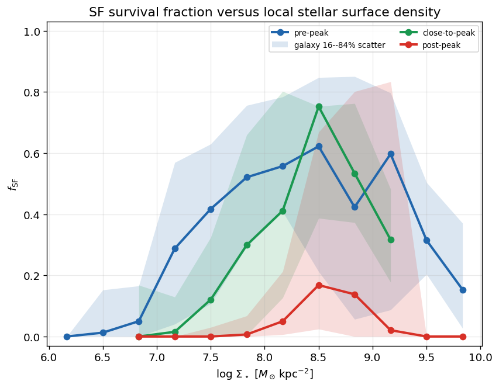
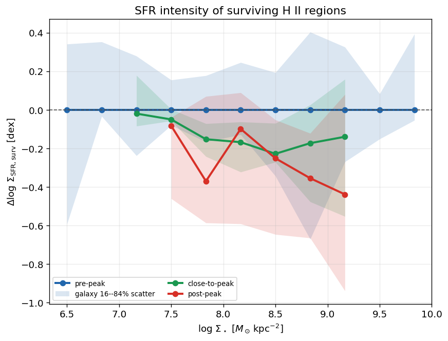
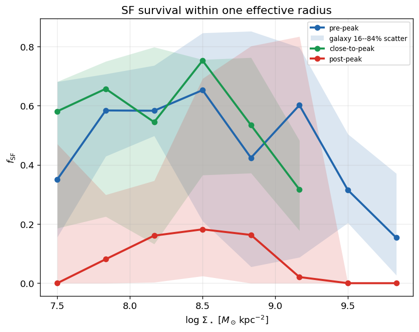
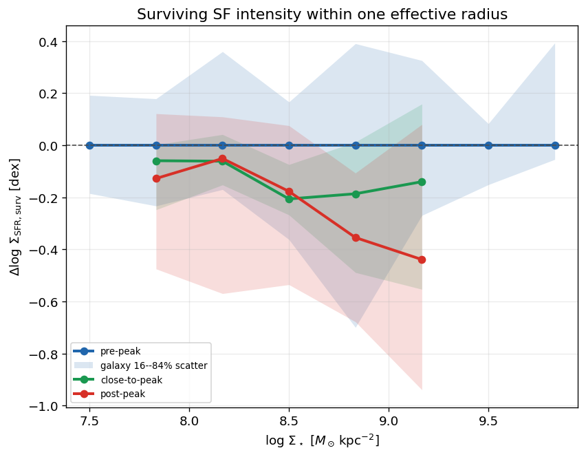
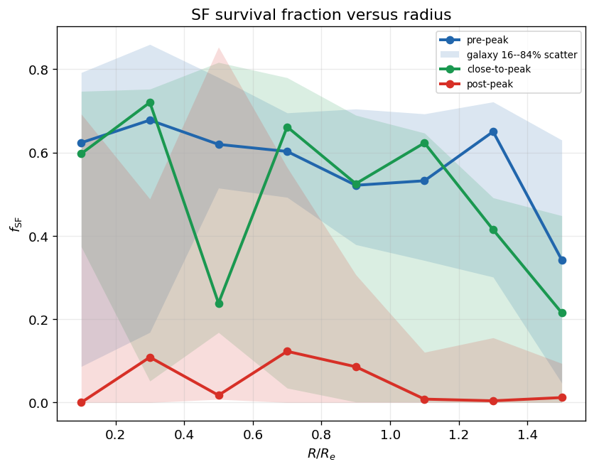
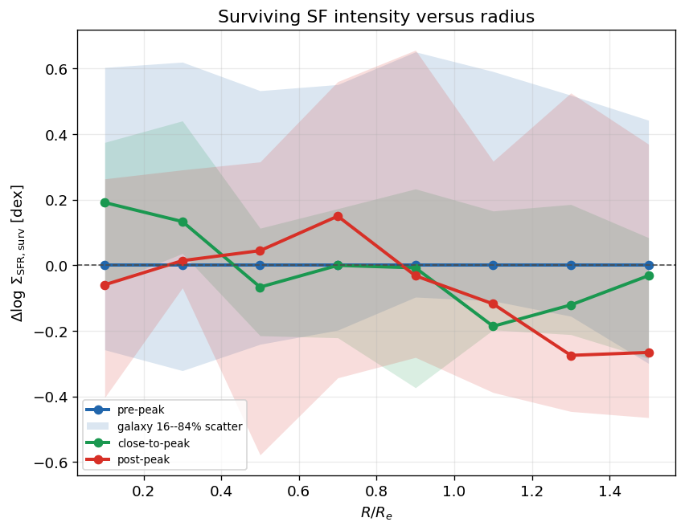
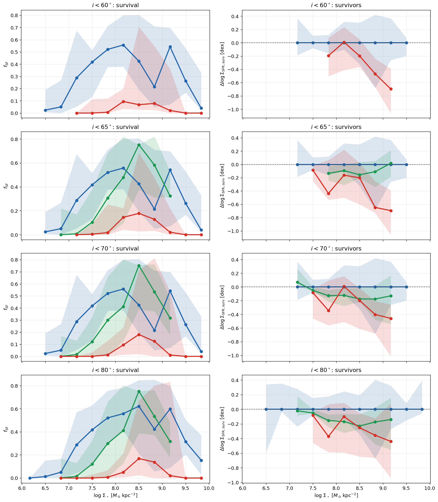
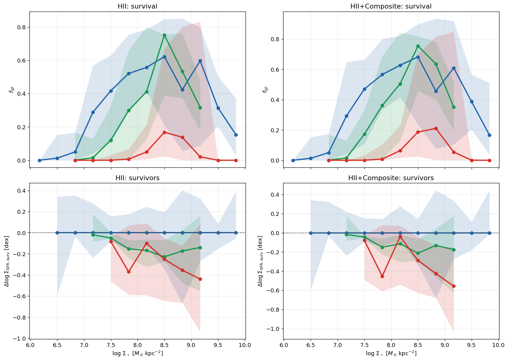
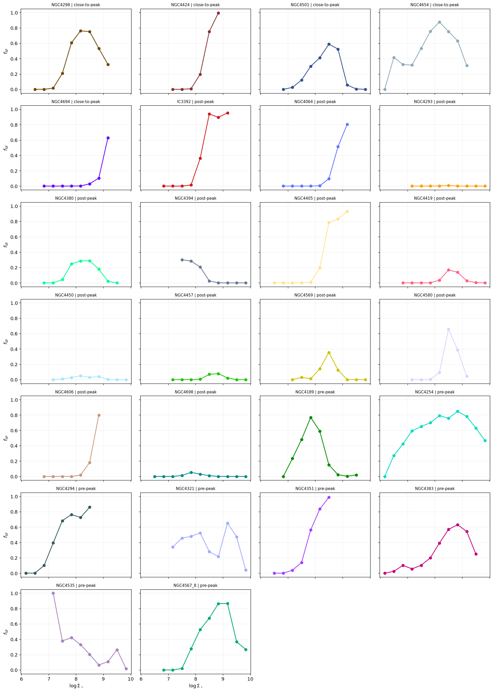

# 20260827 Resolved Star Formation Population through RPS

Here we define a parameter call star forming ("survival") fraction ($f_\mathrm{SF}$), which represents the fraction of star forming spaxel per $\Sigma_*$ or $R_e$ bin. 

As usual, we define the star forming spaxels by HII BPT classification, EW(H$\alpha$)$>6\, \AA$, and intrinsic $\sigma$(H$\alpha$)$<45\ {\rm km\ s^{-1}}$. 

Also, we only select the galaxies that inclination less than $80^\circ$, so now we have 26: {'pre-peak': 8, 'close-to-peak': 5, 'post-peak': 13}

In general, the most promising change after peak ram pressure is a reduction in the fraction of usable regions that remain star forming, also the surviving star forming regions tend to be less star forming. 

## 1. $f_\mathrm{SF}$ - $\Sigma_*$ trend

First we look at SF survival fraction versus local stellar surface density. The pre-peak and close-to-peak medians increase toward intermediate-to-high $\Sigma_\star$, while the post-peak median remains much lower across in all supported bins, though there are large scatters due to galaxy-to-galaxy diversity.

Then we plot the change of SFR on surviving H II regions, taking the median trend of SFR in pre-peak sample as the reference. Close-to-peak and post-peak medians are generally below the pre-peak reference at intermediate and high $\Sigma_\star$.

## 2. $f_\mathrm{SF}$ - $\Sigma_*$ trend within $R_e$

Restricting to SF spaxels within $R_e$ shows similar results.

## 3. $f_\mathrm{SF}$ - $R_e$ trend

Now we look at SF survival fraction versus radius. Again, post-peak galaxies have very low median $f_{\rm SF}$ at all available radius, including inside $R_e$.

And in surviving SF intensity versus radius, median offsets fluctuate in all 3 stages around zero within $R_e$, and it is hard to tell if surviving SF regions in post-peak truely become less SF outside $R_e$.

## 4. Robustness test

Here I also show the $f_\mathrm{SF}$ - $\Sigma_*$ trend under different inclination selections and star forming selections. 

## 5. Individual galaxy $f_\mathrm{SF}$ - $\Sigma_*$ trend

Finally, I show the $f_\mathrm{SF}$ - $\Sigma_*$ trend for each galaxy. 

