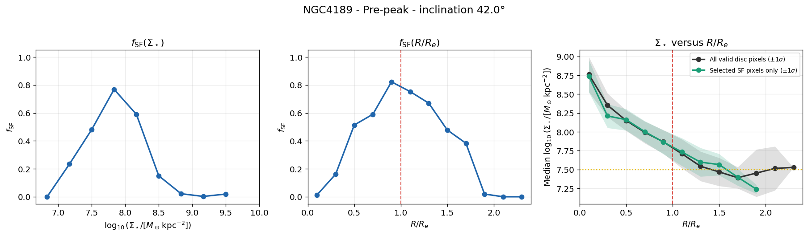
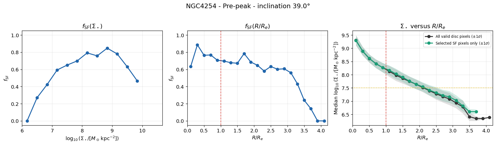
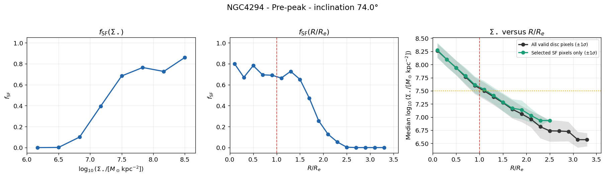
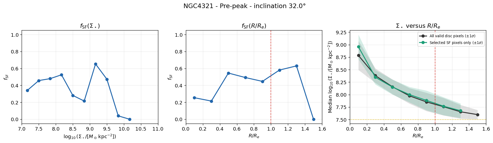
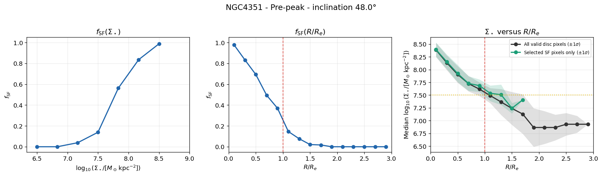
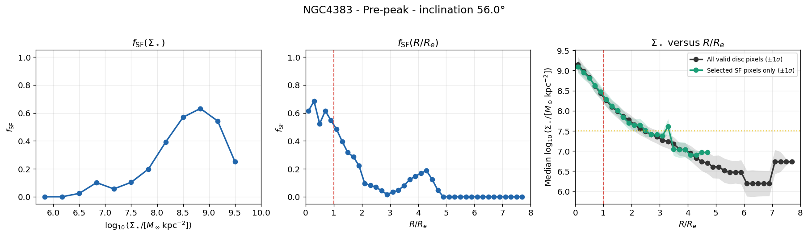
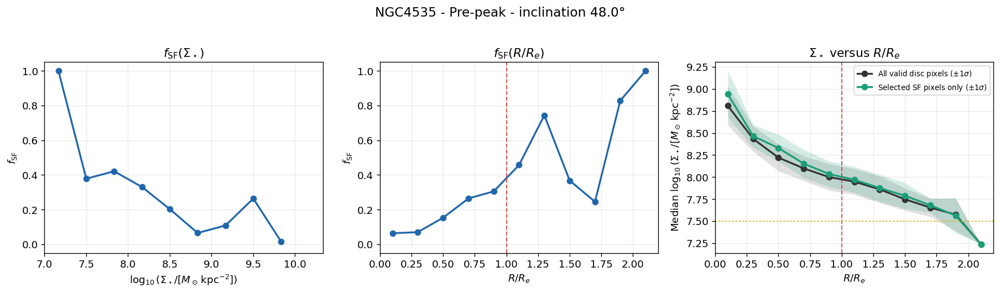
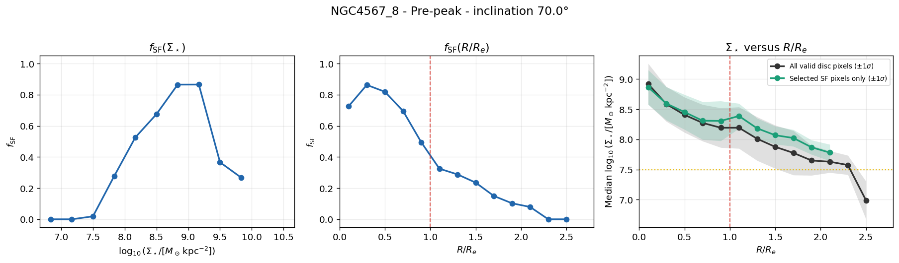
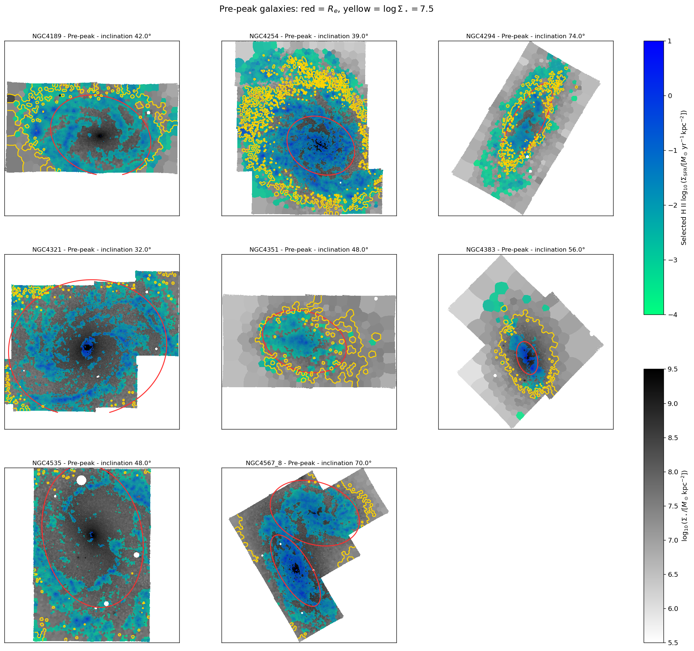

# 20260828 SF fraction in Pre-peak

First, the SF spaxel's and all smaple's radial profile actually allign very well. But the $f_\mathrm{SF}$ varies differently along $\Sigma_*$ and $R/R_e$. 

For NGC4189, due to no selected SF spaxel in the center, the $f_\mathrm{SF}$ is low in high-mass and inner regions. And it drops very quickly in low mass ($\log(\Sigma_*)<7.5$) but still maintaince $f_\mathrm{SF}$ at least 40% outside $R_e$. 

For NGC4254 and NGC4294, both show similar features: $f_\mathrm{SF}$ still $0.6\sim0.8$ across all the radius, but still quickly decreases at $\log(\Sigma_*)<7.5$. 

For NGC4321, both $\Sigma_*$ and $R/R_e$ trends show fluctuations. 

For NGC4351, it even shows quicly descend at $\log(\Sigma_*)<8.5$, but linearly descend   along radius. 

For NGC4535, it shows the opposite trend: increasing $f_\mathrm{SF}$ to high-mass and outer regions. 

For NGC4383 and NGC4567_8, though kind of similar trends as NGC4351, they are not discussed due to inclined starburst and double systems. 

Finally, i show the spatial information.

