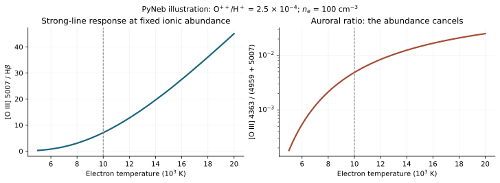

# Executive answer

An emission-line spectrum does not measure metallicity by counting metal-line photons alone. It measures the rate at which particular ions, in particular physical conditions, emit photons. To infer an abundance, one must separate **how many ions exist** from **how efficiently each ion radiates**, account for unseen ionization stages, and normalize to hydrogen. The central relation is

$$
\frac{I_{ul}}{I_{\mathrm H\beta}}
\simeq
\frac{X^i}{\mathrm H^+}
\frac{\epsilon_{ul}(T_e,n_e)}{\epsilon_{\mathrm H\beta}(T_e,n_e)}.
$$

Here $X^i/\mathrm H^+$ is an ionic number abundance and $\epsilon$ is an emissivity coefficient. The approximation requires a defensible treatment of the emitting volume and its temperature structure. A collisionally excited optical metal line has a strong, approximately exponential temperature dependence. A hydrogen recombination line has a much weaker, approximately power-law dependence. A temperature-sensitive ratio of two lines of the **same ion** can remove the abundance factor, providing the thermometer needed to invert the first ratio.

Strong-line calibrations work when that thermometer is unavailable. They use the fact that abundances affect cooling, temperatures, ionic fractions, and usually the ionizing stars and abundance pattern. A calibration compresses this multidimensional physics into an empirical or model-dependent mapping. It is therefore not a universal law of the form "this ratio uniquely equals this O/H."

For the specific questions in this report:

1. **The physical chain is abundance and ionizing spectrum -> ionization and thermal equilibrium -> atomic level populations -> emissivities -> integrated, extinguished, instrumentally measured fluxes.** The inverse problem is only unique when enough of the other variables are measured or constrained.
2. **Direct, semi-direct, empirical strong-line, and model-grid methods are useful categories, but they overlap.** D16, for example, is both a strong-line calibration and a photoionization-model calibration. A Bayesian grid-fitting package is an inference engine, not an abundance scale by itself.
3. **[N II]/[S II] is a mixed diagnostic.** It responds to N/S, ionization structure, spectral hardness, density, and contamination by diffuse or shock-excited gas. It becomes an O/H indicator only after additional abundance-pattern and nebular assumptions. Ionization parameter and spectral hardness are different physical quantities.
4. **No optical strong-line calibration is universally ionization-independent.** For nearby MUSE H II-region work, D16 and the Pilyugin-Grebel S calibration are useful relatively excitation-resistant comparisons; neither is immune to N/O, S/O, density, or population shifts. N2O2 has relatively weak ionization sensitivity in its intended metal-rich regime, but its [O II]3727 denominator is outside the adopted nearby-MUSE bandpass.
5. **The distinction between fitting to 7000, 8900, and 9300 Angstrom is material.** All three retain the standard red strong-line set. The 8900-A limit adds red [O II]7320,7330 and [Ar III]7136. Only the full 9300-A range adds [S III]9069, which greatly improves red-line temperature and ionization constraints. None includes [O III]4363 or [O II]3726,3729 at approximately zero redshift.

The theoretical basis is implemented in [PyNeb: Luridiana, Morisset & Shaw (2015)](https://doi.org/10.1051/0004-6361/201323152). The MUSE-specific comparison is informed by [Easeman et al. (2024)](https://doi.org/10.1093/mnras/stad3464) and [Brazzini et al. (2024)](https://doi.org/10.1051/0004-6361/202451007); the qualifications behind those comparisons are developed below.

## Scope and how to read this report

The default target is **gas-phase oxygen abundance in predominantly stellar-photoionized H II regions**, measured from rest-frame optical nebular emission. Unless stated otherwise, "metallicity" means

$$A_{\mathrm{O}}\equiv12+\log_{10}\!\left[\frac{n({\mathrm{O}})}{n({\mathrm{H}})}\right]_{\mathrm{gas}}.$$

The intended reader is a researcher who wants both a derivation and an operational guide, rather than a list of recipes. Sections 1-5 build the physics; Section 6 explains density and temperature diagnostics; Sections 7-12 compare abundance methods, ionization sensitivity, and accuracy; Sections 13-14 translate them into MUSE decisions; Sections 15-16 separately cover non-oxygen and non-optical measurements. The appendices contain definitions, implementation warnings, evidence limits, and a reading bibliography.

The wavelength baseline is the user's specified **4800-9300 A**, with separate **4800-7000 A** and **4800-8900 A** fitting windows. Wavelength labels are conventional rounded rest wavelengths; 6716/6717, 5755/5756, 9069/9070, and 9531/9532 can reflect rounding or air/vacuum conventions. Actual line fitting must use one consistent wavelength convention. Coverage tables assume $z\simeq0$ and describe wavelength availability, not a confirmed detection or an audit of any MAUVE FITS product.

This is a source-verified, systematic-style scoping review through **2026-08-30**, not a claim to have enumerated every polynomial published in the literature. It covers the major physical families, historically important calibrations, MUSE-relevant prescriptions, and selected recent developments. Explicit coefficients are supplied for commonly adopted recipes; for large or versioned calibration suites, the relevant tables, variables, branches, and implementation procedure are identified. Preprints and conditional validation claims are labeled.

# 1. What abundance are we trying to measure?

## 1.1 O/H is not the total metal mass fraction

Spectroscopy naturally yields **number ratios**. The total metal mass fraction is

$$Z=\frac{\sum_{X>{\mathrm{He}}}m_Xn_X}{\sum_Xm_Xn_X},$$

whereas O/H counts oxygen nuclei relative to hydrogen nuclei. A conversion such as

$$\frac{Z}{Z_\odot}\approx10^{A_{\mathrm{O}}-A_{{\mathrm{O}},\odot}}$$

assumes that the relevant abundance pattern scales with oxygen. It is not an identity. Changes in C/O, N/O, Fe/O, dust depletion, or helium fraction can break it. Oxygen is a practical default because it is abundant, has strong lines from its principal ionization stages in ionized gas, and is important to nebular cooling. A sulfur- or nitrogen-line calibration can still be an **oxygen-abundance** calibration if its output is $A_{\mathrm{O}}$; that does not mean it directly measured O atoms.

Gas and stellar metallicities need not trace the same element mixture. Stellar EUV opacity and evolution depend strongly on iron and other elements, while a nebular O/H estimate measures oxygen in gas. Setting stellar metallicity equal to gas O/H in a model is a closure assumption, especially for non-solar O/Fe. The sensitivity of inferred abundances to model assumptions is demonstrated by [Ji & Yan (2022)](https://doi.org/10.1051/0004-6361/202142312).

## 1.2 Gas-phase, gas-plus-dust, and ionized-phase abundances differ

An oxygen atom in a grain does not produce an [O III] nebular photon. Thus

$$({\mathrm{O/H}})_{\mathrm{gas}}=(1-f_{{\mathrm{O,dust}}})({\mathrm{O/H}})_{\mathrm{total}}.$$

The correction to a logarithmic abundance is $-\log_{10}(1-f_{{\mathrm{O,dust}}})$. It must not be silently added to a gas-phase measurement. [Peimbert & Peimbert (2010)](https://arxiv.org/abs/1006.0692) estimated oxygen dust corrections of approximately 0.08-0.12 dex across their H II-region abundance range; this is a useful scale, not a universal correction for every environment. Model grids may quote an input total abundance while applying a depletion pattern internally. Check which quantity is returned before comparing with a direct gas-phase result.

Furthermore, H II-region emission is not a mass-weighted census of all interstellar gas. Molecular, neutral, diffuse ionized, and hot gas can have different abundances and weights. The same galaxy can legitimately have different reported metallicities when different phases, apertures, or weightings are being measured.

# 2. The forward problem: from matter and photons to an emitting nebula

## 2.1 The inputs are a vector, not a single metallicity

A useful forward model has parameters

$$\boldsymbol\theta=\{A_{\mathrm{O}},{\mathrm{N/O}},{\mathrm{C/O}},{\mathrm{S/O}},\ldots,
J_\nu,n_{\mathrm{H}}({\mathbf{r}}),\text{geometry},\text{dust},\text{age},\ldots\}.$$

From these it predicts ionic densities, electron temperature, level populations, and line luminosities. In reality the ionizing spectrum and density vary in space, and radiation transfer couples one location to another. The following derivation uses local equations first, then integrates them. Codes such as **Cloudy** solve a much more extensive version of this coupled problem; the [Cloudy C17 description, Ferland et al. (2017)](https://arxiv.org/abs/1705.10877), is a primary implementation reference, not a claim that C17 is the latest release.

The chain can be read as a physical dependency graph:

```text
Element abundances + ionizing spectral shape + gas/dust geometry
                              |
                  Radiation transfer and ionization
                              |
                 Heating = cooling -> temperature
                              |
                Collision/recombination populations
                              |
                    Local line emissivities
                              |
          Volume integration + dust + PSF/LSF + noise
                              |
                    Measured fluxes and ratios
```

Ionization and thermal balance must be solved together, so the middle steps actually form a coupled iteration rather than a one-way numerical sequence.

## 2.2 Ionization: producing O+, O++, N+, and S+

An ion is photoionized when a photon exceeds its threshold energy. The photoionization rate per ion is

$$\gamma_i=\int_{\nu_i}^{\infty}\frac{4\pi J_\nu}{h\nu}\sigma_i(\nu)\,d\nu,$$

where $J_\nu$ is mean intensity, $\sigma_i$ is a cross-section, and $h\nu_i$ is the threshold. In the simplest adjacent-stage equilibrium,

$$n(X^i)\gamma_i=n_en(X^{i+1})\alpha_{i+1}(T_e).$$

Thus $n(X^{i+1})/n(X^i)=\gamma_i/[n_e\alpha_{i+1}]$. A real network adds other ionization stages, radiative and dielectronic recombination, charge exchange, and sometimes collisional ionization. O and H are especially coupled by charge exchange near the hydrogen ionization front. The approximation of time-independent equilibrium also fails if physical conditions change faster than the relevant relaxation time.

The **ionization parameter** is

$$U=\frac{\Phi_{\mathrm{H}}}{n_{\mathrm{H}}c},\qquad
\Phi_{\mathrm{H}}=\int_{\nu_{\mathrm{H}}}^\infty\frac{F_\nu}{h\nu}\,d\nu.$$

For an unobscured point source at a specified radius,

$$U(r)=\frac{Q({\mathrm{H}})}{4\pi r^2n_{\mathrm{H}}c},\qquad q=cU.$$

$U$ is dimensionless; $q$ has velocity units, commonly cm s$^{-1}$. Inner-edge, volume-averaged, and effective model values are not automatically interchangeable. Changing $U$ changes photon density relative to particles. Changing **hardness** changes the distribution of photon energies, for example $Q(>35.1\,\mathrm{eV})/Q(>13.6\,\mathrm{eV})$. Two sources with the same $U$ can have different O++ fractions if their spectra differ above 35 eV.

The relevant thresholds help explain why different ions do not behave identically:

| Ionization step | Approximate threshold | Consequence |
|---|---:|---|
| H0 -> H+ | 13.60 eV | Defines the H-ionizing photon budget |
| S+ -> S++ | 23.34 eV | S+ is removed by relatively modest-energy EUV photons |
| He0 -> He+ | 24.59 eV | He recombination lines constrain part of the EUV shape |
| N+ -> N++ | 29.60 eV | N+ survives farther into some ionized zones than S+ |
| O+ -> O++ | 35.12 eV | [O III] responds to higher-energy photons |
| O++ -> O3+ | 54.94 eV | An important unseen stage in sufficiently hard spectra |

Thresholds and atomic-state information are tabulated by the [NIST Atomic Spectra Database](https://www.nist.gov/pml/atomic-spectra-database). Thresholds alone do not specify an ion fraction: the cross-sections, recombination rates, radiation transfer, and geometry also enter.

## 2.3 Why hydrogen recombination luminosity is a useful normalization

In a dust-free, ionization-bounded, steady H II region, absorbed hydrogen-ionizing photons balance recombinations to excited levels:

$$Q_{\mathrm{abs}}({\mathrm{H}})=\int_V n_en_p\alpha_B(T_e)\,dV.$$

For uniform density and a fully ionized spherical interior, this produces the familiar Stromgren scaling

$$R_S=\left[\frac{3Q_{\mathrm{abs}}}{4\pi n_en_p\alpha_B}\right]^{1/3}.$$

Not every recombination produces Hbeta. The probability of producing that line is encoded in the effective recombination coefficient:

$$L_{\mathrm{H\beta}}=h\nu_{\mathrm{H\beta}}\int_Vn_en_p\alpha^{\mathrm{eff}}_{\mathrm{H\beta}}(T_e,n_e)\,dV.$$

For uniform conditions, $L_{\mathrm{H\beta}}\simeq h\nu_{\mathrm{H\beta}}(\alpha^{\mathrm{eff}}_{\mathrm{H\beta}}/\alpha_B)Q_{\mathrm{abs}}$. This connects a hydrogen line to the ionized-gas emission measure and the absorbed ionizing-photon budget. Leakage and absorption of EUV photons by dust alter the relation to the **emitted** stellar $Q({\mathrm{H}})$.

Case B assumes that Lyman-series photons and recombinations directly to the ground state are locally reprocessed, while the relevant Balmer lines escape. Case A and radiative-transfer cases differ. The hydrogen emissivities used in this report's calculation come from the [Storey & Hummer (1995) recombination calculations](https://doi.org/10.1093/mnras/272.1.41). For ordinary low-density gas near 10,000 K, intrinsic Halpha/Hbeta is approximately 2.86, but it varies with physical conditions and is not a universal observed ratio.

## 2.4 Heating: photon energy above the threshold becomes electron energy

A hydrogen photoelectron initially carries approximately $h\nu-13.6$ eV. The hydrogen photoionization heating rate per volume is

$$\Gamma_{\mathrm{H}}=n({\mathrm{H^0}})\int_{\nu_{\mathrm{H}}}^\infty
\frac{4\pi J_\nu}{h\nu}\sigma_{\mathrm{H}}(\nu)(h\nu-h\nu_{\mathrm{H}})\,d\nu.$$

Helium photoionization, dust photoelectric heating, and other processes add terms. Under photoionization equilibrium, the neutral fraction adjusts: simply doubling photon intensity does not necessarily double heating per particle in an already fully ionized zone. The mean excess energy per ionization, and therefore spectral shape, matters substantially.

Electrons exchange energy through Coulomb collisions. A Maxwell-Boltzmann distribution is usually a good local approximation in classical H II regions; **local** does not mean that all locations have the same temperature. The nonthermal kappa hypothesis of [Nicholls, Dopita & Sutherland (2012)](https://arxiv.org/abs/1204.3880) motivated useful work, but kinetic calculations by [Ferland et al. (2016)](https://uknowledge.uky.edu/physastron_facpub/475/) and [Draine & Kreisch (2018)](https://arxiv.org/abs/1803.10003) support rapid relaxation and nearly Maxwellian electrons at energies relevant to these lines. A kappa correction should not be a default explanation for every abundance discrepancy.

## 2.5 Cooling: metals change the thermostat

An electron can collisionally excite an ion, losing kinetic energy $\Delta E$. If a photon subsequently escapes, that energy leaves the gas. At low density, a schematic collisionally excited cooling rate is

$$\Lambda_{\mathrm{CEL}}=\sum_{X,i,u,l}n_en(X^i_l)q_{lu}(T_e)\Delta E_{lu}.$$

One must include radiative branching, cascades, collisional de-excitation, and optical depth where relevant. Recombination, free-free emission, and other processes provide additional cooling. The thermal solution satisfies

$$\Gamma_{\mathrm{photo}}+\Gamma_{\mathrm{dust}}+\cdots
=\Lambda_{\mathrm{CEL}}+\Lambda_{\mathrm{rec}}+\Lambda_{\mathrm{ff}}+\cdots.$$

At fixed density and illuminating spectrum, increasing metal abundance usually increases cooling capacity and lowers equilibrium $T_e$. This is the **indirect** abundance dependence that makes strong-line calibrations possible. At high abundance, low-excitation infrared fine-structure transitions can carry much of the cooling; optical lines then weaken because the electrons rarely have enough energy to excite their upper states.

This is a tendency of the coupled thermal solution, not the assertion that every temperature diagnostic decreases monotonically with every definition of metallicity. Different ions sample different zones. Changing the stellar spectrum, density, dust, or temperature distribution changes the result. [Stasinska (2005)](https://arxiv.org/abs/astro-ph/0501574) explicitly demonstrated strong abundance-recovery biases in metal-rich model nebulae with thermal structure. A recent [Peng et al. (2026) preprint](https://arxiv.org/abs/2603.05434) reports an unexpected reversal in an O+ temperature diagnostic at high abundance, without a corresponding N+ or S+ reversal. That is an unresolved observational warning, not a license to discard the energy-balance equations.

# 3. Atomic and quantum physics: why these particular lines exist

## 3.1 From the Hamiltonian to wavelengths and transition probabilities

For an ion with nuclear charge $Z_{\mathrm{nuc}}$ and several electrons, a schematic nonrelativistic Hamiltonian is

$$\hat H=\sum_a\left[-\frac{\hbar^2}{2m_e}\nabla_a^2
-\frac{Z_{\mathrm{nuc}}e^2}{4\pi\epsilon_0r_a}\right]
+\sum_{a<b}\frac{e^2}{4\pi\epsilon_0r_{ab}}+\hat H_{\mathrm{rel}}.$$

The electron-electron term means that hydrogen-like energy formulas are insufficient for O+, O++, N+, or S+. Relativistic corrections, spin-orbit coupling, configuration mixing, and electron correlation matter for accurate energies and rates. Solving the atomic problem gives states $|u\rangle$, $|l\rangle$, energy separations, and transition matrix elements:

$$h\nu_{ul}=E_u-E_l,\qquad\lambda_{ul}=\frac{hc}{E_u-E_l}.$$

For an electric-dipole transition, the spontaneous rate scales as

$$A_{ul}\propto\omega_{ul}^3|\langle l|\boldsymbol d|u\rangle|^2,$$

with angular-momentum averaging and constants specified by the adopted convention. This is the radiative version of transition-rate physics: the probability depends on a matrix element and the available photon states. Angular-momentum and parity selection rules can make the electric-dipole matrix element vanish or become very small. Other multipoles and state mixing can still permit a much slower transition.

In the electric-dipole approximation the atomic parity must change and $\Delta J=0,\pm1$, excluding $J=0\rightarrow0$. In pure LS coupling, $\Delta S=0$ is an additional rule. Spin-orbit/configuration mixing can relax the pure-coupling rules; magnetic-dipole and electric-quadrupole radiation have different selection rules. The statistical weight of an isolated fine-structure level is $g=2J+1$. Thus the term labels, degeneracies, radiative lifetimes, and electron-impact excitation probabilities are connected pieces of the same atomic calculation.

The terminology and selection rules are summarized in the [NIST atomic spectroscopy compendium](https://www.nist.gov/pml/atomic-spectroscopy-compendium-basic-ideas-notation-data-and-formulas/atomic-spectroscopy). Accurate nebular modeling takes tabulated or calculated atomic rates; it does not refit a quantum Hamiltonian separately for each observed galaxy.

## 3.2 Why "forbidden" lines are bright in space

Square brackets, as in [O III], identify transitions forbidden in the leading electric-dipole approximation. They are not impossible. A low spontaneous rate means a long-lived metastable upper state. In a dense laboratory gas it is often collisionally de-excited before emitting. In a dilute nebula the next collision can occur sufficiently late for the weak radiative transition to occur. A large population of ions then produces a bright integrated line.

For O++, the low-lying $2p^2$ configuration contains a ground $^3P_J$ term, the $^1D_2$ term, and the higher $^1S_0$ term. The important optical transitions are approximately

$$^1D_2\rightarrow{}^3P_2:\ 5007\ {\mathrm{A}},\qquad
^1D_2\rightarrow{}^3P_1:\ 4959\ {\mathrm{A}},$$

$$^1S_0\rightarrow{}^1D_2:\ 4363\ {\mathrm{A}}.$$

The auroral 4363 upper state requires more excitation energy than the upper state of 5007 and 4959. That difference, rather than the word "auroral" itself, makes the ratio a thermometer. The two strong lines share one upper level; their ratio is instead primarily a branching ratio. A measured 5007/4959 ratio near three is therefore a useful flux-fitting check but not an O/H measurement.

The same distinction applies to [N II]5755 versus 6548,6584 and [S III]6312 versus 9069,9531. Not every pair of lines of one ion measures temperature: [S II]6717/6731 uses different metastable states with similar excitation energies but different critical densities and is principally a density diagnostic.

## 3.3 Electron impact: the origin of the exponential temperature dependence

Let $q_{lu}$ be the rate coefficient for collisional excitation from $l$ to $u$. For an electron energy distribution $f_E$,

$$q_{lu}=\int_{\Delta E}^{\infty}\sigma_{lu}(E)v(E)f_E(E;T_e)\,dE.$$

For Maxwellian electrons, the distribution contains $\exp(-E/kT_e)$. Integrating the quantum-scattering cross-section leads to the standard effective-collision-strength representation:

$$q_{lu}=\frac{8.629\times10^{-6}\,\Upsilon_{lu}(T_e)}{g_lT_e^{1/2}}
\exp\!\left(-\frac{\Delta E}{kT_e}\right)
\quad{\mathrm{cm^3\,s^{-1}}},$$

$$q_{ul}=\frac{8.629\times10^{-6}\,\Upsilon_{lu}(T_e)}{g_uT_e^{1/2}}
\quad{\mathrm{cm^3\,s^{-1}}}.$$

Temperatures here are in kelvin, $g$ is the state statistical weight, and $\Upsilon$ is the thermally averaged collision strength. The latter is not usually constant: near-threshold resonances and coupled channels require detailed atomic-scattering calculations. The [Storey, Sochi & Badnell (2014) O III calculation](https://strathprints.strath.ac.uk/51191/) is one such primary source, and supplies the O III collision data used in the illustrative calculation below.

Detailed balance gives

$$\frac{q_{lu}}{q_{ul}}=\frac{g_u}{g_l}e^{-\Delta E/kT_e}.$$

This is the central physical reason optical CELs care so strongly about temperature: the upper state is excited by electrons in an exponentially shrinking energetic tail when the gas cools. The cross-section and level populations refine this picture, but do not remove the threshold physics.

## 3.4 Statistical equilibrium and critical density

For each state $u$, steady statistical equilibrium requires total population inflow to equal outflow. Ignoring pumping for compactness,

$$\sum_{j\ne u}n_j(n_eq_{ju}+A_{ju})
=n_u\sum_{j\ne u}(n_eq_{uj}+A_{uj}),$$

where spontaneous upward $A$ values are zero, and all levels obey $\sum_jn_j=n(X^i)$. A two-level reduction gives

$$\frac{n_u}{n_l}=\frac{n_eq_{lu}}{A_{ul}+n_eq_{ul}}.$$

The total, all-direction emitted power per unit volume is

$$j_{ul}=n_uA_{ul}h\nu_{ul}.$$

Some authors define $j$ per steradian, introducing $1/(4\pi)$; this report does not. In the low-density limit,

$$j_{ul}\simeq n_en(X^i)q_{lu}h\nu_{ul}b_{ul},$$

where $b_{ul}$ is an appropriate radiative branching fraction. In a multi-level ion, cascades and the fractional ground-level populations must also be included. The approximate critical density of a level is

$$n_{{\mathrm{crit}},u}=\frac{\sum_{l<u}A_{ul}}{\sum_{j\ne u}q_{uj}}.$$

Above this scale, collisions increasingly compete with radiative decay. A simple quenching factor is $(1+n_e/n_{\mathrm{crit}})^{-1}$; the exact multi-level solution is preferable. Metal/H recombination ratios can fall with density even at unchanged abundance. Moreover, an unresolved high-density component can affect an auroral line without being well represented by a low-density [S II] diagnostic.

Illustrative values calculated with the documented PyNeb data set at $10^4$ K are:

| Line | Upper-level critical density, cm$^{-3}$ | Practical implication |
|---|---:|---|
| [S II]6717 | $1.62\times10^3$ | Density/quenching matters relatively early |
| [S II]6731 | $4.21\times10^3$ | Different value enables the density ratio |
| [N II]6584 | $8.86\times10^4$ | Usually low-density in ordinary disc H II regions |
| [O III]5007 | $6.91\times10^5$ | Less easily quenched than [S II] |
| [N II]5755 | $1.64\times10^7$ | Dense components can elevate auroral/nebular ratios |
| [O III]4363 | $2.42\times10^7$ | Same warning for an apparent high temperature |

These are atomic-data-dependent level estimates, not hard density cuts or universal constants. The exact input files are preserved in the calculation assets.

## 3.5 Recombination lines are physically different

After a free electron recombines with an ion, it can cascade through bound states. For a hydrogen recombination line,

$$j_{\mathrm{H\beta}}=n_en_p\alpha^{\mathrm{eff}}_{\mathrm{H\beta}}(T_e,n_e)h\nu_{\mathrm{H\beta}}.$$

For a heavy-element recombination line emitted by $X^i$ after capture onto $X^{i+1}$,

$$j_{\mathrm{RL}}=n_en(X^{i+1})\alpha^{\mathrm{eff}}_{\mathrm{RL}}(T_e,n_e)h\nu_{\mathrm{RL}}.$$

An O II recombination line can therefore measure **O++**, whereas a forbidden [O II] line measures collisionally excited **O+**. Confusing the emitted spectrum's Roman numeral with the recombining parent ion is an important avoidable mistake. Effective recombination coefficients include capture and cascade probabilities; [Storey, Sochi & Bastin (2017)](https://arxiv.org/abs/1703.09982) provide modern O II coefficients.

Recombination coefficients generally vary as powers of temperature over nebular ranges, not through the large optical excitation threshold exponential. Heavy-element RL/H ratios consequently have weaker temperature sensitivity. Their problem is faintness and the physical interpretation of the gas they preferentially sample, not an absence of atomic physics.

# 4. From local emissivity to measured line ratios

## 4.1 Integrating an unresolved or partially resolved nebula

For an optically thin emission line with internal dust attenuation,

$$F_{ul}=\frac{1}{4\pi D_L^2}\int_Vj_{ul}({\mathbf{r}})
e^{-\tau_{ul}({\mathbf{r}})}\,dV.$$

This uses integrated line flux and luminosity distance; no extra $(1+z)$ factor should be added to this luminosity-distance relation. Surface brightness and flux density per wavelength have additional cosmological transformations if those are the measured quantities.

The observed image/spectrum is subsequently convolved with the point-spread and line-spread functions and sampled with noise. A normalized LSF conserves an isolated integrated line's flux, but blending, an inappropriate continuum model, finite integration windows, and wavelength-dependent PSF can bias its measurement. Spatial convolution mixes line ratios because it mixes fluxes before division.

For components $k$,

$$\frac{F_a}{F_b}=\frac{\sum_kF_{a,k}}{\sum_kF_{b,k}}
\ne\frac{1}{N}\sum_k\frac{F_{a,k}}{F_{b,k}}.$$

Nor is a calibration applied to a summed spectrum equal to the average of calibrated spaxels. [Sanders et al. (2017)](https://arxiv.org/abs/1708.04625) explicitly modeled flux weighting and diffuse-ionized-gas mixing and found substantial abundance biases in some cases. This is not a technical footnote for IFU studies: it defines what the inferred abundance represents.

## 4.2 Reddening correction is part of the inverse problem

For a screen model,

$$F_\lambda=I_\lambda10^{-0.4E(B-V)k(\lambda)},$$

and the Balmer decrement gives

$$E(B-V)=\frac{2.5}{k({\mathrm{H\beta}})-k({\mathrm{H\alpha}})}
\log_{10}\left[\frac{F_{{\mathrm{H\alpha}}}/F_{{\mathrm{H\beta}}}}
{(I_{{\mathrm{H\alpha}}}/I_{{\mathrm{H\beta}}})_{\mathrm{intrinsic}}}\right].$$

One must state the extinction/attenuation law, intrinsic decrement, foreground treatment, and treatment of negative fitted reddening. Stellar Balmer absorption must be fitted, especially at Hbeta. An attenuation law for a spatially mixed star-gas-dust system and a line-of-sight extinction law are not automatically interchangeable.

N2 and the component pairs of O3N2 are close in wavelength, so their direct reddening sensitivity is small. [N II]6584/[O II]3727 and [S III]9069/[O III]5007 require considerably more care. The long baseline of a temperature diagnostic also makes reddening and relative spectrophotometry consequential. The report does not prescribe changing the existing MAUVE pipeline's adopted law.

## 4.3 The local metal/H ratio: the useful simplification

Define $\epsilon_{ul}=j_{ul}/[n_en(X^i)]$ and $\epsilon_{\mathrm{H\beta}}=j_{\mathrm{H\beta}}/(n_en_p)$. For a homogeneous zone,

$$\frac{I_{ul}}{I_{\mathrm{H\beta}}}=
\frac{X^i}{\mathrm H^+}\frac{\epsilon_{ul}}{\epsilon_{\mathrm{H\beta}}}.$$

Since $X^i/\mathrm H^+=(X/H)f_i/f_{\mathrm{H^+}}$, the measured ratio constrains **abundance times ionic fraction times emissivity**, not abundance alone. In a rough low-density approximation with $\alpha^{\mathrm{eff}}_{\mathrm{H\beta}}\propto T^{-\beta}$,

$$\frac{I_{ul}}{I_{\mathrm{H\beta}}}\propto
\frac{X}{H}\frac{f_i}{f_{\mathrm{H^+}}}
\Upsilon(T)T^{\beta-1/2}e^{-\Delta E/kT},$$

with $\beta$ roughly 0.8-1 over a restricted nebular temperature range. The exponent is not a precision replacement for tabulated emissivities. The ratio cancels distance and, under the homogeneous assumptions, the emission measure. That is why line **ratios** are much more useful than an isolated absolute metal-line flux.

## 4.4 Two metal lines do not necessarily count two elemental abundances

For two CELs,

$$\frac{I_X}{I_Y}\simeq\frac{X}{Y}\frac{f_{X^i}}{f_{Y^j}}
\frac{\epsilon_X(T_X,n_X)}{\epsilon_Y(T_Y,n_Y)}.$$

At similar excitation energy, temperature dependence may partially cancel. Similar ionization zones can reduce ionization sensitivity. Neither cancellation is guaranteed. If X and Y scale together and the physical effects also cancel, the ratio can become almost **insensitive to O/H**, not a particularly good metallicity indicator. An abundance indicator needs sensitivity to the desired quantity as well as low sensitivity to nuisance quantities.

# 5. A numerical bridge from atomic physics to abundance recovery

## 5.1 A fixed-state calculation, not a self-consistent galaxy sequence

For this report, PyNeb 1.1.30 was run at $n_e=100$ cm$^{-3}$ and a fixed ${\mathrm{O^{++}/H^+}}=2.5\times10^{-4}$. The O III radiative data are `o_iii_atom_FFT04-SZ00.dat`, collision data `o_iii_coll_SSB14.dat`, and hydrogen recombination data `h_i_rec_SH95.hdf5`.

| $T_e$, K | [O III]5007/Hbeta | [O III]4363/(4959+5007) |
|---:|---:|---:|
| 6000 | 0.793 | 0.000542 |
| 8000 | 3.045 | 0.002141 |
| 10,000 | 7.079 | 0.004881 |
| 12,000 | 12.730 | 0.008447 |
| 15,000 | 23.455 | 0.014600 |

All abundances are identical in this table. The strong ratio changes by a factor of about four between 8000 and 12,000 K. The high ratios at high temperature are fixed-state illustrations; no claim is made that every row is an attainable thermal-equilibrium H II region at that ionic abundance.



At 10,000 K, the calculated coefficients are $\epsilon_{5007}=3.4971\times10^{-21}$ and $\epsilon_{\mathrm{H\beta}}=1.2350\times10^{-25}$ erg cm$^3$ s$^{-1}$. Hence

$$\frac{I_{5007}}{I_{\mathrm{H\beta}}}
=(2.5\times10^{-4})\frac{3.4971\times10^{-21}}{1.2350\times10^{-25}}
=7.079.$$

Now invert the synthetic spectrum. The auroral ratio 0.004881 gives $T_e\simeq9997$ K using the same atomic data. Substitution into the emissivity ratio recovers ${\mathrm{O^{++}/H^+}}=2.5023\times10^{-4}$, within 0.1% of the input. This demonstrates the forward/inverse logic; it is not an independent validation of the atomic data or of the homogeneous-zone assumption.

## 5.2 Why auroral/nebular ratios measure temperature

Suppose two upper levels of one ion require energies $E_a>E_n$ above the ground. At low density,

$$\frac{I_{\mathrm{aur}}}{I_{\mathrm{neb}}}
\approx C(T_e,n_e)\exp\!\left[-\frac{E_a-E_n}{kT_e}\right].$$

The ion abundance cancels. For the O III optical system, the difference between the upper levels corresponds to approximately $hc/4363\,\mathrm A\simeq2.84$ eV, or $\Delta E/k\simeq3.30\times10^4$ K. Ignoring the slowly varying prefactor,

$$\frac{d\ln(I_{\mathrm{aur}}/I_{\mathrm{neb}})}{d\ln T_e}
\approx\frac{\Delta E}{kT_e}\simeq3.3\quad(T_e=10^4\,\mathrm K).$$

Thus a 10% ratio change corresponds locally to roughly a 3% temperature change under these assumptions. In practice the auroral flux may be very uncertain, density and atomic rates matter, and the inferred temperature is emission weighted. One should solve the multi-level atom rather than use this derivative as a production thermometer.

## 5.3 A two-temperature counterexample to "direct means exact"

Consider two unresolved components with equal hydrogen emission measure, the same density, and the same true O++/H+, but temperatures 8000 and 12,000 K. The emission-measure mean is 10,000 K. Summing the emissivities before taking ratios gives a single-temperature inference of about **11,149 K** and O++/H+ of **$1.7345\times10^{-4}$**, a **-0.159 dex** bias.

This is an original two-component calculation with the stated atomic data, not a fitted empirical correction. The hotter gas disproportionately supplies the auroral photons. The observer then assigns too high an emissivity per O++ ion and therefore infers too few ions. The same mechanism explains why unresolved temperature structure can matter even when every measured flux is exact.

## 5.4 How a metallicity sequence can turn over

At fixed temperature and ion fractions, doubling O/H doubles an oxygen/H line ratio. In thermal equilibrium, however, increasing O/H can lower the temperature and alter the ionic fractions. Differentiating the approximate relation yields

$$\frac{d\ln R}{d\ln({\mathrm{O/H}})}=1+
\frac{d\ln f_i}{d\ln({\mathrm{O/H}})}
+\left[\beta-\frac12+\frac{\Delta E}{kT}
+\frac{d\ln\Upsilon}{d\ln T}\right]
\frac{d\ln T}{d\ln({\mathrm{O/H}})}.$$

The direct abundance term is positive. The thermal term can be negative and large. This allows a turnover such as that of $R_{23}$: at low abundance adding oxygen strengthens the lines; at higher abundance efficient cooling suppresses optical excitation. An observed intermediate $R_{23}$ can therefore correspond to a low- or high-abundance solution. The existence and location of the turnover are properties of the full nebular/calibration sequence, not a universal number derived from oxygen abundance alone.

# 6. Density-sensitive versus temperature-sensitive ratios

## 6.1 What "sensitive" actually means

A ratio $R$ is useful as a density diagnostic when $|\partial\ln R/\partial\ln n_e|$ is appreciable in the density range of interest and temperature, abundance, and ionization effects are comparatively weak or controllable. A temperature diagnostic instead has a substantial $|\partial\ln R/\partial\ln T_e|$. These are statements about the derivatives of a physical model, not absolute categories attached forever to a pair of wavelengths.

The ideal pair uses the **same ion** so its abundance and ionic fraction cancel, reducing the number of unknowns. What distinguishes the two kinds of diagnostic is the atomic-level structure:

| Diagnostic type | Desired atomic configuration | Main reason for sensitivity |
|---|---|---|
| Density | Upper states at similar excitation energies but with different radiative/collisional rates | One state is collisionally quenched before the other |
| Temperature | Upper states with substantially different excitation energies | The Maxwellian tail populates the higher state much more strongly as temperature rises |
| Branching-ratio check | Same upper state, different radiative decays | Upper population cancels; primarily probes atomic branching and measurement quality |
| Abundance-sensitive ratio | Metal line compared with hydrogen, or different elements | Abundance does not cancel, but physical-state dependencies remain |

The first two are physical-condition diagnostics that help **remove nuisance variables** from the abundance problem. They are not generally standalone metallicity calibrations.

## 6.2 Why [S II]6717/6731 measures density

The [S II] doublet arises from two distinct metastable upper levels with similar excitation energies. In a simplified two-upper-level treatment,

$$R_{\mathrm{SII}}=\frac{I_{6717}}{I_{6731}}
\approx C(T_e)
\frac{1+n_e/n_{{\mathrm{crit}},6731}}
{1+n_e/n_{{\mathrm{crit}},6717}}.$$

The excitation exponentials largely cancel because the upper levels are close in energy. Their different critical densities do not cancel. Since the 6717 upper level has the lower critical density, its line is suppressed earlier as density increases, and $R_{\mathrm{SII}}$ generally decreases. The full atom includes collisions between the upper levels, so this expression is explanatory, not a replacement for a multi-level calculation.

Three regimes follow directly:

1. **Low-density limit:** both line emissivities scale approximately as $n_en({\mathrm{S^+}})$. Their ratio becomes almost independent of density. One can obtain an upper limit or a broad low-density posterior, not a precise density just because the ratio has many quoted decimals.
2. **Intermediate regime:** collisional and radiative rates compete differently for the two states. The ratio has useful density sensitivity.
3. **High-density limit:** both states approach collisionally controlled relative populations; the ratio again tends toward a limit. The doublet no longer uniquely measures an arbitrarily high density.

Using the same PyNeb setup at 10,000 K gives:

| $n_e$, cm$^{-3}$ | [S II]6717/6731 |
|---:|---:|
| 10 | 1.444 |
| 100 | 1.351 |
| 1000 | 0.914 |
| 10,000 | 0.520 |
| 100,000 | 0.447 |

The familiar limiting values of roughly 1.45 and 0.44 depend slightly on temperature and atomic data. A noisy measurement outside a theoretical limit is not a negative density: it calls for a likelihood treatment, a limit, or inspection of line fitting and continuum subtraction. Clipping every result to a numerical density endpoint can produce artificial structure in maps.

This doublet measures an **S+-emission-weighted electron density**. It is not automatically the mean hydrogen density, the cloud's mass-weighted density, the density in the O++ zone, or the density of an unseen compact clump. Those distinctions matter when combining density and temperature diagnostics from different ions.

## 6.3 Why auroral/nebular ratios measure temperature

For [O III]4363/(4959+5007), the upper states have substantially different excitation energies. At sufficiently low density, both numerator and denominator contain the same factor $n_en({\mathrm{O^{++}}})$, which cancels, while their Boltzmann factors do not. The ratio rises rapidly with temperature, as calculated in Section 5.

The same design produces these common thermometers:

| Ratio, auroral/nebular convention | Principal zone | Nearby MUSE availability |
|---|---|---|
| [O III]4363/(4959+5007) | High ionization, O++ | No: 4363 is below 4800 A |
| [N II]5755/(6548+6584) | Low ionization, N+ | All three fitting windows |
| [S III]6312/(9069+9531) | Intermediate ionization, S++ | Full range only, with 9531 inferred or external |
| \[O II\](7320+7330)/(3726+3729) | Low ionization, O+ | No complete ratio: blue denominator missing |
| \[S II\](4068+4076)/(6717+6731) | Low ionization / outer zones | No: blue numerator missing |

The equivalent single-nebular-line forms, such as 5755/6584 or 6312/9069, are valid when interpreted with the corresponding atomic emissivities. One must not insert a single-line ratio into a fit calibrated for a summed denominator. Conversely, measuring [S III]6312 alone does not provide $T_e[\mathrm{S\,III}]$.

At higher density, the nebular upper state is often collisionally suppressed before the auroral upper state. The auroral/nebular ratio then rises **without a temperature increase**. A low-density thermometer would falsely infer hotter gas. This is why a simultaneous or iterative $(T_e,n_e)$ solution is preferable to assuming that a "temperature-sensitive" ratio cannot depend on density.

## 6.4 Other density diagnostics and their limits

[O II]3726/3729, [Cl III]5517/5537, and [Ar IV]4711/4740 are optical examples with different ionization zones and density sensitivities. The [Cl III] pair is inside all three MUSE fitting windows but usually much fainter than [S II]; the other two pairs are blueward of the adopted zero-redshift coverage. In the infrared, [O III]52/88 microns and [S III]18.7/33.5 microns measure density in more highly ionized gas. Different density diagnostics need not agree when the nebula is structured.

An observationally measured density is also not the same as gas pressure. For fully ionized, nearly pure hydrogen, thermal pressure is approximately $P/k\simeq(n_e+n_p)T\simeq2n_eT$; helium and other particles modify this. A constant-pressure photoionization model therefore develops a density gradient if its temperature varies. Do not equate a model's $\log(P/k)$ directly with $\log n_e$.

The multi-level and atomic-data dependence of these inferences is quantified by [Juan de Dios & Rodriguez (2017)](https://arxiv.org/abs/1704.06009), who found increasingly important differences among atomic-data choices in dense nebulae. Their historical range of results is not a universal error floor for a particular modern, low-density data set.

## 6.5 Exactly how density and temperature enter metallicity

The physical sequence for a direct ionic abundance is

$$R_{\mathrm{density}}\Rightarrow n_e,\qquad
R_{\mathrm{temperature}}\Rightarrow T_e\quad(\text{given }n_e),$$

$$\frac{X^i}{H^+}=\frac{I_{ul}}{I_{\mathrm{H\beta}}}
\frac{\epsilon_{\mathrm{H\beta}}(T_e,n_e)}{\epsilon_{ul}(T_e,n_e)}.$$

Density tells us whether collisions suppress photons and sets the level-population solution. Temperature tells us how many excitations occur per ion. Only after both are treated can a metal/H flux ratio be converted into an ionic number ratio. In the low-density limit the **absolute value of density often cancels from the abundance ratio**, but establishing that the gas is in that limit remains important.

A higher density does not inherently mean higher O/H. A lower measured temperature often accompanies higher metallicity because of cooling, but a temperature alone does not uniquely determine abundance without assumptions about heating and structure. Direct methods use temperature to compute **emissivity**, not merely an empirical "$T_e$ -> metallicity" relation. A method that predicts O/H from temperature alone is already importing a model or population calibration.

Operationally, start with an approximate temperature, infer density, update temperature with that density, and iterate or solve both jointly. When different ions trace different zones, report those assignments and their uncertainties. At low density, a reasonable broad density constraint may suffice; at high density or in structured/shocked gas, pretending that every line shares one density can dominate the abundance error.

# 7. Direct abundance measurements

## 7.1 What "direct" means, and what it does not mean

The classical direct CEL method measures temperature-sensitive lines, solves the atomic emissivities, derives ionic abundances, and combines them. Its advantage is that it does not require a universal empirical O/H-$U$ relation or a one-dimensional mapping between a strong line and metallicity. It nevertheless needs atomic data, temperature and density assignments, extinction treatment, and ionization corrections. "Direct" is not synonymous with "assumption-free" or "all ions and temperatures directly observed."

A defensible procedure is:

1. Fit the stellar continuum and nebular lines; estimate a flux covariance or a usable approximation.
2. Correct attenuation and check line blends, sky residuals, and branching ratios.
3. Infer one or more densities and temperatures, using the correct ionic zones.
4. Compute O+/H+ and O++/H+ from extinction-corrected CEL/H ratios and emissivities.
5. Sum the ionic abundances in **linear units**, then take the logarithm.
6. Evaluate whether unseen ionization stages, dust, temperature structure, or sample selection require separate treatment.

For an ordinary H II region with negligible O3+,

$$\frac{\mathrm{O}}{\mathrm{H}}\simeq\frac{{\mathrm{O^+}}+{\mathrm{O^{++}}}}{{\mathrm{H^+}}}.$$

O0 is closely tied to H0 around the ionization front. It is not generally correct to add an [O I]6300/Hbeta-derived O0/H+ abundance to this sum as though it sampled the same fully ionized gas. A hard spectrum producing appreciable O3+ requires an ionization correction; He II emission is a useful warning but not a uniquely calibrated O3+ measurement.

The [Izotov et al. (2006) abundance and ICF analysis](https://arxiv.org/abs/astro-ph/0511644) is an influential implementation with analytical expressions. Modern use should specify the atomic data rather than treating old analytical coefficients as immutable atomic constants.

## 7.2 Classical blue-optical direct method

With [O III]4363, 4959, 5007 and [O II]3726,3729, one can derive O++ using a measured high-zone temperature, and O+ using a measured or inferred low-zone temperature. If red [O II]7320,7330 or [N II]5755 is also available, the low-zone temperature is better constrained. [O II] auroral measurements have sky and recombination-contamination issues; [N II] measures N+, so identifying its temperature with the O+ zone is an approximation.

**Strengths:** physically transparent; explicit ionic abundances; independence from a presumed mean N/O-O/H trend for oxygen; permits checks among multiple ions. **Limitations:** very weak aurorals, especially in cool regions; temperature weighting; uncertain zone relations; ICFs in unusual excitation; and density structure. Detection selection can favor hot, highly excited, or metal-poor regions.

**MUSE:** the classical blue-optical route is unavailable at $z\simeq0$ under all three windows. Adding spectra from another instrument can restore it, but apertures, flux scales, PSFs, and attenuation must be matched.

## 7.3 Red-line direct/temperature-anchored oxygen with MUSE

The viable red strategy is not to replace [O III]4363 with an arbitrary strong line. It is to measure other temperature diagnostics and state the remaining temperature assumptions:

$$T_{\mathrm{low}}\leftarrow [\mathrm{N\,II}]5755/(6548+6584),$$

$$T_{\mathrm{mid}}\leftarrow [\mathrm{S\,III}]6312/9069,$$

$$T_{\mathrm{high}}\leftarrow\text{an explicit }T[\mathrm{S\,III}]-T[\mathrm{O\,III}]
\text{ relation},$$

$${\mathrm{O^+/H^+}}\leftarrow[\mathrm{O\,II}](7320+7330)/H\beta,
\qquad {\mathrm{O^{++}/H^+}}\leftarrow[\mathrm{O\,III}](4959+5007)/H\beta.$$

For example, [Brazzini et al. (2024), Appendix B](https://arxiv.org/html/2410.00106v1) use

$$t[\mathrm{O\,III}]=(0.80\pm0.02)t[\mathrm{S\,III}]+(0.20\pm0.02),$$

where $t=T_e/10^4$ K, with intrinsic scatter about $1270\pm170$ K. That scatter must be propagated; it is not a direct measurement of the missing O III temperature. Their successful all-auroral subset contains 95 of 31,497 catalogued nebulae. This demonstrates feasibility, not high completeness for MAUVE. [Monreal-Ibero et al. (2023)](https://doi.org/10.1051/0004-6361/202345891) provide another explicit MUSE red-line example in UM 462.

**Window dependence:** full 9300-A fits provide this most informative MUSE-only route. Fits to 8900 A retain red O II abundance lines and N II thermometry but lose the S III nebular denominator, requiring a larger temperature extrapolation or external data. Fits to 7000 A can measure N II temperature but lack both the red O II abundance lines and S III9069; a complete direct oxygen abundance is not supplied by that line set alone.

The red [O II] features are themselves auroral transitions, but they can be used as **abundance lines** if temperature is supplied by another diagnostic. Their presence alone is not an O II thermometer because the corresponding blue nebular denominator is missing. Recombination cascades into their upper levels must be assessed rather than automatically assumed negligible.

## 7.4 Direct sulfur and a sulfur-to-oxygen conversion

Using S II and S III lines with a measured sulfur-zone temperature can give S+/H+ and S++/H+. After a correction for unseen sulfur stages, this yields S/H. Converting to O/H requires

$$A_{\mathrm{O}}=A_{\mathrm{S}}-\log_{10}({\mathrm{S/O}}).$$

This last step is an abundance-pattern assumption, not a direct oxygen measurement. A 0.2-dex change in adopted log(S/O) produces an opposite 0.2-dex change in inferred O/H. This distinction is particularly important in interpreting sulfur-based validations of MUSE strong-line methods.

[Zamora & Diaz (2023)](https://doi.org/10.1093/mnras/stad2090) explicitly use $(I_{9069}+I_{9532})/I_{6312}$ and infer missing 9532 using a branching ratio of 2.44. The procedure is viable with the full MUSE range but not with a fit ending at 8900 A. A theoretical branching-ratio inference is legitimate under its atomic/optically thin assumptions, but should be recorded as inferred flux, not an independent detection.

## 7.5 Heavy-element recombination-line abundances

For a recombination line of the product ion,

$$\frac{X^{i+1}}{H^+}=\frac{I_{\mathrm{RL}}}{I_{\mathrm{H\beta}}}
\frac{\alpha^{\mathrm{eff}}_{\mathrm{H\beta}}\nu_{\mathrm{H\beta}}}
{\alpha^{\mathrm{eff}}_{\mathrm{RL}}\nu_{\mathrm{RL}}}.$$

The weaker temperature dependence is attractive. Deep spectra of extragalactic H II regions have yielded C++ from C II4267 and O++ from O II multiplet 1; see [Esteban et al. (2009)](https://doi.org/10.1088/0004-637X/700/1/654). Weakness, blending, population effects, recombination coefficients, and ionization corrections still matter. RL abundances commonly exceed classical CEL abundances; the two methods should not be averaged without addressing what causes the discrepancy.

**MUSE:** the principal C II4267 and O II approximately 4650 features lie below 4800 A in nearby galaxies. Other weak recombination features can fall inside the bandpass, but they are not interchangeable substitutes without appropriate atomic treatment and signal-to-noise. This report does not claim that every optical heavy-element RL lies outside MUSE.

# 8. Semi-direct and hybrid temperature methods

## 8.1 A useful operational definition

Here, **semi-direct** means that at least part of the thermal/ionic inference is measured, while a missing temperature, auroral flux, or ionic contribution is supplied by an empirical relation or a restricted model. Authors use the label inconsistently. A paper may call an abundance "direct" because one temperature was measured, even when the dominant ion uses a predicted temperature. The useful question is therefore: **which temperatures and ions are actually observed?**

Common prescriptions include:

| Prescription | Observed information | Supplied information | Limit / nearby-MUSE applicability |
|---|---|---|---|
| $T_2$-$T_3$ relation | Usually O III4363 and strong oxygen lines | O+-zone temperature from O++ temperature | Thermal-structure mismatch; classical input set unavailable |
| N II or S III temperature transfer | One or two red thermometers | Missing O III and/or O II temperature | Relation scatter; red-O/H route at 8900/full, most constrained at full range |
| Flux-flux or "ff" relation | Strong oxygen lines, excitation | Missing auroral flux, hence temperature | Empirical, not a detection; standard blue-oxygen version unavailable |
| Counterpart / local analog matching | A vector of strong-line ratios | Abundance/temperature from reference spectra | Training coverage; red-only variants possible in all windows |
| Direct sulfur plus fixed S/O | Sulfur ionic abundances | O/H from an adopted abundance pattern | Assumed S/O; normal red sulfur route needs full range |
| Stacked-temperature estimate | Aurorals in a combined spectrum | Representative abundance for a population | Nonlinear weighting; N II stacks all windows, S III full, O+ lines 8900/full |

Some of these are better described as empirical strong-line estimators than semi-direct measurements; the table makes the actual information content explicit rather than relying on a label.

## 8.2 Why a temperature relation can fail badly

A relation such as $T_2=aT_3+b$ is not dictated by quantum mechanics. Quantum mechanics gives emissivities **at a temperature**. The relation between temperatures in different zones depends on the radiation field, cooling channels, density, and spatial geometry. Consequently, its fit scatter belongs in the abundance error budget, and different relations should be compared in the relevant excitation regime.

This is most consequential when the missing-temperature ion dominates the total abundance. If O+ supplies 80% of oxygen, a poorly inferred O+ temperature can dominate O/H even when O III4363 is measured beautifully. [Yates et al. (2020)](https://www.aanda.org/articles/aa/pdf/2020/02/aa36506-19.pdf) found that commonly used semi-direct prescriptions can underestimate O/H by up to approximately 0.6 dex in low-ionization systems, and proposed an excitation-dependent correction. That is a warning about those regimes and recipes, not a universal 0.6-dex offset to add to every semi-direct result.

## 8.3 Stacking is an observational strategy, not a new atomic law

Stacking can reveal auroral lines too faint in individual spectra. However, the temperature inferred from the stacked ratio is generally not the arithmetic mean temperature, and the abundance inferred from the stack is not generally the mean individual abundance. Selection by mass, line ratio, excitation, Hbeta equivalent width, or surface brightness changes the population being averaged.

The [Curti et al. (2017)](https://doi.org/10.1093/mnras/stw2766) calibration deliberately stacks in oxygen-line-ratio space to construct a homogeneous temperature-based scale. That is valuable, but small residuals of calibration stacks should not be interpreted as equally small errors for arbitrary individual H II regions or spaxels.

For MUSE, region-integrated spectra and physically controlled stacks are often the plausible path to red aurorals. Record the weights, shared selection, line-fit strategy, and intended population estimand. Non-detections and their limits should not disappear silently from the description of the parent population.

# 9. Strong-line calibration atlas

## 9.1 Classification and the contract of a calibration

A strong-line prescription requires four pieces of information: **the exact ratio definition; its reference abundance scale; its allowed domain and branch; and the population on which it was calibrated**. A name such as "N2", "R23", or "C20" is not enough.

Three broad origins are useful:

- **Empirical:** reference abundances come mainly from temperature-based measurements. Their thermal-scale systematics propagate into the fit.
- **Theoretical:** reference abundances are input parameters of photoionization models. Stellar spectra, dust, geometry, pressure, and elemental scaling enter the calibration.
- **Hybrid:** different abundance regimes or parts of the training set use different origins. The output may be smoothly parameterized while still containing a change in abundance scale.

A polynomial is merely one mathematical representation. Multi-ratio regression, nearest-neighbor/counterpart matching, kernel-density estimators, machine learning, and Bayesian grid fitting have the same fundamental need for adequate information and representative training/model coverage.

## 9.2 N2 and O3N2: convenient red-optical workhorses

Throughout this subsection,

$$N2=\log_{10}\frac{I_{6584}}{I_{\mathrm{H\alpha}}},\qquad
O3N2=\log_{10}\left[\frac{I_{5007}/I_{\mathrm{H\beta}}}{I_{6584}/I_{\mathrm{H\alpha}}}\right].$$

The main widely used forms are:

| Calibration | Oxygen-abundance expression | Index domain | Reference dispersion |
|---|---|---|---|
| PP04 N2, linear | $A_{\mathrm{O}}=8.90+0.57N2$ | Commonly used over $-2.5<N2<-0.3$ | About 0.18 dex at 68% |
| PP04 N2, cubic | $A_{\mathrm{O}}=9.37+2.03N2+1.26N2^2+0.32N2^3$ | $-2.5<N2<-0.3$ | About 0.18 dex at 68% |
| PP04 O3N2 | $A_{\mathrm{O}}=8.73-0.32O3N2$ | Approximately $-1<O3N2<1.9$ | About 0.14 dex at 68% |
| M13 N2, temperature reference | $A_{\mathrm{O}}=8.743+0.462N2$ | $-1.6<N2<-0.2$ | 0.16 dex at 68% |
| M13 O3N2, temperature reference | $A_{\mathrm{O}}=8.533-0.214O3N2$ | $-1.1<O3N2<1.7$ | 0.18 dex at 68% |

Sources: [Pettini & Pagel (2004), equations 1-3](https://arxiv.org/pdf/astro-ph/0401128) and [Marino et al. (2013), equations 2 and 4](https://arxiv.org/pdf/1307.5316). PP04's reference compilation is predominantly temperature based, with model-supported high-abundance information; it should not be described as perfectly homogeneous. M13 also supplies separate CALIFA-ONS fits. The numbers above are the temperature-reference versions, not those alternative fits.

**Physical content.** N2 responds directly to N+/H+, indirectly to temperature, and empirically to the growth of N/O with O/H in the calibrating population. At low O/H, primary nitrogen and scatter in N/O weaken that leverage; at high O/H, cooling and saturation compress the range. O3N2 combines a high-ionization and a low-ionization species, strengthening sensitivity to excitation and spectral shape as well as abundance.

**Advantages:** few strong lines; small differential attenuation; widely available comparison literature; all required lines inside every adopted MUSE window. **Caveats:** N/O is not independently known; higher excitation can mimic lower inferred abundance; calibration saturation and sample dependence; AGN, shocks, and DIG can distort both ratios. Their small coefficient errors describe uncertainty in the fitted mean relation, not the accuracy of an individual galaxy's metallicity.

Earlier [Denicolo, Terlevich & Terlevich (2002)](https://arxiv.org/abs/astro-ph/0110356) and [Nagao, Maiolino & Marconi (2006)](https://arxiv.org/abs/astro-ph/0603580) established related N2 and multi-index calibrations with different reference sets and fits. They are scientifically relevant alternatives, not numerically interchangeable versions of PP04 or M13. Applying several N2 formulas to the same spectrum does not supply several independent observations.

## 9.3 R23, O32, and the P/excitation method

Define linear ratios

$$R_2=\frac{I_{3726}+I_{3729}}{I_{\mathrm{H\beta}}},\qquad
R_3=\frac{I_{4959}+I_{5007}}{I_{\mathrm{H\beta}}},$$

$$R_{23}=R_2+R_3,\qquad P=\frac{R_3}{R_2+R_3}.$$

The exact definition of O32 varies: some authors use summed O III/R2, others 5007/R2. State which one. The original [Pagel et al. (1979)](https://doi.org/10.1093/mnras/189.1.95) approach uses strong oxygen lines relative to hydrogen. Summing O+ and O++ emission partially reduces sensitivity to moving oxygen between ionization stages, but their emissivities and temperatures differ, so ionization dependence is not completely removed.

| Family | How the prescription operates | Main advantage and limitation | Nearby MUSE |
|---|---|---|---|
| McGaugh 1991 | Photoionization grid in R23 and oxygen excitation; select a branch | Explicit excitation information; model SED/geometry and double branch remain | No blue O II |
| Zaritsky et al. 1994 | Historical high-abundance R23 calibration used for spiral discs | Useful legacy scale; not a general low-branch prescription | No |
| Kewley-Dopita 2002 / Kobulnicky-Kewley 2004 | Iteratively solve abundance and $q$, with branch selection and additional ratios | Explicitly accounts for ionization; model abundance scale and assumptions remain | No standard R23 route |
| Pilyugin / Pilyugin-Thuan 2005 P method | Empirical upper/lower branch functions of R23 and $P$ | Temperature-reference excitation correction; calibration coverage/branch ambiguity remain | No |

Primary references: [McGaugh (1991)](https://adsabs.harvard.edu/pdf/1991ApJ...380..140M), [Zaritsky et al. (1994)](https://doi.org/10.1086/173544), [Kewley & Dopita (2002)](https://arxiv.org/abs/astro-ph/0206495), [Kobulnicky & Kewley (2004)](https://arxiv.org/pdf/astro-ph/0408128), and [Pilyugin & Thuan (2005)](https://doi.org/10.1086/432408). The KK04 iterative $q$ expression and upper-branch abundance expression are equations 13 and 17 in the inspected preprint. Later analytic fits to M91 grids should not be silently attributed as original M91 equations.

The turnover gives a poorly conditioned inverse problem: small flux errors can produce broad or bimodal abundance solutions. Branch information may come from nitrogen/oxygen ratios or other excitation constraints, but those add their own abundance-pattern assumptions. Report both solutions if branch evidence is inadequate; do not let a numerical root finder select a branch accidentally.

Red [O II]7320,7330 cannot simply replace [O II]3727 in R23. Their excitation energies and emissivities are very different. Such a substitution defines a different diagnostic needing its own calibration.

## 9.4 N2O2: relatively low ionization sensitivity, not an assumption-free O/H

$$N2O2=\log_{10}\frac{I_{[\mathrm{N\,II}]6584}}{I_{[\mathrm{O\,II}]3726}+I_{[\mathrm{O\,II}]3729}}.$$

N+ and O+ occupy related low-ionization zones, so their ratio can be less sensitive to $U$ than a high-/low-ionization ratio. At moderate-to-high abundance, an assumed N/O-O/H relation turns it into an oxygen indicator. KD02 emphasizes this relatively low ionization sensitivity above roughly half-solar abundance within its grid.

The trade-off is explicit: N2O2 directly contains **N/O**, still has a temperature-dependent emissivity ratio, and spans a large wavelength baseline. An anomalous N/O, mismatched attenuation correction, or different ionization structure can bias its O/H interpretation. At low abundance the nitrogen relation becomes less informative. This is a good example of why "least affected by ionization" is not synonymous with "best absolute metallicity."

**MUSE:** unavailable for nearby objects without external blue spectra. Its red-O II analog is not the same calibration.

## 9.5 D16: the N2S2Halpha combination

Define

$$y=\log_{10}\frac{I_{[\mathrm{N\,II}]6584}}{I_{[\mathrm{S\,II}]6717}+I_{[\mathrm{S\,II}]6731}}
+0.264\log_{10}\frac{I_{[\mathrm{N\,II}]6584}}{I_{\mathrm{H\alpha}}}.$$

The [Dopita et al. (2016)](https://doi.org/10.1007/s10509-016-2657-8) prescription is

$$A_{\mathrm{O}}=8.77+y,$$

with an optional higher-order form

$$A_{\mathrm{O}}=8.77+y+0.45(y+0.3)^5.$$

The linear form is approximately linear through $A_{\mathrm{O}}\simeq9.05$ in the paper's models. The combination was chosen to reduce ionization/pressure dependence over the tested parameter range, including approximately $\log U=-3.5$ to -2 and $\log(P/k)=5.2$ to 6.7. It critically assumes the adopted N/O-O/H relation and abundance pattern. Record whether the linear or polynomial version is used.

**Advantages:** every line is strong and close in wavelength; all are available even with the 7000-A limit; the index is designed to reduce a major nuisance direction. **Limitations:** N/S and N/O assumptions, [S II] quenching, DIG/shock effects, model zero point, and extrapolation outside the tested nebular family. The literal N2S2 ratio and the D16 combined index are not the same diagnostic. Section 11 derives their sensitivities rather than treating "ionization insensitive" as an absolute property.

## 9.6 Pilyugin-Grebel 2016 R and S calibrations

For this subsection only, all of $R_2,R_3,N_2,S_2$ are **linear sums divided by Hbeta**:

$$N_2=\frac{I_{6548}+I_{6584}}{I_{\mathrm{H\beta}}},\qquad
S_2=\frac{I_{6717}+I_{6731}}{I_{\mathrm{H\beta}}},$$

with $R_2,R_3$ as in Section 9.3. This $N_2$ is neither PP04/M13's logarithmic N2 nor the single 6584/Halpha flux ratio. Let $n=\log N_2$, $s=\log S_2$, $r=\log R_2$, $x_S=\log(R_3/S_2)$, and $x_R=\log(R_3/R_2)$.

For the **S calibration**, the upper branch ($n\geq-0.6$) is

$$A_{\mathrm{O}}=8.424+0.030x_S+0.751n
+(-0.349+0.182x_S+0.508n)s.$$

The lower branch ($n<-0.6$) is

$$A_{\mathrm{O}}=8.072+0.789x_S+0.726n
+(1.069-0.170x_S+0.022n)s.$$

For the **R calibration**, the upper branch is

$$A_{\mathrm{O}}=8.589+0.022x_R+0.399n
+(-0.137+0.164x_R+0.589n)r,$$

and the lower branch is

$$A_{\mathrm{O}}=7.932+0.944x_R+0.695n
+(0.970-0.291x_R-0.019n)r.$$

These are [Pilyugin & Grebel (2016), equations 4-7](https://doi.org/10.1093/mnras/stw238). The 313-object reference sample was selected for consistency with their counterpart abundance estimates. Reported residuals near 0.05 dex describe agreement within that reference framework, not universal absolute accuracy. Excitation information is built into multiple ratios, but N/O and the training population still matter.

**MUSE:** S is fully available in all three windows; R is not, because of blue [O II]. These are practical reasons to retain S as a comparison, not proof that S is always superior. If the weak doublet member is inferred from a branching ratio, propagate the dependence and do not count it as another independent measurement.

## 9.7 ON, ONS, NS, and counterpart prescriptions

[Pilyugin, Vilchez & Thuan (2010)](https://doi.org/10.1088/0004-637X/720/2/1738) use oxygen, nitrogen, and sulfur strong lines, with cool/warm/hot regime classification. Their ONS oxygen branches are equation 17, ON is equation 19, and the regime definitions appear in Table 1. Both require blue [O II] in their normal implementations, so are not complete nearby-MUSE-only estimators.

[Pilyugin & Mattsson (2011)](https://arxiv.org/pdf/1011.1431) developed NS specifically for spectra lacking blue [O II]. With summed/Hbeta $R_3,N_2,S_2$ and $v=\log(N_2/S_2)$, their O/H equation 8 is:

$$A_{\mathrm{O}}=8.454-0.216\log R_3-0.362\log S_2-0.101v,
\quad\log N_2>-0.1;$$

$$A_{\mathrm{O}}=8.456+0.082\log R_3+0.391\log N_2+0.290v,
\quad\log N_2<-0.1,\ v>-0.25;$$

$$A_{\mathrm{O}}=7.881+0.929\log R_3+0.650\log N_2+0.025v,
\quad\log N_2<-0.1,\ v<-0.25.$$

Its reference residual is about 0.077 dex after excluding two largest outliers. It is a low-density, empirical prescription with regime boundaries, not a universally smooth thermodynamic inversion. All its lines are in the 7000-A window. NS11 is distinct from PG16 S; their coefficients and branch rules must not be mixed.

The [counterpart C method, Pilyugin, Grebel & Mattsson (2012)](https://doi.org/10.1111/j.1365-2966.2012.21398.x), matches a target's excitation and strong-line vector to reference H II regions and estimates abundance locally. It avoids forcing one global polynomial but needs a sufficiently representative reference library. Some restricted-line variants are MUSE-feasible; the full vector involving R2 is not. Any extrapolation or substituted observable should be documented rather than described simply as "C-method metallicity."

## 9.8 Curti 2017/2020: a multi-diagnostic temperature-based scale

These calibrations fit a **logarithmic line ratio as a polynomial of abundance**, then invert or jointly fit the observed ratios. Set $x=A_{\mathrm{O}}-8.69$ and

$$\log_{10}\mathcal R=\sum_{k=0}^Nc_kx^k.$$

Here $\mathcal R$ is a positive **linear** ratio. For an index already defined as a logarithm, such as O3N2 in Section 9.2, the polynomial's left side is that index itself; do not take its logarithm again.

The nine coefficient sets in the updated [Curti et al. (2020), Table 2](https://academic.oup.com/mnras/article/491/1/944/5638748) are:

| $\mathcal R$ definition | Coefficients $(c_0,c_1,\ldots)$ | Reference $\sigma_{\mathrm{O/H}}$, dex |
|---|---|---:|
| [O II]3727/Hbeta | (0.435, -1.362, -5.655, -4.851, -0.478, 0.736) | 0.10 |
| [O III]5007/Hbeta | (-0.277, -3.549, -3.593, -0.981) | 0.07 |
| [O III]5007/[O II]3727 | (-0.691, -2.944, -1.308) | 0.14 |
| R23, summed oxygen/Hbeta | (0.527, -1.569, -1.652, -0.421) | 0.12 |
| [N II]6584/Halpha | (-0.489, 1.513, -2.554, -5.293, -2.867) | 0.10 |
| (5007/Hbeta)/(6584/Halpha) | (0.281, -4.765, -2.268) | 0.09 |
| \[S II\](6717+6731)/Halpha | (-0.442, -0.360, -6.271, -8.339, -3.559) | 0.06 |
| RS32 = 5007/Hbeta + [S II]/Halpha | (-0.054, -2.546, -1.970, 0.082, 0.222) | 0.08 |
| O3S2 = (5007/Hbeta)/([S II]/Halpha) | (0.191, -4.292, -2.538, 0.053, 0.332) | 0.11 |

Their stated abundance coverage is approximately 7.6-8.9. The earlier C17 R2 coefficients differ from the updated C20 fit; retain the version. Single diagnostics can be multivalued or saturate within a broad training range. The quoted abundance-axis residuals are conditional reference dispersions, distinct from the table's line-ratio RMS, and do not establish errors for arbitrary individual spaxels.

**Implementation and applicability.** Fit the physically allowed abundance interval jointly using available ratios and their covariance. Do not freely choose among roots of each polynomial and average the results. MUSE can use the R3, N2, S2, O3N2, RS32, and O3S2 line set in every window; R2, O32, and R23 remain unavailable at low redshift. Several composite indices are algebraically dependent on those same base ratios. Treating them all as independent measurements would double-count information.

## 9.9 Hybrid calibrations and legacy composite procedures

[Maiolino et al. (2008), equation 1 and Table 4](https://arxiv.org/pdf/0806.2410) join low-abundance temperature-based information with higher-abundance KD02-model information, using polynomial line-ratio relations. The transition is near $A_{\mathrm{O}}=8.35$ in the described construction. The formal mathematical smoothness does not make its reference scale purely empirical. Its red-only members can be measured by MUSE; recipes requiring R23 or blue oxygen cannot.

[Mannucci et al. (2010), Section 2.1](https://arxiv.org/pdf/1005.0006) use an explicit composite selection/averaging procedure involving N2 and R23 estimates. Reproducing their published abundance scale requires reproducing the line choices, admissible ranges, agreement cut, and averaging rule, not just choosing a formula labeled "M10." Nearby MUSE lacks the R23 information needed for that full procedure.

These cases illustrate a general principle: the calibration includes the **selection and combination policy**, not merely the coefficient table. Switching policy with signal-to-noise or radius can create method-dependent gradients if the transitions are not assessed.

## 9.10 Sulfur-, argon-, and neon-based O/H indices

Sulfur and argon can supply oxygen proxies without nitrogen. The important distinction is between measuring their own elemental abundance and using their line ratios as calibrated **oxygen** indicators.

| Index family | Physical content | Main caveat | MUSE |
|---|---|---|---|
| S23 = (S II+S III)/hydrogen | Sulfur cooling plus S/O-O/H assumptions | S3+ correction, excitation/hardness, hydrogen normalization | Full range with inferred 9531 |
| S3O3 = S III9069/O III5007 | Different excitation energies and ionic zones | S/O, temperature structure, extinction, SED | Full range |
| Ar3O3 = Ar III7136/O III5007 | Temperature/excitation response with an alpha-element ratio | Ar/O, ionization, faint Ar line | 8900 and full |
| Ne3O2 = Ne III3869/O II3727 | High/low ionization plus Ne/O | Strong excitation/hardness dependence | Not nearby MUSE |
| S2 alone or S3 alone | Sulfur ionic emission/hydrogen | Density, ion fraction, S/O, DIG | S2 all; S3 full |

[Stasinska (2006)](https://arxiv.org/abs/astro-ph/0606455) introduced useful Ar3O3/S3O3 oxygen indicators. [Diaz & Perez-Montero (2000)](https://arxiv.org/abs/astro-ph/9909492) developed S23, and [Perez-Montero et al. (2007)](https://arxiv.org/abs/0707.2691) examine neon/argon applications. The notation of S23 is especially variable: Halpha versus Hbeta and logarithmic versus linear definitions differ among papers. Verify before using coefficients.

These are valuable complementary axes, but weaker lines and uncertainty in the relative elemental abundance prevent them from being automatically more accurate than oxygen/nitrogen-based recipes. Their calibration domains and excitation coverage must be checked against the exact source implementation.

## 9.11 Population-aware and recent calibrations

New calibration efforts explicitly address excitation and training-population differences:

- [Bian, Kewley & Dopita (2018)](https://arxiv.org/pdf/1805.08224) calibrate local high-redshift analogs, giving $A_{\mathrm{O}}=8.82+0.49N2$ and $A_{\mathrm{O}}=8.97-0.39O3N2$ in equations 11-12, over their approximately 7.8-8.4 directly constrained abundance regime. These are not their separate SDSS-reference fits. Both indices are MUSE-accessible, but the analog population is not a default model for a nearby spiral disc.
- [Nakajima et al. (2022), EMPRESS](https://arxiv.org/abs/2206.02824), extend temperature-referenced diagnostics toward very low abundance and examine excitation dependence. [Sanders et al. (2024)](https://arxiv.org/abs/2303.08149) directly calibrate a high-redshift sample. Their red-line members may be measurable with MUSE, but using a high-redshift calibration for local regions requires physical justification, not just wavelength availability.
- [Laseter et al. (2024)](https://arxiv.org/abs/2306.03120) use $\hat R=0.47\log([\mathrm{O\,II}]/H\beta)+0.88\log([\mathrm{O\,III}]5007/H\beta)$, a rotated combination intended to reduce excitation-related scatter. This is a weighted sum of **logs**, not a weighted sum of linear flux ratios. It still needs blue O II and branch/domain treatment.
- [Langeroodi & Hjorth (published 2026), Genesis-metallicity](https://doi.org/10.3847/2041-8213/ae346f), use a non-parametric estimator conditioned on O II/Hbeta, O III/Hbeta, and Hbeta equivalent width. Their updated calibration contains 1510 direct-reference galaxies and reports better than 0.09-dex accuracy in its validation. Such observables can encode age/excitation; that conditional accuracy is not an absolute abundance-zero-point guarantee. Applicability still depends on training-set support and selection. The normal strong-line estimator needs blue O II, absent from nearby MUSE. First arXiv circulation was in 2024, but the journal publication is 2026.
- [Sanders et al., AURORA (published 2026)](https://doi.org/10.3847/1538-4357/ae66e2), expand high-redshift temperature-based calibration. The preprint circulated in 2025; the publication date should not be confused with its first arXiv date. Full coefficient suites must be used with their own definitions, including hydrogen normalizations.

The emerging [DESIRED calibrations, Rosales-Ortega et al. (2026), submitted preprint](https://arxiv.org/abs/2604.16273), offer 27 indices from 2392 spectra and both homogeneous-temperature and temperature-inhomogeneity abundance scales. Tables 2-4 define indices, coefficients, validity intervals, and index-dependent dispersion. The two thermal scales are alternatives with additional assumptions, not independent measurements. Their mixed sample supports broad applicability, but does not prove universal removal of N/O, DIG, or excitation biases. See Appendix B for wavelength routing.

One important live evidence distinction remains: some high-redshift studies favor recalibration, while broader-population studies argue that conditioning on the relevant physical observables can absorb much of the difference. These are not necessarily contradictory. **Redshift can be a label for changing populations rather than the direct cause of a line-ratio change.** The practical test is performance on an independent population spanning the same excitation, abundance pattern, density, and stellar-spectrum range.

# 10. Photoionization-model diagnostics and inference engines

## 10.1 What a model-based abundance actually estimates

The correct term is **photoionization**, rather than "photonization." A model predicts line fluxes from assumed abundances, a stellar or other ionizing spectrum, density/pressure, geometry, dust, and radiation transfer. Abundance inference searches for parameters whose predicted spectrum matches the data. A published strong-line polynomial can be a compressed projection of such a grid; fitting the grid directly retains more nuisance dimensions but does not remove its assumptions.

Let $\boldsymbol F$ be the observed flux vector and $\boldsymbol M(\boldsymbol\theta)$ the model fluxes, including a fitted normalization and attenuation where appropriate. A schematic Gaussian likelihood is

$$-2\ln\mathcal L=
(\boldsymbol F-\boldsymbol M)^T\boldsymbol C^{-1}
(\boldsymbol F-\boldsymbol M)+\ln|\boldsymbol C|+\text{constant},$$

with $\boldsymbol C$ containing measurement covariance and, if justified, a model-discrepancy component. Bayesian inference gives

$$p(\boldsymbol\theta\mid\boldsymbol F)\propto
\mathcal L(\boldsymbol F\mid\boldsymbol\theta)p(\boldsymbol\theta),$$

and the O/H posterior marginalizes over $U$, N/O, pressure, and other fitted nuisance parameters. Non-detections can enter as censored likelihoods or direct noisy fluxes, rather than fabricated detections.

A narrow posterior means that the observations constrain the parameters **within the model and priors supplied**. If the true ionizing spectrum, abundance pattern, or geometry is absent, a very precise wrong answer is possible. Fixed N/O or a tight O/H-$U$ prior reduces the number of degrees of freedom, but can move information from data to assumptions.

## 10.2 Major model-based prescriptions

| Method | What is fitted or interpolated | Main benefit | Principal caveat / MUSE applicability |
|---|---|---|---|
| CL01 / Tremonti04 | Multi-line comparison with stellar-population plus photoionization models | Fits effective abundance, ionization, dust attenuation and dust-to-metal ratio together | Integrated-galaxy assumptions; red MUSE subsets are possible but not the complete original information |
| KD02/KK04 diagnostic grids | O/H and ionization using selected ratios | Transparent two-parameter iterative diagnostic | Standard oxygen route needs blue O II; grid abundance pattern and stellar SED fixed |
| D13 / pyqz | O/H and $q$ from diagnostic-grid intersections/interpolation | Several red optical combinations can constrain two axes | MUSE-feasible variants exist; grid version, pressure, electron distribution, and allowed domain matter |
| HII-CHI-mistry | O/H, N/O, $U$ via weighted comparison to a model grid | Separates N/O when information permits; can include aurorals | MUSE red inputs possible in a compatible mode; missing lines increase prior/restriction dependence |
| IZI | Bayesian O/H and $q$ inference with a user-supplied grid | Flexible line sets, upper limits, joint/marginalized posteriors | Result depends on supplied grid; a MUSE subset can be used but has less information |
| BOND | O/H and N/O with variation in $U$, stellar age and geometry | Explicitly explores hardness and abundance-pattern degeneracies | Original branch-breaking information uses Ne III3869, absent from nearby MUSE |
| NebulaBayes | General Bayesian interpolation over line-emission grids | Can fit pressure and other dimensions; diagnostic priors and marginalization | MUSE-compatible with suitable H II grid/line set; not one universal calibration |
| Tailored / manifold-consistency fitting | Specified physical model checked against multiple line-ratio dimensions | Tests whether a model reproduces the observed population | MUSE red-line applications possible; model dependence and identifiability remain |

The primary descriptions are [Dopita et al. (2013)](https://arxiv.org/abs/1307.5950), [Perez-Montero (2014)](https://doi.org/10.1093/mnras/stu753), [Blanc et al. (2015), IZI](https://doi.org/10.1088/0004-637X/798/2/99), [Vale Asari et al. (2016), BOND](https://doi.org/10.1093/mnras/stw971), [Thomas et al. (2018), NebulaBayes](https://doi.org/10.3847/1538-4357/aab3db), and [Ji & Yan (2022)](https://doi.org/10.1051/0004-6361/202142312).

### CL01 / Tremonti04 and the integrated-galaxy model lineage

[Charlot & Longhetti (2001)](https://arxiv.org/abs/astro-ph/0101097) combine stellar populations, photoionization, and dust to model galaxy-integrated spectra using effective nebular parameters. [Tremonti et al. (2004), Section 3.1](https://arxiv.org/pdf/astro-ph/0405537), compare multiple strong lines with approximately 200,000 models and adopt a median abundance. Their median formal uncertainty of 0.03 dex explicitly excludes systematics. This is an important historical theoretical scale, not a direct-temperature calibration.

T04 also give a separate upper-branch approximation, with $x=\log_{10}R_{23}$:

$$A_{\mathrm{O}}=9.185-0.313x-0.264x^2-0.321x^3.$$

This equation is a compression of their abundance sequence, not the full Bayesian procedure. It requires blue O II and is unavailable in nearby MUSE alone. The multi-line model can instead use a restricted input set; T04 themselves included some spectra lacking O II, with larger errors. That does not establish equal performance for spatially resolved red-only data or eliminate abundance-pattern and aperture assumptions.

Later population-plus-nebula grids, such as [Gutkin, Charlot & Bruzual (2016)](https://arxiv.org/abs/1607.06086), explicitly vary abundance/depletion choices and connect UV and optical predictions. Their grid is a forward-model family; the likelihood, priors, available lines, and population-synthesis assumptions still specify the resulting estimator. MUSE can constrain its optical subset, while missing blue/UV lines reduce leverage on some parameters.

### D13 / pyqz in practice

The method uses diagnostic combinations chosen so that abundance and ionization move model points in distinguishable directions. Red combinations involving [N II]/[S II] and [O III]/[S II] are relevant to MUSE. Interpolation only has meaning inside a valid grid cell or a clearly documented extrapolation scheme. A point outside the grid is a **model-domain failure**, not evidence that its physical abundance lies exactly at the grid boundary. Selecting another diagnostic for rejected points changes the estimator and potentially the abundance scale.

Different model releases are not interchangeable. Record the MAPPINGS/grid release, assumed pressure, abundance pattern and depletion, definition of $q$, and electron energy distribution. Historical D13 kappa-based modeling should not be confused with a consensus that real H II regions require non-Maxwellian electrons.

### HII-CHI-mistry

The original optical method uses available strong/auroral lines to estimate N/O and O/H-$U$ consistency. With auroral information it can recover the temperature-reference scale well; without it, the original work introduces empirical restrictions to reduce degeneracy. Such agreement is conditional on the adopted grid and restrictions, not proof that strong lines alone uniquely solve three independent physical parameters. The [author's versioned project page](https://home.iaa.es/~epm/HII-CHI-mistry.html) also distinguishes optical, UV, and IR implementations. A chi-square-weighted grid average should not automatically be described as a fully specified Bayesian posterior.

### IZI, BOND, and NebulaBayes

IZI makes the likelihood/prior distinction explicit and accepts different grids. BOND frees N/O from a fixed O/H relation and uses semi-strong lines to constrain branch and hardness. In nearby MUSE data, missing Ne III3869 reduces that original leverage; having Ar III7136 alone does not recreate the full ratio. NebulaBayes is similarly a framework: an oxygen abundance returned from it is inseparable from the grid, priors, normalizing line, and physical parameters supplied. Its original Seyfert demonstrations are not validation of an arbitrary H II-grid application.

## 10.3 Identifiability: why more free parameters can be more honest

Locally, define the sensitivity matrix

$$J_{ij}=\frac{\partial\log R_i}{\partial\theta_j}.$$

If the O/H and $U$ columns are nearly parallel, changing either parameter moves the model in almost the same direction. If an added N/O dimension also reproduces the same ratios, a two-line inference cannot distinguish them without a prior. A rough information matrix is $J^TC^{-1}J$; small eigenvalues identify poorly constrained parameter combinations.

This explains why a fit with free N/O or hardness may return larger uncertainties than a one-parameter calibration. The wider interval can be a more faithful representation of the available information. It is not necessarily evidence of an inferior method. Conversely, adding ten algebraically dependent ratios from four measured fluxes does not create ten independent constraints.

## 10.4 Tests that a model-based metallicity needs

Report posterior predictive residuals for **all** fitted lines, and preferably withheld lines. Inspect posterior boundaries and multimodality. Repeat with plausible alternative stellar SEDs, N/O prescriptions, pressures, depletion patterns, and priors. Compare the inferred O/H with independent temperature/RL/stellar benchmarks where possible.

[Lopez-Sanchez et al. (2012)](https://doi.org/10.1111/j.1365-2966.2012.21145.x) provide a useful test of methods against synthetic nebular models. Such a test asks whether an estimator can recover a known model input. It does not independently prove that the model's absolute abundance scale describes real regions. Ji & Yan's comparison of multidimensional line-ratio distributions similarly stresses the need to test the model geometry in observable space, not merely the appearance of a fitted O/H map.

# 11. Ionization parameter, spectral hardness, and the N II/S II question

## 11.1 The user's intuition is partly right, but the abundance axis matters

[N II]6584/\[S II\](6717+6731) is neither a pure O/H indicator nor a pure hardness indicator. In a low-density, approximately co-spatial treatment,

$$\frac{I_{\mathrm{NII}}}{I_{\mathrm{SII}}}\simeq
\frac{N}{S}\frac{f_{\mathrm{N^+}}}{f_{\mathrm{S^+}}}
\frac{\epsilon_{\mathrm{NII}}(T_N,n_N)}{\epsilon_{\mathrm{SII}}(T_S,n_S)}.$$

The line excitation energies are similar enough that some temperature effects cancel, though their atomic rates and emitting zones differ. The elemental prefactor is **N/S**, which is approximately N/O divided by S/O. The oxygen sensitivity often comes from the adopted nitrogen enrichment sequence, not directly from oxygen photons.

Why does ionization enter? Photons between 23.34 and 29.60 eV can ionize S+ while leaving N+ un-ionized by that channel. A spectrum or geometry that removes S+ more efficiently can raise N II/S II at unchanged N/S. Adding harder photons above the N+ threshold can instead remove N+ too. The detailed response depends on the entire spectrum, cross-sections, recombination, charge exchange, and depth-dependent radiation field. Therefore, "harder always means higher N II/S II" is not a general law.

## 11.2 Four different nuisances that should not be conflated

| Quantity | Meaning | Example effect at fixed elemental O/H |
|---|---|---|
| Ionization parameter $U$ | H-ionizing photon flux per hydrogen particle, divided by $c$ | Changes ionic-stage balance |
| Spectral hardness | Relative number of photons at different ionizing energies | Changes different ionic stages unequally even at fixed $U$ |
| Density/pressure | Competition of collision and radiative rates; thermal structure | Quenches [S II] earlier than [N II] |
| DIG/shock/AGN fraction | Mixing of physically different emitters | Changes low-ionization/partially ionized-zone contributions |

An abundance pattern is a fifth axis. Enhanced N/O raises nitrogen-based indices at fixed O/H. Sulfur depletion or non-constant S/O changes N II/S II independently. A single ratio cannot disentangle these axes.

The common softness parameter uses ratios of ionization stages of two elements, schematically $\eta=(O^+/O^{++})/(S^+/S^{++})$, rather than N II/S II alone. Its observable line-ratio analog needs temperature-dependent conversion, and standard oxygen ingredients include [O II]3727. Even this is a model-assisted hardness diagnostic, not a universal thermometer for the ionizing stars. Nearby MUSE lacks the usual complete optical oxygen-sulfur softness set.

## 11.3 Why D16 can cancel U and still be N/O-sensitive

D16 combines two indices whose responses to the model ionization direction partially cancel. That cancellation is calibrated over a particular family of spectra and gas conditions. It does not cancel an arbitrary independent abundance-pattern perturbation.

An exact algebraic sensitivity of the **linear** D16 formula is

$$dA_{\mathrm{O}}=1.264\,d\log I_{\mathrm{NII}}
-d\log I_{\mathrm{SII}}-0.264\,d\log I_{\mathrm{H\alpha}}.$$

As a controlled thought experiment, increase only the N II flux by 0.3 dex and hold other fluxes fixed. The inferred changes are:

| Prescription | Apparent $\Delta A_{\mathrm{O}}$ |
|---|---:|
| Linear D16 | +0.379 dex |
| M13 N2 | +0.139 dex |
| M13 O3N2 | +0.064 dex |

These numbers are derivatives of the published formulas, not a recalculated photoionization model. A real N/O increase can change cooling and other lines too. Their purpose is to show that strong resistance to one nuisance direction does not imply resistance to another. Similarly, selectively suppressing S II by 0.3 dex raises linear D16 O/H by 0.3 dex in this fixed-other-flux experiment.

## 11.4 Which methods are least affected by ionization?

There is no globally valid numerical ranking without specifying abundance, spectral shape, density, line set, and target population. The following is a **conditional physical ranking**, not a table of universal derivatives:

| Method/index | U sensitivity or treatment | What remains uncontrolled |
|---|---|---|
| Direct O+ plus O++ with measured relevant temperatures | Low reliance on an empirical U-O/H relation; ionic stages explicitly measured | Missing stages, zone temperatures, density/thermal structure |
| N2O2 in its intended metal-rich regime | Relatively weak U response compared with high/low-ion ratios | N/O, temperature, reddening, spectral/geometry changes |
| D16 | Designed to cancel much of U/pressure variation on its model family | N/O, S/O, S II density response, DIG, SED assumptions |
| PG16 S / multi-line empirical excitation calibration | Accounts for part of excitation variation using multiple ratios | Training manifold, N/O/S/O, residual U/hardness dependence |
| R23 plus explicit O32/P treatment | Better than R23 alone because excitation is constrained | Branch ambiguity, temperatures, model or training scale |
| Joint grid fit marginalizing over U | Models U rather than being physically insensitive to it | Priors, hardness/abundance coverage, identifiability, model error |
| N2 alone | Often appreciable U response | N/O and saturation in addition |
| O3N2 / O3S2 / R3 alone | Typically strong excitation response | Opposing ionic fractions, SED, density and elemental ratios |
| O32, S32, Ne3O2 alone | Primarily excitation-sensitive in many conditions | Any O/H estimate heavily uses a population relation |

For the available nearby-MUSE red set, **D16 and PG16 S are sensible relatively excitation-resistant comparisons, not universal replacements for temperature information**. [Easeman et al. (2024)](https://doi.org/10.1093/mnras/stad3464) found no clear integrated-region U trend for D16 in their test, while N2/O3N2 showed pronounced dependence and compressed abundance ranges. Their sulfur-based reference adopted log(S/O)=-1.57; changing the sulfur/oxygen scale changes the offsets. At sub-region scales and higher abundance, even D16/S-calibration behavior is not uniformly U-free.

The [Brazzini et al. (2024) calibration analysis](https://arxiv.org/html/2410.00106v1) likewise identifies R3 and O3N2 as particularly U-sensitive. Together, these support a cautious relative ranking, not the claim that one red-line formula measures an invariant physical abundance in every spaxel.

## 11.5 Least U-sensitive is not least DIG-sensitive

Different studies can rank a diagnostic differently because they ask different questions. [Kumari et al. (2019)](https://doi.org/10.1093/mnras/stz366) found small differential O3N2 abundance offsets between paired H II and nearby DIG/LIER regions under their chemical-homogeneity assumption. This concerns a particular **mixing/paired-comparison** test, not independence from $U$ over arbitrary H II regions. [Sanders et al. (2017)](https://arxiv.org/abs/1708.04625) instead model integrated populations with flux weighting and DIG, finding potentially larger biases.

For MAUVE, an index containing S II can be valuable as a DIG/shock stress test precisely because S II responds strongly to outer and partly ionized gas. That same response is a caveat if the index is then interpreted as O/H. An inverse ratio, S II/N II, carries the inverse of the same physical information; changing the numerator does not make it a pure metallicity axis.

## 11.6 How to test U sensitivity without building in the answer

At fixed independently constrained abundance, examine residuals against excitation proxies, density, surface brightness, equivalent width, and position within H II regions. Check shared-line covariance: for example, S III/S II and a sulfur-containing metallicity estimator share S II. An apparent residual-U relation can partly reflect shared measurement noise or algebra.

A useful model test varies O/H, $U$, hardness, N/O, and density **independently**, rather than only along a built-in mean U-O/H sequence. Report $\partial\widehat A_{\mathrm{O}}/\partial\log U$ at fixed physical O/H across a grid, and repeat after varying the other nuisance quantities. Such a calculation would be the appropriate next step for a quantitative MAUVE-specific ranking; this report does not claim to have run that new photoionization-grid experiment.

# 12. Accuracy, disagreements, and the meaning of an error bar

## 12.1 Separate precision, calibration scatter, and absolute accuracy

There are at least five different uncertainties:

1. **Measurement uncertainty:** photon noise, continuum subtraction, calibration, attenuation, and line blending.
2. **Conditional calibration scatter:** variation of reference O/H at a given ratio in the training population.
3. **Parameter uncertainty within a model:** a posterior width given chosen atomic data, grid, and priors.
4. **Transport error:** failure when the target population differs in excitation, abundance pattern, geometry, or aperture mixing.
5. **Absolute-scale uncertainty:** disagreement among CEL, RL, stellar, and model abundance scales, including depletion and thermal structure.

These are not interchangeable. A polynomial coefficient can be tightly constrained while individual abundance estimates scatter substantially. A median over many spaxels can have tiny formal noise while sharing a large systematic zero point. Model uncertainty should not be suppressed by dividing it by the square root of the number of spaxels.

## 12.2 Temperature fluctuations and the abundance discrepancy

A useful description of temperature structure is

$$T_0=\frac{\int T_en_en(X^i)dV}{\int n_en(X^i)dV},$$

$$t^2=\frac{\int(T_e-T_0)^2n_en(X^i)dV}
{T_0^2\int n_en(X^i)dV}.$$

The weights are ion specific. A single $t^2$ need not summarize all zones, density structure, or chemically distinct components. The two-temperature calculation in Section 5 has $t^2=0.04$ under its equal-weight assumptions.

Define the abundance-discrepancy factor consistently, for example

$$\mathrm{ADF}({\mathrm{O^{++}}})=
\frac{({\mathrm{O^{++}/H^+}})_{\mathrm{RL}}}{({\mathrm{O^{++}/H^+}})_{\mathrm{CEL}}}.$$

Some authors quote its logarithm instead. In many H II regions RL abundances exceed classical CEL estimates, frequently at the factor-of-order-two level. [Mendez-Delgado et al. (2023)](https://doi.org/10.1038/s41586-023-05956-2) provide observational support for temperature inhomogeneity as a major explanation. Other physical structures, including chemically distinct components, can change the weighting of RLs and CELs. An object-independent correction is not established merely by knowing the sample's mean ADF.

Temperature fluctuations, radial temperature gradients, density clumps, and non-Maxwellian electron distributions are different hypotheses. They should not be bundled into one unexplained "direct-method correction." The 2026 DESIRED $t^2>0$ calibration is an explicit alternative scale under a thermal-structure prescription, not a new direct measurement of $t^2$ in every target.

## 12.3 Why empirical and theoretical strong-line scales disagree

[Kewley & Ellison (2008)](https://arxiv.org/abs/0801.1849) found differences reaching approximately 0.7 dex among their set of common calibrations. This is a comparison-specific extreme, not a minimum error attached to every spectrum. Conversions between scales can align population relations, but cannot tell which scale is physically correct or restore information removed by saturation.

The discrepancy can arise from several sources at once: CEL temperature weighting; stellar ionizing SED assumptions; total versus gas-phase abundance; abundance pattern/depletion; pressure and geometry; atomic rates; and calibration sample selection. Some model grids agree better with RL estimates than with uncorrected CEL abundances, as illustrated by [Blanc et al. (2015)](https://arxiv.org/abs/1410.8146). Agreement with one reference family is evidence, not universal proof of the grid.

Independent young-star comparisons are particularly useful because they do not use the same nebular strong-line formulas. [Bresolin et al. (2016)](https://arxiv.org/abs/1607.06840) compare M83 nebular abundances with young stars and find important method-dependent behavior at high abundance. Dust corrections, the stellar element mixture, age, and spatial matching still have to be aligned before drawing an absolute-scale conclusion.

## 12.4 Selection, density structure, and biased temperatures

An auroral S/N threshold preferentially selects objects with favorable temperature, excitation, line luminosity, and noise. Near the detection threshold, upward fluctuations in an auroral flux can bias inferred temperature high and abundance low. A flux limit on a metal line is therefore not simply a random loss of objects.

The new [Scholte et al. (2026) DESI DR2 catalogue](https://doi.org/10.1093/mnras/stag1381) greatly expands direct elemental abundances and temperature-relation tests, but its authors still identify auroral-selection differences from the general star-forming population. Large sample size reduces sampling noise; it does not erase the selection function.

At high density, [S II] may mostly trace lower-density material while a dense component contributes to high-critical-density aurorals. An apparently precise low [S II] density does not rule out this mechanism. The atomic-data comparison of Juan de Dios & Rodriguez shows why density and data-set choices must be tracked together rather than assigned a generic "atomic uncertainty" number.

## 12.5 A comparison table with honest qualifications

| Family | Where it is especially informative | What a small error bar fails to include |
|---|---|---|
| Multi-zone direct CEL | Reliable aurorals and both main oxygen stages | Unresolved thermal/density structure; atomic-scale uncertainty |
| Semi-direct | Some measured temperatures plus a well-matched relation | Relation scatter, excitation-dependent failure, unseen dominant ion |
| Heavy-element RL | Extremely deep spectra; independent thermal sensitivity | Faint-line systematics, ICFs, gas-component interpretation |
| Single-index empirical | Large surveys and matched-population relative comparisons | N/O/U/SED transport, saturation, common reference scale |
| Multi-index empirical | Several independent line ratios and representative training data | Hidden-parameter distribution and shared systematics |
| Model-grid inference | Joint physical interpretation and explicit nuisance modeling | Model inadequacy, prior dependence, missing parameter space |
| Optical-IR / IR direct | Access to low-excitation fine-structure lines and hydrogen normalization | Density, aperture matching, ICF, hydrogen/free-free calibration |

The practical standard is not "which method claims the smallest scatter?" It is "which assumptions are constrained by these data, which are inherited, and could the uncontrolled assumptions correlate with the scientific variable being studied?"

# 13. The MUSE guide: 7000, 8900, and 9300 A

## 13.1 Exact wavelength routing

The [ESO MUSE overview](https://www.eso.org/sci/facilities/paranal/instruments/muse/overview.html) gives 480-930 nm nominal coverage; the user's requested 4800-9300 A baseline is used throughout. An extended blue mode exists, but it is not silently substituted for that baseline.

The availability condition is

$$4800\leq\lambda_{\mathrm{rest}}(1+z)\leq\lambda_{\mathrm{upper}}.$$

If a pipeline's fitting interval is specified in the **rest frame**, apply that interval in its own frame in addition to the instrument's observed-frame coverage. The following table is the nearby, approximately zero-redshift limit. "Yes" means geometrically inside the window, not detected, well fitted, or free of instrumental problems.

| Line / feature | Main role | To 7000 | To 8900 | To 9300 |
|---|---|:---:|:---:|:---:|
| [O II]3726,3729 | O+, R23, O32, N2O2; density | No | No | No |
| [Ne III]3869 | Excitation and neon | No | No | No |
| C II4267, O II about 4650 RLs | Recombination abundances | No | No | No |
| [O III]4363 | High-zone temperature | No | No | No |
| Hbeta4861 | Hydrogen normalization, attenuation | Yes | Yes | Yes |
| [O III]4959,5007 | O++, excitation, strong-line O/H | Yes | Yes | Yes |
| [Cl III]5517,5537 | Faint density diagnostic | Yes | Yes | Yes |
| [N II]5755 | Low-zone thermometer numerator | Yes | Yes | Yes |
| He I5876 | Helium and EUV constraints | Yes* | Yes* | Yes* |
| [O I]6300 | Partly ionized gas / excitation screening | Yes | Yes | Yes |
| [S III]6312 | Intermediate-zone auroral line | Yes | Yes | Yes |
| Halpha6563, [N II]6548,6584 | Hydrogen, N+, red strong-line indices | Yes | Yes | Yes |
| [S II]6717,6731 | Density, S+, excitation/DIG | Yes | Yes | Yes |
| He I7065, [Ar III]7136 | Helium, argon, complementary constraints | No | Yes | Yes |
| [O II]7320,7330 | O+ abundance at assigned temperature | No | Yes | Yes |
| Paschen continuum edge about 8204 | Possible recombination-temperature information | No | Yes | Yes |
| [S III]9069 | S++, temperature denominator, S32 | No | No | Yes |
| [S III]9531/9532 | Companion S++ nebular line | No | No | No |

*For WFM-AO, the [ESO Phase-2 FAQ](https://support.eso.org/en-GB/kb/articles/instrument-specific-faq-muse-phase-2) specifies a nominal-filter notch region of 5820-5970 A; He I5876 is affected near zero redshift. This is not a gap in every non-AO observation. Redshift can place other lines in the notch. Mode-specific Raman contamination, telluric absorption, skylines, throughput, and the actual pipeline masks also need checking. The Paschen jump is a continuum diagnostic requiring careful nebular/stellar decomposition; inclusion in the bandpass is not a claim that standard MAUVE emission-line fits measure it.

At non-negligible redshift the answer changes. [O III]4363 enters at $z\simeq0.100$ and blue [O II]3727 at $z\simeq0.288$, while red lines eventually leave the bandpass. Conversely, [S III]9069 is below a 9300-A observed cutoff only for $z\lesssim0.0255$. Use the actual redshift rather than treating the table as universal.

## 13.2 Method availability is stricter than line availability

| Measurement / prescription | 4800-7000 | 4800-8900 | 4800-9300 |
|---|---|---|---|
| N2, O3N2: PP04/M13 or compatible empirical fits | Yes | Yes | Yes |
| D16, PG16 S, NS11 | Yes | Yes | Yes |
| Curti red subset: R3, N2, S2 and composites | Yes | Yes | Yes |
| Standard R23/P, N2O2, R calibration, full ONS | No | No | No |
| [S II] density | Yes | Yes | Yes |
| $T_e$ from [N II] | Yes if auroral detected | Yes if detected | Yes if detected |
| $T_e$ from [S III] | No complete pair | No complete pair | Yes if 6312 and 9069 usable |
| O+ from red [O II] with a low-zone temperature | No | Possible | Possible |
| O++ from 5007 with directly measured O III temperature | No | No | No |
| Red temperature-anchored total O/H | Incomplete without extra assumptions/data | Possible with stronger temperature-transfer assumptions | Best MUSE-only red route, still transferred high-zone temperature |
| Direct S/H from S+ and S++ | No normal nebular pair | No normal nebular pair | Possible, with ICF and temperature assignments |
| Ar3O3 and Ar III abundance constraints | No | Possible | Possible |
| S3O3, S23, S32 | No | No | Possible with exact sum/9531 convention |
| Flexible H II model-grid fit | Red subset; substantial degeneracies | Additional O+/Ar information if measured | Additional S++/temperature leverage if measured |

"Possible" includes a data-quality and modeling requirement. It should not be reworded as "all metallicities can be directly measured with full MUSE."

## 13.3 What is gained by each extension?

**7000 -> 8900 A:** red O II provides access to the O+ ionic abundance when a suitable temperature is available; Ar III and additional helium/Paschen information become possible. This is scientifically useful, but it does not supply [S III]9069 or resurrect R23. In cool, O+-dominated regions, the red O II lines are especially valuable but also sensitive to temperature, recombination contribution, and sky subtraction.

**8900 -> 9300 A:** the main gain for this problem is [S III]9069. Paired with 6312 it supplies a temperature constraint; paired with S II it supplies excitation information; with hydrogen and an ICF it helps determine sulfur abundance. The gain depends on actual detectability and spectrophotometric quality, not the nominal wavelength count.

**What neither extension fixes:** missing blue O III4363, O II3727, Ne III3869, and the principal optical heavy-element RLs. External blue spectroscopy can be more valuable than adding another red empirical polynomial, if matched apertures and depth are achievable.

## 13.4 Practical checks specific to red aurorals

For N II5755, inspect continuum mismatch and possible mode/sky contamination. For S III6312, inspect the local fit near O I6300 rather than assuming strong-line kinematics guarantee an accurate weak-line flux. For O II7320,7330, inspect individual sky residuals and the multiplet/blend model. For S III9069, inspect telluric correction and the red-end flux response.

A theoretical 9531/9069 branching ratio can infer an inaccessible companion line, but different analyses adopt slightly different atomic values: the inspected Brazzini analysis uses 2.469 for its sulfur excitation proxy, while the inspected Zamora-Diaz temperature implementation uses 2.44. Those are documented atomic conventions, not evidence that the unobserved line was measured. Fit temperatures using the same atomic data and ratio definition throughout.

Noise rescaling, continuum-fit alternatives, and checking auroral widths/velocities against strong lines are useful diagnostics. Their acceptance thresholds should be chosen and justified for the actual data rather than copied indiscriminately from another survey. This report has not inspected MAUVE cube quality, template limits, or existing line-product masks.

# 14. A defensible analysis strategy for MAUVE-like data

## 14.1 First decide what scientific statement is needed

An absolute oxygen abundance, a radial gradient, a local residual, and an environmental comparison are not the same measurement problem. A common zero-point offset can cancel from a relative difference, but an excitation-dependent offset cannot if excitation changes systematically with radius, surface density, star-formation intensity, or environment.

For example, gas affected by stripping or extraplanar mixing may differ in DIG fraction, density, ionizing source, and N/O. Applying a red strong-line formula can turn such a change into an apparent O/H change. That is a physical confounder to test, not an argument that all observed metallicity structures are artifacts.

## 14.2 Suggested hierarchy, conditional on the available data

1. **Build a physical-condition and excitation audit.** Keep the density ratio, auroral measurements/limits, Balmer decrement, excitation classification, and quality flags separate from the O/H result.
2. **Use reliable temperature-anchored regions as local anchors.** With full coverage, combine red O II, N II and S III temperature information and an explicitly uncertain O III-temperature relation. Do not pretend the auroral subset is representative without comparing its selection.
3. **For the large strong-line sample, retain complementary estimators on named scales.** PG16 S and D16 are useful alongside a conventional N2/O3N2 estimate. A Curti red-subset fit supplies a multi-index empirical comparison. This is a robustness design, not an instruction to average unlike scales into one number.
4. **When interpreting physical parameters jointly, fit an explicit grid and expose degeneracies.** Freeing N/O, pressure, or hardness is valuable only when the observations constrain them; otherwise show the prior sensitivity.
5. **Test whether the result survives excitation, density, DIG, and resolution controls.** Use the same physical population and aperture definition across methods before attributing differences to calibration.

This hierarchy is a reasoned recommendation from the physics and validation literature, not a newly measured performance ranking for MAUVE. Choosing a primary production calibration would require inspecting the actual line products, target abundance/excitation range, and intended comparison sample.

## 14.3 A useful separation of outputs

Keep separate columns or maps for: measured fluxes; dust correction; density/temperature; ionic abundances; total O/H and ICF; calibration name/version; formal error; calibration/reference scatter; model-domain and line-quality flags. A finite number is not automatically a scientifically admissible value.

A particularly helpful naming convention distinguishes **measured**, **inferred from an atomic branching ratio**, **predicted from a temperature relation**, and **unconstrained**. It prevents a catalog from making the high-ionization temperature look directly observed when only S III or N II was measured.

## 14.4 Propagate the uncertainties through the actual estimator

For a scalar calibration $A=f(\boldsymbol r)$, a local approximation is

$$\sigma_A^2\simeq\nabla f^T\boldsymbol C_r\nabla f+\sigma_{\mathrm{cal}}^2,$$

but near branches, saturation, or detection limits, sampling the flux likelihood is safer. Draw correlated fluxes, fit attenuation, solve temperature/density or the calibration, and retain multimodal/invalid-domain outcomes. Do not force a logarithm of a negative noisy flux into a finite diagnostic value.

Calibration scatter can itself be correlated between ratios and across spatial samples. An independent residual for every spaxel is usually a poor model for an uncertain shared calibration zero point. If comparing environments across galaxies, whole galaxies rather than individual spaxels should determine the number of independent environmental realizations; the within-galaxy structure can still be modeled explicitly.

## 14.5 Minimal paper-readiness checklist

- Exact air/vacuum line wavelengths, summed versus single components, and logarithmic definitions.
- Instrument range and actual rest/observed-frame fitting cutoffs; mode-specific masks.
- Extinction law, intrinsic Balmer ratio, stellar absorption treatment, and matched apertures.
- Separate H II-dominated, composite, DIG/LIER, AGN, and shock interpretations; diagnostic boundaries alone do not prove pure H II emission.
- Auroral-selection function, non-detections, density limits, and temperature-transfer scatter.
- Calibrator version, branches, validity domain, grid/atomic files, and gas versus total abundance.
- Shared-line covariance, method-specific selection, and spatial mixing/resolution effects.
- Residual checks against excitation, density, equivalent width, surface brightness, and galactocentric position.
- Same abundance scale for literature comparison, with scale-conversion limitations stated.
- No global additive "correction" for ADF, dust, or semi-direct bias without an explicit physical prescription.

# 15. Non-oxygen abundance measurements

This section concerns measuring other elements or element ratios themselves. It is separate from using nitrogen, sulfur, or argon lines merely as proxies for O/H.

## 15.1 Nitrogen abundance and N/O

For suitable H II conditions, a common approximation is

$$\frac{N}{O}\simeq\frac{N^+}{O^+},$$

with an ionization correction when the ionic zones do not track each other adequately. A direct N+/O+ estimate requires temperature-dependent emissivities. N II5755 supplies a low-zone thermometer in MUSE; red O II7320,7330 can supply O+ at the assigned low-zone temperature in the 8900/full windows. The uncertainty is not eliminated simply because both ions are singly ionized.

Empirical alternatives from [Perez-Montero & Contini (2009), equations 20 and 22](https://arxiv.org/pdf/0905.4621) include

$$\log(N/O)=0.93\,N2O2-0.20,$$

$$\log(N/O)=1.26\,N2S2-0.86,$$

where $N2O2=\log(6584/[\mathrm{O\,II}]3727)$ and $N2S2=\log(6584/[\mathrm{S\,II}](6717+6731))$. The reference residuals are approximately 0.24 and 0.31 dex, respectively. These predict **N/O**, not independent O/H; N2S2 is available in every MUSE window but imports S/O and ionic-structure behavior. The blue N2O2 route is not available locally.

Total N/H requires an ICF because N++ has no strong optical counterpart in the adopted bandpass. Nitrogen's primary/secondary production and different enrichment timing mean that N/O can vary independently of O/H. Such variation is astrophysically interesting and a potential bias in nitrogen-based O/H calibrations at the same time.

## 15.2 Sulfur abundance and S/O

The direct construction is

$$\frac{S}{H}=\mathrm{ICF}(S)\left[\frac{S^+}{H^+}+\frac{S^{++}}{H^+}\right].$$

S II6717,6731 and S III9069 plus an assumed/measured 9531 supply the main optical/near-IR nebular lines. S III6312 gives a thermometer when paired with the nebular emission. S3+ can require an ICF, particularly at higher excitation; its mid-IR line can provide additional information.

[Diaz & Zamora (2022)](https://doi.org/10.1093/mnras/stac387) develop direct sulfur and S23 methods and examine excitation and S/O behavior. Their results do not justify treating sulfur and oxygen abundance as numerically interchangeable. **MUSE:** the standard strong-line sulfur abundance route needs 9069 and thus full coverage; 6312 alone is not a substitute. A robust S/O measurement additionally requires an oxygen abundance and consistent temperature/ICF treatment.

## 15.3 Neon, argon, and chlorine

Neon is often approached through Ne++/O++ with an ICF; its principal optical [Ne III]3869 line is outside nearby MUSE. Argon has [Ar III]7136 in the 8900/full windows, while important [Ar IV]4711,4740 constraints fall below 4800. Chlorine has the weak [Cl III]5517,5537 doublet inside all windows. In each case,

$$X/H=\mathrm{ICF}(X)\sum_{i\,\mathrm{observed}}X^i/H^+.$$

The unobserved-ion correction can dominate the elemental interpretation even when a line is measured precisely. The [Perez-Montero et al. (2007) neon/argon analysis](https://arxiv.org/abs/0707.2691) and the [Scholte et al. (2026) multi-element catalogue](https://doi.org/10.1093/mnras/stag1381) illustrate the need to combine ionic measurements with appropriate thermal and ionization information. One [Ar III] detection should not be labeled a model-independent total Ar/H.

## 15.4 Carbon

Carbon is important to cooling and chemical evolution but lacks an easy strong optical abundance pair in the adopted MUSE range. C II4267 recombination emission measures recombining C++, while UV C III]1907,1909 and C IV1548,1551 access other diagnostics. C/O can vary at fixed O/H and changes both UV ratios and the cooling solution. The deep RL work of Esteban et al. and the UV methods in Section 16 are complementary approaches, not interchangeable line substitutions.

**MUSE:** the principal optical C II4267 route is outside the nearby bandpass; UV methods require other facilities or sufficiently high redshift. Stellar carbon features or unusual weak carbon lines in the range do not automatically measure nebular gas-phase C/H.

## 15.5 Iron and other refractory elements

Optical [Fe II] and [Fe III] lines can constrain ionic gas-phase iron, but iron is heavily affected by depletion into dust, atomic complexity, ICFs, and shock-driven grain processing. Gas-phase Fe/O is not the total nucleosynthetic Fe/O unless depletion is addressed. An enhancement of a refractory line in shocked gas can indicate dust destruction or a changed ionization zone rather than increased total metal content.

The [Peimbert & Peimbert (2010) gas/dust analysis](https://arxiv.org/abs/1006.0692) explicitly treats Mg, Si, Fe, and O together. The general lesson is to state whether the intended result is gas-phase abundance, total abundance, depletion, or excitation. MUSE may contain usable refractory-ion lines in particular objects, but no universal MUSE red strong-line formula returns their total elemental metallicity.

## 15.6 Helium: an abundance measurement, but not a metal

Helium abundance is obtained by fitting He I and H recombination lines, sometimes including He II, with corrections for temperature, density, collisional effects, optical depth, stellar absorption, and extinction. It is not measured accurately by multiplying He I5876/Hbeta by one immutable constant.

[Aver, Olive & Skillman (2015)](https://doi.org/10.1088/1475-7516/2015/07/011) show how adding He I10830 helps constrain density and degeneracies. MUSE has several red helium lines, but not the complete classical optical set or 10830; 5876 is additionally vulnerable to the WFM-AO notch. A helium mass fraction $Y$ and a metal mass fraction $Z$ are separate quantities.

# 16. Non-optical and multi-wavelength metallicity methods

## 16.1 Separate rest wavelength from observed wavelength

A rest-optical Halpha/O III/N II calibration observed with JWST in the infrared is still a **rest-optical nebular calibration**. It belongs to the same atomic family as the optical methods above, albeit possibly a different physical population. This section instead covers genuinely rest-UV, IR/far-IR, radio, and multi-wavelength routes. None is supplied by nearby MUSE alone.

## 16.2 UV collisionally excited diagnostics

Important lines include C III]1907,1909, O III]1661,1666, C IV1548,1551, He II1640, and, when measured, nitrogen and silicon lines. UV/optical ratios of the same ion can provide a temperature because the upper excitation energies differ:

$$\frac{I_{\mathrm{O\,III}]1661+1666}}{I_{[\mathrm{O\,III}]5007}}
\Rightarrow T_e({\mathrm{O^{++}}}),$$

followed by the usual ionic-emissivity abundance calculation. [Christensen et al. (2012)](https://doi.org/10.1111/j.1365-2966.2012.22007.x) demonstrate this in lensed galaxies. This is **UV plus optical**, not UV-only, and its long wavelength baseline makes reddening and aperture matching especially consequential.

UV strong-line/model diagnostics can instead fit combinations of carbon, oxygen, silicon, and helium. [Byler et al. (2020)](https://doi.org/10.3847/1538-4357/ab7ea9) compare UV and optical metallicity estimates and quantify diagnostic-dependent performance. The model often needs C/O and the ionizing spectrum as independent or constrained parameters. Stellar wind emission/absorption, stellar He II, resonance-line transfer, density, and AGN/shock contributions can strongly affect interpretation. C IV is a resonant line; not all of its behavior is captured by an optically thin local CEL emissivity.

A UV metal/metal ratio may principally constrain C/O or excitation rather than O/H. The C III] doublet is density sensitive because of its upper-state structure, providing another example of why not every measured doublet is a metallicity indicator. Applying a UV calibration to the redshifted UV lines in a distant MUSE target is possible only within that calibration's line set and physical domain; it is unrelated to the nearby-disc MUSE availability tables.

## 16.3 Why infrared fine-structure lines help

Fine-structure transitions connect closely spaced levels within low-lying terms. Their excitation energies are small. At H II-region temperatures, $\Delta E\ll kT_e$, so

$$e^{-\Delta E/kT_e}\approx1.$$

Their collisional excitation rate then varies much more gently with temperature than that of an optical forbidden line. Useful examples include [O III]52 and 88 microns, [N III]57 microns, [N II]122 and 205 microns, [Ne II]12.8 microns, [Ne III]15.6 microns, [S III]18.7 and 33.5 microns, and [S IV]10.5 microns.

Weak optical extinction and reduced temperature sensitivity are major advantages. But many of these lines have low critical densities, so density structure matters strongly. Infrared wavelengths do not make ionization corrections or absolute hydrogen normalization disappear. Dust extinction is greatly reduced, not mathematically zero in every embedded source.

## 16.4 Direct IR or optical-IR ionic abundances

The same basic equation applies:

$$\frac{{\mathrm{O^{++}}}}{H^+}=\frac{I_{88\mu\mathrm m}}{I_H}
\frac{\epsilon_H(T_e,n_e)}{\epsilon_{88\mu\mathrm m}(T_e,n_e)}.$$

Hydrogen can be supplied by a matched hydrogen recombination line or a suitably modeled thermal free-free continuum. [Croxall et al. (2013)](https://doi.org/10.1088/0004-637X/777/2/96) use far-IR [O III] with optical hydrogen information, illustrating reduced temperature sensitivity. This is not an IR-only oxygen determination.

[Lamarche et al. (2022), FIRA I](https://doi.org/10.3847/1538-4357/ac3b4f), compare optical hydrogen and radio free-free normalizations and derive O/H using far-IR oxygen with an ionization correction informed by neon. Density, thermal/synchrotron separation, matched apertures, and unseen O+ remain important. A lone [O III]88-micron luminosity does not determine total O/H: it also depends on ionized-gas amount, O++ fraction, and density.

Mid-IR neon, argon, and sulfur lines normalized to hydrogen can yield their own ionic/elemental abundances. [Giveon et al. (2002)](https://www.usm.uni-muenchen.de/people/adi/Download/papers/contributed/Giveon-2002.pdf) provide a primary ISO study. Combining adjacent ion stages is useful, but any unobserved stages and the gas phase traced must still be assessed.

## 16.5 IR metal/metal "metallicity" calibrations

The oxygen/nitrogen far-IR family is especially instructive. [Nagao et al. (2011)](https://doi.org/10.1051/0004-6361/201015471) study

$$\frac{[\mathrm{O\,III}]52+[\mathrm{O\,III}]88}{[\mathrm{N\,III}]57},$$

while [Pereira-Santaella et al. (2017)](https://doi.org/10.1093/mnras/stx1284) use a density-reducing weighted form,

$$\frac{[\mathrm{O\,III}]52+2.2[\mathrm{O\,III}]88}{[\mathrm{N\,III}]57}.$$

These are **different** definitions. Both fundamentally contain an O/N ionic/elemental factor, with a modeled conversion to O/H through nitrogen scaling. They are not direct O/H measurements just because the numerator contains oxygen and extinction is small.

[Fernandez-Ontiveros et al. (2021), HII-CHI-MISTRY-IR](https://doi.org/10.1051/0004-6361/202039716), instead treat N/O alongside O/H and $U$ using IR model grids. Their discussion explicitly identifies the N/O-O/H assumption behind simple nitrogen-based metallicity ratios. Their comparisons with optical results have dispersion of order 0.2 dex; the much smaller change in some internal line-omission tests is not a claim of comparable absolute accuracy.

## 16.6 Radio, recombination continua, and other gas phases

Radio recombination-line/free-free ratios and optical recombination discontinuities can constrain temperature with different sensitivities from optical aurorals. A radio temperature-metallicity conversion still requires a thermal-balance or empirical Galactic relation; radio temperature is not intrinsically an oxygen abundance. Nonthermal continuum, stimulated emission, optical depth, and beam matching must be treated as appropriate.

The Balmer or Paschen continuum discontinuity similarly provides recombination-weighted temperature information, potentially testing a CEL/RL temperature discrepancy. For nearby MUSE the Paschen edge is in the red windows, while the Balmer jump is outside. Extracting it from a stellar-dominated continuum is a separate analysis, not an automatic result of fitting nebular lines.

Absorption-line abundances measure column-density ratios rather than emission measures, often in neutral or partially ionized gas. X-ray line/continuum modeling probes hot plasma with a different ionization and thermal regime. Molecular or dust proxies introduce further abundance/conversion-factor assumptions. These can constrain a galaxy's metal budget, but should not be placed on an H II-region O/H map as though they were the same observable. The broad phase distinction is reviewed in [Peroux & Howk (2020)](https://arxiv.org/abs/2011.01935); it is context, not the primary support for the optical calibrations in this report.

# 17. Conclusions and recommended reading path

The shortest correct explanation is: **a metal/H line ratio counts ions only after correcting for emissivity, and emissivity requires a physical-state solution**. Density ratios probe competing collision and radiative rates. Temperature ratios probe differences in excitation thresholds. Metal abundance changes cooling, so it changes those physical conditions, but this does not turn either thermometer or densitometer into a unique standalone metallicity meter.

For strong lines, the abundance signal is inseparable from the calibration's assumptions about temperature, ionization, stellar hardness, element ratios, and the mixture of emitting gas. N II/S II illustrates that entire problem in one ratio. D16 suppresses one nuisance direction, not all of them. Direct methods reduce dependence on population correlations but still require adequate ion/temperature coverage and attention to unresolved structure.

For the adopted MUSE problem, the clean practical distinction is:

- **To 7000 A:** strong red calibrations and S II density; N II temperature when detectable, but incomplete direct O/H information.
- **To 8900 A:** adds red O II and Ar III, enabling stronger ionic-abundance tests and temperature-anchored O/H with additional assumptions.
- **To 9300 A:** adds S III9069 and the most valuable missing red temperature/excitation leverage; it still does not measure O III4363.

For a focused reading sequence: start with the atomic-emissivity implementation in PyNeb, then PP04/M13 and PG16 for empirical recipes, D16 for a designed model index, Yates for semi-direct caveats, Easeman and Brazzini for MUSE tests, and IZI/BOND/HCm/NebulaBayes for explicit model inference. Read the ADF and IR comparisons before treating any one scale as an absolute ground truth. The 2026 developments are useful extensions and stress tests, not reasons to discard calibration provenance.

# Appendix A. Definition and implementation traps

| Label or operation | Easy mistake | Correct practice |
|---|---|---|
| N2 | Confusing log(6584/Halpha) with summed N II/Hbeta | State numerator, denominator, sum and logarithm explicitly |
| R3 | Using 5007 where a prescription expects 4959+5007 | Follow the exact coefficient table's definition |
| O32 | Mixing single-5007 and summed-O III definitions | Convert using consistent atomic branching assumptions |
| O3N2 | Taking another log of an already logarithmic index | Distinguish positive raw ratio from named log index |
| O3S2 / RS32 / R3S2 | Treating a ratio and a sum as equivalent | Write the full expression; naming varies across papers |
| S23 | Mixing Halpha and Hbeta normalizations | Use the exact source definition and attenuation convention |
| Direct O/H | Adding logarithmic ionic abundances | Sum O+/H+ and O++/H+ in linear units |
| O II RL | Assuming it measures the same parent ion as [O II] CEL | RL is produced after recombination from O++; CEL traces O+ |
| Red O II | Substituting 7320+7330 into R23 | It is a different transition set and needs different emissivities/calibration |
| S III6312 | Calling the line alone a temperature | Pair with appropriate nebular line(s) |
| Fixed doublet ratio | Counting the inferred companion as independent data | Propagate correlated fluxes and label inference |
| Grid edge | Interpreting a clipped endpoint as a precise physical answer | Report out-of-domain / boundary posterior |
| Multiple indices | Counting algebraic transforms as independent constraints | Work with flux covariance or an independent ratio basis |
| Solar normalization | Interpreting $A_{\mathrm{O}}-8.69$ as an exact mass-fraction conversion | State the adopted solar scale and elemental-pattern assumption |

# Appendix B. Routing the 2026 DESIRED index inventory

This is a compact wavelength/definition map, not an endorsement or a replacement for the preprint's validity tables. All entries are O/H **calibration indices**, even when they use non-oxygen lines. In the source, the indices are logarithmic except the already-logarithmic weighted combinations. The 27 definitions and both thermal-scale coefficient sets are in [Rosales-Ortega et al. (2026), Tables 2-4](https://arxiv.org/html/2604.16273v1).

| Coverage group | Indices in the source | Routing caveat |
|---|---|---|
| All three nearby-MUSE windows | R3, O3S2, R3S2, N2, O3N2, R3N2, S2, N2S2, N2S2Halpha, O3HeI | He I5876 may be in AO notch; ratio versus sum definitions differ |
| 8900 and 9300 | Ar3, Ar3O3, Ar3N2 | Require Ar III7136; detectability and Ar/O matter |
| 9300 only | S3, S3O3, S23 | Need S III9069; infer missing 9531 where the index uses the sum |
| Not nearby-MUSE-only | R2, R23, O32, R-hat, RNe-hat, Ne3O2, Ne3, R2Ne3, N2O2, Ne3S2, Ne3S3 | Require blue O II, Ne III and/or Hgamma |

The source's S2 and S23 use Halpha; its Ne3/R2Ne3 use Hbeta, unlike related definitions with Hdelta. Its R3S2 is a **sum** before taking the log; O3S2 is a **ratio** before taking the log. Its polynomial direction is $A_{\mathrm{O}}=\sum a_ix^i$, unlike Curti's line-ratio-as-a-function-of-abundance convention. Its $t^2=0$ and $t^2>0$ tables must not be mixed.

Its challenge to treating S32, Ne3O3, and Ar3S2 as generally useful standalone metallicity estimators is consistent with the underlying caution here: ratios can trace excitation or relative elemental abundances while carrying too little independent O/H information. This remains a preprint-level population assessment, not a universal veto on using those lines in a multidimensional fit.

# Appendix C. Search, evidence, reproducibility, and limitations

## Search protocol

The search date/cutoff is 2026-08-30. Discovery used bounded searches for atomic emissivities, electron distributions, direct/semi-direct abundances, named strong-line calibrations, photoionization inference, ionization/hardness effects, MUSE red aurorals, and non-optical/non-oxygen methods. Primary journal texts, arXiv author manuscripts, author/institutional repositories, NIST, and ESO were prioritized. Follow-up focused on exact coefficient definitions and validity, independent disagreement tests, and recent 2024-2026 work.

The main synthesis was performed by the coordinating agent. One bounded read-only source worker checked the MUSE/alternative-wavelength literature and later bibliography/coefficient transcription; it did not choose scientific interpretations or edit the report. A compact source/claim ledger and research notes are retained with the report assets. The search stopped when every requested family had primary support or an explicit limitation, and remaining retrieval was unlikely to alter the main physical conclusions.

This was not a database-complete, reproducible PRISMA systematic review or a statistical meta-analysis. No invented database hit counts, screening counts, or pooled calibration error are reported. Source-specific sample sizes in the text belong to those papers, not to a new combined sample.

## Access and evidence limits

Original full-text locators for Pagel79, Z94, and PT05 were not all accessible in this run. Their verified publication identity and method-level records are included, but unchecked coefficient transcriptions are not supplied. Several publisher endpoints were unavailable; inspected author manuscripts were used when accessible. The detailed Brazzini locators refer to the inspected arXiv v1, with publication metadata separately verified. Recent submitted papers are explicitly labeled rather than presented as established consensus.

No MAUVE FITS products, science masks, production pipelines, or calibration implementations were changed or audited. Availability statements follow wavelength arithmetic and published methods. The report does not claim an empirical accuracy ranking for the user's actual data.

## Reproducible calculations

The companion `verify_physics.py` script documents a fixed-state PyNeb calculation, a same-atomic-data forward/inverse test, the equal-emission-measure two-temperature illustration, density ratios, critical-density estimates, MUSE wavelength membership, and the D16/M13 algebraic perturbation example. Its JSON output preserves numerical values and atomic filenames. The original figure shows this calculation, not simulated or observed metallicity measurements.

The calculations use `/opt/miniconda3/envs/ICRAR/bin/python` and PyNeb 1.1.30. They verify the stated arithmetic and implementation consistency. They do not validate a complete photoionization model, quantum-scattering data, or a real galaxy's thermal structure. Derivations in the report deliberately distinguish local homogeneous equations from integrated observations.

## Production and provenance

The Markdown is the text source for the PDF. Mathematical expressions are preserved in the source, and the PDF is checked after rendering for equation, table, and page-layout defects. Scientific conclusions use sources checked during this task; prior MAUVE-report context was used only for report organization and verification conventions. This is an AI-assisted research synthesis and should be treated as a traceable starting point for analysis and manuscript citations, not as a new peer-reviewed calibration.

# Appendix D. Reading bibliography and source identifiers

Entries are grouped by their role in the argument. Links in the main text support the adjacent claims; this list is a reading and retrieval aid, not evidence that every listed paper was read cover to cover. Full-text, metadata-only, version, and preprint limitations are stated where relevant. Titles are normalized to ASCII; two long titles are shortened explicitly.

## Atomic physics and forward modeling

- **01. NIST (accessed 2026-08-30).** [Atomic Spectra Database](https://www.nist.gov/pml/atomic-spectra-database). Official levels, wavelengths, transition probabilities and ionization energies.

- **02. NIST (accessed 2026-08-30).** [Atomic Spectroscopy: A Compendium of Basic Ideas, Notation, Data, and Formulas](https://www.nist.gov/pml/atomic-spectroscopy-compendium-basic-ideas-notation-data-and-formulas/atomic-spectroscopy). Official atomic notation and selection rules.

- **03. Luridiana, Morisset & Shaw (2015).** [PyNeb: a new tool for analyzing emission lines. I. Code description and validation of results](https://doi.org/10.1051/0004-6361/201323152). A&A 573, A42; multi-level emissivity implementation.

- **04. Storey & Hummer (1995).** [Recombination line intensities for hydrogenic ions - IV. Total recombination coefficients and machine-readable tables for Z = 1 to 8](https://doi.org/10.1093/mnras/272.1.41). MNRAS 272, 41; hydrogenic recombination data.

- **05. Storey, Sochi & Badnell (2014).** [Collision strengths for nebular [O III] optical and infrared lines](https://strathprints.strath.ac.uk/51191/). Primary atomic-scattering calculation; institutional record.

- **06. Storey, Sochi & Bastin (2017).** [Recombination coefficients for O II lines in nebular conditions](https://arxiv.org/abs/1703.09982). Primary recombination-coefficient calculation.

- **07. Ferland et al. (2017).** [The 2017 Release of Cloudy](https://arxiv.org/abs/1705.10877). Cloudy C17 forward-model description; not asserted to be the latest release.

- **08. Nicholls, Dopita & Sutherland (2012).** [Resolving the electron temperature discrepancies in H II regions and planetary nebulae: kappa-distributed electrons](https://arxiv.org/abs/1204.3880). Original non-Maxwellian proposal.

- **09. Ferland et al. (2016).** [Electron energy distributions and the abundance discrepancy in gaseous nebulae](https://uknowledge.uky.edu/physastron_facpub/475/). Primary thermalization counter-evidence; institutional full text.

- **10. Draine & Kreisch (2018).** [Electron Energy Distributions in H II Regions and Planetary Nebulae: kappa-Distributions Do Not Apply](https://arxiv.org/abs/1803.10003). Primary kinetic calculation; distinguishes local electron distributions from spatial temperature structure.

## Direct, semi-direct, and MUSE measurements

- **11. Izotov et al. (2006).** [The chemical composition of metal-poor emission-line galaxies in the Data Release 3 of the Sloan Digital Sky Survey](https://arxiv.org/abs/astro-ph/0511644). Ionic-abundance and ionization-correction prescriptions.

- **12. Yates et al. (2020).** [Present-day mass-metallicity relation for galaxies using a new electron temperature method](https://doi.org/10.1051/0004-6361/201936506). A&A 634, A107; semi-direct bias and excitation correction.

- **13. Esteban et al. (2009).** [Keck HIRES Spectroscopy of Extragalactic H II Regions: C and O Abundances from Recombination Lines](https://doi.org/10.1088/0004-637X/700/1/654). ApJ 700, 654; heavy-element RL measurements.

- **14. Easeman et al. (2024).** [Optimal metallicity diagnostics for MUSE observations of low-z galaxies](https://doi.org/10.1093/mnras/stad3464). MNRAS 527, 5484; online 2023, journal 2024; sulfur-reference comparison.

- **15. Brazzini et al. (2024).** [Metallicity calibrations based on auroral lines from PHANGS-MUSE data](https://doi.org/10.1051/0004-6361/202451007). A&A 691, A173; detailed locators refer to inspected arXiv:2410.00106v1.

- **16. Monreal-Ibero et al. (2023).** [UM 462, a local green pea galaxy analogue under the MUSE magnifying glass](https://doi.org/10.1051/0004-6361/202345891). A&A 674, A210; red-line abundance example.

- **17. Zamora & Diaz (2023).** [Physical properties of circumnuclear ionizing clusters - I. NGC 7742](https://doi.org/10.1093/mnras/stad2090). MNRAS 525, 5767; sulfur thermometer and inferred 9532 line.

- **18. ESO (accessed 2026-08-30).** [MUSE instrument overview](https://www.eso.org/sci/facilities/paranal/instruments/muse/overview.html). Official instrument documentation.

- **19. ESO (accessed 2026-08-30).** [Instrument-specific FAQ: MUSE Phase 2](https://support.eso.org/en-GB/kb/articles/instrument-specific-faq-muse-phase-2). Official wavelength/mode and AO-notch qualifications.

## Classical and widely used strong-line prescriptions

- **20. Pagel et al. (1979).** [On the composition of H II regions in southern galaxies - I. NGC 300 and 1365](https://doi.org/10.1093/mnras/189.1.95). MNRAS 189, 95; original R23 lineage. Limited full-text access in this run.

- **21. McGaugh (1991).** [H II Region Abundances: Model Oxygen Line Ratios](https://adsabs.harvard.edu/pdf/1991ApJ...380..140M). ApJ 380, 140; DOI 10.1086/170569.

- **22. Zaritsky, Kennicutt & Huchra (1994).** [H II regions and the abundance properties of spiral galaxies](https://doi.org/10.1086/173544). ApJ 420, 87; metadata/method-level evidence, not a checked polynomial transcription.

- **23. Denicolo, Terlevich & Terlevich (2002).** [New light on the search for low-metallicity galaxies - I. The N2 calibrator](https://arxiv.org/abs/astro-ph/0110356). Historical N2 calibration.

- **24. Kewley & Dopita (2002).** [Using Strong Lines to Estimate Abundances in Extragalactic H II Regions and Starburst Galaxies](https://doi.org/10.1086/341326). ApJS 142, 35; joint abundance/ionization and N2O2.

- **25. Pettini & Pagel (2004).** [[O III]/[N II] as an abundance indicator at high redshift](https://doi.org/10.1111/j.1365-2966.2004.07591.x). MNRAS 348, L59; PP04 equations 1-3.

- **26. Kobulnicky & Kewley (2004).** [Metallicities of 0.3 < z < 1.0 Galaxies in the GOODS-North Field](https://doi.org/10.1086/425299). ApJ 617, 240; iterative R23/q prescription.

- **27. Pilyugin & Thuan (2005).** [Oxygen Abundance Determination in H II Regions: The Strong Line Intensities-Abundance Calibration Revisited](https://doi.org/10.1086/432408). ApJ 631, 231; P-method. Original full-text coefficients not independently transcribed here.

- **28. Nagao, Maiolino & Marconi (2006).** [Gas metallicity diagnostics in star-forming galaxies](https://arxiv.org/abs/astro-ph/0603580). Multi-index calibration and diagnostic comparisons.

- **29. Stasinska (2006).** [[Ar III]/[O III] and [S III]/[O III]: well-behaved oxygen abundance indicators for H II regions and star forming galaxies](https://arxiv.org/abs/astro-ph/0606455). Ar3O3 and S3O3 proposals.

- **30. Diaz & Perez-Montero (2000).** [An empirical calibration of nebular abundances based on the sulphur emission lines](https://arxiv.org/abs/astro-ph/9909492). S23 calibration.

- **31. Maiolino et al. (2008).** [AMAZE. I. The evolution of the mass-metallicity relation at z > 3](https://doi.org/10.1051/0004-6361:200809678). A&A 488, 463; hybrid calibration, equation 1/Table 4.

- **32. Mannucci et al. (2010).** [A fundamental relation between mass, star formation rate and metallicity in local and high-redshift galaxies](https://doi.org/10.1111/j.1365-2966.2010.17291.x). MNRAS 408, 2115; composite abundance-selection procedure.

- **33. Pilyugin, Vilchez & Thuan (2010).** [New Improved Calibration Relations for the Determination of Electron Temperatures and Oxygen and Nitrogen Abundances in H II Regions](https://doi.org/10.1088/0004-637X/720/2/1738). ApJ 720, 1738; ON/ONS relations.

- **34. Pilyugin & Mattsson (2011).** [Abundance determination in H II regions from spectra without the [O II]3727+3729 line](https://doi.org/10.1111/j.1365-2966.2010.17970.x). MNRAS 412, 1145; NS equation 8, inspected arXiv:1011.1431.

- **35. Pilyugin, Grebel & Mattsson (2012).** [Counterpart method for abundance determinations in H II regions](https://doi.org/10.1111/j.1365-2966.2012.21398.x). MNRAS 424, 2316; reference-spectrum matching.

- **36. Marino et al. (2013).** [The O3N2 and N2 abundance indicators revisited: improved calibrations based on CALIFA and Te-based literature data](https://doi.org/10.1051/0004-6361/201321956). A&A 559, A114; direct-reference and ONS fits must be distinguished.

- **37. Dopita et al. (2016).** [Chemical abundances in high-redshift galaxies: A powerful new emission line diagnostic](https://doi.org/10.1007/s10509-016-2657-8). Ap&SS 361, 61; D16 equations 1-3.

- **38. Pilyugin & Grebel (2016).** [New calibrations for abundance determinations in H II regions](https://doi.org/10.1093/mnras/stw238). MNRAS 457, 3678; R and S equations 4-7.

- **39. Curti et al. (2017).** [New fully empirical calibrations of strong-line metallicity indicators in star-forming galaxies](https://doi.org/10.1093/mnras/stw2766). MNRAS 465, 1384; stacked temperature-reference scale.

- **40. Curti et al. (2020).** [The mass-metallicity and the fundamental metallicity relation revisited on a fully Te-based abundance scale for galaxies](https://doi.org/10.1093/mnras/stz2910). MNRAS 491, 944; updated nine-index Table 2.

## Population-aware and recent calibrations

- **41. Bian, Kewley & Dopita (2018).** [Direct Gas-phase Metallicity in Local Analogs of High-redshift Galaxies: Empirical Metallicity Calibrations for High-redshift Star-forming Galaxies](https://doi.org/10.3847/1538-4357/aabd74). ApJ 859, 175; analog N2/O3N2, equations 11-12.

- **42. Nakajima et al. (2022).** [EMPRESS. V. Metallicity Diagnostics of Galaxies over 12 + log(O/H) approximately 6.9-8.9 Established by a Local Galaxy Census](https://doi.org/10.3847/1538-4365/ac7710). ApJS 262, 3; extended low-abundance/excitation coverage. Title shortened.

- **43. Sanders et al. (2024).** [Direct Te-based Metallicities of z = 2-9 Galaxies with JWST/NIRSpec: Empirical Metallicity Calibrations Applicable from Reionization to Cosmic Noon](https://doi.org/10.3847/1538-4357/ad15fc). ApJ 962, 24; arXiv:2303.08149, journal year 2024.

- **44. Laseter et al. (2024).** [JADES: Detecting [O III]4363 emitters and testing strong line calibrations in the high-z Universe](https://arxiv.org/abs/2306.03120). A&A 681, A70; rotated Rhat index. Title shortened.

- **45. Langeroodi & Hjorth (2026).** [Genesis-metallicity: Universal Nonparametric Gas-phase Metallicity Estimation](https://doi.org/10.3847/2041-8213/ae346f). ApJL 997, L30; published January 2026, first preprint 2024.

- **46. Sanders et al. (2026).** [The AURORA Survey: High-redshift Empirical Metallicity Calibrations from Electron Temperature Measurements at z = 2-10](https://doi.org/10.3847/1538-4357/ae66e2). ApJ 1003, 228; first preprint arXiv:2508.10099 in 2025.

- **47. Rosales-Ortega et al. (2026, submitted preprint).** [The DESIRED strong-line calibrations: I. New empirical metallicity relations for the local and high-redshift universe](https://arxiv.org/abs/2604.16273). 27 indices; Tables 2-4; not presented as a peer-reviewed consensus.

## Photoionization grids and inference

- **48. Charlot & Longhetti (2001).** [Nebular Emission from Star-Forming Galaxies](https://doi.org/10.1046/j.1365-8711.2001.04260.x). MNRAS 323, 887; integrated stellar-population/nebula model.

- **49. Tremonti et al. (2004).** [The Origin of the Mass-Metallicity Relation: Insights from 53,000 Star-Forming Galaxies in the SDSS](https://arxiv.org/abs/astro-ph/0405537). ApJ 613, 898; full multi-line inference versus separate upper-R23 compression.

- **50. Dopita et al. (2013).** [New Strong-line Abundance Diagnostics for H II Regions: Effects of kappa-distributed Electron Energies and New Atomic Data](https://doi.org/10.1088/0067-0049/208/1/10). ApJS 208, 10; D13/pyqz lineage.

- **51. Perez-Montero (2014).** [Deriving model-based Te-consistent chemical abundances in ionized gaseous nebulae](https://doi.org/10.1093/mnras/stu753). MNRAS 441, 2663; HII-CHI-mistry.

- **52. Blanc et al. (2015).** [IZI: Inferring the Gas Phase Metallicity (Z) and Ionization Parameter (q) of Ionized Nebulae using Bayesian Statistics](https://doi.org/10.1088/0004-637X/798/2/99). ApJ 798, 99; Bayesian grid inference.

- **53. Vale Asari et al. (2016).** [BOND: Bayesian Oxygen and Nitrogen abundance Determinations in giant H II regions using strong and semi-strong lines](https://doi.org/10.1093/mnras/stw971). Joint abundance pattern and nebular nuisance dimensions.

- **54. Gutkin, Charlot & Bruzual (2016).** [Modelling the nebular emission from primeval to present-day star-forming galaxies](https://doi.org/10.1093/mnras/stw1716). Abundance/depletion-aware UV/optical forward grids.

- **55. Thomas et al. (2018).** [Interrogating Seyferts with NebulaBayes: Spatially probing the narrow-line region radiation fields and chemical abundances](https://doi.org/10.3847/1538-4357/aab3db). Grid-inference framework; original demonstration does not validate every H II grid.

- **56. Ji & Yan (2022).** [Correlation between the gas-phase metallicity and ionization parameter in extragalactic H II regions](https://doi.org/10.1051/0004-6361/202142312). A&A 659, A112; multidimensional model-observable consistency.

## Accuracy and systematic effects

- **57. Stasinska (2005).** [Biases in abundance derivations for metal-rich nebulae](https://doi.org/10.1051/0004-6361:20042216). Model tests of temperature structure and abundance recovery.

- **58. Kewley & Ellison (2008).** [Metallicity Calibrations and the Mass-Metallicity Relation for Star-forming Galaxies](https://arxiv.org/abs/0801.1849). Primary inter-calibration comparison and conversions.

- **59. Peimbert & Peimbert (2010).** [On the O/H, Mg/H, Si/H and Fe/H Gas and Dust Abundance Ratios in Galactic and Extragalactic H II Regions](https://arxiv.org/abs/1006.0692). Gas-versus-total abundances and dust corrections.

- **60. Lopez-Sanchez et al. (2012).** [Eliminating error in the chemical abundance scale for extragalactic H II regions](https://doi.org/10.1111/j.1365-2966.2012.21145.x). MNRAS 426, 2630; synthetic-model recovery benchmark.

- **61. Bresolin et al. (2016).** [Young Stars and Ionized Nebulae in M83: Comparing Chemical Abundances at High Metallicity](https://doi.org/10.3847/0004-637X/830/2/64). ApJ 830, 64; independent stellar/nebular comparison.

- **62. Juan de Dios & Rodriguez (2017).** [The impact of atomic data selection on nebular abundance determinations](https://doi.org/10.1093/mnras/stx916). MNRAS 469, 1036; density-dependent atomic-data effects.

- **63. Sanders et al. (2017).** [Biases in metallicity measurements from global galaxy spectra: the effects of flux-weighting and diffuse ionized gas contamination](https://arxiv.org/abs/1708.04625). Integrated-spectrum mixture calculations.

- **64. Kumari et al. (2019).** [Metallicity calibrations for diffuse ionised gas and low ionisation emission regions](https://doi.org/10.1093/mnras/stz366). Paired-region DIG comparison; different estimand from global-mixing tests.

- **65. Mendez-Delgado et al. (2023).** [Temperature inhomogeneities cause the abundance discrepancy in H II regions](https://doi.org/10.1038/s41586-023-05956-2). Nature 618, 249; observational temperature-structure evidence.

- **66. Peng et al. (2026, submitted preprint).** [Surprising increase of electron temperature in metal-rich star-forming region](https://arxiv.org/abs/2603.05434). Recent O+-thermometer warning; unresolved interpretation.

## Other elements and non-optical measurements

- **67. Perez-Montero & Contini (2009).** [The impact of the nitrogen-to-oxygen ratio on ionized nebula diagnostics based on [N II] emission lines](https://doi.org/10.1111/j.1365-2966.2009.15145.x). MNRAS 398, 949; N/O and nitrogen-line biases.

- **68. Perez-Montero et al. (2007).** [Neon and argon optical emission lines in ionized gaseous nebulae: implications and applications](https://arxiv.org/abs/0707.2691). Ne/Ar abundances, ionization corrections and diagnostic use.

- **69. Diaz & Zamora (2022).** [On the use of sulphur as a tracer for abundances in galaxies](https://doi.org/10.1093/mnras/stac387). MNRAS 511, 4377; sulfur abundance methods.

- **70. Aver, Olive & Skillman (2015).** [The effects of He I 10830 on helium abundance determinations](https://doi.org/10.1088/1475-7516/2015/07/011). JCAP 07, 011; helium density/temperature degeneracies.

- **71. Scholte et al. (2026).** [Electron temperature relations and the direct N, O, Ne, S, and Ar abundances of 49 959 star-forming galaxies in DESI data release 2](https://doi.org/10.1093/mnras/stag1381). Published online July 2026; multi-element direct analysis.

- **72. Christensen et al. (2012).** [Gravitationally lensed galaxies at 2 < z < 3.5: direct abundance measurements of Lyman-alpha emitters](https://doi.org/10.1111/j.1365-2966.2012.22007.x). MNRAS 427, 1973; UV/optical temperature abundance measurements.

- **73. Byler et al. (2020).** [A Comparison of UV and Optical Metallicities in Star-forming Galaxies](https://doi.org/10.3847/1538-4357/ab7ea9). ApJ 893, 1; UV diagnostics and cross-scale assessment.

- **74. Giveon et al. (2002).** [The Excitation and Metallicity of Galactic H II Regions from Infrared Space Observatory SWS Observations of Mid-Infrared Fine-Structure Lines](https://www.usm.uni-muenchen.de/people/adi/Download/papers/contributed/Giveon-2002.pdf). ApJ 566, 880; primary IR Ne/Ar abundance measurements.

- **75. Nagao et al. (2011).** [Metallicity diagnostics with infrared fine-structure lines](https://doi.org/10.1051/0004-6361/201015471). A&A 526, A149; model-based IR line ratios.

- **76. Croxall et al. (2013).** [Towards a Removal of Temperature Dependencies from Abundance Determinations](https://doi.org/10.1088/0004-637X/777/2/96). ApJ 777, 96; IR/optical abundance leverage.

- **77. Pereira-Santaella et al. (2017).** [Far-infrared metallicity diagnostics: application to local ultraluminous infrared galaxies](https://doi.org/10.1093/mnras/stx1284). MNRAS 470, 1218; weighted O III/N III fine-structure diagnostic.

- **78. Fernandez-Ontiveros et al. (2021).** [Measuring chemical abundances with infrared nebular lines: HII-CHI-MISTRY-IR](https://doi.org/10.1051/0004-6361/202039716). A&A 652, A23; IR grid inference.

- **79. Lamarche et al. (2022).** [Direct Far-infrared Metal Abundances (FIRA). I. M101](https://doi.org/10.3847/1538-4357/ac3b4f). ApJ 925, 194; primary spatially resolved FIR abundance comparison.

- **80. Peroux & Howk (2020).** [The Cosmic Baryon and Metal Cycles](https://arxiv.org/abs/2011.01935). Review used only for broader phase context, not as sole support for calibration coefficients.
