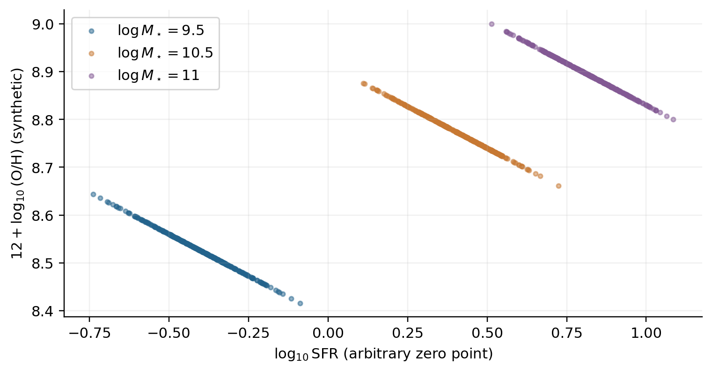
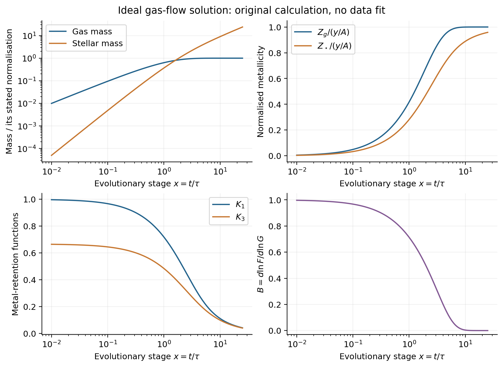
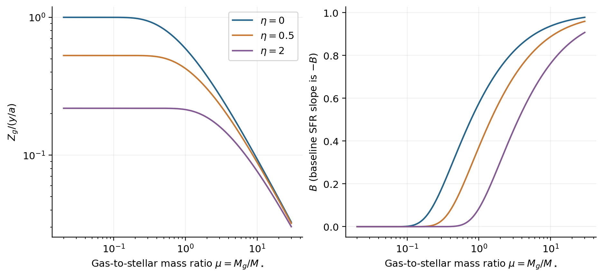
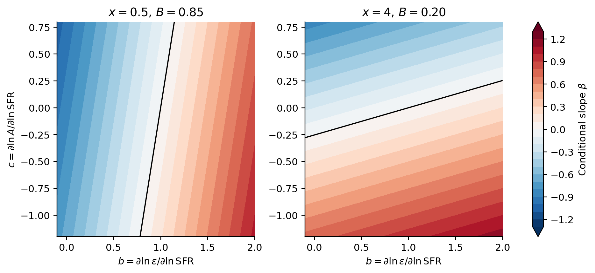

# 1. The answer and how to read this report

**A positive SFR-metallicity correlation is possible within the same mass- and metal-conservation framework used by Wang et al. It does not require an AGN label. However, extending the allowed stellar-mass range without changing the model's physical assumptions will not generate it.** The sign depends on what varies among galaxies at fixed stellar mass: gas supply, star-formation efficiency, effective gas loss, metal loss, recycling, or a mixture of populations and histories.

This report addresses three distinct questions: how the analytical solution is derived; how it relates to previous FMR theory; and which changes could explain a positive conditional correlation. The derivations and numerical counterexamples below are worked calculations for this report, with published starting equations and antecedents identified. They are not fits to SDSS, simulations, or MAUVE.

Two qualifications affect the starting interpretation. First, a positive correlation does not identify an evolutionary direction. A population in which some galaxies have undergone stronger simultaneous decreases in SFR and metallicity can have a positive slope, even if none is currently increasing in both quantities. Second, requiring a minimum sSFR imposes a mass-dependent SFR threshold; it does not establish the sign of the SFR-metallicity relation *at fixed mass*.

The relevant evidence in the second preprint is selection-sensitive: tightening the sSFR threshold to $-0.1$ dex relative to the main sequence largely removes the high-mass inversion, whereas admitting lower-sSFR systems strengthens it. The fiducial SDSS result is much subtler than the strong TNG/EAGLE inversion and depends on the abundance diagnostic. This makes a population containing partly suppressed galaxies a serious interpretation to test. It does not prove that AGN-driven metal ejection is the cause. [Carnevale et al. (2026), Sections III.2 and IV.1-IV.4](https://arxiv.org/html/2608.24826v1).

The central mathematical result developed here is

$$
\boxed{\beta=B(b-1)+(B-1)c,\qquad 0<B<1,}
\tag{1}
$$

where $\beta$ is the logarithmic metallicity-SFR slope within a differentiable family at fixed stellar mass and epoch, $b=\partial\ln\epsilon/\partial\ln\mathrm{SFR}$, and $c=\partial\ln(1-R+\eta)/\partial\ln\mathrm{SFR}$. The response coefficient $B$ is determined by the ideal solution's evolutionary stage. With $b=c=0$, the slope is negative and approaches zero near equilibrium. If efficiency rises sufficiently rapidly with SFR, or higher-SFR galaxies have sufficiently lower effective loading, the slope can be positive. Section 7 derives every term and clarifies when this family derivative can represent a measured regression.

For reading in order: Sections 2-5 develop the solution and redshift argument; Section 6 compares the literature; Sections 7-10 derive positive-slope mechanisms; Sections 11-12 distinguish those mechanisms observationally. Appendices provide a history counterexample and verification details.

**Scope and terminology.** This is a global, one-zone FMR report for an astronomy researcher. Spatially resolved correlations are discussed only where they clarify a mechanism or an observational test. The two target sources are their arXiv v1 versions, dated 5 and 25 August 2026; they are treated as preprints. No assumption is made that their claims are settled. The work is a targeted deep literature review, not a formally exhaustive systematic review.

# 2. Define the question before deriving the model

## 2.1 Three relations that should not be interchanged

Let $m=\log_{10}M_\star$, $s=\log_{10}\psi$, and $\mathcal Z=12+\log_{10}(\mathrm{O/H})$, with $\psi\equiv\mathrm{SFR}$. Fix the units used inside logarithms.

The mass-metallicity relation is a summary such as $\overline{\mathcal Z}(m,z)$. A conditional FMR slope is locally

$$
\beta(m,z)=\left.\frac{\partial\,\mathbb E[\mathcal Z\mid m,s,z]}
{\partial s}\right|_{m,z}.
\tag{2}
$$

A redshift-invariant FMR makes the stronger claim that a common conditional relation $\mathcal F(m,s)$ describes the relevant populations at different epochs. An anticorrelation at one epoch is not by itself evidence for that invariance. Conversely, a curved surface can have a mass-dependent sign without failing to be a surface.

A single projection,

$$
\xi=m-\alpha s,\qquad \mathcal Z=f(\xi),
\tag{3}
$$

is more restrictive still. If $f'>0$, it implies $\beta=-\alpha f'$. A fixed positive $\alpha$ cannot simultaneously represent a positive high-mass conditional slope and a positive mass-metallicity slope there. A flexible surface, or a mass-dependent local slope, is the appropriate description of that possibility.

## 2.2 The slope measured by Carnevale et al.

The paper fits $\Delta\mathcal Z=\eta_{\rm SFR}\log\mathrm{sSFR}+c_0$ in 0.25-dex mass bins, using at least 50 galaxies per plotted bin and 1,000 galaxy bootstrap resamples. Its fiducial threshold is 0.5 dex below a reference sSFR sequence, estimated in 0.2-dex bins at lower masses and continued by a fitted line above $10^{10.2}M_\odot$. The SDSS analysis also requires S/N at least three in the four BPT lines. These are population regressions with finite bins and selection, not time derivatives. [Carnevale et al. (2026), Sections II.1.5-II.2 and III.1.2-III.2](https://arxiv.org/html/2608.24826v1).

At exactly fixed $M_\star$, $\log\mathrm{sSFR}=s-m$ differs from $s$ by a constant, so the two conditional slopes agree. Across a finite-width bin they need not agree exactly, because mass still varies. In this report $\eta$ always denotes *outflow mass loading*; $\eta_{\rm SFR}$ is reserved for the paper's measured slope.

## 2.3 Why the sSFR-cut argument does not settle the sign

For a fixed threshold $q_{\rm cut}$,

$$
\mathrm{sSFR}>q_{\rm cut}\quad\Longrightarrow\quad
\psi>q_{\rm cut}M_\star.
\tag{4}
$$

This raises the *lower envelope* of allowed SFR with mass. It neither forces every more massive object to have higher SFR than every less massive object, nor determines the relation between SFR and $Z$ inside a narrow mass slice. A cut relative to a mass-dependent main sequence has the analogous limitation.

The law of total covariance makes the distinction explicit:

$$
\begin{split}
\mathrm{Cov}(s,\mathcal Z)
={}&\mathbb E_m[\mathrm{Cov}(s,\mathcal Z\mid m)]\\
&+\mathrm{Cov}_m\{\mathbb E[s\mid m],\mathbb E[\mathcal Z\mid m]\}.
\end{split}
\tag{5}
$$

The second term can be positive because both mean SFR and mean metallicity increase with mass, even while the first term is negative. Selection changes both terms. Conditioning on the selected sample gives the same identity with selection included in every expectation.

{width=88%}

For a temporal trajectory, define $\dot{\mathcal Z}/\dot s$ only where $\dot s\ne0$. Both $\dot{\mathcal Z}>0,\dot s>0$ and $\dot{\mathcal Z}<0,\dot s<0$ give a positive ratio. A snapshot cannot distinguish those directions without additional information.

# 3. Derive the ideal gas-flow solution step by step

## 3.1 Notation, units, and assumptions

The starting continuity equations are those of [Wang et al. (2026), equations 2.1-2.4](https://arxiv.org/html/2608.04784v1#S2). They belong to the broader chemical-evolution/regulator family; they are not new conservation laws.

| Symbol | Meaning |
|---|---|
| $M_g$ | Gas mass in the modelled ISM reservoir |
| $M_\star$ | Mass locked in long-lived stars and remnants |
| $M_Z=M_gZ$ | Gas-phase mass of the tracked metal component |
| $\psi=\epsilon M_g$ | SFR; $\epsilon$ has units of inverse time |
| $\Phi$ | Inflow mass per time |
| $R$ | Instantaneously returned fraction of newly formed stellar mass |
| $a\equiv1-R$ | Locked fraction |
| $y$ | Newly produced metal mass per unit mass **formed** into stars |
| $\eta$ | Outflow mass rate divided by SFR |
| $A\equiv a+\eta$ | Total net gas removal per unit SFR |
| $\tau\equiv(A\epsilon)^{-1}$ | Reservoir response time |
| $\mu=M_g/M_\star$ | Gas-to-stellar ratio, not $M_g/(M_g+M_\star)$ |

Using a yield defined per unit *locked* stellar mass instead would introduce $p=y/a$. Confusing $y$ with $p$ causes factors of $1-R$ throughout the derivation. The instantaneous recycling approximation is most natural for promptly produced elements such as oxygen; delayed nitrogen and iron require additional source terms.

For the ideal calculation, assume constant positive $\Phi$ and $\epsilon$, constant $R,y,\eta$, pristine inflow, perfectly mixed gas, outflow metallicity equal to ISM metallicity, and no delayed recycling or mergers. Start with $M_g=M_\star=M_Z=0$. Strictly, $Z=M_Z/M_g$ is undefined at the initial instant; its right-hand limit is zero.

The reservoir must be specified consistently. A total-ISM $\epsilon$ is not interchangeable with an efficiency based only on molecular gas. For comparison with oxygen data, either track oxygen mass and use an oxygen yield, or explicitly assume a fixed oxygen-to-total-metal ratio. If $X_H$ is constant,

$$
12+\log_{10}(\mathrm{O/H})=12+\log_{10}\!\left(\frac{Z_O}{16X_H}\right).
\tag{6}
$$

Thus logarithmic oxygen-fraction and oxygen-abundance slopes agree under those assumptions; the total-metal normalisation cannot simply be relabelled as O/H.

## 3.2 Write mass and metal conservation separately

In a time interval $dt$, inflow adds $\Phi dt$, net stellar locking removes $a\psi dt$, and outflow removes $\eta\psi dt$:

$$
\dot M_g=\Phi-A\psi=\Phi-A\epsilon M_g,
\qquad \dot M_\star=a\epsilon M_g.
\tag{7}
$$

New nucleosynthesis adds $y\psi dt$ in metals; locking and well-mixed outflow remove $AZ\psi dt$:

$$
\dot M_Z=y\epsilon M_g-A\epsilon M_Z.
\tag{8}
$$

Because $M_Z=M_gZ$, the product rule gives

$$
M_g\dot Z+Z\dot M_g=y\psi-AZ\psi.
$$

Insert equation (7), cancel the two identical removal terms, and obtain

$$
\boxed{\dot Z=y\epsilon-\frac{\Phi}{M_g}Z.}
\tag{9}
$$

The first term enriches; the second dilutes. Well-mixed gas loss does not directly change a concentration: it removes numerator and denominator in the same proportion. It nevertheless affects later enrichment through the gas mass and the response time. This distinction becomes essential when interpreting an outflow as metal removal.

## 3.3 Solve for the gas mass

Multiply $\dot M_g+M_g/\tau=\Phi$ by $e^{t/\tau}$:

$$
\frac{d}{dt}(M_ge^{t/\tau})=\Phi e^{t/\tau}.
$$

Integrating from zero to $t$ gives

$$
\boxed{M_g(t)=\Phi\tau(1-e^{-x}),\qquad x\equiv t/\tau.}
\tag{10}
$$

The SFR follows immediately:

$$
\boxed{\psi(t)=\frac{\Phi}{A}(1-e^{-x}).}
\tag{11}
$$

Initially inflow builds the reservoir. Eventually removal balances supply, so $M_g\to\Phi\tau$ and $\psi\to\Phi/A$.

## 3.4 Integrate the stellar mass

Integrate $\dot M_\star=a\epsilon M_g$ using equation (10):

$$
\begin{split}
M_\star(t)&=a\epsilon\Phi\tau\int_0^t(1-e^{-t'/\tau})\,dt'\\
&=\boxed{\frac{a\Phi\tau}{A}(x-1+e^{-x}).}
\end{split}
\tag{12}
$$

The SFR counts all newly formed stellar mass, whereas $M_\star$ counts only the retained fraction; this is why $a$ remains here.

## 3.5 Solve the metal mass before taking the metallicity ratio

Equation (8) has the same integrating factor as the gas equation:

$$
\frac{d}{dt}(M_Ze^{t/\tau})
=y\epsilon\Phi\tau(e^{t/\tau}-1).
$$

Integrating explicitly,

$$
\begin{split}
M_Ze^{t/\tau}
&=y\epsilon\Phi\tau[\tau(e^{t/\tau}-1)-t],\\
M_Z&=\frac{y\Phi\tau}{A}[1-(1+x)e^{-x}].
\end{split}
\tag{13}
$$

Divide by equation (10):

$$
\boxed{Z(t)=\frac{y}{A}\left[1-\frac{x}{e^x-1}\right]
\equiv\frac{y}{A}F(x).}
\tag{14}
$$

This recovers Wang's equation 2.6. The same constant-inflow solution is tabulated in [Belfiore, Maiolino & Bothwell (2016), Appendix A, Table A1](https://academic.oup.com/mnras/article/455/2/1218/1107983). Its usefulness here lies in how time and supply amplitude can be eliminated to expose the FMR structure.

An alternative check uses equation (9). Since $\Phi/M_g=[\tau(1-e^{-x})]^{-1}$, the integrating factor for the $Z$ equation is $e^x-1$. Then $d[(e^x-1)Z]/dx=(y/A)(e^x-1)$, yielding equation (14) again.

## 3.6 Integrate the mean stellar metallicity

Stars inherit the gas abundance when they form. The mass-weighted mean is

$$
Z_\star=\frac{1}{M_\star}\int_0^t a\psi(t')Z(t')\,dt'.
\tag{15}
$$

Because $\psi Z=\epsilon M_Z$, insert equation (13). The required dimensionless integral is

$$
\int_0^x[1-(1+u)e^{-u}]\,du=x-2+(x+2)e^{-x}.
$$

Therefore

$$
\boxed{Z_\star=\frac{y}{A}
\frac{x-2+(x+2)e^{-x}}{x-1+e^{-x}}.}
\tag{16}
$$

This is a mass-weighted theoretical abundance. It is not automatically comparable to a light-weighted stellar abundance from spectral fitting, especially when the tracked element differs.

## 3.7 Understand the two limits

For $x\ll1$, expand $e^{-x}=1-x+x^2/2-x^3/6+\cdots$:

$$
\begin{aligned}
M_g&\simeq\Phi t,& \psi&\simeq\epsilon\Phi t,\\
M_\star&\simeq\tfrac12 a\epsilon\Phi t^2,&
Z&\simeq\tfrac12 y\epsilon t,\\
Z_\star&\simeq\tfrac13y\epsilon t.&
\end{aligned}
\tag{17}
$$

The factor of one-half in $Z$ matters: a growing reservoir contains gas with a range of residence times, rather than gas all enriched for the full elapsed time. To leading order, gas-phase metals equal the total newly produced metals:

$$
M_gZ\simeq\frac{y}{a}M_\star,
\qquad \boxed{Z\simeq\frac{y}{a}\frac{M_\star}{M_g}.}
\tag{18}
$$

This is the early, gas-rich form of the gFMR. Most produced metals still reside in the gas. It is a concentration set by cumulative production divided by available dilution mass.

For $x\gg1$,

$$
M_g\to\frac{\Phi}{A\epsilon},\quad
\psi\to\frac{\Phi}{A},\quad
Z,Z_\star\to\frac{y}{A},\quad
M_\star\simeq\frac{a\Phi}{A}(t-\tau).
\tag{19}
$$

The gas and gas-metal abundance approach equilibrium; the stellar mass continues to grow. A galaxy is not static simply because its reservoir is in equilibrium.

From the exact expressions,

$$
\mathrm{sSFR}=\frac{1-e^{-x}}{a\tau(x-1+e^{-x})}
\simeq\begin{cases}2/(at),&x\ll1,\\1/(at),&x\gg1.\end{cases}
\tag{20}
$$

The $t$ here is elapsed time since the assumed initial state, not automatically the age of the Universe. The coefficient also changes between the limits.

{width=100%}

# 4. Eliminate time: the gFMR and its projection into SFR

## 4.1 Obtain the two functions in Wang's Section 4

Divide equation (12) by equation (10):

$$
\frac{M_\star}{M_g}=\frac{a}{A}
\frac{x-1+e^{-x}}{1-e^{-x}}.
$$

Define

$$
G(x)\equiv\frac{x-1+e^{-x}}{1-e^{-x}}
=\frac{x}{1-e^{-x}}-1=x-F(x).
\tag{21}
$$

Then

$$
\boxed{\frac{A}{a\mu}=G(x)=\mathcal K_2(x).}
\tag{22}
$$

Combining this with equation (14),

$$
\boxed{Z=\frac{y}{a\mu}\mathcal K_1(x),\qquad
\mathcal K_1(x)=\frac{F(x)}{G(x)}
=\frac{1-(1+x)e^{-x}}{x-1+e^{-x}}.}
\tag{23}
$$

Equations (22)-(23) are Wang's equations 4.2 and 4.1, written with a compact notation. The supply amplitude $\Phi$ and efficiency $\epsilon$ have disappeared from the relation among $Z$, $\mu$, and $\eta$.

To evaluate it, calculate $A/(a\mu)$, solve the monotonic one-dimensional equation $G(x)=A/(a\mu)$, and substitute the result into $Z=(y/A)F(x)$. There is no need to guess an age. The inverse is normally evaluated numerically; the physical relation is implicit through $G$.

The analogous stellar formula follows from equation (16):

$$
Z_\star=\frac{y}{a\mu}\mathcal K_3(x),\qquad
\mathcal K_3(x)=\frac{1-\mathcal K_1(x)}{\mathcal K_2(x)}.
\tag{24}
$$

As $x\to0$, $\mathcal K_1\to1$, $\mathcal K_2\simeq x/2$, and $\mathcal K_3\to2/3$. At late times, $\mathcal K_1\sim1/x$ and $\mathcal K_2\sim x$, recovering equilibrium rather than indefinite growth in $Z$.

## 4.2 What information is and is not eliminated

The cancellation of a *constant supply amplitude* is exact for this model. Independence of *arbitrary inflow history* does not follow. Late dilution events and different initial gas/metal reservoirs retain information that the ideal one-parameter solution does not contain. Appendix A constructs two histories with identical current $M_\star$, $M_g$, SFR, efficiency, and loading, but metallicities separated by 0.196 dex.

Similarly, inference of loading from $Z$ and $\mu$ is conditional on the adopted yield, inflow composition, mixing, initial conditions, and enrichment family. In the early limit loading barely affects the result, so formal invertibility does not imply a well-conditioned measurement. An inferred $\eta$ need not be unique once metal-selective loss or recycling is allowed.

## 4.3 Recover the ordinary FMR

Using $M_g=\psi/\epsilon$ gives

$$
\frac{M_\star}{M_g}=\frac{\epsilon M_\star}{\psi},\qquad
G(x)=\frac{A\epsilon M_\star}{a\psi}.
\tag{25}
$$

If $A$ and $\epsilon$ are constants across a population, metallicity is a universal function of $M_\star/\psi$. With $A=A(M_\star)$ and $\epsilon=\epsilon(M_\star)$, it remains a well-defined mass-SFR surface within the ideal family. The gFMR is the more direct accounting relation because it uses the gas mass itself; replacing gas with SFR introduces the efficiency and its scatter.

For $\epsilon\propto M_\star^u\psi^v$,

$$
\log\frac{M_\star}{M_g}=(1+u)\log M_\star-(1-v)\log\psi+\mathrm{constant}.
\tag{26}
$$

When loading does not introduce an additional independent variation, a projection coefficient is

$$
\alpha=\frac{1-v}{1+u}.
\tag{27}
$$

This is a change of variables, not an explanation of why $u$ and $v$ have particular values. A single $\alpha$ also cannot encode all changes in transition shape when loading varies substantially.

{width=100%}

# 5. Redshift invariance: the useful result and its limits

## 5.1 The cosmological model supplies the input functions

Wang's cosmological calculation uses $\Phi=\lambda(M_h,z)f_b\dot M_h$ and parameterised efficiency and loading. The tabulated values include

$$
\epsilon=0.38\,\mathrm{Gyr}^{-1}
\left(\frac{M_\star}{10^{10}M_\odot}\right)^{0.33}(1+z)^{1.1},
\quad
\eta=0.22\left(\frac{M_\star}{10^{10}M_\odot}\right)^{-0.30},
\tag{28}
$$

with $R=0.44$ and $y=0.012$. Parameters were manually calibrated using MZR, SFMS, and stellar-to-halo mass constraints at six epochs from about $z=0.08$ to 3.30, over approximately $10^9$-$10^{10.5}M_\odot$. The resulting approximate FMR collapse is a prediction of that chosen calibration; it is not independent of those empirical inputs. [Wang et al. (2026), Section 2.2 and Table 1](https://arxiv.org/html/2608.04784v1#S2.SS2).

The paper illustrates the calibrated FMR with $\alpha\simeq0.55$ and the gas-mass projection with $\alpha_g\simeq0.85$ (its Figure 9). These are descriptive collapse parameters, not constants imposed by metal conservation.

The analytical backbone and the cosmological implementation should therefore be evaluated separately. Conservation determines the backbone; the input functions determine which part of it galaxies populate and how closely a single observational projection works.

## 5.2 Reconstruct the two approximate alpha estimates

At one epoch, $\epsilon\propto M_\star^{\epsilon_m}$ gives equation (27) with $u=\epsilon_m$, $v=0$:

$$
\alpha_m=\frac{1}{1+\epsilon_m}\simeq0.752.
\tag{29}
$$

To absorb changes between median sequences at different epochs, assume the matter-dominated approximation $t\propto(1+z)^{-3/2}$ and a median $\mathrm{sSFR}\propto t^{-1}$. Write $d=2\epsilon_z/3$; then

$$
\epsilon\propto M_\star^{\epsilon_m}t^{-d}
\propto M_\star^{\epsilon_m-d}\psi^d,
$$

and hence

$$
\alpha_z=\frac{1-d}{1+\epsilon_m-d}\simeq0.447
\quad(\epsilon_m=0.33,\ \epsilon_z=1.1).
\tag{30}
$$

These reproduce Wang's equations 4.5-4.6. They identify two different optimisation tasks: aligning galaxies within an epoch and aligning median evolutionary sequences. They should not be treated as a theorem that any measured best-fit $\alpha$ must lie between these numbers. The approximations, scatter distribution, fitting weights, loading variation, and equilibrium fraction matter. Matter-dominated time scaling is particularly inaccurate at low redshift, and elapsed galaxy age need not equal cosmic age.

## 5.3 A conditional surface requires a stronger test

Suppose the same $M_\star$ and SFR occur at two redshifts. If $\epsilon(M_\star,z)$ differs, their inferred gas masses $M_g=\psi/\epsilon$ differ. For fixed $A$ and yield, the ideal solution gives

$$
\left.\frac{\partial\ln Z}{\partial z}\right|_{M_\star,\psi}
=B\left.\frac{\partial\ln\epsilon}{\partial z}\right|_{M_\star,\psi},
\tag{31}
$$

where Section 7 shows $B>0$ outside strict equilibrium. Explicit redshift dependence therefore does not generally vanish at fixed mass and SFR. If $A$ also evolves, the right side becomes $B\partial_z\ln\epsilon+(B-1)\partial_z\ln A$, with further terms if yield or inflow composition changes.

Replacing redshift by *median* sSFR can parameterise a sequence when that mapping is monotonic. It does not prove that different redshift populations agree where their mass-SFR distributions overlap. Nor does it specify the scatter or the conditional median away from the main sequence. Wang explicitly distinguishes its median-level argument from object-by-object behaviour in Section 4.4; the strongest use of the result is therefore an approximate, calibrated population description, not an unrestricted conservation-law guarantee.

The direct observational/model test is to fit a sufficiently flexible $\mathcal F(m,s)$ on common mass-SFR support and test residual redshift dependence, after matching selection and abundance diagnostics. A compact projection working along non-overlapping median sequences is weaker evidence.

## 5.4 What the high-mass caveat actually says

The calibration extends to about $10^{10.5}M_\odot$, but the AGN discussion in Section 5.10 flags metallicity discrepancies already above roughly $10^{10}M_\odot$. There is therefore no single exact $10^{10.5}M_\odot$ boundary throughout the paper. It omits explicit ejective AGN outflows, while its cooling prescription can phenomenologically represent preventive feedback. [Wang et al. (2026), Sections 2.2.1, 2.2.5 and 5.10](https://arxiv.org/html/2608.04784v1#S5.SS10).

It is reasonable to investigate the omitted regime. It is not necessary to infer that the authors deliberately avoided an inconvenient correlation: the stated model scope and known omissions suffice. Relaxing the mass restriction must come with explicit new input functions, scatter, histories, or gas phases; mass itself is not a sign-switching term in the continuity equations.

# 6. How this fits into earlier analytical and theoretical work

## 6.1 Comparison of the principal frameworks

The comparison below is organised by the closure each model adds to conservation. Full primary bibliographic records appear in Section 13. A positive mechanism being available in an equation is distinct from showing that it dominates a selected observational population.

| Framework | Additional assumption or emphasis | Relationship to the present problem |
|---|---|---|
| Peeples & Shankar (2011) | Combine gas fractions and metallicity constraints with separate mass and metal expulsion efficiencies | Establishes that metal loss and total gas loss need not be the same parameter |
| Dayal, Ferrara & Dunlop (2013) | Simple analytic inflow/outflow and star-formation prescriptions | Reproduces a negative low-mass trend and high-mass flattening; flattening is not a positive branch |
| Lilly et al. (2013) | A gas reservoir, SFR-scaled outflow, and approximate abundance tracking | Already proposes a conditional, potentially epoch-independent FMR; efficiency/loading evolution matters |
| Peng & Maiolino (2014) | Dynamical regulator response and finite equilibration time | Connects ideal solutions to time-dependent evolution; exact gas evolution should be distinguished from abundance approximations |
| Pipino, Lilly & Carollo (2014) | Explicit enrichment-history correction to instantaneous regulator expressions | Shows why approximate tracking can work in some histories and fail in others |
| Forbes et al. (2014) | Stochastic supply and stationary ensembles at fixed mass | Negative supply-driven fluctuations; explicitly recognises a positive contribution from loading scatter |
| Zahid et al. (2014) | Universal chemical relation using stellar-to-gas mass ratio | An antecedent of the gFMR interpretation; the transition function differs from the exact ideal-flow solution |
| Belfiore, Maiolino & Bothwell (2016) | Spatial metal budgets with analytical gas-flow models | Provides an earlier exact constant-inflow abundance solution useful for checking the derivation |
| E. Wang & Lilly (2021) | Variable supply versus variable efficiency; response times and spatial scale | Explicitly derives positive efficiency-driven correlations; does not establish a global massive-galaxy origin |
| Lin & Zu (2023) | Parameterised average star-formation histories with enrichment and evolving loading | Non-equilibrium, coherent enrichment can generate an FMR; their high-mass extrapolation is unvalidated |
| K. Wang et al. (2026) | Ideal-to-cosmological mapping and gas-ratio transition functions | Makes the link between gFMR, FMR projection and evolutionary stage especially explicit |

All these frameworks share bookkeeping of gas supply, star formation and metal production/loss. Their differences are principally the assumed input functions, the treatment of histories, the distribution of parameters across galaxies, and the observable being explained. This is more informative than opposing "gas flow" and "gas regulator" as if they used different conservation laws.

## 6.2 Why strict equilibrium is restrictive but regulator theory is broader

With pristine inflow, common fixed loading and yield, strict equilibrium gives $Z=y/A$, independent of $\Phi$ and $\epsilon$. Varying only supply amplitude then changes SFR but leaves abundance unchanged. This particular closure predicts zero conditional slope.

A more general identity follows without setting $\dot Z=0$. Since $\mu=M_g/M_\star$,

$$
\frac{\dot M_g}{M_g}=\frac{d\ln\mu}{dt}+a\epsilon\mu,
$$

and equation (7) implies

$$
\frac{\Phi}{\epsilon M_g}
=A+a\mu+\epsilon^{-1}\frac{d\ln\mu}{dt}.
$$

Substitute into equation (9):

$$
\boxed{Z=
\frac{y-\epsilon^{-1}\dot Z}
{A+a\mu+\epsilon^{-1}d\ln\mu/dt}.}
\tag{32}
$$

This is Wang's equation 5.1. Dropping $\dot Z$ is an approximation to this identity, not a new conservation law. Constant efficiency and loading alone do not imply constant $\mu$.

For the early ideal solution, $\dot Z\simeq y\epsilon/2$. Removing that term while retaining the same exact reservoir history doubles the inferred abundance, an error of $\log_{10}2=0.301$ dex. This is a concrete regime where the approximation fails.

It does not show that all slowly evolving abundance-tracking approximations are inconsistent. Write $D(t)=\Phi/M_g$, $Z_{\rm tr}=y\epsilon/D$, and $\delta=Z-Z_{\rm tr}$. Then

$$
\dot\delta+D\delta=-\dot Z_{\rm tr}.
\tag{33}
$$

When the moving target varies slowly and the transient has decayed,

$$
\delta\simeq-D^{-1}\dot Z_{\rm tr},\qquad
\frac{|\delta|}{Z_{\rm tr}}\sim
D^{-1}\left|\frac{d\ln Z_{\rm tr}}{dt}\right|\ll1.
\tag{34}
$$

A small lag allows the target and the galaxy's metallicity both to evolve. Treating $\dot Z$ as a small correction in an instantaneous balance is not the same as asserting that the actual metallicity is exactly constant for all time. Near the constant-coefficient equilibrium, gas and metallicity perturbations have the same exponential eigenvalue $-1/\tau$, but coupling produces an additional $t e^{-t/\tau}$ transient; there is no universally separate, shorter metallicity timescale.

This conditional view is consistent with the explicit history corrections and numerical tests of [Pipino et al. (2014), Sections 3.3-3.4 and 5.1.2](https://academic.oup.com/mnras/article/441/2/1444/1062348). Their reported good accuracy applies to their explored histories. It should neither be universalised nor dismissed by applying a different, early-time history.

## 6.3 Earlier positive-slope mechanisms and novelty

[Forbes et al. (2014), Section 5.1](https://academic.oup.com/mnras/article/443/1/168/1480246) explicitly notes that loading scatter can reverse the negative FMR slope because both equilibrium SFR and metallicity decrease with loading. Section 8 below writes this mechanism in the present yield convention.

[Wang & Lilly (2021), Section 2.3 and Appendix A](https://arxiv.org/pdf/2009.01935) develops the positive response to time-variable efficiency at constant supply. The driving waveform matters; a sinusoidal response is not a theorem for arbitrary bursts. Its spatially resolved application must not be treated as proof of a global high-mass mechanism. Section 9 derives a compact transfer-function version here.

[Lin & Zu (2023), Sections 2-4](https://arxiv.org/pdf/2212.01402) instead builds enrichment around parameterised average star-formation histories, with a power law times exponential SFH and loading linked to galaxy properties. Its fit uses mass-bin centres from $\log M_\star=9.25$ to 10.15, so its success is not a calibration of the massive positive branch.

Thus the prospective contribution is not "the first analytical model allowing a positive correlation." A stronger research objective is to derive and test which covariance or history produces the sign change under the actual high-mass selection, while retaining successful low-mass and redshift behaviour.

## 6.4 An alternative massive-galaxy scenario

[Yates & Kauffmann (2014), Section 3.2](https://academic.oup.com/mnras/article/439/4/3817/1167690) describes massive low-SFR, low-metallicity systems through gas depletion, suppressed star formation, and subsequent dilution by metal-poor satellites/cold clumps. It explicitly revises the earlier interpretation that diffuse halo cooling supplies that dilution. This is a semi-analytic evolutionary explanation, not a one-zone proof or a universal observational result.

It matters because "AGN-related" need not mean "AGN directly ejects the metal-rich gas." Preventive heating, residual accretion, low star-formation efficiency, and spatial weighting can lead to different signatures. A useful model must state the channel rather than rely on the label.

# 7. An exact sign criterion inside Wang's ideal solution

## 7.1 First prove why the baseline cannot invert

For $x>0$, equations (14) and (21) give $Z=(y/A)F(x)$ and $G(x)=A\epsilon M_\star/(a\psi)$. Their derivatives are

$$
F'(x)=\frac{(x-1)e^x+1}{(e^x-1)^2}>0,
\qquad
G'(x)=\frac{1-(1+x)e^{-x}}{(1-e^{-x})^2}>0.
\tag{35}
$$

Both inequalities follow from $e^x>1+x$ and its equivalent forms. Define the elasticity

$$
\boxed{B(x)\equiv\frac{d\ln F}{d\ln G}
=\frac{G(x)F'(x)}{F(x)G'(x)}.}
\tag{36}
$$

It is positive. To prove that it is below one, use $G=x-F$ and $G'=1-F'$. Then $B<1$ is equivalent to $xF'<F$. But

$$
\frac{d}{dx}\left(\frac{F}{x}\right)
=-\frac{1}{x^2}+\frac{1}{4\sinh^2(x/2)}<0,
\tag{37}
$$

because $2\sinh(x/2)>x$ for $x>0$. Hence $0<B<1$. Expanding at early times gives $B\to1$; at late times $F$ saturates and $B\to0$.

At fixed $M_\star$, $A$ and $\epsilon$, higher SFR means larger gas mass, smaller $G$, smaller $x$, and smaller $Z$. Formally,

$$
\boxed{\left.\frac{\partial\ln Z}{\partial\ln\psi}\right|_{M_\star,A,\epsilon}
=-B(x)<0.}
\tag{38}
$$

This is an exact sign restriction within the ideal family. It holds at high mass as well as low mass. Approaching equilibrium flattens the relation; it does not make the derivative positive. A declining *mean* $\eta(M_\star)$ changes the mass trend and equilibrium level, but does not introduce loading variation *within a fixed-mass slice*.

## 7.2 Allow efficiency and loading to covary with SFR

Now follow a smooth family of galaxies at the same present $M_\star$ and epoch, allowing their constant-per-galaxy parameters to differ. Let

$$
b\equiv\left.\frac{d\ln\epsilon}{d\ln\psi}\right|_{M_\star,z},
\qquad
c\equiv\left.\frac{d\ln A}{d\ln\psi}\right|_{M_\star,z}.
\tag{39}
$$

Because $G=A\epsilon M_\star/(a\psi)$,

$$
\frac{d\ln G}{d\ln\psi}=c+b-1.
$$

Differentiate $\ln Z=\ln y-\ln A+\ln F$:

$$
\begin{split}
\beta&=-c+\frac{d\ln F}{d\ln G}\frac{d\ln G}{d\ln\psi}\\
&=\boxed{B(b-1)+(B-1)c.}
\end{split}
\tag{40}
$$

The calculation assumes constant $R$ and $y$ across the family. If the yield varies, add $d\ln y/d\ln\psi$; changing the IMF also changes $a$ and requires redoing all terms consistently. For a fixed, nonzero inflow metallicity in the well-mixed model, the same expression describes the excess $Z-Z_{\rm in}$, while the logarithmic slope of total $Z$ is multiplied by $(Z-Z_{\rm in})/Z$.

Three consequences are immediate:

1. **Fixed loading:** $\beta>0$ requires $b>1$. Efficiency must rise more than proportionally with SFR along this family. Since $d\ln M_g/d\ln\psi=1-b$, these higher-SFR galaxies have *less* total gas, converted more rapidly.
2. **Fixed efficiency:** $\beta>0$ requires $c<-B/(1-B)$. Higher-SFR galaxies must have sufficiently lower effective loading. This is difficult deep in the early regime, where $B\simeq1$, but a modest negative loading covariance can dominate near equilibrium.
3. **Both vary:** use equation (40) directly. For $c<0$, the threshold becomes $b>1+(1-B)c/B$, below the efficiency-only threshold. Increasing efficiency and better retention can act together.

Here $c$ concerns $A=a+\eta$, not $\eta$ alone:

$$
c=\frac{\eta}{a+\eta}\frac{d\ln\eta}{d\ln\psi}
\quad(\eta>0).
\tag{41}
$$

When loading is already very small, a large fractional change in $\eta$ has a small effect on $A$. This limits how much leverage mass-loss variations have in a nearly outflow-free galaxy.

{width=100%}

## 7.3 Relate the derivative to a measured regression

For small fluctuations around a common ideal-family state,

$$
\delta\ln Z\simeq-B\,\delta\ln\psi+B\,\delta\ln\epsilon
+(B-1)\delta\ln A.
\tag{42}
$$

The OLS slope equals

$$
\beta_{\rm OLS}\simeq-B
+B\frac{\mathrm{Cov}(\ln\epsilon,\ln\psi)}{\mathrm{Var}(\ln\psi)}
+(B-1)\frac{\mathrm{Cov}(\ln A,\ln\psi)}{\mathrm{Var}(\ln\psi)}.
\tag{43}
$$

All quantities must be conditioned on the same mass, epoch, and selection. Broad populations with varying $B$, nonlinear histories, heterogeneous baselines, or measurement errors require the full distribution rather than this local approximation. Equations (40) and (43) are therefore useful diagnostic identities, not a causal theory until $\epsilon$ and loading are independently modelled or constrained.

## 7.4 Construct an exact high-SFR, high-Z example at the same mass

To demonstrate possibility without confusing mass growth with a fixed-mass correlation, fix

$$
M_\star=10^{10.7}M_\odot,\quad a=0.56,\quad \eta=0.44,
\quad A=1,\quad y=0.012.
$$

Set $\epsilon_0=0.5\,\mathrm{Gyr}^{-1}$ and choose $\psi_0=\epsilon_0M_\star$, with compatible time units, so $\psi_0=25.06\,M_\odot\,\mathrm{yr}^{-1}$. For $r_\psi=\psi/\psi_0$, impose the illustrative cross-galaxy relation

$$
\epsilon=\epsilon_0r_\psi^{1.5},\qquad
\mu=r_\psi^{-0.5},\qquad 0.8\le r_\psi\le1.6.
\tag{44}
$$

For each member, solve

$$
G(x)=\frac{A}{a\mu},\qquad
t=\frac{x}{A\epsilon},\qquad
\Phi=\frac{A\psi}{1-e^{-x}}.
\tag{45}
$$

These are positive, internally consistent ideal histories that end at exactly the same stellar mass. The resulting SFR rises from 20.05 to $40.09\,M_\odot\,\mathrm{yr}^{-1}$ while $Z$ rises from 0.00903 to 0.01026. The corresponding elapsed ages range from 3.08 to 6.57 Gyr. Each galaxy has constant parameters during its own idealised history; the parameters and starting times differ across the family.

**What this establishes:** the conservation framework admits a positive fixed-mass branch with both quantities larger in the higher-SFR galaxies, without invoking AGN feedback or negative loading. **What it does not establish:** that the exponent 1.5 is realised in massive galaxies, that the branch dominates a selected sample, or that its redshift dependence is correct. The assumed efficiency relation is the hypothesis to test, not a prediction to advertise.

{width=100%}

# 8. Retention and recycling: another coherent positive branch

## 8.1 Different effective loading at equilibrium

Take a population with the same external pristine supply $\Phi_p$, but different $A=a+\eta$. At equilibrium,

$$
\psi=\frac{\Phi_p}{A},\qquad Z=\frac{y}{A}
\quad\Longrightarrow\quad
\boxed{Z=\frac{y}{\Phi_p}\psi.}
\tag{46}
$$

Lower loading gives higher SFR and higher metallicity, with logarithmic slope $+1$. This is the loading-scatter mechanism already identified by Forbes et al. No preferential enrichment of the wind is needed for this *cross-galaxy equilibrium comparison*.

It does not contradict equation (9): an instantaneous well-mixed removal event leaves $Z$ unchanged, but a changed long-term removal rate changes the equilibrium gas reservoir, SFR, and metal budget. Nor does equation (46) automatically apply at fixed stellar mass in an evolving cosmological population. Such a population must have histories or starting stellar masses that make its current masses comparable; equal age and identical supply histories would generally produce different accumulated stellar masses.

If supply covaries with a latent physical variable $u$ as well, define $p_u=d\ln\Phi_p/du$ and $a_u=d\ln A/du$. Then

$$
\frac{d\ln Z}{d\ln\psi}=\frac{-a_u}{p_u-a_u}.
\tag{47}
$$

Thus changing loading is not guaranteed to yield $+1$ once supply also varies. Supply scatter uncorrelated with loading adds SFR scatter and generally weakens the slope.

## 8.2 Recycling gives a physical interpretation of effective loading

Suppose a fraction $f$ of an outflow of rate $\eta\psi$ returns promptly with the same composition, while the remainder is permanently lost. In this intentionally simple instantaneous-return limit,

$$
\dot M_g=\Phi_p-[a+(1-f)\eta]\psi,
$$

$$
\dot M_Z=y\psi-[a+(1-f)\eta]Z\psi.
\tag{48}
$$

Mass and metal accounting remain consistent: the returning material is not counted as newly produced metals. Define $A_{\rm eff}=a+(1-f)\eta$. Increasing $f$ decreases effective loss and produces equation (46)'s positive branch at fixed $\Phi_p$.

Real recycling has a delay, a separate reservoir, and possibly a changed metallicity. A less restrictive model must track that reservoir and its metal mass, or specify a causal return kernel, rather than inserting an arbitrary metal source. The instantaneous example proves a mechanism's availability; it does not measure a recycling fraction or establish why its scatter becomes dominant near $10^{10.5}M_\odot$.

# 9. Time-dependent efficiency and supply: derive the response

## 9.1 Why this is a different extension

Section 7 compared galaxies belonging to an ideal constant-coefficient family. Real fluctuations can move a galaxy off that family. The continuity equations still apply, but the functions $\mathcal K_1$ and $\mathcal K_2$ need not describe every instantaneous state. We now retain the original differential equations and perturb a common equilibrium. This is closely related to the published driver analysis of Wang & Lilly (2021).

Let $M_{g0}=\Phi_0/(A\epsilon_0)$, $\psi_0=\Phi_0/A$, $Z_0=y/A$, and $\tau=(A\epsilon_0)^{-1}$. Use dimensionless fractional perturbations

$$
p=\frac{\delta\Phi}{\Phi_0},\quad e=\frac{\delta\epsilon}{\epsilon_0},
\quad g=\frac{\delta M_g}{M_{g0}},\quad
s=\frac{\delta\psi}{\psi_0}=g+e,\quad q=\frac{\delta Z}{Z_0}.
\tag{49}
$$

Here $s$ and $q$ denote small fractional variations, rather than the base-ten logarithms used earlier. To first order they equal natural-log variations.

## 9.2 Linearise both conservation equations

Substituting in the gas equation and retaining only first-order terms gives

$$
\boxed{\tau\dot g=p-g-e=p-s.}
\tag{50}
$$

For metallicity, use equation (9):

$$
\dot Z=y\epsilon_0(1+e)
-\frac{\Phi_0}{M_{g0}}(1+p-g)Z_0(1+q).
$$

Cancel the equilibrium terms and use $y\epsilon_0=Z_0/\tau$:

$$
\boxed{\tau\dot q=e-p+g-q=s-p-q.}
\tag{51}
$$

These equations keep both the gas and metal response; setting $\dot q=0$ would discard the phase information that helps determine the correlation.

## 9.3 Solve a sinusoidal mode

For Fourier amplitudes proportional to $e^{i\omega t}$, set $\Omega=\omega\tau$. Equations (50)-(51) yield

$$
\widehat g=\frac{\widehat p-\widehat e}{1+i\Omega},\qquad
\boxed{\widehat s=\frac{\widehat p+i\Omega\widehat e}{1+i\Omega},}
\tag{52}
$$

$$
\boxed{\widehat q=\frac{i\Omega(\widehat e-\widehat p)}{(1+i\Omega)^2}.}
\tag{53}
$$

The two drivers enter the metallicity response with opposite signs. Inflow changes dilution as well as future star formation. Efficiency changes immediately alter production and consumption at a given gas mass.

## 9.4 Derive the population slope under explicit sampling assumptions

Consider independent, small-amplitude sinusoidal drivers with random phases, a common frequency, common equilibrium properties, and phase sampling uniform across an ensemble. Let $P_p$ and $P_e$ be their fractional variances. Taking the real parts of the transfer-function cross products gives

$$
\mathrm{Cov}(q,s)=\frac{\Omega^2}{(1+\Omega^2)^2}(P_e-P_p),
\tag{54}
$$

$$
\mathrm{Var}(s)=\frac{P_p+\Omega^2P_e}{1+\Omega^2}.
$$

Therefore

$$
\boxed{\beta_{\rm lin}=
\frac{\Omega^2(P_e-P_p)}{(1+\Omega^2)(P_p+\Omega^2P_e)}.}
\tag{55}
$$

For inflow alone, $\beta=-\Omega^2/(1+\Omega^2)$. For efficiency alone, $\beta=1/(1+\Omega^2)$. Equal driver variances cancel the covariance in this restricted example; larger efficiency variance gives a positive slope.

The limiting slopes need care: very slow efficiency variations leave almost no SFR variation because the reservoir adjusts to keep $\psi\simeq\Phi/A$. A finite formal slope then accompanies vanishing signal amplitude. At very high frequency the enrichment response is small. Detectability depends on amplitudes as well as slope.

For independent broadband drivers the covariance becomes an integral proportional to

$$
\int_0^\infty
\frac{(\omega\tau)^2}{[1+(\omega\tau)^2]^2}
[P_e(\omega)-P_p(\omega)]\,d\omega,
\tag{56}
$$

using a consistent spectral normalisation. Correlated drivers require their cross-spectrum. SFR and metallicity measurements averaged over different times introduce additional transfer functions. Large bursts, preferential phase selection, heterogeneous baselines, and nonlinear responses can change the result.

{width=100%}

## 9.5 Can SFR and metallicity actually increase together in time?

Yes. For fixed loading and pristine inflow,

$$
\frac{\dot\psi}{\psi}=\frac{\dot\epsilon}{\epsilon}
+\frac{\Phi}{M_g}-A\epsilon,
\qquad
\dot Z=y\epsilon-\frac{\Phi}{M_g}Z.
\tag{57}
$$

The simultaneous inequalities

$$
\frac{\dot\epsilon}{\epsilon}>A\epsilon-\frac{\Phi}{M_g},
\qquad y\epsilon>\frac{\Phi}{M_g}Z
\tag{58}
$$

are sufficient for both quantities to rise. A sufficiently rapid, smooth increase in efficiency can satisfy them. They need not remain satisfied after the gas reservoir has adjusted. An instantaneous efficiency step raises SFR immediately but not $Z$ discontinuously; subsequent enrichment and gas depletion must be followed rather than described as an instantaneous upward shift of both.

During any finite star-forming evolution, $\dot M_\star=a\psi>0$. Treating a temporal response as an approximately fixed-mass fluctuation requires $a\int\psi\,dt\ll M_\star$, or a population calculation explicitly conditioned on present mass. The exact construction in Section 7.4 avoids that approximation for its cross-galaxy comparison; the periodic numerical experiment here is only a response check.

# 10. Metal-selective outflows and the AGN hypothesis

## 10.1 Generalise the equations, not the terminology

Let the outflow metal rate be $\zeta Z\psi$, while its total mass rate remains $\eta\psi$. For $\eta>0$, $\zeta=\eta Z_{\rm out}/Z$. Introduce inflow metallicity $Z_{\rm in}$. Conservation becomes

$$
\dot M_g=\Phi-(a+\eta)\psi,
$$

$$
\dot M_Z=Z_{\rm in}\Phi+y\psi-(a+\zeta)Z\psi.
\tag{59}
$$

Apply the product rule again:

$$
\boxed{\dot Z=y\epsilon+(Z_{\rm in}-Z)\frac{\Phi}{M_g}
-(\zeta-\eta)\epsilon Z.}
\tag{60}
$$

Preferential metal loss is the last term. Wang already derives the $Z_{\rm in}=0$, $\zeta\ne\eta$ extension in Section 5.4; introducing $\zeta$ is therefore not a new modification of that paper. The concept also predates it in [Peeples & Shankar (2011)](https://arxiv.org/abs/1007.3743). What is needed for the high-mass question is a model for how $\eta$, $\zeta$, supply, and efficiency covary or evolve.

## 10.2 Derive its constant-coefficient solution

For pristine inflow define $A=a+\eta$, $C=a+\zeta$, $\tau_m=(A\epsilon)^{-1}$, $\rho=C/A$, and $x=t/\tau_m$. The gas solution is unchanged. The metal equation has integrating factor $e^{C\epsilon t}$:

$$
M_Z(t)=y\epsilon\int_0^tM_g(u)e^{-C\epsilon(t-u)}\,du.
\tag{61}
$$

Insert $M_g(u)=\Phi\tau_m(1-e^{-u/\tau_m})$ and integrate both terms:

$$
H(x,\rho)=\frac{1-e^{-\rho x}}{\rho}
-\frac{e^{-x}-e^{-\rho x}}{\rho-1},
$$

$$
\boxed{Z=\frac{y}{A}\frac{H(x,\rho)}{1-e^{-x}}.}
\tag{62}
$$

At $\rho=1$, take the continuous limit $H=1-(1+x)e^{-x}$; the apparent singularity is removable. In the gas-ratio form,

$$
Z=\frac{y}{a\mu}\mathcal K'_1(x,\rho),\qquad
\mathcal K'_1=\frac{H(x,\rho)}{x-1+e^{-x}},\qquad
G(x)=\frac{A}{a\mu}.
\tag{63}
$$

This reproduces Wang's equations 5.12-5.13. At early times with both $x\ll1$ and $\rho x\ll1$, $Z\simeq y\epsilon t/2$; at late times $Z\to y/C$. If metal loss is extremely rapid, $x\ll1$ alone is insufficient for the early-metallicity approximation.

**Merely setting a larger constant $\zeta$ does not produce the desired sign change.** With all coefficients constant, equation (60) for pristine inflow has the form $\dot Z=y\epsilon-D_Z(t)Z$, where $D_Z=\Phi/M_g+(\zeta-\eta)\epsilon$ decreases from infinity to the positive value $C\epsilon$. Its instantaneous target $y\epsilon/D_Z$ increases. Starting from zero, $Z$ increases monotonically with age. Meanwhile $G(x)$ increases. Thus the equal-mass, fixed-efficiency, fixed-loading family remains nonpositive in SFR slope. Covariance or time dependence is still needed.

## 10.3 Make the proposed AGN scenario quantitative

In joint gas and metal equilibrium,

$$
\psi=\frac{\Phi}{A},\qquad
\boxed{Z=\frac{y+AZ_{\rm in}}{C}.}
\tag{64}
$$

For pristine inflow and a parameter $u$ describing outflow/feedback state,

$$
\frac{d\ln Z}{du}=-\frac{d\ln C}{du},\qquad
\frac{d\ln\psi}{du}=\frac{d\ln\Phi}{du}-\frac{d\ln A}{du}.
\tag{65}
$$

If stronger feedback increases $C$ and decreases $\Phi/A$, both $Z$ and SFR decrease across the family, producing a positive correlation. Reading the same family in the other direction gives higher SFR and higher $Z$ for systems with weaker effective suppression. The existence of that positive family does not require every galaxy to reverse its trajectory.

This is a consistent hypothesis, but an AGN name alone does not specify $C(u)$, $A(u)$, the timescales, or whether the outflow is sufficiently metal-enriched. Preventive feedback that only reduces pristine supply can instead raise metallicity temporarily by removing dilution. With $\Phi=0$ and well-mixed outflow, equation (9) gives $\dot Z=y\epsilon>0$ while the gas and SFR decline. Suppression alone therefore has the wrong temporal sign for the proposed joint decrease.

For a non-equilibrium joint decline in the general model, require separately

$$
\frac{\dot\epsilon}{\epsilon}+\frac{\Phi}{M_g}-A\epsilon<0,
$$

$$
(Z-Z_{\rm in})\frac{\Phi}{M_g}
+(\zeta-\eta)\epsilon Z>y\epsilon.
\tag{66}
$$

These inequalities expose the physical competition: dilution and selective loss must outweigh production while supply/efficiency fail to sustain the SFR. They can be tested with simulated mass and metal fluxes, rather than inferred from the correlation alone.

## 10.4 Removing metal-rich gas versus removing many metals

An instantaneous event that removes a gas fraction $f$ at abundance $Z_{\rm out}$ leaves

$$
Z'=\frac{Z-fZ_{\rm out}}{1-f},\qquad
Z'-Z=\frac{f(Z-Z_{\rm out})}{1-f}.
\tag{67}
$$

Use $0\le f<1$ and a physically possible metal budget $fZ_{\rm out}\le Z$. Abundance falls only if the removed gas is richer than the reservoir average. Removing a large metal mass with proportionately large hydrogen mass need not lower the remaining gas metallicity. A well-mixed outflow has $Z'=Z$.

Spatial weighting adds another possibility. For two components with $Z_c>Z_d$ and idealised SFR weights,

$$
Z_{\rm w}=\frac{\psi_cZ_c+\psi_dZ_d}{\psi_c+\psi_d},\qquad
\left.\frac{\partial Z_{\rm w}}{\partial\psi_c}\right|_{\psi_d,Z_c,Z_d}
=\frac{\psi_d(Z_c-Z_d)}{(\psi_c+\psi_d)^2}>0.
\tag{68}
$$

Suppressing the metal-rich central component decreases both total SFR and the weighted abundance, even if the abundance of each surviving component is unchanged. Integrated strong-line metallicity is generally a nonlinear function of mixed line fluxes, so equation (68) is an explanatory weighted-mean model, not an exact calibration formula. A proper forward model must mix the emission lines and apply the same diagnostic as the observations.

# 11. Can a single framework explain the mass-dependent sign coherently?

## 11.1 What the minimum extension should contain

The most economical extension keeps the gas and metal equations but allows mass-dependent *distributions* of the physical drivers. A model of the mean functions $\epsilon(M_\star,z)$ and $\eta(M_\star)$ alone cannot describe all covariance within mass bins.

For smooth ideal-like states, equation (43) supplies a local statistical closure using independently constrained efficiency and loading covariances. For fluctuations near a common equilibrium, equations (52)-(56) supply a time-response closure. For selective outflows or recycled supply, equations (59)-(60) provide the enlarged metal budget. These are alternative controlled limits of one conservation framework; their slope formulae should not be added indiscriminately because they condition on different histories.

A plausible hypothesis is that low-mass sample scatter is dominated by fresh supply and dilution, while at higher mass the negative gas-fraction response weakens and retention, structural efficiency, selective loss, or population mixing becomes comparatively important. This is an inference about possible mechanisms, not a prediction that the transition must occur at $10^{10.5}M_\odot$.

In the fluctuation limit, even a change in $\tau(M_\star)$ alone will not reverse the sign if the independent inflow and efficiency spectra are identical in shape and maintain the same variance ordering: the weighting kernel in equation (56) is nonnegative. A mass-dependent sign needs changing driver balance, differently shaped spectra reweighted by $\tau$, correlated drivers, another physical term, or a changed population. This prevents a timescale explanation from becoming an untested catch-all.

## 11.2 Population mixing can be part of the observed inversion

At fixed mass, let two populations have means $(\bar s_1,\bar Z_1)$ and $(\bar s_2,\bar Z_2)$ with fractions $w$ and $1-w$. Their combined covariance is

$$
\begin{split}
\mathrm{Cov}(s,Z)={}&w\,\mathrm{Cov}_1(s,Z)+(1-w)\,\mathrm{Cov}_2(s,Z)\\
&+w(1-w)(\bar s_1-\bar s_2)(\bar Z_1-\bar Z_2).
\end{split}
\tag{69}
$$

If one population has both lower SFR and lower metallicity, the last term is positive. It can overcome negative within-population covariances. This remains a fixed-mass effect, unlike the mass pooling in equation (5). An sSFR cut changes population fractions and can weaken or strengthen it.

This makes the sample-threshold experiment a discriminant between a broadly enhanced star-forming branch and a contribution from low-SFR systems. It does not identify whether the latter came from selective ejection, inefficient enrichment plus dilution, spatial weighting, or another process.

## 11.3 What it would take to preserve redshift invariance

Introducing hidden physical variables $h$ replaces a deterministic surface by a conditional population prediction,

$$
p(Z\mid M_\star,\psi,z)=\int p(Z\mid M_\star,\psi,h,z)
\,p(h\mid M_\star,\psi,z)\,dh.
\tag{70}
$$

Even if the individual gas-flow rules have no explicit redshift dependence, evolution in the conditional distribution of recycling, efficiency, feedback phase, or population membership can change the median surface and its scatter. A positive branch is compatible with an approximately invariant curved surface only if these conditional effects cancel or remain sufficiently stable. This must be tested on shared mass-SFR support; it is not guaranteed by equation (40), (55), or (64).

The correct extension project is therefore not to force a universal positive-$\alpha$ projection. It is to fit a flexible conditional relation generated from the same gas/metal equations, verify both slope signs, and then test whether explicit redshift dependence is still required.

# 12. Concrete tests and a research strategy

## 12.1 First establish what needs explaining

Reproduce the conditional slope at fixed mass using the paper's selection, then repeat with progressively narrower mass bins or a smooth mass-SFR model. Compare the strict, fiducial, and relaxed sSFR thresholds, keeping the metallicity estimator, redshift/aperture cuts, and treatment of upper limits fixed. Report the magnitude and uncertainty of the slope rather than converting every flattening into a significant inversion.

Use galaxies as the independent sampling units. Galaxy bootstrap resampling is appropriate for a global relation; resolved spaxels should not become thousands of independent galaxies in the uncertainty calculation. For comparisons with MAUVE, environment and global versus resolved quantities must remain explicitly separated.

Check abundance-calibrator saturation, N/O sensitivity, ionisation parameter, DIG/AGN/shock contamination, aperture mismatch between SFR and abundance, selection on line S/N, correlated line-flux errors, and stellar-mass uncertainty. A total-metal model should not be accepted solely because it matches one oxygen strong-line diagnostic.

## 12.2 Observables that distinguish the mechanisms

| Candidate | Specific conditional prediction or test | Main ambiguity |
|---|---|---|
| Efficiency-dominated ideal family | At fixed mass, sufficiently higher SFR accompanies shorter depletion time and lower total gas mass; test $b>1$ when loading is fixed | Gas definition and correlated SFR errors can bias inferred efficiency |
| Variable effective loading/retention | Higher SFR and $Z$ track lower net loss at comparable supply; gas mass can also be higher near equilibrium | Supply and recycling are not directly observed with the same precision as SFR |
| Time-variable efficiency | Positive SFR-Z fluctuations depend on driver and enrichment timescales; gas-Z response remains negative in the simple model | Different SFR tracers average different time windows |
| Selective central loss | The expelled or displaced gas must be richer than the relevant remaining reservoir; map central metal budget and outflow flux | Spatial weighting can mimic bulk chemical change |
| Suppressed enrichment plus later dilution | Low-SFR, low-Z objects may show residual external/cold accretion and older stellar populations | Requires history; AGN presence alone is not a causal test |
| Population mixture | Slope changes strongly when low-SFR members are removed; within-component slopes can differ from the combined slope | A mixture is a statistical description until physical membership is explained |

Gas mass is particularly useful. In the fixed-loading positive family of Section 7, higher SFR requires lower gas mass because efficiency dominates. In a long-term retention sequence at common efficiency, higher SFR corresponds to higher gas mass. Those alternatives can give the same SFR-Z sign but different gas-SFR relations.

## 12.3 A staged modelling programme

1. **Reproduce the baseline.** Implement equations (7)-(8), verify the ideal solution and budgets, and recover the negative-to-flat slope under Wang's unmodified family assumptions.
2. **Add one mechanism at a time.** Use efficiency scatter/forcing, loading or recycling variation, and differential metal loss as separate controlled hypotheses. Choose their parameters from independent gas, structural, or simulation-flux information where possible.
3. **Condition on the observed sample.** Evolve stellar mass, select galaxies at the same current mass and epoch, apply the identical sSFR and line-measurement selection, and measure the same regression estimator. Uniform phase sampling should not be silently assumed after selection.
4. **Test the transition.** Ask whether independently constrained changes with mass reproduce the observed onset and amplitude. If a threshold is inserted by hand, report it as fitted or assumed, not predicted.
5. **Test redshift and other observables.** Require agreement with gas fractions, depletion times, stellar metallicity/history, and the MZR/SFMS as well as the FMR slope. Compare common mass-SFR support across redshift.
6. **Use causal simulation tests where available.** Track metal and gas fluxes for matched galaxies, distinguish ejective and preventive effects, and compare otherwise controlled feedback variants. Correlations with black-hole mass or AGN activity alone remain confounded.

The strongest result would be a model whose driver statistics are constrained independently and which predicts the selected positive slope while preserving the low-mass negative branch. Simply choosing $b>1$, a negative loading covariance, or a high-mass switch demonstrates flexibility, not explanatory success.

## 12.4 Assessment of the original concern

The desire for an explicit analytical mechanism is well founded. Several such mechanisms exist, and a coherent conservation-based extension is feasible. The restriction to an anticorrelation is a property of particular closures, not of metal conservation.

However, the proposed logical objection to the outflow interpretation is not sufficient: a positive snapshot correlation does not require both quantities to be increasing in time, and an sSFR threshold does not infer a positive conditional slope from cross-mass trends. The stronger criticism is that the outflow interpretation needs quantitative metal selectivity, timescales, population conditioning, and tests against competing mechanisms. Those are precisely the ingredients the equations above make explicit.

# 13. Primary references and access scope

All links were checked or recovered from the primary record during this research, accessed 31 August 2026. "Full text" identifies material inspected directly by the main researcher or the bounded read-only literature worker; the most consequential source claims were independently spot-checked by the main researcher. No direct quotations are needed for the derivations.

- **Wang, K., et al. (2026).** *Inflow-driven galaxy evolution - I. Revealing the physics of the fundamental metallicity relation.* arXiv:2608.04784v1, submitted 5 August. [Full HTML](https://arxiv.org/html/2608.04784v1), [version record](https://arxiv.org/abs/2608.04784v1). Full HTML and PDF inspected; equation-level derivations checked independently.
- **Carnevale, L., et al. (2026).** *The Mass Dependence of the Fundamental Metallicity Relation in Observations and Simulations.* arXiv:2608.24826v1, submitted 25 August. [Full HTML](https://arxiv.org/html/2608.24826v1), [version record](https://arxiv.org/abs/2608.24826v1). Full HTML/PDF inspected; selection and diagnostic plots visually checked on PDF page 10. No raw-catalogue reanalysis.
- **Peeples, M. S. & Shankar, F. (2011).** *Constraints on star formation driven galaxy winds from the mass-metallicity relation at z=0.* MNRAS, 417, 2962-2981. [Primary preprint](https://arxiv.org/abs/1007.3743), [journal article](https://academic.oup.com/mnras/article/417/4/2962/1099813). Primary record and relevant loading discussion consulted; detailed numerical constraints are not imported here.
- **Dayal, P., Ferrara, A. & Dunlop, J. S. (2013).** *The physics of the fundamental metallicity relation.* MNRAS, 430, 2891-2895. [Primary preprint](https://arxiv.org/abs/1202.4770), [DOI](https://doi.org/10.1093/mnras/stt083). Preprint first submitted in 2012; journal year is 2013. Comparison here uses the primary abstract and model description, not an independent full derivation audit.
- **Lilly, S. J., Carollo, C. M., Pipino, A., Renzini, A. & Peng, Y. (2013).** *Gas Regulation of Galaxies: The Evolution of the Cosmic Specific Star Formation Rate, the Metallicity-Mass-Star-formation Rate Relation, and the Stellar Content of Halos.* ApJ, 772, 119. [Primary record](https://arxiv.org/abs/1303.5059), [DOI](https://doi.org/10.1088/0004-637X/772/2/119). Original abstract verified; original PDF retrieval was unsuccessful. Equation-level context was cross-checked through Pipino et al. and independent derivation, rather than presented as a full original-paper read.
- **Peng, Y. & Maiolino, R. (2014).** *From haloes to Galaxies - I. The dynamics of the gas regulator model and the implied cosmic sSFR history.* MNRAS, 443, 3643-3654. [Full journal text](https://academic.oup.com/mnras/article/443/4/3643/2908322), [preprint](https://arxiv.org/abs/1402.5964). Relevant dynamical sections inspected.
- **Pipino, A., Lilly, S. J. & Carollo, C. M. (2014).** *On the relation between specific star formation rate and metallicity.* MNRAS, 441, 1444-1456. [Full journal text](https://academic.oup.com/mnras/article/441/2/1444/1062348), [preprint](https://arxiv.org/abs/1403.6146). Exact history correction and approximation tests inspected.
- **Forbes, J. C., Krumholz, M. R., Burkert, A. & Dekel, A. (2014).** *On the origin of the fundamental metallicity relation and the scatter in galaxy scaling relations.* MNRAS, 443, 168-185. [Full journal text](https://academic.oup.com/mnras/article/443/1/168/1480246), [preprint](https://arxiv.org/abs/1311.1509). Stochastic model and Section 5.1 loading-scatter result inspected. Its $f_R$ is the locked fraction, corresponding to $a$ here.
- **Zahid, H. J., Dima, G. I., Kudritzki, R.-P., Kewley, L. J., Geller, M. J., Hwang, H. S., Silverman, J. D. & Kashino, D. (2014).** *The Universal Relation of Galactic Chemical Evolution: The Origin of the Mass-Metallicity Relation.* ApJ, 791, 130. [Primary preprint](https://arxiv.org/abs/1404.7526), [DOI](https://doi.org/10.1088/0004-637X/791/2/130). Primary abstract and Wang's comparison consulted; the original approximation's full derivation was not independently audited.
- **Yates, R. M. & Kauffmann, G. (2014).** *Dilution in elliptical galaxies: implications for the relation between metallicity, stellar mass and star formation rate.* MNRAS, 439, 3817-3834. [Full journal text](https://academic.oup.com/mnras/article/439/4/3817/1167690), [preprint](https://arxiv.org/abs/1310.5151). Relevant evolutionary sections and the Section 3.2 correction inspected.
- **Belfiore, F., Maiolino, R. & Bothwell, M. (2016).** *Galaxy gas flows inferred from a detailed, spatially resolved metal budget.* MNRAS, 455, 1218-1236. [Full journal text](https://academic.oup.com/mnras/article/455/2/1218/1107983), [preprint](https://arxiv.org/abs/1503.06823). Appendix A/Table A1 used as an independent published check.
- **Wang, E. & Lilly, S. J. (2021).** *Gas-phase Metallicity as a Diagnostic of the Drivers of Star Formation on Different Spatial Scales.* ApJ, 910, 137. [Primary PDF](https://arxiv.org/pdf/2009.01935), [DOI](https://doi.org/10.3847/1538-4357/abe413). Driver equations and caveats inspected. Enci Wang is distinct from the first author Kai Wang of the 2026 paper.
- **Lin, Y. & Zu, Y. (2023).** *Constraints on galactic outflows from the metallicity-stellar mass-SFR relation of EAGLE simulation and SDSS galaxies.* MNRAS, 521, 411. [Primary PDF](https://arxiv.org/pdf/2212.01402), [DOI](https://doi.org/10.1093/mnras/stad502). SFH prescription, loading dependence, and calibrated mass range inspected.

# Appendix A. An explicit limit to history-independent inference

This is an original mathematical counterexample to extending the ideal solution to arbitrary supply histories. It is not a claim that the smooth histories calibrated by Wang have this behaviour.

With constant $k=A\epsilon$ and no initial gas, a supply pulse of mass $m_i$ occurring an elapsed time $u_i$ before observation contributes

$$
M_{g,i}=m_ie^{-ku_i},\quad
M_{\star,i}=\frac{a}{A}m_i(1-e^{-ku_i}),\quad
M_{Z,i}=y\epsilon m_i u_i e^{-ku_i}.
\tag{A1}
$$

The last expression follows either by integrating the metal source or from the Green function of equations (7)-(8). Linearity allows contributions from multiple pulses to be added in *gas mass and metal mass*, not directly in abundance.

Use units with $k=1$, $A=1$, and $\epsilon=1$. History I has a unit-mass pulse of age $u=1$. History II has pulses of ages 0.2 and 2 with masses $w$ and $1-w$, where

$$
w=\frac{e^{-1}-e^{-2}}{e^{-0.2}-e^{-2}}=0.3402776.
\tag{A2}
$$

Both histories have total supplied mass one and $M_g=e^{-1}$, hence the same $M_\star=a(1-e^{-1})$ and SFR. But

$$
\frac{Z_{\rm I}}{y}=1,\qquad
\frac{Z_{\rm II}}{y}=
\frac{0.2we^{-0.2}+2(1-w)e^{-2}}{e^{-1}}
=0.6368570.
\tag{A3}
$$

For $y=0.012$, these are $Z=0.012$ and $Z=0.0076423$, a difference of $-0.19596$ dex. Both gas and stellar masses match exactly. Narrow smooth pulses approximate the example continuously; the distinction is not caused by a metal-budget violation.

The reason is that gas mass measures one weighted integral of supply, while metal mass measures a different residence-time-weighted integral. Two present-day observables cannot generally reconstruct all moments of an arbitrary history. Extra history or distribution assumptions are therefore indispensable for a universal gFMR inference.

# Appendix B. Verification, reproducibility, and limitations

## B.1 Mathematical and numerical checks

The companion script independently integrates gas mass, stellar mass, gas metal mass, stellar metal mass, expelled gas, and expelled metals. It compares those integrations with the closed-form solution and checks the two budgets

$$
M_g+M_\star+M_{\rm out}=\Phi t,
\qquad
M_Z+M_{Z,\star}+M_{Z,\rm out}=\frac{y}{a}M_\star.
\tag{B1}
$$

Results from this run:

| Check | Result |
|---|---|
| Gas-mass analytic/ODE difference, scaled by $\Phi\tau$ | $6.49\times10^{-12}$ or smaller |
| Gas-metallicity analytic/ODE difference, scaled by $y/A$ | $1.19\times10^{-11}$ |
| Stellar-metallicity difference, scaled by $y/A$, $x>0.01$ | $5.10\times10^{-10}$ or smaller |
| Relative mass-budget residual | $1.06\times10^{-15}$ or smaller |
| Relative metal-budget residual | $2.78\times10^{-15}$ or smaller |
| Differential-loading abundance solution, three loading ratios | Maximum scaled difference $2.41\times10^{-11}$ |
| Equation (40), high-precision numerical differentiation | Maximum absolute disagreement below $10^{-50}$ on tested cases |
| Nonlinear periodic response, inflow driver | Slope $-0.4998$ versus linear $-0.5$ |
| Nonlinear periodic response, efficiency driver | Slope $+0.4996$ versus linear $+0.5$ |
| Exact positive family | Same final stellar mass, positive inflow/ages, increasing SFR and $Z$ |

These checks validate the implementation and worked algebra in the tested regimes. They do not validate the astrophysical parameter choices. Formal inequalities such as $0<B<1$ were proved analytically rather than inferred only from a numerical grid.

## B.2 Companion files

All six figures are original analytical/schematic calculations, not digitised observations. Their PNG and vector PDF versions, the equal-mass family values, numerical-check record, and reproduction script are in `assets/20260831_fmr_derivation/` beside this report. The key files are:

- [Verification and plotting script](assets/20260831_fmr_derivation/verify_and_plot.py).
- [Numerical checks](assets/20260831_fmr_derivation/numerical_checks.json).
- [Exact fixed-mass family values and units](assets/20260831_fmr_derivation/fixed_mass_families.csv).

The script uses NumPy, SciPy, Matplotlib and mpmath. The run used the ICRAR Python environment, NumPy 2.2.6, SciPy 1.15.2, Matplotlib 3.10.3, and mpmath 1.3.0. Reproduce from the MAUVE folder with:

```bash
MPLBACKEND=Agg MPLCONFIGDIR=/private/tmp/fmr_mpl \
/opt/miniconda3/envs/ICRAR/bin/python \
assets/20260831_fmr_derivation/verify_and_plot.py
```

The delivered PDF is generated from the delivered Markdown using Pandoc and bundled Tectonic. Its companion header is retained with the assets. PDF quality control covers text extraction, page boundaries, equation labels, and figure/link counts, with visual inspection of selected equation, table, figure, opening, and closing pages. Visual review is sampled rather than every page at full resolution. Source extraction and temporary QA renders are not scientific deliverables.

## B.3 What remains unresolved

No new catalogue analysis, forward emission-line modelling, cosmological recalibration, AGN intervention experiment, or inference of a mass transition was performed. The detailed numerical values in the constructive examples are illustrative. The dynamical experiments do not evolve a cosmological galaxy population or establish phase sampling at fixed stellar mass. The exact equal-final-mass family is a separate construction with its covariance imposed explicitly.

The strongest current conclusion is a conditional one: **the same conservation framework supports either slope, but predicting which slope appears in massive star-forming samples requires physical driver distributions, histories, and the selection function.** The report provides exact sign restrictions, constructive counterexamples, and measurable discriminants with which to build that test.
