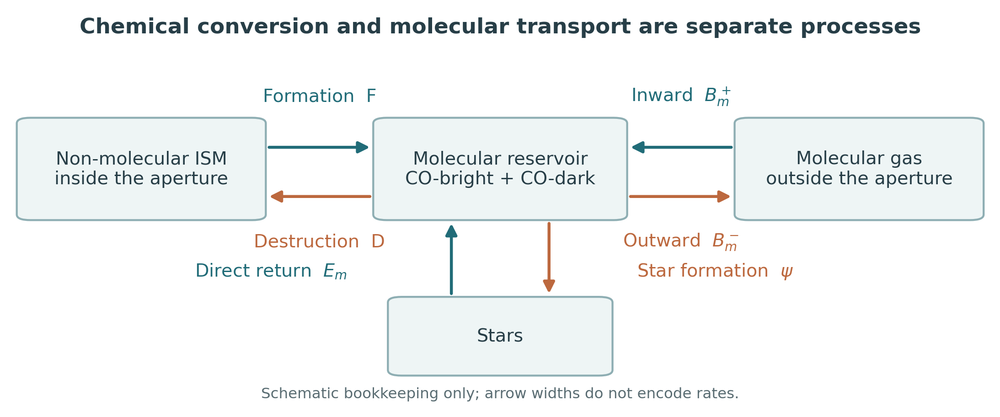
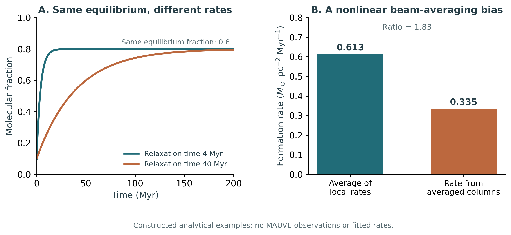

# Executive answer

Your interpretation captures an important part of the physics, but three different rates must not be given the same name. The mass of atomic gas becoming H$_2$, the replenishment of a molecular reservoir, and accretion across a GMC boundary coincide only under restrictive assumptions. For Paper I, the most defensible general interpretation is **effective supply to an explicitly defined molecular reservoir**, with the adopted removal and stellar-recycling conventions stated. If the intended new quantity is literally the mass of ISM that becomes molecular per area per time, call it the **gross H$_2$ formation rate surface density**. If destruction is subtracted, call it the **net chemical H$_2$ production rate surface density**. Neither is generically the GMC accretion rate.

The current MAUVE inventory is unusually useful: MUSE 4800--9300 Angstrom, ALMA CO(2--1), MeerKAT 21 cm, UVIT, and HST. It can support a serious first measurement programme now. It does **not**, by itself, supply a unique, approximately 100-pc map of gross H$_2$ formation and destruction. The missing information is not simply a sharper H I image: it includes an atomic-gas density or chemical-rate calibration, the destruction rate, time derivatives or an independent evolutionary clock, and phase-specific transport. Which additional observations matter depends on which rate is the science target.

The most directly relevant recent development is the formation/dissociation framework of [Bialy et al. (2025)](https://arxiv.org/html/2408.06416v2), with a nearby-cloud observational application in [Burkhart et al. (2025)](https://www.nature.com/articles/s41550-025-02541-7). It combines a column-to-density model for formation with H$_2$ fluorescence for photodissociation. This is a promising route, but it has not established a universal, beam-independent conversion law for Virgo discs.

## What I recommend measuring first

1. **A high-resolution molecular-reservoir and cloud-cycle product.** Match CO, MUSE and the relevant stellar images to their measured effective resolution. Infer CO-visible lifecycle statistics where the region separation is resolved, and measure molecular mass, recent star formation, cloud associations and candidate transport. Publish the lifecycle throughput as a proxy, not as measured H I-to-H$_2$ conversion.
2. **An H I-beam chemical-supply product.** At the actual MeerKAT resolution, combine H I and molecular columns with metallicity/radiation constraints to infer a model-conditioned gross formation rate. Explicitly vary the unresolved density distribution and column-to-density calibration. This product may be much coarser than the CO/MUSE product; that is scientifically legitimate.
3. **A small chemical-diagnostic pilot.** Obtain spatially matched, multi-line near-infrared H$_2$ spectroscopy in selected environments, together with the best available atomic-density constraints and molecular-mass calibration. The aim is to separate UV fluorescence from shocks, cosmic rays and other excitation, estimate destruction, and test whether the formation proxy transfers to MAUVE. Do not begin by promising a whole-sample direct conversion-rate map.

For incremental observations, the highest-value choices are conditional. Missing HST UV/blue bands or an obscured-star-formation tracer improve the evolutionary clock; matched CO(1--0) and selected isotopologues improve the molecular mass; targeted VLA H I improves atomic structure if the brightness sensitivity is adequate; multi-line H$_2$ spectroscopy addresses chemical destruction. No one item fixes all four problems. Section 13 ranks these choices against their actual missing parameters.

## Scope and evidence status

This is a literature-and-derivation report, not a reduction of MAUVE data or a measurement of MAUVE rates. Literature and instrument information were checked through **31 August 2026**. The user supplied the instrument inventory, but not the current per-galaxy beams, channel noise, short-spacing combinations, UV/HST filters, photometric depths or astrometric residuals. Programme-level resolutions below are therefore benchmarks, not claims about the files in hand.

Paper I is Huang et al. (2026), *MAUVE--MUSE: when metallicity follows or fights star formation -- a mass-dependent inversion in Virgo galaxies*, MNRAS 549, stag1019, [publisher](https://academic.oup.com/mnras/article/549/3/stag1019/8698768), [accessible full text](https://arxiv.org/html/2605.31412v1). Its equations are distinguished below from new derivations in this report. The literature search is targeted and source-traceable, not a claimed exhaustive systematic review. Appendix C records access limitations and the evidence standard.

# 1. Start with Paper I, not with a new label

## 1.1 The reservoir actually used in the paper

Paper I defines a molecular reservoir, $\Sigma_g$, and writes in its equations (16)--(20):

$$
\psi\equiv\Sigma_{\mathrm{SFR}}=\frac{\Sigma_g}{\tau_{\mathrm{dep}}},
\qquad
\dot\Sigma_g=\Sigma_\Phi-(1-R)\psi-\Sigma_{\mathrm{out}}.
\tag{1}
$$

$$
\Sigma_g\dot Z=p_Z\psi+(Z_\Phi-Z)\Sigma_\Phi,
\qquad p_Z\equiv y(1-R).
\tag{2}
$$

Here the dot means an actual time derivative when these equations are used as physical conservation laws. The paper uses a time-like evolution coordinate to discuss spatial fluctuations; a map of different spaxels does not, on its own, measure that derivative. The relevant supply is local replenishment from the surrounding ISM, not necessarily pristine accretion from the circumgalactic medium. [Huang et al. (2026), Section 4 and Table 3](https://arxiv.org/html/2605.31412v1#S4).

Equation (1) is a **budget equation**, not an observational definition of an independently measured flux. To infer $\Sigma_\Phi$, one must know or model the molecular-mass change, the sink, and how much stellar mass return actually reaches this reservoir on the chosen timescale. Calling $\Sigma_\Phi$ a chemical formation rate without specifying those terms is underdetermined.

For clarity, this report writes $\Sigma_m$ for molecular gas including associated helium, $L_{\mathrm{PI}}$ for whatever is included in Paper I's removal term, and $\Phi_{\mathrm{PI}}$ for its supply term. This changes notation, not the budget:

$$
\Phi_{\mathrm{PI}}\equiv
\dot\Sigma_m+(1-R)\psi+L_{\mathrm{PI}}.
\tag{3}
$$

Equation (3) is useful operationally only when its unmeasured terms and their priors accompany the estimate. It is not yet proof that the supplied mass underwent H I-to-H$_2$ chemistry inside the aperture.

## 1.2 Two quantitative details that matter for inference

Paper I's equation (21) defines $\tau_\Phi=\Sigma_g/\Sigma_\Phi$ and also writes $\tau_\Phi\leq\tau_{\mathrm{dep}}$. The inequality is an additional condition, equivalent to $\Sigma_\Phi\geq\psi$ for positive rates; it is not implied by the definition. For a stationary, zero-outflow reservoir with $R=0.4$, equation (1) gives $\Phi_{\mathrm{PI}}=0.6\psi$, hence $\tau_\Phi=1.67\tau_{\mathrm{dep}}$. An observational fit should therefore not impose the inequality as an identity.

For the equilibrium metallicity $Z_\dagger=Z_\Phi+p_Z\psi/\Phi_{\mathrm{PI}}$, differentiation at fixed $Z_\Phi,p_Z$ gives

$$
\delta Z_\dagger=(Z_\dagger-Z_\Phi)\ln(10)
\left[\delta\log_{10}\psi-\delta\log_{10}\Phi_{\mathrm{PI}}\right].
\tag{4}
$$

The factor $\ln(10)$ is needed if the relation is used quantitatively with base-10 logarithms; it does not change the qualitative sign argument in Paper I. Also, define the yield convention explicitly: $p_Z$ here is the mass of newly produced element returned per unit stellar mass formed. This avoids ambiguity between a yield per formed mass and a yield per mass locked in long-lived stars.

# 2. A definition that survives changes of scale

## 2.1 Fix the area, phase and mass convention

Choose a deprojected disc area $A$ and a vertical integration volume $V$. State the spatial resolution $\ell$, the aperture or kernel, and the temporal averaging interval $\Delta t$. Define molecular gas by hydrogen chemistry, including CO-dark H$_2$, rather than by CO detection alone. Throughout the report,

$$
M_m=2\mu_Hm_H\int_V n_{\mathrm{H_2}}\,dV,
\qquad \Sigma_m=M_m/A,\qquad \mu_H=1.36.
\tag{5}
$$

The factor 1.36 attaches helium to the hydrogen phases for consistent gas/stellar mass accounting; it is not a helium chemical reaction. For hydrogen-only quantities remove this factor everywhere, including comparison rates. Published coefficients based on 1.4 are rescaled explicitly where used. The exact adopted helium correction is much less important than avoiding inconsistent conventions.

The natural units are

$$
1\ M_\odot\,{\mathrm{yr}}^{-1}\,{\mathrm{kpc}}^{-2}
=1\ M_\odot\,{\mathrm{Myr}}^{-1}\,{\mathrm{pc}}^{-2}.
\tag{6}
$$

The numerical equality is exact because both area and time change by $10^6$. A GMC accretion rate in $M_\odot\,{\mathrm{yr}}^{-1}$ becomes a surface-density rate only after an explicit area is chosen. Dividing by the cloud footprint and dividing by a 500-pc aperture answer different questions.

## 2.2 The four processes entering the molecular budget

Let $F$ be gross chemical H$_2$ formation, $D$ molecular destruction, $B_m^+$ molecular mass entering across the control boundary, and $B_m^-$ molecular mass leaving. All are non-negative rates per area. Let $E_m$ be stellar ejecta returned **directly into the molecular reservoir**, and $\psi$ the stellar mass formation rate per area. Material returned first to another ISM phase and later forming H$_2$ enters $F$ at that later step; do not also count it in $E_m$.

For a fixed control volume the exact integrated molecular budget is

$$
\dot\Sigma_m=F-D+B_m^+-B_m^-+E_m-\psi.
\tag{7}
$$

Boundary loss includes molecular stripping or a molecular outflow through the sides or vertical caps. If these are in $B_m^-$, do not subtract them again as an additional outflow term. Destruction includes conversion out of H$_2$ into other gas phases; later we distinguish photodissociation from other destruction mechanisms.

| Quantity | Definition | What it means |
|---|---|---|
| Gross chemical formation | $F$ | Previously non-molecular hydrogen becomes H$_2$ inside $V$; repeated reformation counts again. |
| Net chemical production | $C\equiv F-D$ | Chemical gain of H$_2$ after destruction; can be negative. |
| Net molecular transport | $T_m\equiv B_m^+-B_m^-$ | Redistribution across the chosen boundary; not new chemistry. |
| Gross non-stellar supply | $\Phi_{m,+}\equiv F+B_m^+$ | Both locally formed and already-molecular incoming material. |
| Effective net replenishment | $\mathcal R_m\equiv C+T_m$ | All non-stellar molecular gains minus molecular losses. |
| Reservoir growth | $\dot\Sigma_m$ | Replenishment plus direct return minus star formation. |

In particular,

$$
\mathcal R_m=F-D+B_m^+-B_m^-
=\dot\Sigma_m+\psi-E_m.
\tag{8}
$$

The signed $\mathcal R_m$ is a useful physical quantity, but it is **not** the same as a positive supply term in a bathtub model that already subtracts losses separately. Specify which convention is used before comparing maps or timescales.

## 2.3 The exact dictionary back to Paper I

Substituting equation (7) into equation (3) gives

$$
\Phi_{\mathrm{PI}}=F+B_m^++(E_m-R\psi)
+\left[L_{\mathrm{PI}}-D-B_m^-\right].
\tag{9}
$$

This equation is the central reconciliation. It shows exactly what must be assumed for the proposed interpretations:

- If $L_{\mathrm{PI}}=D+B_m^-$ and $E_m=R\psi$, then $\Phi_{\mathrm{PI}}=F+B_m^+$. It is **gross molecular supply**, including accretion of existing molecules.
- If $L_{\mathrm{PI}}=B_m^-$ only and $E_m=R\psi$, then $\Phi_{\mathrm{PI}}=F-D+B_m^+$. It is **net chemical production plus incoming molecular transport**.
- Only if the latter transport is negligible, and the first sink convention applies, can $\Phi_{\mathrm{PI}}$ be identified with gross $F$.
- If mass return does not rapidly enter H$_2$, the correction $E_m-R\psi$ is non-zero. A conventional galaxy-integrated instantaneous recycling fraction is not automatically a correct phase-specific return fraction on a cloud timescale.

One need not discard Paper I to make this distinction. Its interpretation can be sharpened by stating what the unresolved molecular reservoir exchanges with its surroundings and which losses are absorbed into $L_{\mathrm{PI}}$. A fitted effective supply can remain useful even when its chemical and transport components cannot be separated observationally.

## 2.4 Suggested wording for a future paper

For continuity with Paper I:

> We define the effective molecular-gas supply rate surface density as the source required in the molecular-reservoir continuity equation at a stated spatial and temporal scale, after separately accounting for the adopted star-formation, recycling and molecular-loss terms. It may include both local phase conversion and transport of already-molecular gas, and is not assumed to equal either gross H$_2$ formation or GMC boundary accretion.

For the literal chemical question:

> The gross H$_2$ formation rate surface density is the mass of hydrogen, with the stated associated-helium convention, entering the molecular state per unit disc area and time. The net chemical production rate subtracts all H$_2$ destruction within the same control volume.

These are proposed definitions in this report, not quotations from the literature. Use a symbol such as $\Sigma_{\dot M,\,{\mathrm{H_2,form}}}$ for the chemical quantity in a manuscript, to avoid overloading $\Sigma_\Phi$.

## 2.5 Why a GMC accretion rate is different

For a moving cloud boundary with velocity $\boldsymbol v_b$, Reynolds transport gives

$$
\frac{dM_m}{dt}
=\int_V(q_{\mathrm{form}}-q_{\mathrm{dest}}+q_{\mathrm{ret}}-q_*)\,dV
-\oint_{\partial V}\rho_m(\boldsymbol v-\boldsymbol v_b)\cdot\boldsymbol n\,dS.
\tag{10}
$$

Accretion is the inward part of the last term, evaluated relative to the moving boundary. A cloud can gain pre-existing H$_2$ from a diffuse molecular component or a merger without any H I-to-H$_2$ conversion. Conversely, H$_2$ can form within a stationary aperture without any boundary accretion. A CO-bright boundary may move because the CO emissivity changes, not because gas crossed a material boundary. GMC segmentation, CO sensitivity and the definition of cloud identity therefore enter the answer.

The theoretical distinction is illustrated by [Jeffreson et al. (2024)](https://academic.oup.com/mnras/article/527/3/7093/7424987): simulated long-lived clouds can continually exchange short-lived molecular material. It is also consistent with the observational argument that molecular structures may fragment and reassemble while much of the gas remains molecular in the inner Milky Way. [Koda et al. (2016)](https://arxiv.org/abs/1604.01053).

# 3. What the resolved literature actually measures

The relevant literature is broader than papers using the exact phrase "gas supply rate surface density". The useful distinction is between a chemically calibrated rate, a velocity-derived boundary flux, a lifecycle statistic, and a model parameter inferred from a reservoir budget.

## 3.1 Accretion and assembly: observational examples

| Study and setting | Information and indicative result | What transfers to MAUVE; what does not |
|---|---|---|
| [Fukui et al. (2009)](https://arxiv.org/abs/0909.0382), LMC GMCs | CO/H I spatial and velocity association; inferred accretion of order $0.05\ M_\odot\,{\mathrm{yr}}^{-1}$ over approximately 10 Myr. | An atomic-envelope assembly argument. The rate uses density, motions and evolutionary assumptions; a linewidth is not a measured signed inflow speed. |
| [Braine et al. (2012)](https://arxiv.org/abs/1210.6470), far outer M33 | Approximately 10-pc CO structure; a possible inflow near $2\times10^{-4}\ M_\odot\,{\mathrm{yr}}^{-1}$ if the adopted geometry is correct. | A concrete resolved example of a conditional boundary-flow estimate. A velocity gradient alone is not unique evidence of accretion. |
| [Kirk et al. (2013)](https://arxiv.org/abs/1301.6792), Serpens South | Dense molecular-line gradients and self-absorption; approximately 30 and 130 $M_\odot\,{\mathrm{Myr}}^{-1}$ along and onto a filament in the adopted model. | Demonstrates molecular transport diagnostics on much smaller scales. It is not an H I-to-H$_2$ measurement or a full-GMC extragalactic calibration. |
| [Schneider et al. (2023)](https://www.nature.com/articles/s41550-023-01901-5), Cygnus | Velocity-resolved [C II] with atomic and molecular gas tests cloud assembly in colliding flows. | Warm atomic/CO-dark interfaces matter. [C II] is multiphase and needs excitation and component separation. |
| [Di Teodoro & Peek (2021)](https://arxiv.org/abs/2110.01618), nearby spiral discs | H I velocity modelling in 54 galaxies; typical radial motions only a few km s$^{-1}$. | A route to radial mass transport, with strong geometry requirements. Disc accretion and molecular phase conversion remain different. |

The common lesson is that "resolved" is not equivalent to "direct". These studies infer rates using geometry, tracer conversion or dynamical assumptions. The source of the clock must remain visible. The published numerical examples are not universal rates to assign to MAUVE clouds.

## 3.2 Formation theory and chemical-rate diagnostics

| Study family | Main contribution | Relevance to this project |
|---|---|---|
| [Glover & Mac Low (2007)](https://arxiv.org/abs/astro-ph/0605121) | Turbulent density structure can accelerate H$_2$ formation compared with a homogeneous mean-density estimate. | A beam-averaged H I density is not the density controlling the reaction integral. |
| [Krumholz, McKee & Tumlinson (2009)](https://arxiv.org/abs/0811.0004); [Sternberg et al. (2014)](https://arxiv.org/abs/1404.5042); [Bialy & Sternberg (2016)](https://arxiv.org/abs/1601.02608) | Shielding and formation/dissociation balance predict atomic--molecular structure. | A molecular fraction or shielding column is a state constraint; it does not automatically provide an independent absolute rate. |
| [Bialy et al. (2025)](https://arxiv.org/html/2408.06416v2) | Constructs observable estimators for formation and photodissociation, tested on simulated cloud snapshots. | The closest methodological match to the user's chemical question; requires a density closure and/or H$_2$ fluorescence. |
| [Burkhart et al. (2024)](https://arxiv.org/abs/2402.01587) | Companion simulation study connects fluorescence with cloud formation/destruction histories. | Supports an excitation-based lifecycle diagnostic, not a calibration of all Virgo environments. |
| [Burkhart et al. (2025)](https://www.nature.com/articles/s41550-025-02541-7), Eos | Applies fluorescent diagnostics to a nearby CO-dark cloud; estimates formation 0.02 and destruction 0.32 $M_\odot\,{\mathrm{pc}}^{-2}\,{\mathrm{Myr}}^{-1}$. | An observational proof of principle for net destruction, but at approximately 94 pc distance with coarse angular sampling, not a Virgo cloud-resolution demonstration. |
| [Bialy et al. (2026)](https://www.nature.com/articles/s41550-025-02771-9), B68 | JWST detection of cosmic-ray-excited H$_2$ reported in a starless core. | A concrete warning that infrared H$_2$ photons need not be UV-pumped. Only the abstract-level result is used here. |

The Eos analysis used spectral information and a model, not a broadband UV image. Its FUV mapping was heavily spatially smoothed. Angular coverage and surface brightness are a very different problem at Virgo: the existence of an H$_2$ diagnostic does not establish that a given UVIT or HST image measures it.

## 3.3 Cloud-cycle clocks and regulator inference

The statistical CO--H$\alpha$ lifecycle approach measures relative durations through the changing gas-to-star-formation flux ratio around independent emission peaks as aperture size changes. An externally calibrated tracer timescale supplies the absolute clock. It does not follow an individual cloud through time. [Kruijssen et al. (2018)](https://arxiv.org/abs/1805.00012).

[Chevance et al. (2020)](https://academic.oup.com/mnras/article/493/2/2872/5681410) found CO-visible lifetimes of roughly 10--30 Myr in nine nearby galaxies, with independent-region separations around 100--300 pc. [Kim et al. (2022)](https://academic.oup.com/mnras/article/516/2/3006/6673429) extended environmental tests to 54 galaxies and discusses the impact of CO visibility and sensitivity. These results justify a MAUVE lifecycle experiment, but not substituting a universal 20-Myr lifetime for every region.

Two related cautions are essential. The absolute reference lifetime depends on filter, stellar populations and the definition of detectable emission; its value is not the same as the long time window often attached to a UV SFR calibration. Diffuse emission should be treated consistently in lifecycle fitting, but a diffuse molecular component must not be removed from a total-reservoir mass budget merely because it was filtered out for peak identification. [Haydon et al. (2020)](https://arxiv.org/abs/1810.10897); [Hygate et al. (2019)](https://arxiv.org/abs/1810.11405).

Finally, a long depletion time can emerge from repeated cycling between star-forming and non-star-forming states. Those states are not synonymous with H$_2$ and H I. [Semenov, Kravtsov & Gnedin (2017)](https://arxiv.org/abs/1704.04239). Regulator studies likewise explain how changing supply and efficiency can create different metallicity/SFR behaviour, but their inverse use requires temporal and mixing assumptions. [Lilly et al. (2013)](https://arxiv.org/abs/1303.5059); [Wang & Lilly (2021)](https://arxiv.org/abs/2009.01935).

# 4. Deriving the chemical quantity from first principles

## 4.1 From a molecular reaction rate to a mass rate

Let $n=n_{\mathrm{HI}}+2n_{\mathrm{H_2}}$ be the number density of hydrogen nuclei in neutral gas. Define the grain-formation coefficient $R_d$ so that the **number of H$_2$ molecules formed** per volume and time is

$$
j_F=R_d\,n\,n_{\mathrm{HI}}.
\tag{11}
$$

Here $R_d$ has units cm$^3$ s$^{-1}$. Let $\Gamma$ be the destruction rate per H$_2$ molecule, in s$^{-1}$, so $j_D=\Gamma n_{\mathrm{H_2}}$. Each event creates or destroys two hydrogen nuclei in the molecular reservoir. Thus the projected mass rates are

$$
F_{\mathrm{sky}}=2\mu_Hm_H\int R_d n n_{\mathrm{HI}}\,ds,
\qquad
D_{\mathrm{sky}}=2\mu_Hm_H\int\Gamma n_{\mathrm{H_2}}\,ds.
\tag{12}
$$

This defines the desired physical property. For a thin disc with a well-defined inclination and no confusing extraplanar overlap, rates per disc area are the projected-area rates multiplied by $\cos i$. The line-of-sight reaction integral itself must still be modelled correctly; inclination correction is not a cure for several clouds superposed in one beam.

Define an H I-weighted reaction coefficient

$$
k_{\mathrm{eff}}\equiv
\frac{\int R_d n n_{\mathrm{HI}}\,ds}{N_{\mathrm{HI}}},
\qquad
F_{\mathrm{sky}}=2k_{\mathrm{eff}}\Sigma_{{\mathrm{HI,sky}}}.
\tag{13}
$$

If $R_d$ is spatially constant, $k_{\mathrm{eff}}=R_d\langle n\rangle_{\mathrm{HI}}$, where the average is weighted by atomic hydrogen, not by volume, molecular mass, or CO luminosity. Consequently, knowing $N_{\mathrm{HI}}$ alone is insufficient. The missing density is generally not $N_{\mathrm{HI}}$ divided by the angular beam diameter: the line-of-sight depth, cold fraction, density distribution and atomic/molecular correlation all matter. The framework and coefficient convention agree with [Bialy et al. (2025), equations (2), (7), (10)--(12)](https://arxiv.org/html/2408.06416v2).

## 4.2 The factor of two and the relevant formation time

For a homogeneous parcel, neglect transport and star formation, hold $n,R_d,\Gamma$ fixed, and define $x=2n_{\mathrm{H_2}}/n$. Then

$$
\frac{dx}{dt}=2R_dn(1-x)-\Gamma x.
\tag{14}
$$

The solution is

$$
x(t)=x_{\mathrm{eq}}+[x(0)-x_{\mathrm{eq}}]e^{-t/\tau_{\mathrm{chem}}},
\tag{15}
$$

$$
x_{\mathrm{eq}}=\frac{2R_dn}{2R_dn+\Gamma},
\qquad
\tau_{\mathrm{chem}}=(2R_dn+\Gamma)^{-1}.
\tag{16}
$$

The factor of two follows from the definition in equation (11). For well-shielded gas with negligible destruction and an explicitly assumed constant $R_d=3\times10^{-17}$ cm$^3$ s$^{-1}$,

$$
\tau_{\mathrm{form}}=\frac{1}{2R_dn}
=5.28\ {\mathrm{Myr}}\left(\frac{n}{100\ {\mathrm{cm}}^{-3}}\right)^{-1}.
\tag{17}
$$

This is an illustrative microphysical clock, not an adopted MAUVE cloud lifetime. Temperature-dependent sticking and grain physics change the numerical coefficient; the particular coefficient model used by Bialy et al. gives a longer shielded time near 100 K. Quoting "the H$_2$ formation time" without its rate convention, density and dust assumptions can introduce both a factor-of-two error and a much larger physical error.

Compression affects the density entering equation (14). If one follows a common gas velocity and uses the fractional abundance, the common compressive term cancels from the fraction equation, but $n$ may evolve and the constant-coefficient exponential solution no longer applies. Turbulence therefore cannot generally be represented by simply inserting one beam-averaged density into equation (17).

## 4.3 A molecular fraction is not an absolute rate

Multiply both $R_dn$ and $\Gamma$ by any positive factor $a$. The equilibrium fraction in equation (16) is unchanged, while the gross forward and reverse rates both multiply by $a$ and the relaxation time divides by $a$. A snapshot molecular fraction therefore constrains a ratio of reaction rates, not their absolute normalization, unless an independent density/radiation model fixes the coefficients.

This is why an equilibrium shielding prescription can predict $f_{\mathrm{H_2}}$ successfully without uniquely measuring $F$. Likewise, a high molecular fraction can reflect fast formation, weak destruction, inherited molecular gas, selective H I stripping, or some combination. A low H I column is not automatically evidence of a high conversion rate.

## 4.4 Summing phases removes the chemistry

In a simplified fixed volume without stellar return, let the neutral-phase equations be

$$
\dot\Sigma_m=C+T_m-\psi,
\qquad
\dot\Sigma_a=-C+T_a.
\tag{18}
$$

Adding them gives

$$
\dot\Sigma_n=T_m+T_a-\psi,
\qquad \Sigma_n=\Sigma_m+\Sigma_a.
\tag{19}
$$

The chemical transfer cancels. A total-gas continuity constraint cannot alone tell us how rapidly H I becomes H$_2$. In a closed parcel with no transport, $f=\Sigma_m/\Sigma_n$ obeys

$$
C=\Sigma_n\dot f+(1-f)\psi.
\tag{20}
$$

Even here, a measured fraction needs an actual time derivative or a justified trajectory model. With external transport, additional composition-dependent flux terms appear. These elementary cancellations explain why adding an excellent H I map helps the inventory but does not, by itself, solve the rate problem.

# 5. Identifiability: what snapshots can and cannot tell us

## 5.1 Two distinct degeneracies

First, equation (7) contains $F-D$, not $F$ and $D$ separately. The transformation

$$
F\longrightarrow F+q,\qquad D\longrightarrow D+q,
\qquad q\geq0,
\tag{21}
$$

leaves the molecular budget unchanged. Even a perfect measurement of reservoir growth cannot separate rapid chemical cycling from slow cycling without an additional diagnostic.

Second, a single image measures $\Sigma_m(t_0)$, not $\dot\Sigma_m(t_0)$. Infinitely many growing, stationary or declining histories pass through the same mass at $t_0$. UV/H$\alpha$ or stellar-age information can constrain stellar history, but conversion into a molecular-mass history needs another assumption. The two degeneracies must be addressed separately.

## 5.2 A useful hierarchy of claims

| Level | Defensible product | Required qualification |
|---|---|---|
| State measurement | CO intensity, H I brightness, line ratios, stellar fluxes; inferred masses and ages | Tracer calibration, completeness, resolution and age-model uncertainties. |
| Rate proxy | Equilibrium demand, CO-cycle throughput, density-based formation proxy | State the missing clock or physical closure explicitly. |
| Model-conditioned rate | Posterior for $\Phi_{\mathrm{PI}}$, $F$, $D$, or boundary transport | Identify likelihood information separately from priors; test alternative closures. |
| Independently constrained rate components | Multiple diagnostics separately constrain chemistry, transport and evolution | Demonstrate consistency of phase, area, epoch and spatial support. |

The objective should not be to force every pixel into the last category. A transparent model-conditioned measurement, tested against independent observations on a subset, is more useful than an apparently precise map with hidden assumptions.

## 5.3 What counts as a clock or flux constraint?

A stellar-population age scale, an independently calibrated visibility lifetime, a deprojected velocity field plus geometry, and a chemical reaction coefficient each introduce time information. Chemical fluorescence can constrain an event rate even if the macroscopic reservoir is stationary. Therefore it is too pessimistic to say that no rates can ever be estimated from single-epoch data. The correct statement is that **single-epoch state maps alone do not determine the rate; a dynamical, evolutionary or microphysical calibration is required**.

# 6. Convert the existing observations into physical inputs

## 6.1 ALMA CO(2--1): molecular mass, not formation rate

For a CO(2--1) brightness integral $W_{21}$ in K km s$^{-1}$,

$$
\Sigma_m=\alpha_{10}\frac{W_{21}}{R_{21}}\cos i,
\qquad R_{21}\equiv\frac{W_{21}}{W_{10}}.
\tag{22}
$$

$R_{21}$ is a brightness-temperature ratio, not the ratio of fluxes in Jy. $\alpha_{10}$ includes the chosen helium correction. A Milky-Way-disc reference is approximately $4.3\ M_\odot\,{\mathrm{pc}}^{-2}({\mathrm{K\,km\,s}}^{-1})^{-1}$, but it is not a universal calibration for stripped, high-pressure, low-metallicity or CO-faint gas. [Bolatto, Wolfire & Leroy (2013)](https://arxiv.org/abs/1301.3498).

CO(2--1) alone does not independently determine $R_{21}$, $\alpha_{10}$ and molecular mass. Recent matched-ALMA work finds a typical $R_{21}\simeq0.64$ with environmental variation at 1.7-kpc resolution; this is useful prior information, not a demonstrated 100-pc MAUVE calibration. [den Brok et al. (2025)](https://arxiv.org/html/2506.09125v1). An apparent correlation between inferred supply and SFR can partly arise because excitation changes with the young stellar environment.

Before calculating a reservoir mass, check beam units, spectral integration, mask completeness, extended-flux recovery and the treatment of CO non-detections. Identify whether the conversion factor represents total H$_2$ including a CO-dark envelope; adding a separate CO-dark correction to a factor that already includes it double-counts molecular gas. For cloud kinematics, work from the cube rather than interpreting a moment-2 map as an inflow speed.

## 6.2 MeerKAT 21 cm: the atomic inventory and its limitations

For optically thin 21-cm emission,

$$
N_{\mathrm{HI}}=1.823\times10^{18}
\int T_b(v)\,dv\quad {\mathrm{cm}}^{-2},
\tag{23}
$$

where $T_b$ is in K and $v$ in km s$^{-1}$. Including helium, the corresponding thin-disc surface density is approximately

$$
\Sigma_{\mathrm{HI}}=0.0199
\left[\frac{\int T_bdv}{{\mathrm{K\,km\,s}}^{-1}}\right]\cos i
\quad M_\odot\,{\mathrm{pc}}^{-2}.
\tag{24}
$$

The H I map includes warm and cold atomic material, not only the cold gas about to form molecules. In opaque cold structures, emission can underestimate the column. Absorption adds constraints but introduces spin-temperature and covering-factor information rather than eliminating all uncertainty:

$$
N_{\mathrm{HI}}=1.823\times10^{18}\int T_s(v)\tau(v)\,dv.
\tag{25}
$$

In practice the measured decrement also depends on the background continuum and its covered fraction. Sparse absorption sightlines cannot be promoted to a filled high-resolution map. [Dutta et al. (2017)](https://arxiv.org/abs/1610.05316).

Use spectral association to distinguish gas plausibly linked to the CO structures from foreground, extraplanar or kinematically separate H I. This is a probabilistic decomposition: a broad H I component can overlap a narrow CO line without being a feeding envelope. Multi-resolution H I cubes are valuable, because the cube optimized for diffuse tails is not necessarily the one best suited to the dense disc.

## 6.3 MUSE 4800--9300 Angstrom: what is available

The stated window contains H$\beta$, [O III] 4959/5007, Na I D, [O I] 6300, H$\alpha$, [N II] 6548/6583, [S II] 6716/6731, and [S III] 9069 where the data quality permits. It does **not** contain [O II] 3727, [O III] 4363, H$\gamma$, H$\delta$, the 4000-Angstrom break or [S III] 9531. Weak alternative auroral lines may exist within the window, but their detectability cannot be assumed.

For a chosen extinction curve and an assumed intrinsic Balmer ratio $r_B$,

$$
E(B-V)_{\mathrm{gas}}
=\frac{2.5}{k_\beta-k_\alpha}
\log_{10}\left(\frac{F_\alpha/F_\beta}{r_B}\right),
\qquad A_\alpha=k_\alpha E(B-V)_{\mathrm{gas}}.
\tag{26}
$$

The familiar $r_B\simeq2.86$ is a case-B, approximately $10^4$-K low-density assumption, not a value to force on noisy, shocked or absorption-contaminated spectra. Propagate the flux covariance and correct stellar Balmer absorption. Then

$$
\psi_{\mathrm{H\alpha}}=C_\alpha
\frac{4\pi D_L^2F_\alpha 10^{0.4A_\alpha}}{A_{\mathrm{disc}}}.
\tag{27}
$$

For illustration, the calibration in Kennicutt & Evans' Table 1 is $C_\alpha=10^{-41.27}\simeq5.37\times10^{-42}$ for luminosity in erg s$^{-1}$ and SFR in $M_\odot\,{\mathrm{yr}}^{-1}$, with their adopted stellar-population/IMF assumptions. Retain the MAUVE analysis convention rather than silently changing IMFs. On cloud scales, incomplete sampling of massive stars, leakage, dust and time variability limit a literal instantaneous-SFR interpretation. [Kennicutt & Evans (2012)](https://ned.ipac.caltech.edu/level5/March15/Kennicutt/Kennicutt3.html).

MUSE adds ionization classification, gas-phase abundance constraints, ionized-gas kinematics, stellar populations and extinction. Its [S II] doublet constrains **ionized-gas electron density**, not the cold-atomic density in equation (13). H$\alpha$-based ionized outflow masses require density, geometry and extinction modelling and do not measure the molecular or total multiphase loss rate.

Na I D is worth exploiting in the existing spectra for neutral-gas absorption/emission kinematics after stellar-continuum modelling. It is a foreground-weighted, abundance/ionization/depletion/covering-factor-sensitive diagnostic, not a replacement for $N_{\mathrm{HI}}$. Resolved neutral inflow/outflow work demonstrates its utility, but the source study used $R\sim7000$ and large flow velocities; do not assume MUSE separates few-km-s$^{-1}$ cloud motions. [Rupke, Thomas & Dopita (2021)](https://arxiv.org/abs/2103.08502).

## 6.4 UVIT and HST: clocks and radiation-field information

UVIT supplies an important intermediate-age star-formation constraint and a map of escaping UV radiation. HST can provide young-cluster/association morphology, age and mass constraints if the actual filter set and depths are sufficient. UV/blue coverage helps break age--extinction degeneracies; arbitrary optical imaging alone does not guarantee precise ages. The PHANGS-HST NUV/U/B/V/I design is an instructive example, not an assumption about the current MAUVE files. [Lee et al. (2022)](https://doi.org/10.3847/1538-4365/ac1fe5).

A general SFR tracer responds to history through

$$
\psi_i^{\mathrm{inferred}}(t_0)
=\int_0^\infty K_i(a;Z_*,\mathrm{IMF},\mathrm{dust})
\psi(t_0-a)\,da,
\tag{28}
$$

with a normalized response kernel only after the chosen calibration. H$\alpha$ and FUV therefore give differently weighted histories, not two direct samples of $\psi(t)$ at exact ages. Fits should forward-model actual filter response curves, stellar evolution, dust and the non-ionizing older component. Stellar drift further separates a current stellar position from the gas parcel from which it formed.

The UVIT continuum also does not directly measure the local Lyman--Werner field seen by an H$_2$ molecule: stellar spectral shape, extinction, source-cloud distances, anisotropy and intervening absorption intervene. H$_2$ pumping uses far-UV photons shortward of much standard UV imaging, whereas fluorescent emission can emerge at longer UV wavelengths. Broadband UV emission dominated by stars and scattered light is not an isolated fluorescent line measurement.

## 6.5 Keep three selections separate

Maintain a full gas-reservoir footprint, a reliable star-forming-nebula diagnostic sample, and a lifecycle peak catalogue. The gas denominator includes molecular gas without current H$\alpha$ emission and should not be truncated to an H II-only mask. Conversely, shock/AGN/DIG-dominated spectra should not be treated as ordinary star-forming metallicity measurements. Lifecycle filtering and detection thresholds need their own completeness tests. These selections answer different questions and cannot be merged into one convenient mask.

# 7. Practical estimator routes from the current data

## 7.1 Route A: the replenishment required by an equilibrium budget

Assume $\dot\Sigma_m\simeq0$, adopt Paper I's recycling convention, and write $L_{\mathrm{PI}}=\lambda\psi$. Equation (3) then becomes

$$
\widehat\Phi_{\mathrm{req}}=(1-R+\lambda)\psi.
\tag{29}
$$

This is a useful **required supply** or demand benchmark. It asks how much replenishment would keep the adopted reservoir stationary. It is not an independent observation of gas arriving, nor can its correlation with SFR be used as evidence that gas supply drives SFR: that correlation is built into the definition.

Without an independently constrained $\lambda$, show a family of scenarios. If molecular destruction is counted in $L_{\mathrm{PI}}$, its magnitude may greatly exceed a modest galaxy-scale wind-loading prescription; cloud dissociation and an outflow are different sinks. Setting $\lambda=0$ gives a specific closed, stationary benchmark, not a universal lower bound in a declining or externally stripped reservoir.

**Available now:** MUSE/UV/HST constrain $\psi$; ALMA constrains $\tau_{\mathrm{dep}}=\Sigma_m/\psi$. **Not supplied by these alone:** stationarity, total molecular losses and phase-specific recycling.

## 7.2 Route B: use a recent SFH with an explicit gas-response law

From $\Sigma_m(t)=\tau_{\mathrm{dep}}(t)\psi(t)$,

$$
\dot\Sigma_m=\tau_{\mathrm{dep}}\dot\psi+\psi\dot\tau_{\mathrm{dep}}.
\tag{30}
$$

Therefore

$$
\Phi_{\mathrm{PI}}=(1-R+\lambda)\psi
+\tau_{\mathrm{dep}}\dot\psi+\psi\dot\tau_{\mathrm{dep}}.
\tag{31}
$$

The derivation is straightforward; the inference is not. Current $\tau_{\mathrm{dep}}$ does not establish its value throughout the recent history. If pressure, turbulence, feedback or CO excitation changes, the last term can be important. Using UV/H$\alpha$ to obtain $\dot\psi$ also requires a parametric or regularized SFH model because of equation (28).

For an exponential rise with timescale $t_{\mathrm{rise}}$ and constant depletion time, the derivative contribution is $\tau_{\mathrm{dep}}\psi/t_{\mathrm{rise}}$. A 1-Gyr depletion time and a 100-Myr rise give ten times the current SFR, even before the sink terms. This is a strong, testable gas-response assumption, not a small correction. A rapid decline can produce a negative inferred $\Phi_{\mathrm{PI}}$; that can signal unmodelled losses or changing efficiency rather than a physically negative gross supply. Do not hide such outcomes by clipping before interpretation.

Use this route for posterior constraints in sufficiently large apertures with usable recent SFHs, and compare alternative $\tau_{\mathrm{dep}}(t)$ models. Do not interpret neighbouring spaxels as a time sequence without a justified transport or evolutionary mapping.

## 7.3 Route C: CO-visible lifecycle throughput

Let clouds enter a CO-selected phase at a number rate $\nu$ per area and time, remain visible for $t_{\mathrm{CO}}$, and have molecular mass history $M(a)$ during that phase. For a stationary population,

$$
\Sigma_{m,\mathrm{compact}}
=\nu\int_0^{t_{\mathrm{CO}}}M(a)\,da
=\nu\overline M_{\mathrm{CO}}t_{\mathrm{CO}}.
\tag{32}
$$

Thus the simple observable proxy is

$$
\widehat\Phi_{\mathrm{CO,cycle}}
\equiv\frac{f_{\mathrm{compact}}\Sigma_m}{t_{\mathrm{CO}}}
=\nu\overline M_{\mathrm{CO}}.
\tag{33}
$$

This is a **CO-phase throughput proxy**. The molecular mass carried into the phase at entry is instead

$$
\Phi_{\mathrm{entry}}=\nu M_{\mathrm{entry}}
=\widehat\Phi_{\mathrm{CO,cycle}}\frac{M_{\mathrm{entry}}}{\overline M_{\mathrm{CO}}}.
\tag{34}
$$

Continuous accretion during the visible phase contributes additional gross supply. An H$_2$ parcel may also be destroyed and reformed several times before the CO-selected structure disappears. Consequently, $t_{\mathrm{CO}}$ cannot simply be identified with a molecular mass-residence time, and equation (33) is neither automatically $F$ nor a general upper or lower bound on $F$.

A mass-throughput relation $\Phi=\Sigma/\langle t_{\mathrm{res}}\rangle$ is valid for a stationary mass flow when the residence-time weighting and entry/exit definitions are appropriate. The missing step is observationally establishing that the fitted visibility lifetime is that residence time. Under the extra one-entry/one-conversion assumption, a new-molecule fraction could connect $\Phi_{\mathrm{entry}}$ to formation; that fraction is another physical constraint, not an output of the CO/H$\alpha$ peak-counting method.

**Implementation with current MAUVE:** use ALMA and MUSE to fit population lifecycle parameters in environments with sufficient independent regions, then use HST associations and UVIT constraints on recent SFH as consistency checks. Measure compact/diffuse fractions consistently. Forward-model the actual beam, sensitivity and peak separation. Approximately 100-pc resolution may be sufficient in some environments and insufficient in others; one resolution threshold cannot be declared for every target in advance.

## 7.4 Route D: molecular boundary transport from kinematics

For a thin disc, let $v_R>0$ point outward. Define inward radial mass flow by

$$
\dot M_{\mathrm{in}}(R)
=-R\int_0^{2\pi}\Sigma_m(R,\phi)v_R(R,\phi)\,d\phi.
\tag{35}
$$

Only in an axisymmetric approximation does this reduce to $-2\pi R\Sigma_mv_R$. The molecular transport contribution to an annulus is

$$
T_{m,\mathrm{ann}}
=\frac{\dot M_{\mathrm{in}}(R_{\mathrm{out}})-\dot M_{\mathrm{in}}(R_{\mathrm{in}})}
{\pi(R_{\mathrm{out}}^2-R_{\mathrm{in}}^2)}.
\tag{36}
$$

Locally the same statement is $T_m=-\boldsymbol\nabla\cdot(\Sigma_m\boldsymbol v_m)$, with vertical terms handled separately. Dividing the inward flux through one ring by an arbitrary area is not a local source term. In particular, large through-flow can produce little accumulation if entry and exit nearly balance.

The measured velocity is a projection:

$$
v_{\mathrm{los}}-v_{\mathrm{sys}}
=\sin i\,[v_\phi\cos\phi+v_R\sin\phi]+v_z\cos i.
\tag{37}
$$

Warps, streaming, inclination, non-axisymmetric geometry and vertical motion can imitate radial flow. Fit the cube with a physically appropriate geometry, propagate uncertainties in orientation, and distinguish turbulence from coherent transport. A linewidth or a CO--H$\alpha$ velocity difference is not sufficient. Molecular and ionized gas need not share the same flow.

In a stationary rotating pattern, replace $\boldsymbol v$ with $\boldsymbol u=\boldsymbol v-\boldsymbol\Omega_p\times\boldsymbol r$. If the pattern really is steady, then

$$
C=\boldsymbol\nabla\cdot(\Sigma_m\boldsymbol u)
+\psi-E_m-S_{z,m},
\tag{38}
$$

where $S_{z,m}$ is net molecular supply through the vertical boundaries. This offers a conditional chemical residual from continuity. Time-dependent ram-pressure structures need not admit that steady-pattern approximation. ALMA/MUSE kinematics can identify suitable test regions; they do not establish steadiness automatically.

# 8. The chemical route: estimate formation and destruction separately

## 8.1 Formation with a density constraint

The cleanest interpretation of equation (13) is to measure $N_{\mathrm{HI}}$ and constrain $k_{\mathrm{eff}}$. If $R_d$ is fixed by a dust/temperature model, the latter means estimating $\langle n\rangle_{\mathrm{HI}}$. Useful constraints can include H I emission plus absorption, cloud geometry, a multiphase thermal-pressure model, or atomic/PDR spectroscopy. Each samples different gas and requires a likelihood for the tracer selection.

A two-component illustration is

$$
k_{\mathrm{eff}}
\simeq f_{\mathrm{CNM}}R_{d,c}n_c
+(1-f_{\mathrm{CNM}})R_{d,w}n_w.
\tag{39}
$$

Here $f_{\mathrm{CNM}}$ is the fraction of the atomic column in the cold neutral medium, not the molecular fraction. Even if warm gas dominates the atomic mass, dense cold structures can dominate the formation integral. A molecular dense-gas tracer such as HCN is valuable for star-forming gas but does not directly measure the atomic density appearing here. Similarly, replacing it with MUSE's [S II] electron density is physically incorrect.

If only a disc scale-height estimate is available, one may construct $\overline n\simeq\Sigma_n/(2h\mu_Hm_H)$ and introduce an explicit atomic-weighted clumping factor. This is a prediction under hydrostatic and substructure assumptions, especially uncertain in a disturbed disc, not a density measurement. Treat it as an alternative model to test, not a hidden default.

## 8.2 A published column-only closure: promising but conditional

Bialy et al. calibrate a relation $k_{\mathrm{eff}}\simeq k_0N_{21}^{\alpha}$ in their cloud simulations, with $k_0=2\times10^{-16}$ s$^{-1}$, $\alpha=1.3$, $N=N_{\mathrm{HI}}+2N_{\mathrm{H_2}}$ and $N_{21}=N/(10^{21}\,{\mathrm{cm}}^{-2})$. Their rounded formation estimator is

$$
\widehat F_{\mathrm{sky}}
\simeq0.14\left(\frac{\mu_H}{1.4}\right)
f_{\mathrm{HI}}N_{21}^{2.3}
\quad M_\odot\,{\mathrm{pc}}^{-2}\,{\mathrm{Myr}}^{-1},
\qquad f_{\mathrm{HI}}=\frac{N_{\mathrm{HI}}}{N}.
\tag{40}
$$

The exponent follows directly by inserting $N_{\mathrm{HI}}=f_{\mathrm{HI}}N$ into equation (13). The useful point is that a rate normalization is supplied by a simulation-derived density relation. This is not a new empirical law measured across external galaxies. The calibration was tested for a restricted solar-neighbourhood cloud model; its reported mean formation and destruction errors, approximately 27% and 31%, are internal simulation-validation results, not promised Virgo uncertainties. [Bialy et al. (2025), Section 2, Table 1 and validation discussion](https://arxiv.org/html/2408.06416v2).

**How to use it now:** construct matched H I and molecular columns, include molecular-mass/opacity uncertainties, and evaluate equation (40) as one explicit closure. Then compare it with a density-based model, vary its normalization and slope, and test beam degradation. Merely multiplying the coefficient by metallicity does not transfer the associated density, dust and shielding correlations to ram-pressure-affected gas. Label the result $\widehat F\,|\,\mathcal M_{\mathrm{density}}$, not "observed formation rate" without qualification.

**How not to use it:** insert a coarse H I value into each high-resolution CO pixel, regard the repeated H I value as a local measurement, and report hundreds of independent precise formation rates. Section 10 shows why this is not justified.

## 8.3 Photodissociation from FUV fluorescence

Let $p$ be the probability that an electronic pumping event dissociates H$_2$; an illustrative value in the cited framework is $p\simeq0.15$. Surviving excitations produce fluorescent photons. If $I_{\mathrm{FUV}}$ is the total relevant emergent fluorescent photon intensity in photons cm$^{-2}$ s$^{-1}$ sr$^{-1}$, and a uniform-mixing attenuation correction is adopted, event counting gives

$$
\widehat D_{\mathrm{photo,sky}}
=2\mu_Hm_H\frac{4\pi p}{1-p}
I_{\mathrm{FUV}}\frac{\tau}{1-e^{-\tau}}.
\tag{41}
$$

The $4\pi$ converts an isotropic intensity into an event rate per projected area; $p/(1-p)$ changes surviving radiative events into dissociations. The attenuation correction is geometrical and model-dependent. Using the particular $\tau\simeq1.9N_{21}$ prescription and $I_5=I_{\mathrm{FUV}}/10^5$, the published rounded form becomes

$$
\widehat D_{\mathrm{photo,sky}}
\simeq0.30\left(\frac{\mu_H}{1.4}\right)
I_5\frac{N_{21}}{1-e^{-1.9N_{21}}}
\quad M_\odot\,{\mathrm{pc}}^{-2}\,{\mathrm{Myr}}^{-1}.
\tag{42}
$$

These coefficients are from the fluorescent-event framework, with only the helium rescaling changed here. The formulas assume that the measured light is the relevant H$_2$ fluorescence; stellar continuum, atomic emission and dust-scattered light must first be removed. Missing bands require a model-dependent correction to the total photon count. [Bialy et al. (2025), equation (9)](https://arxiv.org/html/2408.06416v2).

The Eos demonstration used FUV spectroscopy to identify molecular features, not ordinary UV photometry. Your current UVIT/HST imaging can locate illuminating stars and constrain attenuation, but it cannot generally provide $I_{\mathrm{FUV}}$ in equation (41). Targeted FUV spectroscopy may be possible along selected sightlines; a faint, wide-area Virgo fluorescence map is a separate feasibility problem.

## 8.4 Infrared H$_2$: a plausible pilot with an excitation problem

The surviving electronic excitation also leads to an infrared cascade. If its mean photon yield is $\mathcal N_{\mathrm{IR}}$, the corresponding ideal photon-counting relation is

$$
\widehat D_{\mathrm{photo,sky}}
=2\mu_Hm_H\frac{4\pi p}{(1-p)\mathcal N_{\mathrm{IR}}}
I_{\mathrm{IR}}^{\mathrm{UV}},
\tag{43}
$$

where $I_{\mathrm{IR}}^{\mathrm{UV}}$ includes **only the UV-pumped contribution**. For the approximate $\mathcal N_{\mathrm{IR}}\simeq3.6$ model, the reference coefficient is $0.044(\mu_H/1.4)I_5^{\mathrm{IR}}$ in the same surface-rate units. Infrared extinction, missing cascade lines and density-dependent collisional redistribution must be considered. This is a route to photodissociation, not a statement that every warm-H$_2$ photon measures either formation or destruction.

In an observed subset of lines, convert energy into photon intensity before applying the relation:

$$
I_{\mathrm{IR}}^{\mathrm{UV}}
=\frac{1}{\eta_{\mathrm{lines}}}
\sum_j\frac{I_j^{\mathrm{UV,corrected}}}{hc/\lambda_j}.
\tag{44}
$$

$\eta_{\mathrm{lines}}$ is the fraction of the model's cascade photons represented by the observed lines. It is not an arbitrary bolometric factor. Infer it from an excitation model consistent with the measured line set and dust correction. H$_2$ 1--0 S(1) at 2.1218 micrometres and 2--1 S(1) at 2.2477 micrometres are useful, but their ratio alone does not uniquely separate a dense UV-illuminated PDR from shocks. [Lee et al. (2005), Sections 3.2.1--3.2.2](https://academic.oup.com/mnras/article/361/4/1273/1117121).

Additional vibrational/rotational lines, recombination lines, [Fe II] where feasible, morphology and gas kinematics help test the excitation mixture. Cosmic-ray or X-ray excitation and formation pumping introduce further components. A single 2.12-micrometre image, or a warm-H$_2$ mass from a rotational diagram, is not a unique measurement of $D_{\mathrm{photo}}$.

The total destruction in equation (7) is

$$
D=D_{\mathrm{photo}}+D_{\mathrm{CR}}+D_{\mathrm{coll}}+D_{\mathrm{other}}.
\tag{45}
$$

Only after other channels are negligible or constrained can $F-D_{\mathrm{photo}}$ be called net chemical production. This distinction is particularly important around shocks, nuclei or stripped interfaces. Current data may constrain $F$ under a density model without any new infrared observations; the infrared pilot adds a test of destruction and the interpretation of the net rate.

# 9. Can metallicity supply the missing rate?

## 9.1 The inversion and its assumptions

Starting from equation (2), and retaining its instantaneous mixing, yield and equal-composition-sink assumptions,

$$
\Phi_{\mathrm{PI}}
=\frac{p_Z\psi-\Sigma_m\dot Z}{Z-Z_\Phi}.
\tag{46}
$$

This looks powerful because MUSE measures emission-line abundance diagnostics. However, an abundance snapshot provides neither $\dot Z$ nor the abundance $Z_\Phi$ of gas joining the molecular reservoir. The equation constrains a **metallicity contrast times a supply rate**, not the rate alone. If locally converted H I has nearly the same abundance as the molecular material, then $Z-Z_\Phi$ is small and the inversion is poorly conditioned. Phase conversion within a chemically homogeneous ISM does not, by itself, dilute the gas.

The abundance used in conservation is a linear mass fraction. If $z=12+\log_{10}({\mathrm{O/H}})$ and the hydrogen mass fraction is $X_H$, then approximately

$$
Z_O=16X_H\,10^{z-12},
\qquad
\dot Z_O=\ln(10)Z_O\dot z.
\tag{47}
$$

For the adopted helium convention $X_H\simeq1/1.36$, with a small correction if the metal mass is retained explicitly. Do not insert a value such as 8.6 directly into a mass-conservation equation. Gas-phase oxygen depletion, relative abundances and yield choices must use compatible definitions.

## 9.2 What changes outside the simple bathtub approximation?

MUSE abundances are luminosity-weighted measurements in ionized gas, not direct mass-weighted measurements of every molecular and atomic component. Metal-rich stellar ejecta may not cool and mix into the star-forming molecular gas on the adopted timescale. Transport and diffusion also change local abundance. In a more general abundance equation, each incoming component contributes $(Z_k-Z)S_k$; a selectively enriched outflow contributes $(Z-Z_{\mathrm{loss}})L$, and unresolved mixing adds a spatial transport term.

An apparent metallicity dilution can therefore constrain an effective exchange term under a model without isolating chemical H$_2$ formation. Conversely, no dilution does not imply no molecular supply. This is a key physical reason not to treat the resolved metallicity--SFR relation as a direct calibration of $F$.

## 9.3 Recommended role in MAUVE

Use metallicity as an **independent consistency test** of a supply scenario and as a constraint on dust/CO conversion factors, with calibration systematics propagated. If equation (46) is fitted, show explicit priors on $Z_\Phi$, $p_Z$, $\dot Z$, mixing and sinks. Report the ill-conditioned regions and prior sensitivity. Do not first construct $\Phi$ from SFR/metallicity and then use its correlation with the same quantities as independent confirmation of Paper I's mechanism.

# 10. Spatial resolution is part of the definition

## 10.1 Comparable instruments do not guarantee comparable products

At an illustrative Virgo distance of 16.5 Mpc,

$$
\ell=4.848\,D_{\mathrm{Mpc}}\theta_{\mathrm{arcsec}}\ {\mathrm{pc}}
\simeq80\theta_{\mathrm{arcsec}}\ {\mathrm{pc}}.
\tag{48}
$$

Use each adopted galaxy distance in an actual analysis. Inclination stretches the in-plane footprint; a circular sky beam is not generally circular in the disc. The following values are deliberately labelled as programme or instrument benchmarks.

| Data or capability | Angular / physical benchmark | What must be checked in MAUVE |
|---|---|---|
| Paper I MUSE release | 0.2-arcsec sampling; typical approximately 1-arcsec seeing, about 80 pc | Wavelength-dependent PSF, mosaics, continuum bins and emission-line support; 16-pc pixels are not 16-pc resolution. |
| MAUVE programme MUSE | Approximately 100--200 pc | Programme description, not a common measured PSF for every target. |
| New MAUVE-ALMA CO | Programme design approximately 50 pc | Actual 12-m/ACA/short-spacing combination, cube beam, noise and extended-flux recovery. |
| VERTICO CO(2--1) | Median approximately 8 arcsec, 640 pc | A distinct, lower-resolution product; do not call it the new 50-pc CO data. |
| MeerKAT benchmark, finest MHONGOOSE cube | 8.2 by 7.1 arcsec, approximately 656 by 568 pc | Actual MAUVE weighting, beam and achieved noise; not a 100-pc H I map. |
| UVIT FUV | Typical early PSFs approximately 1.3--1.5 arcsec, 104--120 pc | Filter, date, measured PSF, backgrounds and sensitivity; NUV coverage cannot be assumed. |
| HST optical example | WFC3 model PSF core around 0.07 arcsec before pixelation | Actual camera, filter, pixelated/drizzled PSF, depth and crowding; fine pixels do not guarantee reliable ages. |
| VLA A/B nominal L-band | 1.3 / 4.3 arcsec for uniform full synthesis at 1.5 GHz | Natural weighting is coarser; 21-cm brightness sensitivity and short spacings set practical feasibility. |

Sources: [Huang et al. (2026), Section 2.1](https://arxiv.org/html/2605.31412v1#S2.SS1); [Catinella et al. (2025)](https://www.eso.org/sci/publications/messenger/archive/no.195-sep25/messenger-no195-15-18.pdf); [Brown et al. (2021)](https://doi.org/10.3847/1538-4365/ac28f5); [de Blok et al. (2024), Section 5.6, Standard resolutions table](https://arxiv.org/html/2404.01774v2#S5.SS6); [Ghosh et al. (2021)](https://arxiv.org/abs/2012.13525); [WFC3 handbook](https://hst-docs.stsci.edu/wfc3ihb/chapter-6-uvis-imaging-with-wfc3/6-6-uvis-optical-performance); [NRAO resolution documentation](https://science.nrao.edu/facilities/vla/docs/manuals/oss/performance/resolution).

PHANGS demonstrates that arcsecond CO/MUSE comparisons and cloud-cycle work are achievable in nearby galaxies, but its delivered data and AO performance must not be substituted for MAUVE metadata. Existing Virgo H I comparisons such as VIVA are commonly around 15 arcsec, and THINGS demonstrates approximately 6-arcsec H I imaging in other nearby galaxies, not a ready-made sharper Virgo map. [Leroy et al. (2021), official PHANGS-ALMA release](https://almascience.eso.org/alma-data/lp/PHANGS); [Chung et al. (2009)](https://arxiv.org/abs/0909.0781); [Walter et al. (2008)](https://uhra.herts.ac.uk/id/eprint/1324/1/901040.pdf).

## 10.2 Why a sharper H I beam is expensive

For a Gaussian beam and Rayleigh--Jeans brightness,

$$
T_b[{\mathrm{K}}]=
\frac{1.222\times10^6S_\nu[{\mathrm{Jy\,beam}}^{-1}]}
{\nu_{\mathrm{GHz}}^2\theta_{\mathrm{maj}}\theta_{\mathrm{min}}}.
\tag{49}
$$

At fixed flux-density noise, shrinking a circular beam from 8 to 1 arcsec worsens brightness-temperature and column-density sensitivity by a factor 64. If thermal noise alone could be reduced with integration time and all other properties were fixed, recovering the same brightness sensitivity would require $64^2=4096$ times the integration. This is a scaling illustration, not an exposure forecast: a different array configuration also changes baseline density, weighting and recoverable structure. [NRAO brightness conversion](https://casaguides.nrao.edu/index.php?title=VLA_CASA_Imaging-CASA5.7.0).

For independent channels of width $\delta v$ integrated over $W$, a useful preflight is

$$
\sigma_{N_{\mathrm{HI}}}
\simeq1.823\times10^{18}\sigma_{T_b}
\sqrt{W\delta v}\quad {\mathrm{cm}}^{-2}.
\tag{50}
$$

Spectral smoothing and correlated channels require the actual covariance instead. The MHONGOOSE finest-beam example has rms 0.219 mJy beam$^{-1}$ per 1.4 km s$^{-1}$ and a quoted three-sigma threshold $10^{19.77}\simeq5.9\times10^{19}$ cm$^{-2}$ over 16 km s$^{-1}$. Its 34.4 by 25.4 arcsec cube reaches $10^{18.44}$ under the same quoted significance/width convention. Those are different delivered products, not simultaneously achievable sensitivity and resolution for one beam. [de Blok et al. (2024)](https://arxiv.org/html/2404.01774v2#S5.SS6).

MeerKAT's approximately 7.7-km maximum baseline cannot generate a genuine 1-arcsec 21-cm image merely by longer integration or regridding. A VLA high-resolution programme may improve the dense-disc H I, but should be designed around a target $N_{\mathrm{HI}}$, linewidth and cold-gas filling factor. Combining compatible short-baseline information can recover extended structure; matched spectral frames, flux scales and adequate overlapping spatial frequencies must be verified.

## 10.3 Two defensible analysis scales

**Fine-scale product:** use a measured common CO/MUSE resolution, enlarged to the relevant UV resolution where UV colours enter. Retain HST at its native resolution for source identification and completeness, then forward-model or aggregate the source information to the analysis aperture. This product supports molecular structure, stellar associations and population lifecycle inference.

**Atomic-inclusive product:** smooth/reproject all required inputs to the actual H I beam or use apertures at least as large. Infer $f_{\mathrm{H_2}}$ and a density-conditioned formation proxy there. Multiple CO clouds may lie in each H I element; that is a physical statement about the resolution, not a failure of the experiment.

Convolve line fluxes before constructing nonlinear ratios or metallicities when an integrated-aperture diagnostic is intended. Averaging precomputed abundance values is not generally the same operation. Likewise, report the molecular conversion-factor weighting and missing-flux treatment, not only an angular pixel grid.

## 10.4 Nonlinear chemistry does not commute with beam averaging

Equation (40) is proportional to $N_{\mathrm{HI}}N^{1.3}$. A beam average therefore requires

$$
\langle F\rangle_\ell\ \propto
\langle N_{\mathrm{HI}}N^{1.3}\rangle_\ell,
\quad\text{not generally}\quad
\langle N_{\mathrm{HI}}\rangle_\ell\langle N\rangle_\ell^{1.3}.
\tag{51}
$$

Define the unresolved-structure correction explicitly:

$$
\mathcal C_\ell=
\frac{\langle N_{\mathrm{HI}}N^{1.3}\rangle_\ell}
{\langle N_{\mathrm{HI}}\rangle_\ell\langle N\rangle_\ell^{1.3}}.
\tag{52}
$$

This correction depends on sub-beam structure and the H I--total-column covariance. For fixed atomic fraction, the convex exponent gives an upward clumping correction; with variable fractions, one cannot prescribe a universal numerical correction. Degrading simulated clouds or better-resolved nearby analogues to the MAUVE beam is a concrete calibration test. An empirical cloud-scale power law should not be assumed invariant after averaging over several hundred parsecs.

## 10.5 Multi-resolution inference without invented H I detail

An alternative to degrading every map is a hierarchical forward model. For schematic latent fields $\Sigma_a,\Sigma_m$,

$$
d_{\mathrm{HI}}=P_{\mathrm{HI}}[\Sigma_a]+\epsilon_{\mathrm{HI}},
\qquad
d_{\mathrm{CO}}=P_{\mathrm{CO}}[R_{21}\Sigma_m/\alpha_{10}]
+\epsilon_{\mathrm{CO}}.
\tag{53}
$$

The operators include the appropriate conversion to measured units, PSF/beam, sampling and, where relevant, the interferometric response. Priors can link fine-scale atomic gas to pressure, dust, CO envelopes or morphology. The likelihood must still reproduce the observed coarse H I data. Fine-scale modes that the H I beam does not constrain remain prior-dependent; a smooth posterior map is not evidence that those modes were observed.

A constant H I value inside each coarse beam can be used as an explicitly declared model, with strongly correlated uncertainty. It must not be presented as multiple independent fine-scale measurements. Assess the result by changing the sub-beam prior and comparing held-out coarse-beam predictions. Publish the prior sensitivity and effective resolution of the derived rate, not just the grid spacing.

# 11. If resolved H I is missing, what can substitute?

## 11.1 Dust and extinction: useful, but not equivalent to H I

Dust emission can constrain total gas through a dust-to-gas ratio, $\mathcal D$, and an assumed emissivity/temperature distribution. A residual atomic estimate would be

$$
\Sigma_{\mathrm{HI}}^{\mathrm{residual}}
=\frac{\Sigma_d}{\mathcal D}-\Sigma_m-\Sigma_{\mathrm{HII}},
\tag{54}
$$

with compatible helium conventions and spatial support. The subtraction becomes ill-conditioned where molecular gas dominates, because small errors in total gas or molecular mass can exceed the atomic residual. If the same dust data calibrated $\alpha_{\mathrm{CO}}$, the resulting residual is not an independent H I validation. Dust-to-gas ratio, temperature mixtures, CO-dark H$_2$ and dust destruction/stripping introduce environmental systematics.

Archival HeViCS is valuable but does not solve the angular-resolution mismatch: representative delivered PACS 100/160-micrometre beams are approximately 9/13 arcsec and SPIRE 250/350/500 beams approximately 18/25/37 arcsec. Multi-band dust-mass fits often inherit the coarsest relevant beam. [Davies et al. (2012)](https://arxiv.org/abs/1110.2869); [IRSA HeViCS archive](https://irsa.ipac.caltech.edu/data/Herschel/HeVICS/overview.html).

MUSE Balmer attenuation and HST differential extinction can add high-resolution structure constraints, but they sample the sightlines of detected stars or H II regions. Mixed geometry and obscured-source selection prevent a simple conversion into total column. The EDGE--CALIFA extinction/gas calibration is particularly important to read carefully: its resolved total-gas construction included an assumed constant H I contribution, so it does not demonstrate an independent resolved H I recovery. [Barrera-Ballesteros et al. (2020)](https://arxiv.org/abs/1911.09677).

High-resolution millimetre continuum could constrain cold dust in bright regions, but it needs sensitivity, temperature and opacity constraints and checks for other continuum/line contributions. A single ALMA continuum band is not automatically a precise total-gas map. Mid-infrared PAH or warm-dust imaging mainly adds dust-heating and star-formation information rather than a direct cold-gas mass.

## 11.2 Other neutral/atomic tracers

| Alternative | What it can add | Why it does not replace a resolved H I mass map |
|---|---|---|
| Na I D in existing MUSE | Selected neutral-flow geometry and velocities, dust association | Stellar absorption, foreground selection, ionization/depletion and covering factor; limited spectral resolution for small cloud velocities. |
| 21-cm absorption | Cold gas, opacity and spin-temperature constraints along suitable radio backgrounds | Sparse and biased sightlines; needs background sources and emission/geometry modelling. |
| [C II] 158 micrometres with ancillary lines | Atomic/PDR/CO-dark interface conditions and velocities | Emission arises from several phases and depends on density/temperature; local 158-micrometre emission is not accessible with ordinary ALMA or JWST modes. |
| [C I] 492/809 GHz and CO isotopologues | Alternative molecular-gas/excitation constraints | Neutral carbon is not atomic hydrogen; abundances, excitation and sensitivities matter. |
| Stellar extinction or UV attenuation | Fine-scale dust geometry and shielding information | Detected-source sightlines and attenuation laws do not uniquely determine full atomic columns. |
| Pressure/shielding prescriptions | A prior for phase fractions or cold-atomic density | The result is a model prediction; it cannot independently test the same prescription used to infer it. |

For [C II], multiphase decomposition is demonstrated in [Pineda et al. (2013)](https://arxiv.org/abs/1304.7770). For [C I], the relevant comparison is with molecular-gas tracing, not with H I replacement. [Jiao et al. (2019)](https://arxiv.org/abs/1906.05671). The alternatives are best used to constrain the missing terms in equations (13), (45) and (54), not relabelled as direct H I measurements.

## 11.3 Is H I essential for every version of the problem?

No. A molecular-reservoir demand estimate, CO lifecycle analysis, or molecular boundary-flow estimate can proceed without a fine-scale H I map. They answer different versions of the supply question. For a physical, gross **H I-to-H$_2$** rate, however, an atomic reservoir/density constraint must enter somewhere: measured H I, an alternative calibrated atomic constraint, or a clearly identified prior. Removing the H I observation does not remove the atomic physics.

# 12. An executable MAUVE inference strategy

## 12.1 Stage 0: audit what actually exists

Build a per-galaxy metadata table before requesting more telescope time. Record distance, inclination, footprints, PSF/beam versus wavelength, channel resolution, rms in a stated channel width, primary-beam correction, short-spacing recovery, astrometric residuals and useful surface-brightness limits. For HST/UVIT record exact filters, observation dates, depths, masks and point-source/extended-source PSFs. For MUSE record both the PSF and the support of any Voronoi-bin-derived quantities. This report has not inspected those data products.

Choose common fine and H I-inclusive resolutions from that table, not from instrument names. Select an initial sample with robust overlaps and enough independent regions to test the method. There is no basis in the current information to promise a uniform number of usable galaxies or clouds.

## 12.2 Stage 1: build calibrated state maps and clocks

Construct $\Sigma_m$, $\Sigma_{\mathrm{HI}}$, $\psi$, abundance constraints and recent-age likelihoods with shared calibration parameters retained. Obtain two CO products where possible: the full-flux reservoir map and the statistically characterized compact-cloud/peak catalogue. Use HST for association/cluster classification with completeness and extinction modelling; include unbound and diffuse young populations where the question requires total SFR rather than bound-cluster formation.

Fit lifecycle parameters only where injection/recovery tests show that the measured beam, peak separation and sensitivity support them. Use UV/H$\alpha$ and HST ages to test stationarity and visibility assumptions. Do not use a cluster age as the time since its associated H$_2$ first formed.

## 12.3 Stage 2: publish distinct rate products

At minimum keep the following products separately named:

- $\Phi_{\mathrm{req}}$: equilibrium replenishment demand with a grid of loss/recycling assumptions.
- $\widehat\Phi_{\mathrm{CO,cycle}}$: CO-visible lifecycle throughput proxy with population-scale support.
- $\widehat F\,|\,\mathcal M_{\mathrm{density}}$: gross formation posterior at the H I-inclusive beam, conditional on density and tracer models.
- $T_m$: selected boundary-transport or convergence constraints only where deprojection is defensible.

If fluorescent spectroscopy is obtained, add $D_{\mathrm{photo}}$ and then $C=F-D$ only with the remaining destruction channels treated. Compare these results through the full budget rather than forcing every estimator to represent $\Phi_{\mathrm{PI}}$.

## 12.4 Stage 3: require a posterior budget and consistency tests

For every environment/aperture, test

$$
\Delta_{\mathrm{budget}}
\equiv\dot\Sigma_m-[F-D+T_m+E_m-\psi].
\tag{55}
$$

If the derivative is unconstrained, do not report this as a passed conservation test; instead infer the derivative required by the measured/assumed rates and ask whether it is compatible with the stellar-history and gas-response model. A chemically inferred positive net rate can coexist with declining molecular mass if boundary losses are larger.

Useful falsification tests are:

1. **Beam test:** degrade the fine maps or simulated analogues and repeat the nonlinear rate inference. Record systematic changes with $\ell$.
2. **Calibration test:** vary $R_{21}$, $\alpha_{\mathrm{CO}}$, dust-to-gas ratio, H I opacity and density priors jointly. Preserve their covariance with SFR and metallicity.
3. **Excitation test:** fit alternative UV/shock/CR mixtures to any H$_2$ spectroscopy. Report upper limits or mixture ranges when components cannot be separated.
4. **Clock test:** refit non-stationary SFHs, alternate tracer visibility calibrations, diffuse-emission prescriptions and cloud mass histories.
5. **Transport test:** explore inclination, near-side orientation, vertical motions and non-circular streaming; do not force a radial solution.
6. **Independence test:** remove shared variables when evaluating correlations. An estimator containing SFR cannot independently establish a supply--SFR relation from that same SFR.

## 12.5 Inference and uncertainty reporting

Infer shared calibration parameters at the galaxy or survey level rather than assigning independent calibration errors to every pixel. For example,

$$
\log F=\log\Sigma_{\mathrm{HI}}+\log k_{\mathrm{eff}}+\log2
\tag{56}
$$

shows that an unmeasured density coefficient can dominate a high-S/N H I map. Under the column closure,

$$
\delta\ln F\simeq\delta\ln f_{\mathrm{HI}}
+2.3\,\delta\ln N+\delta\ln C_F,
\tag{57}
$$

where $C_F$ collects the calibration and unresolved-structure terms; correlated errors must be retained. For net production,

$$
\sigma_C^2=\sigma_F^2+\sigma_D^2-2\,\mathrm{Cov}(F,D).
\tag{58}
$$

Near formation--destruction balance, even modest component uncertainties can leave the sign of $C$ unresolved. Report absolute intervals or $P(C>0)$, not a misleading logarithmic error on a value near zero. In the metallicity inversion, uncertainty in $Z-Z_\Phi$ becomes singular as that contrast vanishes.

Treat galaxies, not spaxels, as independent units for environmental conclusions. Use hierarchical galaxy effects or whole-galaxy resampling, with spatial covariance or independent regions within each galaxy. A hundred CO pixels sharing one H I beam are not a hundred independent atomic constraints. Include non-detections and selection effects rather than comparing only bright surviving star-forming regions.

# 13. What additional observations are actually needed?

## 13.1 Sufficiency of the five current datasets

| Scientific objective | Present-data assessment | Missing requirement |
|---|---|---|
| Map molecular/atomic reservoirs and star-formation demand | Feasible under standard tracer calibrations and measured beam matching | Actual product audit and conversion-factor/attenuation uncertainties. |
| Compare CO cloud-cycle throughput across environments | Potentially feasible where cloud/region separation and completeness allow | An absolute visibility clock, stationarity tests and adequate stellar photometry. |
| Infer Paper I's effective supply quantitatively | Conditional, not unique | Molecular-mass derivative or justified closure, molecular losses and phase-specific recycling. |
| Estimate gross H I-to-H$_2$ formation at the H I beam | Conditional and scientifically useful | Atomic-weighted density/reaction calibration, beam-transfer and opacity tests. |
| Separate formation and destruction at approximately 100 pc | Not established by the stated inventory | Fluorescent/excitation spectroscopy plus a compatible atomic-density model and spatial support. |
| Measure accretion onto individual GMCs | Possible only in selected favourable systems, not guaranteed | Resolved boundary geometry, appropriate velocity information and gas mass on the feeding side. |

Thus the answer is not simply "more observations are required." Existing MAUVE data can support the first inference paper if the target is framed as an effective, scale-defined supply constraint or a comparative throughput/formation proxy. A stronger claim of locally measured gross chemical conversion requires additional diagnostic information and validation.

## 13.2 Ranked additions, tied to the missing parameter

| Priority and missing parameter | Observation or action | Gain and residual limitation |
|---|---|---|
| **0: actual data support** | Audit current cubes/images; use existing alternative weightings, short-spacing products and archives where available | Often more valuable than immediate new observations; does not supply an unobserved time derivative. |
| **1A: molecular mass/excitation** | Matched CO(1--0), with selected $^{13}$CO/C$^{18}$O or other transitions in representative regions | Constrains $R_{21}$ and excitation/opacity; abundance and $\alpha_{\mathrm{CO}}$ degeneracies remain. Match recoverable scales, not only beams. |
| **1B: recent SFH and hidden young stars** | Fill genuinely missing HST UV/U/blue coverage; obtain an obscured-SF check such as Pa$\alpha$/Br$\gamma$ spectroscopy or suitably modelled high-frequency radio continuum | Improves the clock and extinction selection. It does not directly measure H I conversion or molecular growth. |
| **1C: chemical destruction** | Targeted multi-line near-IR H$_2$ spectroscopy, preferably with recombination and excitation-control lines; add mid-IR H$_2$ where useful | Tests UV-pumped emission and yields a model-conditioned photodissociation constraint. Several lines and mixture modelling are essential. |
| **2A: atomic structure and opacity** | Targeted higher-resolution VLA H I, with compatible short-baseline data; H I absorption where backgrounds exist | Improves the association of atomic gas with cloud complexes and cold-gas constraints. A finer column map still does not uniquely determine volume density. |
| **2B: atomic/PDR density and CO-dark material** | Suitable archival far-IR [C II]/[O I] and ionized-phase controls; selected additional gas tracers or extinction/dust modelling | Constrains the reaction-rate closure but may remain coarse and strongly model-dependent. Do not treat line brightness alone as gas mass. |
| **3: wider validation** | A small sample of nearby resolved analogues processed through the same beam/noise pipeline; dedicated FUV fluorescent spectroscopy if feasible | Calibrates scale transfer and excitation assumptions. Analogue agreement does not prove invariance under Virgo ram pressure. |

Priorities 1A--1C are alternatives chosen by the science objective, not a demand to obtain all of them before publishing. If the objective is genuinely the chemical net rate, 1C and a credible atomic-density constraint are more decisive than simply adding another high-resolution stellar image. If the objective is reservoir replenishment history, 1B and the molecular-loss/efficiency model can matter more than fluorescent spectroscopy.

## 13.3 A concrete first spectroscopy pilot

Choose a limited set of matched environments before looking at the inferred rate: an ordinary molecular disc region, an atomic--molecular transition region, and an externally disturbed interface where available. Include an appropriate comparison region within each galaxy; do not assume all morphological edges are compression fronts. The selection is a design proposal, not a claim that these regions have already been identified in the current data.

For each field, request enough near-IR lines to constrain the excitation distribution, not only 1--0 S(1). A useful starting set includes 1--0 S(1), 2--1 S(1), additional accessible H$_2$ lines sampling different levels, and Br$\gamma$ or Pa$\alpha$ as an ionized/obscured-SF constraint. Add other discriminants according to wavelength coverage and the measured spectrum. Fit UV-pumped, thermal-shock and other plausible components, with extinction and missing-cascade corrections included. The line set should be validated with synthetic spectra before telescope time is proposed.

JWST/NIRSpec IFU spans approximately 0.6--5.3 micrometres in its available configurations, with a 3 by 3 arcsec field and resolving powers up to approximately 2700. At 16.5 Mpc this field is about 240 by 240 pc. It is well matched to selected cloud complexes, not an economical assumption of immediate whole-disc spectroscopy. Its approximate velocity resolution $c/R\simeq111$ km s$^{-1}$ at $R=2700$ is not sufficient to resolve a few-km-s$^{-1}$ accretion profile; line ratios and narrow-line centroid precision are different capabilities. [Official NIRSpec documentation](https://jwst-docs.stsci.edu/jwst-near-infrared-spectrograph).

MIRI spectroscopy adds H$_2$ rotational lines and other excitation information over approximately 4.9--27.9 micrometres, with wavelength-dependent spatial resolution. It does not observe local [C II] 158 micrometres or [O I] 63 micrometres. Ground-based K-band spectroscopy can be an alternative for sufficiently bright fields, subject to atmospheric windows, sky background and sensitivity. No integration time is justified by the present information. [Official JWST IFU guide](https://jwst-docs.stsci.edu/methods-and-roadmaps/jwst-integral-field-spectroscopy).

Before choosing exposure times, specify the predicted or pilot-measured surface brightness of the **weakest discriminating line**, its angular extent and linewidth, extinction, target S/N, background strategy, PSF matching and mosaicking overheads. An exposure calculation based only on the strong 2.12-micrometre line cannot establish that the excitation mixture will be measurable. Equations (43)--(44) provide the event-to-line conversion once a spectral model fixes the photon fractions; they do not supply those fractions without modelling.

## 13.4 A concrete H I upgrade decision

Start by asking what spatial scale is scientifically required. Distinguishing several 100-pc CO complexes inside an approximately 600-pc H I beam may benefit from a few-arcsec H I map even if a 1-arcsec map is unrealistic. Use existing MeerKAT spectra to define representative columns and linewidths, then evaluate the high-resolution surface-brightness sensitivity and flux recovery with the relevant exposure calculator and $uv$ coverage. Consider compact/extended configuration combinations and suitable absorption targets.

Do not request an all-galaxy maximum-resolution H I programme merely to match MUSE pixels. The fine-scale gain must change an identifiable parameter: atomic-envelope column, cold fraction, coherent boundary flow, or the uncertainty in the density closure. If it only produces a sharper state map while all rates remain prior-dominated, the infrared/density pilot may have greater scientific value.

## 13.5 Observations that would help, but are not a shortcut

Additional blue optical spectroscopy can improve stellar-population and nebular diagnostics outside the current MUSE window; it is not a direct chemical-rate measurement. HCN/HCO$^+$ or other dense-gas lines address the star-forming molecular state rather than the atomic density controlling most formation. Far-IR dust improves mass/attenuation constraints at its true resolution. A future facility concept should not be treated as an observation currently available. The essential principle is to add measurements that constrain a missing term in the budget, rather than accumulating bands without a rate model.

# 14. Worked examples: what the numbers would mean

All numbers in this section are **constructed examples**, not MAUVE measurements, forecasts or fits. They expose the degeneracies and provide unit checks for a future implementation.

## 14.1 Identical reservoir, different chemical turnover

Assume $\Sigma_m=20\ M_\odot\,{\mathrm{pc}}^{-2}$, $\psi=0.020\ M_\odot\,{\mathrm{pc}}^{-2}\,{\mathrm{Myr}}^{-1}$, direct molecular return $E_m=0.008$, outward molecular transport $B_m^-=0.008$, and $B_m^+=0$. All rates below use $M_\odot\,{\mathrm{pc}}^{-2}\,{\mathrm{Myr}}^{-1}$.

| Model | $F$ | $D$ | $C=F-D$ | $\dot\Sigma_m$ |
|---|---:|---:|---:|---:|
| Slow chemical turnover | 0.030 | 0.010 | 0.020 | 0 |
| Faster chemical turnover | 0.300 | 0.280 | 0.020 | 0 |

Both give the same current molecular inventory and depletion time, $\tau_{\mathrm{dep}}=1000$ Myr. If Paper I subtracts only the boundary loss and uses $R=0.4$, then $\Phi_{\mathrm{PI}}=0.020$ in both. In this sink convention the fitted supply equals net chemistry, not gross formation. If destruction is included in its explicit loss term instead, the required positive supply becomes the corresponding gross $F$.

Now suppose a population fit gives $t_{\mathrm{CO}}=20$ Myr and $f_{\mathrm{compact}}=0.7$. Equation (33) gives a throughput proxy of $0.7$, or 35 times the SFR. This is not a contradiction: much gas can cycle through CO-selected structures without forming stars. Neither the 20-Myr visibility lifetime nor the 1-Gyr depletion time identifies which chemical-turnover model is correct.

## 14.2 A conditional chemical estimate from columns and fluorescence

Take $N_{21}=2$, $f_{\mathrm{HI}}=0.5$, $I_5=0.2$, and apply equations (40) and (42) literally, with $\mu_H=1.36$. Then

$$
\widehat F=0.335,\qquad
\widehat D_{\mathrm{photo}}=0.119,\qquad
\widehat C_{\mathrm{photo}}=0.216
\quad M_\odot\,{\mathrm{pc}}^{-2}\,{\mathrm{Myr}}^{-1}.
\tag{59}
$$

These are projected-area rates before any disc inclination correction. The result is conditional on the published density closure, dust geometry, correctly isolated fluorescence and negligible other destruction. Here $2N_{\mathrm{H_2}}=10^{21}$ cm$^{-2}$ corresponds to approximately $10.9\ M_\odot\,{\mathrm{pc}}^{-2}$ including helium. Holding the positive net chemical rate fixed would change that inventory on roughly 51 Myr, before star formation or transport. That is a local diagnostic timescale, not a forecast that the rate stays constant for 51 Myr.

If, instead, $F=0.10\pm0.03$ and $D=0.09\pm0.03$ with independent illustrative errors, then $C=0.01\pm0.042$. Gross components can be moderately constrained while the sign of the net rate is not. This is why a map of $F/D$ or $P(C>0)$ may be more informative than a logarithmic map of $C$.

## 14.3 The error from averaging before applying the chemistry

Consider two equal projected areas with $N_{21}=0.5$ and 3.5, each with $f_{\mathrm{HI}}=0.5$. Their mean total column is $N_{21}=2$. The mean of the rates calculated separately is 0.613, whereas the rate calculated from the mean columns is 0.335 in the same units and helium convention. The ratio is 1.832. This is a constructed example of equation (51), not an adopted correction for MeerKAT.

## 14.4 A cloud-scale boundary-flux illustration

For an idealized circular thin-disc boundary with radius 50 pc, $\Sigma_m=50\ M_\odot\,{\mathrm{pc}}^{-2}$ and coherent inward speed 2 km s$^{-1}$,

$$
\dot M_{\mathrm{in}}=2\pi R\Sigma_m|v_R|
\simeq0.0321\ M_\odot\,{\mathrm{yr}}^{-1}.
\tag{60}
$$

The conversion is $1$ km s$^{-1}\simeq1.0227$ pc Myr$^{-1}$. This is a geometrical flux calculation, not an interpretation of a measured linewidth. It can consist entirely of pre-existing H$_2$ and therefore says nothing by itself about $F$. For an annulus, its net contribution still requires the outgoing flux through the inner boundary. A spherical envelope estimate would require a different density/area geometry and should not be substituted silently.

# 15. The research opportunity

The strongest immediate MAUVE project is to make the supply term **operational and falsifiable**, not to rename an SFR-scaled proxy as a direct accretion measurement. The five existing datasets can constrain the molecular reservoir, recent stellar evolution, environmental context, phase inventory and selected transport. They provide the basis for measuring how the inferred supply depends on the explicitly stated scale and closure.

A natural sequence is:

1. Establish the reservoir dictionary and publish separate demand, cloud-cycle and atomic-density-conditioned formation products.
2. Test which environmental contrasts survive beam degradation, calibration changes, population-clock assumptions and whole-galaxy resampling.
3. Use targeted chemical spectroscopy and atomic-density constraints to test the formation/destruction interpretation in a small, well-characterized subset.
4. Only then assess whether the inferred chemical terms explain the effective $\Sigma_\Phi$ used by Paper I.

The conceptual link to Paper I is real: changing supply into the star-forming molecular reservoir is a plausible driver of resolved star-formation and abundance behaviour. The observational challenge is to separate chemistry, transport, destruction and tracer visibility. That separation is itself a scientifically valuable result, even if the first paper concludes that some components remain bounded rather than uniquely measured.

**Bottom line:** "effective molecular-reservoir supply" is the general Paper I quantity; "gross H$_2$ formation" is the literal ISM-to-molecule quantity; "GMC accretion" is a boundary flux. Current MAUVE can begin estimating the first and constraining the second under explicit models. A convincing separation of gross formation and destruction needs additional chemical/excitation and atomic-density information, with spatial resolution and uncertainty carried through the complete inference.

# Appendix A. Compact notation and implementation contract

| Symbol | Definition / convention |
|---|---|
| $\Sigma_m,\Sigma_{\mathrm{HI}}$ | Molecular and atomic surface densities including a common helium factor; state sky or disc area. |
| $F,D,C$ | Gross chemical formation, total destruction, and signed net chemical production $F-D$. |
| $B_m^+,B_m^-,T_m$ | Inward/outward molecular boundary flux per area and their signed difference. |
| $E_m,\psi$ | Direct molecular-phase stellar return and stellar mass formation per area/time. |
| $\Phi_{\mathrm{PI}},L_{\mathrm{PI}}$ | Effective source and adopted sink in the Paper I convention. |
| $R,p_Z$ | Adopted returned fraction; new-element yield per stellar mass formed. |
| $N,n$ | Hydrogen-nucleus column and volume density in neutral gas; $N=N_{\mathrm{HI}}+2N_{\mathrm{H_2}}$. |
| $R_d,k_{\mathrm{eff}},\Gamma$ | Grain formation coefficient; H I-weighted $R_dn$; destruction probability per H$_2$ molecule/time. |
| $t_{\mathrm{CO}},t_{\mathrm{res}},\tau_{\mathrm{dep}}$ | CO-visible duration, mass residence time, molecular mass divided by SFR; not interchangeable. |
| $\ell,\Delta t,A$ | Effective spatial support, temporal support, and explicitly defined aperture area. |

A future catalogue should retain the rate name and sign convention, numerical value/posterior, units, effective beam/aperture, adopted distance/inclination, temporal support, gas-tracer conversion model, density/chemistry model, sink/recycling convention, selection/completeness flags, and shared systematic-error group. For a signed quantity, store intervals crossing zero rather than imposing a logarithm. For a model-conditioned fine map, store the native H I support and the sub-beam prior identifier.

# Appendix B. Verification and limits of this report

The accompanying reproducibility script checks the dimensional conversions, conservation identities, factor-of-two chemistry convention, constant-coefficient solution, scale conversion, numerical examples, annular-flux sign and nonlinear averaging example. These checks validate the stated algebra and arithmetic; they do not validate the physical closures for Virgo or substitute for observational injection/recovery tests.

The PDF is built from the same canonical Markdown used for the delivered text. Equations are rendered as mathematics, not left as raw LaTeX. The accompanying artifact audit records text/structure checks, mathematical rendering checks, link/image consistency and the scope of visual inspection. There are no measured MAUVE maps or empirical rate fits in the figures. No raw science products were changed.

The main irreducible limits at this stage are observation-specific: actual available resolutions and depths, HST/UVIT filters, gas-mass conversion factors, atomic-density structure, loss rates, stellar/gas time correspondence and excitation mixtures. They cannot be resolved by adding more generic instrument citations. No exposure-time or guaranteed detection claim is made.

# Appendix C. Search method and source access

The search began with the exact Paper I identifier and its full model, then followed five primary-source lanes: resolved cloud/disc accretion; non-equilibrium H I/H$_2$ chemistry; fluorescent formation/destruction diagnostics; CO/stellar lifecycle clocks; and phase-specific observing resolution/alternative tracers. Follow-up searches tested the main possible overclaims: whether a cloud lifetime equals a chemical lifetime, whether UV imaging isolates H$_2$ fluorescence, whether [C II]/[C I]/dust replace H I, and whether nominal angular resolution implies useful 21-cm brightness sensitivity.

The core methods were read in full or in their relevant full-text sections: Paper I, Bialy et al. (2025), the Eos application, lifecycle methodology/results, the MAUVE programme description, MHONGOOSE, and official VLA/JWST documentation. Published versions and author preprints were cross-checked where available. Bibliographic metadata for the six potentially ambiguous publication years/DOIs was checked separately. One bounded read-only research worker checked instrument/survey evidence and bibliographic details; the main analysis, definitions, calculations and scientific acceptance remained with the primary agent.

Some supporting references were used at abstract/metadata level only, including the B68 cosmic-ray detection, Koda et al., Jiao et al. and parts of the resolved-accretion examples. Their use is limited to the specific published abstract-level findings stated above; detailed unaccessed modelling results are not invoked. For VERTICO, the primary abstract, indexed methods and official survey description support the benchmark; the current user's delivered cubes were not inspected. The Eos numerical application is a nearby-cloud result, not an independent Virgo validation. A number of older sources are author-hosted or institutional copies of the original paper.

Sources below are cited close to the claims they support. All URLs were accessed or their primary records verified during this research on 31 August 2026; transient publisher failures were handled using accessible author/institutional versions. A failed direct URL does not imply the study was absent. This is not a PRISMA-style completeness claim, and no fabricated search counts or citation metrics are reported.

# References

## Core framework and chemical physics

- **Huang, R., Cortese, L., Catinella, B., et al. (2026).** *MAUVE--MUSE: when metallicity follows or fights star formation -- a mass-dependent inversion in Virgo galaxies.* MNRAS, 549, stag1019. [DOI: 10.1093/mnras/stag1019](https://doi.org/10.1093/mnras/stag1019); [full author version](https://arxiv.org/html/2605.31412v1).
- **Bialy, S., Burkhart, B., Seifried, D., et al. (2025).** *The Molecular Cloud Life Cycle. I. Constraining H$_2$ Formation and Dissociation Rates with Observations.* ApJ, 982, 24. [DOI: 10.3847/1538-4357/adb3a6](https://doi.org/10.3847/1538-4357/adb3a6); [full author version](https://arxiv.org/html/2408.06416v2); [published PDF](https://www.mso.anu.edu.au/~krumholz/publications/2025/bialy25a.pdf).
- **Burkhart, B., Bialy, S., Seifried, D., et al. (2024).** *The Molecular Cloud Life Cycle. II. Formation and Destruction of Molecular Clouds Diagnosed via H$_2$ Fluorescent Emission.* ApJ, 975, 269. [DOI: 10.3847/1538-4357/ad75f8](https://doi.org/10.3847/1538-4357/ad75f8); [author version](https://arxiv.org/abs/2402.01587).
- **Burkhart, B., Dharmawardena, T., Bialy, S., et al. (2025).** *A nearby dark molecular cloud in the Local Bubble revealed via H$_2$ fluorescence.* Nature Astronomy, 9, 1064--1072. [DOI and article: 10.1038/s41550-025-02541-7](https://www.nature.com/articles/s41550-025-02541-7).
- **Bialy, S., Chemke, A., Neufeld, D. A., et al. (2026).** *Direct detection of cosmic-ray-excited H$_2$ in interstellar space.* Nature Astronomy, 10, 540--547. [DOI and abstract: 10.1038/s41550-025-02771-9](https://www.nature.com/articles/s41550-025-02771-9).
- **Glover, S. C. O., & Mac Low, M.-M. (2007).** *Simulating the Formation of Molecular Clouds. II. Rapid Formation from Turbulent Initial Conditions.* ApJ, 659, 1317--1337. [DOI: 10.1086/512227](https://doi.org/10.1086/512227); [author version](https://arxiv.org/abs/astro-ph/0605121).
- **Krumholz, M. R., McKee, C. F., & Tumlinson, J. (2009).** *The Atomic-to-Molecular Transition in Galaxies. II. H I and H$_2$ Column Densities.* ApJ, 693, 216--235. [DOI: 10.1088/0004-637X/693/1/216](https://doi.org/10.1088/0004-637X/693/1/216); [author version](https://arxiv.org/abs/0811.0004).
- **Sternberg, A., Le Petit, F., Roueff, E., & Le Bourlot, J. (2014).** *H I-to-H$_2$ Transitions and H I Column Densities in Galaxy Star-Forming Regions.* ApJ, 790, 10. [Author record and article links](https://arxiv.org/abs/1404.5042).
- **Bialy, S., & Sternberg, A. (2016).** *Analytic H I-to-H$_2$ Photodissociation Transition Profiles.* ApJ, 822, 83. [DOI: 10.3847/0004-637X/822/2/83](https://doi.org/10.3847/0004-637X/822/2/83); [author version](https://arxiv.org/abs/1601.02608).
- **Jeffreson, S. M. R., et al. (2024).** *Clouds of Theseus: long-lived molecular clouds are composed of short-lived H$_2$ molecules.* MNRAS, 527, 7093--7110. [DOI: 10.1093/mnras/stad3550](https://doi.org/10.1093/mnras/stad3550); [full article](https://academic.oup.com/mnras/article/527/3/7093/7424987).
- **Koda, J., Scoville, N., & Heyer, M. (2016).** *Evolution of Molecular and Atomic Gas Phases in the Milky Way.* ApJ, 823, 76. [DOI: 10.3847/0004-637X/823/2/76](https://doi.org/10.3847/0004-637X/823/2/76); [author record](https://arxiv.org/abs/1604.01053).

## Accretion, lifecycle and regulator studies

- **Fukui, Y., et al. (2009).** *Molecular and Atomic Gas in the Large Magellanic Cloud. II. Three-dimensional Correlation between CO and H I.* ApJ, 705, 144--155. [DOI: 10.1088/0004-637X/705/1/144](https://doi.org/10.1088/0004-637X/705/1/144); [author version](https://arxiv.org/abs/0909.0382).
- **Braine, J., Gratier, P., Contreras, Y., Schuster, K. F., & Brouillet, N. (2012).** *A detailed view of a molecular cloud in the far outer disk of M 33. Molecular cloud formation in M 33.* A&A, 548, A52. [DOI: 10.1051/0004-6361/201220093](https://doi.org/10.1051/0004-6361/201220093); [author version](https://arxiv.org/abs/1210.6470).
- **Kirk, H., et al. (2013).** *Filamentary Accretion Flows in the Embedded Serpens South Protocluster.* ApJ, 766, 115. [DOI: 10.1088/0004-637X/766/2/115](https://doi.org/10.1088/0004-637X/766/2/115); [author version](https://arxiv.org/abs/1301.6792).
- **Schneider, N., et al. (2023).** *Ionized carbon as a tracer of the assembly of interstellar clouds.* Nature Astronomy, 7, 546--556. [DOI and article: 10.1038/s41550-023-01901-5](https://www.nature.com/articles/s41550-023-01901-5).
- **Di Teodoro, E. M., & Peek, J. E. G. (2021).** *Radial Motions and Radial Gas Flows in Local Spiral Galaxies.* ApJ, 923, 220. [DOI: 10.3847/1538-4357/ac2cbd](https://doi.org/10.3847/1538-4357/ac2cbd); [author record](https://arxiv.org/abs/2110.01618).
- **Kruijssen, J. M. D., et al. (2018).** *An uncertainty principle for star formation. II. A new method for characterizing the cloud-scale physics of star formation and feedback across cosmic history.* MNRAS, 479, 1866--1952. [DOI: 10.1093/mnras/sty1128](https://doi.org/10.1093/mnras/sty1128); [author version](https://arxiv.org/abs/1805.00012).
- **Chevance, M., Kruijssen, J. M. D., Hygate, A. P. S., et al. (2020).** *The lifecycle of molecular clouds in nearby star-forming disc galaxies.* MNRAS, 493, 2872--2909. [DOI: 10.1093/mnras/stz3525](https://doi.org/10.1093/mnras/stz3525); [full article](https://academic.oup.com/mnras/article/493/2/2872/5681410).
- **Kim, J., Chevance, M., Kruijssen, J. M. D., et al. (2022).** *Environmental dependence of the molecular cloud lifecycle in 54 main-sequence galaxies.* MNRAS, 516, 3006--3028. [DOI: 10.1093/mnras/stac2339](https://doi.org/10.1093/mnras/stac2339); [full article](https://academic.oup.com/mnras/article/516/2/3006/6673429).
- **Haydon, D. T., et al. (2020).** *An uncertainty principle for star formation. III. The characteristic emission time-scales of star formation rate tracers.* MNRAS, 498, 235--257. [DOI: 10.1093/mnras/staa2430](https://doi.org/10.1093/mnras/staa2430); [author version](https://arxiv.org/abs/1810.10897); [full article](https://academic.oup.com/mnras/article/498/1/235/5893341).
- **Hygate, A. P. S., et al. (2019).** *An uncertainty principle for star formation. IV. On the nature and filtering of diffuse emission.* MNRAS, 488, 2800--2824. [DOI: 10.1093/mnras/stz1779](https://doi.org/10.1093/mnras/stz1779); [author version](https://arxiv.org/abs/1810.11405); [full article](https://academic.oup.com/mnras/article/488/2/2800/5538810).
- **Semenov, V. A., Kravtsov, A. V., & Gnedin, N. Y. (2017).** *The physical origin of long gas depletion times in galaxies.* [DOI: 10.3847/1538-4357/aa8096](https://doi.org/10.3847/1538-4357/aa8096); [author record](https://arxiv.org/abs/1704.04239).
- **Lilly, S. J., Carollo, C. M., Pipino, A., Renzini, A., & Peng, Y. (2013).** *Gas Regulation of Galaxies: The Evolution of the Cosmic Specific Star Formation Rate, the Metallicity-Mass-Star-formation Rate Relation, and the Stellar Content of Halos.* ApJ, 772, 119. [DOI: 10.1088/0004-637X/772/2/119](https://doi.org/10.1088/0004-637X/772/2/119); [author record](https://arxiv.org/abs/1303.5059).
- **Wang, E., & Lilly, S. J. (2021).** *Gas-phase Metallicity as a Diagnostic of the Drivers of Star-formation on Different Spatial Scales.* ApJ, 910, 137. [DOI: 10.3847/1538-4357/abe413](https://doi.org/10.3847/1538-4357/abe413); [author record](https://arxiv.org/abs/2009.01935).

## Tracer calibration, surveys and alternative diagnostics

- **Bolatto, A. D., Wolfire, M., & Leroy, A. K. (2013).** *The CO-to-H$_2$ Conversion Factor.* ARA&A, 51, 207--268. [DOI: 10.1146/annurev-astro-082812-140944](https://doi.org/10.1146/annurev-astro-082812-140944); [author version](https://arxiv.org/abs/1301.3498).
- **den Brok, J., Oakes, E. K., Leroy, A. K., et al. (2025).** *Constraining Resolved Extragalactic $R_{21}$ Variation with Well-calibrated ALMA Observations.* ApJ, 988, 162. [DOI: 10.3847/1538-4357/addf4c](https://doi.org/10.3847/1538-4357/addf4c); [full author version](https://arxiv.org/html/2506.09125v1).
- **Kennicutt, R. C., Jr., & Evans, N. J., II (2012).** *Star Formation in the Milky Way and Nearby Galaxies.* ARA&A, 50, 531--608. [DOI: 10.1146/annurev-astro-081811-125610](https://doi.org/10.1146/annurev-astro-081811-125610); [SFR calibration section](https://ned.ipac.caltech.edu/level5/March15/Kennicutt/Kennicutt3.html).
- **Rupke, D. S. N., Thomas, A. D., & Dopita, M. A. (2021).** *The spatially-resolved gas and dust connection in neutral inflows and outflows in nearby AGN.* [Author record](https://arxiv.org/abs/2103.08502).
- **Lee, J. C., et al. (2022).** *The PHANGS-HST Survey.* ApJS, 258, 10. [DOI: 10.3847/1538-4365/ac1fe5](https://doi.org/10.3847/1538-4365/ac1fe5); [full institutional copy](https://openaccess.inaf.it/bitstream/20.500.12386/37030/1/Lee_2022_ApJS_258_10.pdf).
- **Lee, S., Pak, S., Lee, S.-G., et al. (2005).** *High-resolution observations of the near-infrared emission from NGC 6822 Hubble V.* MNRAS, 361, 1273--1280. [DOI: 10.1111/j.1365-2966.2005.09259.x](https://doi.org/10.1111/j.1365-2966.2005.09259.x); [full article](https://academic.oup.com/mnras/article/361/4/1273/1117121).
- **Catinella, B., Cortese, L., Sun, J., et al. (2025).** *Multiphase Astrophysics to Unveil the Virgo Environment (MAUVE).* The Messenger, 195, 15--18. [DOI: 10.18727/0722-6691/5393](https://doi.eso.org/10.18727/0722-6691/5393); [full PDF](https://www.eso.org/sci/publications/messenger/archive/no.195-sep25/messenger-no195-15-18.pdf).
- **Brown, T., Wilson, C. D., Zabel, N., et al. (2021).** *VERTICO: The Virgo Environment Traced in CO Survey.* ApJS, 257, 21. [DOI: 10.3847/1538-4365/ac28f5](https://doi.org/10.3847/1538-4365/ac28f5); [institutional record](https://orca.cardiff.ac.uk/id/eprint/146453/).
- **de Blok, W. J. G., Healy, J., Maccagni, F. M., et al. (2024).** *MHONGOOSE -- A MeerKAT nearby galaxy H I survey.* A&A, 688, A109. [DOI: 10.1051/0004-6361/202348297](https://doi.org/10.1051/0004-6361/202348297); [full revised text](https://arxiv.org/html/2404.01774v2).
- **Ghosh, S. K., Joseph, P., Kumar, A., et al. (2021).** *In orbit performance of UVIT over the 5 years.* [DOI: 10.1007/s12036-020-09685-0](https://doi.org/10.1007/s12036-020-09685-0); [author version](https://arxiv.org/abs/2012.13525).
- **Chung, A., van Gorkom, J. H., Kenney, J. D. P., Crowl, H., & Vollmer, B. (2009).** *VIVA, VLA Imaging of Virgo Spirals in Atomic Gas. I. The Atlas and the H I Properties.* [Author version](https://arxiv.org/abs/0909.0781).
- **Walter, F., Brinks, E., de Blok, W. J. G., et al. (2008).** *THINGS: The H I Nearby Galaxy Survey.* [Full institutional copy](https://uhra.herts.ac.uk/id/eprint/1324/1/901040.pdf).
- **Dutta, R., Srianand, R., Gupta, N., et al. (2017).** *H I 21-cm absorption survey of quasar-galaxy pairs: Distribution of cold gas around $z<0.4$ galaxies.* MNRAS, 465, 588--618. [DOI: 10.1093/mnras/stw2689](https://doi.org/10.1093/mnras/stw2689); [author version](https://arxiv.org/abs/1610.05316).
- **Davies, J. I., Bianchi, S., Cortese, L., et al. (2012).** *The Herschel Virgo Cluster Survey -- VIII. The Bright Galaxy Sample.* MNRAS, 419, 3505. [Author version](https://arxiv.org/abs/1110.2869).
- **Barrera-Ballesteros, J. K., Utomo, D., Bolatto, A. D., et al. (2020).** *The EDGE--CALIFA survey: using optical extinction to probe the spatially resolved distribution of gas in nearby galaxies.* MNRAS, 492, 2651--2662. [DOI: 10.1093/mnras/stz3553](https://doi.org/10.1093/mnras/stz3553); [author version](https://arxiv.org/abs/1911.09677).
- **Pineda, J. L., Langer, W. D., Velusamy, T., & Goldsmith, P. F. (2013).** *A Herschel [C II] Galactic plane survey. I. The global distribution of ISM gas components.* A&A, 554, A103. [DOI: 10.1051/0004-6361/201321188](https://doi.org/10.1051/0004-6361/201321188); [author version](https://arxiv.org/abs/1304.7770).
- **Jiao, Q., Zhao, Y., Lu, N., et al. (2019).** *Resolved Neutral Carbon Emission in Nearby Galaxies: [C I] Lines as Total Molecular Gas Tracers.* [DOI: 10.3847/1538-4357/ab29ed](https://doi.org/10.3847/1538-4357/ab29ed); [author record](https://arxiv.org/abs/1906.05671).

## Official observing documentation and archives

- **NRAO:** [VLA resolution and recoverable angular scales](https://science.nrao.edu/facilities/vla/docs/manuals/oss/performance/resolution); [brightness-temperature conversion](https://casaguides.nrao.edu/index.php?title=VLA_CASA_Imaging-CASA5.7.0); [exposure calculator](https://obs.vla.nrao.edu/ect/). Nominal resolution is not an achieved H I sensitivity.
- **STScI:** [WFC3 UVIS optical performance](https://hst-docs.stsci.edu/wfc3ihb/chapter-6-uvis-imaging-with-wfc3/6-6-uvis-optical-performance); [JWST/NIRSpec capabilities](https://jwst-docs.stsci.edu/jwst-near-infrared-spectrograph); [JWST integral-field spectroscopy](https://jwst-docs.stsci.edu/methods-and-roadmaps/jwst-integral-field-spectroscopy).
- **ALMA:** [PHANGS-ALMA official data release, associated with Leroy et al. (2021)](https://almascience.eso.org/alma-data/lp/PHANGS); [VERTICO programme](https://almascience.hq.eso.org/alma-data/lp/vertico).
- **IRSA:** [HeViCS archive and dataset information](https://irsa.ipac.caltech.edu/data/Herschel/HeVICS/overview.html), dataset DOI 10.26131/IRSA70.
