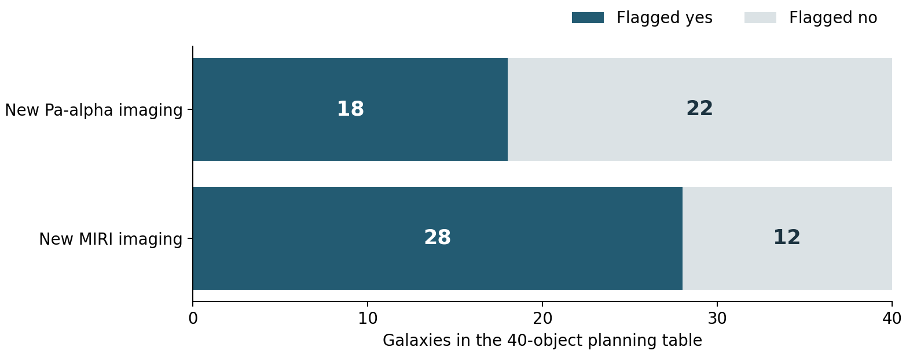
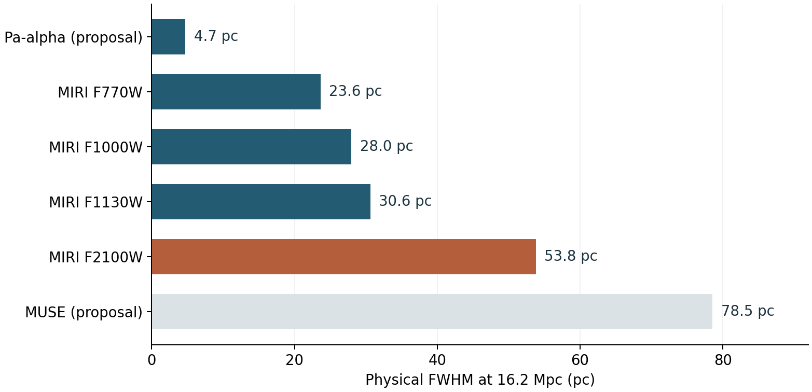
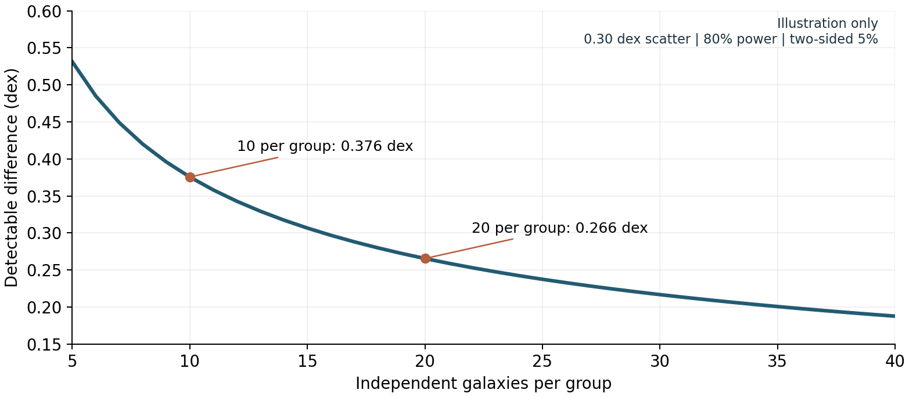

# MAUVE-JWST: critical review and a strategy for Cycle 6

**A scientific and proposal-design assessment | 6 September 2026**

Prepared from the supplied Cycle 5 proposal, its linked sample spreadsheet, the linked ChatGPT research report, current STScI program records, and primary research literature. This is an internal revision report, not a submission-ready proposal or an account of the TAC's deliberations.

## 1. Recommendation and decision

**Keep the first two scientific themes, demote TRGB from a headline goal, and develop environmental regulation of young stellar feedback as the preferred third goal.** However, changing the third heading alone will not solve the proposal's main weaknesses. Goals 1 and 2 need stronger links between the measurements and the physical conclusions, a defensible sample design, and demonstrations that the requested observations outperform an archival alternative.

The strongest revised theme is: **How does the cluster environment change the conversion of gas into stars and the ability of young stars to clear their surroundings?** This yields three connected questions:

1. **Star formation response:** When, where, and by how much does recent star formation change during environmental processing?
2. **ISM response:** How are dusty gas structures and PAH emission altered by compression, removal, and changes in heating or grain survival?
3. **Feedback response:** Does environmental processing confine young stellar feedback, assist gas clearing, or produce different behavior in different parts of a galaxy?

These are respectively a history, a description of the material being transformed, and a test of a physical process. They share the same young populations, nebulae, and dusty structures. The third goal should be significant because its outcome changes the interpretation of environmental quenching, not because it adds another object class.

**I would not make old globular clusters the replacement headline goal.** They connect less directly to ongoing gas stripping and recent star formation; J-Virgo already advertises orphan globular-cluster discovery; and at Virgo distance detecting a globular cluster, measuring its integrated structure, and resolving its constituent stars are very different experiments. Young cluster formation and emergence belong naturally in the revised program. Old globular clusters are better retained as optional legacy science unless a separate, quantitative case changes this judgment.

The most consequential findings are:

- **The new line-imaging sample is 18, not 40.** The linked spreadsheet has 18 affirmative entries in column L, "go for Pa-a?", and 22 negative entries. This is a planning flag, not a final count of usable archival or combined line measurements. Nevertheless, it exposes a substantial mismatch between the universal language in the science case and the planned diagnostic coverage.
- **A cluster age distribution is not a galaxy SFH by itself.** Cluster formation efficiency, disruption, crowding, extinction, stochastic stellar populations, and selection all intervene. These are potentially environment-dependent, so they can imitate the signal being sought.
- **PAH brightness cannot simultaneously be assumed to trace gas without bias and used to establish changing PAH abundance or destruction.** Those possibilities must be modeled together or tested with independent constraints.
- **The strongest new competitor is not only J-Virgo.** Cycle 5 GO 10046 specifically targets stellar feedback and cloud evolution in four galaxies at less than 5 Mpc, with full-disc ALMA mapping at 10 pc. A generic feedback census in Virgo would be less incisive spatially. The advantage must come from the external environmental perturbation.
- **TRGB is scientifically useful but currently overextended.** Better distances help constrain positions and environmental context; they do not supply transverse velocities, unique orbits, or a unique ram-pressure history. Demoting TRGB requires rebuilding the exposure and footprint budget, because its depth currently drives part of the NIRCam design.

No TAC comments are available: the user confirmed this during the review. The report therefore identifies demonstrable weaknesses and plausible rejection mechanisms, without claiming that any one caused the rejection. No proposal revision can guarantee selection.

## 2. Evidence, scope, and source provenance

### 2.1 What was actually reviewed

**[P] Supplied proposal:** `_JWST_Cycle5__MAUVE_NIRCam_MIRI_Imaging.pdf`, in this MAUVE directory, 12 PDF pages. Its title is *The Evolving ISM and Stellar Populations in Virgo Cluster Galaxies*. PDF page 1 is an internal cover sheet labeled for removal before submission. The printed science-page numbers are one less than the PDF page numbers; all page references below use **PDF page numbers**.

The file metadata records creation on 4 September 2026. This is consistent with a recently compiled copy of older material; it does not establish the contents of the originally submitted Cycle 5 file. I treat the user's statement that the proposal failed as the outcome and assess the supplied version. Draft-cover wording or compilation date should not be blamed for rejection without the actual submission.

**[S] Sample spreadsheet:** [MAUVE-JWST sample](https://docs.google.com/spreadsheets/d/1Csa-zoVhpEk_VxK_cwWB_K5jGOpy93r0ora8CrhHP2I/edit?gid=0), linked from the cover sheet. A read-only export was inspected on 6 September 2026. Rows 2-41 contain 40 galaxy entries. The spreadsheet has no accessible per-filter time budget or final footprint polygons; its flags are evidence of planning intent, not proof of final APT execution.

**[C] Earlier discussion:** [Analyze Successful JWST Surveys](https://chatgpt.com/g/g-p-68649effec8c8191a0e6d39c8ce39a5a/c/6a9a1ffd-adf4-83ec-9fd1-7cfb72472f2c). The task reader exposed only the prompt, but the browser exposed the embedded completed report. Its main argument and relevant program comparisons were read. Important claims were then checked against official sources rather than treating the previous answer as authority.

**External evidence:** Current STScI public APT exports were inspected for J-Virgo 7763, PHANGS 2107/3707, Whirlpool 3435, feedback 10046, FLEET 9734, and Dust in the Deserts 10350. These contain abstracts, observing descriptions, and observing tables. **They are not the complete original confidential science justifications or TAC reports.** The comparisons below concern their observable experimental designs.

The current proposal opportunity is **Cycle 6**, due **30 September 2026, 8:00 pm US Eastern**, equivalent to **1 October, 8:00 am in Perth**. STScI requires APT 2026.5.1 or newer as of this review. The deadline and software requirement were checked in the live call. [R1]

### 2.2 What this review does and does not establish

The report distinguishes **verified facts**, **scientific inference**, and **recommended work**. Numerical examples below are arithmetic or illustrative statistical calculations; they are not forecasts validated on MAUVE observations. No ETC workbook was run, no native APT file for the supplied MAUVE proposal was available for inspection, and no artificial-source recovery, full MAST footprint audit, or end-to-end science pipeline was executed. The proposal itself was not modified. The future submission's sample size, filter configuration, and hours remain decisions to be justified by those tests.

## 3. What the original proposal is trying to accomplish

### 3.1 The underlying scientific logic

The proposal uses Virgo as a laboratory for environmental galaxy evolution. Its 40 disc galaxies cover a range of gas content, orientations, and inferred processing stages. HST supplies exposed stellar populations, ALMA and VLA supply molecular and atomic gas information, MUSE supplies optical gas and stellar diagnostics, and AstroSat supplies ultraviolet information. JWST is intended to add the obscured young populations, infrared recombination lines, warm dust, and PAH structures missing from that combination. [P, pp. 1-4]

The motivating connection is strong: environmental forces alter the ISM; the altered ISM changes star formation and feedback; the accumulated changes transform galaxies. The proposal also seeks distances to place those processes within Virgo's three-dimensional structure. The weakness is that several links are presented as direct measurements when they are actually model-dependent inferences.

| Original goal | Intended measurement | Intended physical conclusion | Principal issue to repair |
|---|---|---|---|
| 1. Recent SFH and SFR | HST+NIRCam cluster ages/masses; Pa-alpha, Br-alpha, H-alpha, UV and 21-micron emission | Bursts near pericentre, quenching speed, SFR and efficiency changes | Recovering total SFH from clusters and comparing different SFR response times require explicit forward modeling |
| 2. Evolving ISM | 3.3, 7.7 and 11.3-micron PAH morphology/ratios; warm dust; comparison with gas and kinematics | Compression, stripping, turbulence, feedback outflows, grain destruction and ICM enrichment | Emissivity, gas column, projection and transport are degenerate |
| 3. TRGB distances | Deep F090W/F150W halo photometry | Relative distances, local ICM density, orbital and cluster assembly context | Positions constrain but do not determine orbits or ram pressure; J-Virgo already addresses overlapping science |

### 3.2 The proposed observations

The requested NIRCam set is F090W, F150W, F187N, F300M, F335M, F405N, and F430M. MIRI uses F770W, F1000W, F1130W, and F2100W. Continuum filters support cluster SEDs and line/PAH subtraction. NIRCam and MIRI observations are coordinated with off-target MIRI backgrounds. Existing adequate data are intended to be reused. [P, pp. 6-8]

The stated requirements include detecting most clusters of mass about 1,000 solar masses with visual extinction below about five magnitudes at signal-to-noise above 10, diffuse MIR intensities around 1-2 MJy/sr, and RGB stars 1.5 magnitudes below the TRGB at signal-to-noise 5. These are proposal claims requiring validation, especially for crowded discs and spatially varying backgrounds. A detection threshold is not a uniform mass-age-extinction completeness limit.

The cover gives **55.7 hours science, 7.6 hours parallel, and 156.3 hours charged**. Science time is 35.6% of charged time; the difference is 100.6 hours. This arithmetic does not isolate avoidable overheads, and parallel time is not an additional telescope wall-clock allocation. The large difference does, however, make a clear accounting of visits, slews, mosaics, backgrounds, instrument changes, and constraints essential.

### 3.3 Strengths worth preserving

The environmental question is important, the multiwavelength combination is directly relevant, and the proposed infrared diagnostics address real blind spots. The sample extends beyond spectacular single stripping systems. The plan already acknowledges velocity-dependent filter losses and some archival duplication. It includes public mosaics and catalogues, rather than promising only papers. These are substantive strengths; the revision should make their inferential value explicit.

## 4. A skeptical panel's strongest case against the proposal

**Constructed criticism, not actual TAC feedback:**

The proposal offers an attractive Virgo dataset, but the science case does not yet demonstrate that its large time request buys a decisive experiment. The first objective assumes that identifying more embedded clusters will establish galaxy SFHs and discriminate quenching histories. However, environmentally varying cluster formation and survival can change the same age distributions. The second objective treats PAH emission as a high-resolution gas tracer while arguing that environmental processing changes the PAHs themselves. The third objective requests deep stellar photometry to improve distances, even though a dedicated Virgo Treasury already addresses distances and resolved populations, and distance alone does not establish an orbit.

The observational design compounds these ambiguities. Many targets lack the proposed infrared line measurements, controls differ in physical resolution and selection, and the division of 40 galaxies across independent environmental conditions is not quantified. The figures demonstrate that JWST sees additional structure, but do not demonstrate separation of the proposed physical alternatives after realistic errors. Rich ancillary coverage is listed without showing that its footprint and resolution support the claimed small-scale inferences. A smaller archival or targeted program might answer the strongest questions at lower cost.

This is a serious case against the **current justification**, not against the scientific value of MAUVE-JWST. It is addressable by showing an environmental effect that existing programs cannot test, defining measurable outcomes, and validating the path from images to those outcomes.

## 5. Detailed criticism and concrete repairs

### 5.1 Novelty is asserted more clearly than the decisive test

**Location:** opening scientific justification and Goals 1-2, pp. 2-5. **Priority: essential.**

The text repeatedly promises completeness, definitive histories, resolution of debates, and immediate physical causes. Those phrases increase the burden of proof. PHANGS already combines cluster, gas, and dust information; J-Virgo covers stellar populations and distances; feedback surveys now explicitly target cloud evolution. "Virgo plus excellent ancillary data" is insufficient by itself.

**Repair:** State two or three physically different explanations, a primary measurable contrast, and an outcome that would change the conclusion. For example, distinguish reduced star formation caused primarily by loss of star-forming area from reduced activity within surviving gas-rich regions. Then identify the infrared observation that removes the ambiguity left by optical tracers. Present the additional scientific reach relative to an explicitly constructed archival baseline.

### 5.2 Cluster demographics do not uniquely recover total SFH

**Location:** Goal 1, pp. 3-4. **Priority: essential.**

A useful schematic forward model is:

$$
\frac{dN_{\rm obs}}{d\tau}=\int \psi(t_0-\tau)\,\Gamma(t_0-\tau)\,\phi(M)\,S(M,\tau)\,C(M,\tau,A_V,\mathbf{x})\,dM.
$$

Here the galaxy's total star formation rate is psi, Gamma is the fraction forming in the modeled cluster population, phi is the initial mass distribution normalized per unit cluster mass formed, S is survival or continued membership in the selected class, and C is completeness. Extinction and position are implicitly marginalized. A real model must also convolve this expression with age/mass measurement errors and account for associations as distinct populations. Cluster disruption is a well-established source of age-distribution structure. [R12]

A declining observed distribution can therefore result from changing SFR, changing Gamma, disruption, fading, dust selection, or age reassignment. Assuming Gamma is universal is particularly dangerous when the proposed science concerns an environment that may alter pressure and cluster formation. JWST reduces a major selection bias; it does not remove all of these terms.

**Repair:** Fit total recent SFH and cluster demographics jointly, constrained by independent nebular/UV/stellar information. Inject synthetic populations through the actual multiband selection. Specify mass-age-extinction regions where recovery is acceptable, retain age posteriors, and demonstrate recovery of a burst, a rapid decline, a slow decline, and a no-change case. Report the resulting age resolution rather than assuming identical precision in all age bins. Treat 1,000-solar-mass clusters with stochastic stellar-population models where needed.

### 5.3 Different SFR tracers are not independent clocks with fixed windows

**Location:** p. 4. **Priority: essential.**

H-alpha, Pa-alpha, and Br-alpha trace recombinations powered predominantly by young massive stars. Their relative advantage is mainly extinction sensitivity and spatial resolution, not three independent SFH timescales. UV and warm dust carry broader and environment-dependent responses. Twenty-one-micron light is not a universal 100-Myr SFR indicator: dust heating, old stars, geometry, and dust abundance matter, especially in quenching galaxies. FEAST's calibration analysis explicitly limits its sample to mitigate age and IMF-sampling effects. [R13]

The appropriate relation is a response convolution:

$$
L_k(t_0)=\int_0^{\infty}\psi(t_0-\tau)K_k(\tau,Z,{\rm IMF},{\rm dust},{\rm geometry})\,d\tau.
$$

**Repair:** Predict all tracers from candidate histories, with dust and ionizing-photon losses included. A recombination deficit can indicate fewer young stars, age evolution, ionizing-photon escape, or absorption by dust before ionization. High angular resolution improves separation of compact and diffuse emission, but does not establish the origin of every diffuse photon. Publish compact and diffuse components and account for their covariance.

### 5.4 The diagnostic sample is materially smaller and heterogeneous

**Location:** p. 7 and spreadsheet rows 2-41. **Priority: essential.**

The PDF describes dropping paired F187N/F405N exposures for some recession velocities. The live sheet quantifies a broader decision pattern: **18 entries are marked for new Pa-alpha imaging, 22 are not; 28 are marked for new MIRI imaging and 12 are not.** The Pa-alpha flag is not a separate Br-alpha assessment. NGC4548 is marked negative despite positive 80% and 50% Pa-alpha flags, while some targets with only the 50% flag positive are selected. Thus neither a single velocity threshold nor all affirmative transmission flags reproduce the choices.

Examples of targets marked without new Pa-alpha include NGC4330, NGC4383, NGC4388, NGC4501, and NGC4522. They may still have useful optical, archival infrared, or other diagnostics; the issue is the need to demonstrate comparable inference. Because line-of-sight velocity also enters environmental phase-space classifications, missing line measurements can correlate with the variable used to infer evolutionary stage.

| Spreadsheet class code | Number of galaxies | New Pa-alpha flag yes | Fraction |
|---|---:|---:|---:|
| 1 | 10 | 4 | 40% |
| 2 | 13 | 6 | 46% |
| 3 | 17 | 8 | 47% |
| All | 40 | 18 | 45% |

The sheet does not define the class codes in its header, so I do not equate them to named infall stages. The similar code-level percentages do not prove random missingness within the physical sample. The source's final three text notes are not a substitute for recounting individual rows.

*Figure 1. Recount of the live sample flags. This is new-observation planning coverage, not final usable-data completeness. Archival additions and per-region line transmission remain to be audited.*

**Repair:** Supply a target-by-diagnostic matrix with actual new plus archival coverage. Test Pa-alpha and Br-alpha separately across systemic velocity, internal rotation, line width, and detector throughput. Define a uniform primary analysis using measurements available across its sample; use an enhanced subset for the most demanding extinction/feedback test. Do not describe H-alpha plus 21 microns as equivalent to two infrared recombination lines without a transfer test on overlapping objects.

### 5.5 PAH emission is not an unconditional gas-column map

**Location:** Goal 2, pp. 4-5; sensitivity claims, p. 7. **Priority: essential.**

The proposal's own diffuse-ISM reference makes approximate gas tracing conditional on PAHs being well mixed with gas and illuminated by a suitable diffuse radiation field. [R14] A useful schematic expression is:

$$
I_b^{\rm PAH}\propto\Sigma_{\rm gas}\,DGR\,q_{\rm PAH}\,\langle U\rangle\,\epsilon_b({\rm size,charge,spectrum}).
$$

DGR is the dust-to-gas ratio, q_PAH is the PAH dust-mass fraction, U describes heating intensity, and epsilon describes the band response to grain properties and the illuminating spectrum. The formula is a diagnostic approximation, not a calibrated conversion law. A change in brightness can reflect any combination of these factors. PAH models explicitly show sensitivity to size, ionization, and starlight properties. [R15]

This matters most in exactly the regions emphasized in the proposal: stripped material, shocks, weakly star-forming discs, and gas exposed to the hot ICM. A PAH-dark region is not automatically gas-free; a bright edge is not automatically enhanced column density. Nor is a PAH-intensity PDF automatically a gas-column PDF, and its width alone does not measure turbulent velocity or uniquely diagnose turbulence.

**Repair:** First measure PAH-intensity distributions, morphology, and calibrated ratios as observables. Compare independent CO, H I, extinction, metallicity, and radiation-field constraints at their supported resolutions. Infer gas columns only within a validated domain and propagate conversion uncertainty. Test whether the PAH-gas relation changes under stripping as an explicit result. A claimed 5-solar-mass-per-square-parsec sensitivity must be labeled conditional on the adopted emissivity, not a universal detection limit.

### 5.6 Dust-property inversion and continuum subtraction need a stronger error model

**Location:** pp. 5-7. **Priority: high.**

Three PAH-sensitive bands can constrain model families, but do not independently determine an arbitrary size distribution, charge mixture, abundance, illuminating spectrum, and extinction. Ratios involving F2100W can be useful PAH-fraction proxies within calibrated regimes; they are not direct dust-mass measurements. [R16]

F300M alone does not determine every possible continuum slope under F335M. F1000W sits in a spectrally complex region and can be affected by silicate absorption; it is not a universally featureless interpolation anchor. Broad continuum estimates under narrow recombination filters are also sensitive to stellar color, extinction, and dust emission. These are quantifiable systematics, not reasons to abandon photometric imaging.

**Repair:** Forward-model the actual filters and redshifts using observed/model spectra. Compare the existing continuum strategy with a bracketing option such as F360M where it demonstrably improves the central test. Use representative archival spectroscopy for validation when available. Add new spectroscopy only if a compact calibration experiment is essential and affordable; do not add it merely to sound more comprehensive.

The supplied duplication argument asks for Pa-alpha observations about four times deeper partly to suppress 1/f noise. Demonstrate the residual error after the proposed readout, dither and reduction strategy on representative extended fields; do not justify the repeat observation by exposure ratio alone. Include correlated-noise and continuum errors in the final line sensitivity. [P, p. 8; R22]

### 5.7 The advertised spatial scales must follow the coarsest measurement

**Location:** pp. 4 and 7. **Priority: high.**

At the proposal's adopted 16.2 Mpc, one arcsecond corresponds to **78.54 pc**. A 0.060-arcsecond Pa-alpha image corresponds to 4.71 pc. Current on-sky MIRI PSF widths give 23.6 pc at F770W, 28.0 pc at F1000W, 30.6 pc at F1130W, and 53.8 pc at F2100W. [R17]

Consequently, a PAH ratio involving 11.3 microns operates at about 31 pc or coarser, and a ratio or dust-energy estimate involving 21 microns operates at about 54 pc or coarser. MUSE at one arcsecond, as described in the proposal, supplies roughly 79-pc information. ALMA and H I comparisons must use their actual target-specific beams, not the NIRCam resolution.

*Figure 2. Physical FWHM at 16.2 Mpc. MIRI widths are the current STScI on-sky values; Pa-alpha and MUSE values use the approximate resolutions quoted in the supplied proposal. These are resolution elements, not the minimum size for a robust morphological measurement.*

**Repair:** Use multiple analysis scales explicitly: native-resolution source identification, matched-resolution nebular/PAH morphology, and coarser gas/kinematic context. A many-pixel map does not create many independent measurements below the beam. A source can be detected when unresolved; resolving a shell shape generally requires several independent resolution elements.

### 5.8 Environment, local conditions, and evolutionary stage can become circular

**Location:** Fig. 1 and discussion of infall stages, pp. 2-4. **Priority: essential.**

The proposal uses gas morphology/content, phase space, and modeling to assign processing stages, then asks how gas and star formation change with those stages. That is scientifically useful but partly circular if a classification is defined by the outcome being tested. Stellar mass matching alone also leaves metallicity, radius, morphology, bar/nuclear activity, inclination, local gas conditions, and resolution unmatched.

There is an additional causal-design choice: matching on current gas content can remove part of the environmental effect, because gas removal is one of the causal pathways. Therefore two questions must be separated: the **total environmental association** at fixed pre-existing galaxy characteristics, and the **conditional local response** at fixed surviving gas or stellar conditions.

**Repair:** Specify the estimand before choosing controls. Use external environmental information and probabilistic stage assignments; repeat results with alternative classifications. Keep whole galaxies as independent units for environmental conclusions, with local regions nested within them. Include tidal interactions and nuclear activity as alternative explanations. Do not derive a wind direction from the star-formation or feedback map and then claim an independently aligned signal.

### 5.9 Forty galaxies do not automatically support all proposed subdivisions

**Location:** pp. 2-4, sample justification. **Priority: essential.**

Mass, orientation, stage, AGN status, and line availability divide the same 40 galaxies. Thousands of regions within a few galaxies cannot substitute for independent environmental replication. An illustrative calculation with independent galaxy scatter of 0.30 dex gives:

$$
\sigma_{\Delta}=s\sqrt{\frac{1}{n_1}+\frac{1}{n_2}}.
$$

For 10 galaxies per group the uncertainty on a difference is 0.134 dex. A two-sided normal-approximation test at 5% size and 80% power requires a difference near 0.376 dex. With 20 per group it is about 0.266 dex. These values are illustrative; the real design needs pilot scatter, correlated errors, missingness, and any pairing modeled. Small-sample tests may require more conservative thresholds.

*Figure 3. Illustrative minimum detectable difference versus galaxies per group, assuming 0.30 dex independent scatter, equal-sized groups, two-sided 5% significance and 80% power. This is not a MAUVE forecast or a recommendation to select exactly this number of galaxies.*

**Repair:** Select one primary contrast or a low-dimensional continuous model. Estimate achievable precision using galaxy-level pilot data and realistic selection. Explain why 40 is necessary, or select a smaller justified program. Fit regions hierarchically and assess robustness by removing or resampling entire galaxies. For descriptive environmental summaries, make equal-galaxy results primary so a rich nearby target does not dominate merely through its region count.

### 5.10 The TRGB argument contains an overstatement and an incorrect comparison

**Location:** pp. 5-6. **Priority: high even if TRGB is demoted.**

The proposal characterizes prior distance methods, including SBF, as having errors generally above 10-20%. Its cited Mei et al. (2007) paper instead reports a mean random SBF distance-modulus error of 0.07 mag, about 3.2% or 0.5 Mpc, for its early-type Virgo sample. [R18] This does not mean SBF works equally well for dusty star-forming discs; it means the blanket comparison is incorrect. Separate applicability, random precision, and shared zero-point systematics.

The claimed 2-3% TRGB precision corresponds to about 0.043-0.065 mag. Such a requirement needs artificial-star tests, population and crowding control, calibration covariance, and enough RGB stars in appropriate halo fields. A halo pointing helps, but does not guarantee identical precision for every target.

Ram pressure depends on both density and velocity relative to the ICM:

$$
P_{\rm ram}=\rho_{\rm ICM}(\mathbf{r})\,|\mathbf{v}_{\rm gal}-\mathbf{v}_{\rm ICM}|^2.
$$

Distances improve the position term. They do not measure two missing transverse velocity components or a local ICM velocity field, and Virgo is not a perfectly smooth atmosphere. Orbit reconstruction remains conditional on a dynamical model and priors. A 100-Myr stellar chronology cannot be rigidly tied to first pericentre without propagating those uncertainties.

**Repair:** Retain available distances as probabilistic context and a useful product. Make a standalone TRGB investment only if a sensitivity analysis shows that distance uncertainty dominates the primary inference and the required improvement is achievable. This is a scientific-value calculation, not a categorical judgment against distance science.

### 5.11 Outflow, stripping, and feedback energetics are overinterpreted from morphology

**Location:** pp. 4-5 and Fig. 3. **Priority: high.**

Extraplanar PAH emission identifies dusty material and compelling structures. It does not supply neutral-gas velocities, mass flow, energy coupling, or a unique origin. Spatial coincidence with a young cluster or nucleus suggests a possible driver; it does not establish that driver. Even an ionized outflow velocity from MUSE is not automatically the velocity of the dusty neutral phase.

**Repair:** Define morphology as the primary imaging measurement. Use multi-component kinematics and gas information where available to distinguish candidate outflows from stripping, displaced disc material, or projection. Keep mass-loading rates and mechanical coupling efficiencies conditional on phase masses, velocities, geometry, and a flow time. Do not promise direct ICM dust enrichment rates from PAH imaging alone.

### 5.12 Efficiency and Treasury value need to be demonstrated, not asserted

**Location:** pp. 6-8 and cover budget. **Priority: essential.**

The broad ancillary opportunity is timely, but does not by itself make the galaxy physics time-critical. Rapid transient screening can be useful, yet is not a necessary argument for the core quenching experiment. The promised one-to-two-week reduction, first release six months after completion, and final release after 24 months need distinct product definitions and a feasible staffing plan.

For Cycle 6, the three equally weighted primary criteria are **in-field impact, out-of-field impact, and suitability/feasibility**. Large programs exceed 130 hours; all Treasury programs go to an Executive Committee regardless of size. The current criteria emphasize target/resource justification and coherent reusable products, and instruct reviewers not to trim ordinary GO targets/hours. [R2]

**Repair:** Build the smallest coherent request before submission. Describe out-of-field value through concrete calibration or simulation products: environmental limitations of IR gas/SFR tracers, cluster-emergence prescriptions, and benchmark images with known selection. The Treasury plan should include delivery to STScI/MAST, with CADC as a useful mirror, plus masks, completeness, uncertainty products, and reproducible methods. [R3] Reducing hours below 130 while retaining Treasury status does not change the Executive-Committee route.

## 6. What the earlier chat gets right, and what must be updated

The earlier report's most useful insight is its insistence on a connected path from a physical ambiguity to an observable, measurement requirement, sample, analysis, and reusable result. Its recommendations on control selection, surface-brightness limits, and specific data products apply directly here. Its caution that acceptance does not reveal the TAC's reasons is also correct. [C]

Three qualifications are important before using it to redesign MAUVE-JWST:

1. **A catalogue of successful programs is a source of design examples, not a causal analysis of proposal success.** It lacks a matched sample of rejected proposals and their grades. Descriptions such as "the later cycles reward causal physics" are interpretations, not measured selection rules.
2. **Several key entries were incomplete.** The chat left J-Virgo's filters and sample unspecified, even though these are decisive for this proposal. They are now verified below. The broad census was not re-audited in full; no completeness claim from it is needed for this report.
3. **Requested, allocated, parallel, and current hours are different quantities.** The chat mostly labels original table values appropriately, but some prose conflates scale. Its example that a single-galaxy M82 program can justify over 100 hours should not be read as over 100 charged prime hours: its own table gives 65.39 prime and 44.4 parallel, which cannot simply be added. Use consistent time definitions.

The allocation histories show why a fresh check matters. The earlier chat gives 159.4 hours for GO 10046; the current record gives 199.7 external hours, with the difference explained by recorded overhead changes. GO 10350 changes from 58.8 to 60.8 hours; J-Virgo's current value is 146.7 hours. These do not demonstrate more science was awarded after selection. [R4-R6]

### 6.1 The most useful accepted-program comparisons

| Program | Verified design relevant to MAUVE | Transferable lesson and boundary |
|---|---|---|
| PHANGS 2107, Cycle 1 | 19 galaxies; NIRCam+MIRI; matched optical and gas context | A new observable completes an existing experiment. That general argument is now established and needs an environmental advance here. [R7] |
| PHANGS 3707, Cycle 2 | 55 additional galaxies, 74 combined; population-scale matter-cycle questions | More targets matter when they change the accessible population or test. Some filters depend on velocity, so heterogeneity must be modeled. [R8] |
| Whirlpool 3435, Cycle 2 | M51 imaging plus three IFU strips | A restricted calibration component can strengthen a broad imaging experiment when the inference needs it. [R9] |
| J-Virgo 7763, Cycle 4 | 80 subcluster-A galaxies; resolved RGB/AGB stars, distances, SBF, intracluster populations | Multiple goals can be unified by one stellar dataset. MAUVE must establish its distinct dusty-ISM/young-population measurements. [R4] |
| Feedback 10046, Cycle 5 | Four galaxies within 5 Mpc; 1-10 pc JWST diagnostics and 10 pc ALMA; cloud evolution and feedback | A generic feedback goal is already occupied. MAUVE adds a cluster-environment experiment, not superior cloud-scale gas resolution. [R5] |
| FLEET 9734, Cycle 5 | Low-metallicity emerging clusters and feedback at 3-8 Mpc | Select a physical regime and state its discriminant. Its abstract says nine galaxies, while the current table contains eight unique systems; do not silently equate the snapshots. [R10] |
| Dust in the Deserts 10350, Cycle 5 | 11 FUV-poor bulges and adjacent disc controls; expanded MIR SEDs plus ALMA | PAH physics in weak-SF regions is already a targeted question. MAUVE must isolate environmental processing and use overlap for calibration. [R6] |

Current external allocations are 114.0 hours for 2107, 153.3 for 3707, 69.7 for 3435, 146.7 for 7763, 199.7 for 10046, 64.0 for 9734, and 60.8 for 10350. The records list 2107/3707/3435 as completed, 7763 as flight ready, and the three Cycle 5 examples as in implementation. These are dated current-record values, not uniform original award statistics. [R4-R10]

## 7. J-Virgo: the distinction to make early and precisely

### 7.1 What J-Virgo actually observes

J-Virgo's current official description targets 80 morphologically diverse luminous galaxies in Virgo subcluster A with NIRCam F115W, F150W and F277W, and NIRISS F115W/F277W parallels. Seventy-six targets receive all three NIRCam bands; four receive F115W/F277W to complement archival coverage. Its headline goals are relative TRGB distances, AGB-based SFHs/gradients, SBF calibration, and intracluster populations. Its observing description also includes orphan globular clusters and faint dwarfs. It does not request MIRI, F335M PAH imaging, or narrow infrared recombination-line imaging. [R4]

**Do not describe it as only a halo survey or as incapable of any disc science.** Its observing description centers targets on a NIRCam module for most visits. Whether its useful footprint is adequate for a particular MAUVE disc requires actual footprint intersection and completeness tests. The supplied proposal's claim that the eight overlapping F150W datasets do not fully cover its required discs is a claim to validate, not a substitute for that comparison.

### 7.2 The overlap is real but limited in target number

Matching the 40 spreadsheet galaxy names to the official J-Virgo target table gives **eight common targets**: NGC4294, NGC4351, NGC4388, NGC4402, NGC4548, NGC4569, NGC4579, and NGC4606. This independently agrees with the proposal's count. It establishes target-name overlap only; it does not establish matching sky area, depth, source completeness, or data availability.

| Measurement needed | J-Virgo contribution | What a revised MAUVE-JWST request must add |
|---|---|---|
| Distances and intermediate/old stellar context | Strong, direct overlap | Reuse eligible distances/photometry; fill only demonstrably important gaps |
| Disc stellar continuum and some cluster detections | Potentially useful within observed fields | Demonstrate missing footprint, obscured-source completeness, or necessary colors |
| Extinction-sensitive compact nebular emission | No dedicated Pa-alpha/Br-alpha bands in its configuration | A validated line and continuum strategy on a defined sample |
| PAH structures and band ratios | No dedicated 3.3-micron PAH or MIRI configuration | Required PAH bands, continuum correction, and controlled physical interpretation |
| Warm-dust emission around young regions | No MIRI | F2100W at its actual coarser resolution |
| Environmental dependence of stellar feedback | Useful stellar/environmental context, incomplete diagnostics | Young-source/nebula/PAH experiment plus independent environmental information |
| Old globular-cluster or intracluster-population census | Explicit related science | A stronger additional measurement than rediscovering compact sources |

Thus the early argument should be **complementarity plus a demonstrably missing experiment**. J-Virgo is adequate for much of its own stated science and helpful to MAUVE; its configuration alone does not deliver the proposed infrared line/PAH/warm-dust experiment. The question is whether existing data *from all programs together* already provide enough of that experiment.

Cycle 5 GO 10350 includes NGC4548 and NGC4579 from the 40-object sheet; its NGC4571 target is not in that sheet. Its deeper MIR spectral coverage may be especially valuable for testing dust-heating systematics. Recheck it, PHANGS, and wind/AGN programs in the duplication analysis, not just J-Virgo.

## 8. Polishing the first two goals while preserving their themes

### 8.1 Revised Goal 1: recover the spatial and temporal response of star formation

**Proposed question:** Does environmental processing first reduce the area in which stars form, alter star formation within the surviving disc, or induce a short-lived burst before decline?

Make the primary outcomes explicit: the radial extent of current star formation, the recent-to-earlier star formation ratio over time intervals actually recoverable from the data, and the obscured fraction or missed young-population contribution. Separate whole-galaxy totals from the local response of surviving regions. Do not use a reduced disc-wide mean to claim suppressed local efficiency if the change is primarily loss of star-forming area.

For a burst interpretation, require evidence relative to an appropriate baseline, not just a bright leading edge compared with a suppressed trailing edge. For a quenching interpretation, compare forward-modeled histories and report ranges of decline times supported by the combined tracers. Do not force every galaxy onto a precisely timed orbital sequence.

**What would make this convincing:** A pilot recovery figure showing the old-data-only and old-plus-new-data posteriors for physically distinct histories, after crowding, extinction, cluster demographics, age errors, and the proposed coverage are applied. The figure must show which ambiguity JWST removes and which remains. It can use archival regions, but simulated outcomes must be explicitly labeled.

**Role of external data:** HST constrains exposed populations and optical colors; MUSE supplies nebular diagnostics and stellar/kinematic context where measurable; UV informs the broader recent population; CO supplies molecular-gas context at its own beam. Each dataset should have an explicit role in the inference and a verified footprint.

### 8.2 Revised Goal 2: distinguish dusty-gas rearrangement from changing dust emission

**Proposed question:** Does environmental processing mainly move or remove dusty material, change the conditions that excite PAHs, or alter the small-grain population itself?

Keep high-resolution ISM structure central. Measure distributions of PAH intensity and structural statistics, disc-edge and extraplanar emission, and continuum-corrected band ratios. Fit these jointly with radiation and gas information. Reserve the term gas-column PDF for regimes where the conversion is demonstrated.

Three model families are particularly useful: redistribution with approximately unchanged emissivity; changed heating at comparable gas content; and altered grain abundance/properties. The predictions can overlap, so discrimination should be assessed in a multivariate observable space. A single band ratio cannot adjudicate all three by itself.

**What would make this convincing:** An archival calibration panel demonstrating how the same gas or radiation conditions map into the selected filters, alongside a synthetic environmental perturbation test. Show whether the proposed precision distinguishes a change in intensity normalization from a change in color or morphology. Sputtering can remain a candidate mechanism, but direct grain-destruction times require environmental and transport assumptions.

**Boundary with Goal 3:** Goal 2 concerns the distribution and state of dusty material. Transfer the detailed source-centered cluster emergence and feedback test into Goal 3. Otherwise adding feedback simply repeats text already in Goal 2.

## 9. Choosing a scientifically substantial third goal

### 9.1 Comparison of the main options

| Candidate | Scientific fit | Main advantage | Main obstacle | Decision |
|---|---|---|---|---|
| Environmental regulation of young stellar feedback | Very strong | Tests how external processing changes the internal regulation of star formation | Needs separable outcomes and selection-aware emergence/morphology measurements; GO 10046 is a strong comparator | Preferred, conditional on a pilot recovery test |
| Young-cluster formation and survival across environments | Strong | Connects pressure, clustered SF and quenching | Degenerate with Goal 1's SFH; bound status and disruption need care | Strong alternative or a focused component of Goals 1/3 |
| Old globular clusters and stripping/assembly | Moderate for environment, weak for the recent gas cycle | Legacy populations and possible tidal assembly information | J-Virgo/other imaging overlap; limited structural resolution; age-metallicity degeneracy; gas stripping does not directly strip bound old stars | Ancillary unless a separate case justifies the observational design |
| Direct ionizing-photon escape | Related and potentially broad | Connects local feedback to escaping radiation | A recombination deficit is not an escape fraction; stellar ionizing output and dust absorption are uncertain | Do not promise direct escape-fraction measurements from these images alone |
| Direct outflow mass loading or energy coupling | Strong theme | Links local feedback to gas loss | Imaging lacks phase masses, velocities and flow geometry | Restricted follow-up or model-dependent secondary inference |
| Retained headline TRGB | Good environmental context | Distances improve positions and some model constraints | Distinct depth/footprint driver; overlapping survey; weak link to uniquely timed orbits | Demote unless distance-error propagation proves it indispensable |

### 9.2 Preferred Goal 3: does the environment confine or assist young stellar feedback?

**Proposed scientific statement:** Measure how the emergence of young stellar populations and the surrounding nebular/PAH structures vary with environmental processing, testing whether external compression prolongs confinement or whether stripping opens pathways for gas clearing.

This can address a question as consequential as the first two goals: **Can feedback prescriptions calibrated in ordinary nearby galaxies be transferred to galaxies experiencing an external wind and gas loss?** A detected change would motivate environment-dependent treatments; a well-constrained null result would support transferability over the tested regime. The latter is scientifically useful and should be part of the case.

The competing behaviors are conditional, not universal laws. Compression can enhance confinement in some locations, while ablation or reduced overlying column can ease escape elsewhere. Predictions must be obtained for the relevant density, pressure, geometry, source age/mass, and observation resolution; a simple rule that "stronger ram pressure always means faster clearing" would be unjustified.

### 9.3 Measurements the proposed images can plausibly support

1. **Emergence state at fixed stellar age and mass:** the probability of being optically exposed, partially obscured, or infrared-bright and optically faint, using a joint optical/IR selection. Fit completeness and extinction, and avoid defining an embedded sample solely by PAH emission when PAH survival is itself under study.
2. **Source-centered morphology:** nebular and PAH covering fractions, offsets, asymmetric rims, cavity sizes, and exposed versus dust-associated structures, where resolved. Define these operationally and recover them in injection tests before attaching physical labels.
3. **Environmental contrast:** compare source-level responses across independently classified galaxy environments and, where justified, across predeclared regions inside a galaxy. Use external H I/CO/optical structural evidence for orientation and disturbance, carrying uncertainty.
4. **Coarser dynamical context:** use MUSE and available gas kinematics to distinguish dynamically unusual regions and candidate outflows. Do not promote a roughly 80-pc line-width measurement to a 5-pc shell expansion speed.

FEAST's M83 analysis already demonstrates that combined emerging and optically exposed clusters can constrain an emergence sequence and reports an average clearing timescale near 6 Myr under its adopted framework. That is a method precedent, not a Virgo prediction or a universal constant. [R19] Recent PHANGS work also shows that MIR visibility lifetimes and cloud lifetimes require careful tracer interpretation. [R20]

### 9.4 The timescale inference must remain explicit

In a steady formation population with comparable selection, the ratio of corrected counts in two phases can approximate their relative durations. Under a varying formation history it instead obeys:

$$
N_j\propto\int B_{\rm cl}(M,t_0-\tau,\mathcal{E})\,p_j(\tau,M,\mathcal{E})\,C_j(\tau,M,\mathcal{E})\,d\tau\,dM.
$$

The environmental state is E, B_cl is the cluster birthrate per unit mass (including the total SFR, cluster formation fraction and initial mass distribution), p_j includes phase membership and survival, and C_j gives selection. The very burst/quenching behavior sought in Goal 1 violates the steady-formation shortcut. Thus **Goals 1 and 3 must use a joint model**, with independent constraints where possible. They should not treat the same age catalogue as independent evidence twice.

A primary, more directly identifiable result is the environmental dependence of obscuration/association probability at fixed age, mass, and observable local conditions. A clearing time is a subsequent model-derived quantity. An embedded fraction alone cannot determine that time.

### 9.5 A practical comparison model

For a selected observable such as log cavity radius or a transformed obscured fraction, a hierarchical model might contain age, stellar mass, metallicity, local environment, galaxy-level disturbance, and a galaxy random effect. The scientific coefficient is the residual environmental dependence, with an interaction term if testing whether source feedback behaves differently under external processing.

The model should be low-dimensional enough for the number of galaxies. Match or standardize the physical resolution and measurement procedure in field controls. Degrade suitable high-resolution comparison images to Virgo distance, add realistic backgrounds/noise, re-detect sources, and refit ages and morphology. Resampling a final catalogue alone will not reproduce blending and missed-source effects.

**Do not claim a direct measurement of feedback energy coupling from this baseline.** A quantity such as shell momentum divided by integrated stellar momentum needs a measured shell mass and velocity and a defensible stellar-population model. The proposed imaging may supply morphology and source luminosity but does not by itself close that calculation.

### 9.6 Why MAUVE can be distinctive despite GO 10046

GO 10046 is designed to resolve gas-star evolution in four very nearby galaxies with exceptionally sharp ALMA coverage. MAUVE's proposed advantage is a larger set of independently environmentally processed galaxies with gas-stripping context, not comparable 10-pc molecular-cloud information. The new goal should therefore test the **response to environmental processing at accessible scales**, using very-nearby programs as methodological controls.

If the recovered science depends on resolving individual molecular clouds at 5-10 pc throughout Virgo, the present ancillary resolution is inadequate to justify that claim. Either change the observable, restrict the goal to data-supported targets/scales, or pursue a separately costed gas-observation component. Do not import the nearby survey's physical labels without its supporting measurements.

### 9.7 Why old globular clusters are a weaker headline replacement

For illustration, an old globular cluster with half-light radius 3 pc subtends about **0.038 arcseconds** at 16.2 Mpc. That scale is comparable to a short-wavelength NIRCam resolution element and smaller than many bands' PSFs. This does not make integrated cluster science impossible: high-S/N PSF-convolved profile fitting can measure sizes below a PSF width. It does mean that resolved structural work needs explicit recovery tests, and broad claims of resolving individual cluster stars across Virgo would be inappropriate for crowded clusters.

More fundamentally, ongoing ram pressure acts on gas. Old-cluster removal primarily concerns gravitational tides, assembly, and orbital history. That can be excellent science, but it introduces a different mechanism and timescale into a proposal currently built around recent SF and the ISM. Naming young massive clusters as potential globular-cluster progenitors does not demonstrate survival for billions of years.

If retaining a cluster-specific third goal, prefer **how environmental processing changes the formation and emergence of young clusters**, with a clearly defined cluster/association classification and a total-SFR denominator. Keep old GCs as a catalogue product or a future focused study.

## 10. What demoting TRGB means for the observing program

**TRGB is an extra science product only when it no longer determines additional exposure depth, footprint, or constraints.** It is not an extra product merely because its paragraph moves to the end.

The supplied design gives F090W/F150W a deep RGB requirement, shifts pointings to include halo fields, and pairs some long-wavelength filters with those exposures. Removing the TRGB requirement changes the optimum program. Conversely, some stellar continuum imaging may remain essential for Goals 1/3, and simultaneous long-wavelength imaging may retain substantial value.

| Component | Revised default | Required decision evidence |
|---|---|---|
| Deep F090W for every target | Rejustify, reduce, or omit | Does the young-population experiment need this band/depth beyond HST and existing NIRCam? |
| F150W | Likely valuable; reuse overlap | Required SED/continuum precision and disc completeness |
| F300M/F335M | Strong core for PAH/embedded structure | Demonstrated subtraction and completeness across environments |
| F187N | High value where line transmission is suitable | Per-target and per-region throughput, continuum residuals, common analysis sample |
| F405N plus F430M | Assess marginal extinction/embedded-SF gain | Separate Br-alpha transmission and S/N; test whether the extra line breaks a central degeneracy |
| F360M or another continuum improvement | Candidate, not automatic addition | A measured reduction in bias sufficient to justify its time |
| F770W/F1000W/F1130W | Strong ISM core | Existing data audit and validated band decomposition |
| F2100W | Valuable with an explicit scale limit | Dust/SFR/PAH-proxy requirement at about 54 pc or coarser |
| Halo-driven offsets/PA constraints | Remove when not needed by primary goals | Disc/tail coverage, efficiency and schedulability comparison |
| Dedicated deeper TRGB subset | Only if central science requires it | Distance-error propagation and incremental APT cost |

A common conditional-distance treatment may already be sufficient for some resolved comparisons. At fixed angular aperture, luminosity-derived SFR and physical area both scale approximately with distance squared, so SFR surface density is approximately distance-independent. Similarly, CO-based mass and SFR often share a distance-squared scaling in a depletion time. Distances remain important for physical resolution, absolute masses/luminosities, footprints, and cluster-centric location. This distinction helps identify when deeper TRGB actually improves the headline result.

Evaluate at least three internally coherent designs: the original full-depth request; the same science sample optimized around Goals 1-3 without universal TRGB; and a reduced sample chosen for a specified effect-size target. Include archival data in every option. The report does not assign new hours because the necessary APT/time breakdown is unavailable.

## 11. Recommended structure, figures, and reusable wording

### 11.1 Opening scientific argument

The opening should establish the unresolved physical problem, explain what nearby field surveys and J-Virgo already provide, and specify the missing environmental test. Avoid starting with a catalogue of facilities or a claim that previous programs cannot do any relevant science.

**Suggested opening paragraph for adaptation:**

> Environmental gas loss transforms cluster galaxies, but we do not yet know whether it changes star formation only by removing fuel or also by changing how young stars disperse their surroundings. Resolving this distinction requires the recent stellar population, obscured nebulae, and dusty ISM to be measured together across galaxies experiencing different degrees of environmental processing. Existing nearby-galaxy surveys establish the local gas-star cycle, while J-Virgo supplies a powerful stellar-population and distance framework. MAUVE-JWST would add the spatially resolved infrared diagnostics needed to test how that cycle responds to the Virgo environment.

This paragraph states a proposed measurement strategy; the final text must insert a validated sample, precision, and unique data requirement. Do not add an unverified numerical effect or total time to make the abstract look finished.

### 11.2 Suggested goal headings

- **Goal 1: Recover when and where star formation changes during environmental processing.**
- **Goal 2: Determine how the dusty ISM is rearranged and altered as galaxies lose gas.**
- **Goal 3: Test whether the cluster environment confines young stellar feedback or assists gas clearing.**

The third heading is conditional on demonstrating that the selected observables distinguish these behaviors. If they do not, a two-goal proposal with a stronger validated experiment is preferable to a nominal three-goal structure. Treasury status does not require exactly three headline goals. [R3]

### 11.3 Figures to replace or strengthen

**Figure A: the missing experiment.** For representative galaxies, show HST/MUSE/ALMA footprints, existing JWST coverage including J-Virgo, and the actual requested extra area and filters. Annotate the measurement gained. One image of a spectacular object cannot establish sample-wide necessity.

**Figure B: observable predictions.** Show predicted recent-SF and ISM/feedback measurements for competing scenarios with expected uncertainties. Distinguish no burst from a burst, changed emission from changed gas, or longer confinement from easier clearing. Label simulations as simulations and show at least one difficult or null case.

**Figure C: sample leverage.** Show the distribution of independent galaxies and the final usable diagnostic counts across the primary contrast, plus the anticipated uncertainty. Do not rely on a mass-H I diagram alone to establish matched controls.

**Figure D: one end-to-end pilot.** Demonstrate the route from source detection and continuum subtraction through age/morphology recovery to the primary physical test, using real archival data where possible. The supplied proposal's figures effectively show capability and motivation; this new figure should show inference.

### 11.4 Treasury products with a clear scientific use

Provide calibrated mosaics and native-resolution images; matched-resolution images where meaningful; exposure/noise/background maps; continuum-subtracted products with systematic-error estimates; segmentation and quality masks; joint optical/IR source catalogues with age/mass/extinction posteriors; completeness and selection functions; region association probabilities; target environment metadata with provenance and uncertainties; and reproducible comparison workflows.

Users outside the collaboration could then test environment-dependent IR calibrations, compare simulated observables, or reanalyze cluster emergence without recreating the full reduction. Distances and compact-source catalogues can be additional products where measurements are adequate. Specify a rolling release tied to completed target batches, with final publication-quality catalogues later. Maintain a clear distinction between rapid-look images and validated physical products.

## 12. Concrete work before resubmission

The following sequence is a recommended execution plan, not work already performed by this report.

| Order | Required work | Concrete output and decision |
|---|---|---|
| 1 | Recover the actual submitted PDF, APT file, ETC calculations and TAC comments when available | Establish which criticisms apply to the submitted version; maintain a response-to-concern table |
| 2 | Refresh all new and archival observations, including approved Cycle 5 data | Target/filter/footprint/depth/availability matrix; identify the minimum new observations |
| 3 | Choose the primary environmental contrast and usable sample | Explicit selection, exclusions, stage uncertainty and control definition |
| 4 | Test the line strategy and continuum subtraction | Velocity-dependent response maps, residual distributions and matched diagnostic subset |
| 5 | Demonstrate SFH and cluster-emergence recovery | Injection/recovery over mass, age, extinction, background and spatial position; quantify remaining degeneracies |
| 6 | Validate the PAH inference at supported resolution | Establish where gas-column interpretation is allowed and where only emissivity/morphology is defensible |
| 7 | Forecast the environmental measurement with whole-galaxy variation | Effect-size sensitivity, null-result meaning, robustness to an influential target and incomplete ancillary data |
| 8 | Rebuild exposures and constraints after the TRGB decision | Compare total charged time and information gain for coherent alternatives |
| 9 | Write the scientific case and practical Treasury release plan together | Each headline result maps to a measurement, resource requirement, analysis and released product |
| 10 | Final independent scientific/technical review | Check claims against demonstrated capability; confirm current call, archive, APT and anonymity requirements |

Given the current Cycle 6 deadline, prioritize the archival-overlap audit, one decisive pilot, the sample/line-coverage choice, and the cost rebuild. A short, honest demonstration that a central ambiguity is removed is more valuable than adding a fourth optional science topic.

## 13. Additional comments beyond the proposed changes

**Use distance and classification uncertainty constructively.** Rather than waiting for perfect orbits, ask which environmental conclusions remain valid after marginalizing over plausible positions and stages. A robust result that does not require a unique orbital history is easier to defend.

**Predefine the causal question.** Total environmental suppression, local gas conversion efficiency, and feedback behavior at fixed surviving gas are related but different outcomes. Matching on an intermediate variable can erase the process one intends to study. Write these distinctions into the analysis plan.

**Avoid a selection that assumes PAHs survive.** If young-source selection requires a PAH excess, environmental PAH destruction can masquerade as fewer embedded clusters. Combine stellar continuum, recombination lines where available, and optical evidence; retain upper limits and model the selection rather than discarding non-detections.

**Assess claims of urgency carefully.** The major external investments are an opportunity, but the galaxies' global quenching does not evolve measurably between annual proposal rounds. Timeliness should mean that complementary data and mature methods now make a discriminating experiment feasible. Keep genuine transient capability secondary unless cadence is intentionally part of the design.

**Do not convert null detections into stripping evidence automatically.** Faint tails can reflect low heating, changed grains, limited surface-brightness recovery, or background subtraction. Extended-signal injection is particularly valuable because off-target fields and low-frequency noise correction can remove the structures sought.

**Do not generalize directly to all satellite galaxies or high redshift.** The proposed sample is one cluster's selected disc population. Its broader contribution is a measured environmental response, a calibrated limitation of a tracer, or a testable boundary on feedback prescriptions. Export those quantities with their applicability domain.

**Treat the HST program as a close scientific predecessor too.** The approved HST Cycle 33 Treasury, GO 18103, explicitly targets environment-driven transformation using clusters, associations, and H II regions. Its scientific overlap strengthens the value of JWST obscured diagnostics but makes the incremental measurement especially important. A facility list is insufficient; demonstrate the change in inference. [R11]

**Keep scientific ambition, but reduce certainty in unsupported claims.** Replace universal completeness with a defined selection function, definitive histories with validated temporal resolution, immediate causes with tested alternatives, and direct mass-flow claims with conditional inference. This makes the central promise stronger because its evidential requirements become clear.

## 14. Final assessment

The user's proposed direction makes scientific sense: preserve and sharpen the first two themes, move distance work into supporting context or genuinely low-incremental-cost products, and develop a third goal on environmental regulation of young stellar feedback. Old globular clusters are a weaker fit for this particular survey.

The largest improvement will come from **turning the proposal into a quantitative environmental experiment**. It needs to show that the new observations reveal a process that the union of J-Virgo, PHANGS, HST, and newer feedback/dust programs cannot already establish; that the relevant diagnostics work on the proposed galaxies; and that the independent sample can discriminate the competing explanations. That is the basis for a stronger submission, independent of which particular concern dominated the previous TAC decision.

## Appendix A. Sample checks and reproducibility

The source spreadsheet was read from the exported `Sheet1` values in rows 2-41. Column B gives galaxy names, D the numeric class code, L the new Pa-alpha decision, and N the new MIRI decision. Individual Boolean cells, not trailing summary notes, were counted. There are 40 distinct names, 18 Pa-alpha affirmative flags and 28 new-MIRI affirmative flags.

**Marked for new Pa-alpha:** NGC4064, NGC4192, NGC4216, NGC4222, NGC4293, NGC4294, NGC4380, NGC4394, NGC4396, NGC4402, NGC4419, NGC4424, NGC4457, NGC4569, NGC4580, NGC4654, NGC4694, NGC4698.

**Not marked for new Pa-alpha:** NGC4189, NGC4254, NGC4298, NGC4302, NGC4321, NGC4330, NGC4351, NGC4383, NGC4388, NGC4405, NGC4450, IC3392, NGC4501, NGC4522, NGC4535, NGC4548, NGC4567, NGC4568, NGC4579, NGC4606, NGC4607, NGC4689.

The source lists systemic velocities from -228 to 2,515 km/s, with additional CO velocity and width columns. The official filter table's half-power ranges are 1.863-1.885 microns for F187N and 4.030-4.076 microns for F405N. These edges are not binary usable/unusable boundaries and should not replace throughput integration. [R21]

Numeric figures use the small-angle relation, the stated 16.2-Mpc distance, the proposal's approximate Pa-alpha/MUSE resolutions, current MIRI on-sky FWHMs, and the illustrative independent-scatter power expression in Section 5.9. No new scientific measurements of MAUVE galaxies are represented in these plots.

The review read all 12 proposal pages, including the three main figures and duplication discussion; retrieved the completed linked report; inspected the sample export; checked key program descriptions and current policies; and independently recomputed the sample counts, target-name overlaps, physical scales, time fractions, and illustrative power values. No relevant project memory was used as scientific evidence.

## Appendix B. Sources and claim support

Links below are primary sources or official documentation, accessed 6 September 2026. References to the supplied PDF and private sample/chat are [P], [S], and [C], defined in Section 2. Public program descriptions are cited for their stated designs, not as explanations of why their proposals won.

- **[R1]** STScI, [JWST Cycle 6 Call for Proposals](https://jwst-docs.stsci.edu/jwst-opportunities-and-policies/jwst-call-for-proposals-for-cycle-6). Deadline, required APT version, cycle dates.
- **[R2]** STScI, [How Your Proposal Is Evaluated, Cycle 6](https://jwst-docs.stsci.edu/jwst-opportunities-and-policies/jwst-call-for-proposals-for-cycle-6/jwst-how-your-proposal-is-evaluated). Three criteria, review routes, resource/sample and product expectations.
- **[R3]** STScI, [Additional Flags for GO Proposals: Treasury](https://jwst-docs.stsci.edu/jwst-opportunities-and-policies/jwst-call-for-proposals-for-cycle-6/jwst-proposal-types-and-categories/jwst-general-observer-go-proposals/jwst-additional-flags-for-go-proposals). Coherent multiple-science dataset, enhanced products, STScI dissemination.
- **[R4]** Weisz et al., J-Virgo GO 7763: [current program](https://www.stsci.edu/jwst-program-info/program/?program=7763), [public APT PDF](https://www.stsci.edu/jwst-program-info/download/jwst/pdf/7763/), especially pp. 4-5 and target tables. Filters, 80 galaxies, TRGB/AGB/SBF/intracluster goals and orphan clusters.
- **[R5]** Leroy et al., GO 10046: [current program](https://www.stsci.edu/jwst-program-info/program/?program=10046), [public APT PDF](https://www.stsci.edu/jwst-program-info/download/jwst/pdf/10046/), pp. 3-4, [allocation history](https://www.stsci.edu/jwst-program-info/allocation-history/?program=10046). Four very nearby targets, feedback questions, gas resolution, filters, products and overhead changes.
- **[R6]** Pathak et al., GO 10350: [current program](https://www.stsci.edu/jwst-program-info/program/?program=10350), [public APT PDF](https://www.stsci.edu/jwst-program-info/download/jwst/pdf/10350/), pp. 3-4 and targets, [allocation history](https://www.stsci.edu/jwst-program-info/allocation-history/?program=10350). FUV-poor bulges, controls, PAH/gas tests and Virgo overlap. An apparent F1300W typo in its prose was not treated as a real filter.
- **[R7]** Lee et al. (2023), [The PHANGS-JWST Treasury Survey](https://arxiv.org/abs/2212.02667); [GO 2107 record](https://www.stsci.edu/jwst-program-info/program/?program=2107); [MAST PHANGS-JWST products](https://archive.stsci.edu/hlsp/phangs/phangs-jwst). Nineteen-galaxy experiment and reusable product precedent.
- **[R8]** Leroy et al., GO 3707: [program record](https://www.stsci.edu/jwst-program-info/program/?program=3707), [public APT PDF](https://www.stsci.edu/jwst-program-info/download/jwst/pdf/3707/). Population extension, diagnostics and velocity-sensitive configuration.
- **[R9]** Sandstrom et al., GO 3435: [program record](https://www.stsci.edu/jwst-program-info/program/?program=3435), [public APT PDF](https://www.stsci.edu/jwst-program-info/download/jwst/pdf/3435/). Whirlpool imaging/spectroscopy design.
- **[R10]** Adamo et al., FLEET GO 9734: [program record](https://www.stsci.edu/jwst-program-info/program/?program=9734), [public APT PDF](https://www.stsci.edu/jwst-program-info/download/jwst/pdf/9734/). Low-metallicity emergence/feedback experiment; abstract/table sample discrepancy retained.
- **[R11]** STScI, [HST Treasury Program Listing](https://archive.stsci.edu/hst/tall.html), GO 18103, *Anatomy of a fall*. Approved program with 145 planned external orbits and its stated scientific theme; detailed HST exposure/footprint execution was not audited.
- **[R12]** Boutloukos & Lamers (2003), [Star cluster formation and disruption time-scales I](https://academic.oup.com/mnras/article/338/3/717/1458721). Cluster demographics depend on formation and disruption; the schematic joint model in this report is an analytical synthesis.
- **[R13]** Calzetti et al. (2024), [JWST-FEAST: Calibration of Star Formation Rates in the Mid-Infrared with NGC 628](https://arxiv.org/abs/2406.01831). Applicability of local IR/SFR calibration and source selection.
- **[R14]** Sandstrom et al. (2023), [Tracing the diffuse ISM with JWST imaging of PAH emission](https://research-repository.st-andrews.ac.uk/handle/10023/29236), ApJL 944, L8. Conditional relationship between diffuse PAH emission and gas.
- **[R15]** Draine et al. (2021), [Excitation of PAH Emission: Dependence on Size Distribution, Ionization, and Starlight Spectrum and Intensity](https://doi.org/10.3847/1538-4357/abff51). Physical degeneracies in PAH-band interpretation.
- **[R16]** Sutter et al. (2024), [The Fraction of Dust Mass in the Form of PAHs on 10-50 pc Scales in Nearby Galaxies](https://arxiv.org/abs/2405.15102), ApJ 971, 178. MIR photometric PAH-fraction diagnostics and context.
- **[R17]** STScI, [MIRI Point Spread Functions](https://jwst-docs.stsci.edu/jwst-mid-infrared-instrument/miri-performance/miri-point-spread-functions), Table 1, updated June 2026. On-sky FWHM values used in Figure 2.
- **[R18]** Mei et al. (2007), [ACS Virgo Cluster Survey XIII: SBF Distances and Three-Dimensional Structure](https://arxiv.org/abs/astro-ph/0702510), ApJ 655, 144. Mean random SBF error of 0.07 mag; early-type sample and systematic distinction.
- **[R19]** Knutas et al., [FEAST: JWST uncovers the emerging timescales of young star clusters in M83](https://arxiv.org/abs/2505.08874). Demonstration of an emergence-sequence analysis; reported timescale is not imported as a Virgo prediction.
- **[R20]** [Time-scales of PAH and dust continuum emission compared to molecular cloud lifetimes in PHANGS-JWST galaxies](https://arxiv.org/abs/2506.10063). Tracer-lifetime interpretation in the local gas-star cycle.
- **[R21]** STScI, [NIRCam Filters](https://jwst-docs.stsci.edu/jwst-near-infrared-camera/nircam-instrumentation/nircam-filters). Detector-dependent throughput tables, filter bands, and half-power edges.
- **[R22]** STScI, [NIRCam 1/f Noise Removal Methods](https://jwst-docs.stsci.edu/known-issues/nircam-known-issues/nircam-1-f-noise-removal-methods). Reduction and source-masking considerations; a fourfold exposure increase is not automatically a fourfold reduction in a systematic residual.
