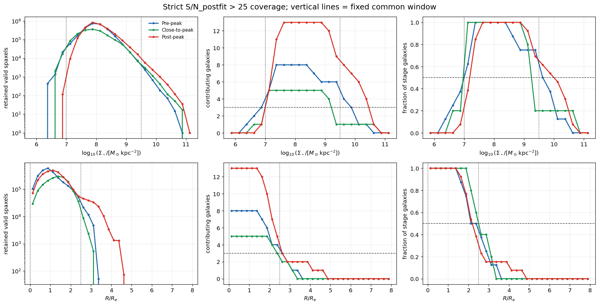
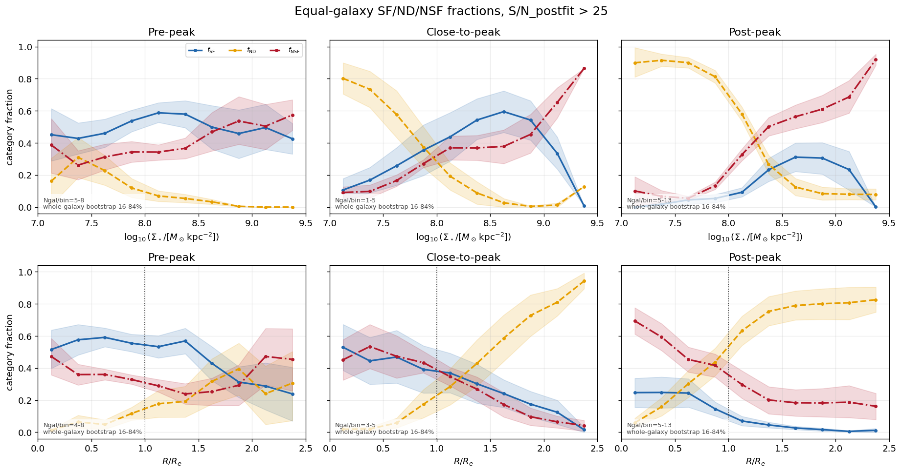
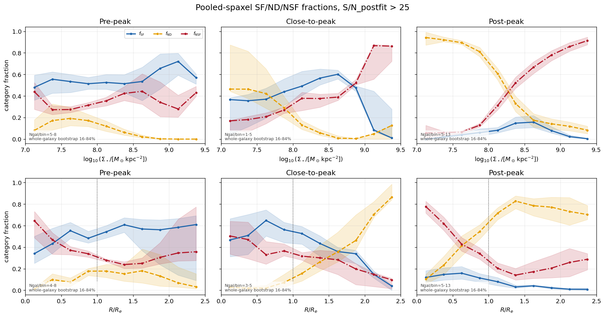
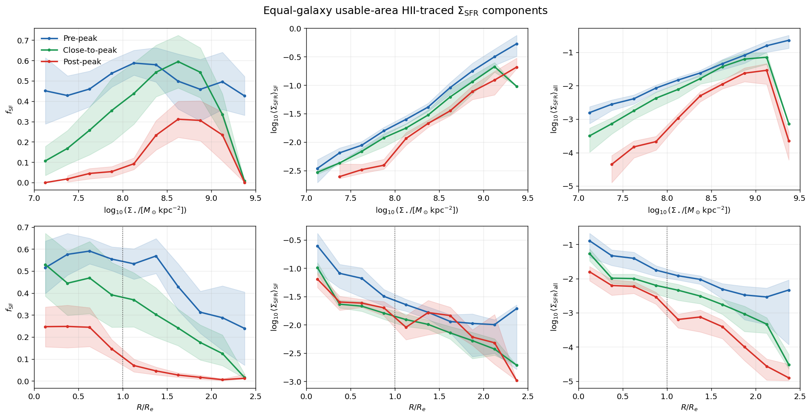
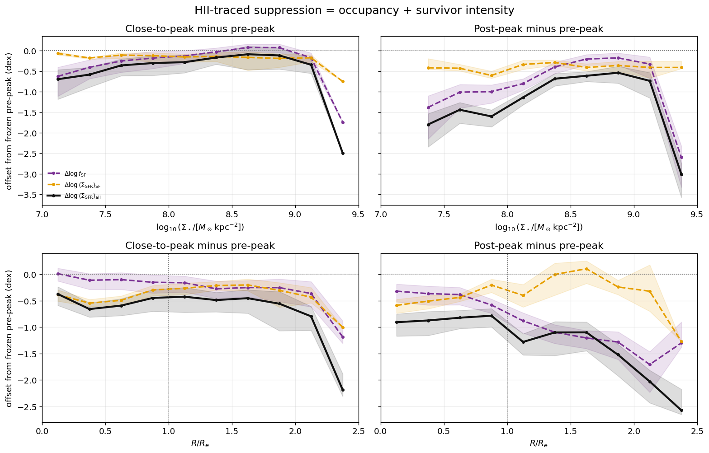
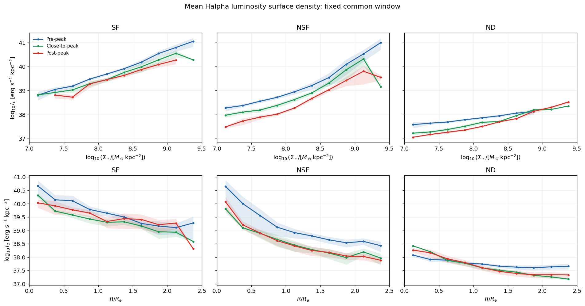
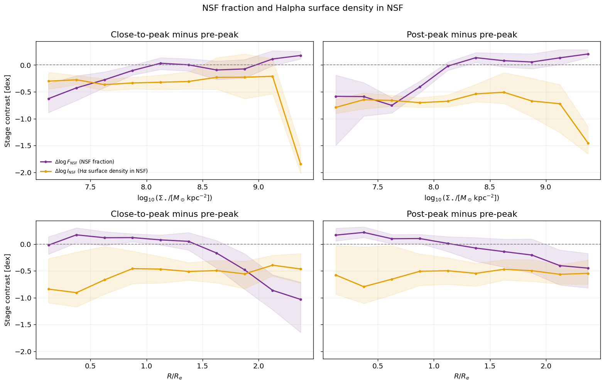
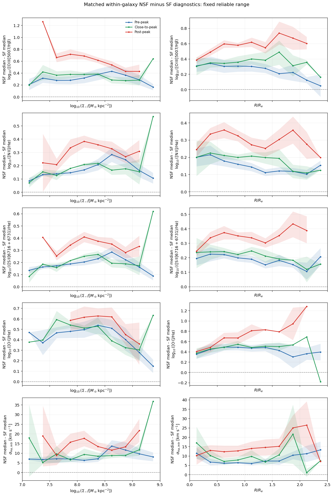
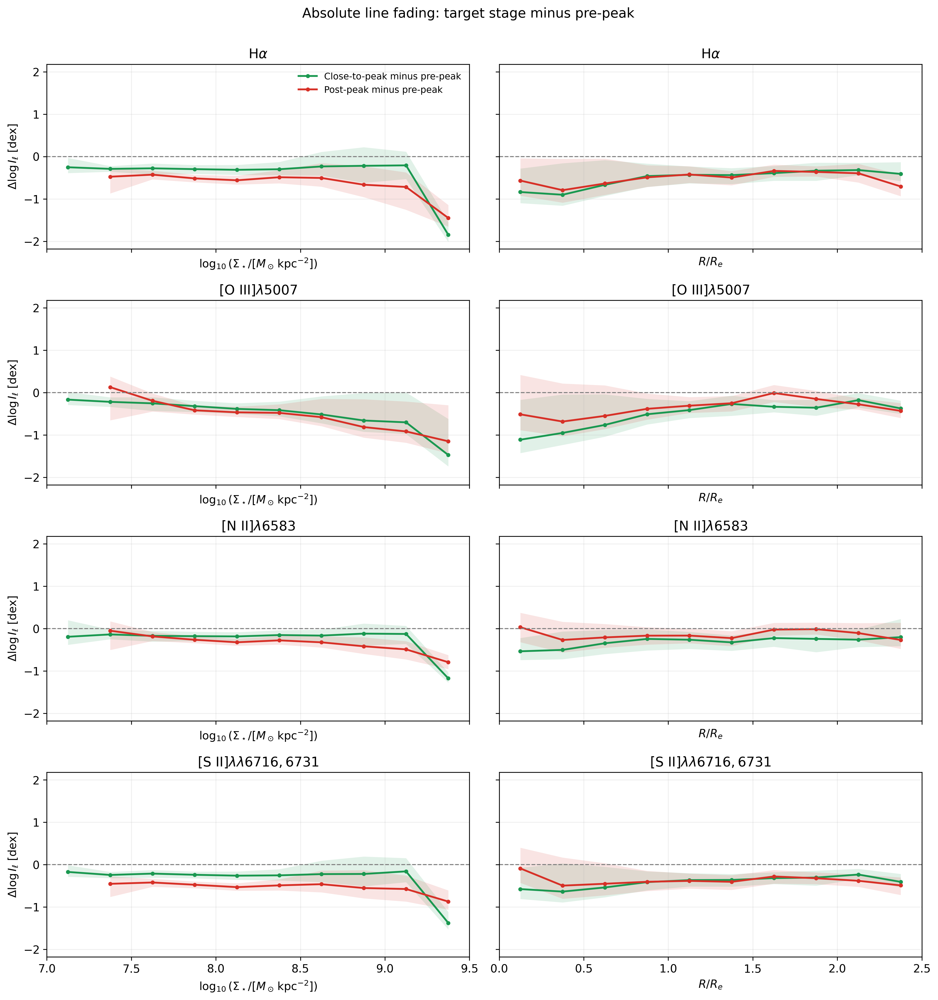
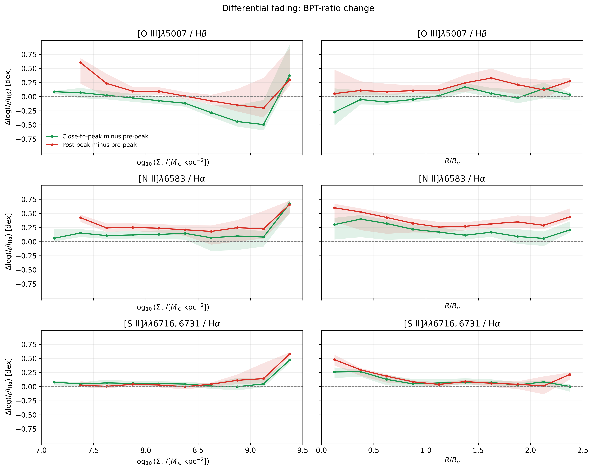

# 20260909 Remained SF and Increasing NSF along Infall Stages

Before everything, we need to define a common window what we still have enough statiscs across 3 infall stages, after `S/N_POSTFIT>25` cut. Here, i think there will be 7-9.5 for stellar mass and 0-2.5 for $R/R_e$. 

The error band is performed by 10000 whole-galaxy bootstrap to represent between-galaxy sampling uncertainty. 

## 1. Revisit $f_\mathrm{SF}$, $f_\mathrm{NSF}$ and $f_\mathrm{ND}$

Still, both equal-galaxy (weighted by each galaxy's contribution in each bin) and pooled-galaxy (unweighted) plots show the same trend: the loss of SF fraction/occupancy becomes increasing ND in low-mass/outer regions while increasing NSF in high-mass/inner regions along infall stages. 

And i think from now on we may take the equal-galaxy weighting as the primay results for analysis and pooled-galaxy as a supplement.

## 2. Surviving SFR Surface Density

Here we need to consider how we do the average of SFR in each bin: is it sum and average only in defined SF regions or average in usable regions (SF+NSF+ND)? I do both and labeled as $\log<\mathrm{SFR_{SF}}>$ and $\log<\mathrm{SFR_{ALL}}>$, respectively. I think the former one should be treated as upper boundary as NSF and ND is not as star-forming as SF region, while the later one is lower boundary as we assumed there is zero SFR in NSF and ND. 

The first column is the $f_\mathrm{SF}$ in 3 infall stages copied from figures above, while the other 2 columns are rSFMS-like plots for $\log<\mathrm{SFR_{SF}}>$ and $\log<\mathrm{SFR_{ALL}}>$. 

If we look at $\log<\mathrm{SFR_{SF}}>$, the upper panel is exactly what we plot and extract from rSFMS. Close-to-peak is systematically 0.2 dex lower than pre-peak sample across the entire range, despite the highest bin that is dominated by a single galaxy. Then going to post-peak, it shows a further 0.2 dex decrease from 8.2 to 9.2, while < 8.2 shows larger decrease. However, if we move on the radial trends, then we can only tell that within $R_e$, we see that both close-to-peak and post-peak tend to shower lower SFR, while outside $R_e$ there is no clear trend.

If we averge SFR across all the area, then both mass and radial trends show clear decending trends of SFR along infall stages.

Simiarly, we can also do the subtraction between 2 target stages and pre-peak stage to visualize this overall SF suppression. 

## 3. Corrected H$\alpha$ emission in SF and NSF across 3 infall stages

H$\alpha$ in ND is just upper limit according to our procedure, so it just plots here for fun.

Since we use corrected H$\alpha$ emission to infer SFR, so the first column here is basically we have seen above. As for NSF, it still shows supperssed and even more seperated H$\alpha$ emission. 

Also we show the subtraction of NSF fraction and H$\alpha$ emission in NSF regions. Clearly, although NSF occupancy increases at high \(\Sigma_\star\) and small \(R/R_e\), the H$\alpha$ intensity of NSF pixels decreases from pre-peak to post-peak. 

I think we can rule out the possibility that NSF rise through the creation of a brighter H$\alpha$-emitting NSF component. Instead, NSF should be becoming visible through the loss or reclassification of SF emission. 

Also, if we look at the line ratios, as expected, we can see harder ionization in NSF than SF. And post-peak is surely highest. This is also true for higher H$\alpha$ line width in NSF and post-peak. 

So this means both Balmer and forbidden lines should be systematically become fainter in NSF than SF, and also along infall stages. But forbidden line intensity decrease less rapidly than Balmer, which resulting the shift in BPT to create more NSF fraction.  

Therefore, the increasing NSF fraction should be understood as differential fading of emission line, especially stronger in Balmer line fading. 