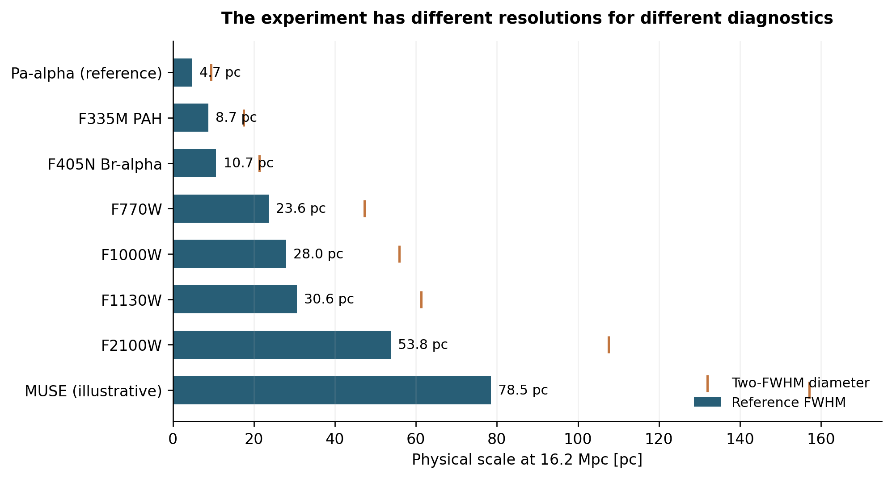

# MAUVE-JWST: how the Virgo environment changes the gas-star-feedback cycle

**A revised Treasury proposal for JWST Cycle 6**  
**12 September 2026 | Expanded working draft based on the supplied Cycle 5 proposal**

**Draft status.** This document supplies a complete scientific narrative, proposed observing design, analysis strategy, public-product plan, and revision record. It retains the original 40-galaxy parent sample and the first two scientific themes, replaces headline TRGB work with a new Goal 3, and removes TRGB-driven depth/halo placement from the baseline. The science-ready diagnostic subsets and charged time require a target-by-target coverage audit, recovery tests, ETC calculations, and a rebuilt APT file. No new observing time or achieved sensitivity is claimed here. This expanded draft must be condensed into the official Cycle 6 attachment before submission; its present length is not the six-page Treasury core-section format. [R23]

**Terminology.** The **Virgo galaxy cluster** is the large-scale environment. A **young stellar cluster** is a compact young stellar population within an individual galaxy; photometric objects are treated as candidates, with young stellar associations analyzed separately. **Old globular clusters** are secondary legacy science and are not the subject of Goal 3. The **ICM** is the hot intracluster medium between Virgo galaxies. Throughout the narrative, stellar feedback means the action of stars on surrounding gas, not an effect produced by the Virgo galaxy cluster itself.

## Abstract

Environmental quenching requires more than a reduction in a galaxy's gas reservoir: it changes the conditions under which gas forms stars and young stars disperse their surroundings. We propose coordinated NIRCam and MIRI imaging to complete the infrared view of 40 disk galaxies in the Virgo galaxy cluster, combining new observations with adequate archival data. The program connects three questions: how recent star formation responds to environmental processing; how dusty ISM structures and grain emission change; and whether young stellar populations emerge from their natal material differently in externally disturbed regions. NIRCam continuum, infrared recombination lines where transmission is adequate, and 3.3-micron PAH imaging will identify obscured young populations and characterize their immediate surroundings. MIRI will measure the larger-scale PAH and warm-dust structures linking those sites to gas redistribution. HST, MUSE, and existing molecular and atomic gas data will constrain stellar populations and environmental context. We will test changes in emergence state at matched stellar age and mass, separating material removal from altered PAH emission and treating clearing times as model-dependent inferences. The resulting mosaics, selection functions, population catalogs, and multiwavelength association products will provide a reusable reference for the gas-star-feedback cycle under environmental disturbance.

## 1. Scientific Justification

### 1.1 The missing link in environmental quenching

As galaxies encounter the hot gas of the Virgo galaxy cluster, their gas can be compressed, displaced, or removed. These changes alter both the amount of material available for star formation and the conditions experienced by young stars. The central unresolved issue is how an external disturbance propagates through the local gas-star cycle: does it primarily remove star-forming area, change star formation within surviving gas, or change how young stars emerge from and disperse their natal material?

The supplied MAUVE program assembles a 40-galaxy parent sample with complementary stellar, ionized-gas, molecular-gas, atomic-gas, and ultraviolet information. Its intended range of gas content and disturbance makes it possible to compare galaxies beyond the most spectacular individual stripping systems. JWST supplies the obscured young populations and infrared material diagnostics that are poorly constrained by the optical view alone. The present design focuses that investment on three linked but distinct measurements: the history of recent star formation, the state of the dusty ISM, and the relationship between young stellar populations and their natal surroundings.

These measurements address different parts of the same physical sequence. A galaxy may lose much of its outer gas while retaining normal emergence behavior in surviving star-forming regions. Alternatively, compression may prolong local obscuration, or removal may expose young stars earlier. PAH emission may also change because grains or their illumination change. Distinguishing these outcomes matters for connecting galaxy-scale gas loss to the physical cycle that regulates the remaining star formation.

### 1.2 Why the existing JWST surveys do not already answer this experiment

J-Virgo provides valuable resolved-stellar and continuum imaging, including useful coverage of disks. Its F115W/F150W/F277W NIRCam observations support stellar populations and distances, but do not provide the targeted infrared recombination, PAH-band, and MIRI combination needed here. We will incorporate its adequate continuum data and request only the coverage and diagnostics still required. The distinction is the measurement enabled by the new filters, not a claim that J-Virgo is confined to halos. [R20]

PHANGS and FEAST have established the power of infrared imaging for the gas-star cycle, and GO 10046 now explicitly targets stellar feedback and cloud disruption in four very nearby galaxies with awarded full-disk 10-pc ALMA mapping. MAUVE's contribution is not finer physical resolution or the first resolved feedback study. It is a controlled comparison of young stellar populations and dusty material across externally disturbed regions and a broad gas-removal sequence in Virgo. [R5, R21, R22]

The reference population must be defined by measured conditions. Nearby-galaxy calibrations already include Virgo members, and other comparison galaxies are interacting or otherwise disturbed. Objects shared with MAUVE will be used as calibration bridges rather than counted as independent controls. Existing infrared data provide both a baseline experiment and training material for recovery tests at the proposed Virgo depth and resolution. [R1-R4, R24]

### 1.3 Goal 1: reconstruct the recent star formation response to environmental processing

We will determine where recent star formation is enhanced or suppressed, and whether the pattern is driven mainly by loss of active area or by changes within surviving star-forming regions. The principal products are spatially resolved recent formation histories and SFR constraints with explicit temporal resolution, completeness, and model uncertainty.

HST plus NIRCam photometry will constrain young stellar cluster candidates and young stellar associations, including populations missing from optical catalogs. We will jointly model formation history, mass distribution, extinction, survival, and selection. This avoids equating a young stellar cluster age histogram with the total galaxy SFH. Synthetic populations passed through the multiband detection and fitting pipeline will determine which changes over the past approximately 100 Myr are recoverable and which require coarser temporal bins. Stochastic stellar-population effects will be included where the stellar mass is too low for a fully sampled IMF approximation.

In the subset with usable infrared recombination imaging, Pa-alpha and/or Br-alpha combined with H-alpha will constrain nebular attenuation and the youngest ionizing populations. UV and 21-micron information will add complementary sensitivity to less recent or dust-reprocessed emission. We will predict the tracers from candidate histories and dust geometries; we will not assign each band a universal fixed SFR averaging window. The same source-selection and age model will support Goal 3, preventing the reuse of one uncertain age catalog as independent evidence for two conclusions.

The key environmental contrasts will be evaluated on common physical scales and common selection domains. A changing fraction of active area and a changing local SFR at fixed surviving gas are different estimands. Both will be reported, with whole-galaxy resampling for population-level conclusions. Inferred processing stages will carry uncertainty rather than being treated as exact pericentric clocks.

### 1.4 Goal 2: determine how environmental processing changes dusty ISM structures and emission

We will map the morphology and emission properties of dusty material from star-forming disks to independently identified disturbed interfaces. NIRCam F335M and MIRI F770W/F1130W trace PAH-rich structures; F1000W and F2100W provide spectral-shape and warm-dust context. The first result will be how the distribution of this emission changes with environmental disturbance, including filamentary structure, asymmetry, compact versus diffuse emission, and association with known gas features.

The analysis will distinguish a change in the amount or distribution of material from a change in emissivity. PAH excitation depends on radiation, charge, and size distribution; a fainter PAH feature is not automatically a lower gas column. We will compare PAH bands and continuum jointly, using available CO and H I information at their actual resolution to constrain larger-scale material changes. Dust/PAH inference will retain heating and abundance degeneracies. [R8, R16]

We will compare emission distributions after matched resolution, sensitivity, and spatial masking. Where an independently tested PAH-to-gas relation is valid, it can be used conditionally; elsewhere the reported quantity remains intensity or morphology. A broadened intensity distribution will not be labeled a turbulent gas-column PDF without independent justification. Similarly, displaced infrared structures will be described as candidates for transported material unless their geometry and available kinematics establish a stronger interpretation.

Goal 2 treats the material field across each galaxy. Source-centered emergence, cavities, and young-population associations belong in Goal 3. This division prevents a new feedback heading from merely duplicating the existing ISM goal.

### 1.5 Goal 3: test environmental regulation of young stellar cluster emergence and natal-cloud clearing

Young massive stars photoionize, heat, and accelerate their surroundings. Measurements of their association with gas have informed numerical early-feedback prescriptions, while HST+JWST now directly resolve emergence-related stellar and nebular populations. [R1, R3, R5] The remaining question for MAUVE is whether external gas compression or removal changes those local relationships after differences in young-population age and mass are accounted for.

The interaction has more than one possible sign. Compression can increase the material that young stars must clear, while removal can lower local columns or open escape paths. Feedback can also transform dense material into a diffuse state more susceptible to stripping, as proposed for NGC 4402. Conversely, simulations show that a modified ISM need not produce a large net change in galaxy-scale stripping. [R9, R10, R13] We will therefore test environmental response without assuming that stronger stripping always produces faster emergence or more efficient feedback.

**Primary measurement.** We will compare the fraction of optically exposed young stellar populations after standardizing to a common distribution of age and stellar mass. A joint optical/infrared selection model will account for missing optical counterparts, foreground attenuation, source confusion, and incomplete detection. Compact young stellar cluster candidates and more diffuse young stellar associations will be modeled separately. The required common completeness limit will be determined by recovery tests rather than assumed to be 10^3 solar masses for all targets.

**Independent material diagnostics.** We will measure compact and extended PAH association, recombination morphology, and warm-dust emission around the same sources. PAH detections will not be required for source selection. A reduction in PAH association without a corresponding change in optical exposure or independently constrained material is evidence for a tracer change, rather than sufficient evidence for natal-cloud clearing. Resolved openings and offsets will be interpreted only above demonstrated size and registration limits.

**Physical discrimination.** Longer obscuration and persistent nearby material at matched age/mass would be consistent with retention or confinement, subject to foreground and natal-condition uncertainties. Greater exposure and reduced surrounding material would be consistent with facilitated dispersal or external removal. Neither pattern alone identifies feedback coupling efficiency. Available gas morphology, MUSE ionization information, and forward-modeled environmental simulations will test which explanations reproduce the joint observables. Directional comparisons will use only independently supported disturbance geometry.

**Population inference.** The fraction of objects in an emergence phase depends on both phase duration and their recent birth rate. We will use Goal 1's joint formation-history model, propagate age/classification covariance, and test rising and declining histories. Absolute clearing times will be reported only where identifiable; otherwise the exposed fractions and association distributions remain the primary results. This prevents an environmental change in formation history from being misidentified as a change in feedback timescale.

**Scientific consequence.** A detected response would identify conditions under which the early gas-star cycle differs during external gas processing. A well-constrained null would show that galaxy-scale gas removal can proceed while local emergence behavior remains similar within the tested domain. These outcomes supply observable targets for simulations. They do not require images alone to yield gas mass-loading factors, momentum coupling, or ionizing-photon escape fractions.

### 1.6 A sample designed around the measurements

The observing parent sample remains the 40 galaxies of the Cycle 5 concept. Each galaxy will contribute only to measurements supported by its available or requested diagnostics. The primary Goal 3 tier requires usable infrared recombination emission, stellar continuum and optical constraints, sufficient recoverable sources, and an overlapping footprint. A second tier supplies broader young-population and dust measurements for Goals 1-2. A directional subset additionally requires independent disturbance geometry. These are nested diagnostic selections, not three interchangeable samples.

The 6 September spreadsheet audit found 18 flags for new paired line imaging. This is a planning input; it neither proves 18 usable galaxies nor excludes compatible archival additions. The final tier membership must incorporate velocity-dependent throughput, inclination, crowding, HST availability, and source counts. Environmentally affected and comparison galaxies must be processed with the same source-recovery procedure.

Individual galaxies are the independent units for the environmental comparison. A hierarchical analysis will retain source-level information while accounting for galaxy effects. As a design scale, if standardized exposed fractions have residual galaxy scatter 0.15, nine galaxies per group would provide approximately 80% power for a 0.20 absolute fraction difference under a simple two-sided normal approximation. This assumed scatter must be replaced by pilot measurements. The target allocation will be justified by the resulting precision rather than by the large number of image pixels.

## 2. Description of Observations

### 2.1 Filter design and the role of each observation

The revised baseline retains **NIRCam F150W, F187N, F300M, F335M, F405N, and F430M**, and **MIRI F770W, F1000W, F1130W, and F2100W**, using adequate archival exposures in place of new observations. F187N/F405N are restricted to regions where line transmission supports the required accuracy. Dedicated deep F090W and halo placement are removed from the baseline because TRGB is no longer a headline driver.

| Data | Measurement | Requirement in the revised design |
|---|---|---|
| HST plus NIRCam continuum | Stellar population properties and optical exposure | Joint selection and age/extinction recovery, including optical non-detections |
| F187N and F405N where usable | Compact ionized sources and attenuation constraints | Corrected line throughput across the velocity field; tested continuum subtraction |
| F300M, F335M, F430M | 3.3-micron PAH and continuum context | Validate the local continuum model, including curvature and hot dust |
| F770W, F1000W, F1130W | PAH structure and spectral-shape diagnostics | Matched PSFs and joint emission interpretation |
| F2100W | Warm-dust emission and obscured complexes | Treat its approximately 54-pc resolution separately from NIRCam source morphology |

F300M and F430M provide an initial continuum model around the PAH feature; a single fixed subtraction coefficient will not be assumed across all sources. If recovery tests show that this continuum basis cannot separate the feature reliably, an additional bracketing observation, such as F360M, must be evaluated with its time cost. This draft does not silently add it to the baseline or claim that it is unnecessary. Existing compatible bands will be used first.

NIRCam short- and long-wavelength exposures must be paired in APT to satisfy the required depth efficiently. Removing the F090W/TRGB driver changes the useful pairing and total time. The former statement that the PAH observations are effectively obtained at no additional cost alongside deep TRGB imaging no longer applies.

### 2.2 Physical resolution and footprint

At 16.2 Mpc, one arcsecond corresponds to 78.5 pc. Pa-alpha has an approximately 5-pc reference resolution, but its comparison with 3.3-micron PAH emission operates near 10 pc or the broader effective continuum-subtracted PSF. MIRI PAH comparisons operate near 24-31 pc, and F2100W near 54 pc. The MUSE information described in the original proposal is approximately 80-pc context. Final measurements will use empirical PSFs and common physical scales. [R17-R19]

Mosaics will prioritize the common star-forming disk and predefined disturbed interfaces with complementary optical and gas data. The footprints must include comparison regions needed by the environmental test; they will not be moved into halos solely for distance work. Diffuse structures will be measured with reduction procedures tested against signal loss and background over-subtraction. A cavity or opening will enter the morphology analysis only when its recovery has been demonstrated at the observed size and background.

*Figure 1. Reference resolution at 16.2 Mpc and a conservative two-FWHM diameter screening scale. These calculated limits show which diagnostic supports each measurement; actual recovery must be tested on the final images.*

### 2.3 Sensitivity and exposure justification

The original design's continuum and diffuse-emission thresholds are retained as starting benchmarks, not as evidence that the revised experiment is already feasible. Its quoted continuum target is S/N above 10 for many 10^3-solar-mass populations with A_V below approximately 5; its diffuse MIRI target is around S/N = 10 at 1-2 MJy/sr. These requirements must be evaluated for the actual morphology, age, extinction, and background distributions.

For the primary Goal 3 sample, the controlling requirement is a common source-recovery domain and a sufficiently unbiased exposed fraction. The proposed pilot targets at least 90% recovery in the adopted mass/age domain and residual differential bias below 0.05 in exposed fraction. It must recover an injected 0.20 fraction difference at the intended galaxy count while reproducing the null false-positive rate. The faint-line requirement will also be checked through line-ratio uncertainty: independent S/N = 10 measurements imply roughly 14% ratio uncertainty before systematics.

ETC calculations will separately treat compact sources, extended nebulae, and diffuse PAH emission. Artificial-source experiments will include continuum-subtraction errors, detector-correlated structure, crowding, and foreground extinction. Raising exposure alone is not assumed to remove systematic residuals. The final APT observations must state per-filter integrations, dithers, backgrounds, and constraints consistent with those tests. **A revised charged-time total is not available from the supplied PDF alone.**

### 2.4 Velocity-dependent eligibility

Systemic recession velocity is insufficient to establish narrow-band coverage. Transmission will be integrated over the spatial velocity field and line profile for each detector/filter configuration. The steep red-side edges of F187N and F405N can make corrected fluxes noisy or uncertain even when some photons remain in band. Regions that fail the line-accuracy requirement will not enter an equivalent line-selected Goal 3 measurement. [R19]

Where infrared lines are unavailable, H-alpha and dust emission can support broader SFR or material analyses under their own assumptions. They will not be presented as replacements with identical extinction sensitivity, physical resolution, or emergence selection. A line-eligible sample biased toward particular velocities or environmental classes requires an explicit selection analysis.

### 2.5 Analysis and robustness

The reduction will provide aligned mosaics, measured PSFs, uncertainty and coverage maps, and alternative background treatments. Source photometry and segmentation will be tested on artificial populations and on nearby comparison data degraded to the Virgo conditions. We will retain upper limits, age/mass posteriors, and correlations between the bands entering both classification and fitting.

Environmental masks and any directional axes will be defined from independent information before evaluating the JWST outcome. Core analyses will use whole-galaxy resampling and common physical resolution. They will test foreground extinction, recent bursts or declines, source confusion, PAH suppression without gas removal, and direct external displacement without modified stellar feedback. Results will be reported as standardized observed relationships; stronger mechanism claims will require agreement across the independent material and dynamical evidence.

## 3. Treasury products and dissemination

The lasting product will be a consistent environmental extension of the nearby-galaxy gas-star-cycle reference data. The shared observing strategy supports multiple scientific questions while making the limits of each diagnostic visible to future users.

We propose three public releases relative to completion of the required observations. Within six months, deliver calibrated mosaics, PSFs, coverage, masks, and uncertainty products with reduction documentation. Within twelve months, release compact young stellar cluster candidate and young stellar association catalogs, line-source catalogs, photometric upper limits, and injection-based selection functions. Within twenty-four months, release vetted emergence-state probabilities, source-to-material associations, matched-resolution maps, environmental metadata with provenance, and reproducible analysis examples. These are proposed commitments, not completed products or guaranteed staffing arrangements.

Enhanced products will be prepared for STScI/MAST dissemination, with a documented mirror and links to complementary surveys where appropriate. The catalogs will preserve which diagnostics are measured, inferred, unavailable, or affected by selection. Their value extends to dust physics, stellar populations, nebular structure, and future modeling of externally disturbed galaxies. Distances and old globular cluster candidates may be included when adequately supported by incidental or archival imaging, without driving the exposure design.

## 4. Supplemental observing justification

### 4.1 Special Requirements

Orientation constraints will be applied only where needed to secure the common disk/interface footprint and valid background fields. Each constraint must be justified by the relevant observation and tested with the current Visit Planner. This draft does not inherit the Cycle 5 schedulability claim after changing the halo and exposure requirements. No special cadence is requested for the primary science.

### 4.2 Justify Coordinated Parallel Observations

The baseline retains the original concept of MIRI off-target background imaging during NIRCam on-target observations where the geometry provides clean, representative sky. Background fields must be checked for diffuse target emission and unrelated structure. If a parallel field is unsuitable, the observation must carry the time cost of a valid alternative. Any non-interruptible sequencing must be tied to an actual background requirement rather than adopted for all observations by default.

### 4.3 Justify Duplications

The program will combine new and adequate archival imaging. The duplication assessment must compare footprint, effective resolution, depth, continuum support, and recovery of the proposed measurement, filter by filter. J-Virgo, PHANGS, and other programs may already supply useful parts of the experiment. Incomplete coverage can justify new mosaics; an asserted universal multiplier in exposure cannot by itself establish a need to repeat existing data.

The former TRGB-based objections to archival F150W depth or halo coverage are withdrawn. Existing F150W can be sufficient for stellar-population work even when it is unsuitable for a deep TRGB measurement. New continuum exposures must therefore be justified by young-population recovery, and line repetitions by line/continuum accuracy after a demonstrated reduction comparison. The legacy "12 of 40 with adequate existing data" statement is an input to re-audit, not a validated current count.

### 4.4 Other facilities

HST stellar/nebular imaging, MUSE spectroscopy, ALMA molecular gas, VLA H I, and ultraviolet data provide the complementary context described in the Cycle 5 proposal. Their actual availability and overlapping footprints must be recorded in the final target matrix. This draft makes no new joint-facility time request or simultaneous-observation requirement. Necessary but incomplete ancillary coverage is an explicit dependency, not data already in hand.

## 5. Revision record and submission completion items

This section is for internal preparation and is not part of the intended six-page scientific attachment.

| Cycle 5 component | Revised treatment |
|---|---|
| Goal 1: definitive SFH and complete populations | Joint formation/selection model; validated age resolution and completeness; preserve the recent-SFH question |
| Goal 2: PAHs as direct gas-column and turbulence probes | Material morphology plus emissivity diagnostics; gas conversion conditional on independent validation |
| Goal 3: precise TRGB distances for all targets | Replace with young stellar emergence and natal-cloud clearing; distances become supporting products |
| F090W/F150W TRGB depth and halo placement | Remove as observing drivers; retain F150W for stellar continuum; restore any F090W only if independently justified |
| Universal line-based science across 40 galaxies | Explicit diagnostic tiers and a line-eligibility/coverage calculation |
| Field-to-Virgo novelty claim | Test specific externally disturbed regions; acknowledge Virgo objects in existing calibrations |
| Generic legacy value | Named products, selection functions, uncertainty/provenance, and proposed release milestones |

The principal open quantities are the final diagnostic-tier membership, achieved source completeness and classification bias, measurable effect size, target/filter integration times, footprint polygons, background geometry, revised charged hours, and scheduling feasibility. They must be filled by actual calculations before the scientific claims are made unconditional. The existing 55.7-hour science, 7.6-hour parallel, and 156.3-hour charged totals belong to the supplied Cycle 5 design and are not adopted as the revised request.

The final attachment must use the current official format and retain its six-page Treasury core limit; supplemental material has a separate one-page allowance. The applicable policy also requires disclosure of generative-AI-derived material with the references. [R23] For this draft, a factual disclosure record is: "OpenAI Codex desktop, GPT-6-based assistant, 12 September 2026; used for literature discovery and checking, scientific critique, draft text, illustrative calculations, and document preparation. The exact application/model version and final usage timestamps must be copied from the session record before submission. Scientific authors must verify the submitted content." This is a preparation record, not a claim that the team has already completed that verification.

## Appendix A. Preserved parent sample

These names preserve the original 40-galaxy planning sample as transcribed in the 6 September audit. They are not a final observing table, tier assignment, or current coordinate/velocity catalog:

NGC 4064, NGC 4189, NGC 4192, NGC 4216, NGC 4222, NGC 4254, NGC 4293, NGC 4294, NGC 4298, NGC 4302, NGC 4321, NGC 4330, NGC 4351, NGC 4380, NGC 4383, NGC 4388, NGC 4394, NGC 4396, NGC 4402, NGC 4405, NGC 4419, NGC 4424, NGC 4450, NGC 4457, IC 3392, NGC 4501, NGC 4522, NGC 4535, NGC 4548, NGC 4567, NGC 4568, NGC 4569, NGC 4579, NGC 4580, NGC 4606, NGC 4607, NGC 4654, NGC 4689, NGC 4694, and NGC 4698.

## References

Reference identifiers match the companion scientific-justification report; gaps identify references not cited in this proposal. The supplied Cycle 5 PDF and the dated 6 September review are internal source documents. No TAC feedback was supplied.

- **[R1]** Keller, B. W., Kruijssen, J. M. D., & Chevance, M. 2022. *Empirically-motivated early feedback: momentum input by stellar feedback in galaxy simulations inferred through observations.* [Paper](https://arxiv.org/abs/2206.06391).
- **[R2]** Chevance, M., et al. 2020. *The lifecycle of molecular clouds in nearby star-forming disc galaxies.* [Paper](https://arxiv.org/abs/1911.03479).
- **[R3]** Chevance, M., et al. 2022. *Pre-supernova feedback mechanisms drive the destruction of molecular clouds in nearby star-forming disc galaxies.* [Paper](https://arxiv.org/abs/2010.13788).
- **[R4]** Kim, J., et al. 2022. *Environmental dependence of the molecular cloud lifecycle in 54 main sequence galaxies.* [Paper](https://arxiv.org/abs/2206.09857).
- **[R5]** Pedrini, A., et al. 2026. *The emerging timescale of young star clusters regulated by cluster stellar mass.* [Article](https://www.nature.com/articles/s41550-026-02857-y).
- **[R8]** Kim, J., et al. 2025. *Time-scales of polycyclic aromatic hydrocarbon and dust continuum emission from gas clouds compared to molecular gas cloud lifetimes in PHANGS-JWST galaxies.* [Paper](https://arxiv.org/abs/2506.10063).
- **[R9]** Cramer, W. J., et al. 2020. *ALMA evidence for ram pressure compression and stripping of molecular gas in the Virgo cluster galaxy NGC 4402.* [Paper](https://arxiv.org/abs/1910.14082).
- **[R10]** Choi, W., Kim, C.-G., & Chung, A. 2022. *Ram pressure stripping of the multiphase ISM: a detailed view from TIGRESS simulations.* [Paper](https://arxiv.org/abs/2207.05263).
- **[R13]** Akerman, N., et al. 2024. *The surprising lack of effect from stellar feedback on the gas stripping rate from massive jellyfish galaxies.* [Paper](https://arxiv.org/abs/2311.04964).
- **[R16]** Draine, B. T., et al. 2021. *Excitation of PAH Emission: Dependence on Size Distribution, Ionization, and Starlight Spectrum and Intensity.* [DOI](https://doi.org/10.3847/1538-4357/abff51).
- **[R17]** STScI. [NIRCam Point Spread Functions](https://jwst-docs.stsci.edu/jwst-near-infrared-camera/nircam-performance/nircam-point-spread-functions).
- **[R18]** STScI. [MIRI Point Spread Functions](https://jwst-docs.stsci.edu/jwst-mid-infrared-instrument/miri-performance/miri-point-spread-functions).
- **[R19]** STScI. [NIRCam Filters](https://jwst-docs.stsci.edu/jwst-near-infrared-camera/nircam-instrumentation/nircam-filters).
- **[R20]** Weisz et al. J-Virgo GO 7763. [Official public program PDF](https://www.stsci.edu/jwst-program-info/download/jwst/pdf/7763/).
- **[R21]** Leroy et al. GO 10046, *Resolving Stellar Feedback in Action via NIRCam and MIRI Imaging of Very Nearby Galaxies.* [Official public program PDF](https://www.stsci.edu/jwst-program-info/download/jwst/pdf/10046/).
- **[R22]** Lee, J. C., et al. 2023. *The PHANGS-JWST Treasury Survey: Star Formation, Feedback, and Dust Physics at High Angular Resolution in Nearby Galaxies.* [Paper](https://arxiv.org/abs/2212.02667).
- **[R23]** STScI. [JWST Preparing the Proposal PDF Attachment, Cycle 6](https://jwst-docs.stsci.edu/jwst-opportunities-and-policies/jwst-call-for-proposals-for-cycle-6/jwst-preparing-the-proposal-pdf-attachment).
- **[R24]** Scheuermann, F., et al. 2022. *Planetary nebula luminosity function distances for 19 galaxies observed by PHANGS-MUSE.* [Article](https://academic.oup.com/mnras/article/511/4/6087/6510829).
