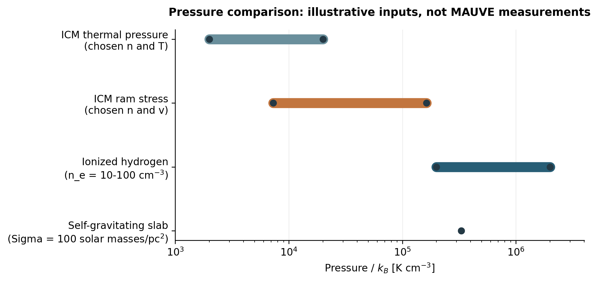
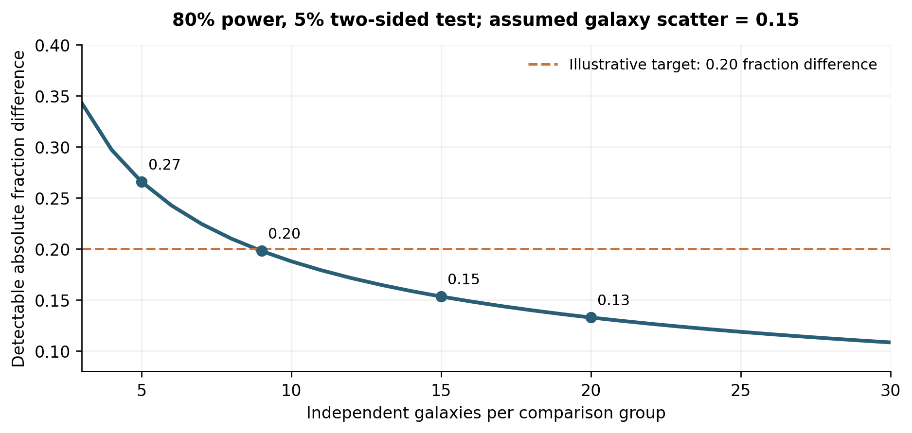

# Can MAUVE-JWST test environmental regulation of young stellar feedback?

**Scientific justification, observational limits, and a decision on the revised Goal 3**  
**12 September 2026 | Internal research report**

## 1. Decision and terminology

**Yes, a carefully defined Goal 3 is scientifically worthwhile and accessible to JWST imaging combined with HST and the available gas data. However, the defensible primary experiment is to measure how young stellar populations emerge from their dusty surroundings under environmental disturbance. Imaging alone cannot uniquely establish whether the Virgo intracluster medium confines feedback, measure feedback coupling efficiency, or separate stellar clearing from direct environmental removal in every region.**

I recommend the headline **"Environmental regulation of young stellar cluster emergence and natal-cloud clearing."** The physical question beneath it is: *Does externally driven gas compression or removal change the relation between young stellar populations and their surrounding material?* Pressure confinement, facilitated clearing, and little local change are competing interpretations to test, not promised discoveries.

The wording in the 6 September report needs two corrections. "Feedback prescriptions calibrated in ordinary nearby galaxies" refers to a real class of models, but it conflates numerical prescriptions with empirical benchmarks and suggests a cleaner comparison sample than exists. Also, "does the environment confine or assist young stellar feedback?" is too direct as an observational promise. A change in the visible surroundings of young stars does not by itself measure a change in their momentum or energy coupling.

**Terminology used throughout this report and the companion proposal:**

| Term | Meaning in these documents |
|---|---|
| Virgo galaxy cluster | The collection of galaxies and hot gas constituting Virgo; the large-scale environment |
| Virgo intracluster medium (ICM) | Hot plasma between the galaxies in the Virgo galaxy cluster |
| Young stellar cluster | A compact young stellar population inside one galaxy; photometrically selected objects remain candidates unless their physical nature is established |
| Young stellar association | A more diffuse young stellar population; it is analyzed separately from compact young stellar cluster candidates |
| Old globular cluster | An old compact stellar system; this is not the subject of the proposed Goal 3 |
| Natal cloud | The gas and dust associated with the formation of a young stellar population |
| Stellar feedback | Radiation, photoionization, stellar winds, and supernovae from stars acting on surrounding gas |

"Young stellar cluster" does not imply that gravitational boundedness has been measured. Compact associations, blends, and individual luminous stars can contaminate a photometric sample. "Cluster" without a qualifier is avoided in the scientific narrative; published reference titles retain their original wording.

## 2. What exactly is a feedback prescription?

### 2.1 A numerical rule, an observational benchmark, and a physical theory are different

A **numerical feedback prescription** specifies how a simulation deposits energy, momentum, mass, metals, or radiation from a stellar population into surrounding resolution elements. It can include an injection history, spatial distribution, cooling treatment, and dependence on local gas conditions. Some prescriptions approximate unresolved physics; others explicitly solve more of the relevant processes. Their calibration data and validation data need not be the same.

An **empirical feedback benchmark** is an observed or statistically inferred quantity that a model should reproduce: for example, the duration of spatial association between CO and ionized emission, or the emergence-state distribution of young stellar populations. These quantities depend on tracer definitions, selection, spatial resolution, and assumptions about the history of source formation. They are not interchangeable measurements of one universal "feedback timescale."

A **physical mechanism** is a causal process such as photoionization-driven expansion. Evidence that a model reproduces a benchmark does not uniquely establish which mechanism produced it. Several combinations of gas structure, stellar input, and external forcing may produce similar projected images.

### 2.2 The direct reference for my earlier statement

**Keller, Kruijssen & Chevance (2022)** introduced empirically motivated early feedback, an explicit numerical prescription. They used cloud sizes, star formation efficiencies, and gas-star overlap durations to infer an early momentum-injection model. Their adopted sample medians were a feedback duration of about **3.3 Myr** and a specific momentum normalization of **377 km/s**, with a remaining expansion-history parameter. The velocity unit here denotes momentum per stellar mass, not a measured gas speed. [R1]

This supplies a concrete reference for the phrase "observationally calibrated feedback prescription." It does **not** imply that a JWST cavity size or an embedded fraction directly measures that prescription's parameters. A comparison requires mock observations of the model and the same tracer definitions.

The calibration includes NGC 300, 628, 3351, 3627, 4254, 4303, 4321, 4535, 5068, and 5194. Four are Virgo members: NGC 4254, 4303, 4321, and 4535. Thus a claim of the first transfer from field galaxies to Virgo would be incorrect. [R1-R3, R24]

### 2.3 The observational reference chain

| Reference | Relevant result | What it supports for MAUVE |
|---|---|---|
| Chevance et al. 2020 and 2022 [R2, R3] | CO and H-alpha spatial statistics constrain a short overlap phase after exposed massive-star formation becomes visible | A physical reason to investigate early clearing; a method with explicit tracer and population assumptions |
| Kim et al. 2022 [R4] | Cloud-lifecycle measurements extended to 54 main-sequence galaxies, including environmental dependencies | Existing environmental work must be acknowledged; Virgo membership alone is insufficient novelty |
| Pedrini et al. 2026 [R5] | HST+JWST measurements in four galaxies find young stellar cluster emergence dependent on stellar mass | A direct observational precedent for the proposed type of measurement |
| Knutas et al. 2025 [R6] | M83 analysis reports an average emergence duration around 6 Myr, with mass dependence | A worked example; the earlier report's approximately 7-Myr shorthand should not be treated as the full-population average |
| Ramambason et al. 2026 [R7] | A 37-galaxy analysis finds the dust-embedded to exposed transition typically shorter than 4 Myr | A second, differently defined benchmark, not a contradiction of longer full-emergence durations |
| Kim et al. 2025 [R8] | PAH/dust emission lifetimes depend on illumination and ISM structure as well as gas evolution | A reason to avoid interpreting disappearance of PAH emission as an unambiguous gas-removal clock |

Pedrini et al. use compact recombination and PAH emission plus optical detections to define stages, with phase counts normalized to a 10-Myr window. They infer emergence around 5 Myr for higher-mass young stellar clusters and 7-8 Myr for lower-mass examples above their approximate 10^3-solar-mass completeness boundary. Their comparison includes interacting M51 and a low-metallicity dwarf, not four identical undisturbed disks. Absolute ages, completeness, and stage definitions matter. Their several-parsec photometric scale is encouraging, but does not establish equal performance at Virgo's distance. [R5]

**Recommended replacement for the earlier sentence:** "We will test whether the observed relationships between young stellar population properties, emergence state, and surrounding material persist in regions experiencing externally driven gas compression or removal." Model implications should follow this observable statement.

## 3. Does the physical question make sense?

### 3.1 There are two directions of influence

First, external forcing can change the material against which stellar feedback acts. Compression can increase density, recombination, cooling, or confining stress. Removal can lower the surrounding column or open paths through which hot gas and photons escape. These effects need not change the intrinsic stellar energy production at a given stellar age, mass, and metallicity.

Second, stellar feedback can change how susceptible gas is to environmental removal. Dispersing dense natal material into a diffuse phase can make that gas easier to accelerate. This is **feedback-assisted stripping**, which is distinct from **stripping-assisted emergence**. One concerns the fate of gas in a galaxy; the other concerns the immediate visibility and surroundings of young stars. They may coexist, but observing one does not prove the other.

Goal 3 tests local emergence; Goal 2 maps galaxy-scale material redistribution. Together they constrain these two directions of influence through distinct observables.

### 3.2 A pressure calculation places an important limit on the hypothesis

For illustrative hot gas of total particle density n_ICM and mean particle mass mu m_p,

$$
P_{\rm ram}=\rho_{\rm ICM}v^2=\mu m_p n_{\rm ICM}v^2.
$$

$$
\frac{P_{\rm ram}}{k_B}=7.27\times10^3\left(\frac{\mu}{0.6}\right)\left(\frac{n_{\rm ICM}}{10^{-4}\,{\rm cm}^{-3}}\right)\left(\frac{v}{1000\,{\rm km\,s}^{-1}}\right)^2\,{\rm K\,cm}^{-3}.
$$

The density definition is essential: an electron density is not the same as the total particle density used here. These chosen values illustrate parameter dependence; they are not measured pressures for the proposed targets. For n_ICM between 10^-4 and 10^-3 cm^-3 and speeds of 1000-1500 km/s, this expression spans approximately **7.3 x 10^3 to 1.6 x 10^5 K cm^-3**. At a chosen temperature of 2 x 10^7 K, the corresponding thermal pressure is 2 x 10^3 to 2 x 10^4 K cm^-3.

For nearly fully ionized hydrogen at temperature T_i,

$$
\frac{P_{\rm HII}}{k_B}\simeq2n_eT_i=2\times10^5\left(\frac{n_e}{10\,{\rm cm}^{-3}}\right)\left(\frac{T_i}{10^4\,{\rm K}}\right)\,{\rm K\,cm}^{-3}.
$$

Dense H II regions with n_e = 100 cm^-3 have a thermal-pressure scale around 2 x 10^6 K cm^-3. As another comparison, the self-gravitating slab pressure scale is

$$
\frac{P_{\rm grav}}{k_B}\simeq\frac{\pi G\Sigma^2}{2k_B}=3.31\times10^5\left(\frac{\Sigma}{100\,M_\odot\,{\rm pc}^{-2}}\right)^2\,{\rm K\,cm}^{-3}.
$$

The last expression is a slab estimate, not the exact pressure of a turbulent spherical natal cloud. Together these calculations show why **direct confinement of every compact H II region by the ICM is not a credible default**. The external stress can be dynamically relevant for lower-pressure envelopes and diffuse structures, while dense interiors remain dominated by their own conditions. Changes to the surrounding ISM, rather than direct pressure on each dense core, may be the principal route.

*Figure 1. Calculated pressure scales for explicitly chosen inputs, not MAUVE measurements. Ram pressure is a directional stress and cannot be applied as isotropic confinement over every face of a natal cloud. The comparison motivates tests in diffuse envelopes and disturbed disk interfaces rather than a universal claim about dense H II regions.*

### 3.3 Ram pressure is directional; confinement and clearing can coexist

The normal stress on an idealized surface contains thermal pressure and a term proportional to rho times the square of the normal relative velocity. The upstream boundary can experience greater compression while a downstream opening allows venting. Shielding by other gas, an oblique flow, magnetic fields, mass exchange, and the geometry of the hot phase modify this simple picture.

Consequently, an isotropic pressure ratio is only a scale check. It does not predict an emergence time or a unique morphology. A low-density path can increase escape of hot gas while reducing the momentum deposited into adjacent dense material. **Faster visible emergence therefore need not mean more efficient feedback coupling.** Likewise, a small apparent cavity could indicate high density, young age, projection, a weak source, or confining stress.

## 4. What the environmental literature actually establishes

| Evidence | Supported conclusion | Limit relevant to Goal 3 |
|---|---|---|
| Cramer et al. 2020, NGC 4402 [R9] | Observed molecular compression and displaced gas; authors propose that feedback facilitates stripping by cycling gas to lower density | The feedback link is an interpretation, not a measured young stellar cluster clearing time |
| Choi, Kim & Chung 2022, TIGRESS [R10] | Hot ICM enters low-density channels; mixing and phase changes transfer momentum; compression and quenching depend on forcing | A multiphase environmental mechanism, not a ready-made JWST age-to-cavity prediction |
| Lee et al. 2020 [R11] | Radiation-hydrodynamic models show competing star formation enhancement and suppression under different winds | Does not establish a universal sign for young stellar emergence |
| Kulier et al. 2023, EAGLE [R12] | Feedback and hydrodynamic compaction can have opposing effects on stripping | Galaxy-scale model with unresolved natal clouds; not a direct prediction at JWST scales |
| Akerman et al. 2024 [R13] | In their massive-galaxy simulations, feedback changes the ISM but produces little net change in global stripping | A relevant counterexample to inevitable synergy; not proof of unchanged local emergence |
| Silich et al. 2020, NGC 5253 [R14] | Dense natal conditions can confine stellar-wind structures in a model of a massive young stellar cluster | Local turbulent pressure is not interchangeable with Virgo ICM pressure |
| Williamson & Martel 2018 [R15] | Surrounding halo gas can confine large-scale outflows in dwarf-galaxy models | Different environment and scale from a compact natal cloud in a Virgo disk |

This evidence supports asking the question, but does not support asserting its answer. The comparison of Kulier and Akerman is particularly useful: a change to gas structure need not translate into a larger total stripping rate. Their differing setups and scales preclude interpreting them as an otherwise identical controlled disagreement.

A second distinction concerns calibration. For example, the EAGLE implementation discussed by Kulier et al. uses thermal feedback calibrated to galaxy demographic properties. That is a different calibration target from cloud clearing or young stellar emergence. A proposal should not imply that all simulations use the Keller prescription or that a single new JWST measurement recalibrates every feedback model. [R12]

## 5. What JWST can resolve in Virgo

At the original proposal's fiducial distance of 16.2 Mpc,

$$
\ell=78.54\left(\frac{D}{16.2\,{\rm Mpc}}\right)\left(\frac{\theta}{1\,{\rm arcsec}}\right)\,{\rm pc}.
$$

| Diagnostic | Representative angular FWHM | Physical FWHM at 16.2 Mpc | Defensible role |
|---|---|---|---|
| NIRCam Pa-alpha | Approximately 0.06 arcsec | 4.7 pc | Locate compact ionized sources and measure larger nebular structures |
| NIRCam F335M | Approximately 0.111 arcsec | 8.7 pc | Compact PAH association and nearby PDR morphology |
| NIRCam F405N | Approximately 0.136 arcsec | 10.7 pc | Less attenuated recombination emission where throughput is adequate |
| MIRI F770W | 0.301 arcsec | 23.6 pc | PAH structures around larger complexes |
| MIRI F1000W | 0.356 arcsec | 28.0 pc | Continuum and spectral-shape context |
| MIRI F1130W | 0.390 arcsec | 30.6 pc | PAH ratios and larger-scale morphology |
| MIRI F2100W | 0.685 arcsec | 53.8 pc | Warm-dust emission from complexes and surrounding diffuse material |
| MUSE, illustrative seeing | 1 arcsec | 78.5 pc | Ionization and dynamical context on its own resolution scale |

NIRCam values are approximate reference PSFs, and the MIRI values are current on-sky tabulated FWHMs. Actual mosaics require measured PSFs. Continuum subtraction can broaden the effective response if the continuum image has a larger PSF. [R17-R19]

**The full experiment is not a uniform 5-pc experiment.** Pa-alpha plus F335M morphology is limited by the poorer effective resolution, and F430M-based continuum subtraction can impose a further constraint. PAH ratios involving F1130W require roughly 31-pc resolution; ratios involving F2100W require roughly 54 pc. HST and JWST registration errors must also enter offset uncertainties.

As a conservative screening rule, a cavity should span at least two effective FWHMs in diameter before interpreting its shape. This is approximately 20 pc for a 10-pc NIRCam product, 61 pc for F1130W, and 108 pc for F2100W. It is a proposed recovery criterion, not a theorem: injection tests must determine the actual minimum. Sub-beam centroids can sometimes be measured precisely, but do not resolve sub-beam shell structure.

*Figure 2. Reference PSF scales at 16.2 Mpc. The doubled values illustrate a conservative diameter threshold for morphology; they do not represent achieved recovery. NIRCam provides the central young-population experiment, MIRI its coarser dust context, and MUSE still coarser spectroscopy.*

## 6. An identifiable observational experiment

### 6.1 The primary outcome should be emergence state, not feedback efficiency

Use a joint catalog of compact young stellar cluster candidates and, separately, young stellar associations. Build it from stellar continuum, recombination emission where usable, and optical information. Do not require a PAH detection for entry: destruction or weak excitation of PAHs is itself one of the environmental possibilities.

The primary statistic should be the **optically exposed fraction of the selected young stellar population, standardized to a common distribution of stellar mass and age**, with optical non-detections handled through the selection model. "Exposed" must have a reproducible photometric definition using the expected optical detectability, not a visual label selected after looking at environmental trends. Both foreground extinction in the galaxy disk and local natal obscuration contribute to the measurement and must be modeled or controlled.

Measure a complementary, separate axis: compact PAH association, extended PAH association, or no recovered PAH association around each source. Also retain recombination morphology and warm-dust fluxes. Separating optical exposure from PAH state is essential: a PAH-poor but optically obscured young stellar population is a different result from an exposed population with a genuine surrounding cavity.

The environmental comparison should condition on young stellar population mass, age, and relevant pre-existing galaxy properties. Its principal result is a standardized difference in exposed fractions, with a secondary test of PAH association and resolved geometry. **This is a measurable environmental response; identifying its causal mechanism is a subsequent inference.**

### 6.2 Separate three physical explanations and a null outcome

| Conditional explanation | Joint observational pattern to test | Essential alternative to exclude |
|---|---|---|
| Longer retention of local material | Lower exposed fraction at comparable age/mass, persistent local attenuation and compact material, compatible gas context | Foreground disk extinction, different recent formation history, or selection against faint exposed sources |
| Faster removal or dispersal around young stars | Higher exposed fraction at comparable age/mass, less material nearby and/or resolved asymmetric openings | Removal by the external flow without enhanced stellar feedback; projection and source drift |
| Changed PAH emissivity or grain population | PAH association weakens without the corresponding change in exposure or independently constrained gas distribution | A false clearing inference based on PAH disappearance alone |
| No resolved environmental response | Similar standardized exposure and association distributions within a useful uncertainty bound | An insensitive sample or a signal erased by PSF mixing |

These are conditional patterns, not unique templates or mutually exclusive physical states. Compression and removal can operate in different directions within one star-forming complex. The purpose of the additional tracers is to restrict interpretations, not to declare a one-to-one mapping from a morphology to a mechanism.

### 6.3 A changing formation history breaks the simple phase-count clock

For phase j, the expected observed count can be written schematically as

$$
N_j=\int B_{\rm YSC}(t_0-\tau,M,\mathbf{x})\,p_j(\tau,M,\mathbf{x})\,C_j(\tau,M,\mathbf{x})\,d\tau\,dM\,d\mathbf{x}.
$$

B_YSC is the birth rate of the modeled young stellar population, p_j includes phase occupancy and survival in the selected class, and C_j is its selection function. Extinction, measurement errors, and environment can be additional latent variables. An optical catalog and an infrared catalog can have different selection functions even for the same nominal mass limit.

Under restrictive steady formation and completeness assumptions, phase fractions can estimate relative durations. In a galaxy undergoing suppression or a burst, a large embedded fraction can instead reflect a recent increase in formation. Age estimates also use some of the same bands that define emergence, so errors can correlate with the classification. Goals 1 and 3 must therefore share a joint forward model, with stellar age information tested independently of the PAH classification where possible.

Report phase fractions and association statistics even when an absolute clearing time is not identifiable. Do not rename a MIR visibility time, a CO-H-alpha overlap time, and a full young stellar emergence time as the same quantity.

### 6.4 Environmental classification and causal scope

Use existing gas morphology, kinematics, and other independent evidence to assign environmental disturbance and uncertainty before measuring the JWST response. A projected galaxy position or a coarse gas asymmetry is not a measured three-dimensional wind vector. Directional tests should be restricted to systems with adequate independent geometry; other targets contribute to non-directional comparisons.

Two analyses answer different questions. A total environmental response allows gas content and local structure to change as part of the pathway. A comparison at fixed present-day gas column asks about surviving regions under similar measured conditions. Matching on current gas column can remove part of the environmental effect, and neither analysis reconstructs the unobserved natal conditions perfectly. Report these interpretations separately.

To claim a specific feedback-wind interaction, compare synthetic observations from controlled models with both effects varied. For an outcome Y, the interaction contrast is

$$
\Delta_{\rm int}=(Y_{11}-Y_{01})-(Y_{10}-Y_{00}),
$$

where the first index indicates stellar feedback enabled and the second indicates an external wind. A nonzero contrast tests non-additivity in that model. Removing feedback also changes the source population, so simulations need matched initial conditions, ensemble realizations, and comparisons at stated ages or evolutionary stages. Real galaxies cannot supply all four counterfactual states. Observations constrain the credible models through their joint predictions.

## 7. Feasibility: what is supported and what remains unproven

### 7.1 Diagnostic coverage is more limiting than the nominal 40-galaxy count

The supplied Cycle 5 document targets 40 galaxies but explicitly omits paired F187N/F405N imaging when recession velocities compromise transmission. The 6 September review counted 18 affirmative new-Pa-alpha flags in the linked planning spreadsheet. **That is a dated planning snapshot, not a newly verified 18-galaxy science-ready sample.** Usable archival line data may add targets; coverage, inclination, source counts, sensitivity, and quality cuts may remove them.

Adopt a diagnostic tier rather than implying every galaxy supports every inference. The primary emergence tier requires usable infrared recombination emission, continuum and optical constraints, and a defensible selection function. Other galaxies can support Goals 1-2 and broader dust statistics without being silently substituted into the primary Goal 3 sample. H-alpha plus 21-micron emission is not equivalent to an infrared recombination-selected compact-source sample.

The filter transmission must be integrated over each target's velocity field and line profile. The F187N and F405N half-power red edges correspond approximately to recession speeds of 1500 and 1750 km/s for Pa-alpha and Br-alpha, respectively. These are rough diagnostic numbers, not sharp eligibility cuts. Rotation, line width, detector-dependent throughput, and correction uncertainty matter. [R19]

### 7.2 Depth must be specified for the actual measurement

The original proposal lists S/N above 10 for many 10^3-solar-mass young stellar populations with A_V below approximately 5, and line surface-brightness targets of 4 x 10^-16 and 4 x 10^-17 erg/s/cm^2/arcsec^2 for Pa-alpha and Br-alpha. These are inherited design goals, not validated completeness limits for every age, crowding level, and emergence stage.

For scale, an illustrative intrinsic line luminosity of 10^37 erg/s corresponds to

$$
F=3.18\times10^{-16}\left(\frac{L}{10^{37}\,{\rm erg\,s}^{-1}}\right)\left(\frac{D}{16.2\,{\rm Mpc}}\right)^{-2}\,{\rm erg\,s}^{-1}{\rm cm}^{-2}.
$$

An attenuation of one magnitude at that line reduces this flux by a factor of 0.398. This luminosity is only a benchmark, not a prediction for a 10^3-solar-mass young stellar cluster. Stellar age, IMF sampling, ionizing-photon losses, and nebular conditions determine the latter. A surface-brightness sensitivity cannot be converted into a point-source recovery limit by multiplying by an arbitrarily small aperture.

For independent line measurements each at S/N = 10, the fractional ratio error is approximately 14%, corresponding to 0.154 mag in differential attenuation before systematic errors. Continuum subtraction, throughput correction, calibration, and PSF matching add uncertainty. This makes the requirement for S/N in the fainter line scientifically interpretable; it does not demonstrate that the proposed exposure achieves it.

### 7.3 Sample power must be counted by galaxy

Hundreds of sources within one galaxy do not provide hundreds of independent realizations of its environmental history. Use a hierarchical model with a galaxy effect, or standardized per-galaxy summaries with equal galaxy weight and whole-galaxy resampling. Analyze compact young stellar cluster candidates and young stellar associations separately before any justified combination.

For an illustrative comparison of two equal groups, a normal approximation gives

$$
\delta_{80}\simeq(1.96+0.84)\sigma_g\sqrt{\frac{2}{n_g}}.
$$

Here sigma_g is residual galaxy-to-galaxy scatter in the standardized exposed fraction and n_g is galaxies per group. With **assumed** sigma_g = 0.15, nine per group can detect roughly a 0.20 absolute fraction difference at 80% power and two-sided 5% significance; five per group require about 0.27. These are design illustrations, not forecasts. Unequal groups, uncertain ages, correlated controls, and restrictive eligibility can worsen performance.

*Figure 3. Minimum detectable difference in standardized exposed fraction under an assumed residual scatter of 0.15. The displayed normal approximation is a planning calculation. The real scatter and completeness must be measured from a pilot before choosing final target numbers.*

### 7.4 A concrete acceptance test before submitting the proposal

The decisive pilot is to move suitable nearby comparison images to the proposed Virgo observing conditions, including flux scaling, PSF convolution, pixel sampling, background, crowding, extinction, and line transmission. Re-detect sources and refit their properties. Degrading only a catalog or resizing a pretty image is insufficient.

Predefine a common young-population mass/age domain from that experiment. A reasonable proposed standard is at least 90% recovery within that declared domain, with residual bias in standardized exposed fraction below 0.05. Demonstrate recovery of an injected 0.20 fraction difference with at least 80% power and a null false-positive frequency consistent with 5%. These thresholds are proposed design requirements, not achieved results or literature constants; the team may revise them before seeing the environmental outcome.

Include declining and rising formation histories, foreground dust, PAH suppression with gas retained, blended associations, and direct displacement without altered feedback. Where morphology is used, inject the actual cavity/opening sizes and verify their recovery separately. Estimate the galaxy count only after these checks. If the line-eligible, sufficiently populated, suitably oriented sample is too small, enlarge it with demonstrated compatible archival data or narrow Goal 3 rather than treating inferior diagnostics as equivalent.

## 8. What is new relative to J-Virgo and other surveys?

J-Virgo provides valuable stellar continuum and resolved-stellar information, including useful disk coverage. Its NIRCam F115W/F150W/F277W and parallel NIRISS imaging do not supply the targeted infrared recombination, PAH, and MIRI measurements needed for the joint emergence/material test. Reuse its adequate continuum coverage; justify every new exposure against the actual footprint and depth. Old globular cluster science overlaps its stated ambitions and is not the new Goal 3. [R20]

GO 10046 is a closer scientific comparator: it explicitly studies early star formation, feedback, and cloud disruption in four galaxies within 5 Mpc, with awarded full-disk 10-pc ALMA mapping. MAUVE should not claim better physical resolution or invent novelty in the generic idea of resolved stellar feedback. Its potential contribution is a deliberately controlled test of externally disturbed regions across a wider gas-removal sequence. [R21]

PHANGS and FEAST are heterogeneous comparison resources. Some galaxies are environmentally affected, and some share the MAUVE parent sample. Shared objects are calibration bridges, not independent controls. Define a reference set by measured disturbance and usable diagnostics; call it a comparison sample rather than uniformly "field" or "unperturbed." [R2-R5, R22, R24]

## 9. Consequences for the revised proposal

**Goal 1 remains recent star formation histories and rates.** It should recover the recent formation history jointly with young stellar population selection, disruption, and survival, and compare tracer response functions. It cannot infer a definitive total SFH from a compact-source age histogram alone.

**Goal 2 remains the evolving ISM.** It should distinguish changes in dusty structure and emission from changes in gas column, heating, or grain properties. PAH intensity distributions are not automatically gas-column distributions or turbulence measurements. Draine et al. explicitly show why the emission depends on multiple grain and radiation variables. [R16]

**Goal 3 becomes young stellar emergence and natal material.** It uses the source-centered relationship between young stars and their surroundings. Its independent significance is whether external gas processing changes the early gas-star cycle, rather than merely the total amount of gas or recent star formation.

TRGB measurements remain useful where archival or incidental imaging permits them. The revised baseline removes the dedicated TRGB depth and halo-placement requirement; new F090W is not automatically retained. A shallower F090W exposure should be restored only if stellar-population recovery justifies it. Removing TRGB does not yield a calculable time saving until the paired NIRCam exposures, mosaics, backgrounds, and overheads are rebuilt in APT.

The companion proposal is an **expanded working draft**, with full scientific and observing prose. It does not claim a newly validated exposure budget. Before submission it requires a finalized target/coverage matrix, recovery evidence, ETC calculations, a consistent APT file, and conversion to the current official attachment format. The current Treasury core-section limit is six pages, with a separate one-page supplemental allowance and references outside those limits. [R23]

## 10. Final assessment and evidence status

**Scientific rationale: supported. Observational access to emergence and material association: supported in principle. A universal direct-confinement claim or direct measurement of feedback efficiency: unsupported. Feasibility for the current 40-galaxy observing plan: not yet demonstrated.**

Proceed with the revised Goal 3 because it yields an interpretable measurement even if feedback coupling cannot be uniquely inferred. Treat "confinement versus assistance" as a physical interpretation tested through several observables and controlled models. A strong null result can establish that young-population emergence remains similar despite substantial galaxy-scale gas loss; a tracer-only change can expose a limitation of PAH-based clocks. Both are valuable outcomes.

This review re-read the supplied 12-page Cycle 5 PDF and the 6 September report, checked primary literature and current instrument/program documentation, and calculated the figures from stated inputs. It did not analyze MAUVE images, execute an ETC workbook, validate a native APT file, or perform artificial-source recovery. The original proposal and earlier report are unchanged. Earlier-work memory was used only to locate and preserve context; scientific claims were checked against the live documents or external sources identified below.

## References and source notes

The original proposal is `_JWST_Cycle5__MAUVE_NIRCam_MIRI_Imaging.pdf` in this directory. Page numbers cited in the companion draft refer to PDF pages. The planning-sheet count is inherited explicitly from the dated 6 September review. Public program exports establish observing designs, not the reasons for TAC selection. External references were checked on 12 September 2026.

- **[R1]** Keller, B. W., Kruijssen, J. M. D., & Chevance, M. 2022. *Empirically-motivated early feedback: momentum input by stellar feedback in galaxy simulations inferred through observations.* MNRAS 514, 5355. [Paper](https://arxiv.org/abs/2206.06391); [DOI](https://doi.org/10.1093/mnras/stac1607). Sections 3-4 define the observational inputs and implementation.
- **[R2]** Chevance, M., et al. 2020. *The lifecycle of molecular clouds in nearby star-forming disc galaxies.* MNRAS 493, 2872. [Paper](https://arxiv.org/abs/1911.03479).
- **[R3]** Chevance, M., et al. 2022. *Pre-supernova feedback mechanisms drive the destruction of molecular clouds in nearby star-forming disc galaxies.* MNRAS 509, 272. [Paper](https://arxiv.org/abs/2010.13788).
- **[R4]** Kim, J., et al. 2022. *Environmental dependence of the molecular cloud lifecycle in 54 main sequence galaxies.* MNRAS 516, 3006. [Paper](https://arxiv.org/abs/2206.09857).
- **[R5]** Pedrini, A., et al. 2026. *The emerging timescale of young star clusters regulated by cluster stellar mass.* Nature Astronomy 10, 1179-1188. [Article](https://www.nature.com/articles/s41550-026-02857-y). This is the research article, not the similarly titled commentary with DOI ending 02859-w.
- **[R6]** Knutas, A., et al. 2025. *FEAST: JWST uncovers the emerging timescales of young star clusters in M83.* [Paper](https://arxiv.org/abs/2505.08874).
- **[R7]** Ramambason, L., et al. 2026. *Duration and properties of the embedded phase of star formation in 37 nearby galaxies from PHANGS-JWST.* A&A 706, A186. [Paper](https://arxiv.org/abs/2507.01508); [DOI](https://doi.org/10.1051/0004-6361/202556206).
- **[R8]** Kim, J., et al. 2025. *Time-scales of polycyclic aromatic hydrocarbon and dust continuum emission from gas clouds compared to molecular gas cloud lifetimes in PHANGS-JWST galaxies.* [Paper](https://arxiv.org/abs/2506.10063).
- **[R9]** Cramer, W. J., et al. 2020. *ALMA evidence for ram pressure compression and stripping of molecular gas in the Virgo cluster galaxy NGC 4402.* ApJ 901, 95. [Paper](https://arxiv.org/abs/1910.14082); [DOI](https://doi.org/10.3847/1538-4357/abaf54).
- **[R10]** Choi, W., Kim, C.-G., & Chung, A. 2022. *Ram pressure stripping of the multiphase ISM: a detailed view from TIGRESS simulations.* ApJ 936, 133. [Paper](https://arxiv.org/abs/2207.05263).
- **[R11]** Lee, J., et al. 2020. *Dual Effects of Ram Pressure on Star Formation in Multiphase Disk Galaxies with Strong Stellar Feedback.* ApJ 905, 31. [Paper](https://arxiv.org/abs/2010.11028).
- **[R12]** Kulier, A., et al. 2023. *Ram pressure stripping in the EAGLE simulation.* ApJ 954, 177. [Paper](https://arxiv.org/abs/2305.03758); [DOI](https://doi.org/10.3847/1538-4357/aceda3).
- **[R13]** Akerman, N., et al. 2024. *The surprising lack of effect from stellar feedback on the gas stripping rate from massive jellyfish galaxies.* MNRAS 527, 9505. [Paper](https://arxiv.org/abs/2311.04964); [DOI](https://doi.org/10.1093/mnras/stad3842). The preprint was submitted in 2023; publication is 2024.
- **[R14]** Silich, S., et al. 2020. *On the early evolution of massive star clusters: the case of cloud D1 and its embedded cluster in NGC 5253.* MNRAS 494, 97. [Paper](https://arxiv.org/abs/2003.04379).
- **[R15]** Williamson, D., & Martel, H. 2018. *Chemodynamics of dwarf galaxies under ram-pressure.* [Paper](https://arxiv.org/abs/1809.03760); [DOI](https://doi.org/10.3847/1538-4357/aae538).
- **[R16]** Draine, B. T., et al. 2021. *Excitation of PAH Emission: Dependence on Size Distribution, Ionization, and Starlight Spectrum and Intensity.* [DOI](https://doi.org/10.3847/1538-4357/abff51).
- **[R17]** STScI. [NIRCam Point Spread Functions](https://jwst-docs.stsci.edu/jwst-near-infrared-camera/nircam-performance/nircam-point-spread-functions).
- **[R18]** STScI. [MIRI Point Spread Functions](https://jwst-docs.stsci.edu/jwst-mid-infrared-instrument/miri-performance/miri-point-spread-functions).
- **[R19]** STScI. [NIRCam Filters](https://jwst-docs.stsci.edu/jwst-near-infrared-camera/nircam-instrumentation/nircam-filters).
- **[R20]** Weisz et al., J-Virgo GO 7763. [Official public program PDF](https://www.stsci.edu/jwst-program-info/download/jwst/pdf/7763/).
- **[R21]** Leroy et al., GO 10046, *Resolving Stellar Feedback in Action via NIRCam and MIRI Imaging of Very Nearby Galaxies.* [Official public program PDF](https://www.stsci.edu/jwst-program-info/download/jwst/pdf/10046/).
- **[R22]** Lee, J. C., et al. 2023. *The PHANGS-JWST Treasury Survey: Star Formation, Feedback, and Dust Physics at High Angular Resolution in Nearby Galaxies.* [Paper](https://arxiv.org/abs/2212.02667).
- **[R23]** STScI. [JWST Preparing the Proposal PDF Attachment, Cycle 6](https://jwst-docs.stsci.edu/jwst-opportunities-and-policies/jwst-call-for-proposals-for-cycle-6/jwst-preparing-the-proposal-pdf-attachment).
- **[R24]** Scheuermann, F., et al. 2022. *Planetary nebula luminosity function distances for 19 galaxies observed by PHANGS-MUSE.* MNRAS 511, 6087. [Article](https://academic.oup.com/mnras/article/511/4/6087/6510829). Per-galaxy discussion identifies the Virgo members in the calibration sample.
