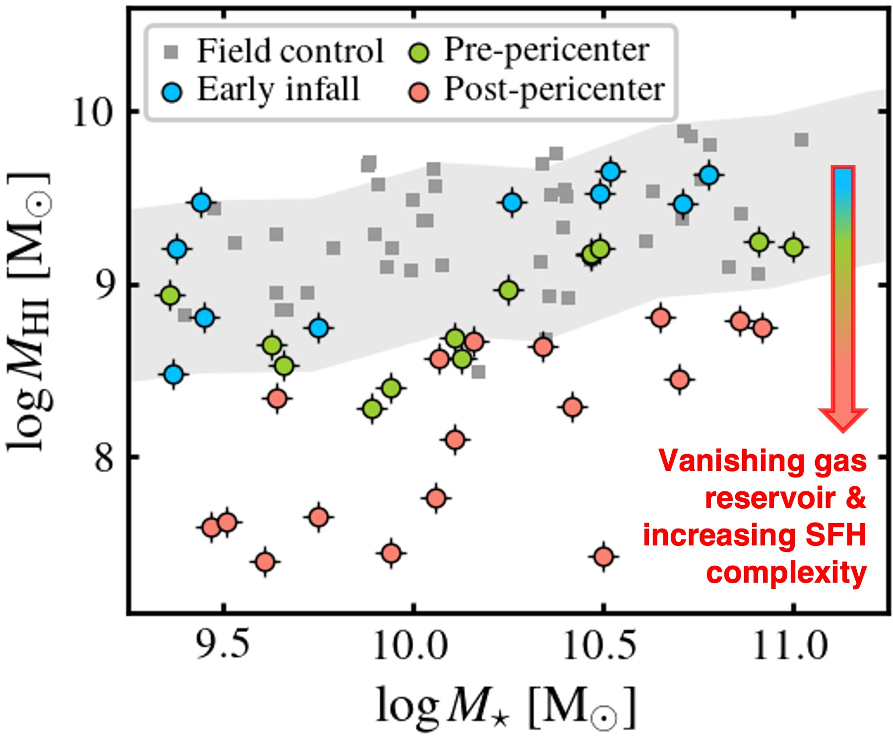
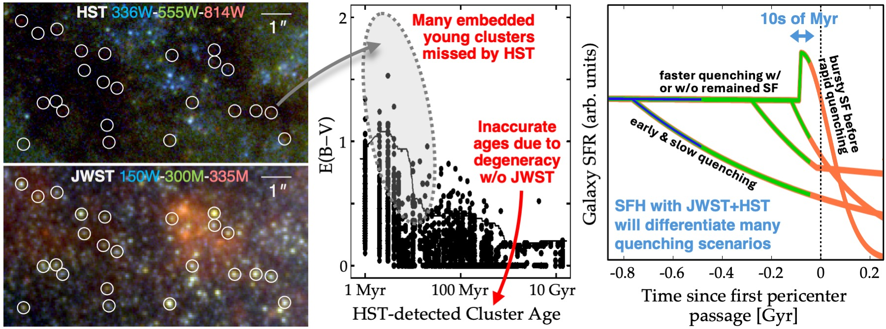
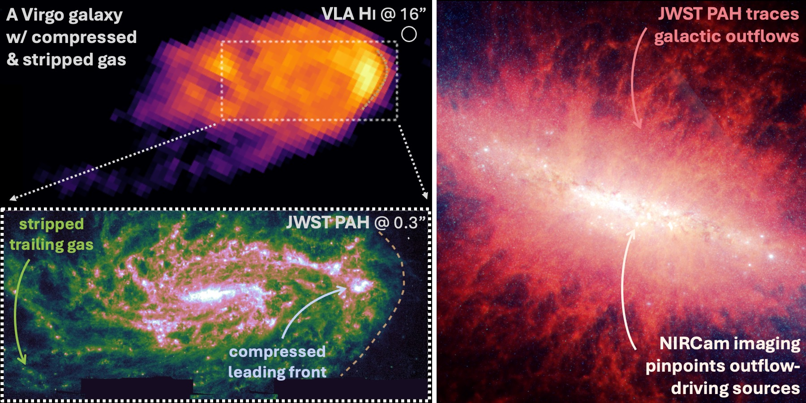

This page is for your information and will be removed before submission

<b>Title:</b> The Evolving ISM and Stellar Populations in Virgo Cluster Galaxies

<b>Abstract:</b> We propose a Treasury program to obtain NIRCam+MIRI imaging for 40 disk galaxies in the nearest massive galaxy cluster, Virgo. These galaxies have unparalleled complementary data from HST, ALMA, AstroSat, and VLT/MUSE, and they cover diverse morphology, orientation, and infall stages into the Virgo galaxy cluster. Our JWST program uses an efficient design to achieve several major science goals at once: (1) obtain recent star formation histories as a function of infall stages, resolving long-standing debates on the timescale of environmental quenching and star formation efficiency variations; (2) trace the rapidly evolving ISM at unprecedented depth and resolution, characterizing the internal and environmental processes that redistribute, remove, and destroy dust and gas; (3) determine how environmental processing changes the emergence of young stellar clusters from their natal clouds, connecting local stellar feedback to galaxy-scale gas loss. Together these will significantly advance our understanding of galaxy evolution in galaxy cluster environments. We will rapidly release reduced images and stellar cluster / H II region catalogs to support diverse, high-impact science from the community.

<b>Scientific Category:</b> Nearby Galaxies to Cosmic Noon

<b>Alternate Category:</b> Gas, Dust and the ISM

<b>Science Keywords:</b> Disk galaxies, Galaxy clusters, Galaxy environments, Galaxy evolution, Interstellar dust, Star formation, Stellar populations

<b>Science / Parallel / Charged Time:</b> Cycle 5 reference: 55.7 h / 7.6 h / 156.3 h. The revised allocation requires updated ETC and APT calculations.

<b>Sample Information:</b> <a href="https://docs.google.com/spreadsheets/d/1Csa-zoVhpEk_VxK_cwWB_K5jGOpy93r0ora8CrhHP2I/edit?usp=sharing">Google Spreadsheet</a>

<b>13 September 2026 revision:</b> Green text marks additions and replacements relative to Cycle 5. Original figures and section order are retained. The original technical estimates are retained for drafting; TRGB depth and halo coverage no longer drive the request.

<!-- pagebreak -->

## Scientific Justification (required for all)

Galaxy evolution is governed by both internal and environmental processes [10, 22]. Environmental effects are most evident in dense regions such as rich galaxy clusters, where infalling satellite galaxies rapidly lose their gas content and subsequently quench at an accelerated pace [12, 23]. These processes operate from very early cosmic times [z > 5; 52] and have profoundly shaped galaxy populations throughout the cosmic history [32].

Over the past decades, statistical analyses and individual target studies of satellite galaxies have identified several quenching mechanisms, including ram pressure stripping (RPS) acting on the galaxies from the outside as well as feedback from stars and AGNs operating from within [23]. But the exact physical consequences of these processes remain debated, and important questions are unanswered: <b>How does star formation activity wax and wane as satellite galaxies go through various infall stages? How do external RPS and internal feedback processes reshape the ISM in concert? How do these sub-galactic scale changes contribute to a galaxy cluster’s global evolution?</b>

We propose a JWST Treasury program targeting 40 disk galaxies in the Virgo galaxy cluster to make new breakthroughs on these questions. With complete censuses of star clusters and H II regions in every galaxy, we will reliably reconstruct their recent star formation history (SFH) with unprecedented time resolution, settling a long-standing debate about quenching timescales and bursty SFHs in galaxy cluster satellites. With high-resolution, sensitive tracers of the evolving ISM, we will explain star formation variations with ISM physics on small scales, reveal the gas leaving galaxies in outflows or stripped tails, and for the first time, link dust evolution to enrichment of the intracluster medium (ICM). We will also determine how young stellar clusters emerge from their natal clouds as the surrounding ISM is compressed or stripped, linking local feedback to gas loss in Virgo [d=16.2 Mpc; 4]. <b>All this science will be achieved with one integrated program</b> imaging stellar and dust continua, recombination lines, and PAH emission altogether.

This program is uniquely timed to build on major new multiwavelength surveys — four large programs on HST, ALMA, AstroSat, and VLT/MUSE provide complementary measurements of the unobscured stellar populations, gas kinematics, and metallicity for the same sample of Virgo galaxies [16, 72]. Despite this excellent multiwavelength coverage, only JWST has the capabilities in the IR to resolve all star clusters and H II regions and trace gas and dust within and around galaxies, which are instrumental for connecting small-scale star formation and feedback physics to galaxy-scale quenching, and even to galaxy cluster-scale evolution.

The 40 target galaxies span all infall stages into Virgo [inferred via phase-space information, gas content and morphology, and orbital modeling; 25, 76, 85] while marginalizing over galaxy-to-galaxy variations and orientation effects. A stellar mass-matched nearby comparison sample also exists (Fig. 1) with published JWST, HST, ALMA, and VLT data by other surveys [e.g., PHANGS; 27, 36, 37, 41], enabling comparisons across the full range of galaxy conditions. We will select controls by their gas content and disturbance, accounting for Virgo members already present in PHANGS.

J-Virgo [81] overlaps eight targets and supplies valuable stellar-continuum imaging; our recombination-line, PAH, and MIRI data reveal how those populations interact with their ISM.

Fig. 1: We target 40 Virgo galaxies in different infall stages (color filled points). Those in more advanced infall stages retain less H I, reflecting environmental processing of their ISM. Existing JWST data for nearby comparison galaxies (from PHANGS; [37, 39], dark gray symbols) with similar stellar masses and “normal” H I content (gray shaded area; [17]) provide candidate controls for separating internal versus environmental effects, after checking their environmental disturbance.

<b>Goal #1. Definitive recent SFH with star clusters and IR SFR tracers.</b> We will conduct a complete census of star clusters in Virgo galaxies with JWST NIRCam and new public HST data [72], nailing down their recent SFH with the stellar cluster age distribution [73, see Fig. 2]. Only JWST can find all the youngest star clusters (≲10 Myr), which host much of the young stellar mass but remain embedded and often invisible in UV/optical [63]. JWST and HST photometry together can break the age–extinction degeneracy in SED fitting for star clusters [83], greatly improving the accuracy of mass and age determination in all age bins. With complete catalogs of star clusters and reliable age measurements, we will robustly constrain the recent SFH (up to ∼100 Myr) and settle the debate on whether SFR is briefly enhanced by RPS within 10s of Myr around the first pericenter passage, and whether the quenching phase is rapid (≲100 Myr) or more prolonged [Fig. 2 right; 12, 23].

Fig. 2: (Left) HST and JWST images for a small region in a Virgo galaxy [36, 37]. Many embedded star clusters are only visible to JWST. (Middle) Age–extinction distribution of HST-detected star clusters in the same galaxy [73]. The high E(B−V), young age region is severely incomplete without JWST [63]. HST-only age estimates are also biased due to the age–extinction degeneracy [82], limiting reliable reconstruction of SFH from the star cluster population. (Right) Example SFHs with various quenching scenarios [23]. JWST and HST together will better constrain SFHs across all age bins to differentiate these scenarios.

We will also derive recent SFR independently from JWST Paα, Brα, and 21 μm data, together with HST Hα. Our measurements will resolve long-standing discrepancies in the inferred SFR and efficiency changes in Virgo satellites [14, 53, 75], which largely stem from the use of SFR tracers with different timescales and sensitivity to diffuse emission. JWST Paα will resolve H II regions to 60 mas ≈5 pc scales and separate them from the diffuse ionized gas, a major contaminant for recombination line-based SFR [especially in ICM-affected systems; 77]. Combining Paα, Brα, and HST Hα enables complete, local accounting and correction for extinction, offering robust SFR on ≲ 10 Myr timescale. In addition, 21 μm emission directly traces the dust-reprocessed emission and can be combined with new AstroSat UV data to derive SFR over longer, ∼100 Myr timescale [8]. These will replace previous estimates from GALEX UV and WISE mid-IR data [40], which suffer from much lower resolution and sensitivity; they will also be critical for interpreting the MUSE data, whose ∼1′′ resolution still leaves many H II regions unresolved in Hα, and whose stellar continuum primarily traces older stellar populations. With the high-resolution JWST SFR maps, we will further spatially correlate them with ISM structural properties (Goal #2) to find the immediate cause of the changing star formation rate across each galaxy [43].

<b>Goal #2. Physical properties of the evolving ISM at high resolution.</b> We will use JWST images of PAH emission at 3.3−11.3 μm to trace the redistribution, removal, and destruction of dust and gas in Virgo satellites by internal and environmental processes. The mid-IR emission from stochastically heated PAH molecules is becoming a new workhorse for tracing the bulk neutral gas in the JWST era, as it is well mixed with both atomic and molecular gas [64] and can be calibrated via empirical and model-based methods [42, 45]. Its major advantage is exceptional spatial resolution, reaching 9–30 pc scales in Virgo, up to 10× and 100× better than the best CO and H I data [Fig. 3 left; 16, 21]. It is also sensitive down to ≲ 5 M⊙ pc−2 at such high resolution [64], unparalleled by other gas tracers.

The sharp, sensitive PAH maps enable a major step forward in quantifying ISM structure changes due to ICM–ISM interactions. This directly builds on low-resolution H I and CO studies capturing global leading/trailing side asymmetry [Fig. 3 top left; 60, 62] and HST extinction maps revealing substantial extra-planar dust in Virgo satellites [1, 24]. With JWST mid-IR maps, we can fully sample the small-scale gas column density PDF and contrast them with existing measurements for the selected comparison sample [55]. This allows us to quantify the effects of gas compression (prevalence of high column density gas), stripping (lack of low column density gas), and even elevated turbulence (broadening of column density PDF) due to ICM–ISM mixing [20]. These small-scale changes in ISM properties are the immediate cause of SFR variations (Goal #1) and the key mediator of environmental processes, yet no existing dataset provides full access to them due to limited resolution and sensitivity. With our sample designed to cover satellites with diverse orientation angles and infall stages, we can assess ICM–ISM interactions in all common configurations and test simulation predictions given varying ICM wind strengths and impact angles [20, 35].

When low column density gas is stripped from galaxies in Virgo, stellar and AGN feedback are expected to launch gas outflows more easily. Our JWST program will put these predictions to the best test: MIRI PAH imaging will reveal neutral gas outflows in inclined

Fig. 3: (Top left) VLA H I image of a Virgo galaxy undergoing ram pressure stripping, with gas stripped to the East direction. (Bottom left) Existing MIRI data covering part of this galaxy [39], with >50× better resolution than H I. Bright PAH emission on the leading side marks spots of gas compression and clustered star formation, whereas diffuse PAH on the trailing side reveals stripped gas with little star formation. Our program will enable such anatomy for galaxies at all infall stages. (Right) PAH can also trace gas outflows [11], while NIRCam imaging pinpoints their launching sites (central starbursts or AGN). Such outflow can be another key channel of gas removal (and thus quenching) in Virgo galaxies [71, 80].

systems [11, 71]. Meanwhile, with NIRCam we will identify star clusters and H II regions and estimate their energy output [5, 55], thereby evaluating them as potential powering sources for the outflows (Fig. 3 right). This will provide a much-needed systematic view that expands on recent serendipitous discoveries of gas outflows in several Virgo satellites [71, 80].

As the ISM gets stripped or launched from a satellite galaxy, the dust abundance and composition change due to sputtering [51]. This ultimately sets the amount and composition of dust present in the ICM [47]. We will put direct constraints on the evolution of small grains as they join the ICM by estimating the PAH abundance, size distribution, and ionization from JWST mid-IR band ratios [18, 70]. Such constraints will shed light on PAH properties far outside the ISM regime, which will be widely useful for interpreting PAH emission around galaxies in the local universe, as well as those serendipitously detected in JWST campaigns targeting fields lensed by more distant galaxy clusters [9, priv. comm.].

<b>Goal #3. Young stellar feedback in an externally disturbed ISM.</b> We will determine how environmental gas compression and removal change the emergence of young stellar clusters from their natal clouds. In Virgo, stellar feedback acts on an ISM already being reshaped by the ICM. Compression may retain obscuring material, while stripping may expose young stars or remove gas made more diffuse by their feedback [20, 35, 86]. <b>Do young stellar clusters remain embedded for longer in compressed regions, or emerge earlier where gas is being removed?</b>

Our NIRCam and MIRI imaging, combined with HST, will uncover embedded young stellar clusters and connect them to the gas and dust around them, building on recent JWST studies of their emergence [33, 87]. We will compare embedded and exposed populations of similar age and mass across compressed, stripped, and less disturbed regions. The recent SFHs from Goal #1 and the evolving ISM mapped in Goal #2 will place these differences in the broader history of each galaxy. Together, these measurements will establish whether galaxy-scale gas loss is accompanied by a change in how young stellar populations emerge from their birth material, linking local stellar feedback to environmental quenching.

<b>Why Treasury:</b> Our program will yield a legacy dataset with broad science applications and impacts well beyond those discussed above. The rich filter combination, deep integration, and large, well-characterized sample will enable studies of ISM energetics [26], AGB stars [31], serendipitous supernovae detections [49], and identification of supernova progenitors or host systems of other transient events [57]. TRGB distances from adequate archival or incidental imaging, including J-Virgo [81], will add three-dimensional context as a supporting science product. The program is also time critical – it is urgently needed for making best use of substantial ongoing investments by JWST, HST, AstroSat, ALMA, and VLT on Virgo, as well as for contextualizing multiple large programs on rare “jellyfish” galaxies in local galaxy clusters [56, 78, GTO 1178] and satellites in higher-z galaxy clusters [58, 79, GO 3224]. We believe treasury status is appropriate given these considerations.

## Technical Justification (required for GO, DD and Survey only)

<b>Observation Design:</b> We propose an efficient imaging program with NIRCam and MIRI to support our three main science goals. The filter choices and imaging strategies have been proven effective by many programs in previous cycles [e.g., 3, 37, 39, 84].

We use NIRCam’s F090W, F150W, F300M, and F430M together with public HST broad-band data to capture the continuum emission of star clusters at all ages. The integration depths are sufficient to detect most 103 M⊙ stellar clusters with AV ≲ 5 at S/N > 10 [based on CIGALE SED models; 37], or more massive / less embedded stellar clusters at higher significance. We will also leverage medium- and narrow-band data tracing PAH and hydrogen recombination lines (F335M, F187N, F405N, see below) for distinguishing young stellar clusters from older counterparts [33, 63, 73]. These setups directly support Goals #1 and #3. The F090W/F150W depths will be set by recovery of stellar populations, using adequate archival imaging first; no dedicated TRGB depth is required.

We use NIRCam’s F335M and MIRI’s F770W & F1130W filters to trace PAH emission [18]. We leverage F300M to subtract continuum from F335M, and F1000W to subtract continuum from F770W and F1130W. For the MIRI filters, we target S/N = 10 for extended emission at 1–2 MJy/sr, which probe diffuse gas down to ≲ 5 M⊙ pc−2 at 20–30 pc scales [64]. For NIRCam’s F335M, the integration results in S/N = 6 detection for similarly diffuse gas [65] at a sharper <10 pc resolution. We also use MIRI’s F2100W filter to trace continuum emission by hot dust, which is key to accounting for embedded star formation, constraining dust-reprocessed radiation pressure in H II regions, and (when combined with PAH tracers) gauging PAH abundance variations [8, 19, 55]. We target S/N ≈10 at 1 MJy/sr to detect emission from both star-forming regions and diffuse gas [following 37]. These designs ensure sensitivity to the evolving ISM within and around galaxies, directly supporting Goal #2.

We use NIRCam’s F187N (Paα) and F405N (Brα) filters to detect and resolve individual H II regions, which will complete the inventory of all star formation, constrain local dust extinction, and pinpoint feedback and outflow launching sites [15, 44, 46]. We will combine F150W, F300M, and F430M to model and remove continuum in these narrow bands. The paired F187N+F405N integration will achieve > 10σ detection for faint H II regions down to 4×10−16 and 4×10−17 erg/s/cm2/arcsec2 in Paα and Brα; this depth is also necessary to overcome 1/f noise, a key concern for narrow-band imaging (priv. comm.). Note that for a fraction of our targets the Paα and Brα lines would partly shift outside the narrow filter transmission curves due to large recession velocities. We drop the F187N+F405N integration for these targets and resort to HST F657N + MIRI F2100W for extinction corrected SFR.

For Goal #3, we use the same stellar-continuum, recombination-line, and PAH images to identify embedded and exposed young stellar populations and characterize their surroundings [33, 87]. The line-based comparison will use targets and regions with adequate Paα or Brα transmission. Artificial-source tests will establish the common stellar-mass and completeness limits, while nearby comparison images will be matched to the Virgo resolution and depth. We place the NIRCam modules to cover the star-forming disk and environmentally disturbed regions; neither dedicated halo coverage nor reaching below the TRGB is a requirement.

<b>Data Processing and Dissemination:</b> We will aim for rapid data reduction over 1–2 week timescale to enable community-engaged, time-sensitive science [e.g., serendipitous transient detections; 49]. Such fast reduction is made possible by community-built image processing tools [84], which we will adapt and improve in a public GitHub repository. We will then release finalized, quality-assured images and high-level data products (including stellar cluster / H II region catalogs, young stellar emergence classifications, and value-added measurements), accompanied by peer-review publications. We will plan our first releases around 6 months after project completion, and a final release including all high-level data products within 24 months. These products will be delivered to MAST with a mirror at CADC, with links to ancillary data from HST [72], VLT [16], ALMA [13], and VLA [21]. It will become a rich database with long-term accessibility and substantial legacy value, enabling continued science exploitation by the entire community.

## Special Requirements (if any)

We constrain the position angle (PA) of the NIRCam and MIRI fields for each target so that the galaxy disk can fit in the FoV at all allowed PA. The revised pointings and PA constraints will be checked for schedulability in APT. We also adjust the NIRCam pointing coordinates to cover the star-forming disk and environmentally disturbed regions, using adequate archival coverage where available.

We request the NIRCam and MIRI observations for each target be taken uninterrupted so that the MIRI off-target observations (in parallel with NIRCam) can be used for background removal for the MIRI on-target observations (see below).

## Justify Coordinated Parallel Observations (if any, GO/DD only)

We require coordinated parallels to obtain MIRI off-target observations during NIRCam on-target imaging. The off-target observations are needed because the (separate) MIRI on-target observations will often see emission across the entire field-of-view, leaving little signal-free area for background determination [see 84]. The NIRCam-on/MIRI-off parallel imaging strategy would allow us to most efficiently achieve our science goals.

## Justify Duplications (if any, GO/DD only)

The Cycle 5 archive check identified adequate imaging for 12/40 targets, mostly with MIRI, and omitted those duplicated observations. We will update this assessment filter by filter for the revised footprint and science requirements, using adequate archival data in place of new exposures.

(1) <b>J-Virgo GO 7763 [81] overlaps eight targets:</b> NGC 4294, NGC 4351, NGC 4388, NGC 4402, NGC 4548, NGC 4569, NGC 4579, and NGC 4606. Its NIRCam F115W/F150W/F277W imaging provides valuable stellar-continuum and distance information, including disk coverage. It does not provide the targeted infrared recombination lines, 3.3 μm PAH band, or MIRI imaging required here. We will use its adequate continuum data and restrict additional continuum exposures to uncovered regions or demonstrated depth requirements for Goals #1 and #3.

(2) <b>F150W and F187N from GO 3707 [PHANGS; 39] for eight targets:</b> We will use existing F150W wherever it supports the stellar-population measurements. Any additional Paα imaging will be justified by the required footprint and demonstrated line sensitivity after continuum subtraction. TRGB depth and halo coverage are no longer reasons for repeating these observations.

(3) <b>F300M and F335M from GO 2107 [37], 3707 [39], and 4793 [67]:</b> We will use adequate archival data and add the missing disk and disturbed-region coverage. Exposure pairings will be set by stellar-population and PAH requirements, with no TRGB-driven integration.

(4) <b>HST/ACS F814W parallel imaging from GO 18103 [72]:</b> These data will add stellar-population constraints and incidental TRGB measurements where feasible; halo coverage and TRGB precision no longer drive this program.

<!-- pagebreak -->

## References

[1] Abramson, A., Kenney, J., Crowl, H., & Tal, T. 2016, AJ, 152, 32

[2] Anand, G. S., Lee, J. C., Van Dyk, S. D., et al. 2021, MNRAS, 501, 3621

[3] Anand, G. S., Riess, A. G., Yuan, W., et al. 2024, ApJ, 966, 89

[4] Anand, G. S., Tully, R. B., Cohen, Y., et al. 2025, ApJ, 982, 26

[5] Barnes, A. T., Chandar, R., Kreckel, K., et al. 2022, A&A, 662, L6

[6] Beaton, R. L., Freedman, W. L., Madore, B. F., et al. 2016, ApJ, 832, 210

[7] Beaton, R. L., Seibert, M., Hatt, D., et al. 2019, ApJ, 885, 141

[8] Belfiore, F., Leroy, A. K., Williams, T. G., et al. 2023, A&A, 678, A129

[9] Bezanson, R., Labbe, I., Whitaker, K. E., et al. 2024, ApJ, 974, 92

[10] Blanton, M. R., & Moustakas, J. 2009, ARA&A, 47, 159

[11] Bolatto, A. D., Levy, R. C., Tarantino, E., et al. 2024, ApJ, 967, 63

[12] Boselli, A., & Gavazzi, G. 2006, PASP, 118, 517

[13] Brown, T., Wilson, C. D., Zabel, N., et al. 2021, ApJS, 257, 21

[14] Brown, T., Roberts, I. D., Thorp, M., et al. 2023, ApJ, 956, 37

[15] Calzetti, D., Kennicutt, R. C., Engelbracht, C. W., et al. 2007, ApJ, 666, 870

[16] Catinella, B., Cortese, L., Sun, J., et al. 2025, The Messenger, 195

[17] Catinella, B., Saintonge, A., Janowiecki, S., et al. 2018, MNRAS, 476, 875

[18] Chastenet, J., Sutter, J., Sandstrom, K., et al. 2023, ApJL, 944, L12

[19] —. 2023, ApJL, 944, L11

[20] Choi, W., Kim, C.-G., & Chung, A. 2022, ApJ, 936, 133

[21] Chung, A., van Gorkom, J. H., Kenney, J. D. P., Crowl, H., & Vollmer, B. 2009, AJ, 138, 1741

[22] Conselice, C. J. 2014, ARA&A, 52, 291

[23] Cortese, L., Catinella, B., & Smith, R. 2021, PASA, 38, e035

[24] Cramer, W. J., Kenney, J. D. P., Sun, M., et al. 2019, ApJ, 870, 63

[25] Crowl, H. H., & Kenney, J. D. P. 2008, AJ, 136, 1623

[26] Egorov, O. V., Kreckel, K., Glover, S. C. O., et al. 2023, A&A, 678, A153

[27] Emsellem, E., Schinnerer, E., Santoro, F., et al. 2022, A&A, 659, A191

[28] Ferrarese, L., Côté, P., Cuillandre, J.-C., et al. 2012, ApJS, 200, 4

[29] Freedman, W. L., Madore, B. F., Jang, I. S., et al. 2024, arXiv e-prints, arXiv:2408.06153

[30] Freedman, W. L., Madore, B. F., Hatt, D., et al. 2019, ApJ, 882, 34

[31] Hassani, H., Rosolowsky, E., Leroy, A. K., et al. 2025, arXiv e-prints, arXiv:2509.16459

[32] Kauffmann, G., White, S. D. M., Heckman, T. M., et al. 2004, MNRAS, 353, 713

[33] Knutas, A., Adamo, A., Pedrini, A., et al. 2025, arXiv e-prints, arXiv:2505.08874

[34] Kourkchi, E., & Tully, R. B. 2017, ApJ, 843, 16

[35] Lee, J., Kimm, T., Katz, H., et al. 2020, ApJ, 905, 31

[36] Lee, J. C., Whitmore, B. C., Thilker, D. A., et al. 2022, ApJS, 258, 10

[37] Lee, J. C., Sandstrom, K. M., Leroy, A. K., et al. 2023, ApJL, 944, L17

[38] Lee, M. G., Freedman, W. L., & Madore, B. F. 1993, ApJ, 417, 553

[39] Leroy, A., Kreckel, K., Lee, J., et al. 2023, A JWST Census of the Local Galaxy Population: Anchoring the Physics of the Matter Cycle, JWST Proposal. Cycle 2, ID. #3707, ,

[40] Leroy, A. K., Sandstrom, K. M., Lang, D., et al. 2019, ApJS, 244, 24

[41] Leroy, A. K., Schinnerer, E., Hughes, A., et al. 2021, ApJS, 257, 43

[42] Leroy, A. K., Sandstrom, K., Rosolowsky, E., et al. 2023, ApJL, 944, L9

[43] Leroy, A. K., Sun, J., Meidt, S., et al. 2025, ApJ, 985, 14

[44] Levy, R. C., Bolatto, A. D., Mayya, D., et al. 2024, arXiv e-prints, arXiv:2408.04135

[45] Linzer, N. B., Kim, J.-G., Kim, C.-G., & Ostriker, E. C. 2024, arXiv e-prints, arXiv:2409.05958

[46] Liu, G., Calzetti, D., Hong, S., et al. 2013, ApJL, 778, L41

[47] Longobardi, A., Boselli, A., Boissier, S., et al. 2020, A&A, 633, L7

[48] Makarov, D., Makarova, L., Rizzi, L., et al. 2006, AJ, 132, 2729

[49] Mayker Chen, N., Tucker, M. A., Hoyer, N., et al. 2023, arXiv e-prints, arXiv:2301.05718

[50] Mei, S., Blakeslee, J. P., Côté, P., et al. 2007, ApJ, 655, 144

[51] Micelotta, E. R., Jones, A. P., & Tielens, A. G. G. M. 2010, A&A, 510, A37

[52] Morishita, T., Liu, Z., Stiavelli, M., et al. 2024, arXiv e-prints, arXiv:2408.10980

[53] Morokuma-Matsui, K., Kodama, T., Morokuma, T., et al. 2021, ApJ, 914, 145

[54] Newman, M. J. B., McQuinn, K. B. W., Skillman, E. D., et al. 2024, arXiv e-prints, arXiv:2406.03532

[55] Pathak, D., Leroy, A. K., Thompson, T. A., et al. 2024, AJ, 167, 39

[56] Poggianti, B. M., Moretti, A., Gullieuszik, M., et al. 2017, ApJ, 844, 48

[57] Rastello, S., Iorio, G., Gieles, M., & Wang, L. 2025, arXiv e-prints, arXiv:2509.07067

[58] Ravindranath, S., & NIRISS GTO Team. 2017, in American Astronomical Society Meeting Abstracts, Vol. 230, American Astronomical Society Meeting Abstracts #230, 203.04

[59] Reid, M. J., Pesce, D. W., & Riess, A. G. 2019, ApJL, 886, L27

[60] Reynolds, T. N., Westmeier, T., Staveley-Smith, L., Chauhan, G., & Lagos, C. D. P. 2020, MNRAS, 493, 5089

[61] Riess, A. G., Anand, G. S., Yuan, W., et al. 2023, ApJL, 956, L18

[62] Roberts, I. D., Brown, T., Zabel, N., et al. 2023, A&A, 675, A78

[63] Rodríguez, M. J., Lee, J. C., Indebetouw, R., et al. 2025, ApJ, 983, 137

[64] Sandstrom, K. M., Koch, E. W., Leroy, A. K., et al. 2023, ApJL, 944, L8

[65] Sandstrom, K. M., Chastenet, J., Sutter, J., et al. 2023, ApJL, 944, L7

[66] Savino, A., Gennaro, M., Dolphin, A. E., et al. 2024, ApJ, 970, 36

[67] Schinnerer, E., Barnes, A., Bigiel, F., et al. 2024, Unveiling the physics that govern massive star-formation in extragalactic Central Molecular Zones (eCMZs), JWST Proposal. Cycle 3, ID. #4793, ,

[68] Shaya, E. J., Tully, R. B., Hoffman, Y., & Pomarède, D. 2017, ApJ, 850, 207

[69] Shaya, E. J., Tully, R. B., Pomarède, D., & Peel, A. 2022, ApJ, 927, 168

[70] Sutter, J., Sandstrom, K., Chastenet, J., et al. 2024, ApJ, 971, 178

[71] Sutter, J., Sandstrom, K., Chown, R., et al. 2025, arXiv e-prints, arXiv:2509.12058

[72] Thilker, D., Sun, J., Amiri, A., et al. 2025, Anatomy of a fall: Dissecting the environment-driven transformation of late-type Virgo cluster galaxies with HST UV-optical imaging of star clusters, associations, and H II regions, HST Proposal. Cycle 33, ID. #18103, ,

[73] Thilker, D. A., Lee, J. C., Whitmore, B. C., et al. 2025, ApJS, 280, 1

[74] Tully, R. B., Courtois, H. M., & Sorce, J. G. 2016, AJ, 152, 50

[75] Villanueva, V., Bolatto, A. D., Vogel, S., et al. 2022, ApJ, 940, 176

[76] Vollmer, B. 2009, A&A, 502, 427

[77] Vollmer, B., Fossati, M., Boselli, A., et al. 2021, A&A, 645, A121

[78] Watson, P. 2024, in EAS2024, 2032

[79] Watson, P. J., Vulcani, B., Werle, A., et al. 2024, arXiv e-prints, arXiv:2409.15215

[80] Watts, A. B., Cortese, L., Catinella, B., et al. 2024, MNRAS, 530, 1968

[81] Weisz, D. R., Lee, A., Carlsten, S., et al. 2025, J-Virgo: A JWST Treasury Survey of the Virgo Cluster, JWST Proposal. Cycle 4, ID. #7763, ,

[82] Whitmore, B. C., Chandar, R., Rodríguez, M. J., et al. 2023, ApJL, 944, L14

[83] Whitmore, B. C., Chandar, R., Lee, J. C., et al. 2025, ApJ, 982, 50

[84] Williams, T. G., Lee, J. C., Larson, K. L., et al. 2024, ApJS, 273, 13

[85] Yoon, H., Chung, A., Smith, R., & Jaffé, Y. L. 2017, ApJ, 838, 81

[86] Cramer, W. J., Kenney, J. D. P., Cortes, J. R., et al. 2020, ApJ, 901, 95. <a href="https://doi.org/10.3847/1538-4357/abaf54">doi:10.3847/1538-4357/abaf54</a>

[87] Pedrini, A., Adamo, A., Calzetti, D., et al. 2026, Nature Astronomy, 10, 1179. <a href="https://doi.org/10.1038/s41550-026-02857-y">doi:10.1038/s41550-026-02857-y</a>

Draft preparation: OpenAI Codex desktop, GPT-6-based assistant, 13 September 2026; used to adapt the supplied Cycle 5 text, check the added references and J-Virgo overlap, and prepare this marked revision. Final scientific and submission review rests with the proposing team.
