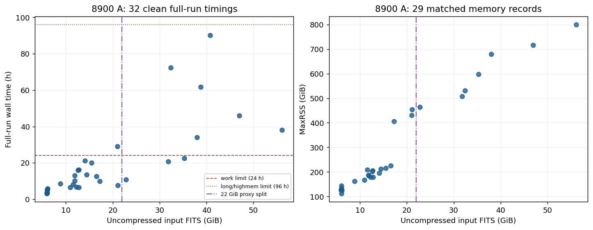
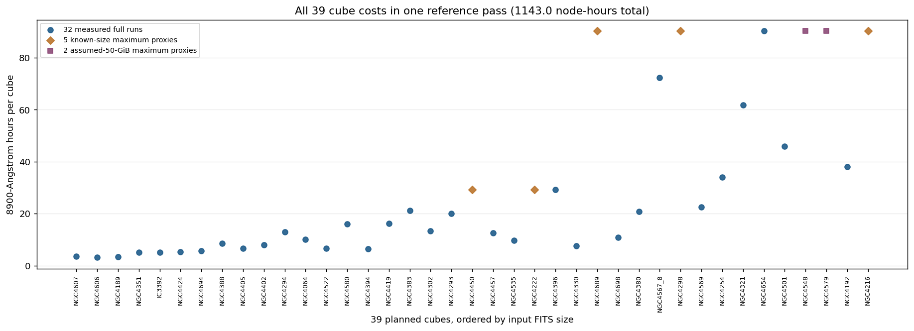

# 20260929 Pawsey Computing and Storage

This estimate uses **one 4800-8900 Angstrom nGIST pass** over 39 datacubes representing 40 MAUVE-MUSE galaxies. The full pass is estimated at **1,143.018 node-hours**, or **146,306 SU** on 128 physical cores. A single 20% buffer allowance brings the reference to **175,568 SU per pass**. The number of future science passes remains open.

## Measured 8900-Angstrom runs



*Figure 1. The 32 blue timing points are clean, complete 8900-Angstrom runs; 29 have matched peak-memory records. The 22 GiB line is a rough input-size split for estimating missing runtimes, not the Setonix queue-assignment rule.* 

The measured small group (<22 GiB; 23 cubes), which is able to run under `work` or `long` queue on Pawsey, has a maximum of **29.170 hours** (NGC4396); the large group (>=22 GiB; 9 cubes),  which requires to run under `highmem` queue on Pawsey,  has a maximum of **90.253 hours** (NGC4654).

Both maxima come from **8900-Angstrom runs**. An untimed cube receives the largest observed runtime in its own input-size group.

## Complete 39-cube reference pass



*Figure 2. All 39 cubes enter the budget: 32 measured timings (blue), five known-size maximum-based estimates (orange), and two assumed-size maximum-based estimates (purple). Check out Appendix A. for more details.* 

Note that the two missing datacubes so far, NGC4548 and NGC4579, are each assumed to be **50 GiB**. The estimates are labelled separately from measurements.

| Contribution | Cubes | Node-hours |
|:--|--:|--:|
| Measured complete runs | 32 | 633.411 |
| Known-size small/large maximum estimates | 5 | 329.101 |
| Two assumed-50-GiB large-cube maximum estimates | 2 | 180.507 |
| **One complete pass** | **39** | **1,143.018** |

## Convert to SU and scale later

[Pawsey counts one requested physical CPU core-hour as one SU](https://pawsey.atlassian.net/wiki/spaces/US/pages/51931328/The+Pawsey+Partner+Merit+Allocation+Scheme). Each job requests one **128-physical-core** node, so one node-hour costs **128 SU**. Using the unrounded cube timings:

```text
1,143.018 node-hours x 128 physical cores = 146,306 SU
20% allowance                           =  29,261 SU
Buffered reference for one pass         = 175,568 SU
For N comparable passes: SU(N)           = N x 175,567.53
```

So far for 35 completed datacubes they occupy 8TB space and so we expect **8 x 39/35 = 8.914 TB** of output for one 39-cube pass, plus **1.5 TB** for all input cubes and other necessary ingredients. If `N` output families must be retained together, **Acacia minimum(N) = 1.5 + N x (8 x 39/35) TB**. One family needs **10.414 TB** before headroom, or **15 TB** after 15% headroom and upward rounding. 

The 20% allowance and the two missing cube sizes are purely based on my personal assumptions. Each group maximum is conservative within the measured sample, but it is not a guaranteed upper bound for an unmeasured cube.

## Appendix A. Per-cube 8900-Angstrom reference list

This table is generated from the same unrounded calculations. `Full LOGFILE` is a clean complete attempt; `Small-cube maximum` and `Large-cube maximum` use the largest measured runtime in the matching 8900-Angstrom size group. Input size is uncompressed FITS **GiB**; the two assumed sizes are **50 GiB each**.

| Cube ID   | Input size (GiB) | Size group       | Runtime basis               | Hours | SU at 128 cores |
| :-------- | ---------------: | :--------------- | :-------------------------- | ----: | --------------: |
| NGC4607   |             5.94 | small (<22 GiB)  | Full LOGFILE                |  3.54 |             453 |
| NGC4606   |             5.95 | small (<22 GiB)  | Full LOGFILE                |  3.22 |             413 |
| NGC4189   |             6.01 | small (<22 GiB)  | Full LOGFILE                |  3.46 |             443 |
| NGC4351   |             6.02 | small (<22 GiB)  | Full LOGFILE                |  5.03 |             644 |
| IC3392    |             6.03 | small (<22 GiB)  | Full LOGFILE                |  5.11 |             654 |
| NGC4424   |             6.04 | small (<22 GiB)  | Full LOGFILE                |  5.40 |             691 |
| NGC4694   |             6.10 | small (<22 GiB)  | Full LOGFILE                |  5.75 |             736 |
| NGC4388   |             8.86 | small (<22 GiB)  | Full LOGFILE                |  8.51 |           1,089 |
| NGC4405   |            10.91 | small (<22 GiB)  | Full LOGFILE                |  6.56 |             840 |
| NGC4402   |            11.55 | small (<22 GiB)  | Full LOGFILE                |  7.99 |           1,022 |
| NGC4294   |            11.85 | small (<22 GiB)  | Full LOGFILE                | 12.97 |           1,660 |
| NGC4064   |            11.87 | small (<22 GiB)  | Full LOGFILE                | 10.15 |           1,300 |
| NGC4522   |            12.26 | small (<22 GiB)  | Full LOGFILE                |  6.72 |             860 |
| NGC4580   |            12.63 | small (<22 GiB)  | Full LOGFILE                | 16.07 |           2,057 |
| NGC4394   |            12.73 | small (<22 GiB)  | Full LOGFILE                |  6.51 |             833 |
| NGC4419   |            12.75 | small (<22 GiB)  | Full LOGFILE                | 16.30 |           2,086 |
| NGC4383   |            14.07 | small (<22 GiB)  | Full LOGFILE                | 21.25 |           2,719 |
| NGC4302   |            14.41 | small (<22 GiB)  | Full LOGFILE                | 13.39 |           1,714 |
| NGC4293   |            15.48 | small (<22 GiB)  | Full LOGFILE                | 20.03 |           2,564 |
| NGC4450   |            16.45 | small (<22 GiB)  | Small-cube maximum          | 29.17 |           3,734 |
| NGC4457   |            16.57 | small (<22 GiB)  | Full LOGFILE                | 12.61 |           1,614 |
| NGC4535   |            17.27 | small (<22 GiB)  | Full LOGFILE                |  9.80 |           1,255 |
| NGC4222   |            20.99 | small (<22 GiB)  | Small-cube maximum          | 29.17 |           3,734 |
| NGC4396   |            21.02 | small (<22 GiB)  | Full LOGFILE                | 29.17 |           3,734 |
| NGC4330   |            21.11 | small (<22 GiB)  | Full LOGFILE                |  7.53 |             964 |
| NGC4689   |            22.54 | large (>=22 GiB) | Large-cube maximum          | 90.25 |          11,552 |
| NGC4698   |            22.79 | large (>=22 GiB) | Full LOGFILE                | 10.90 |           1,396 |
| NGC4380   |            31.83 | large (>=22 GiB) | Full LOGFILE                | 20.78 |           2,659 |
| NGC4567_8 |            32.42 | large (>=22 GiB) | Full LOGFILE                | 72.30 |           9,254 |
| NGC4298   |            32.68 | large (>=22 GiB) | Large-cube maximum          | 90.25 |          11,552 |
| NGC4569   |            35.27 | large (>=22 GiB) | Full LOGFILE                | 22.46 |           2,875 |
| NGC4254   |            37.96 | large (>=22 GiB) | Full LOGFILE                | 34.03 |           4,355 |
| NGC4321   |            38.77 | large (>=22 GiB) | Full LOGFILE                | 61.72 |           7,900 |
| NGC4654   |            40.81 | large (>=22 GiB) | Full LOGFILE                | 90.25 |          11,552 |
| NGC4501   |            46.95 | large (>=22 GiB) | Full LOGFILE                | 45.91 |           5,877 |
| NGC4548   |            50.00 | large (>=22 GiB) | Assumed 50 GiB; large maximum | 90.25 |          11,552 |
| NGC4579   |            50.00 | large (>=22 GiB) | Assumed 50 GiB; large maximum | 90.25 |          11,552 |
| NGC4192   |            56.08 | large (>=22 GiB) | Full LOGFILE                | 37.98 |           4,862 |
| NGC4216   |            58.55 | large (>=22 GiB) | Large-cube maximum          | 90.25 |          11,552 |
