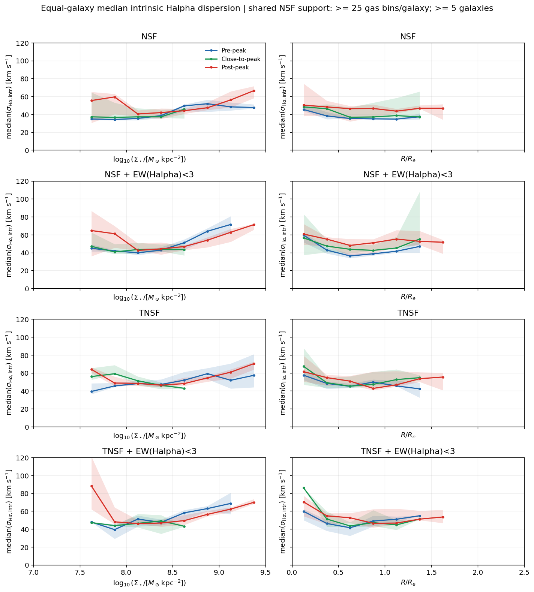
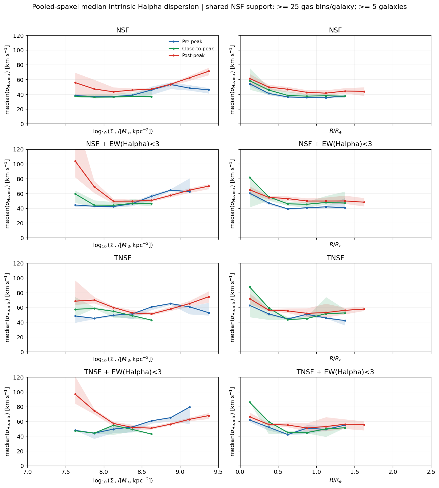
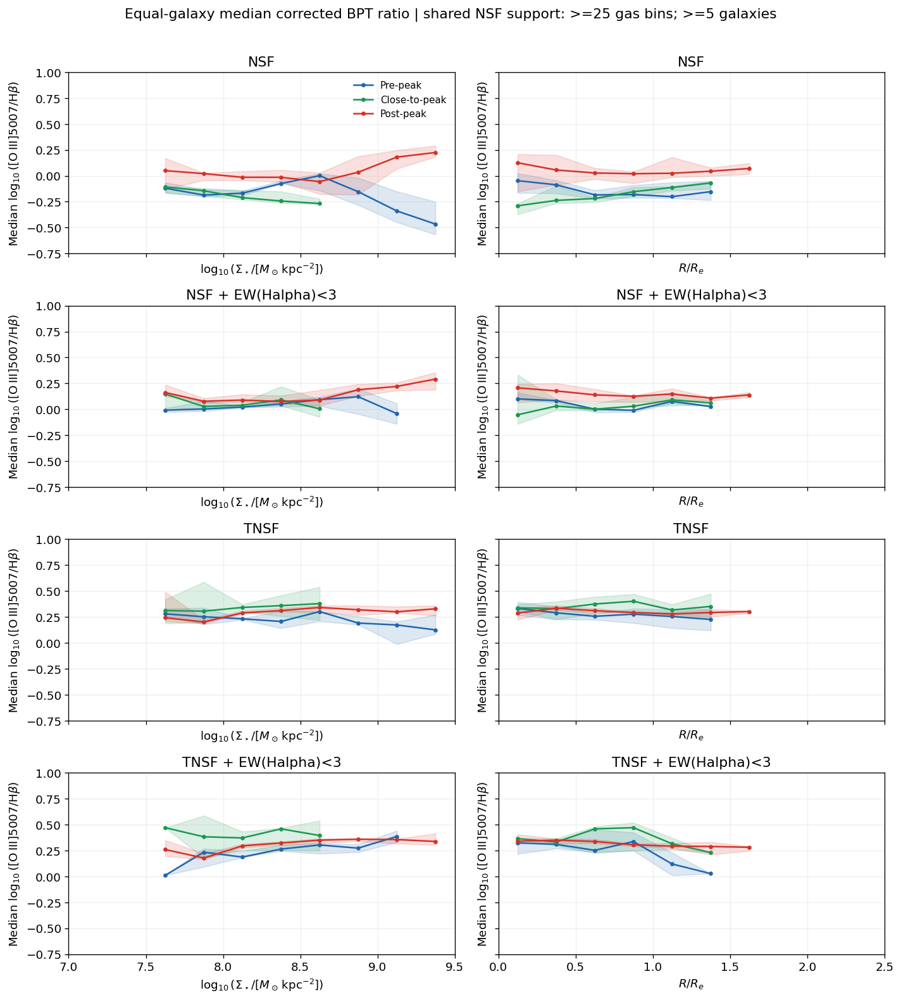
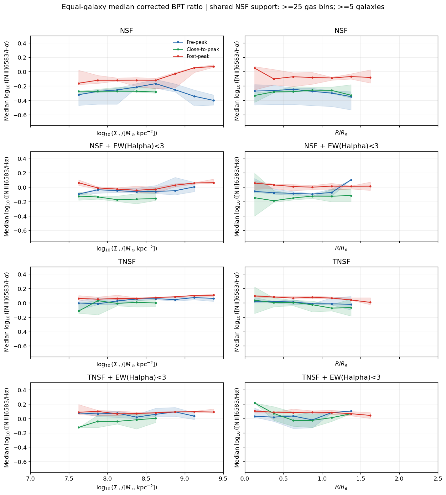
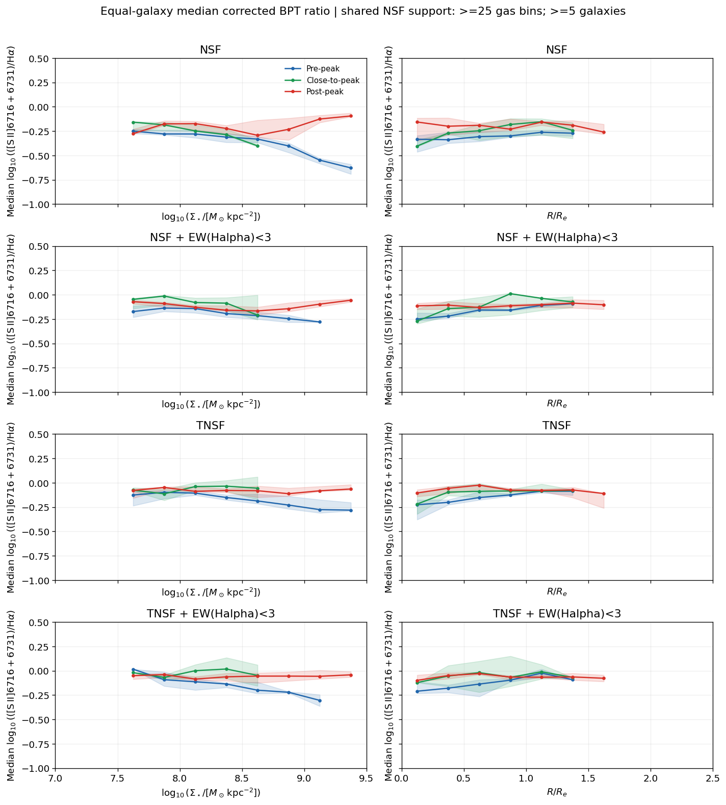
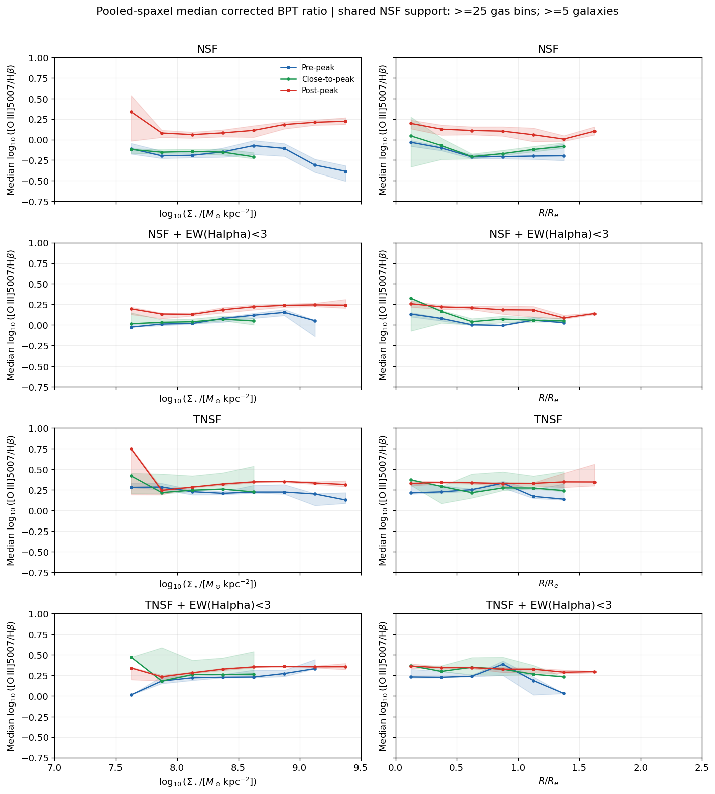
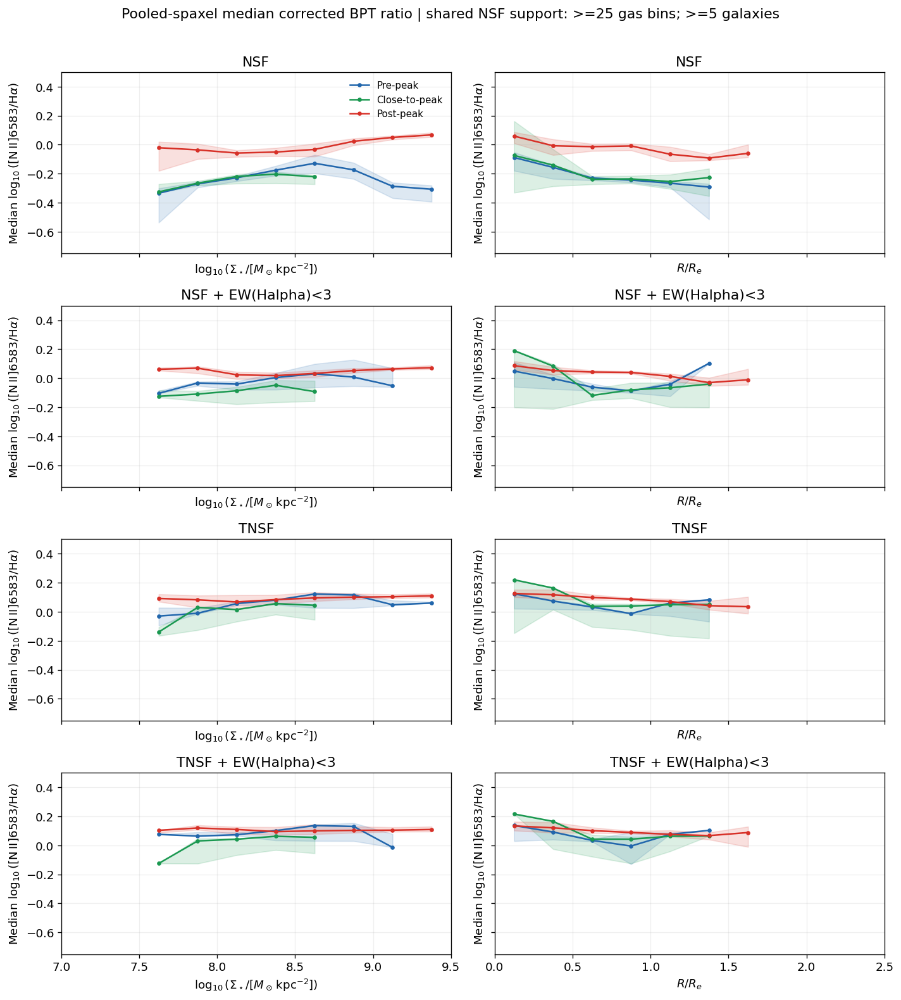
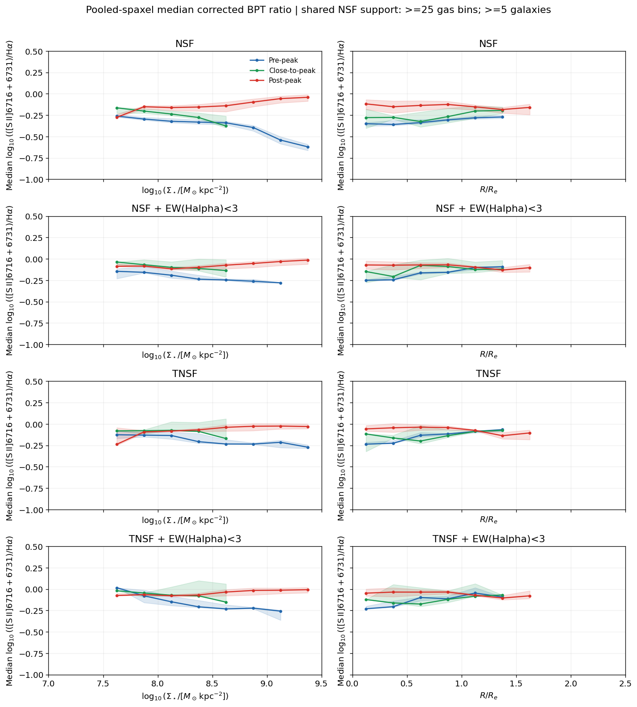

# 20261006 Halpha Dispersion along Infall Stages

First, i check that even after the `SNR_POSTFIT`>25 cut, we still have some NSF post-peak spaxels that extend lower than stellar mass less than 7.5 or radius even outside 2 $R_e$, and even goes up to 500km/s in velocity dispersion. In that unreliable regime, those are driven by only a few bins but contains many spaxels. So i further implement the following cuts to exclude them: in either mass or radial bin, it requires at least 25 distinct spatial bins and at least from galaxies. 

Then here we further make a selection on NSF. So our definition of NSF is $\neg((\mathrm{HII})\cap(\mathrm{EW(H\alpha)>6\AA})\cap(\sigma(\mathrm{H}\alpha)<45\mathrm{km/s}))$, then we can further select the "true" NSF ("truely" not power by young star photonization) by excluding the `COMP` region in NII BPT. 

And in either NSF or TNSF regions, we can still add an additional selection of $\mathrm{EW(H\alpha)}<3\AA$ to select the HOLMES, the ionization by old stars. 

As usual, we have equal-galaxy and pool-galaxy plots. And for equal-galaxy weighted median, i dont think there exists any trend across infall stages here; while for pooled-spaxel case i will say it is hard to tell. 

Also, we move back to BPT line ratios, it still shows that post-peak galaxies tend to have higher line ratios than pre-peak. And with stricter selection or even further EWHa cut, it seems to have less differences. 

Similarly, we have pooled-spaxels case and it shows the same results. 

