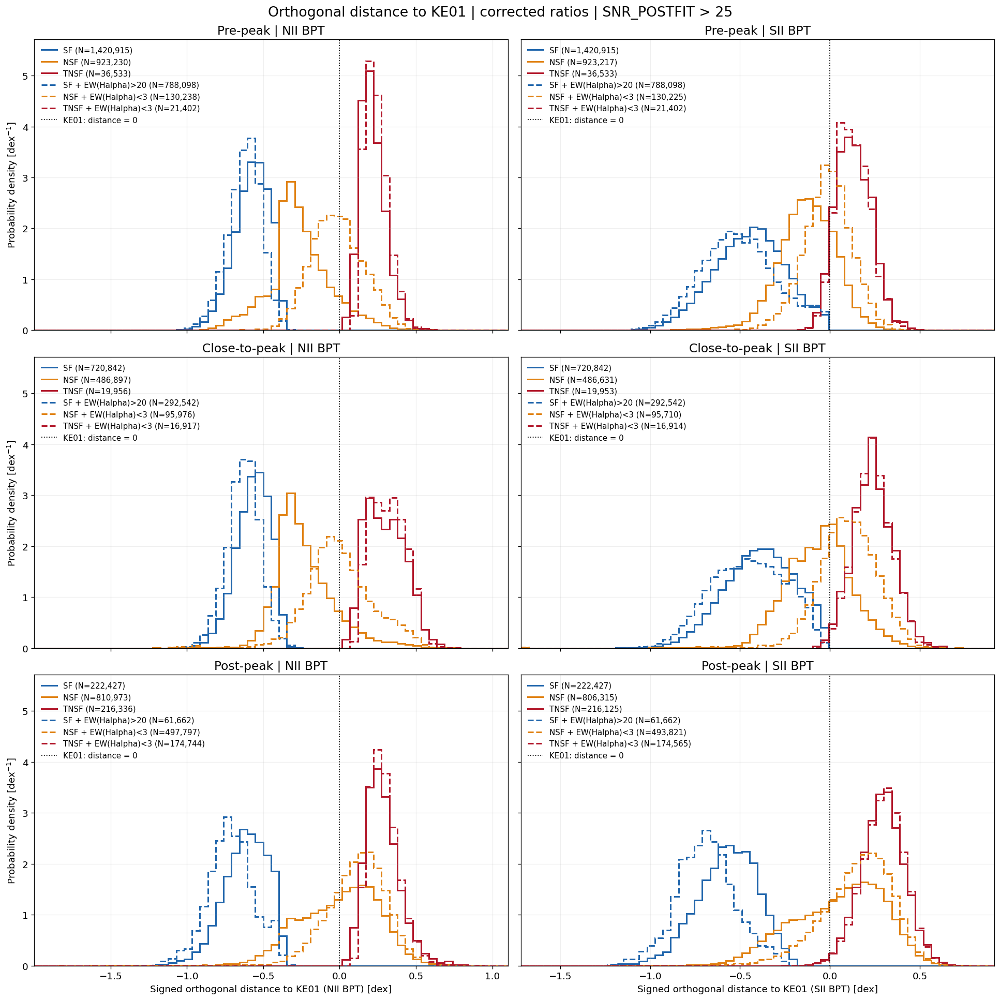
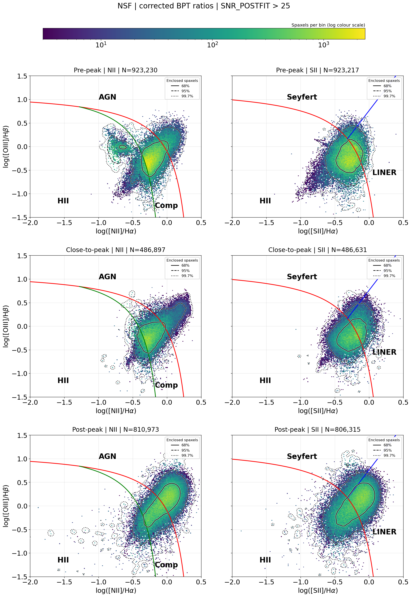

# 20261007 Distribution of NSF BPT Distances Across Infall Stages

Let $x=\log_{10}([\mathrm{NII}]/\mathrm{H}\alpha)$ or $\log_{10}(([\mathrm{SII}]6716+[\mathrm{SII}]6730)/\mathrm{H}\alpha)$, and $y=\log_{10}([\mathrm{OIII}]/\mathrm{H}\beta)$. Here i use the KE01 demarcation curve:
$$
f_{\mathrm{NII}}(u)=\frac{0.61}{u-0.47}+1.19,\quad u<0.47, \\
f_{\mathrm{SII}}(u)=\frac{0.72}{u-0.32}+1.30,\quad u<0.32.
$$

The orthogonal magnitude is the shortest Euclidean distance to the curve in log-ratio space (with $b=0.47$ for NII, $b=0.32$ for SII):

$$
|d_\perp|=\min_{u<b}\sqrt{(x-u)^2+[y-f(u)]^2}.
$$
Here we still have 6 different classifications, but for the main purpose, we only look at the SF (solid blue) and NSF (solid organge). Perhaps also the HOLMES components (red). 

So a bit surprised to see that close-to-peak distributions are almost identical to pre-peak; while in post-peak, the NSF clearly move to positive side. 

And we can also checkout the NSF BPT directly:
