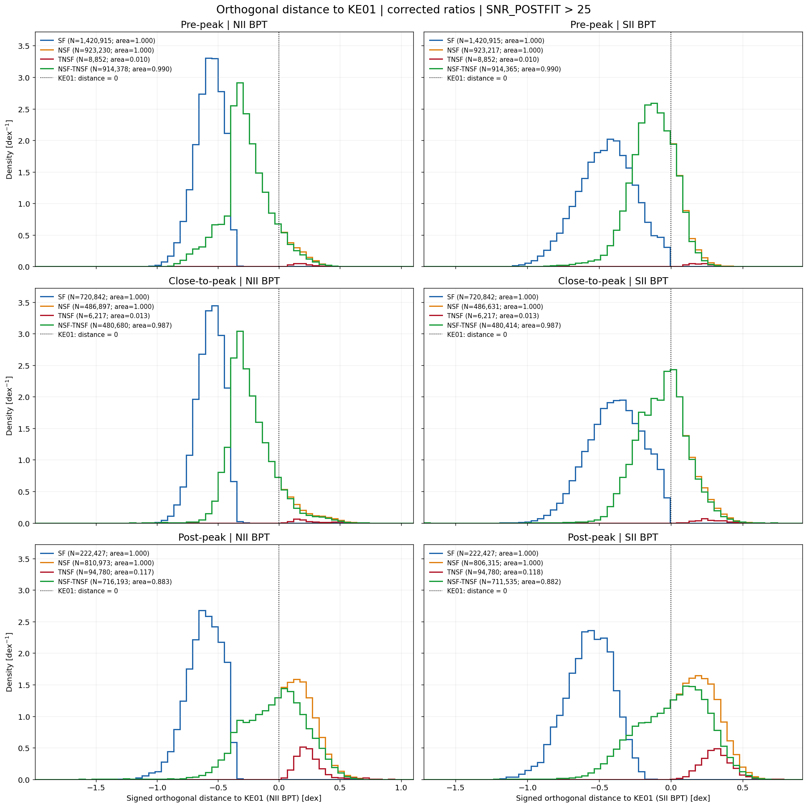

# 20261008 Distribution of SF NSF TNSF BPT Distances Across Infall Stages

Let $x=\log_{10}([\mathrm{NII}]/\mathrm{H}\alpha)$ or $\log_{10}(([\mathrm{SII}]6716+[\mathrm{SII}]6730)/\mathrm{H}\alpha)$, and $y=\log_{10}([\mathrm{OIII}]/\mathrm{H}\beta)$. Here i use the KE01 demarcation curve:
$$
f_{\mathrm{NII}}(u)=\frac{0.61}{u-0.47}+1.19,\quad u<0.47, \\
f_{\mathrm{SII}}(u)=\frac{0.72}{u-0.32}+1.30,\quad u<0.32.
$$

The orthogonal magnitude is the shortest Euclidean distance to the curve in log-ratio space (with $b=0.47$ for NII, $b=0.32$ for SII):

$$
|d_\perp|=\min_{u<b}\sqrt{(x-u)^2+[y-f(u)]^2}.
$$
Then, as usual, we have the SF and NSF regions; and in side NSF, we further define the TNSF and NSF-TNSF. NSF-TNSF should correspond to the `COMP` region in NII BPT, which indicate the substaintial mixing region of SF and TNSF. 

As for the normalization of histogram, SF and NSF each integrate to 1 when nonempty. Within each stage and diagram, let $n_{C,i}$ be the count in distance bin $i$, $\Delta d_i$ its width, and $N_C$ the total finite paired distances in catalogue $C$. And so we make sure the sum of distributions of TNSF and NSF-TNSF add up to NSF in each bin:

$$
h_{\rm SF,i}=\frac{n_{\rm SF,i}}{N_{\rm SF}\Delta d_i},\qquad

h_{\rm NSF,i}=\frac{n_{\rm NSF,i}}{N_{\rm NSF}\Delta d_i},\\

h_{\rm TNSF,i}=\frac{n_{\rm TNSF,i}}{N_{\rm NSF}\Delta d_i},\qquad

h_{\rm NSF-TNSF,i}=\frac{n_{\rm NSF-TNSF,i}}{N_{\rm NSF}\Delta d_i}.
$$
And as expected, in both pre-peak and close-to-peak, all distributions are nearly identical, with almost all the NSF components are actually the NSF-TNSF, which are `COMP` regions. But going to post-peak, we can see that we have less SF regions, though their position from the KE01 curve seems unchanged. But more importantly, NSF regions move towards the positive side of the KE01 curve, with a substantial increasement of TNSF component inside them. However, we still cannot tell if it is solely fading of HII region revealing more TNSF component that was outshined by HII, or there are somethings affected by environemnt and this cause more regions become TNSF (or even make TNSF spectra harder, accroding the higher line ratios). 

