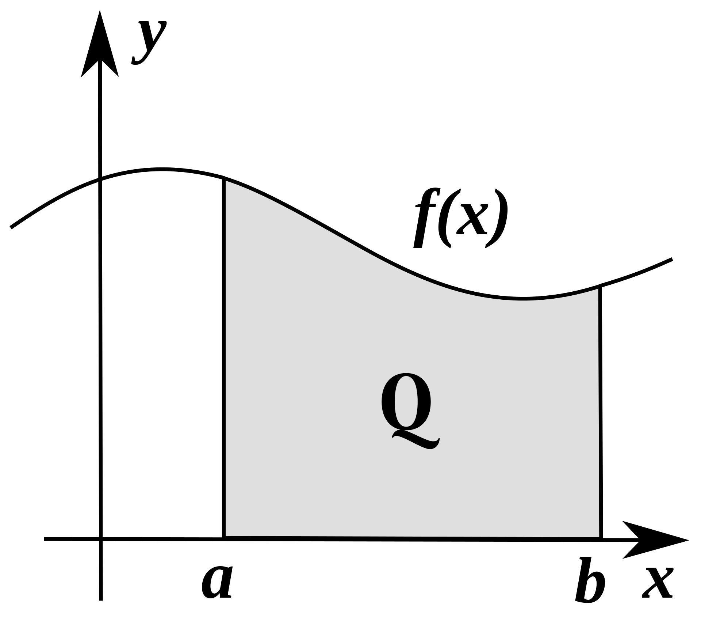

# Prerequisites

Load libraries and set random seed for this chapter:
```{r,message=F}
library(magicaxis)
library(foreach)
library(pracma) # excellent package with 220 numerical analysis functions
library(cubature) # additional functions for numerical integration
library(cooltools) # MC integrators
set.seed(1)
```

# Numerical integration

Let $f:\mathbb{R}\mapsto\mathbb{R}$ be a smooth function, of which we would like to compute the definite integral
\begin{equation}\label{eq:Qint}
  Q = \int_a^b f(x) dx.
\end{equation}

Graphically, this corresponds to computing the area under the curve $f(x)$ on the domain $x\in[a,b]$:
```{r, echo=FALSE, out.width = '25%', fig.align='center'}

```

## Newton-Cotes Integration

To provide some appreciation for the guts of numerical integration, we first build our own integrator relying on intuitive, but rarely used algorithms. The later sections will be more pragmatic and simply explain how integrals and other calculus operations can be performed by calling the right routines in **R**. 

The core idea of almost any numerical integrator is to approximate the integral $Q$ by a finite sum of $n$ numbers. In the case of a so-called *Riemann sum*, we subdivide the interval $[a,b]$ into $n$ intervals $[a_i,b_i]$ of identical widths
\begin{equation}
  \Delta x = \frac{b-a}{n}.
\end{equation}

The integral $Q$ can then be written as
\begin{equation}
  Q = \sum_{i=1}^n Q_i, \text{ where }Q_i=\int_{a_i}^{b_i} f(x) dx.
\end{equation}

This equation is still exact. No approximation has been made yet, but the idea now is to substitute the terms $Q_i$ for some approximate values $\tilde Q_i$. One of the simplest schemes is the *Newton-Cotes* method, in which $f(x)$ is approximated by a polynomial function $\tilde f(x)$, defined separately over each interval $[a_i,b_i]$,
\begin{equation}
  f(x) \approx \tilde f(x) = \sum_{j=0}^k \alpha_{ij} x^{j},
\end{equation}
where $k\in\mathbb{N}$ is the degree of the polynomial and $\alpha_{ij}\in\mathbb{R}$ are the polynomial coefficients corresponding to the interval $i$. The approximation functions $\tilde f(x)$ can then be integrated analytically to
\begin{equation}\label{eq:F}
  \tilde F(x) = \int \tilde f(x)dx = \sum_{j=0}^k \alpha_{ij} (j+1)^{-1} x^{j+1}.
\end{equation}

Thus, the integral $Q_i$ is approximated by
\begin{equation}\label{eq:Qi}
  Q_i \approx \tilde Q_i = \tilde F(b_i)-\tilde F(a_i) = \sum_{j=0}^k \alpha_{ij} (j+1)^{-1} (b_i^{j+1}-a_i^{j+1}).
\end{equation}

In order to evaluate $\tilde Q_i$, we must know the $k+1$ coefficients $\alpha_{ij}$. In the *Newton-Cotes* method, these coefficients are determined from $k+1$ evaluations of $f(x)$ at equally spaced points $x_{ij}$ between $a_i$ and $b_i$. We here construct these points, such that they include the end-points $a_i$ and $b_i$, i.e. $x_{ij}=a_i+j\Delta x/k$ for $j=0,...,k$, except if $k=0$, in which case we pick the mid-point $x_{i0}=(a_i+b_i)/2$. The $k+1$ coefficients $\alpha_{ij}$ can then be written analytically as a function of the $k+1$ values $f(x_{ij})$ (by solving a system of $k+1$ equations). It can be shown, using some straightforward algebraic calculations, that these expressions simplify eq.\ (\ref{eq:Qi}) to
\begin{equation}
  \tilde Q_i = \Delta x\sum_{j=0}^k w_j f(x_{ij})
\end{equation}
with universal weights $w_j$ that do not depend on the interval $i$. These weights are given in Table 1.

\begin{table}[ht]
\centering
\begin{tabular}{llll}
\hline
Degree $k$ & Name & Weights $\{w_j\}$ & Order \\ \hline
0 & Midpoint rule & 1 & 2 \\
1 & Trapezoid rule & 1/2,1/2 & 2 \\
2 & Simpson's rule & 1/6,2/3,1/6 & 4 \\
3 & Simpson's 3/8 rule & 1/8,3/8,3/8,1/8 & 4 \\
4 & Boole's rule & 7/90,16/45,6/45,16/45,7/90 & 6 \\ \hline
\end{tabular}
\caption{Coefficient weights of Newton-Cotes algorithms.}
\end{table}

When approximating $Q$ as the sum of $\tilde Q_i$, it helps to realise that for $k>0$ the last point of an interval is identical to the first point of the next interval, $x_{ik}=x_{i+1,0}$, and their weights are equal, $w_0=w_k$. Therefore $f(x)$ only has to be evaluated once with twice the weight. The following **R** code implements this algorithm:

```{r}
newton.cotes.integral = function(f,a,b,n,k) {
  h = (b-a)/n # = delta x
  if (k==0) {
    x = seq(a+h/2,b-h/2,length=n)
    w = 1
  } else if (k>=1 & k<=4) {
    x = seq(a,b,length=n*k+1)
    w.sub = list(c(1,1)/2,c(1,4,1)/6,c(1,3,3,1)/8,c(7,32,12,32,7)/90)[[k]] # weights
    w = c(rep(w.sub[1:k],n),w.sub[1]) # concatenate intervals
    if (n>1) w[seq(k+1,by=k,length=n-1)] = 2*w[seq(k+1,by=k,length=n-1)]
  } else {
    stop('degree k unknown')
  }
  return(sum(h*w*f(x)))
}
```

As an example, let us evaluate the integral

\begin{equation}\label{eq:sinexample}
  Q = \int_0^3 \sin(x^2) dx.
\end{equation}

This integral can be solved analytically, leading to the solution $Q=0.77356252689376892028860766...$, against which we can compare our numerical approximations. A few lines to initialise the code:

```{r}
a = 0
b = 3
f = function(x) sin(x^2)
solution = 0.77356252689376892028860766 # analytical solution
```

We first evaluate $Q$ using $n=5$ intervals for the polynomial degrees $k=0,...,4$.

```{r}
for (k in 0:4) {
  Q = newton.cotes.integral(f,a,b,5,k)
  error = abs(Q-solution)/solution
  cat(sprintf('Degree = %d, Q = %.6f, Relative error = %.6f\n',k,Q,error))
}
```

Clearly, higher degree methods perform better. This is also obvious from the following figures, where we visualise the polynomial approximations (red) of the function $f(x)$ (black).

```{r, echo=FALSE, out.width = "220px"}
knitr::include_graphics("../figures/fig_n5_degree0.pdf")
knitr::include_graphics("../figures/fig_n5_degree1.pdf")
knitr::include_graphics("../figures/fig_n5_degree2.pdf")
knitr::include_graphics("../figures/fig_n5_degree3.pdf")
knitr::include_graphics("../figures/fig_n5_degree4.pdf")
```

Next, we compute the same integral using $n=10$ intervals:

```{r, echo=FALSE}
for (degree in 0:4) {
  Q = newton.cotes.integral(f,a,b,10,degree)
  error = abs(Q-solution)/solution
  cat(sprintf('Degree = %d, Q = %.6f, Relative error = %.6f\n',degree,Q,error))
}
```

As expected, the errors have become smaller. Interestingly, the relative improvement is larger for higher degrees. This can be quantified by the *order* of the algorithm: the order $\mathcal{O}$ is defined as the scaling of the expected error $\langle\Delta Q\rangle$ as a function of the number of evaluations $N$, which, in our case, is proportional to the number of intervals $n$. For instance, if $\langle\Delta Q\rangle\propto n^{-p}$, one generally writes $$\Delta Q=\mathcal{O}\left(\frac{1}{n^p}\right).$$

In casual language an algorithm with a power law order $1/n^p$ is often called an algorithm "of order $p$" or simply a "$p$-th order algorithm".

Let us determine the order of our methods numerically, by gradually increasing the number of intervals from $1$ to $10^4$:

```{r, out.width = '70%', fig.align='center'}
magplot(NA,xlim=c(1,1e4),ylim=c(1e-12,1),log='xy',
        xlab='Number of evaluations of f(x)',ylab='Relative error')
nlist = round(10^seq(0,4,by=0.01))
x = y = p = {} # lists for later use
mycolor = rainbow(7,end=5/6,v=0.8)

for (k in (0:4)) {
  
  i = k+1
  
  # Determine number of evaluations used in the numerical integrals of degree k
  if (k==0) {
    x[[i]] = nlist
  } else {
    x[[i]] = nlist*k+1
  }
  
  # Determine relative error
  y[[i]] = foreach(j=1:length(nlist),.combine=c)%do%{
    Q = newton.cotes.integral(f,a,b,nlist[j],k)
    abs(Q-solution)/solution
  }
    
  # Plot line
  lines(x[[i]],y[[i]],col=mycolor[i],lwd=2)
  
  # Determine numerical order by fitting a power law
  s = x[[i]]>50 & y[[i]]>1e-12
  p[[i]] = as.vector(lm(log(y[[i]][s])~poly(log(x[[i]][s]),1,raw=TRUE))$coefficients)
  curve(exp(p[[i]][1])*x^p[[i]][2],lty=2,add=T,xlim=c(50,1e4))
  cat(sprintf('Newton-Cotes of degree %d is of order O(1/n^%.0f).\n',k,-p[[i]][2]))
}
```

The above code fits the relation between the number of evaluations of $f(x)$ and the relative error of the numerical integral with a power law, i.e.\ a linear function in log-log space (dashed lines in the figure). The fit is performed using the built-in function **lm** (see documentation by typing `?lm`). We only fit the relative errors for more than 50 evaluations to ignore the unsteady behaviour at lower numbers.

Eq. (\ref{eq:F}) approximates $F(x)$ by summing $k$ polynomials, each producing an error of order $\mathcal{O}(x^{k+2})$. One might therefore expect that the Newton-Cotes algorithm of degree $k$ has an error of order $p=k+1$. However, our analysis shows that this is only true for odd degrees $k$, whereas even degrees are of order $p=k+2$. This is an interesting property of the Newton-Cotes scheme, which can intuitively be understood at the example of $k=0$ (Mid-point rule) and $k=1$ (Trapeze rule): The area of a trapeze can always be expressed as the area of a rectangle, whose constant height is the mean height of the trapeze. Thus, making trapezes instead of rectangles doesn't make a difference for the quality of the approximation. This argument can be expressed mathematically and applied between any even degree $k$ and odd degree $k+1$. By consequence, Newton-Cotes algorithms of odd degree are barely used, since they are no better than the next lower even degree, which requires fewer evaluations of $f(x)$.

## Using professional algorithms

Newton-Cotes methods are rarely used in practice, because more powerful schemes can be obtained by allowing the intervals to vary, such as in the Gaussian quadrature formulas. On the downside, Gaussian quadrature rules do not *nest*, i.e. the same evaluation points cannot be reused if the intervals are subdivided into several sub-intervals. The so-called *Gauss-Kronrod* quadrature formulas overcome this limitation. Other methods with varying intervals that nest include *Clenshaw-Curtis* quadrature. Moreover, there are algorithms with adaptive intervals, i.e. varying intervals whose spacing depends on the function to be integrated. Adaptive versions of the Newton-Cotes algorithm, especially *adaptive Simpson rules* are quite commonly used.

In **R**, one-dimensional integrals can be evaluated using the built-in function **integrate**, whereas higher-dimensional integrals require special packages. A plethora of such packages are available on CRAN. For example, the **pracma** and **cubature** packages offer powerful routines for numerical integration in terms of speed and accuracy.

### 1D integrals

One-dimensional integrals can be evaluated using the built-in function **integrate**, which also returns an estimate of the error. For instance to solve the integral of the previous section, it suffices to write

```{r}
integrate(f,a,b)
```
This function uses a variation of the Gauss-Kronrod quadrature algorithm. Sometimes, e.g. in the presence of fast oscillations, **integrate** is prone to problems. For instance,

```{r}
cat(try(integrate(f,0,1e2),silent=TRUE)[[1]])
```

Clearly, this integral is *not* divergent, since $f(x)\in[-1,1]~~\forall x\in\mathbb{R}$.
In most cases, the **integral** function of the **pracma** package is more stable, but significantly slower, as it uses a better implementation of the Gauss-Kronrod algorithm and also masters other methods.

```{r}
integral(f,0,1e2)
```
Unfortunately, **integral** it does not return an error estimate, but it is generally very accurate and tries to keep the relative error below the argument *reltol*, which defaults to $10^{-8}$.

An even more powerful, but still slower routine is the **cubintegrate** function of the **cubature** package.
```{r}
cubintegrate(f,0,1e2)
```
This function almost always returns very accurate results, along with an error estimate and additional information. It also has a lot of optional arguments that allow the user to control the algorithm and accuracy of the computation (see package documentation).

#### Integrals over infinite intervals.

Several methods exist to numerically evaluate unbounded integrals. One such method relies on a change of variables, mapping the infinite bounds to a finite interval; e.g., to integrate over the unbound real domain $x\in\mathbb{R}$, one can use the substitution

\begin{equation}
  \int_{-\infty}^{\infty} f(x) \, dx = \int_{-1}^{+1} f\left( \frac{t}{1-t^2} \right) \frac{1+t^2}{(1-t^2)^2} \, dt,
\end{equation}

and for semi-infinite intervals one can use the substitutions

\begin{equation}
\int_a^{\infty}f(x) \, dx = \int_0^1 f\left(a + \frac{t}{1-t}\right) \frac{dt}{(1-t)^2}
\quad\text{and}\quad
\int_{-\infty}^a f(x) \, dx = \int_0^1 f\left(a - \frac{1-t}{t}\right) \frac{dt}{t^2}.
\end{equation}

In **R**, (semi-)infinite integrals can be evaluated using the boundaries `Inf`. For instance, to integrate a normal distribution (built-in function **dnorm**) from 0 to $\infty$, use:

```{r}
integral(dnorm,0,Inf)
integral(dnorm,-Inf,Inf)
```

Note, however, that infinite boundaries sometimes lead to problems. In practice, it is often preferable to use large, but finite boundaries instead, accepting a small controlled error to avoid systematic errors:

```{r}
integral(dnorm,-1e2,1e2)
```

### 2D and 3D integrals

For double and triple integrals, use the **integral2** and **integral3** functions of the **pracma** package or the **cubintegrate** function of the **cubature** package. The latter is more accurate, more stable and allows more control of the error, but it is generally slower.

Example of a 2D integral:

```{r}
f2 = function(x,y) exp(-x^2)*sin(y)
integral2(f2,xmin=-1,xmax=1,ymin=0,ymax=1)
```

When using **cubintegrate**, the function arguments and boundaries must be provided as vectors:

```{r}
g2 = function(x) exp(-x[1]^2)*sin(x[2])
cubintegrate(g2,c(-1,0),c(1,1))
```

Example of a 3D integral:

```{r}
f3 = function(x,y,z) exp(-x^2)*sin(y+z)
integral3(f3,xmin=-1,xmax=1,ymin=0,ymax=1,zmin=0,zmax=2)
```

or, using **cubintegrate**:

```{r}
g3 = function(x) exp(-x[1]^2)*sin(x[2]+x[3])
cubintegrate(g3,c(-1,0,0),c(1,1,2))
```

As in 1D, infinite bounds are allowed:

```{r}
integral3(f3,xmin=-Inf,xmax=Inf,ymin=0,ymax=1,zmin=0,zmax=2)
```

and

```{r}
cubintegrate(g3,c(-Inf,0,0),c(Inf,1,2))
```

#### 2D and 3D integral with varying boundaries.

The routines `integral2(f,xmin,xmax,ymin,ymax)` and `integral3(f,xmin,xmax,ymin,ymax,zmin,zmax)` also accept functions for the inner interval limits: `ymin` and `ymax` must be constants or functions of one variable (`x`); `zmin`, `zmax` must be constants or functions of two variables (`x,y`). All function boundaries must be vectorized. For example, to evaluate $\int_{x=0}^{1}\int_{y=0}^x xy\,dx\,dy,$ use:

```{r}
f2 = function(x,y) x*y
ymax = function(x) x
integral2(f2,0,1,0,ymax)
```

This matches the analytical result of $1/8$.

## Monte Carlo Integration

A fundamentally different class of numerical integration schemes are stochastic methods, such as the Monte Carlo (MC) integrator. The simplest version of MC approximates the integral of eq. (\ref{eq:Qint}) as $$Q \approx \Delta x \sum_i^n f(x_i),$$ where $\Delta x=(a-b)/n$ and $x_i$ are $n$ *(pseudo)-random* numbers drawn uniformly from the interval $[a,b]$. Visually, this approximation looks like this (for $n=50$):

```{r, echo=FALSE, out.width = "220px", fig.align='center'}
knitr::include_graphics("../figures/fig_n50_mc.pdf")
```

The MC method does *not* require $f(x)$ to be a differentiable function, not even a continuous one. Moreover, the basic MC method is very easy to implement. In **R**, it only takes a few lines:

```{r, eval=F}
monte.carlo.integral = function(f,a,b,n) {
  x = runif(n,min=a,max=b)
  dx = (b-a)/n
  return(dx*sum(f(x)))
}
```

Even just one, if you like!
```{r}
monte.carlo.integral = function(f,a,b,n) mean(f(runif(n,a,b)))*(b-a)
```

Let us evaluate our integral of eq.\ (\ref{eq:sinexample}) using this integrator with $n=1000$:
```{r}
Q = monte.carlo.integral(f,a,b,1e3)
cat(sprintf('Q = %.6f, Relative error = %.6f\n',Q,abs(Q-solution)/solution))
```

We repeat this one more time:
```{r}
Q = monte.carlo.integral(f,a,b,1e3)
cat(sprintf('Q = %.6f, Relative error = %.6f\n',Q,abs(Q-solution)/solution))
```

And one more time:
```{r}
Q = monte.carlo.integral(f,a,b,1e3)
cat(sprintf('Q = %.6f, Relative error = %.6f\n',Q,abs(Q-solution)/solution))
```

Clearly, the result of the MC integrator changes each time the integrator is called, as it depends on the current state of  the pseudo-random number generator. This is a fundamental difference between *stochastic* integrators and the *deterministic* integrators discussed before (e.g. Newton-Cotes). Due to their stochastic nature, the errors of MC integrators cannot be strictly bounded. It is, however, possible to characterise the expectation of the error in a meaningful way. To show this, let us re-evaluate the previous example for an increasing number of evaluations $n$ and add the result to our previous plot of the relative errors:

```{r, out.width = '70%', fig.align='center'}
x[[6]] = nlist # number of evaluations
y[[6]] = foreach(j=1:length(nlist),.combine=c)%do%{
  Q = monte.carlo.integral(f,a,b,nlist[j])
  abs(Q-solution)/solution # relative error
}
p[[6]] = as.vector(lm(log(y[[6]])~poly(log(x[[6]]),1,raw=TRUE))$coefficients) # fit
magplot(NA,xlim=c(1,1e4),ylim=c(1e-12,1),log='xy',
        xlab='Number of evaluations of f(x)',ylab='Relative error')
for (i in 1:6) {
  lines(x[[i]],y[[i]],col=mycolor[i],lwd=2)
  curve(exp(p[[i]][1])*x^p[[i]][2],lty=2,add=T,xlim=c(50,1e4))
}
cat(sprintf('Monte Carlo integrator is of order O(1/n^%.1f).\n',-p[[6]][2]))
```

As perhaps expected, the relative error of the MC algorithm (dark blue) decreases as $\sqrt{n}$, i.e. this algorithm is of order $$\Delta Q=\mathcal{O}\left(\frac{1}{\sqrt{n}}\right),$$ or, in abbreviated language, of order $1/2$. Clearly, this is a very poor performance, even compared to the archaic midpoint rule. Because of the stochasticity, the error of a specific evaluation of the MC integrator does not decrease monotonically (see jitter of dark blue line), but its expectation does indeed decrease monotonically.

A major advantage of the MC method over deterministic algorithms is that it easily generalises to *high-dimensional* integrals. Most deterministic algorithms (such as Newton-Cotes) can be extended to $D>1$ dimensions, however, the equations and implementations become much more complicated and their order generally reduces from $\mathcal{O}(1/n^p)$ to $\mathcal{O}(1/n^{p/D})$. By contrast, the MC algorithm is of order $\mathcal{O}(1/\sqrt{n})$ in *any* dimension, making it very competitive to solve high-dimensional integrals. In **R**, the *D*-dimensional MC integrator can be written as

```{r}
monte.carlo.integral.multivariate = function(f,a,b,n) {
  # f(x) is a function a D-dimensional vector x
  # a and b are D-dimensional vectors specifying the boundaries
  d = length(a) # number of dimensions
  x = array(runif(n*d),c(d,n))*(b-a)+a
  dx = prod(b-a)/n # volume element
  Q = 0
  for (i in 1:n) Q = Q+f(x[,i])
  return(Q*dx)
}
```

### Example: Volumes of hyper-spheres

Let us calculate the volume of a $D$-sphere of unit radius. The interior of such a sphere is represented by the function

\begin{equation}
  f(\mathbf{x}) = \begin{cases} 1 & \mbox{if } |\mathbf{x}|\leq1 \\ 0 & \mbox{otherwise.} \end{cases}
\end{equation}

The analytic solution for the volume $V=\int_{-1}^1...\int_{-1}^1 d^Dx f(\mathbf{x})$ is

\begin{equation}
  V_D = \frac{\pi^{D/2}}{\Gamma(D/2+1)}.
\end{equation}

The MC solutions for $D=1,...,9$ using $n=10^5$ random evaluations are:

```{r}
sphere = function(x) as.numeric(sum(x^2)<=1)
for (d in seq(9)) {
  volume.true = pi^(d/2)/gamma(d/2+1)
  volume = monte.carlo.integral.multivariate(sphere,rep(-1,d),rep(1,d),1e5)
  cat(sprintf('%d-sphere volume estimate = %.4f (relative error = %.2f%%)\n',
              d,volume,abs(volume-volume.true)/volume.true*100))
}
```

As we can see, the MC method works well and is accurate to about 1\% up to $D=7$. For higher dimensions the error increases. However, this increase is *not* related to the algorithm, but simply to the fact that the true volume of the $D$-sphere becomes very small compared to the volume of the $D$-cube ($2^D$) in which the integral is evaluated -- in other words, this behaviour is a peculiarity of the $D$-sphere rather than the MC method. In all cases it is true that the error scales, on average, as $1/\sqrt{n}$.

## Quasi-Monte Carlo Integration

The use of random numbers (or pseudo-random numbers) in MC has the drawback that random numbers have *high discrepancy*. Roughly speaking, this means that the numbers are quite clustered, such that equal sub-intervals can be very differently populated by random numbers. For instance, if we draw two random numbers uniformly from $[0,1]$, there is a 50% chance that both numbers lie either in the left sub-interval $[0,1/2)$ or in the right sub-interval $[1/2,1]$, while the other interval stays empty. For our MC integrator, it would seem preferable to use stochastic numbers that sample the interval more uniformly. This is achieved by *quasi-random* numbers (also called *sub-random* numbers).

One of the simplest algorithms to generate quasi-random numbers is the *additive recurrence* algorithm, in which the $i$-th uniform random number $r_i\in[0,1]$ is defined as $$r_i = (\alpha\cdot i)~{\rm mod}~1,$$ where $\alpha$ is an *irrational* number, for instance $\alpha=\sqrt{2}$. (NB: Theoretically, the golden ratio, $\alpha=(\sqrt{5}-1)/2\approx0.618034$, produces the lowest discrepancy, but $\alpha=\sqrt{2}$ is nearly as good.)

Let us illustrate the distribution of $10^4$ quasi-random numbers (orange), compared to $10^4$ pseudo-random numbers (black).

```{r, out.width = '70%', fig.align='center'}
r1 = runif(10000) # pseudo-random number
r2 = ((1:10000)*sqrt(2))%%1 # quasi-random number
maghist(r1,verbose=FALSE,col='orange',border=NA)
maghist(r2,verbose=FALSE,add=T)
```

Clearly, the quasi-random numbers are much more uniform.

We can use these quasi-random numbers in our previous MC integrator, leading to the *quasi-Monte Carlo* (QMC) integrator. In **R**, this can be implemented as:

```{r}
quasi.monte.carlo.integral = function(f,a,b,n) {
  x = ((1:n)*sqrt(2))%%1 # n quasi-random numbers on the interval [0,1)
  x = x*(b-a)+a # recast the numbers to the interval [a,b)
  return(sum(f(x))*(b-a)/n)
}
```

Applied to the previous example of integrating $\sin(x^2)$ we get the following result.

```{r, out.width = '70%', fig.align='center'}
x[[7]] = nlist # number of evaluations
y[[7]] = foreach(j=1:length(nlist),.combine=c)%do%{
  Q = quasi.monte.carlo.integral(f,a,b,nlist[j])
  abs(Q-solution)/solution # relative error
}
p[[7]] = as.vector(lm(log(y[[7]])~poly(log(x[[7]]),1,raw=TRUE))$coefficients) # fit

magplot(NA,xlim=c(1,1e4),ylim=c(1e-12,1),log='xy',
        xlab='Number of evaluations of f(x)',ylab='Relative error')
for (i in 1:7) {
  lines(x[[i]],y[[i]],col=mycolor[i],lwd=2)
  curve(exp(p[[i]][1])*x^p[[i]][2],lty=2,add=T,xlim=c(50,1e4))
}
```

Interestingly, the QMC integrator (purple) performs better than the MC integrator (dark blue), and its scaling with $n$, i.e. its order, is different. It can be proven that, given certain regularity conditions of the integrand, the QMC integrator in one dimension is of order $\Delta Q=\mathcal{O}(\log(n)/n),$ which is close to $\mathcal{O}(1/n)$ and significantly better than the order $\mathcal{O}(1/\sqrt{n})$ of the stadard MC integrator.

The QMC can be extended to $D>1$ dimensions, as long as a separate sequence of quasi-random numbers is used in each dimension. In the context of the additive recurrence algorithm, this is achieved by using different values of $\alpha$ for each dimension, with irrational ratios between any two values of $\alpha$. A good and common choice are the square roots of the primes from two upwards, $$\alpha=\sqrt{2},\sqrt{3},\sqrt{5},\sqrt{7},\sqrt{11},...$$

Unfortunately, the order of the QMC decreases with increasing dimensionality, unlike in the MC integrator whose order is independent of $D$. Generally, QMC integrators are of order $$\mathcal{O}\left(\frac{\log(n)^D}{n}\right).$$ Therefore, either MC or QMC might perform better, depending on the integrand, $n$ and $D$.

Let us implement the $D$-dimensional QMC algorithm and use it to recompute the volumes of the $D$-spheres up to $D=9$.

```{r}
quasi.monte.carlo.integral.multivariate = function(f,a,b,n) {
  # f(x) is a function a D-dimensional vector x
  d = length(a) # number of dimensions
  alpha = sqrt(primes(1000))[1:d] # vector of irrational numbers
  x = array(NA,c(d,n))
  for (i in seq(d)) x[i,] = (seq(n)*(1+alpha[i]))%%1*(b[i]-a[i])+a[i]
  dx = prod(b-a)/n
  Q = 0
  for (i in seq(n)) Q = Q+f(x[,i])
  return(Q*dx)
}
```

```{r}
for (d in seq(9)) {
  volume.true = pi^(d/2)/gamma(d/2+1)
  volume = quasi.monte.carlo.integral.multivariate(sphere,rep(-1,d),rep(1,d),1e5)
  cat(sprintf('%d-sphere volume estimate = %.4f (relative error = %.2f%%)\n',
              d,volume,abs(volume-volume.true)/volume.true*100))
}
```

Judging from the relative errors, the QMC integrator performs better than the MC integrator in this example, but the difference becomes smaller for higher dimensions.

Slightly more sophisticated implementations of the MC and QMC integrators discussed in this chapter are available in the **cooltools** package. In this package, both the MC and QMC integrators are called using the routine **mcintegral** (see associated documentation). This routine also returns an estimate of the 1-sigma statistical uncertainty of the integral. Unlike our basic MC integrators above, **mcintegral** can handle *vectorized* $D$-dimensional functions, which return an $N$-element vector, given an $N$-by-$D$ input argument (analogously to the **rng** function, discussed earlier). Such vectorization significantly accelerates the computation. In the case, of our `sphere` function, it suffices to replace `sum` by `rowSums` to obtain a vectorized function. As an example, let us re-evaluate the volume of the 4-sphere with QMC:
```{r}
sphere.vect = function(x) as.numeric(rowSums(x^2)<=1)
Q = mcintegral(sphere.vect,rep(-1,4),rep(1,4),1e5,qmc=TRUE)
cat(sprintf('4-sphere volume estimate = %.4f+-%.4f\n',Q$value,Q$error))
```

A powerful refinement of the MC and QMC methods are so-called MCMC-based integrators (discussed in part 5), which preferentially sample regions that contribute significantly to the integral of $f$. However, these methods are significantly harder to implement and more restrictive regarding the properties of the integrand (e.g. conditions on continuity and/or differentiability).

### Example: Gravitational energy of a homogenous cube

The gravitational binding energy between two point masses $dM_1$ and $dM_2$ separated by a distance $r$ is $$dU=-\frac{G\,dM_1\,dM_2}{r}.$$ You can easily convince yourself that this implies that a homogeneous cube of mass $M$ and side length $L$ has a gravitational energy of $$U = \frac{GM^2}{L}Q,~\text{where}~Q=-\frac{1}{2}\int_0^1\int_0^1\int_0^1\int_0^1\int_0^1\int_0^1 \frac{d^3x~d^3y}{|\mathbf{x}-\mathbf{y}|}.$$

Let us now evaluate $Q$, using a QMC integrator:

```{r}
f = function(x) -1/2/sqrt((x[,1]-x[,4])^2+(x[,2]-x[,5])^2+(x[,3]-x[,6])^2)
Q = mcintegral(f,rep(0,6),rep(1,6),1e5,qmc=TRUE)
cat(sprintf('Q = %.4f+-%.4f',Q$value,Q$error))
```

It is possible, but very challenging, to solve this six-dimensional integral analytically (see https://core.ac.uk/download/pdf/25280517.pdf). The exact solution is $$Q=\frac{\pi}{3}+\frac{2\sqrt{3}-\sqrt{2}-1}{5}+\ln\Big(\left(\sqrt{2}-1\right)\left(2-\sqrt{3}\right)\Big)=-0.9411563...$$ The numerical result is indeed consistent with this solution.

Note that for a sphere $U=-\frac{3GM^2}{5R}$; hence if the cube is morphed into a sphere of identical volume ($R=(3/4\pi)^{1/3}L$), $Q$ would decrease by about 3% to $Q=-(3/5)\cdot(4\pi/3)^{1/3}=-0.9671952...$

\newpage
# Numerical differentiation

The **pracma** package contains powerful routines for numerical differentiation.

## Derivatives of $f(x)$

To compute the derivatives $d^nf/dx^n(x)$, use the function **fderiv(f,x,n)**, which is normally stable up to $n=4$. If **x** is a vector, the derivative will be evaluated for each element. 

*Caution:* I recommend against computing higher than 4th derivatives. I also recommend against specifying a step size *h* when calling **fderiv** as this can lead to errors. Do not use the functions **numderiv** and **numdiff**, since they are less stable than **fderiv**.

As an example, let us plot the first three numerically computed derivatives of a sin-function with some tangent vectors, requiring up to 4th derivatives. The analytical solutions are plotted as thick shaded lines, while the numerical solutions are over-plotted as thin solid lines and arrows.

```{r, out.width = '70%', fig.align='center'}
f = function(x) sin(x)
col = c('black','blue','orange','red')
magplot(NA,xlim=c(0,3.4),ylim=c(-1,1),
        xlab='x',ylab=expression('d'^'n'*'/dx'^'n'*'sin(x)'))
x = seq(0,pi,length=5)
dx = 0.3

for (n in seq(4)) {
  y = function(x) fderiv(f,x,n-1) # if n=1, this is identical to setting y=f
  g = function(x) fderiv(f,x,n)
  curve(list(sin(x),cos(x),-sin(x),-cos(x))[[n]],0,pi,col=col[n],lwd=4,add=T)
  curve(list(sin(x),cos(x),-sin(x),-cos(x))[[n]],col='#ffffffaa',lwd=8,add=T)
  curve(y,0,pi,col=col[n],add=T)
  arrows(x,y(x),x+dx,y(x)+dx*g(x),col=col[n],length=0.1)
}
```

\newpage
## Derviatives of fields

### Gradient vector of a scalar field $f(\mathbf{x})$

The first derivatives of a scalar field $f:\mathbb{R}^n\mapsto\mathbb{R}$ can be grouped in a *n*-element vector field, called the *gradient* field,

\begin{equation}
  \nabla f(\mathbf{x}) = \left(\frac{\partial f}{\partial x_1},...,\frac{\partial f}{\partial x_n}\right).
\end{equation}

The gradient can be computed using the **grad(f,x)** routine, which returns an $n$-element vector. As an example, let us compute the gradient field of a 2D function:

```{r, out.width = '70%', fig.align='center'}
f = function(x) sum(c(5*exp(-(2*x[1]^2-4*x[1]+x[2]^2+x[2]-x[1]*x[2]+5)*1),
                      exp(-(x[1]^2+x[1]+x[2]^2+x[1]*x[2]+1)*2)))
n = 200
r = seq(-2,2,length = n)
z = array(0,c(n,n))
for (i in seq(n)) {
  for (j in seq(n)) {
    z[i,j] = f(c(r[i],r[j]))
  }
}
magimage(r,r,z,col=heat.colors(256),asp=0.5)
ds = 0.5
for (x1 in seq(-1.8,1.8,by=0.2)) {
  for (x2 in seq(-1.8,1.8,by=0.2)) {
    x = c(x1,x2)
    g = grad(f,x)
    if (sum(g^2)>0.005) {
      arrows(x1,x2,x1+ds*g[1],x2+ds*g[2],length=0.05)
    } else {
      points(x1,x2,pch=20,cex=0.5)
    }
  }
}
```

In this figure, the scalar field $f(\mathbf{x})$ is shown as heat map and the gradient field is represented by the arrows.

### Jacobian matrix of a vector field $\mathbf{f}(\mathbf{x})$

The extension of the gradient to vector functions $\mathbf{f}:\mathbb{R}^n\mapsto\mathbb{R}^m$ is the *Jacobian*, a *m*-by-*n* matrix defined as $$J_{ij} = \frac{\partial f_i}{\partial x_j}.$$

This matrix can be calculated using **jacobian(f,x)**. For a scalar field ($m=1$), **jacobian(f,x)** is identical to **grad(f,x)**.

### Laplacian of a scalar field $f(\mathbf{x})$

The Laplacian (=divergence of the gradient) of a scalar field $f:\mathbb{R}^n\mapsto\mathbb{R}$, $$\Delta f\equiv \nabla^2f \equiv \sum_{i=1}^n\frac{\partial^2f}{\partial x_i^2},$$ can be computed using **laplacian(f,x)**.

### Hessian matrix of a scalar field $f(\mathbf{x})$

The second derivatives of a scalar field $f:\mathbb{R}^n\mapsto\mathbb{R}$ are normally represented by the *n*-by-*n* *Hessian matrix* $$H_{ij} = \frac{\partial^2f}{\partial x_i\partial x_j}=J(\nabla f(\mathbf{x}))_{ji}.$$

This matrix can be computed using **hessian(f,x)**. As an example let us plot the curvature (absolute value of the determinant of $H$) for the previous 2D scalar field:

```{r, out.width = '70%', fig.align='center'}
h = array(0,c(n,n))
for (i in seq(n)) {
  for (j in seq(n)) {
    h[i,j] = abs(det(hessian(f,c(r[i],r[j]))))
  }
}
magimage(r,r,h,col=heat.colors(256),asp=0.5)
```

\newpage
# Solving differential equations

## 1st-order ordinary differential equations

The **pracma** package offers a range of routines to solve differential equations. So-called 1st-order ordinary differential equations (ODEs), that is equations of the form
\begin{equation}
  y'(x) = f\big(x,y(x)\big),
\end{equation}
can be solved for $y(x)$ using the function **rk4**, which relies on a classical 4th-order Runge-Kutta algorithm with fixed step-size. The standard use is `rk4(f, a, b, y0, n)`, where `f(x,y)` is the function providing the derivative $y'(x)$, `a` and `b` are the end points of the interval and `y0` is the initial value $y(a)$. The number of steps is specified by the integer argument `n`. The function returns a list with two components `x` and `y`, each of which is a vector of `n` elements.

As an example, we consider the simple growth model $y'(x)=y(x)$ with $y(1)=0$, which solves to $y(x)=e^x$. As illustrated by the following code, the numerical solution (dots) follows the analytical solution (line):

```{r, out.width = '70%', fig.align='center'}
y = function(t,y) y
sol = rk4(y,0,3,1,10)
magplot(sol,pch=20)
curve(exp,add=T)
```

The relative error of the numerical solution is

```{r}
print(sol$y[length(sol$y)]/exp(3)-1)
```

This error can be reduced by increasing the number of steps:

```{r}
y = function(t,y) y
sol = rk4(y,0,3,1,100)
print(sol$y[length(sol$y)]/exp(3)-1)
```

and

```{r}
y = function(t,y) y
sol = rk4(y,0,3,1,1000)
print(sol$y[length(sol$y)]/exp(3)-1)
```

As expected for 4th-order methods, increasing $n$ by a factor 10, decreases the error by a factor $10^4$.

Alternative algorithms to Runge-Kutta are available in the functions **ode23** (Runge-Kutta-Fehlberg), **ode45** (Dormand-Prince), **ode78** (Fehlberg). The handling of these functions is very similar to **rk4**, but they come with some additional accuracy parameters. Please refer to the documentation for additional information.

## Systems of 1st order differential equations

The function **rk4sys** can be used to solve systems of 1st-order ODEs of the form
\begin{equation}
  \mathbf{y}'(x) = f\big(x,\mathbf{y}(x)\big),
\end{equation}
where $\mathbf{y}$ is a vector of $m$ variables.

As an example let us consider the Lotka–Volterra equations, also known as *predator-prey equations*,
\begin{equation}
  \dot{x} = \alpha x-\beta xy~~~\text{and}~~~\dot{y} = \delta xy-\gamma y,
\end{equation}
which are frequently used in biology to model the interactive relationship between the normalised number of predators, $y(t)$, and their prey, $x(t)$, as a function of time $t$. (Dots in $\dot{x}$ and $\dot{y}$ are a short-hand for derivatives with respect to $t$.) We would like to solve these equations for $\alpha=2/3$, $\beta=4/3$, $\gamma=\delta=1$, and initial conditions $x(0)=y(0)=1$. In **R**, we represent $x$ by `y[1]` and $y$ by `y[2]`.

```{r, out.width = '70%', fig.align='center'}
f = function(t,y) c(2/3*y[1]-4/3*prod(y),prod(y)-y[2])
sol = rk4sys(f,0,20,c(1,1),100) # 100 time-steps
magplot(sol$x,sol$y[,1],type='l',ylim=c(0,2),xlab='Time t',ylab='Size of populations')
lines(sol$x,sol$y[,2],col='purple')
```

Interestingly, in this model, the amount of prey (black line) and predators (purple line) do not come to an equilibrium, but instead maintain a stable oscillation driven by their mutual interaction. Such mutually dependent oscillations are often observed in nature. A good example are the North American populations of Canadian lynxes and their prey, the snowshoe rabbits.

\newpage
## 2nd-order ordinary differential equations

Differential equations of the form
\begin{equation}
  y''(t) = f\big(t,y(t),y'(t)\big)
\end{equation}

can be solved for $y(t)$ and $y'(t)$ using the function **newmark** of the **pracma** package, called as `newmark(f, t0, t1, y0, ..., N = 100)`, where `f(t,y)` is a function of a single variable `t` and a 2-element vector `y` representing $y(t)$ and $y'(y)$. The integer value `N` sets the number of time steps $N$, at which the solution is returned. The results are returned in a list with components `t` ($N$-vector) and `y` ($N$-by-2 matrix).

As an example let us consider the collapse of an empty spherical cavity in water, parameterised by a normalised radius $r/R_{\rm max}$ and a normalised time $t$ (see Obreschkow et al. PRE 85, 2012). The equation of motion of this system is
\begin{equation}
  \ddot{r}(t) = -r(t)^{-4},
\end{equation}

which is surprisingly hard to solve analytically. Starting from initial conditions $r(0)=1$ and $\dot{r}(0)=0$, it takes this bubble a so-called *Rayleigh time*, $t_{\rm max}=\sqrt{3/2}\int_0^1(s^{-3}-1)^{-1/2}ds\approx0.9146813$ to collapse.

We use **newmark** to compute this collapse numerically and over-plot experimental data (dots) from a highly spherical cavity, produced in micro-gravity aboard parabolic flights with the Airbus A300 zero-g.

```{r, out.width = '67%', fig.align='center'}
f = function(t,r) -r[1]^(-4)
tmax = sqrt(3/2)*integral(function(r) 1/sqrt(r^(-3)-1),0,1)
sol = newmark(f,0,tmax,c(1,0),N=5e2)

# plot numerical solution for bubble radius r(t)
par(mar=c(3,3,0.5,3)) # bottom,left,top,right
magplot(sol$t,pmax(0,sol$y[,1]),type='l',lwd=2,xlim=c(0,0.95),ylim=c(0,1.05),
        xaxs='i',yaxs='i',xlab='Time t',ylab='Bubble radius r(t)')
abline(h=0,v=tmax,lty=2)

# over-plot experimental data from ESA parabolic flights
dat = read.table('../data/cavity.txt',skip=6,header=TRUE)
points(dat$time,dat$radius,pch=16)

# plot numerical solution for collapse speed |dr/dt(t)|
par(usr=c(par()$usr[1:2],0,20),col.axis='purple',fg='purple')
lines(sol$t,-sol$y[,2])
magaxis(4,col='red')
mtext("Collapse speed |dr/dt(t)|",4,1.5)
```

This example also illustrates how curves with different axes/units can be displayed in a single figure.

