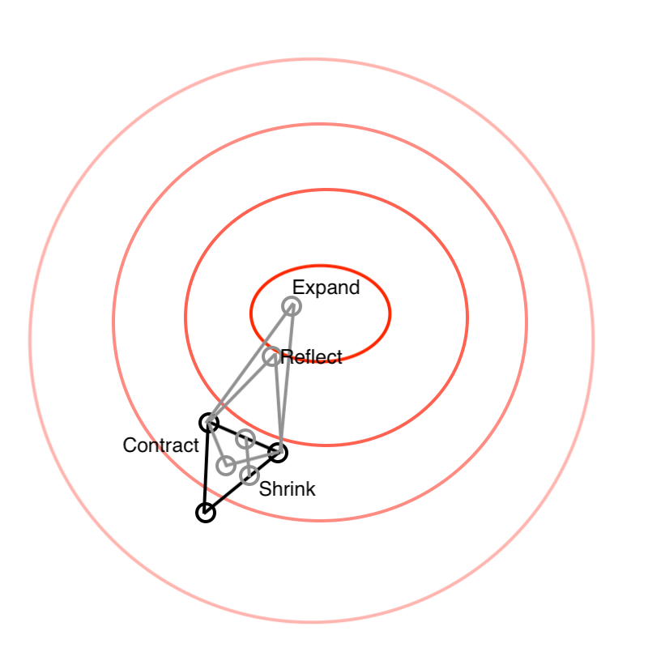

# Prerequisits

Load libraries and set random seed for this chapter:
```{r,message=F}
library(magicaxis)
library(foreach)
library(pracma)
library(cooltools)
library(ellipse)
library(celestial)
set.seed(1)
```

# Foreword

This chapter discusses the general problem of optimising a $D$-dimensional function $$y=f(\mathbf{x}),$$ where $y\in\mathbb{R}$ and $\mathbf{x}\in\mathbb{R}^D$. Optimising means finding the value(s) $\mathbf{x}$ where $f(\mathbf{x})$ is either minimal or maximal. Unless otherwise specified, one is normally interested in *global* extrema rather than local ones.

Optimisation is a very common problem in computational statistics. One of the core examples, is the case of maximising a likelihood function (see part 4), which is conceptually similar to, and in practice nearly identical to, minimising the so-called $\chi^2$ a model given some data.

In this chapter, we will treat $f$ as a generic function, without a particular meaning. Later in this course, we will then replace $f$ by other symbols, depending on the specific statistical context.

*Never write your own optimiser, ever!*

Efficient optimisation is a complex mathematical and computational problem, which is itself a huge field of research. No scientist should attempt to re-invent this wheel. Unfortunately, the academic literature is littered with well meaning attempts to explore parameter space badly. The best we can do to avoid this trap is educate ourselves as to what tools already exist, and choose the right one to tackle a particular problem. 

Very sophisticated and well-tested optimisers have long been invented and are readily available in many computational languages. In **R**, several standard optimisers are included as part of the core functionality (in the routine **optim**), while others can be accessed via additional packages. In this chapter, we will introduce some popular algorithms that are widely used and readily available in a number of languages and flavours.

\newpage
# Multi-dimensional optimisation methods

## Mock example

To discuss different tools for optimisation let us introduce a particular, two-dimensional function $f(\mathbf{x})$ with $\mathbf{x}=(x_1,x_2)$, defined as follows:

```{r}
f = function(x){
  x = as.numeric(x) # just in case x is not provided as a numeric vector
  sum(dnorm(data, mean=x[1], sd=exp(x[2]), log=TRUE))
}
```

As we will see later, this function can be interpreted as the so-called log-likelihood function associated with the statistical problem of finding the 'mean' $\mu=x_1$ and '*uncorrected*^[There is a subtle difference between the *uncorrected* standard deviation $s$, defined as the square root of the *sample* variance, $s=\sqrt{(x-\bar x)^2/N}$ and the standard deviation $\sigma=\sqrt{(x-\bar x)^2/(N-1)}$, which represents the most likely root-mean-square deviation of the hypothetical infinite *population* from which the sample was drawn. In general, $\sigma$ is larger than $s$, because the population mean $\langle x\rangle$ slightly deviates from the sample mean $\bar x$] standard deviation' $s=e^{x_2}$ of the random numbers stored in the vector `data`. Explicitly, the pair $(x_1,x_2)$ that maximises the function $f$, corresponds to the most likely values of $\mu$ and $\sigma$, given these data. The reason for parametrizing $s$ via its logarithm is that $s$ is strictly non-negative, which means that the probability distribution for $s$ must be skewed and that we have to tell the optimiser that $s$ must not be negative. A practical way to avoid this complication is to take the logarithm of $s$, which can then take any real values, including negative ones.

To fix the data, let us draw $300$ random numbers from a normal distribution with mean $\mu=0$ and standard deviation $\sigma=1$. In **R**, this is as simple as

```{r}
data = rnorm(300)
```

The true mean and uncorrected standard deviation of these data are

```{r}
mu = mean(data)
s = sqrt(mean((data-mu)^2))
sprintf('mu = %.8f',mu)
sprintf('s = %.8f',s)
```

Thus, the vector $\mathbf{x}_{\rm m}$ that maximises the function $f$ is then given by

```{r}
xm = c(mu,log(s))
```

Let us check if $f$ does indeed have a maximum at $\mathbf{x}_{\rm m}$, by considering its value at slightly offset positions $\mathbf{x}_{\rm m}+\boldsymbol{\varepsilon}$:

```{r}
eps = 1e-5
print(f(xm+c(+eps,0))-f(xm))
print(f(xm+c(-eps,0))-f(xm))
print(f(xm+c(0,+eps))-f(xm))
print(f(xm+c(0,-eps))-f(xm))
```

All the differentials $\delta f=f(\mathbf{x}_{\rm m}+\boldsymbol{\varepsilon})-f(\mathbf{x}_{\rm m})$ are negative, showing that $f(\mathbf{x}_{\rm m})$ is a maximum. It is, in fact, the *absolute* maximum of $f$, although we have not shown this, yet. A slightly more elegant way of showing that $f(\mathbf{x}_{\rm m})$ is a maximum would be to show that the gradient vector vanishes in this point. Numerically, this is indeed the case:

```{r}
print(grad(f,xm,heps=1e-9))
```

In summary, we have introduced an example of a two-dimensional scalar field $f(\mathbf{x})$ with an known absolute maximum at the point $\mathbf{x}_{\rm m}$. Since $\mathbf{x}_{\rm m}$ can be determined *analytically* in this example, no *numerical* optimisation was necessary to determine its value. However, we shall now use this function to benchmark different numerical optimisation tools to find this maximum.

## Brute force exploration (for illustration only)

One of the least effective ways to find the maximum of $f(\mathbf{x})$ within some precision is to exhaustively explore the value of $f$ on a regular Cartesian grid. For example:

```{r}
x1.vec = seq(-0.6,0.6,len=100) # Cartesian grid along the 1st dimension
x2.vec = seq(-0.3,0.3,len=50) # Cartesian grid along the 2nd dimension
x.grid = expand.grid(x1.vec,x2.vec)
f.grid = foreach(i=1:dim(x.grid)[1],.combine='c')%do%{f(x.grid[i,])}
f.grid = matrix(f.grid,nrow=length(x1.vec))
```

We can visualise $f(\mathbf{x})$ on this grid using shades of grey:

```{r, out.width = '75%', fig.align='center'}
magimage(x1.vec,x2.vec,f.grid,xlab=expression('x' [1]*'='*mu),
         ylab=expression('x' [2]*'=ln(s)'))
best.loc = which.max(f.grid)
points(x.grid[best.loc,1], x.grid[best.loc,2], col='blue')
points(xm[1],xm[2],pch=4, col='red')
```

The true maximum point $\mathbf{x}_{\rm m}$ is shown as red cross, whereas the numerically determined maximum point is shown by the blue circle. The two are consistent up to a numerical error bounded by the grid spacing.\

## Gradient Descent (GD)

One of the simplest "smart" approaches to numerically evaluate the maximum of $f(\mathbf{x})$ is the so-called gradient descent (GD). Its core idea is that at any specific point $\mathbf{x}$ the function $f$ locally increases along the gradient vector $\nabla f(\mathbf{x})$. Thus following this vector in 'small' steps should eventually lead us to a maximum -- just like we can find the top of a mountain by always choosing the way that goes upwards. In its simplest form, this method starts with some initial guess $\mathbf{x}_0$ and then iteratively improves this guess by evaluating $$\mathbf{x}_{i+1}=\mathbf{x}_i+\alpha\nabla f(\mathbf{x}_i),$$ where $\alpha\in\mathbb{R}_+$ is a small positive constant.

Let us show this:

```{r, out.width = '75%', fig.align='center'}
# plot function (grey scale)
magimage(x1.vec,x2.vec,f.grid,xlab=expression('x' [1]*'='*mu),
         ylab=expression('x' [2]*'=ln(s)'))

# plot gradient field (blue arrows)
ds = 0.0005
for (x1 in seq(-0.6,0.6,0.05)) {
  for (x2 in seq(-0.3,0.3,0.05)) {
    g = grad(f,c(x1,x2))
    arrows(x1,x2,x1+ds*g[1],x2+ds*g[2],length=0.05,col='blue')
  }
}

# plot three paths of GD algorithm (orange)
alpha = 0.001
for (k in seq(3)) {
  x.guess = list(c(-0.43,-0.15),c(-0.53,0.28),c(0.55,0.08))[[k]]
  points(x.guess[1],x.guess[2],col='orange')
  for (i in seq(100)) {
    x.old = x.guess
    x.guess = x.guess+alpha*grad(f,x.guess)
    lines(c(x.old[1],x.guess[1]),c(x.old[2],x.guess[2]),col='orange')
  }
}

# plot true solution (red)
points(xm[1],xm[2],pch=4,col='red')
```

The gradient field is shown by the blue arrows. Clearly, this vector field points towards the analytic maximum, marked by the red cross. The three orange lines show the iterative paths of the GD algorithm for three different initial guesses (orange circles). All three paths converge towards the maximum of $f$.

Because of its relatively low efficiency and several significant drawbacks in the context of more complicated functions $f$, the GD algorithm is rarely used in practice. In fact, it is not included as a standard algorithm in the **optim** function in **R**, which is a strong hint that better approaches exist.

```{r, echo=FALSE, out.height="185px"}
knitr::include_graphics(c("../figures/Newton_vs_GD.png","../figures/LM_vs_Newton_vs_GD.png","../figures/CG_vs_GD.png"))
```

Figure 1: LEFT: The red line shows the path towards the maximum of $f$ take by the Newton-Raphson algorith, whereas the green line shows the less direct gradient descent route, which is always perpendicular to the iso-contours. MIDDLE: The purple line shows the Levenberg–Marquardt route, which is yet more efficient than that of the Newton-Raphson algorithm (red) and Gradient Descent (green). RIGHT: The green line is the indirect gradient descent route we would take, and the red line is the conjugate gradient route, which avoids much of the discrete zig-zagging when taking large steps. (Source: Wikipedia)

## Newton-Raphson Optimisation (NR)

Closely related to the GD method is the Newton-Raphson method of optimisation (NR, also known as Newton's method). This makes use of additional curvature information by using second order derivatives (Hessian matrix) to find a more direct route to the maximum of $f(\mathbf{x})$. Figure$~1$ (left) shows a schematic view of this, where the green line is the GD route, while the red line is the more direct NR route.

Again, this method is not directly offered in **optim**, because it has practical computational drawbacks. In particular, calculating the Hessian can be difficult in real problems.

## Levenberg–Marquardt

A further refinement on both previous approaches is the Levenberg–Marquardt algorithm (LM), which is a relatively popular algorithm in astronomy. Numerically LM often looks like an interpolation between GD and NR, shown as purple line in Figure$~1$ (middle).

The LM algorithm is well suited to a small class of problems (where the initial guess is close to exact solution and $f$ is convex with a single global maximum), but in reality most problems we encounter in computational statistics have imperfect models leading to 'bumpy' functions (such as likelihoods). In the latter case, the LM algorithm is known to be particularly prone to getting stuck in local maxima, especially in high-dimensional cases. Because of these drawbacks, this method is again not offered in **optim**. Better alternatives now exist.

## Conjugate Gradient (CG)

If we consider a few GD steps with a relatively large scaling factor $\alpha$, the path in the parameter space often looks like a shrinking sawtooth pattern (see green line in Figure$~1$ right). The conjugate gradient (CG) method uses a more sophisticated algorithm (based on the shape of the local topology) to calculate a path that cuts across these zig-zags and approaches the maximum in fewer steps (see red line in Figure$~1$ right).

Unlike the previously considered methods, the CG method turns out to do a good job of getting around complicated bumps with local extrema by taking just a few more iterations. It typically converges faster and more reliably than any of the methods discussed so far. It also has the advantage of not needing to store information regarding the shape of the topology explored to date (it is calculated locally), so it can run on quite large problems. For these reasons, the CG method *is* offered by the **optim** function in **R**.

The **optim** function has two mandatory arguments: a choice of initial parameters $\mathbf{x}_0$ (provided as a $D$-element vector via the argument `par`) and the function $f(\mathbf{x})$ to be optimised (provided via the argument `fn`). Optionally, one can specify the optimisation method using the argument `method` (e.g. `method='CG'`).

*Note that by default optim minimizes the function $f$. To find the maxima we therefore need to substitute $f$ for $-f$. This inversion is done most efficiently by setting the control parameter `fnscale` to -1 (by providing the argument `control=list(fnscale=-1)`).*

As an example, let us now find the maximum of our two-dimensional test function, starting from the very poor initial guess of $\mathbf{x}_0=(1,2)$:

```{r}
optim(par=c(1,2),fn=f,method='CG',control=list(fnscale=-1))
```

The maximum point, given by the output component `$par` is indeed identical to the exact analytical solution `xm` (up to a small numerical error, which can be reduced by adjusting optional arguments in **optim**). We can see from the `$counts` output that we only required 173 function calls and 31 gradient estimates (each of which usually requires two function calls per dimension). Thus, in total, **optim** had to evaluate $f$ around $173+(31\times2\times2)=297$ times. Compare this to the $100\times50=5,000$ evaluations made by our brute force approach, which probed a much smaller domain and yet achieved a much less precise result (limited by the grid resolution).

Even an appallingly bad starting point (say $\mathbf{x}_0=(10,20)$) converges to the correct solution in just about twice as many evaluations:

```{r}
optim(par=c(20,10),fn=f,method='CG',control=list(fnscale=-1))
```

### Excursion: A preview of estimating parameter uncertainties

The in-depth discussion of likelihood functions in part 4 of this course will address the question of how we can evaluate the statistical error of the maximum point $\mathbf{x}_{\rm m}$, in the case where $f$ represents a log-likelihood (or log-posterior). As we will see, a simple way of approximating this error is to assume that the likelihood function is *normal* (thus the log-likelihood is parabolic). Within this approximation, also known as Laplace approximation, the parameter covariance $C$ is related to the multi-dimensional curvature of $f$ at its maximum, as encoded by the *Hessian* matrix $H$, via  $C=-H^{-1}$. **optim** can be asked to return this matrix, by setting the optional argument `hessian` to `TRUE`:

```{r}
opt = optim(par=c(1,2),fn=f,method='CG',control=list(fnscale=-1),hessian=TRUE)
C = -solve(opt$hessian)
```

We can then use the **ellipse** function discussed earlier in this part to convert the covariance matrix into iso-probability contours containing a certain probability mass. For instance, to plot the contours containing the *population* parameters (here known to be $\mathbf{x}=(0,0)$) with 68\% and 99.9\% probability in the Laplace approximation, use:

```{r, out.width = '75%', fig.align='center'}
# plot function (grey scale)
magimage(x1.vec,x2.vec,f.grid,xlab=expression('x' [1]*'='*mu),
         ylab=expression('x' [2]*'=ln(s)'))

# plot true population parameters (blue)
points(0,0,pch=3,col='blue')

# plot analytical solution given the sample (identical to the best fit of optim) (red)
points(xm[1],xm[2],pch=4,col='red')

# covariance ellipses containing 68% and 99.9% of the probability
lines(ellipse(C,centre=xm,level=0.68),col='red',lwd=2,lty=2)
lines(ellipse(C,centre=xm,level=0.999),col='red',lty=2)

# exact (non-elliptical) contours containing 68% and 99.9% of the probability
l = log(contourlevel(function(x) exp(f(x)-f(xm)),c(0.68,0.999),c(-1,-1),c(1,1)))+f(xm)
contour(x1.vec,x2.vec,f.grid,col='orange',add=T,levels=l,drawlabels=FALSE,lwd=c(2,1))
```

The red dashed lines show the elliptical probability contours in the Laplace approximation. Even the inner (68%) contour contains the true population value. You can vary the RNG seed at the beginning of this document to convince yourself that this is indeed the case in about 68% of the cases. For reference, we also plotted the exact, non-elliptical probability contours (solid orange lines) which do not rely on the Laplace approximation. While the approximated and exact 68% contours are almost identical, the larger contours at 99.9% start deviating from the normal approximation.

We will return to the topic of parameter uncertainties in much more depth in part 4. 

## Broyden–Fletcher–Goldfarb–Shanno (BFGS)

Several limitations of the CG approach can be overcome using the so-called Broyden–Fletcher–Goldfarb–Shanno (BFGS) method. This method relies on continually updating a list of the local surface and gradient (so just first order derivatives) to build up a picture of the surface being optimised and approximate the local Hessian. This increases the robustness in the presence of a 'noisy' function and often requires even fewer evaluations than CG, at the cost of increased memory requirements to maintain a matrix of past values.

Since the BFGS method tries to construct a proxy for the Hessian, it is often referred to as a quasi-Newtonian method (since full Newtonian methods compute the proper Hessian directly). Where a good proxy for the Hessian can be constructed, BFGS should in general run faster than CG.

We run this in a similar way to the CG method, but just changing the method to be BFGS:

```{r}
optim(par=c(1,2),fn=f,method='BFGS',control=list(fnscale=-1))
```

Note that this algorithm has converged to the correct solution (up to a small numerical error), with even fewer evaluations of $f$: $52+13\times2\times2=104$ (compared to 297 for CG, and 5,000 for brute force).

## Nelder-Mead

The Nelder-Mead (NM) method (also known as the amoeba method due to the life-like way the updates walk around the surface) takes a very different approach to the above. It has the advantage that it only computes function values, no derivatives. Therefore, it often behaves well when $f(\mathbf{x})$ is hard or impossible to differentiate. The core idea is to consider a $D+1$ simplex in the $D$-dimensional parameter space (i.e. a triangle in 2D, a tetrahedron in 3D, etc.). Given a starting simplex iterate the following steps:

* Calculate values of $f$ at each node of the simplex
* Find the node with the lowest value and reflect this point across the plane formed by the other simplex nodes (just the line when considering the 2D problem) [reflect]
* If the above produces a larger value at the new simplex node site then try to expand the simplex out further in the direction of reflection [expand]
* If the reflection does not produce a larger value, then contract the simplex in towards the plane [contract]
* If the contract step does not create a big improvement, try to shrink in the worst two nodes (leaving the best fixed) [shrink]
* Once all of these steps have been attempted, start again at the beginning

In 2D, this algorithm can be visualized as a succession of triangles as shown in Figure 2.

```{r, echo=FALSE, out.height="220px", fig.align='center', fig.cap="Figure 2: Basic simplex operations: reflect, expand, contract and shrink. Here more opaque red contours reflect larger values of $f$. In this example the expand step would be the one kept, since it moves the worst node of the simplex to a high value of $f$. (Source: Wikpedia)"}

```

Following this algorithm, the moving simplex can walk around surprisingly complex surfaces, even ones with multiple nodes. It nearly always converges on some maximum, and it will not break down in noisy regions where other methods struggle to build up the surface picture they require for exploration. Furthermore, the Nelder-Mead algorithm often requires even fewer function evaluations than the previously discussed algorithms. For instance, in our case, just 67 evaluations:

```{r}
optim(par=c(1,2),fn=f,method='Nelder-Mead',control=list(fnscale=-1))
```

To be fair, in this particular example, the numerical error of the solution is a bit larger than with the previous algorithms. However, we can easily enforce higher precision by setting the control parameter `reltol`. To ask for maximum precision, this parameter can be set to zero:

```{r}
optim(par=c(1,2),fn=f,method='Nelder-Mead',control=list(fnscale=-1,reltol=0))
```

Even this very precise solution, which only differs from the true solution by the last digit (limit of the floating point accuracy), required only 129 function evaluations.

Because of its excellent robustness and speed the Nelder-Mead method is the default method of **optim**. We could therefore have removed the argument `method='Nelder-Mead'` in the two examples above. The main downside of this method is that in higher dimensions it does not work as efficiently as CG and BFGS if the surface can be locally differentiated.

## Simulated Annealing

Simulated annealing is an optimisation technique designed for use on *very* bumpy functions. As the name suggests, the approach attempts to mimic the general behaviour of annealing in metallurgy, where by controlling the rate of cooling you can control the size of crystal domains. The basic idea is to give a walker (exploring $f(\mathbf{x})$ in $\mathbb{R}^D$) some "thermal" noise to get out of any local minima, and then very slowly "cool" the walker down so it becomes less and less able to climb out of later minima. In this context more noise means we guess a parameter from our current position by sampling from a normal distribution with a larger (hotter) or smaller (cooler) standard deviation.
 
If the control parameter is set correctly then the walker will be able to find the *global* minimum, even if passing through some local minima. Assuming you do not mind about having an imperfect answer, simulated annealing is an efficient way to cope with complex multi-modal likelihood space.

The **optim** function in **R** gives access to simulated annealing via `method='SANN'`. In this implementation the current temperature of the walker is defined as $$T=\frac{T_{int}}{ \log{ \left[((i-1) \%/\% T_{max})T_{max} + e \right]}},$$
where $T_{int}$ is the initial temperature, $i$ is the step number, $T_{max}$ controls the smoothness of the cooling and $\%/\%$ denotes an integer division. Let us visualise this function:

```{r, out.width = '75%', fig.align='center'}
temp = function(i,tint=1,tmax=1) tint/log(((i-1)%/%tmax)*tmax+exp(1))
magcurve(temp(i=x,tint=100,tmax=0.1),from=1,to=100,xlab='Step',ylab='Temperature')
magcurve(temp(i=x,tint=100,tmax=10),from=1,to=100,add=TRUE,col='red')
```

Consider this extreme example given in the **R** help for **optim**, where the global minimum is somewhere near $x=-15.8151511$ (shown by the transparent red line):

```{r, out.width = '75%', fig.align='center'}
fw = function(x) 10*sin(0.3*x)*sin(1.3*x^2)+0.00001*x^4+0.2*x+80
magcurve(fw,-50,50,1000)
xmin = -15.8151511
abline(v=xmin,col='#ff000055',lwd=3)
```

With **R**'s **optim** version of simulated annealing (SANN) we can specify the initial temperature ($T_{int}$) using the argument `temp` in the list of control parameters, and the smoothness ($T_{max}$) using the argument `tmax` in this list. Given the features in the plot above, we might try $T_{int}=50$ (roughly the vertical domain of the plot) and $T_{max}=10$ (the vertical scale of the fast oscillations):

```{r}
SANNfit = optim(50,fw,method='SANN',control=list(maxit=1e6,temp=50,tmax=10))
SANNfit
```

```{r, out.width = '75%', fig.align='center'}
magcurve(fw,-50,50,1000)
abline(v=xmin,col='#ff000055',lwd=3)
abline(v=SANNfit$par,col='blue')
```

In this example **optim** has done a good job at finding the *global* minimum (blue line matches the red one). However, if we were to pick the wrong temperature settings, we can get trapped in a local minimum, e.g,:

```{r, out.width = '75%', fig.align='center'}
SANNfit2=optim(50,fw,method='SANN',control=list(maxit=1e6,temp=1,tmax=1))
magcurve(fw,-50,50,1000)
abline(v=xmin,col='#ff000055',lwd=3)
abline(v=SANNfit2$par,col='blue')
```

So here we have done very poorly! And in this example we have only worried about the tuning for a simple 1D problem. When we have multiple dimensions we have to be even more careful that we cool all walking in all directions at the correct rate, which is no easy task. So in summary we might say that simulated annealing is useful but brittle (like annealed glass).

\newpage
# One-dimensional optimisation

We have seen a couple of examples in earlier lectures using *optim* and *optimise* (or *optimize* for Americans). *optimise* is specifically tasked with dealing with 1D optimisation problems, e.g. the above example can be minimised (badly) with

```{r}
optimise(fw,lower=-50,upper=50)
```

This is actually identical to running:

```{r}
optim(50, fw, method='Brent', lower=-50, upper=50)
```

In other words, **optimise** is a convenience short-cut to running **optim** with `method='Brent'`. This uses Brent's method of 1D root finding (and it only works in 1D), which is also used by the function **uniroot**. This is a hyper efficient method that uses all sorts of clever tricks (bi-section, secants and interpolation) to efficiently root find in 1D (we will spare the details).

You *can* run **optim** in 1D using other methods, but they tend not to be the best choice:

```{r}
optim(50, fw, method='Nelder-Mead')
```

Notice we get a warning with Nelder-Mead, but close-ish to an answer.

```{r}
optim(50, fw, method='BFGS')
```

This is actually worse than where we started!

```{r}
optim(50, fw, method='CG')$par
```

Not great either.

# Which to use?

There are a lot of other excellent options out there in well supported packages to do fancy things like particle swarm optimisation, and hit-and-run sampling, but in this chapter we were sticking with the options provided by **R** base, since they are guaranteed to perform as expected, and will be supported indefinitely.

That caveat aside, what **R** base optimiser should we use? In general it is a good idea to start with Nelder-Mead if run time is not an immediate concern and the solution is not highly multi-modal. BFGS (or some variant of it) is usually the best behaved of the gradient based approaches, being generally more robust than CG, which can often be fragile in even quite simple problems.

There are many other methods available for straight optimisation, but in general some combination of NM, BFGS and CG will get you pretty far in all except the most pathological of cases. If the function to minimize/maximize is known to be highly complex, you might find some success with SANN, but in practice by this time I would be moving to a fully featured Markov-Chain Monte-Carlo approach (part 5).

It is more important to understand a few distinct tools well (and have an intuition for their behaviour and best practices etc) than to just attempt a scatter gun approach. That said, the keen student should certainly dig further into the many other tools methods and packages available if they do get stuck. My personal experience is it is rarely necessary to exploit extremely exotic techniques in astronomy since our number of observations (perhaps millions) and number of model parameters (usually a few dozen at most) lends itself well to these simpler approaches.