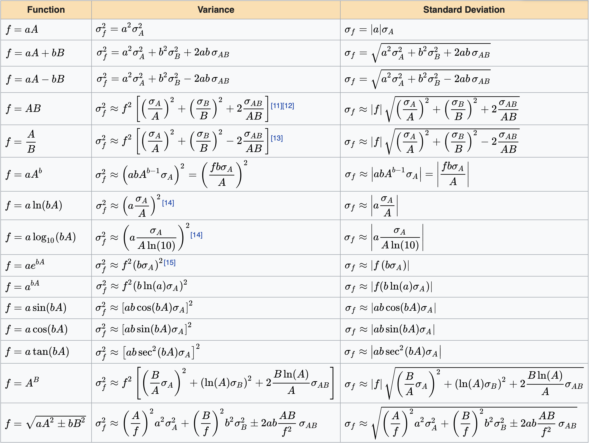

# Prerequisites

Load libraries and set RNG seed for this chapter:
```{r,message=F}
library(magicaxis)
library(cooltools)
library(ellipse) # for plotting covariance ellipses
library(extraDistr) # for truncated Normal distribution
set.seed(1)
```

# Definition and parameter uncertainties

Pierre-Simon Laplace, whose contributions to Bayesian inference were on a par with those of Bayes, has his name honoured in the *Laplace approximation*. In brief, this approximation is a Gaussian approximation of the likelihood function $\mathcal{L}(\theta;D)\equiv P(D|\theta)$ or the posterior function $P(\theta|D)\propto P(D|\theta)P(\theta)$, as a function of the parameter(s) $\theta$ about the ML estimator $\hat\theta_{\rm MLE}$ or the MAP estimator $\hat\theta_{\rm MAP}$, respectively .

The most direct application of this approximation is an approximate, but often sufficient, quantification of the statistical uncertainty of model parameters. However, as we will see in this chapter, the reach of the Laplace approximation extends far into the realm of information theory. It forms the basis of the Bayesian information criterion, the Fisher Information and the construction of 'objective' priors known as Jeffreys priors.

The following precise definitions of the Laplace approximation are focussed on the likelihood function, but the formalism can easily be ported to the posterior upon substituting the likelihood for the product of the likelihood and the prior.

## Laplace approximation (single model parameter)

The log-likelihood $\ell(\theta;D)$ can be a complicated function of $\theta$. However, it is generally true that the lowest-order non-vanishing approximation of its shape around the absolute maximum $\hat\theta_{\rm MLE}$ is the second order term in the Taylor expansion. If $\theta$ is a single parameter,
\begin{equation}\label{eq:loglexpainsion}
  \ell(\theta;D) = \ell(\hat\theta_{\rm MLE};D)-\tfrac{1}{2}\sigma^{-2}(\theta-\hat\theta_{\rm MLE})^2+\mathcal{O}\big((\theta-\hat\theta_{\rm MLE})^3\big),
\end{equation}
where, for the moment, $-\sigma^{-2}$ is just a funny way of writing the second-order Taylor coefficient, computed as
\begin{equation}
  -\sigma^{-2} = \left.\frac{d^2\ell{(\theta;D)}}{d\theta^2}\right|_{\theta=\hat\theta_{\rm MLE}}
\end{equation}

Since the second derivative at the maximum point is always negative, $\sigma$ is a well-defined positive real. This *parabolic* approximation of $\ell$ corresponds to a (non-normalised) *normal* approximation of $\mathcal{L}$:
\begin{equation}
  \mathcal{L}(\theta;D) \approx \mathcal{L}(\hat\theta_{\rm MLE};D)\exp\left(-\frac{(\theta-\hat\theta_{\rm MLE})^2}{2\sigma^2}\right)
\end{equation}
with standard deviation $\sigma$ (hence use of the symbol $-\sigma^{-2}$ in Eq. \ref{eq:loglexpainsion}).

In other words, *the statistical uncertainty of the maximum likelihood solution $\hat\theta_{\rm MLE}$ can be approximated by a normal distribution of standard deviation*
$$\sigma=\frac{1}{\sqrt{-d^2\ell/d\theta^2(\hat\theta_{\rm MLE})}}.$$
If you see an MLE or MPA solution quoted in the form of $\theta=1.542\pm0.003$, the symmetric uncertainty range normally refers to the $\sigma$ of the Laplace approximation.

In many practical situations the Laplace approximation is surprisingly accurate, meaning that the likelihood is indeed well-described by a (non-normalised) normal distribution. This is ultimately a consequence of the central limit theorem, whereby the likelihood becomes asymptotically normal for a large enough data sample.

### Example: coin tossing (continued)

To give an example, let us return to our coin toss problem, for which the log-likelihood is given by
$$ \ell(p;k,n)=\ln\binom{n}{k}+k\ln(p)+(n-k)\ln(1-p),$$
where $p$ is the coin's intrinsic probability of producing a heads-up, $n$ is the total number of tosses in a specific experiment and $k$ is the number of tosses showing heads. The second derivative of this log-likelihood relative to the model parameter $p$ is
\begin{equation}\label{eq:ddlbinomial}
  \frac{d^2\ell}{d p^2} = -\frac{k}{p^2}-\frac{n-k}{(1-p)^2}.
\end{equation}

Hence the expected variance of the MLE $\hat p=k/n$ is
\begin{equation}
  \sigma^2(k,n) = \left[\frac{n}{\hat p^2}+\frac{n-k}{(1-\hat p)^2}\right]^{-1} = \frac{n^2k-2nk^2+k^3}{n^4-n^3k}
\end{equation}

Note that this variance is only defined if $0<k<n$, i.e. if both heads and tails have been observed.

Let us overplot the Laplace approximation to the actual likelihood for our $n=10, 100, 1000$ tosses.

```{r, out.width='70%', fig.align='center'}
p.true = 0.6
x = as.numeric(runif(1000)<p.true) # 1=heads, 0=tails
L = function(p,n) {
  k = sum(x[1:n])
  return(dbinom(k,n,p))
}

magplot(NA,xlim=c(0,1),ylim=c(0,1),
        xlab=expression('Parameter p' ['h']),
        ylab=expression('L/L' ['max']))
for (i in seq(3)) {
  n = 10^i
  k = sum(x[1:n])
  curve(L(x,n)/max(L(x,n)),lwd=i+1,n=500,add=T)
  p.MLE = k/n
  sd.MLE = sqrt((n^2*k-2*n*k^2+k^3)/(n^4-n^3*k))
  curve(dnorm(x, mean=p.MLE, sd=sd.MLE)*sqrt(2*pi)*sd.MLE,col='red',n=500,add=T)
}
```

This comparison between the likelihood (black) and Laplace approximation (red) illustrates the good quality of the approximation, as well as the asymptotic normality of the likelihood for increasing $n$.

## Laplace approximation (vector parameter)

The extension of the Laplace approximation to multivariate likelihood functions, i.e. where $\theta$ is a vector of parameters, is straightforward. In this case the covariance of the model parameters at the MLE solution is given by
\begin{equation}
  \Sigma = -\mathcal{H}(\hat\theta_{\rm MLE})^{-1},
\end{equation}
where $\mathcal{H}$ is the *Hessian matrix*,
\begin{equation}
  \mathcal{H}_{ij}(\theta) = \frac{\partial^2\ell{(\theta;\mathbf{x})}}{\partial\theta_i\partial\theta_j}.
\end{equation}

Since $\mathcal{H}(\hat\theta_{\rm MLE})$ is a symmetric negative-definite matrix, the covariance exists and is a symmetric and positive-definite matrix, as it must be.

### Example: fitting a black-body spectrum

Let us now consider an example of a multivariate inference problem, i.e. a problem where we aim to constrain multiple (here two) parameters simultaneously from the same data.

A thermal source of light is observed in three different colour filters. For simplicity, these filters are assumed to be perfect narrow band filters, which are fully transparent in a small wavelength range $\Delta\lambda=0.1\rm nm$, centred at a wavelength $\lambda_i$, and totally opaque at all other wavelengths. The data obtained through the three filters is summarised in Table 1.

\begin{table}[h]
\centering
\begin{tabular}{lllc}
\hline
Colour & Wavelength $\lambda_i$ & Photon counts $x_i$ \\ \hline
UV & 281 & 9 \\
blue & 446 & 18 \\
red & 641 & 11 \\ \hline
\end{tabular}
\caption{Narrow band filter data used for black-body SED fitting.}
\end{table}

Assuming a black-body, the energy radiated per unit wavelength over the duration of the measurement, the so-called `spectral energy distribution' (SED), is given by the Planck law
\begin{equation}
  F(\lambda;T,A) =\frac{10^{-40}{\rm J m^4}A}{\lambda^5}\frac{1}{ e^{\frac{hc}{\lambda k_{\rm B}T}} - 1}~~\rm[J/m],
\end{equation}
where $h$ is the Planck constant, $c$ is the speed of light and $k_{\rm B}$ is the Boltzmann constant. The model has two parameters: the temperature $T$ and an amplitude $A$, which depends on the geometry and the quantum efficiency of the system, as well as on the duration of the measurement. We assume that $A$ is independent of the wavelength. The constant $10^{-40}\rm J m^4$ is an arbitrary scaling factor to make $A$ dimensionless and avoid very small values, which could lead to some unnecessary numerical difficulties. Our goal is to determine the most likely values of $T$ and $A$ and their uncertainties. Throughout this exercise we assume that the spectrum of the thermal source is constant over the small bandpass $\Delta\lambda$ of the filters.

We first write down the likelihood for a single narrow band filter $i$: The probability $P_i$ of observing $x_i$ photons at wavelength $\lambda_i\pm\Delta\lambda/2$ is given by the Poisson statistics
$$\mathcal{L}_i(T,A;x_i) = P_i(x_i|T,A) = \frac{k_i^{x_i}e^{-k_i}}{x_i!},$$
where $k_i$ is the expected number of photons (of energy $E=hc/\lambda_i$) seen through the filter centred at $\lambda_i$,
$$k_i=\Delta\lambda\cdot F(\lambda_i;T,A)\cdot\frac{\lambda_i}{hc},$$
which is dimensionless as required. Hence, the total log-likelihood function becomes
\begin{equation}
  \ell(T,A) = \sum_{i=1}^3 \left[x_i\ln(k_i)-k_i-\ln(x_i!)\right],
\end{equation}
where the terms $\ln(x_i!)$ do not depend on the model parameters $T$ and $A$. Therefore, the maximum point and the derivatives of $\ell$ are the same as those of the effective log-likelihood
\begin{equation}\label{eq:loglspect}
  \tilde\ell(T,A) = \sum_{i=1}^3 \left[x_i\ln(k_i)-k_i\right].
\end{equation}

It is possible to make some analytical progress towards finding the maximum point $(\hat T,\hat A)$ of $\tilde\ell(T,A)$. However, Eq. (\ref{eq:loglspect}) lends itself to numerical optimisation. In **R**, this becomes

```{r}
# initialise data and constants
data.wavelength = c(281,446,641) # [nm] values of lambda_i
data.counts = c(9,18,11) # values of x_i
c = 299792458 # [m/s] speed of light
h = 6.62607004e-34 # [m^2 kg/s] Planck's constant
k = 1.38064852e-23 # [m^2 kg/s^2/K] Boltzmann constant
dlambda = 1e-10 # [m] filter band width

# Planck law in energy/wavelength [J/m]
planck = function(lambda,temperature,A) {
  return(1e-40*max(0,A)*lambda^(-5)/(exp(h*c/(lambda*k*temperature))-1))
}

# Planck law in photons/Delta lambda
planck.photons = function(lambda,temperature,A) {
  dlambda*lambda/h/c*planck(lambda,temperature,A)
}

# likelihood
log.likelihood = function(p) { # p = (temperature,A)
  k = planck.photons(data.wavelength*1e-9,p[1],p[2])
  return(sum(data.counts*log(k+1e-99)-k)) # the constant 1e-99 avoids problems if k=0
}

# maximise likelihood
fit = optim(c(1e4,10), log.likelihood, hessian=TRUE, control=list(fnscale=-1))
T.mle = fit$par[1]
A.mle = fit$par[2]
cat(sprintf('MLE solution: T = %.3eK, A = %.3e\n',fit$par[1],fit$par[2]))
```

We have used the in-built **optim** function to maximise the likelihood. A detailed discussion of this function was given in part 2 of this course.

Let us now plot the most likely SED together with the data points and their Poisson uncertainties.

```{r, out.width='70%', fig.align='center'}
lambda.nm = seq(1,1000,by=2) # [nm]
magplot(lambda.nm,dlambda*lambda.nm*1e-9/c/h*planck(lambda.nm*1e-9,T.mle,A.mle),
        pch=20,cex=0.5,ylim=c(0,25),col=wavelength2col(lambda.nm),
        xlab='Wavelength [nm]', ylab='Photon counts')
points(data.wavelength,data.counts,pch=20,cex=1.5) # data points
segments(data.wavelength,
         y0=qpois(0.16,data.counts),y1=qpois(0.84,data.counts)) # 16%-84% uncertainties
```

The parameter covariance in the Laplace approximation can be obtained from the Hessian, which is computed directly by **optim** if the argument `hessian=TRUE` is set.

```{r, out.width='70%', fig.align='center'}
# plot MLE solution
xlim = c(5e3,1.3e4) # plotted range of temperatures
ylim = c(0,2.5e3) # plotted range of amplitudes
magplot(T.mle,A.mle,xlim=xlim,ylim=ylim,pch=20,xaxs='i',yaxs='i',
        xlab='Temperature T [K]', ylab='Amplitude A')

# Laplace approximation
covariance = -solve(fit$hessian)
lines(ellipse(covariance,centre=c(T.mle,A.mle),level=0.68)) # 1-sigma region
lines(ellipse(covariance,centre=c(T.mle,A.mle),level=0.95),lty=2) # 2-sigma region
T.sd = sqrt(covariance[1,1]) # standard deviation of T
A.sd = sqrt(covariance[2,2]) # standard deviation of A
segments(T.mle-T.sd, A.mle, T.mle+T.sd)
segments(T.mle, A.mle-A.sd, y1=A.mle+A.sd)

# Full posterior
n.grid = 150
x.range = seq(xlim[1],xlim[2],len=n.grid)
y.range = seq(ylim[1],ylim[2],len=n.grid)
l = Vectorize(function(x,y) exp(log.likelihood(c(x,y)))) # vectorized likelihood
z = outer(x.range,y.range,l) # likelihood evaluated on a grid
contour(x.range,y.range,z,levels=contourlevel(z,c(0.68,0.95)), lty=c(1,2),
        drawlabels=FALSE, add=TRUE, col='magenta')
```

The uncertainty ellipses of the Laplace approximation are shown as black lines. The 2-$\sigma$ ellipse of this approximation (black dashed line) reaches to $A<0$, which is clearly unphysical. For an accurate posterior, we need to consider the full likelihood and identify the isocontours that contain 68\% and 95\% of the probability mass, respectively (see magenta lines). In this example, we used the **contourlevel** function of the **cooltools** package to identify the isocontour levels. In higher-dimensional problems, more sophisticated techniques are required (e.g. MCMC), which usually produce a sample representing the posterior (see later in this course).

# Linear error propagation

In the context of statistical inference, the propagation of uncertainty plays a major role. Here, uncertainty can refer to both the observables or model parameters. In general, a full description of the uncertainty of such variables requires a PDF. However, in the context of linear propagation of uncertainty, the PDFs of all random variables are approximated by a normal distribution (as in the Laplace approximation).

In the simplest case, we are dealing with one real random variable $x$ with expectation $\langle x\rangle$ and variance $\sigma_x^2$. From this variable we like to infer the expectation $\langle y\rangle$ and variance $\sigma_y^2$ of a second variable $y=f(x)$, where $f$ is a sufficiently differentiable function. In the context of linear propagation of uncertainty, we approximate the relation $y=f(x)$ to linear order around the mode $\langle x\rangle$, i.e. $y(x)=f(\langle x\rangle)+df/dx(\langle x\rangle)\cdot(x-\langle x\rangle)$. It is straightforward to show that under this linear transformation, the normal PDF for $x$ transforms to a normal PDF for $y$ with mean $\langle y\rangle=f(\langle x\rangle)$ and variance $$\sigma_y^2=\left(\frac{df}{dx}\right)^2\sigma_x^2,$$
where the derivative is understood to be evaluated at the mode $x=\langle x\rangle$.

This rule for the propagation of uncertainty can be extended to multi-dimensional variables $\mathbf{x}$ and $\mathbf{y}=\mathbf{f}(\mathbf{x})$, where $\mathbf{x}$ and $\mathbf{y}$ can have different numbers of elements. In this case, the uncertainty of the variable $\mathbf{x}$ is described by its expectation $\langle\mathbf{x}\rangle$ and its covariance matrix $\Sigma_\mathbf{x}$. Upon linearising the function $\mathbf{f}(\mathbf{x})$ around $\mathbf{x}=\langle\mathbf{x}\rangle$, the variable $\mathbf{y}$ has an expectation of $\langle\mathbf{y}\rangle=\mathbf{f}(\langle\mathbf{x}\rangle)$ and a covariance
\begin{equation}\label{eq:linearerror}
  \Sigma_\mathbf{y} = J\Sigma_\mathbf{x} J^T,
\end{equation}
where
\begin{equation}
  J_{ij} = \frac{\partial f_i}{\partial x_j}
\end{equation}
is the *Jacobian matrix* evaluated at the mode $\mathbf{x}=\langle\mathbf{x}\rangle$. This linear propagation of uncertainty is exact if the function $\mathbf{y}=\mathbf{f}(\mathbf{x})$ is itself linear.

A common special case of Eq. (\ref{eq:linearerror}) is the case where $y=f(\mathbf{x})$ is a single real variable that depends on a vector of *uncorrelated* variables. In this case,
\begin{equation}
  \sigma_y^2 = \left(\frac{\partial f}{\partial x_1}\right)^2\sigma_{x_1}^2+\left(\frac{\partial f}{\partial x_2}\right)^2\sigma_{x_2}^2+...
\end{equation}

For your reference, the table below lists the variances of common functions of two real variables $A$ and $B$, with standard deviations $\sigma_A$ and $\sigma_B$ and covariance $\sigma_{AB}$, and exactly known real-valued constants $a$ and $b$ (i.e., $\sigma_a=\sigma_b=0$).



# Fisher information (FI)

We have just discussed ways of approximating the uncertainties of the most likely model parameter(s) $\hat\theta$, obtained using the data $\mathbf{x}$. This naturally leads us to the following important question, often encountered in scientific research: What is the expected uncertainty of a model parameter $\theta$, *if* we measured the observable $\mathbf{X}$ (often called `random variable' in statistics literature), but without having obtained such a measurement $\mathbf{x}$, yet! The answer to this question depends on the true value of $\theta$.

As we have shown in the context of the Laplace approximation, the ability of a measurement $\mathbf{x}$ to constrain $\theta$ is proportional to the curvature of the log-likelihood function at its maximum. This curvature is quantified by the Hessian matrix $\mathcal{H}(\theta;\mathbf{x})$. Since we do not know the value of the data $\mathbf{x}$, yet, the best way of characterising the quality of the potential measurement is to compute the average of $-\mathcal{H}(\theta;\mathbf{x})$ over all possible measurements $\mathbf{x}$, weighted by their relative probability. In other words, we are interested in the expectation $\mathbb{E}[-\mathcal{H}](\theta)$, where $\mathbf{x}$ has been marginalised out. This quantity is known as the *Fisher Information (FI)* matrix,

\begin{equation}
  \mathcal{I}_{ij}(\theta) = -\mathbb{E}\left[\frac{\partial^2\ell{(\theta;\mathbf{x})}}{\partial\theta_i\partial\theta_j}\right] = -\int \frac{\partial^2\ell{(\theta;\mathbf{x})}}{\partial\theta_i\partial\theta_j}\mathcal{L}(\theta;\mathbf{x}) d\mathbf{x}.
\end{equation}

Note that the likelihood $\mathcal{L}(\theta;\mathbf{x})$ itself is used to compute the expectation value, since this likelihood is, by definition, the PDF of $\mathbf{x}$ given the model $\theta$. The FI matrix is a positive semi-definite matrix. In the case of a single parameter $\theta$, this is just a non-negative real number.

The term `information' comes from the fact that the FI quantifies the information that the observable $\mathbf{X}$ carries about the parameter $\theta$. If we have two different observables $\mathbf{X}$ and $\mathbf{Y}$ with respective FI matrices $\mathcal{I}_\mathbf{X}$ and $\mathcal{I}_\mathbf{Y}$, then $\mathcal{I}_\mathbf{X}>\mathcal{I}_\mathbf{Y}$ means that $\mathbf{X}$ is the more useful observable to constrain $\theta$. Furthermore, if $\mathbf{X}$ and $\mathbf{Y}$ are independent observables then their combined information is $\mathcal{I}_{\mathbf{X},\mathbf{Y}}=\mathcal{I}_\mathbf{X}+\mathcal{I}_\mathbf{Y}$.

Formally, it can be shown that (under certain regularity conditions) the FI can also be computed from first derivatives of $\ell$, as

\begin{equation}
  \mathcal{I}_{ij}(\theta) = \mathbb{E}\left[\frac{\partial\ell{(\theta;\mathbf{x})}}{\partial\theta_i}\frac{\partial\ell{(\theta;\mathbf{x})}}{\partial\theta_j}\right] = \int \frac{\partial\ell{(\theta;\mathbf{x})}}{\partial\theta_i}\frac{\partial\ell{(\theta;\mathbf{x})}}{\partial\theta_j}\mathcal{L}(\theta;\mathbf{x}) d\mathbf{x}.
\end{equation}

Interestingly, the FI, i.e. the expectation of the inverse covariance matrix, also allows us to place a lower bound on the expected covariance of an unbiased estimator $\hat\theta$. For instance, if $\theta$ is a single real parameter, then ${\rm Var}(\hat\theta)\geq\mathcal{I}(\theta)^{-1}$. This lower bound is known as the *Cramér–Rao bound*. We will not further discuss this bound in this lecture.

In the case of our coin tossing example, the FI is computed by multiplying Eq. (\ref{eq:ddlbinomial}) with a binomial distribution,

\begin{equation}
\begin{split}
  \mathcal{I}(n,p) & = -\mathbb{E}\left[\frac{d^2\ell}{dp^2}\right] = \sum_{k=0}^{n}\binom{n}{k}p^{k}(1-p)^{(n-k)}
  \left(\frac{k}{p^2}+\frac{n-k}{(1-p)^2}\right)\\
  & =\text{... (work this out yourself!)} = \frac{n}{p(1-p)}.
\end{split}
\end{equation}

Exercise: Discuss this functional form of $\mathcal{I}(n,p)$. For instance, did you expect the linear scaling with $n$?

### FI of multivariate normal distributions {-}

The most important example is that of a normal likelihood function, where the PDF of the observable $\mathbf{X}$ given the parameters $\theta$ is (or is approximated by) a multivariate normal distribution,
\begin{equation}\label{eq:normalL}
  \mathcal{L}(\theta;\mathbf{x}) = \frac{1}{\sqrt{(2\pi)^n|\Sigma_{\mathbf{X}}(\theta)|}} \exp\left(-\tfrac{1}{2}[\mathbf{x}-\mu(\theta)]^\mathrm{T}\Sigma_{\mathbf{X}}(\theta)^{-1}[\mathbf{x}-\mu(\theta)]\right),
\end{equation}
where $\mu(\theta)$ is the expectation of the observable and $\Sigma_{\mathbf{X}}(\theta)$ is the covariance of the observable, describing the expected normal *measurement uncertainty*.

In this common case, the FI can be expressed as
\begin{equation}
\mathcal{I}_{ij}(\theta) = \frac{\partial\mu^\mathrm{T}}{\partial \theta_i}\Sigma_{\mathbf{X}}^{-1}\frac{\partial \mu}{\partial \theta_j}
+\frac{1}{2}\operatorname{tr}\left(\Sigma_{\mathbf{X}}^{-1}\frac{\partial \Sigma_{\mathbf{X}}}{\partial \theta_i}\Sigma_{\mathbf{X}}^{-1}\frac{\partial \Sigma_{\mathbf{X}}}{\partial \theta_j}\right).
\end{equation}

If there is only one real-valued model parameter $\theta$ and one real-valued observable $X$, the FI further reduces to
\begin{equation}
\mathcal{I}(\theta) = \left(\frac{d\mu}{d\theta}\right)^2\sigma_X^{-2}+\frac{1}{2}\left(\sigma_X^{-2}\frac{d\sigma_X^2}{d\theta}\right)^2.
\end{equation}

In many cases, the variance $\sigma_X^2$ of the observable does not or only weakly depend on $\theta$ and hence the trace-term in can be neglected. Then, the FI is just the inverse of a linearly propagated measurement uncertainty, $\sigma_\theta^2\approx\sigma_X^2(d\theta/d\mu)^2$. This is indeed how one might intuitively quantify the usefulness of an observable $\mathbf{X}$ to measure a model parameter $\theta$.


# Bayesian information criterion

The previous chapter introduced the important concept of the *model evidence* $P(D|M)=\int P(D|\theta;M)P(\theta;M)d\theta,$ which characterises the probability of an undetermined family of models being true, given the data. The absolute value of $P(D|M)$ has no straightforward meaning, but the model evidence *ratio* between competing models, known as Bayes factor, gives the probability of one model relative to the other assuming identical priors.

Using the Laplace approximation for $P(D|\theta;M)$, assuming that $P(\theta;M)$ is flat in the vicinity of $\hat\theta_{\rm MLE}$ and evoking the Fisher Information, it can be shown that the model evidence simplifies to (see https://faculty.ucmerced.edu/hbhat/BICderivation.pdf)
$$\ln P(D|M)\approx\ell(\hat\theta_{\rm MLE})-\tfrac{k}{2}\ln n,$$
where $k$ is the number of parameters, i.e. the number of elements in $\theta$, and $n$ is the number of data points, i.e. the sample size. It is common to define the *Bayesian information criterion* as
$${\rm BIC}=k\ln n-2\ell(\hat\theta_{\rm MLE}),$$
such that $\ln P(D|M)\approx-\rm BIC/2$; hence the (unlogged) model evidence becomes
$$P(D|M)=e^{-\rm BIC/2}.$$
Thus, when picking from several models, the one with the lowest BIC is preferred. The Bayes factor between two competing models $M_1$ and $M_2$ then becomes
$$B=\frac{P(D|M_1)}{P(D|M_2)}\approx e^{({\rm BIC_2-BIC_1})/2}.$$
Interestingly, the BIC automatically penalises models with more parameters (due to the $k\ln n$ term), such that adding more parameters to produce better fits, does not necessarily lead to a lower BIC.

*Caution:*

* The BIC relies on the Laplace approximation, which means that it is *not* applicable to situations, where the likelihood is highly non-Gaussian. For instance, in the previous chapter, we looked at the example of computing the evidence of a uniform versus a normal distribution to explain a list of random numbers. The best uniform distribution that describes a set of values $\{x_1,...x_n\}$, is always the one that uniformly samples the interval $[\hat a,\hat b]$ with $\hat a=\min\{x_i\}$ and $\hat b=\max\{x_i\}$. However, the likelihood $\mathcal{L}(a,b)$ is highly asymmetric around this ML point, since any value $a>\hat a$ or $b<\hat b$ will lead to $\mathcal{L}=0$. In other words, $\mathcal{L}$ has a sharp truncation at the MLE. A normal distribution certainly would *not* be a good approximation, and, in fact, the Hessian is not defined at the MLE.

* The BIC requires $n\gg k$ to represent a meaningful approximation of the model evidence.


# Choosing the right prior

*There is no such thing as no prior!*

It is important to always bear in mind that the MLE implicitly assumes a flat prior on the model parameters, i.e. $P(\theta)=\rm const$. Sometimes one reads that `no prior' is assumed, with the implicit understanding that this makes the MLE somehow unbiased. However, all this means is that a flat prior has been assumed, and there is generally no guarantee that this is the correct assumption.

There are, in fact, many real-world examples where a flat prior is simply the wrong assumption. Let us first show such an example before further discussing the question of how to determine an `optimal' prior.

### Example: galaxy inclinations\label{sec:inclinations}

The inclination of a galaxy is defined as the angle between its axis and the line-of-sight to the observer. Hence, inclinations are bound between 0 and 90 degrees, corresponding to galaxies seen face-on and edge-on, respectively.

You observe $n=10^5$ random disk galaxies in the sky an determine their inclination from the observed ellipticity of their isophotes. Assume that these measurements lead to normal inclination errors of 30 degrees standard deviation, independent of the galaxy and the true inclination. (This is obviously an oversimplification, made to keep the example straightforward.)

In **R**, we can simulate these measurements as
```{r}
n = 1e5 # number of randomly oriented galaxies
inclination.sd = 30 # [deg] obs. uncertainty, assumed constant for simplicity

# produce randomly oriented galaxy axes
axis = runif3(n)

# determine the true inclinations of the galaxies (z-axis = line-of-sight)
inclination.true = atan(sqrt(axis[,1]^2+axis[,2]^2)/abs(axis[,3]))/pi*180

# add normal measurement uncertainties, but keep range bound to 0-90 degrees
inclination.mle = rtnorm(n,mean=inclination.true,sd=inclination.sd,a=0,b=90)
```

Note that, since the observed inclinations must remain bound between 0 and 90 degrees, we have generated the data using the truncated normal random number generator **rtnorm**, available in the package **extraDistr**. This is just a technicality, which has no bearing on the key message of this exercise.

Since the inclination errors are normally distributed, the maximum likelihood estimator of an inclination is simply its mode. This is why we called the observed inclinations *inclination.mle*. Now let us compare the number of galaxies, whose most likely inclination equals a certain value $x$, to the number of galaxies which truly have an inclination $x$. We do this in inclination bins of 1 degree width.
```{r, out.width='70%', fig.align='center'}
magplot(c(0,90),c(1,1),type='l',xaxs='i',yaxs='i',ylim=c(0,2),
        xlab='Inclination [deg]',ylab='observed number (MLE) / true number')
for (i in seq(1,89)) {
  f = sum(abs(inclination.mle-i)<0.5)/sum(abs(inclination.true-i)<0.5)
  points(i,f,pch=20)
}
```

From the figure above it is obvious that the MLE fails at reproducing the original inclination distribution. The root cause for the failure of the MLE is the implicit assumption of a flat prior. To see that this is the wrong assumption, let us plot the PDF of the true inclinations:

```{r, out.width='70%', fig.align='center'}
h = maghist(inclination.true, verbose=F, xaxs='i', yaxs='i', col='#00000055', border=NA,
            ylim=c(0,1e4), xlab='True inclination [deg]', ylab='Number of objects')
curve(sin(x/180*pi)*max(h$counts),lwd=2,xlim=c(0,90),add=T)
```

As we can see, the true inclination distribution is not flat, but close to a sin-function (solid line). It is straightforward to show (do this as an exercise!) that the true inclination PDF of randomly oriented galaxies in 3D is exactly a sin-distribution. Since the quantile function of a sin-distribution is an arccosine, the $\cos(i)$-distribution is flat. Let us see:

```{r, out.width='70%', fig.align='center'}
h = maghist(cos(inclination.true/180*pi), verbose=F, xaxs='i', yaxs='i', col='#00000055',
            border=NA, ylim = c(0,1.2*max(h$counts)),
            xlab='cos(true inclination)', ylab='Number of objects')
lines(c(0,1),c(1,1)*mean(h$counts),lwd=2)
```

Indeed, the $\cos(i)$-distribution of our random data is nearly flat. The non-flat distribution of the true inclinations $i$ means that we need to include this prior in estimating the posterior probability from the observed inclinations. Formally,

\begin{equation}
  P(i_{\rm true}|i_{\rm obs}) \propto P(i_{\rm obs}|i_{\rm true})\sin(i_{\rm true}), 
\end{equation}

where $P(i_{\rm obs}|i_{\rm true})$ is a normal distribution of mean $i_{\rm true}$ and standard deviation $30^\circ$, truncated to $i_{\rm obs}\in[0^\circ,90^\circ]$. We would expect that summing the posteriors $P(i_{\rm true}|i_{\rm obs})$ across all galaxies returns the correct inclination distribution. Let us see:

```{r, out.width='70%', fig.align='center'}
x = seq(0.5,89.5)
total.inclination.posterior = array(0,length(x))
for (i in seq(n)) {
  d = dtnorm(inclination.mle[i],mean=x,sd=inclination.sd,a=0,b=90)*sin(x/180*pi)
  total.inclination.posterior = total.inclination.posterior+d/sum(d)
}
magplot(NA,type='l',xaxs='i',yaxs='i',xlim=c(0,90),ylim=c(0,2),
        xlab='Inclination [deg]',ylab='observed number (full posterior) / true number')
abline(h=1)
for (i in seq(length(x))) {
  f = total.inclination.posterior[i]/sum(abs(inclination.true-x[i])<0.5)
  points(x[i],f,pch=20)
}
```

The posterior inclination distribution is indeed flat again. This illustrates the necessity of including accurate priors and ultimately the power of Bayesian inference.


## Jeffreys prior

Sir Harold Jeffreys had the clever idea that the determinant $|\mathcal{I}(\theta)|$ of the FI matrix can be used to construct a non-informative prior on the model parameters $\theta$. He found that by choosing the prior

\begin{equation}
  P(\theta) \propto \sqrt{|\mathcal{I}(\theta)|}
\end{equation}

the MLE solution is invariant to a parameter re-parameterisation. It is tempting to think that this property makes the Jeffreys prior the objectively preferred prior. This is why the Jeffreys prior is also referred to at the *objective prior*. However, many statisticians argue against this view on the basis that through the Jeffreys prior inferences about $\theta$ depend not just on the probability of the observed data as a function of $\theta$, but on all conceivable (even implausible) experimental outcomes, because the Fisher information is computed from an expectation over all these outcomes. Nonetheless, the Jeffreys prior is very useful if no other, physically or philosophically motivated prior is available.

Let us illustrate Jeffreys priors with the important example of fitting either the mean $\mu$ or the standard deviation $\sigma$ of a normal distribution, given a single value $x$ drawn from this distribution. In both cases, the likelihood is
\begin{equation}
  \mathcal{L} = \frac{1}{\sqrt{2\pi\sigma^2}}\exp\left(-\frac{(x-\mu)^2}{2\sigma^2}\right)
  ~~~\Rightarrow~~~\ell=-\frac{(x-\mu)^2}{2\sigma^2}-\ln(2\pi\sigma^2)
\end{equation}

*Fitting the mean $\mu$ of a normal distribution  while keeping $\sigma$ fixed:*

We find that
\begin{equation}
  p(\mu) = \sqrt{\mathcal{I}(\mu)} = \sqrt{\mathbb{E}\left[\left(\frac{d\ell(\mu)}{d\mu}\right)^2\right]}
  = \sqrt{\mathbb{E}\left[\left(\frac{x-\mu}{\sigma}\right)^2\right]}
  = \sqrt{\int\mathcal{L}\left(\frac{x-\mu}{\sigma}\right)^2 dx} = \frac{1}{\sigma},
\end{equation}
which is constant as a function of $\mu$. Hence the Jeffreys prior is simply a flat prior $p(\mu)\propto 1$. We could easily have predicted this result based on the translational invariance of the normal distribution.

*Fitting the standard deviation $\sigma$ of a normal distribution while keeping $\mu$ fixed:*
In this case,
\begin{equation}
  p(\sigma) = \sqrt{\mathcal{I}(\sigma)} = \sqrt{\mathbb{E}\left[\left(\frac{d\ell(\mu)}{d\sigma}\right)^2\right]}
  = ... = \frac{\sqrt{2}}{\sigma}.
\end{equation}
Thus, the Jeffreys prior is $p(\sigma)\propto\sigma^{-1}$. Interestingly, the Jeffreys prior for $\log\sigma$ is a uniform distribution, i.e. $p(\log\sigma)=\rm const$. Thus $\sigma$ is said to require a *logarithmic prior*. All this means is that one should either use the prior $p(\sigma)\propto\sigma^{-1}$ or directly fit for the new model parameter $\theta=\log\sigma$, assuming a flat prior $p(\theta)=\rm const$. Logarithmic priors are often the optimal choice (in the sense of Jeffreys) for model parameters that are bound to a semi-finite interval, such as $\sigma\in[0,\infty)$.

*Fitting $\mu$ and $\sigma$ simultaneously*: Following the same approach for two parameters, it can be shown that the objective prior for this case is $p(\mu,\sigma)\propto\sigma^{-2}$.

Note that the examples above are all *improper priors*, i.e. priors that cannot be normalised.

A long list of Jeffreys priors for various likelihoods associated with fitting various other PDFs was given by Yang & Berger 1998 (http://www.stats.org.uk/priors/noninformative/YangBerger1998.pdf).

# Take a breath -- Summary of likelihoods

The last two sections (part 4, sect. 1 \& 2), have made it clear just how central the likelihood function is for Bayesian inference. The role of the likelihood is comparable to that of the partition function in statistical mechanics or the Hamiltonian in quantum mechanics. Once the likelihood is known, a standard battery of tools is readily available to us. Using the likelihood, we can

* find the most likely model parameters by maximising the likelihood, either with or without a prior;
* determine an 'objective' prior by passing the likelihood through Jeffreys' equation;
* compute the model evidence, or, its approximation, the Bayesian information criterion;
* compute the statistical uncertainty of the most likely model parameters, either using the Laplace approximation (via the Hessian of the likelihood) or by sampling the likelihood function directly (e.g. using MCMC, see part 5);
* characterise the usefulness of an observable to determine a model parameter by computing the Fisher information.

Due to this central role of the likelihood, the ability to find the correct (log-)likelihood function is quintessential to mastering Bayesian inference. Fortunately, many inference problems encountered in real situations fall into one of a few well-studied classes. This section overviews the (log-)likelihood functions of a few such standard types.

### Estimating parameterized probability density functions

A generalization of the coin toss experiment discussed earlier is the common problem of inferring the parameter(s) $\theta$ of a PDF, $\rho(x|\theta)$, from a set of discrete data points $x_1, ...,x_n$. This PDF can be multi-dimensional, in which case $x$ needs to be replaced by a vector $\mathbf{x}$ in the following equations.

The likelihood of this general problem is
$$\mathcal{L}(\theta)=\Pi_{i=1}^n\rho(x_i|\theta).$$
Hence, the log-likelihood reads
\begin{equation}\label{eq:llpdf}
\ell(\theta)=\sum_{i=1}^n\ln\rho(x_i|\theta).
\end{equation}

An extension is the case, where each data point $x_i$ is described by a different PDF $\rho_i(x|\theta)$. In this case, the log-likelihood function becomes

\begin{equation}\label{eq:llpdff}
  \ell(\theta) = \sum_i^N \ln\rho_i(x_i|\theta).
\end{equation}

An example is the SED fitting problem discussed before. In that case, $x_i$ was the number of photons seen through the filter $i$ and $\rho_i(x|\theta)$ was the probability density of photons passing through this filter, given a black body temperature $T$ and amplitude $A$, grouped as model parameters $\theta=(T,A)$.

### Estimating parameterized number density functions

So-called number density functions (NDFs), $\lambda(x|\theta)$, are similar to probability density functions. However, NDFs are not generally normalized. Instead, their normalization corresponds to the expected *number* of events.

We will discuss NDFs and their inference in detail in section 3 of this part. However, for completeness, we already mention that the general log-likelihood of inferring an NDF from a set of data $\{x_1,...,x_n\}$ is
\begin{equation}\label{eq:llndf}
\ell(\theta) = \sum_i^{^{\,\!}}\ln\lambda(x_i|\theta)-\int\lambda(x|\theta)dx.
\end{equation}
This equation again generalizes to multi-dimensional distributions, $\lambda(\mathbf{x}|\theta)$, upon replacing the one-dimensional integral by a multi-dimensional one.

### Fitting a function through data points

It is very common to ask what function $f(x|\theta)$ best models some empirical data $x_1, ...,x_n$ with normal uncertainties specified by the standard deviations $\sigma_1,...,\sigma_2$. Here, it is understood that $f(x|\theta)$ is a parametric function whose shape depends on one or several parameters, grouped in the parameter vector $\theta$. [Note that in a strictly Bayesian, context, the uncertainty of the data should be based on a model estimate rather than on the data itself, but this is often a challenging request and empirically determined uncertainties are used as an approximation.]

The likelihood of this general problem is a product of normal distributions:
$$\mathcal{L}(\theta)=\Pi_{i=1}^n \frac{1}{\sqrt{2\pi\sigma_i^2}}~e^{-\frac{[x_i-f(x_i|\theta)]^2}{2\sigma_i^2}}.$$
Hence, the log-likelihood simplifies to
\begin{equation}\label{eq:llfit}
\ell(\theta)=\underbrace{-\sum_{i=1}^n\ln\left(\sqrt{2\pi\sigma_i^2}\right)}_{\text{contant}}-\sum_{i=1}^n\frac{[x_i-f(x_i|\theta)]^2}{2\sigma_i^2}.
\end{equation}

This likelihood can easily be generalized to the case of a multi-dimensional function $f(\mathbf{x}|\theta)$ upon replacing the normal distribution for a multi-variate normal distribution and upon replacing the standard deviations $\sigma_i$ by covariance matrices $\Sigma_i$.

*Relation between Pearson $\chi^2$ and log-likelihood:*

The classic Pearson $\chi^2$ statistic is usually written as
$$
\chi^2 = \sum\limits_{i=1}^n\chi^2_i~~~\text{where}~~~\chi^2_i\equiv\frac{(x_i-m_i)^2}{{\sigma_i}^2}.
$$
where $x_i$ is the value of the $i^{th}$ observation, $m_i$ is the expected value of this observation (here $m_i=f(x_i|\theta)$), $\sigma_i$ is the standard deviation of the uncertainty on $x_i$, and $n$ is the total number of observations.

Comparing to the log-likelihood above, this means for normally distributed errors
$$\ell(\theta) = -\frac{\chi^2(\theta)}{2}+\text{const}.$$
Hence, a standard $\chi^2$ minimization is identical to a ML estimation in this situation. Incidentally, the equation above also means that the BIC of simplifies to 
${\rm BIC}=k\ln n+\hat\chi^2~(+\rm const)$, where $\hat\chi^2$ is the value of $\chi^2$ at the maximum likelihood solution.

To be robust to the danger of over-fitting the data, we can actually do better than simply maximise the above likelihood. Instead we can invoke our knowledge that the set of $\{\chi^2_i\}$ should follow a $\chi^2$ distribution (see part 3),
$$\rho_{\chi^2_\nu}(x)=\frac{x^{\nu/2-1}e^{-x/2}}{2^{\nu/2}\Gamma(\nu/2)},$$
where $\nu$ is the number of degrees-of-freedom; $\nu=1$ in the case of a one-dimensional function $f(x|\theta)$. We can then compute the (log)-likelihood that our data follow this distribution. According to Eq. (\ref{eq:llpdff}),
$$
\ell(\theta) = \sum_{i=1}^n\ln\rho_{\chi^2_\nu}\big(\chi^2_i(\theta)\big).
$$
For large $n$ (or large $\nu$) the maximum of this likelihood occurs for the same parameter(s) $\theta$ as the maximum of the log-likelihood in Eq. (\ref{eq:llfit}), but for smaller $n$ the direct use of the $\chi^2$ will penalise over-fitting the data, i.e. creating a fit that threads through the data too closely given our knowledge that the individual observations are normally distributed.
