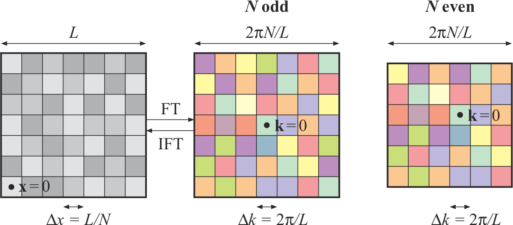

  
# Prerequisites
  
Load libraries and set random seed for this chapter:

```{r,message=F}
library(magicaxis)
library(foreach)
library(pracma)
library(cooltools)
library(mvtnorm)
library(png)
set.seed(1)
```

# Foreword

This chapter considers the question as to whether a density field $\rho(\mathbf{x})$ or a set of points $\{\mathbf{x}_i\}$ contains any useful information. In this context, the points $\mathbf{x}_i$ can be of any dimension $D\geq1$. A prominent example of $D=1$ is the analysis of time series, while $D=2$ and $D=3$ are often encountered when analysing the geometric distribution of objects in 2D/3D space.

The question whether the point set $\{\mathbf{x}_i\}$ contains any information is particularly interesting in the case, where each point individually, seems to be randomly placed. More precisely, the probability distribution $\rho(\mathbf{x})$ for the position of a single point is uniform. In cosmology, this uniformity is one of the implications of the *cosmological principle*, which states that the mass distribution in the universe is *statistically homogeneous and isotropic*. Statistical homogeneity implies that any point $\mathbf{x}$ is, *a priori*, equally likely to host a galaxy, or any other astrophysical object for that matter.

How can such a statistically homogeneous point set contain any information, given the *a priori* random nature of its points? The answer relies in the 'a priori'. While statistical homogeneity implies that each point is *a priori* equal, once we have observed an object/event at position $\mathbf{x}_1$, the *posterior* probability distribution for a second point $\mathbf{x}_2$ can be non-uniform. In other words, the points of a statistically homogeneous dataset can be *correlated* and these correlations can represent *information*. For instance, the spatial correlations between galaxy positions contain a wealth of information on their formation and co-evolution, as well as on fundamental physics in the early universe.

This final part of the course will focus on some key concepts surrounding spatial statistics, including the two-point correlation function and the closely related power spectrum, as well as higher order correlation functions and their corresponding poly-spectra. The first section is almost entirely dedicated to Fourier representations. For most students, this is likely to be a reminder of material covered in earlier maths units. However, it seems important to re-visit Fourier representations to make sure that we lay down all the groundwork and conventions for the following sections.

\newpage
# Fourier representations

## Fourier series

Fourier series are a way of expressing real or complex functions $f(x)$, defined on a finite real interval $x\in[0,L)\subset\mathbb{R}$. Equivalently, $f(x)$ can be $L$-periodic functions defined on the full real domain.

Interestingly, the set of $L$-periodic harmonic functions $\{\sin(2\pi n x/L),\cos(2\pi m x/L)\}$, with $n=1,2,...$ and $m=0,1,2,...$ form a *basis* in the space of continuous functions $f:[0,L)\mapsto\mathbb{C}$. Moreover, since sums of the form $w_1\sin(x)+w_2\cos(x)$ (with real or complex coefficients $w_1$ and $w_2$) can always be written as $z_1\exp(ix)+z_2\exp(-ix)$, the set $\{\exp(2\pi i x n/L), n\in\mathbb{N}\}$, is also a basis of $L$-periodic functions. This basis is *orthonormal* under the scalar product $\langle f,g\rangle=L^{-1}\int_0^L f(x)g^*(x)dx$. This directly implies that
\begin{equation}\label{eq:fourierseries}
f(x) = \sum_{n=-\infty}^\infty c_n e^{2\pi i n x/L},
\text{ where }c_n = \langle f,e^{2\pi i n x/L}\rangle = \frac{1}{L}\int_0^L f(x) e^{-2\pi i n x/L} dx.
\end{equation}
*Reality condition:* It is quite easy to prove (try this as an exercise) that the function $f(x)$ is real if and only if $c_{-n}=c_n^*~~\forall n$.

The *finite Fourier series* of order $N$, defined as
\begin{equation}
f_N(x) = \sum_{n=-N}^N c_n e^{2\pi i n x/L},
\end{equation}
can be used as *approximations* of $L$-periodic functions. The considered coefficients $\{c_n\}$ then represent a lossy compression of $f(x)$. As an example, let us consider a sawtooth function $f(x)=x$, periodic on the interval $x\in[0,L)$. Feel free to try other functions, by altering the first two lines of the following code.

```{r, out.width='70%', fig.align='center'}
# periodic function
L = 1 # period length
f = function(x) x%%L # this is a sawtooth function
magcurve(f(x),xlim=c(-0.5,2.5),ylim=c(-0.2,1.2),xaxs='i',yaxs='i')

# Determine Fourier coefficients
Nmax = 10
integrand = function(x) f(x)*exp(-2i*pi*n*x/L)/L
coef = foreach(n=0:Nmax,.combine='c') %do% integral(integrand,0,L)

# Plot Fourier series
color = rainbow(Nmax,end=2/3)
for (N in seq(Nmax)) {
  n = 1:N
  fN = function(x) coef[1]+sum(2*Re(coef[n+1]*exp(2i*pi*n*x/L)))
  curve(Vectorize(fN)(x),n=500,col=color[N],xlim=c(-0.5,2.5),add=T)
}
```

## Fourier transform (FT)

If the period $L$ in the Fourier series (eq. \ref{eq:fourierseries}) becomes infinite, the frequencies $\nu=n/L$ become continuous, and hence the coefficients $c_n$ become a continuous function $c(\nu)$. In this limit, the function $\hat f(\nu)=L\,c(\nu)$ is called the *Fourier transform* (FT) of $f(x)$. Explicitly,
\begin{equation}
\text{FT:}\quad\hat f(\nu) = \int f(x) e^{-2\pi i \nu x} dx.
\end{equation}
In this same limit, the sum in the Fourier series becomes a continuous integral, called the *inverse Fourier transform* (IFT),
\begin{equation}
\text{IFT:}\quad f(x) = \int \hat f(\nu) e^{2\pi i \nu x} d\nu.
\end{equation}
Analogously to the case of Fourier series, $f(x)$ is a real function if and only if $f(-\nu)=f(\nu)^\ast$.

The term 'Fourier transform' represents both the function $\hat f(\nu)$ and the operation of calculating $\hat f(\nu)$. The function $\hat f(\nu)$ is also called *spectrum*. The mathematical space of $\nu$ is called *Fourier space* or *frequency domain* and hence the representation of $f(x)$ via $\hat f(\nu)$ is called Fourier space representation or frequency domain representation.

The harmonic functions $\hat{B}_\nu(x)= e^{2\pi i \nu x}$ are sometimes called *Fourier modes*, but note that this term is also used for individual values of $\hat f(\nu)$. The modes $\hat{B}_\nu(x)$ constitute a basis of the functions $f:\mathbb{R}\rightarrow\mathbb{C}$, which is an orthonormal basis in the continuous sense that $\langle\hat{B}_\nu,\hat{B}_\mu\rangle=\int\hat{B}_\nu(x)\hat{B}_\mu(x)^\ast dx=\delta_D(\nu-\mu)$, where $\delta_D$ is the Dirac delta function.

The FT is a *linear* operation and corresponds to changing the basis from the Dirac basis $\{B_y(x)=\delta_D(x-y)\}$ to the Fourier basis $\{\hat{B}_\nu(x)\}$. Hence scaling $f(x)$ by a fixed factor implies scaling $\hat f(\nu)$ by the same factor, and vice versa.

There is some freedom in the way the FT is defined. Firstly, it is possible to define $\hat f(\nu)$ with an arbitrary scaling factor $a^{-1}$, as long as the IFT is defined with the inverse scaling factor $a$. Secondly, it is possible to substitute the frequency $\nu$ for a scaled frequency $b\nu$, in which case the IFT must be divided by $b$. The most common example is the *angular frequency* $k=2\pi\nu$. The different definitions corresponding to these choices are summarised in Table \ref{tab:ft}. This table also shows how the FT can be trivially expanded to $D$ dimensions. The FT is said to be unitary if the pre-factors of the FT and IFT are identical, i.e. $a=1$ for frequency and $a=(2\pi)^{D/2}$ for angular frequency notation.

\begin{table}[h]
\centering
\caption{Standard definitions of the Fourier transform and its inverse. The constant $a$ is normally positive.}
\vspace{3mm}
\begin{tabular}{l|l|l}
\label{tab:ft}
& & \\[-7pt]
& \textbf{Frequency} $\boldsymbol{\nu}$ & \textbf{Angular frequency} $\mathbf{k}$ \\[4pt] \hline
& & \\[-6pt]
\textbf{One dimension} & \parbox{10mm}{FT:}$\displaystyle\hat f(\nu)={\color{blue}\frac{1}{a}}\int f(x)e^{-2\pi i\nu x}dx$ & \parbox{10mm}{FT:}$\displaystyle\hat f(k)={\color{blue}\frac{1}{a}}\int f(x)e^{-ikx}dx$ \\
& & \\[-7pt]
& \parbox{10mm}{IFT:}$\displaystyle f(x)={\color{blue}a}\int \hat f(\nu)e^{2\pi i\nu x}d\nu$ & \parbox{10mm}{IFT:}$\displaystyle f(x)=\frac{\color{blue}{a}}{2\pi}\int \hat f(k)e^{ikx}dk$ \\[11pt] \hline
& & \\[-6pt]
\textbf{$\mathbf{D}$ dimensions} & \parbox{10mm}{FT:}$\displaystyle\hat f(\boldsymbol{\nu})={\color{blue}\frac{1}{a}}\int f(\boldsymbol{x})e^{-2\pi i\boldsymbol{\nu}\cdot\boldsymbol{x}}d^D x$ & \parbox{10mm}{FT:}$\displaystyle\hat f(\boldsymbol{k})={\color{blue}\frac{1}{a}}\int f(\boldsymbol{x})e^{-i\boldsymbol{k}\cdot\boldsymbol{x}}d^Dx$ \\
& & \\[-7pt]
& \parbox{10mm}{IFT:}$\displaystyle f(\boldsymbol{x})={\color{blue}a}\int \hat f(\boldsymbol{\nu})e^{2\pi i\boldsymbol{\nu}\cdot\boldsymbol{x}}d^D\nu$ & \parbox{10mm}{IFT:}$\displaystyle f(\boldsymbol{x})=\frac{\color{blue}{a}}{(2\pi)^D}\int \hat f(\boldsymbol{k})e^{i\boldsymbol{k}\cdot\boldsymbol{x}}d^Dk$ \\[11pt]
\end{tabular}
\end{table}

## Discrete Fourier transform (DFT)

The discrete Fourier transform (DFT) is obtained by restricting the FT to $L$-periodic functions $f(x)$ (as in the case of Fourier series) and discretising the domain $x\in[0,L)$ into $N$ equally spaced points, separated by $\Delta x=L/N$. In $D>1$ dimensions, the function $f(\mathbf{x})$ has to be $L$-periodic in each dimension and the domain $\mathbf{x}\in[0,L)^D$ is subdivided into $N$ divisions along each dimension. Hence, along each dimension, we only consider the points $\{{\color{blue}{x_0}}+n\Delta x,\}$ with $n=0,...,N-1$. The constant $\color{blue}{x_0}$ defines the origin of the grid and can be chosen freely for periodic functions. The function $f(\mathbf{x})$ is thus reduced to a set of $N^D$ discrete values $f_\mathbf{x}$.

The periodicity of period $L$ implies that the Fourier modes must be spaced by $\Delta k = 2\pi/L$ along each dimension. Since all distinct Fourier modes are orthogonal, it will take exactly $N^D$ modes with coefficients $f_\mathbf{k}$ to encode the $N^D$ direct space points $f_\mathbf{x}$ and vice versa. Thus, each dimension of the Fourier domain can be discetised as ${{\color{blue}{k_0}}+n\Delta k}$ with $n=0,...,N-1$, where the origin $\color{blue}{k_0}$ can again be chosen freely.

Given such a discretisation, the one-dimensional FT and its inverse, in angular frequency notation, become
\begin{equation}\label{eq:dft1d}
\hat f_k = {\color{blue}{\frac{1}{a}}}\sum_x f_x e^{-ikx}~~~\text{and}~~~
  f_x = \frac{{\color{blue}{a}}}{N}\sum_k \hat f_k e^{ikx},
\end{equation}
where the sums go over the $N$ discrete values of $x$ and $k$. As in the continuous FTs, the constant $a$ can be chosen freely and is usually positive. Analogously, in $D$ dimensions,
\begin{equation}\label{eq:dftDd}
\hat f_\mathbf{k} = {\color{blue}{\frac{1}{a}}}\sum_\mathbf{x} f_\mathbf{x} e^{-i\mathbf{k}\cdot\mathbf{x}}~~~\text{and}~~~
  f_x = \frac{{\color{blue}{a}}}{N^D}\sum_\mathbf{k} \hat f_\mathbf{k} e^{i\mathbf{k}\cdot\mathbf{x}},
\end{equation}
where the sums go over the $N^D$ discrete values of $\mathbf{x}$ and $\mathbf{k}$.

For $\mathbf{k}=0$ the complex phase-factor is identically equal to one. Hence, the trivial Fourier mode $\hat f_{\mathbf{k}=0}$ (also known as *null mode*) is proportional to the sum of $f_\mathbf{x}$.

You can convince yourself that eqs. (\ref{eq:dft1d}) and hence eqs. (\ref{eq:dftDd}) hold for any choice of $x_0$, $k_0$, $a\neq0$, $N=1,2,...$, $L>0$ and for any function $f$ using the following code.

```{r}
# arbitrary user parameters
x0 = 2.87
k0 = -9.17
a = 1.846 # needs to be non-zero
N = 18 #  needs to be an integer
L = 1.723 # needs to be positive
f = function(x) sin(x^2)

# make grids
n = seq(0,N-1)
dx = L/N; x = x0+n*dx
dk = 2*pi/L; k = k0+n*dk

# make fx, fk = DFT(fx), fx.check = IDFT(fk)
fx = f(x)
fk = foreach(i=1:N,.combine='c') %do% {(1/a)*sum(fx*exp(-1i*k[i]*x))}
fx.check = foreach(i=1:N,.combine='c') %do% {(a/N)*sum(fk*exp(1i*k*x[i]))}

# compare input and output
err = mean(Mod(fx-fx.check))
cat(sprintf('Mean numerical error = %.3e.\n',err))
```

This shows that `fx` and `fx.check` are indeed identical (up to a floating point rounding error).

In real-world applications, DFTs are far more common than the continuous FTs, because DFTs can be evaluated numerically. One dimensional DFTs are normally computed using a Fast Fourier Transform (FFT) algorithm. These algorithms perform the DFT in a computation time scaling as $N\log(N)$, which is considerably faster than the native $N^2$ scaling expected from the definition above. The $D$-dimensional DFT can be written as a $D$-fold nested one dimensional DFT; hence a the FFT algorithm is straightforward to extend to any number of dimensions.

\newpage
### Nyquist theorem

Interestingly, Eq. (\ref{eq:dft1d}) can be recast into a fundamental statement about the frequency at which a signal has to be sampled in order to *fully* capture all the frequencies up to a certain target.

Explicitly, if a signal is sampled on an interval $[0,L]$ at $N$ equally-spaced points, separated by $\Delta x=L/N$, the sampling frequency is defined as $\nu_{\rm sampling} = 1/\Delta x = N/L$. Via the inverse DFT, all samples $f_x$ can be fully recovered using only the modes $f_k$ for $k=\Delta k\cdot(0,...,N/2)$, since all negative $k$-values are related to the positive ones by complex conjugation (reality condition). Hence, the highest angular frequency that can be extracted is $k_{\rm Nyquist} = \Delta k\, N/2 = N\pi /L$. Thus, the highest *linear* frequency, $\nu_{\rm Nyquist}=k_{\rm Nyquist}/(2\pi)$, is equal to $N/(2L)=\nu_{\rm sampling}/2$. This is the essence of the Nyquist theorem, which states:
  
*If a signal is sampled at a frequency $\nu_{\rm sampling}$, the highest frequency that can be recovered is $\nu_{\rm Nyquist} = \nu_{\rm sampling}/2$. Equivalently, the minimum frequency, at which a signal must be sampled to fully capture the signal, is twice the highest frequency present in the signal.*

For instance, an audio signal is sampled $10^4$ times per second, i.e. the sampling frequency is $10\rm\,kHz$. Following Nyquist, the *highest* pitch that can be detected has a frequency of *only* $5\rm\,kHz$. To visualise this point, let us look at an $8\rm\,kHz$ sine-wave signal, sampled at $10\rm\,kHz$:

```{r, out.width='70%', fig.align='center'}
nu_signal = 8e3 # [Hz] frequency of sine-signal
nu_sample = 10e3 # [Hz] sampling frequency
signal = function(x) sin(x*2*pi*nu_signal)
magcurve(signal,0,8e-4,500,xlab='Time [s]',ylab='Audio signal')
x.sample = seq(0,8e-4,1e-4)
points(x.sample,signal(x.sample),col='red',cex=1.5,pch=16)
```
The signal is the black line, while the samples, taken at intervals of $10^{-4}\rm s$ ($10\rm\,kHz$), are shown as red points. If you squint your eyes, you might already recognise that these points fall themselves on a sine-wave with a lower frequency. In fact, they fall exactly on a $2\rm\,kHz$ sine-wave as shown here:

```{r, out.width='70%', fig.align='center'}
nu_low = 2e3 # [Hz] frequency of consistent low-frequency signal
magcurve(signal,0,8e-4,500,xlab='Time [s]',ylab='Audio signal')
points(x.sample,signal(x.sample),col='red',cex=1.5,pch=16)
curve(-sin(x*2*pi*2e3),n=500,add=T,lwd=3)
```
In other words, an $8\rm\,kHz$ sine-wave is indistinguishable from a $2\rm\,kHz$ signal if sampled at $10\rm\,kHz$. In fact, the Nyqusist theorem tells us that, at this sampling rate, *any* frequency above $5\rm\,kHz$ can somehow be mimicked by a lower frequency $\nu<5\,\rm kHz$.

### Numerical computation of DFTs

Standard FFT algorithms, such as **fft** in **R**, usually convert the vector $\mathbf{f}=(f_0,...f_{N-1})$ to $\hat{\mathbf{f}}=(\hat{f}_0,...,\hat{f}_{N-1})$, defined as
\begin{equation}\label{eq:standardfft}
\hat{f}_m=\sum_{n=0}^{N-1} f_n e^{-2\pi i nm/N},
\end{equation}
which corresponds to the most basic choices $a=1$, $x_0=0$, $k_0=0$. Note that **fft** can also compute an 'inverse' DFT, by setting the optional argument `inverse=TRUE`. However, this inversion does not take the vector $\hat{\mathbf{f}}$ back to $\mathbf{f}$, instead the inversion simply means that the $-$ sign in the exponential of Eq. (\ref{eq:standardfft}) is changed to a $+$ sign. Following Eq. (\ref{eq:dftDd}), the output then has to be rescaled by a factor $N^D$ to get the true inverse DFT.

For the remainder of this chapter, we will choose $a=N^D$, which is a common choice that makes the mean amplitude of the Fourier coefficients independent of $N$. Further, we choose to shift the origin $k_0$ of the Fourier grid, such that the null mode ($k=0$) lies at the centre of the Fourier domain. This has the advantage that all long wavelength modes (small $k$) lie in the centre of the Fourier grid, while the often less important short wavelength modes (large $k$) lie at the edges. Explicitly, we follow the scheme of Obreschkow et al. 2013 (ApJ 762, see Appendix D therein), where $k_0=-{\rm floor}(N/2)\Delta k$. In this way the null mode is exactly at the grid centre, if $N$ is odd, and half a cell to the right of the centre, if $N$ is even (see Fig. 1). 

```{r,echo=FALSE,out.width="320px",fig.align='center',fig.pos='h',fig.cap='Discretisation rules in direct space (left panel) and Fourier domain (middle and right panels), here shown for a 2D square matrix. Complex numbers are shown in colors, such that brightness is proportional to amplitudes and hue colors show the phases. Black dots denote our choice of the origins of the coordinate systems.'}

```

The **cooltools** package contains two useful functions for handling DFTs on cartesian grids:
  
  * The function **dftgrid(N,L,...)** generates the grids as shown in Fig. 1. Explicitly it outputs a list with several components. The component `x` is a vector of the $x$-coordinates in one dimension, whereas the component `k` is a vector of the $k$-coordinates in one dimension (see package documentation for other outputs). Using these vectors, you can easily generate higher-dimensional grids using the **expand.grid** function. For instance, to produce the 2D grids shown in Fig. 1, use `expand.grid(x,x)` and `expand.grid(k,k)`, where `x` and `k` are the output components of **dftgrid**.

* The function **dft(f)** evaluates the DFT of the $D$-dimensional array `f`. Also, **dft(f,inverse=TRUE)** computes the proper inverse DFT, such that `dft(dft(f),inverse=TRUE)` returns the array `f` (up to numerical rounding errors). By default, the function returns a complex-valued array if needed and a real-valued array otherwise, i.e. if `f` is a real array, then `g=dft(f)` is normally a complex array, but `dft(g,inverse=TRUE)` is again real. By default, **dft** uses the conventions described above, i.e. it computes Eq. (\ref{eq:dftDd}) with $a=N^D$, $x_0=0$, $k_0=-{\rm floor}(N/2)\Delta k$.

Note that following our choice of $a=N^D$, the null mode is just the mean of the field:
$$\hat{f_0}=\bar{f_\mathbf{x}}.$$
  
### Example: Bivariate Gaussian
  
As an example of using **dft**, we compute and visualize the 2D DFT of a pixelated bivariate Gaussian:
  
```{r, fig.align='center'}
# make grid
N = 30
L = 1
grid = dftgrid(N,L)

# make original image f
mv = function(x,y) dmvnorm(cbind(x,y),mean=c(0.2,0.3),sigma=cbind(c(50,9),c(9,15))/1e4)
f = outer(grid$x,grid$x,mv)
f = f/max(f)

# take Fourier transform
g = dft(f)

# invert Fourier transform
f2 = lim(dft(g,inverse=TRUE)) # "lim" to truncate minute numerical errors outside [0,1]

# plot everything
nplot(xlim=c(0,2.9),ylim=c(0,1),asp=1)
rasterImage(rasterflip(f),0,0,0.9,0.9,interpolate=FALSE)
rasterImage(rasterflip(cmplx2col(g)),1,0,1.9,0.9,interpolate=FALSE)
rasterImage(rasterflip(f2),2,0,2.9,0.9,interpolate=FALSE)
text(0.45,0.9,'Input function f',pos=3,cex=0.8)
text(1.45,0.9,'DFT(f)',pos=3,cex=0.8)
text(2.45,0.9,'IDFT(DFT(f))',pos=3,cex=0.8)
```
\newpage
In the Fourier space visualisation, complex numbers are shown in color, where brightness represents amplitude and hue represents phase. You can do this with the function **cmplx2col** in the **cooltools** package. This example shows nicely that the long wave-length modes lie at the centre of the Fourier space domain, while short wave-length modes lie at the edges. This is indeed the main advantage of our particular discretisation scheme (Figure 1).

This example also illustrates the general statement that normal distributions (in any dimension) Fourier transform into normal distributions. The (co)variance of the FT is inversely proportional to the (co)variance in direct space.

Note that only half of the discrete Fourier domain is needed to recover the input image, because the reality condition implies that coefficients of opposite Fourier modes are complex conjugates of each other.


### White noise

A *Gaussian Random Field (GRF)* is a random density field, where, in each point, the values are normally distributed. More specifically, a GRF results from a random (Poissonian) superposition of infinitely many plane or spherical waves with vanishing Fourier phase-correlation. We here consider the simplest case of a GRF, with random, uncorrelated amplitudes sampled from a single normal distribution. Such a field is normally called *white noise*, since its expected Fourier amplitudes are *independent* of wavelength. Analytically, it can be shown that an uncorrelated GRF of standard deviation $\sigma$ (in configuration space) has a DFT of uncorrelated, normally distributed complex values, i.e. both the real and imaginary parts are normally distributed. The only exception is the null mode ($\hat{f}_0$), which is just the mean value of the GRF in our normalisation convention. The RMS complex amplitude of the non-trivial modes is
\begin{equation}
\label{eq:noise}
A=\frac{\sigma N^{D/2}}{\color{blue}a}=\begin{cases}
\sigma N^{+D/2}&\text{for fft routine}\\
\sigma N^{-D/2}&\text{for dft routine}
\end{cases}
\end{equation}

Let us check this numerically:
  
```{r}
# input parameters for GRF (change these as you like)
N = 80 # number of cells per side
D = 3 # number of dimensions
mu = 100 # mean of normal distribution
sigma = 10 # standard deviation of normal distribution

# make GRF in configuration space
f = array(rnorm(N^D,mu,sigma),rep(N,D))

# predict RMS amplitude of Fourier modes
amp.predicted = sigma*sqrt(N)^D

# measure RMS amplitude of Fourier modes
a = Mod(fft(f)) # complex amplitude of FFT
amp.measured = sqrt(mean(a[-1]^2)) # '-1' excludes the null mode

# compare the two amplitudes
print(amp.measured/amp.predicted)
```

The ratio close to unity confirms the validity of Eq. (\ref{eq:noise}). You can convince yourself that this remains true for any number of cells/modes $N>1$ per dimension, any number of dimensions $D\geq1$, any mean $\mu\in\mathbb{R}$ and any standard deviation $\sigma>0$.

Since the phase distribution is random, the real and imaginary components are uncorrelated and therefore should both have a standard deviation of $A/\sqrt{2}$.

\newpage
# Applications of DFTs

### Rainfall

The weather station at the botanic gardens in Sydney has collected daily rainfall data since more than a century. These data are publicly available at [www.bom.gov.au](www.bom.gov.au). Let us plot the data in the *time domain* from 1 Jan 1917 to 31 Dec 2016 (36526 days = 100 years) .

```{r, fig.width=7.5, fig.height=4.8, fig.align='center'}
# Load daily rainfall from the botanic gardens station in Sydney
filename = '../data/rainfall.csv'
rain = read.csv(filename)[11688:48213,6] # extract days from 1/1/1917 to 31/12/2016 
rain[is.na(rain)] = 0 # set unavailable measurements to zero
N = length(rain)
time = seq(1917,2017,length=N)

# Plot time series
plot(0,0,type='n',xlim=range(time),ylim=c(-0.5,350),xaxs='i',yaxs='i',
     xlab='Time [yr]',ylab='Rainfall [mm]')
segments(time,array(0,N),time,rain,col='#00000060',lwd=1)
```

Now, let us plot the DFT, i.e. the *frequency domain*, of these data. Colours are used to represent complex values: real parts in light blue, imaginary parts in light red, complex amplitudes in solid black.

```{r, fig.width=7.5, fig.height=4.8, fig.align='center'}
# Fourier analysis
spectrum = dft(rain)
frequency = dftgrid(N,L=100)$k/2/pi

# Plot frequency domain
plot(0,0,type='n',xlim=c(0,3),ylim=c(-0.2,0.6),
     xlab=expression('Frequency [1/yr] ('*nu*'=k/2'*pi*')'),
     ylab='DFT(rainfall)',xaxs='i',yaxs='i')
abline(v=1,lty=2,col='grey')
lines(frequency,Re(spectrum),col='#0000ff88')
lines(frequency,Im(spectrum),col='#ff000088')
lines(frequency,Mod(spectrum),lwd=2)
```

One mode clearly stands out: this is the mode corresponding to a period of exactly one year! Whereas the time series looks very random, the duration of a year is clearly imprinted in it. The DFT allows us to measure the length of the planet's year, because, on average, the rainfall correlates with the rainfall exactly a year ago.

### Image compression

A prominent example of how FTs appear in our daily life, is image compression. The widely used JPEG-format ($\ast$.jpg or $\ast$.jpeg) with its typical compression ratio of 1:10 at negligible visible loss has brought enormous benefits to storing and sharing images. This format, originally introduced in 1992, relies on a discrete cosine transform (DCT; more precisely the DCT-II variation), which is closely related to the DFT, but only uses real numbers. The DCT has a some technical advantages over the DFT in the context of image compression, but for the sake of an illustrating the basic idea of JPEG-style compression, we shall use DTFs, which we are already familiar with.

To simplify matters, we will only consider the compression of a grey-scale image, but the same idea can be extended to multiple channels (a brightness channel $Y$ and two colour channels $C_B$ and $C_R$ in the case of JPEG compression). As an example of a grey-scale image, let us consider a transmission electron microscopy (TEM) image of a plant cell. This image is made of $N$-by-$N$ pixels (with $N=99$). The following line loads this image into an $N$-by-$N$ array:

```{r}
# load image (only use red channel, since red/green/blue are identical)
f = readPNG('../figures/plant_cell.png')[,,1]
```

As per default of **readPNG**, the values in `f` range between 0 and 1 in 256 steps. Let us plot this image:

```{r, out.width='70%', fig.align='center'}
# plot image
nplot(xlim=c(0,1),ylim=c(0,1),asp=1)
rasterImage(f,0,0,1,1)
```

This image $f$, made of $n_p=N^2$ pixel values $f_\mathbf{x}$, can be expressed in terms of its DFT $\hat f$, made of $n_p$ Fourier modes $f_\mathbf{k}$. Of these modes, one is the null mode and the others come in conjugate pairs. Hence, there are
$$n=\frac{n_p-1}{2}=\frac{N^2-1}{2}$$
non-trivial independent modes.

If we were to approximate the image $f$ by the null mode $\hat{f_0}$ and $m\leq n$ independent modes, the best way to do so is to pick the $m$ non-trivial independent modes with the *largest* Fourier amplitudes. To do this efficiently, we can first sort the $n$ non-trivial independent modes $\hat{f_\mathbf{k}}$ by decreasing amplitude $|\hat{f_\mathbf{k}}|$. We label the ordered Fourier modes as $\hat{f_i}$, such that $\hat{f_1}$ is the non-trivial mode with the largest amplitude, $\hat{f_2}$ the one with the second largest amplitude, etc. The set $\{\hat{f_0},\hat{f_1},...,\hat{f}_{\!\!m}\}$, combined with its complex conjugates, then represents the best approximation of the image $f$, given the restriction to $m$ non-trivial independent modes (see proof through likelihood below). The number of real parameters used for this approximation is $2m+1$, since there are two real values (an amplitude and a phase; or a real and imaginary part) for each non-trivial mode and one real value for the null mode.

The interesting question is, what number $m$ of independent non-trivial modes provides an optimal compression? In order to clarify what is meant by 'optimal', we need to specify a typical compression error. For instance, we could demand that the compressed image differs from the original one with an RMS pixel value difference $\tau$. This could, for instance, be justified if the original image was subject to pixel noise described by a normal distribution with standard deviation $\tau$. Upon assuming that this noise is uncorrelated between different pixels, this pixel noise in the image corresponds to white noise in the Fourier domain, with an RMS amplitude of $\tau/N$ (following Eq. \ref{eq:noise} for our convention in **dft**). This is equivalent to saying that the real and imaginary components of each Fourier mode have an uncorrelated normal uncertainty with standard deviation
$$\sigma=\frac{\tau}{\sqrt{2}N}.$$
Now let us assume that we model the image $f$ in Fourier space by the null mode $\hat{f_0}$ and non-trivial Fourier coefficients $\hat{g_i}$ ($i=1,\ldots,n$), which can be different from the actual coefficients $\hat{f_i}$. We impose that only the first $m$ non-trivial coefficients can be non-zero, whereas $\hat{g_i}=0$ for all $i>m$. In this case, the likelihood (see part 4) as a function of the non-trivial coefficients reads
$$\mathcal{L}_m(\hat{g_1},\ldots,\hat{g}_{\!m})=\prod_{i=1}^m\mathcal{N}(c_i;a_i,\sigma)\times\prod_{i=1}^m\mathcal{N}(d_i;b_i,\sigma)\times\prod_{i=m+1}^n\mathcal{N}(a_i;0,\sigma)\times\prod_{i=m+1}^n\mathcal{N}(b_i;0,\sigma),$$
where $\mathcal{N}(x;\mu,\sigma)=1/(\sqrt{2\pi}\sigma)\exp(-(x-\mu)^2/(2\sigma^2))$ are normal distributions and $\hat{f_i}=a_i+i\,b_i$ and $\hat{g_i}=c_i+i\,d_i$. (Non-subscript '*i*' refers to the imaginary unit.) The likelihood is written with a subscript $m$ to keep track of the fact that it is associated with an image-model using $m$ non-trivial Fourier modes. It is straightforward to see that this likelihood is maximal if $\hat{g_i}=\hat{f_i}$ for all $i=1,\ldots,m$, i.e. if $c_i=a_i$ and $d_i=b_i$. This is indeed the mathematical proof of our earlier statement that keeping the dominant $m$ modes of the original image is the best $m$-mode approximation of this image.

Formally, the maximum likelihood estimator (MLE) is just
$$\hat{\mathcal{L}}_m = \prod_{i=1}^m\mathcal{N}(a_i;a_i,\sigma)\times\prod_{i=1}^m\mathcal{N}(b_i;b_i,\sigma)\times\prod_{i=m+1}^n\mathcal{N}(a_i;0,\sigma)\times\prod_{i=m+1}^n\mathcal{N}(b_i;0,\sigma) = \left(\frac{1}{\sqrt{2\pi}\sigma}\right)^{\!2n}\!\!\times\!\!\prod_{i=m+1}^n\!\!e^{-\tfrac{a_i^2+b_i^2}{2\sigma^2}}$$
Using $|\hat{f_i}|^2=a_i^2+b_i^2$, the maximum log-likelihood becomes
$$\hat\ell_m=-2n\ln\left(\sqrt{2\pi}\sigma\right)-\frac{1}{2\sigma^2}\sum_{i=m+1}^n|\hat{f_i}|^2$$

To determine which value of $m$ gives the best compression, given the tolerance $\sigma$, we can employ the Bayesian model evidence (see part 4), or, its much simpler approximation, the Bayesian information criterion (BIC). Adapted to this example, the BIC reads, ${\rm BIC}(m)=(2m+1)\ln(n_p)-2\hat\ell_m$. The first term in $\hat\ell_m$ is a model-independent constant. We can therefore drop this term when comparing models and use the *effective* BIC,
$$\rm{BIC}'(m)=(2m+1)\ln(n_p)+\frac{1}{\sigma^2}\sum_{i=m+1}^n|\hat{f_i}|^2$$
  
To fix $\sigma$, let us choose $\tau=0.03$, i.e. we allow the pixel values of the compressed image to differ from the of the original one by an RMS error of 3\% of the maximum brightness.

The following code computes the effective BIC as a function of the number $m$ of non-trivial independent modes and identifies the value of $m$ that minimizes the BIC. Note that the code uses `g` for $\hat f$.

```{r, out.width='65%', fig.align='center'}
tolerance = 0.03 # compression tolerance (standard deviation of pixel error)
sigma = tolerance/dim(f)[1]/sqrt(2) # scatter of real and imaginary Fourier parts

# compute DFT
g = dft(f)

# extract modes (only works for odd square matrices)
np = length(f) # total number of modes
n = (np-1)/2 # number of independent non-trivial modes
gi = g[1:n] # independent non-trivial modes

# order independent non-trivial modes by decreasing amplitude
gisqr = sort(Mod(gi),decreasing=TRUE)^2/sigma^2

# compute BIC as a function of number of non-trivial independent modes
bic = foreach(m=1:(n-1),.combine='c') %do% {(2*m+1)*log(np)+sum(gisqr[(m+1):n])}

# plot BIC(m)
magplot(seq(n-1),bic,type='l',ylim=c(0,1.9e5),
        xlab='Number of non-trivial independent modes', ylab='BIC')
m = which.min(bic) # optimal number of non-trivial independent modes
abline(v=m,lty=2)
```

We see that for our choice of $\tau$ and for this particular image, the BIC-based compression criterion favours a compression with only $m=$ `r m` of the $n=$ `r n` non-trivial Fourier modes, meaning that the data size is reduced by a factor `r round(np/(2*m+1),1)`.

To display the corresponding compressed image, we first need to compute the simplified Fourier transform, with all non-relevant modes set to zero. Then we inverse Fourier transform this array. This is included in the following function, which also repeats the previous code in a slightly more condensed style:

```{r}
compress.image = function(filename, tolerance=0.03) {
  
  # initialise
  f = readPNG(filename)[,,1] # load red channel
  sigma = tolerance/dim(f)[1]/sqrt(2) # scatter of real and imaginary Fourier parts

  # make Fourier modes
  np = length(f) # total number of modes
  n = (np-1)/2 # number of independent non-trivial modes
  g = dft(f) # evaluate DFT
  gi = g[1:n] # independent non-trivial modes

  # find minimal BIC
  s = sort(Mod(gi),decreasing=TRUE,index.return=T)
  gisqr = Mod(gi[s$ix])^2/sigma^2
  bic = foreach(m=1:(n-1),.combine='c') %do% {(2*m+1)*log(np)+sum(gisqr[(m+1):n])}
  m = which.min(bic)
  
  # reconstitute compressed image
  gi[s$ix[(m+1):n]] = 0 # remove all these modes; this is the actual compression
  g.compressed = c(gi,g[n+1],rev(Conj(gi))) # complete with trivial mode and conjugates
  g.compressed = array(g.compressed,dim(f)) # recast into a square matrix
  f.compressed = lim(dft(g.compressed,inverse=TRUE)) # make compressed image
  
  # plot/print everything
  nplot(xlim=c(0,3.9),ylim=c(0,1),asp=1)
  rasterImage(f,0,0,0.9,0.9,interpolate=FALSE)
  rasterImage(cmplx2col(g,1e-3,gamma=0.5),1,0,1.9,0.9,interpolate=FALSE)
  rasterImage(cmplx2col(g.compressed,1e-3,gamma=0.5),2,0,2.9,0.9,interpolate=FALSE)
  rasterImage(f.compressed,3,0,3.9,0.9,interpolate=FALSE)
  text(0.45,0.9,'Original image',pos=3,cex=0.8)
  text(1.45,0.9,'DFT',pos=3,cex=0.8)
  text(2.45,0.9,'Truncated DFT',pos=3,cex=0.8)
  text(3.45,0.9,'Compressed image',pos=3,cex=0.8)
  cat(sprintf('optimal number of non-trivial independent modes = %d\n',m))
  cat(sprintf('compression factor = %.1f\n',np/(2*m+1)))
}
```

To compress the plant cell image, we then just run:

```{r, fig.align='center',comment=NA}
compress.image('../figures/plant_cell.png')
```

We can now run the same code for any other image, as long as it is a square grey-scale image with an odd number of pixels on each side. (You can easily extend the code to general formats.) For example, let us compress the famous image of the shadow of the super-massive black hole in the Virgo elliptical galaxy M87, imaged by the 'Event Horizon Telescope' (EHT) in 2017. Albeit a phenomenal achievement, this interferometric image with a resolution around 25 micro-arcseconds is relatively blurry. Therefore, the BIC favours much fewer modes and thus a much higher compression ratio:

```{r, fig.align='center',comment=NA}
compress.image('../figures/eht_m87.png')
```

By contrast, there are images that are particularly difficult to compress. Various test images that are deliberately challenging for compressors can be found online. For example this one:

```{r, fig.align='center',comment=NA}
compress.image('../figures/hard.png')
```

The quintessential example of data that are virtually incompressible is pure white noise (with a standard deviation $\gg\tau$). In this case there is simply no better way to model the image than to just give all the pixel values or, equivalently, all the Fourier modes. For example:

```{r, fig.align='center',comment=NA}
compress.image('../figures/white_noise.png')
```

These examples illustrate the gist of the lossy image compression found in JPEG-like formats. The actual transform and the selection of modes are slightly different in the real JPEG format, but the guiding idea is the same. There are also other approaches to image compression, including lossless compression algorithms such as found in the Portable Network Graphics (PNG) format, which were used to save the original images in the examples above.