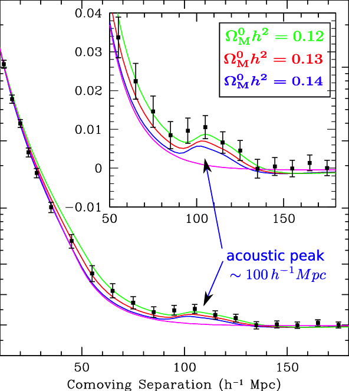
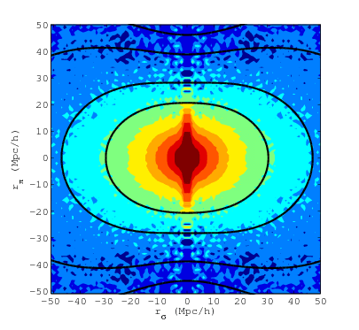

# Prerequisites

Load libraries and set random seed for this chapter:
```{r,message=F}
library(magicaxis)
library(cooltools)
library(pracma)
set.seed(1)
```

# 2-point correlation function (2PCF)

## Definition and alternative formulations

Let us now discuss the spatial correlation between point-pairs. We first consider an unbound $D$-dimensional domain $\mathbb{R}^D$, populated with points, such that there is a finite number of points in any finite sub-volume. The two-point correlation function $\xi(r)$ is defined as the excess probability of finding two points separated by a distance $r$, relative to what one would expect without correlation. Formally, the probability $d P$ of finding two points simultaneously in the volumes $d V_1$ and $d V_2$, separated by $r$ is 
\begin{equation}\label{eq:xi1}
  dP = \bar{n}^2(1+\xi(r))dV_1 dV_2,\quad\text{(probability representation)}
\end{equation}
where $\bar{n}$ is the mean density of points. Integrating this equation over all point-pairs separated by a distance in $[r,r+dr]$, the LHS becomes the total number of observed point-pairs in this distance interval, $dN_{\rm obs}(r)=\int dP(r)$. The RHS becomes $(1+\xi(r))\bar{n}^2\int dV_1 dV_2=(1+\xi(r))dN_{\rm rnd}(r)$, where $dN_{\rm rnd}(r)$ is the expected number of point-pairs for uniform-randomly distributed points without correlations. Thus, $\xi(r)=dN_{\rm obs}(r)/dN_{\rm rnd}(r)-1$, which is an important alternative form of eq. (\ref{eq:xi1}). It implies that the 2PCF can be estimated as $\xi(r)\approx\Delta N_{\rm obs}(r)/\Delta N_{\rm rnd}(r)-1$, where $\Delta N_{\rm obs}(r)$ is the count of point pairs with a separation close to $r$ (say within a small interval $\Delta r$). The number of pairs in the random set $\Delta N_{\rm rnd}(r)$ can sometimes be determined analytically. If not, it can be evaluated numerically using a mock dataset of uncorrelated points (see later in this section).

If the data take the form of a number density field $n(\mathbf{x})=dN(\mathbf{x})/dV$ rather than a point set, the observed pair-count is $dN_{\rm obs}(r)=\int_{|\mathbf{r}|\in[r,r+dr]}\int_{\mathbf{x}\in\mathbb{R}^D}n(\mathbf{x})n(\mathbf{x}+\mathbf{r})\,d^Dx\,d^Dr$. Here, the first integral sum over all possible rotations of a vector $\mathbf{r}$ of fixed length $r$, whereas the second integral sums over all possible translations. Likewise, the expected pair-count in the uncorrelated case is $dN_{\rm rnd}(r)=\bar n^2\int_{|\mathbf{r}|\in[r,r+dr]}\int_{\mathbf{x}\in\mathbb{R}^D}\,d^Dx\,d^Dr$, where $\bar n$ is the mean point density. From $\xi(r)=dN_{\rm obs}(r)/dN_{\rm rnd}(r)-1$ it then follows that
\begin{equation}\label{eq:xi2}
  \xi(r) = \frac{\langle n(\mathbf{x})n(\mathbf{x}+\mathbf{r})\rangle}{\bar n^2}-1 = \langle\delta(\mathbf{x})\delta(\mathbf{x}+\mathbf{r})\rangle,\quad\text{(convolution representation)}
\end{equation}
where $\delta(\mathbf{x})=n(\mathbf{x})/\bar n-1$ is the *density contrast*, i.e. the excess density relative to the mean. The expectation $\langle...\rangle$ marginalises over all translations $\mathbf{x}\in\mathbb{R}^D$ and all rotations $|\mathbf{r}|=r$.

The convolution theorem implies that $\xi(r)$ as defined in eq. (\ref{eq:xi2}) is identical to a *inverse radial FT* of the *isotropic power spectrum* $P(k)=\langle|\hat\delta(\mathbf{k})|^2\rangle_{|\mathbf{k}|=k}$. For the standard convention $a=1$ (see Table 1, part 6, secion 2) of the FT,
\begin{equation}\label{eq:xi3}
  \xi(r) = \frac{A_D}{(2\pi)^D}\int_0^\infty w_D(kr)P(k)k^{D-1}dk,\quad\text{(spectral representation)}
\end{equation}
where $A_D$ is the surface area of a $D$-sphere (e.g. $A_1=2$, $A_2=2\pi$, $A_3=4\pi$) and the weighing functions $w_D(x)$ are the spherical averages of $e^{i\mathbf{k}\cdot\mathbf{r}}$ over all $|\mathbf{r}|=r$. Explicitly,
\begin{equation}\label{eq:wd}
  w_D(x) = \begin{cases}
  \cos(x) & \text{if }D=1 \\
  J_0(x) & \text{if }D=2 \\
  j_0(x)\equiv\sin(x)/x & \text{if }D=3 \\
  \end{cases}
\end{equation}
where $J_0$ is a Bessel function of the first kind.

The discretised version of eq. (\ref{eq:xi3}), using our standard discretisation scheme (Figure 1, part 6, section 2), is
\begin{equation}\label{eq:xi3discrete}
  \xi(r) = \sum_{\mathbf{k}} w_D(kr) P(\mathbf{k}),
\end{equation}
where $k=|\mathbf{k}|$. The sum goes over all $N^D$ points $\mathbf{k}$ and thus operates directly on the well-defined numbers $P(\mathbf{k})=|\delta(\mathbf{k})|^2$, rather than the isotropic form $P(k)$, which would require some binning in $k$. (For details, see Obreschkow et al., ApJ 762, 2013, especially Appendices B--D).

Eq. (\ref{eq:xi3}) is readily invertible, such that we can express the power spectrum as the radial FT of the 2PCF,
\begin{equation}\label{eq:xi3inverse}
  P(k) = A_D\int_0^\infty w_D(kr)\xi(r)r^{D-1}dr.
\end{equation}

## Implementation in 1D on a periodic interval

The aim of this paragraph is to show numerically that the three equations (\ref{eq:xi1}), (\ref{eq:xi2}) and (\ref{eq:xi3}) are indeed equivalent. We limit this demonstration to a set of points in one dimension, contained in the periodic interval $[0,L)$, discretised in $N$ steps. In this case, the three equations can be implemented as follows.

```{r}
two.point.estimator.1 = function(x,N,L) {

  # x: vector of positions
  # N: number of cells
  # L: side-length of interval with periodic boundary conditions

  # initialise
  npts = length(x) # number of points
  dr = L/N # cell spacing in configuration space
  nxi = ceiling(L/2/dr)+1 # number of independent modes (incl. null mode)
  r = seq(0,nxi-1)*dr # grid of separations

  # count distances between binned points (deliberately not efficiently coded!)
  q = ceiling(x/dr) # point positions in units of dr
  count.obs = rep(0,nxi)
  for (i in seq(npts)) {
    for (j in seq(npts)) {
      d = abs(q[i]-q[j]) # distance between points in units of dr
      d = min(d,N-d) # shortest distance accounting for periodicity
      count.obs[d+1] = count.obs[d+1]+1 # d+1 due to 1-indexed vectors
    }
  }
  
  # compute expected distance count between uncorrelated points
  count.rnd = npts^2*dr/L*c(1,rep(2,nxi-2),1)

  # compute 2PCF
  xi = count.obs/count.rnd-1

  # return results
  return(list(r=r, xi=xi))

}
```

```{r}
two.point.estimator.2 = function(x,N,L) {

  # initialise (same as in previous function)
  npts = length(x)
  dr = L/N
  nxi = ceiling(L/2/dr)+1
  r = seq(0,nxi-1)*dr

  # make density contrast
  rho = rep(0,N)
  index = ceiling(x/dr)
  for (i in seq(npts)) rho[index[i]] = rho[index[i]]+1
  delta = rho/mean(rho)-1

  # compute xi from convolution
  xi = rep(0,nxi)
  for (ir in seq(nxi)) {
    delta.shift = circshift(delta,ir-1)
    xi[ir] = mean(delta.shift*delta)
  }

  # return results
  return(list(r=r, xi=xi))

}
```

```{r}
two.point.estimator.3 = function(x,N,L) {
  
  # initialise (same as in previous function, plus Fourier grid)
  npts = length(x)
  dr = L/N
  nxi = ceiling(L/2/dr)+1
  r = seq(0,nxi-1)*dr
  dk = 2*pi/L
  k = -floor(N/2)*dk+seq(0,N-1)*dk

  # make density contrast (same as in previous function)
  rho = rep(0,N)
  index = ceiling(x/dr)
  for (i in seq(npts)) rho[index[i]] = rho[index[i]]+1
  delta = rho/mean(rho)-1

  # power spectrum
  deltak = dft(delta)
  ps = abs(deltak)^2

  # compute xi from power spectrum
  xi = rep(0,nxi)
  for (i in seq(N)) {
    xi[i] = sum(cos(k*r[i])*ps)
  }

  # return results
  return(list(r=r[1:nxi], xi=xi[1:nxi]))

}
```

Let us first compute the 2PCF for a uniform point set without any correlation

```{r,out.width='70%',fig.align='center'}
L=10 # period
N=100 # number of cells
x = runif(1e3,max=L)

est1 = two.point.estimator.1(x,N=N,L=L)
est2 = two.point.estimator.2(x,N=N,L=L)
est3 = two.point.estimator.3(x,N=N,L=L)

magplot(est1$r,est1$xi,pch=20,cex=3,ylim=c(-0.2,0.2),
        xlab='Point separation r',ylab=expression(xi*'(r)'))
points(est2$r,est2$xi,pch=20,cex=2,col='red')
points(est3$r,est3$xi,pch=20,col='blue')
abline(h=0,lty=2)
legend('topright',c('Equation (1)','Equation (2)','Equation (3)'),
       pt.cex=c(3,2,1),col=c('black','red','blue'),pch=20)
```

As expected for uncorrelated points, the 2PCF is flat, up to shot noise, except at the origin. The noise is exactly the same for all three methods, suggesting that they are indeed mathematically equivalent.

Let us now repeat this computation with slightly correlated random data, generated by sampling $10^3$ positions from 100 clusters of 10 points each:

```{r,out.width='70%',fig.align='center'}
L=10 # period
N=100 # number of cells
x = rnorm(1e3,rep(runif(100,max=L),10),sd=0.2)%%L # clustered random positions
maghist(x,100,verbose=FALSE,xlab='Position x',ylab='Number of points')

est1 = two.point.estimator.1(x,N=N,L=L)
est2 = two.point.estimator.2(x,N=N,L=L)
est3 = two.point.estimator.3(x,N=N,L=L)

magplot(est1$r,est1$xi,pch=20,cex=3,ylim=c(-0.2,0.2),
        xlab='Point separation r',ylab=expression(xi*'(r)'))
points(est2$r,est2$xi,pch=20,cex=2,col='red')
points(est3$r,est3$xi,pch=20,col='blue')
abline(h=0,lty=2)
legend('topright',c('Equation (1)','Equation (2)','Equation (3)'),
       pt.cex=c(3,2,1),col=c('black','red','blue'),pch=20)
```

The slight clustering of the random data is clearly visible in an excess 2PCF at smaller scales ($r<1$). Furthermore, this example confirms that the three methods corresponding to equations (\ref{eq:xi1}), (\ref{eq:xi2}) and (\ref{eq:xi3}) are numerically identical and thus mathematically equivalent. The Fourier method (eq. \ref{eq:xi3}) is, however, considerably faster than the other two for larger and/or higher-dimensional data sets.

## 2PCF estimation with selection function\label{s:selfct}

Let us now return to the case of an unbound $D$-dimensional domain $\mathbb{R}^D$ and assume that, for some reason (e.g. telescope limitations), we can only observe the points in a subvolume $\Omega\subset\mathbb{R}^D$. Moreover, this subvolume might be subject to a non-uniform selection function $f(\mathbf{x})\in[0,1]$, expressing the probability of detecting a point located in $\mathbf{x}\in\Omega$.

In this case, an evaluation of the 2PCF must somehow correct for the additional 2PCF introduced by the boundaries of the domain and the selection function. In practice, this can be done by comparing the set $D$ of observed points $\{\mathbf{x}_i\}$ to a set $R$ of randomly generated uncorrelated points subject to the same selection criteria.

Following directly from the definition of the 2PCF, $\xi(r)$ (except at $r=0$) can then be estimated as
\begin{equation}
  \hat\xi_0(r) = \frac{DD(r)}{RR(r)}-1,
\end{equation}
where $DD(r)$ is the number of point-pairs separated by $r$ in the data set, normalised to by total number of point-pairs in the dataset $N_{DD}=N_D(N_D-1)/2$. Likewise, $RR(r)$ is the number of uncorrelated point-pairs separated by $r$, normalised by $N_{RR}=N_R(N_R-1)/2$.

An improved estimator, with lower variance is the *Landy-Szalay* estimator (following Landy & Szalay, 1993):
\begin{equation}
  \hat\xi_{\rm LS}(r) = \frac{DD(r)-2DR(r)+RR(r)}{RR(r)},
\end{equation}
where $DD(r)$, $DR(r)$ and $RR(r)$ are the normalised counts of $D$-$D$ pairs, $D$-$R$ pairs and $R$-$R$ pairs ($DR$ being normalised to $N_{DR}=N_R N_D$). The advantage of this estimator is that it partially removes random correlations between $D$ and $R$, which reduces the variance of the estimator. (For a more extended discussion of this and similar two-point estimators, see https://arxiv.org/pdf/1211.6211.pdf)

Let us code up the LS estimator. To this end, we first write the function `distancecount` needed to evaluate the terms $DD$, $DR$, $RR$. The main input arguments of this function are two arrays `x` and `y`. Every row of these arrays represents one point in $d$ dimensions, where $d$ is the number of columns. The following implementation is deliberately inefficient, but easy to read. A fast Rcpp implementation will be discussed afterwards; additionally one could also use the in-built **dist** function, at least for the $DD$ and $RR$ terms if the number of points is not too large ($\lesssim10^4$). Our simple implementation reads as follows:

```{r}
distancecount = function(x, y=NULL, dr, rmax) {

  nx = dim(x)[1]
  ny = dim(y)[1]
  nr = round(rmax/dr)+1
  count = array(0,nr)

  if (is.null(y)) {
    for (i in seq(nx-1)) {
      for (j in seq(i+1,nx)) {
        d = sqrt(sum((x[i,]-x[j,])^2))
        if (d<=rmax) {
          index = round(d/dr)+1
          count[index] = count[index]+1
        }
      }
    }
  } else {
    ny = dim(y)[1]
    for (i in seq(nx)) {
      for (j in seq(ny)) {
        d = sqrt(sum((x[i,]-y[j,])^2))
        if (d<=rmax) {
          index = round(d/dr)+1
          count[index] = count[index]+1
        }
      }
    }
  }

  return(count)
}

two.point.estimator.landy.szalay = function(D,R,dr=0.1) {

  # D: n-by-d matrix with d-dimensional positions of the observed point set
  # R: m-by-d matrix with d-dimensional positions of the random point set

  # convert vectors (1D) and data frames into matrices
  D = as.matrix(D)
  R = as.matrix(R)

  # determine size of data
  nD = dim(D)[1]
  nR = dim(R)[1]
  d = dim(D)[2]
  if (dim(R)[2]!=d) stop('D and R must have the same number of rows.')

  # determine maximal possible distance
  rmax = 0
  for (i in seq(d)) {
    minval = min(min(D[,i]),min(R[,i]))
    maxval = max(max(D[,i]),max(R[,i]))
    rmax = rmax+(maxval-minval)^2
  }
  rmax = sqrt(rmax)

  # count pairs
  DD = distancecount(D,dr=dr,rmax=rmax)
  RR = distancecount(R,dr=dr,rmax=rmax)
  DR = distancecount(D,R,dr=dr,rmax=rmax)

  # shell radii
  r = seq(0,length(DD)-1)*dr

  # compute L-S estimator
  nDD = nD*(nD-1)/2
  nRR = nR*(nR-1)/2
  nDR = nD*nR
  xi = (DD/nDD-2*DR/nDR)/RR*nRR+1
  err = sqrt(DD*(nRR/nDD/RR)^2+4*DR*(nRR/nDR/RR)^2+RR*((DD/nDD-2*DR/nDR)/RR^2*nRR)^2)
  xi[RR==0 | DD==0] = err[RR==0 | DD==0] = NA

  # return results
  return(list(r=r, xi=xi, err=err))

}
```

This function also computes the expected uncertainty (`err`) of the LS estimator, which we have not derived here.

Let us generate an interesting point set, which derives from a uniform point set cropped to a triangle with a blurred boundary:

```{r,out.width='70%',fig.align='center'}
D = array(runif(1000),c(500,2))
magplot(D,col='grey')
D = D[D[,1]<D[,2]+rnorm(500,sd=0.2),]
points(D,pch=20)
```

First, we ignore the selection function when estimating the 2PCF:

```{r,out.width='70%',fig.align='center'}
R = array(runif(1000),c(500,2))
ls = two.point.estimator.landy.szalay(D,R,dr=0.05)
magplot(ls$r,ls$xi,pch=20,cex=1,ylim=c(-1,1))
magerr(ls$r,ls$xi,ylo=ls$err)
abline(h=0,lty=2)
```

Clearly, the selection function has introduced spurious positive and negative two-point correlation at small and large scales, respectively. To remove this selection effect, let us now apply the LS estimator properly, using an uncorrelated random point set, subject to the same selection function:

```{r,out.width='70%',fig.align='center'}
R = array(runif(1000),c(500,2))
R = R[R[,1]<R[,2]+rnorm(500,sd=0.2),]
ls = two.point.estimator.landy.szalay(D,R,dr=0.05)
magplot(ls$r,ls$xi,pch=20,cex=1,ylim=c(-1,1))
magerr(ls$r,ls$xi,ylo=ls$err)
abline(h=0,lty=2)
```

The LS estimator successfully recovers the flat 2PCF.

### Acceleration in C++

The nested for-loops used to compute the distances between all the point-pairs in the function **distancecount** are far from efficient. We could use vectorised language to accelerate this computation, or, even better, code this part in Rcpp. Such an Rcpp implementation has been used in the **paircount** function in the **cooltools** package. The function works nearly the same as our **distancecount** function, except that **paircount** has extra optional arguments and additional outputs. The **cooltools** package also contains the function **landyszalay**, which evaluates the 2PCF based on the fast **paircount** routine. Let us reproduce the previous plot using this function:

```{r,out.width='70%',fig.align='center'}
ls = landyszalay(D,R,dr=0.05)
magplot(ls$r,ls$xi,pch=20,cex=1,ylim=c(-1,1))
magerr(ls$r,ls$xi,ylo=ls$err)
abline(h=0,lty=2)
```
The two plots should look exactly identical. A comparison of the computation times shows a significant increase in speed when using the Rcpp-based **landyszalay** function:

```{r}
system.time(two.point.estimator.landy.szalay(D,R,dr=0.05))
system.time(landyszalay(D,R,dr=0.05))
```

# Brief excursion to cosmology

## Baryon acoustic oscillations (BAO)

In cosmology, baryon acoustic oscillations (BAO) are fluctuations in the density of the visible baryonic matter of the universe, caused by acoustic density waves in the primordial plasma. These acoustic waves travelled at nearly the speed of light ($\sim c/\sqrt{3}$) in the primordial plasma, until this substance cooled to the point where it recombined and became neutral. The maximum distance travelled during this time is about 150 Mpc (490 million light years) in today's universe. This scale is visible as a distinct peak in the galaxy-galaxy 2PCF as shown in Figure \ref{fig:bao}.

```{r bao,echo=FALSE,out.width="230px",fig.align='center',fig.cap="Galaxy-galaxy correlation function from SDSS. The BAO peak at about 105 Mpc/h is clearly visible and suggests a large fraction of non-baryonic matter."}

```

In the same way that supernovae provide a *standard candle* for astronomical observations, the BAO peak provides a "standard ruler" for lengths in cosmology. BAO measurements help cosmologists understand the physics behind the large-scale structure (LSS), especially by comparing the BAO scale of galaxies to that seen in the CMB (see end of part 6, section 3).

## Selected real world considerations

**Bias:** The number density contrast of luminous points (e.g. galaxies), $\delta_p$, differs from the density contrast $\delta_m(\mathbf{x})=\rho_m(\mathbf{x})/\langle \rho_m\rangle-1$ of the underlying *mass* density field $\rho_m(\mathbf{x})$. To lowest order, this difference can be modelled by a constant scaling factor $b\equiv\delta_p/\delta_m$, known as the linear bias. In this approximation, the associated 2PCFs and power spectra then differ by a factor $b^2$. Many types of bias can be considered: between the total mass density and the number density of haloes, between the number densities of haloes and galaxies, between all galaxies and a sub-population, etc. The constant linear bias can be extended to a function of $k$ or higher-order biases can be introduced, e.g. a quadratic bias $b_2\equiv\delta_p^2/\delta_m^2$.

**Redshift-space distortions:** Our discussion of the 2PCF and power spectrum so far assumed a point distribution that is statistically isotropic. However, in observational studies of cosmic LSS, the line-of-sight position is normally inferred from redshift, which is perturbed by the peculiar motion of galaxies. Peculiar motion adds a Doppler component to the redshift, hence distorting the inferred distances -- an effect known as redshift-space distortions (RSDs). The two most prominent types of RSDs are the *Kaiser effect*, a compression of LSS along the line-of-sight due to the coherent infall of galaxies towards large groups and clusters, and the *Fingers-of-God* effect, a stretching of the LSS along the line-of-sight due to the virialised motions of the galaxies already in groups and clusters. Both effects are clearly visible, when plotting the measured radial 2PCF against the transverse one (see Figure \ref{fig:rsd}).

```{r rsd,echo=FALSE,out.width="320px",fig.align='center',fig.cap="Radial and transvers 2PCF of the BOSS survey (Reid et al., 2012)."}

```

# Hierarchy of N-point functions

Our considerations so far have been limited to the correlations of the distances between *two* points. A random field can, however, contain higher-order correlations. To be more explicit let us consider a density field $\rho(\mathbf{r})$. For instance, think of $\rho(\mathbf{r})$ representing the density of matter (in $\rm kg/m^3$) in the universe at any point $\mathbf{r}$. (In the context of this chapter, it is OK to think of the universe as a 3D-dimensional Euclidean space.) Following the so-called cosmological principle, $\rho(\mathbf{r})$ is statistically homogeneous and isotropic, meaning that its statistical properties do not depend on the location and direction. To simplify the mathematics, let us introduce the *density perturbation field* $\delta(\mathbf{r})=\rho(\mathbf{r})/\bar{\rho}-1$, where $\bar{\rho}$ is the mean density. By construction, $\delta(\mathbf{r})$ is dimensionless and has zero mean. Incidentally, it turns out that on large enough scales $\delta(\mathbf{r})$ is very close to a Gaussian Random Field (see part 6, section 1).

How can we extract all the information contained in the random field $\delta(\mathbf{r})$? Or, otherwise said, how can we get rid of all the randomness and keep all the "non-randomness"?

In a first step, statistical homogeneity can be exploited by averaging over all translations. This is the key idea behind the correlation functions, which are spatial averages of product functions. The $n$-point density correlation function ($n$-PCF) is defined as
\begin{equation}\label{eq_def_Xin}
	\Xi_n(\mathbf{r}_1,...,\mathbf{r}_{n-1}) \equiv \frac{1}{V}\int{d^Dt\,\prod_{j=1}^{n}\delta(\mathbf{t}+\mathbf{r}_j)},
\end{equation}
where $\mathbf{r}_n\equiv0$. In this language, the 2PCF reads
\begin{equation}\label{eq_def_Xi2}
	\Xi_2(\mathbf{r}) \equiv \frac{1}{V}\int{d^Dt~\delta(\mathbf{t})\delta(\mathbf{t}+\mathbf{r})}.
\end{equation}

In a second step, statistical isotropy is exploited by averaging over all rotations $R\in O(D)$. This leads to the *isotropic* $n$-PCFs,
\begin{equation}\label{eq_def_xin}
	\xi_n(\mathcal{S}\{\mathbf{r}_1,...,\mathbf{r}_{n-1}\}) \equiv \overline{\Xi_n(R\mathbf{r}_1,...,R\mathbf{r}_{n-1})}_{R},
\end{equation}
where $\mathcal{S}\{\mathbf{r}_1,...,\mathbf{r}_{n-1}\}$ denotes a unique representation of the shape defined by the $n$-point set $\{0,\mathbf{r}_1,...,\mathbf{r}_{n-1}\}$ regardless of its orientation. In the case of $n=2$, this shape reduces to the distance $r\equiv\left|\mathbf{r}_1\right|$. The resulting isotropic 2PCF reads
\begin{equation}\label{eq_def_xi2}
	\xi_2(r) \equiv \overline{\Xi_2(R\mathbf{r})}_{R},
\end{equation}
which is equivalent to Eq. (\ref{eq:xi2}).

Interestingly, the family of the isotropic $n$-PCFs $\xi_n$ is statistically complete in that it captures *all* the information contained in any statistically homogenous and isotropic density field $\rho(\mathbf{r})$ (or its zero-mean counterpart $\delta(\mathbf{r})$). In the case of cosmic large-scale structure, the 2PCF is by far the most common statistical measure, because of the near GRF nature of this structure.

## Fourier space representations

Since the correlation functions $\Xi_n$ are convolution integrals over $\mathbf{t}\in\mathbb{R}^D$, they can be computed more efficiently in Fourier space. Using the standard Fourier transform ${\rm FT}:\delta(\mathbf{r})\mapsto\hat\delta(\mathbf{k})$ and its inverse (IFT), and expressing all $\delta(\mathbf{r})$ in Eq. (\ref{eq_def_Xin}) as ${\rm IFT}[\delta(\mathbf{k})]$, we find (details in Appendix A in Obreschkow et al., ApJ 762, 2013),
\begin{equation}\label{eq_connection}
\begin{split}
	& \Xi_n(\mathbf{r}_1,...,\mathbf{r}_{n-1}) = \left[\frac{V}{(2\pi)^D}\right]^{n-1}\!\!\int d^Dk_1\,e^{i\mathbf{k}_1\cdot\mathbf{r}_1}\cdots \\
	& \qquad \times \int d^Dk_{n-1}\,e^{i\mathbf{k}_{n-1}\cdot\mathbf{r}_{n-1}}~P_n(\mathbf{k}_1,...,\mathbf{k}_{n-1}),
\end{split}
\end{equation}
where $\mathbf{k}$ is the wavevector and the complex-valued functions
\begin{equation}
	P_n(\mathbf{k}_1,...,\mathbf{k}_{n-1})\equiv\hat{\delta}(\mathbf{k}_1)\cdots\hat{\delta}(\mathbf{k}_{n-1})\hat{\delta}(-\Sigma{\mathbf{k}_j})
\end{equation}
are called "poly-spectra". Thus, for any $n\geq2$, the correlation function $\Xi_n$ is equal to the IFT (generalised to $n-1$ variables) of the poly-spectrum $P_n$.

The most common poly-spectrum is the (real) power spectrum
$$P(\mathbf{k})\equiv P_2(\mathbf{k})=\hat{\delta}(\mathbf{k})\hat{\delta}(-\mathbf{k}) =  \big|\hat{\delta}(\mathbf{k})\big|^2,$$
which derives its name from the fact that $P(\mathbf{k})$ is the spectral power-density, if $\delta$ is the amplitude of a linear force field. The power spectrum is the only real-valued poly-spectrum. 

Also quite common is the *bi-spectrum*
$$B(\mathbf{k},\mathbf{q})\equiv P_3(\mathbf{k},\mathbf{q})=\hat{\delta}(\mathbf{k})\hat{\delta}(\mathbf{q})\hat{\delta}(-\mathbf{k}-\mathbf{q}).$$
Directly following from Eq. (\ref{eq_connection}), the power spectrum and the bi-spectrum are the FTs of the 2PCF and 3PCF, respectively,
\begin{eqnarray}
	\Xi_2(\mathbf{r}) & = & \frac{V}{(2\pi)^D}\int d^Dk~e^{i\mathbf{k}\cdot\mathbf{r}}~P(\mathbf{k}), \label{eq_2pt_convolution} \\
	\Xi_3(\mathbf{r},\mathbf{s}) & = & \frac{V^2}{(2\pi)^{2D}}\!\iint\! d^Dk\, d^Dq\,e^{i(\mathbf{k}\cdot\mathbf{r}+\mathbf{q}\cdot\mathbf{s})}\,B(\mathbf{k},\mathbf{q}) \label{eq_3pt_convolution}.
\end{eqnarray}

The relations between $\Xi_n$ and $P_n$ imply similar relations between the isotropic correlation functions $\xi_n$ and rotationally symmetrized poly-spectra, called *isotropic* poly-spectra,
\begin{equation}
	p_n(\mathcal{S}\{\mathbf{k}_1,...,\mathbf{k}_{n-1}\}) \equiv \overline{P_n(R\mathbf{k}_1,...,R\mathbf{k}_{n-1})}_{R}.
\end{equation}

The explicit relationship between the isotropic correlation functions and the isotropic poly-spectra can be expressed as follows for $\xi_2$ and $\xi_3$, if Fourier space is discretised as explained in Figure 2 of section 1:
\begin{eqnarray}
		\xi_2(r) & = & \sum_{\mathbf{k}} w_D(kr)~P(\mathbf{k}), \\
		\xi_3(r) & = & \sum_{\mathbf{k}}\sum_{\mathbf{q}}w_D(|\mathbf{k}-\mathbf{q}|r)~B(\mathbf{k},\mathbf{q}),
\end{eqnarray}
where $w_D(x)$ is a function, specified in Eq. (\ref{eq:wd}), that depends on the number of dimensions $D$.

Figure 3 summarizes the hierarchy of correlations functions and their Fourier counterparts.

```{r,echo=FALSE,out.width="320px",fig.align='center',fig.cap='Hierarchy of density field, correlations functions and isotropic correlation functions, together with their spectral equivalents. The irreversible mapping labeled "homogeneity" removes the random translations, which contain no information if the density field is statistically homogeneous. Similarly, the irreversible mapping labeled "isotropy" removes the rotations, which contain no information if the field is statistically isotropic. (reprint from Obreschkow et al., ApJ 762, 2013)'}
knitr::include_graphics("../figures/npcf_hierarchy.pdf")
```