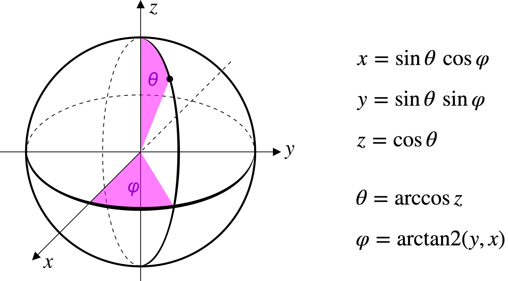

# Prerequisites

For this script will need the **rcosmo** package, which can be downloaded from github via:
```{r,eval=F}
install.packages('devtools')
library(devtools)
install_github("frycast/rcosmo")
```

Then load libraries and set random seed for this chapter:
```{r,message=F}
library(magicaxis)
library(cooltools)
library(png)
library(plotrix)
library(foreach)
library(gsl)
library(rcosmo)
library(reticulate)
library(celestial)
set.seed(1)
```

The final chapter on the CMB uses the Python libraries **numpy** and **healpy**. Please refer to part 1, section 3 for an introduction to **R**'s Python interface. In brief, the **reticulate** package is required to interface with your Python installation. Depending on your system, it might be necessary to specify the location of your Python directory, either via `Sys.setenv(RETICULATE_PYTHON = "...")` as discussed in part 1, or via a `use_python` command; something like this (please adjust to your machine):

```{r}
use_python("/Library/Frameworks/Python.framework/Versions/Current/bin/python3")
```

Next, we need to import the two Python libraries we would like to use:

```{r}
np = import("numpy", convert=FALSE)
hp = import("healpy", convert=FALSE)
```

These import commands only work if the libraries have already been installed. If you struggle installing **healpy**, please refer to https://healpy.readthedocs.io/en/latest/install.html. Without a working Phython and **healpy** installation, you will not be able to compile this document, but you can still run the examples up to the discussion of the CMB.

# Introduction

Many fields of science involve functions defined on a spherical surface. This particularly applies to astrophysics, where all observations are performed on the (imaginary) celestial sphere. Perhaps the most impressive example is the Cosmic Microwave Background (CMB), the ubiquitous nearly isotropic radiation field that truly originates from a spherical surface near the horizon of the observable universe. In the case of the CMB, as well as in many other applications, the concepts of spectral analysis and correlation functions discussed in the previous sections are of utmost importance. Fortunately, the crucial concept of Fourier Transforms (FTs) can be adapted to operate in spherical coordinates, giving rise to the theory of spherical harmonics. Using these special functions, the previously discussed tools of spatial statistics can be expanded to functions on spheres.

Functions defined on a spherical surface can be written as functions of a *polar angle* $\theta\in[0,\pi]$ and an *azimuthal angle* $\varphi\in[0,2\pi)$. Beware that in pure mathematics these two symbols usually have reversed meanings. Also note that the choice of spherical coordinates is not unique. In astronomy, for example, it is common to use the *declination* $\delta=\pi/2-\theta\in[-\pi/2,\pi/2]$ and *right ascension* (equal to azimuth, but the symbol $\alpha$ is more common). In geography, these same coordinates are called *latitude* and *longitude*, respectively. Sometimes the longitude is taken on the interval $(-\pi,\pi]$ rather than $[0,2\pi)$.

For most of this section, we will adhere to the standard coordinates $(\theta,\varphi)$, shown in Fig. \ref{fig:sphcoord}.

<!--The coordinates $(\theta,\varphi)$ are orthogonal coordinates in the sense that the coordinate lines are orthogonal at any crossing point, except at the singular poles ($\theta=0$ and $\theta=\pi$). !-->

```{r sphcoord, echo=FALSE, out.width = '60%', fig.align='center',fig.cap='Standard parameterisation of the unit sphere adopted in this section.'}

```

# Useful visualisation tools

Before expanding on the mathematics and statistics of functions $f(\theta,\varphi)$ defined on a sphere, let us first invest a moment to discuss how such functions can be visualised. As a familiar example, we consider the function $f_{\rm Earth}(\theta,\varphi)$, representing the oceans and land of the Earth. Explicitly, $f_{\rm Earth}(\theta,\varphi)$ is a binary function, equal to 0 for oceans and equal to 1 for land. The angle $\theta$ represents the angle from the North Pole and $\varphi$ represents the longitude, measured eastwards from the Greenwich prime meridian.

The most straightforward graphical representation of any function $f(\theta,\varphi)$ is a regular two-dimensional Cartesian grid, where the horizontal coordinate is identified with $\varphi$ and the vertical coordinate is identified with $\theta$. This scheme is know as *cylindrical projection*.

The following code reads a black-and-white image showing a cylindrical projection of the Earth [Credit: NASA/Goddard Space Flight Center Scientific Visualization Studio]. The image only has one gray channel, which is 0 (black) for oceans and 1 (white) for land. This binary array is then converted into an array of colours with blue for oceans and green for land.

```{r cylindrical,out.width='80%',fig.asp=1/2,fig.align='center',fig.cap='Earth map in cylindrical projection. Every pixel spans 1/3 degree in longitude and 1/3 degree in latitude.'}
# read image of the Earth into a binary array
earth = readPNG('../figures/earth.png')

# convert the array of values into an array of colour strings (from blue to green)
col.earth = c('#0044aa','#00bb00') # dark blue and grass green
img = array(col.earth[earth+1],dim(earth))

# plot colour array
par(mar=c(3,3.2,0.2,3.2))
nplot(c(0,360),c(-90,90),asp=1)
rasterImage(img,0,-90,360,90)
magaxis(side=1:3,labels=c(T,T,F),
        xlab=expression('Azimuthal angle = Longitude'~varphi~'[deg]'),
        ylab=expression('Lattitude'~delta~'[deg]'))
par(usr=c(0,360,180,0))
magaxis(4)
mtext(expression('Polar angle'~theta~'[deg]'),4,2)
```

In such a cylindrical projection of a sphere, each pixel spans exactly the same intervals $\Delta\varphi$ and $\Delta\theta$. In the case of Fig. \ref{fig:cylindrical} they are both equal to exactly 1/3 degree. However, the corresponding surface area $\Delta A$ on the sphere, is *not* constant. It varies with $\theta$ as $\Delta A\approx\Delta\varphi\Delta\theta\sin\theta$ (with an equal sign for infinitesimal intervals). The value of $\sin\theta$ vanishes at the poles, which is why the projection becomes increasingly horizontally stretched towards the bottom and the top.

From the image of Fig. \ref{fig:cylindrical}, stored in the binary array `earth`, we can construct the associated function $f_{\rm Earth}(\theta,\varphi)$. To do so it suffices to convert the two angles into pixel indices and use the array `earth` as a lookup table. This is essentially a nearest neighbour interpolation (see part 2). The following code does this in a vectorized manner:

```{r}
ntheta = dim(earth)[1]
nphi = dim(earth)[2]
fearth = function(theta,phi) {
  itheta = pmax(1,pmin(ntheta,ceiling(theta/pi*ntheta)))
  iphi = pmax(1,pmin(nphi,ceiling(phi/2/pi*nphi)))
  return(earth[itheta+(iphi-1)*ntheta]) # fast one-dimensional indexing
}
```

As a quick check, let us evaluate `fearth` at the location of the city of Perth (116$^\circ$E, 32$^\circ$S, rounded to 1$^\circ$):

```{r}
perth.phi = 116/180*pi # [rad] longitude
perth.lat = -32/180*pi # [rad] latitude
perth.theta = pi/2-perth.lat # convert latitude to polar angle
print(fearth(perth.theta,perth.phi))
```
A value of 1 means that there is indeed land at the location of Perth! Now let us check another point, just one degree ($\pi/180$ radians) westwards in longitude. This point lies in the Indian Ocean, about three times further off the coast than Rottnest Island. Our function does indeed label this point as ocean (value 0):

```{r}
print(fearth(perth.theta,perth.phi-pi/180))
```

The **cooltools** package contains the routine **sphereplot** (not to be confused with an identically named package by A. Robotham). This routine can render a function $f(\theta,\varphi)$ on a spherical surface in an *orthogonal projection*, i.e. as seen when taking a picture of a globe. The **sphereplot** routine has various arguments to control the rendering and viewpoint (see documentation). Our Earth function can be rendered using:

```{r,out.width='30%',fig.align='center',fig.cap='Earth map rendered as a globe. More precisely, this is an orthogonal projection of the sphere onto the plane of the paper/screen.'}
sphereplot(fearth, 300, col=col.earth, phi0=0.1, theta0=pi/3)
```
You can view the Earth from any angle by changing the arguments. For instance, we can centre the projection onto Perth and spin the South Pole to the top via: 

```{r,out.width='30%',fig.align='center',fig.cap='Earth globe centred on Perth with South Pole at the top.'}
sphereplot(fearth, 300, col=col.earth, phi0=perth.phi, theta0=perth.theta, angle=pi)
points(0,0,pch=4,col='yellow',cex=2)
```
It is impossible to preserve all angles, distances and surface areas when projecting a full sphere or parts thereof onto a flat surface. Therefore, many different projections exist, depending on the purpose of the representation. The cylindrical projection of Fig. \ref{fig:cylindrical} is sub-optimal in most regards, but it has the advantage that we can easily read of any value of the function $f(\theta,\varphi)$, using a Cartesian grid. There are dozens of very sophisticated projections, well beyond the scope of what is needed in this section. However, a particular projection worth discussing is the so-called *Mollweide projection*, one of the most commonly used projection that *preserves all areas*. In astrophysics, this projection is often found in all-sky projections.

Formally, the Mollweide projection corresponds to the mapping $(\theta,\varphi)\mapsto(x,y)$, defined by
\begin{equation}\label{eq:mollweide}
\begin{split}
  x &= \frac{2\sqrt{2}}{\pi}\varphi\prime\cos\alpha, \\
  y &= \sqrt{2}\sin\alpha,
\end{split}
\end{equation}
where $\varphi\prime$ is the longitude $\varphi$, recast onto the interval $(-\pi,\pi]$; and $\alpha$ is defined via the implicit equation
$$2\alpha+\sin(2\alpha)=\pi\cos\theta,$$
which can be solved for $\alpha$ using iterative schemes. The corresponding inverse mapping $(x,y)\mapsto(\theta,\varphi)$ is given by
\begin{equation}\label{eq:mollweideinv}
\begin{split}
  \theta &= \arccos\frac{2\alpha+\sin(2\alpha)}{\pi}, \\
  \varphi\prime &= \frac{\pi x}{2\sqrt{2}\cos\alpha},
\end{split}
\end{equation}
where $\alpha=\arcsin(y/\sqrt{2}).$

The Mollweide map resulting from Eqs. (\ref{eq:mollweide}) has an area of $4\pi$, equal to the surface area of the corresponding unit sphere. The $x$-coordinate spans a range of $[-2\sqrt{2},+2\sqrt{2}]$ and the $y$-coordinate has a range of $[-\sqrt{2}, +\sqrt{2}]$, which is half the length of the $x$-range.

In **R**, we can compute the mapping of Eqs. (\ref{eq:mollweide}) using the **mollweide** routine of the **cooltools** package. We will use this routine later when discussing the CMB. In order to simply display our Earth function $f_{\rm Earth}(\theta,\varphi)$ in the Mollweide projection, it suffices to specify the arguement `projection` in the **sphereplot** function:

```{r,out.width='75%',fig.align='center',fig.cap='Earth map in Mollweide projection.'}
sphereplot(fearth,500,col=col.earth,projection='mollweide')
```

Or, centred on Perth with the South Pole up:

```{r,out.width='75%',fig.align='center',fig.cap='Earth map in Mollweide projection.'}
sphereplot(fearth,500,col=col.earth,projection='mollweide',
           phi0=perth.phi, theta0=perth.theta, angle=pi)
points(0,0,pch=4,col='yellow',cex=2)
```

\newpage
# Sampling a sphere

## Pseudo-random uniform sampling

Numerical statistical analyses in relation with spheres frequently require random samples of spherical angles $(\theta,\varphi)$, which *uniformly* sample the sphere. Uniformity here means that the expected surface area of each random point is the same; in particular it is independent of the location on the sphere. Such uniformity *cannot* be achieved by uniformly sampling $\theta\in[0,\pi)$ and $\varphi\in[0,2\pi)$ individually, as shown in this quick example:

```{r nonunif,out.width='90%',fig.align='center',fig.cap='Orthogonal projections of 3,000 pseudo-random points on a sphere, obtained by sampling the two angles uniformly.'}
# draw random angles from uniform intervals
n = 3e3
theta = runif(n,0,pi)
phi = runif(n,0,2*pi)

# convert to Cartesian coordinates
car = data.frame(x=sin(theta)*cos(phi), y=sin(theta)*sin(phi), z=cos(theta))

# plot points
magplot(car,asp=1,pch=16,cex=0.3)
```
Fig. \ref{fig:nonunif} shows that a uniform sampling of the two spherical angles gives rise to a non-isotropic distribution of points on the unit sphere, with clear over-densities at the poles ($x=y=0$, $z=\pm1$). This is because the surface area per unit of $\theta$ decreases towards the poles proportionally to $\sin\theta$. Therefore, a uniform sampling of the sphere requires a sampling of the polar angle $\theta\in[0,\pi)$ with weight $\sin\theta$. The associated quantile function is $\arccos(2p-1)$, meaning that we can draw such random values of $\theta$ by setting $\theta=\arccos(2p-1)$, where $p$ is sampled uniformly from the unit interval $[0,1]$. In other words, $\cos\theta$ is distributed uniformly. (Try to show this as an exercise.)

Let us check this weighing scheme:

```{r unif,out.width='90%',fig.align='center',fig.cap='Orthogonal projections of 3,000 uniform pseudo-random points on a sphere, obtained by sine-weighing the polar angle.'}
# draw random angles using sin(theta)-weighing
n = 3e3
theta = acos(2*runif(n)-1)
phi = runif(n,0,2*pi)

# convert to Cartesian coordinates
car = data.frame(x=sin(theta)*cos(phi), y=sin(theta)*sin(phi), z=cos(theta))

# plot points
magplot(car,asp=1,pch=16,cex=0.3)
```
The random points in Fig. \ref{fig:unif} look indeed uniformly sampled from the unit sphere. You might recall that such an isotropic set of points on a sphere (or inside a spherical shell) can also be generated using **runif3** of the **cooltools** package, but the objective of this example was to give a deeper understanding.

## Quasi-random uniform sampling

The uniform random sampling shown in Fig. \ref{fig:unif} is, properly speaking, a pseudo-random sampling. Pseudo-random numbers are produced by a deterministic algorithm that aims to generate sequences of numbers with statistical properties as close as possible to truly random. In turn, quasi-random numbers are generally less clustered than true random numbers. In part 2, we showed that quasi-random numbers are often more suitable for Monte Carlo (MC) type numerical integration seems, since they lead to faster convergence than pseudo-random numbers. The same logic applies to numerical integrators on a sphere: it is often preferable to have a set of quasi-random points, which sample the sphere uniformly, but with less discrepancy (i.e. less clustering) than pseudo-random numbers. The most prominent algorithm for producing such a quasi-random sequence of angles $(\theta,\varphi)$ is the "Fibonacci algorithm". Several variations of this algorithm can be found in the literature. Here, we restrict our discussion to one of the most basic versions. This algorithm states that, in a sequence of $n$ points on the unit sphere, the $k$-th pair of angles is given by
\begin{equation}
\theta_k=\arccos\left(1-\frac{2k-1}{n}\right),~~~~\varphi_k = \frac{2\pi k}{\phi},
\end{equation}
where $\phi=(1+\sqrt{5})/2$ is the golden ratio. It is implicitly understood that the second equation should be taken modulo $2\pi$, if $\varphi$ is defined on the interval $[0,2\pi)$ (which is the convention we adhere to in this course). Without diving into the mathematics behind the Fibonacci algorithm, you can easily convince yourself that the vales of $\cos\theta_k$ and $\varphi_k$ are sampled quasi-uniformly by this algorithm.

To sample a sphere using the Fibonacci algorithm, you can use the **fibonaccisphere** routine in the **cooltools** package:

```{r fibonacci,out.width='90%',fig.align='center',fig.cap='Orthogonal projections of 3,000 uniform quasi-random points on the unit sphere, generated using the Fibonacci algorithm.'}
car = fibonaccisphere(n)
magplot(car,asp=1,pch=16,cex=0.3)
```

A comparison between Fig. \ref{fig:fibonacci} and Fig. \ref{fig:unif} demonstrates the highly uniform sampling of the unit sphere of the Fibonacci algorithm.

## Numerical integration on a sphere

In many statistical applications and in the remainder of this document, there is a need to compute integrals of the form
\begin{equation}
Q=\int_{S^2} f(\theta,\varphi)\,d\Omega=\int_{\theta=0}^\pi\int_{\varphi=0}^{2\pi}f(\theta,\varphi)\sin\theta\,d\theta\,d\varphi.
\end{equation}
The numerical evaluation of such spherical integrals can be tricky, especially if the integrand has a lot of structure and/or is not sufficiently differentiable, as in the case of our Earth function. In particular, the routine **integral2** (**pracma** package) is prone to large systematic errors and the **cubintegrate** function (**cubature** package) can take an excessive amount of time. A safe and fast way to compute $Q$ is to employ a MC integration. As discussed in part 2, the accuracy and convergence of MC integration can normally be improved by using quasi-random points rather than pseudo-random ones. This is where the Fibonacci algorithm discussed a above  comes in handy: we can approximate
\begin{equation}
Q\approx\frac{4\pi}{n}\sum_{k=1}^n f(\theta_k,\varphi_k),
\end{equation}
where $\theta_k$ and $\varphi_k$ are coordinates of the $n$ Fibonacci points. The higher $n$, the better the approximation (in a statistical sense, not in a strict one). In fact, following the discussion in part 2, we expect the error of two-dimensional QMC integration to scale proportionally to $\log(n)^2/n$. In turn, the error of standard MC integration is expected to decrease more slowly as $1/\sqrt{n}$. Let us check this for the particular function
$$f(\theta,\varphi)=\sin\big(\theta^\varphi+\varphi^2\big),$$
which integrates to $Q\approx1.429492$ (precomputed solution), but makes many standard integrators struggle. The following code evaluates $Q$ using MC and QMC integration and computes the absolute numerical error as a function of the number of evaluations $n$:

```{r qmc,out.width='80%',fig.align='center',fig.cap='Numerical error of computing an integral on a sphere using MC (blue) and QMC (purple) integration. The absolute errors (thin lines) statistically decrease with the number of evaluation points, following the theoretically expected trends (thick lines).'}
# make function to integrate
f = function(theta,phi) sin(theta^phi+phi^2)

# make a list of values n to check the integrators
n = round(exp(seq(4.1,15,by=0.2)))

# evaluate error of MC integrator
err.mc = foreach(i=1:length(n),.combine='c') %do% {
  theta=acos(runif(n[i],-1,1))
  phi=runif(n[i],0,2*pi)
  abs(sum(f(theta,phi))*4*pi/n[i]-1.429492)
}

# evaluate error of QMC integrator
err.qmc = foreach(i=1:length(n),.combine='c') %do% {
  pts = fibonaccisphere(n=n[i],out.sph=T)
  abs(sum(f(pts[,'theta'],pts[,'phi']))*4*pi/n[i]-1.429492)
}

# plot numerical error and expected scaling
magplot(n,err.qmc,log='xy',type='l',col='purple',
        xlab='Number of function evaluations',ylab='Absolute numerical error')
lines(n,err.mc,col='blue')
curve(2*log(x)^2/x,add=T,lwd=3,col='purple')
curve(5/sqrt(x),add=T,lwd=3,col='blue')
```

Fig. \ref{fig:qmc} shows that the QMC integrator based on Fibonnaci points performs better than the native MC integrator. Both follow the theoretical expectation (thick lines), up to an arbitrary normalisation factor.

\newpage
# Vector space of spherical functions

## Inner product

The set of real functions on the sphere $f:S^2\rightarrow\mathbb{R}$ and its complex analogue $f:S^2\rightarrow\mathbb{C}$ can be considered as vector spaces, if equipped with the standard scalar product
\begin{equation}
\langle f,g\rangle=\int_{S^2} f(\theta,\varphi)\,g^\ast(\theta,\varphi)\,d\Omega=\int_{\theta=0}^\pi\int_{\varphi=0}^{2\pi}f(\theta,\varphi)\,g^\ast(\theta,\varphi)\,\sin\theta\,d\theta\,d\varphi.
\end{equation}
Following on from the previous paragraph, a robust way to evaluate such integrals is the use of
$$\langle f,g\rangle\approx\frac{4\pi}{n}\sum_{k=1}^n f(\theta_k,\varphi_k)\,g^\ast(\theta_k,\varphi_k),$$
where $\theta_k$ and $\varphi_k$ are coordinates of the $n$ Fibonacci points. The integration error is expected to scale as $\log(n)^2/n$ (see Fig. \ref{fig:qmc}).

## Basis of spherical harmonics

The most commonly used non-local basis for functions $f:S^2\rightarrow\mathbb{C}$ are the so-called *spherical harmonics*, a set of harmonic functions $Y_l^m(\theta,\varphi)$, indexed by the *degree* $\ell=0,1,...$ and the *order* $m=-\ell,-\ell+1,...,0,...,\ell-1,\ell$. There is some freedom in the way these functions are defined. One of the most common forms are the complex-valued spherical harmonics $Y_\ell^m:S^2\rightarrow\mathbb{C}$ with "Condon-Shortley" phase convention, defined as
\begin{equation}
Y_\ell^m(\theta,\varphi) = \sqrt{\frac{(2\ell+1)}{4\pi}\frac{(\ell-m)!}{(\ell+m)!}}\,P_\ell^m(\cos\theta)\,e^{im\varphi},
\end{equation}
where $P_\ell^m(x)$ are the *Associated Legendre Polynomials*,
\begin{equation}
P_\ell^m(x)=(-1)^m\cdot2^\ell\cdot(1-x^2)^{m/2}\cdot\sum_{k=m}^\ell\frac{k!}{(k-m)!}\cdot x^{k-m}\cdot\binom{\ell}{k}\binom{(\ell+k-1)/2}{\ell}.
\end{equation}

The spherical harmonics $\{Y_\ell^m(\theta,\varphi)\}$ are *orthonormal*, meaning that they are *orthogonal*, i.e. the scalar product of two different spherical harmonics vanishes, and *normal*, i.e. the scalar product of a spherical harmonic with itself is one. These orthonormality relations can be summarized in the compact notation
$$\langle Y_\ell^m,Y_{\ell'}^{m'}\rangle=\delta_{\ell\ell'}\delta_{mm'},$$
where $\delta_{ij}$ is the Kronecker delta.

The spherical harmonics constitute a basis of the function $f:S^2\rightarrow\mathbb{C}$, meaning that each such function can be represented as a *unique linear superposition* of spherical harmonics,
\begin{equation}\label{eq:sphift}
f(\theta,\varphi)=\sum_{\ell=0}^\infty\sum_{m=-\ell}^{\ell}a_\ell^m Y_\ell^m(\theta,\varphi),
\end{equation}
with complex coefficients $a_\ell^m$. Explicit expression for these coefficients follow directly from the orthonormalisation relations:
\begin{equation}\label{eq:sphft}
a_\ell^m=\langle f,Y_\ell^m\rangle.
\end{equation}
Equations (\ref{eq:sphft}) and (\ref{eq:sphift}) are the analogues of the Fourier Transform and Inverse Fourier Transform, respectively, for functions on a spherical surface. Like with standard FTs, there is a *reality condition*: $f(\theta,\varphi)$ is a real function, if and only if
\begin{equation}\label{eq:reality}
a_\ell^{-m}=(-1)^{m} (a_\ell^m)^\ast.
\end{equation}
When dealing with real functions $f:S^2\rightarrow\mathbb{R}$ the complex spherical harmonics are somewhat of an overkill, since complex functions $\{Y_\ell^m(\theta,\varphi)\}$ have to be superposed with specially behaved complex coefficients $a_\ell^m$ (satisfying eq. (\ref{eq:reality})) to make the imaginary parts of $f$ vanish. For real functions $f$ it is therefore easier to perform a change of basis, such that the basis functions themselves become real. This gives rise to the *real* spherical harmonics,
\begin{equation}
Y_{\ell m} = (-1)^m\sqrt{\frac{2\ell+1}{4\pi}\frac{(\ell-|m|)!}{(\ell+|m|)!}}~P_\ell^{|m|}(\cos \theta)\times
\begin{cases}
  \sqrt{2} \sin( |m|\varphi ) &\mbox{if}~m<0 \\
 1 & \mbox{if}~m=0 \\
 \displaystyle \sqrt{2} \cos(m\varphi) & \mbox{if}~m>0\,.
\end{cases}
\end{equation}
Note that lower case indices, $Y_{\ell m}$, are used for these real spherical harmonics to distinguish them from their complex siblings $Y_\ell^m$.

The real spherical harmonics satisfy the same properties as the complex ones; in particular, they satisfy the same orthonormalisation relations and they still constitute a basis of all functions $f:S^2\rightarrow\mathbb{C}$. The only difference is that, for real functions $f(\theta,\varphi)$, the coefficients $a_{\ell m}=\langle f,Y_{\ell m}\rangle$ are real, too. Explicit analytical expressions for the first real spherical harmonics can be found at https://en.wikipedia.org/wiki/Table_of_spherical_harmonics#Spherical_harmonics.

In **R**, spherical harmonics can be called using the **sphericalharmonics** function contained in the **cooltools** package. The argument `basis` can be set to `complex` or `real` (default) to swap between the two conventions discussed above. As an illustration, let us plot the first few real spherical harmonics up to degree three:

```{r sphharm,out.width='100%',fig.align='center',fig.cap='Spherical harmonic basis functions in real convention up to third degree.'}
colorscale = planckcolors(200)
par(cex=0.7)
nplot(xlim=c(-4,4.6),ylim=c(0,4),asp=1,mar=c(0,0,0,0))

for (l in seq(0,3)) { # degree of spherical harmonic
  for (m in seq(-l,l)) { # order of spherical harmonic

    # make spherical harmonic function in real-valued convention
    f = function(theta,phi) sphericalharmonics(l,m,cbind(theta,phi))

    # plot spherical harmonic
    sphereplot(f, 50, col=colorscale, phi0=0.1, theta0=pi/3, add=TRUE,
               clim=c(-0.7,0.7), center=c(m,3.5-l), radius=0.47, show.grid=TRUE)

    # add m-labels
    if (l==3) text(m,-0.15,sprintf('m=%+d',m))
  }

  # add l-labels
  text(-l-0.55,3.5-l,sprintf('l=%d',l),pos=2)
}

colorbar(3.9,0.03,4.1,3.97,colorscale,clim=c(-0.7,0.7),lwd=0.5)
```

The colour scale of Fig. \ref{fig:sphharm} shows positive regions in red and negative ones in blue. Apart from the *monopole* ($\ell=0$), all real spherical harmonics obey some type of anti-symmetry that gives them equal positive and negative mass. Hence,
$$\int_{s^2} Y_{\ell m}\ d\Omega=0~~{\rm if}~~\ell>0.$$
This is, in fact, the only way all these functions can have a vanishing scalar product with the constant positive monopole $Y_{00}=1/\sqrt{4\pi}$.

### Remark on the dipole

The three dipole functions $Y_{\ell=1,m}$ (see second row in Fig. \ref{fig:sphharm}) are special in that each of them can be associated with one particular orthogonal direction in the three-dimensional space:

* $m=-1$ points along the $y$-axis ($\theta=\varphi=\pi/2$),
* $m=0$ points along the $z$-axis ($\theta=0$),
* $m=+1$ points along the $x$-axis ($\theta=\pi/2$, $\varphi=0$). 

Dipole functions $Y_{D}(\theta,\varphi)$ pointing into any other direction, specified by a unit vector $\mathbf{n}$ can thus be formed via
\begin{equation}
Y_{D}=n_x Y_{1,1}+n_y Y_{1,-1}+n_z Y_{1,0}\,.
\end{equation}
Ported to spherical coordinates, the dipole pointing into the direction $(\theta_0,\varphi_0)$ is given by
\begin{equation}
Y_{D}=\cos\theta_0\,Y_{1,0}+\sin\theta_0\,(\cos\varphi_0\,Y_{1,1}+\sin\varphi_0\,Y_{1,-1})\,.
\end{equation}
For instance, let us construct and visualise a dipole pointing into the direction specified by the geographical coordinates of Perth:
```{r dipole,out.width='90%',fig.align='center',fig.cap='Example of a contrived dipole pointing into the direction of Perth.'}
# construct dipole
Y1 = function(m,theta,phi) sphericalharmonics(1,m,cbind(theta,phi))
Yd = function(theta,phi) cos(perth.theta)*Y1(0,theta,phi)+
  sin(perth.theta)*(cos(perth.phi)*Y1(1,theta,phi)+sin(perth.phi)*Y1(-1,theta,phi))

# visualise dipole
fplot = function(theta,phi) Yd(theta,phi)*(1+fearth(theta,phi))
nplot(c(0,3),c(0,1),asp=1)
for (i in seq(3)) {
  sphereplot(fplot, 200, col=colorscale, phi0=(i-1.2)*2*pi/3, theta0=2, show.grid=TRUE,
             add=TRUE, center=c(i-0.5,0.5), radius=0.47)
}
```

The dipole shown in this figure (Fig. \ref{fig:dipole}) shows a maximum (deep red colour) around Perth. We can check the precise location of this maximum:

```{r}
# find spherical coordinates in that maximise the dipole:
xm = optim(c(1,1),function(x) Yd(x[1],x[2]),control=list(fnscale=-1,reltol=1e-12))$par

# convert into geographical coordinates
lat = (pi/2-xm[1])/pi*180 # latitude of mode in degrees
lon = xm[2]/pi*180 # longitude of mode in degrees
cat(sprintf('Mode of the diople lies at (lat=%.1f deg, lon=%.1f deg)\n',lat,lon))
```

The dipole does indeed point precisely towards our (rounded) coordinates of Perth, defined earlier in this section.

## Finite spherical harmonic expansion

We have so far established that any real/complex function defined on a sphere can be expressed as a linear superposition of spherical harmonics with a unique set of coefficients $a_{lm}$ (or $a_l^m$ for complex basis functions). Most continuous functions $f(\theta,\varphi)$ require infinitely many coefficients to for an *exact* representation in terms of spherical harmonics. However, just like in the case of image compression in flat 2D space (see part 6, section 1), we can obtain *approximations* of $f$ using only a limited number of spherical harmonics. Generally, the more spherical harmonics, the better the approximation.

In principle, we could sort the spherical harmonics by their respective magnitudes $|a_{lm}|$ and reject all those harmonics whose contribution lies below a certain threshold, just like we did for the jpeg-style image compression. But here we take a more straightforward approach and simply approximate a function $f(\theta,\varphi)$ using all spherical harmonics up to a fixed degree $l$. This way is sub-optimal in terms of compression ratio, but it allows us to see how the approximation changes with the maximum degree.

The function we choose to expand is our Earth function $f_{\rm Earth}(\theta,\varphi)$, and we consider its first $31^2=961$ coefficients $a_{lm}=\langle f_{\rm Earth},Y_{lm}\rangle$ up to $l=30$. We compute these coefficients via QMC integration on a sphere, discussed a bit earlier. So how many Fibonacci points are necessary for a sufficient approximation of the coefficients $a_{lm}$? To answer this question, we can reason that in a sequence of $n$ Fibonacci points, each point occupies a solid angle of $\sim 4\pi/n$ and thus the average angle between any two neighbouring points is $\sim\sqrt{4\pi/n}$. In turn, spherical harmonics of degree $l$ have a characteristic wavelength of $2\pi/l$ and therefore require a sampling with a maximum spacing of $\pi/l$ (as per Nyquist theorem). It thus follows that the minimal number $n$ is given by $\sqrt{4\pi/n}\approx\pi/l$, which solves to $n\approx4l^2/\pi\approx l^2$. This minimum value presumes that the function $f(\theta,\varphi)$ to be expanded into spherical harmonics is smooth on scales $\gtrsim\pi/l$, which is not generally true. Therefore, it is normally advisable to over-sample the integrand by using $n=10l^2$ points as a safe figure.

Let us then compute the coefficients $a_{lm}$ of the Earth function:

```{r}
# initialisation
ltop = 30 # maximum degree, up to which the coefficients a_lm are computed
n = 10*ltop^2 # number of Fibonacci points to be used
pts = fibonaccisphere(n, out.sph=TRUE) # generate Fibonacci points
feval = fearth(pts[,'theta'], pts[,'phi']) # values of fearth at Fibonacci points

# compute scalar products using QMC integration
a = rep(NA,(ltop+1)^2)
k = 0
for (l in seq(0,ltop)) {
  for (m in seq(-l,l)) {
    k = k+1
    Y = sphericalharmonics(l,m,x=cbind(pts[,'theta'], pts[,'phi']))
    a[k] = sum(Y*feval)*4*pi/n
  }
}
```

Given these coefficients $a_{\ell m}$, we can compute the approximation functions up to a fixed degree $\ell_{\rm max}$. To do so, it suffices to add up all the functions $a_{lm}Y_{lm}(\theta,\varphi)$, up to $\ell=\ell_{\rm max}$:

```{r}
fapprox = function(theta,phi,lmax) {
  out = rep(0,length(theta))
  k = 0
  for (l in seq(0,lmax)) {
    for (m in seq(-l,l)) {
      k = k+1
      out = out+a[k]*sphericalharmonics(l,m,x=cbind(theta,phi))
    }
  }
  return(out)
}
```

Let us now plot the result for $\ell_{\rm max}=0,3,10,30$:

```{r earthexpansion,out.width='80%',fig.align='center',fig.cap='Harmonic expansions of the Earth globe.'}
col = colorRampPalette(col.earth)(256)
nplot(c(-0.12,4),asp=1)
for (i in seq(4)) {
  lmax = c(0,3,10,30)[i]
  sphereplot(fapprox,50,col=col,add=T,center=c(i-0.5,0.5),radius=0.47,lmax=lmax)
  text(i-0.5,-0.09,substitute(l[max]==lmax, list(lmax=lmax)))
}
```
At $\ell_{\rm max}=10$, we start recognizing large continents, and at $l_{\rm max}=30$, we already get a relatively good image of the planet. Importantly, the amount of detail that is resolved is identical anywhere on the sphere. In particular, if we were to choose different spherical coordinates, say with a pole in Perth, the four expansions of Fig. \ref{fig:earthexpansion} would look identical. This is just a consequence of the fact that the spherical harmonics completely cover all harmonics functions, no matter how oriented, of a given degree.

## Connection to two-point correlation

The connection between correlation functions and spectra in Euclidean space (discussed in part 6, section 2) has an analogue in spherical space. In particular, the two-point correlation function on a sphere can be expressed as a Fourier Transform (FT) of the power spectrum of spherical harmonics. Rather than diving into the equation-loaded mathematics of this connection, which is indeed quite similar to that discussed in section 2, let us here illustrate this connection using a concrete example.

To get going, we first construct a contrived point set on a sphere, which is random, except for an excess of two-point correlation on a fixed scale. Our basic building blocks for such a point set is an equilateral triangle on the unit sphere, whose points are separated by an angle $\alpha_0=\pi/5=36^\circ$. (We could have picked another value.) You can convince yourself that the following code produces Cartesian coordinates of such a triangle:

```{r}
alpha0 = pi/5 # angle between the corners of the equilateral triangle
p1 = c(1,0,0) # coordinates of the 1st point
p2 = c(cos(alpha0),sin(alpha0),0) # 2nd point
xy = cos(alpha0)/cos(alpha0/2) # value of sin(theta) of p3
p3 = c(xy*cos(alpha0/2),xy*sin(alpha0/2),sqrt(1-xy^2)) # 3rd point 
triangle = rbind(p1,p2,p3) # array of triangle coordinates
```

Let us plot this triangle in some arbitrary projection:

```{r,out.width='50%',fig.align='center'}
R = rotation3(c(0.3,0.9,0)) # custom rotation matrix
tri = triangle%*%R # rotate corners
f = cbind(seq(50)/50)
p = rbind((1-f)%*%p1+f%*%p2,(1-f)%*%p2+f%*%p3,(1-f)%*%p3+f%*%p1)
p = unitvector(p)%*%R # polygon coordinates
sphereplot(NULL,theta0=1.2,phi0=0.2)
segments(c(0,0,0),c(0,0,0),tri[,1],tri[,2],col='blue')
polygon(p[,1:2],col='#0000ffaa',border='blue')
points(tri[,1:2],pch=16,col='blue')
text(0.36,0.16,expression(alpha ['0']),col='blue',pos=3)
```

We then generate a set of 300 points, consisting of 100 randomly placed copies of this base triangle:

```{r}
set.seed(1)
ntriangles = 100
n = 3*ntriangles # number of points
pts = data.frame(x=rep(NA,n), y=rep(NA,n), z=rep(NA,n))
for (i in seq(1,n,by=3)) {
  eu = runif3(1,r=1)
  Rx = rotation3(c(1,0,0),runif(1,0,2*pi)) # random rotation matrix around x-axis
  Ru = rotation3(c(0,eu[,'x'],-eu[,'y']),acos(eu[,'z'])) # reorientation of x-axis along eu
  pts[i:(i+2),] = triangle%*%Rx%*%Ru
}
```

The Cartesian coordinates of the points are stored in the array `pts`. Here is what this point set looks like:

```{r,out.width='50%',fig.align='center'}
theta = acos(pts$z)
phi = atan2(pts$y,pts$x)
sphereplot(cbind(theta,phi),pt.pch=16,pt.col='blue',theta0=1.2,phi0=0.2)
```
Visually, it is neigh impossible to make out the equilateral triangles in this random point set. However, this set has excessive two-point correlation at an angular separation of $\alpha_0$. We can compute the correlation function directly by plotting the histogram of all the distances, for instance using the Landy-Szalay estimator:

```{r,out.width='80%',fig.align='center'}
set.seed(1)
ls = landyszalay(pts,runif3(1e3,1),0.061)
ls$angle = 2*asin(pmin(1,ls$r/2)) # convert Eucledian distances to angles
magplot(ls$angle,ls$xi,type='l',col='blue',lwd=1.5,
        xlim=c(0,3),ylim=c(-0.2,0.5),
        xlab=expression('Angular separation'~alpha~'[rad]'),
        ylab=expression('Two-point correlation'~xi*'('*alpha*')'))
abline(h=0,v=alpha0,lty=2)
```

Note that we converted the Euclidean distance $r$ between two points, placed on the surface of the unit sphere, to their angular separation $\alpha=2\arcsin(r/2)$. Statistical noise aside, the two-point correlation function $\xi(\alpha)$ vanishes identically, with the exception of two positive peaks at $\alpha=0$ and $\alpha=\alpha_0$. The first peak is the trivial peak, corresponding to the correlation between points with themselves, whereas the second one reveals the additional correlation due to the hidden triangles in the point set. Both of these peaks actually diverge to $\infty$ as the bin widths tend to zero.

While computing the mutual distances between $N=300$ points is a quick task for any modern CPU, the computing time of this algorithm scales as $N^2$, making it unusable for a large number of points (e.g. $\sim1.3\cdot 10^7$ points in the CMB example below). A powerful alternative method is to compute the *spherical power spectrum*,
\begin{equation}
C_\ell=\frac{1}{2\ell+1}\sum_{m=-\ell}^{+\ell}|a_\ell^m|^2=\frac{1}{2\ell+1}\sum_{m=-\ell}^{+\ell}a_{\ell m}^2,
\end{equation}
which is the analogue of the isotropic power spectrum $P(k)$ in Eucledian space. Due to the finite surface of the sphere, the spherical power spectrum is necessarily a discrete function (of the index $\ell$) rather than a continuous one. Similarly to Eq. (5) of section 2, the spherical two-point function can be expressed as a function of $C_\ell$, and vice versa, using
\begin{equation}\label{eq:nnfft}
\langle n(\mathbf{x})n(\mathbf{x}+\mathbf{r})\rangle=\sum_{\ell=0}^\infty \frac{2\ell+1}{4\pi}\,C_\ell\,P_\ell(\cos\alpha),
\end{equation}
where $P_\ell(x)$ are the Legendre polynomials,
\begin{equation}
P_\ell(x) = 2^{-\ell} \sum_{k=0}^\ell \binom{\ell}{k}^2 (x-1)^{\ell-k}(x+1)^k.
\end{equation}
The function $n(\mathbf{x})$ in eq. (\ref{eq:nnfft}) is the number density of points (per unit solid angle) anywhere on the sphere; and $\mathbf{r}$ denotes a vector pointing to another point on the sphere, separated by an angle $\alpha$. The expectation averages over all point pairs on the sphere, separated by $\alpha$. Just like in the Eucledian case (see section 2, eq. 2), the correlation function $\langle n(\mathbf{x})n(\mathbf{x}+\mathbf{r})\rangle$ is related to the standard two-point correlation of the density contrast $\delta(\mathbf{x})$, via
\begin{equation}\label{eq:xift}
\xi(\alpha)\equiv\langle\delta(\mathbf{x})\delta(\mathbf{x}+\mathbf{r})\rangle=\frac{\langle n(\mathbf{x})n(\mathbf{x}+\mathbf{r})\rangle}{\bar n^2}-1=\frac{4\pi}{N^2}\sum_{\ell=1}^\infty (2\ell+1)\,C_\ell\,P_\ell(\cos\alpha).
\end{equation}
Note that there is no $-1$ term in right-most term, because we have accounted for this by removing the monopole ($\ell=0$) from the sum.

Since it is impossible to compute the infinite set of values $C_\ell$, we have to limit the power spectrum to a maximum degree $\ell_{\rm max}$. Computing all powers $C_\ell$ up to $\ell_{\rm max}$ requires computing exactly $\ell_{\rm max}^2$ real coefficients $a_{\ell m}$. Alternatively, we can choose to compute the power based on the complex coefficients $a_\ell^m$, in which case we can restrict the computation to orders $m\geq0$ by virtue of the conjugation relation (eq. \ref{eq:reality}). Let us compute the powers in this way up to degree $\ell_{\rm max}=50$:

```{r,out.width='80%',fig.align='center'}
lmax = 50 # maximum degree, up to which the power spectrum is computed

# compute power spectrum (without monopole)
C = rep(NA,lmax)
for (l in seq(lmax)) {
  a = foreach(m=0:l,.combine='c') %do% sum(sphericalharmonics(l,m,pts,basis='complex'))
  C[l] = sum(abs(a)^2*c(1,rep(2,l)))/(2*l+1)
}

# plot power spectrum
magplot(seq(lmax),C,type='l',ylim=c(0,50),
        xlab='Spherical harmonic degree l',ylab=expression('Power spectrum C' ['l']))
curve(n/(4*pi)+10*cos(alpha0*x),add=T,col='grey')
```

Some numerical noise aside, this spherical power spectrum shows an oscillating behaviour, which is quite well mimicked by a scaled function $\cos(\alpha_0\ell)$ shown by the grey line. This is no accident. It hints at the presence of a strong auto-correlation at $\alpha=\alpha_0$. Note that the expected power spectrum is not precisely a cosine function, because of the Legendre polynomials, which somewhat complicate the relation between $C_\ell$ and $\xi(\alpha)$ in the spherical case.

To recover $\xi(\alpha)$, we must now compute equation (\ref{eq:xift}), for a range of values of $\alpha$. To decide on the actual values for $\alpha$, we recall that the wavelength of a spherical harmonic of degree $\ell$ is $2\pi/\ell$ and hence the shortest angular wavelength we must consider is $\Delta\alpha=2\pi/\ell_{\rm max}$. The natural grid for $\alpha$ is thus given by the values $\alpha=k\Delta\alpha$ with $k=0,1,...,{\rm floor}([\ell_{\rm max}-1]/2)$. The maximum value of $k$ corresponds to the maximum value of $\alpha$ smaller than $\pi$, since any angle $\alpha\geq\pi$ is redundant as it can be associated with a counter angle $2\pi-\alpha$. Equation (\ref{eq:xift}) includes the Legendre polynomials, which can be computed using the routine **legendre_Pl** of the **gsl** package. To make use of fast vector computation, we must evaluate all the Legendre polynomials of the same degree $\ell$ at once when evaluating equation (\ref{eq:xift}) for different $\alpha$. So let us build a function to evaluate $\xi(\alpha)$ (without the trivial point $\alpha=0$), given a vector of powers $C_\ell$ (without the monopole $\ell=0$):

```{r}
spherical_2pc = function(C, alpha_max=NULL) {
  
  # make grid for alpha
  lmax = length(C)
  dalpha = 2*pi/lmax
  if (is.null(alpha_max)) {
    alpha = seq(1,floor((lmax-1)/2))*dalpha
  } else {
    alpha = seq(dalpha,alpha_max,by=dalpha)
  }
  
  # evaluate xi(alpha)
  xi = rep(0,length(alpha))
  for (l in seq(lmax)) {
    xi = xi+(2*l+1)*C[l]*legendre_Pl(l,cos(alpha))
  }
  xi = 4*pi/(n^2)*xi
  
  # return result as data frame
  return(data.frame(alpha=alpha, xi=xi))
  
}
```

Let us now use this function to plot the angular two-point correlation of our contrived point set:

```{r,out.width='80%',fig.align='center'}
f = spherical_2pc(C)
magplot(f$alpha,f$xi,type='l',col='blue',lwd=1.5,
        xlim=c(0,3),ylim=c(-0.2,0.5),
        xlab=expression('Angular separation'~alpha~'[rad]'),
        ylab=expression('Two-point correlation'~xi*'('*alpha*')'))
abline(h=0,v=alpha0,lty=2)
```

We can clearly recognise the peak at $\alpha=\alpha_0$ in the angular two-point correlation function computed from the spherical power spectrum. The correlation function does not exactly match up with the one computed using the Landy-Szalay estimator. The reason for this is that we used a slightly different binning (regular in $r$ in the first case, regular in $\alpha$ in the second) and we truncated the modes to $\ell_{\rm max}$.

This example demonstrates the power of spherical harmonics for studying statistical correlations of functions and point sets defined on a spherical surface.

\newpage
# Cosmic Microwave Background

We now have the statistical gear in place to address the most pivotal sources of empirical information in cosmology, the Cosmic Microwave Background (CMB) radiation, emitted shortly ($\sim380,000\rm\,yr$) after the Big Bang. This radiation is ubiquitous in the universe and its electromagnetic spectrum matches that of a *perfect* black body with a temperature of $T=2.7255\pm0.0006\,K$. While the CMB is nearly isotropic, its temperature exhibits tiny variations on the order of $10^{-4}K$ between different directions. These minute anisotropies carry an enormous amount of information on the fundamental physics of the universe, mainly in its early phase, but late-time anisotropies can be seen, too. There is also a more significant dipole anisotropy, which is generally attributed to our motion relative to the CMB frame. Typical CMB temperature anisotropy maps show the CMB temperature after subtracting the monopole (mean temperature) and the dipole (our motion).

This chapter does not discuss all the exciting physics of the CMB. We will focus only on the statistical analysis of the CMB anisotropy map, which can be thought of as a function $f(\theta,\varphi)$, just like those discussed before. For those passionate about the physics uncovered by our analysis, I would recommend this article by Rita Tojeiro: https://www.roe.ac.uk/ifa/postgrad/pedagogy/2006_tojeiro.pdf.

## Handing CMB temperature maps

<!--# download map via downloadCMBMap(foreground="commander", nside=1024, fn) !-->

In professional research, the CMB temperature anisotropy data, that is the function $T(\theta,\varphi)$, is discretised using the "Hierarchical Equal Area isoLatitude Pixelisation" (HEALPix) scheme (see https://iopscience.iop.org/article/10.1086/427976/pdf). This is a useful scheme for distributing points "evenly" on a sphere, similarly to the quasi-uniform spacing of the Fibonacci point set. Unlike the Fibonacci set, however, the HEALPix set ascribes exactly identical areas (solid angles) to each point and the scheme is hierarchical, meaning that higher resolution grids can be obtained by successively subdividing the cells of a lower resolution grid. The particular HEALPix scheme used in cosmology is the "H=4, K=3" scheme, which starts with 12 equal-area patches on a sphere that are then subdivided successively into $2\times2$, $4\times4$, $8\times8$, etc. pixels. Generally, this leads to sets of $N=12N_{\rm side}^2$ points, with $N_{\rm side}$ being a power of two. The high-resolution CMB maps from the Planck satellite, the current state-of-the-art source, use HEALPix sets with $N_{\rm side}=2^{11}=2,048$, thus $N\approx5\cdot10^7$ points. Lower resolution maps are available, too. These data, as well as many other data, can be found at https://irsa.ipac.caltech.edu/data/Planck.

We here work with the reduced resolution data with $N_{\rm side}=2^9=1,024$, i.e. $N\approx1.3\cdot10^7$, to keep this markdown reasonably fast and memory-lean. This will come a the price of smoothing out high frequency power in the anisotropy data, but this has no qualitative impact on our discussion. The HEALPix data is stored in a standard fits-file, which we could read using **Rfits_read_table**, as discussed in part 1, section 2, but the routine **CMBDataFrame** of the **rcosmo** package allows even faster access to the subset of temperature intensity data. The following code reads the CMB temperature fluctuation data into a one-dimensional vector:

```{r,message=F}
nside = 1024 # change this to 2048 for high-res analysis
fn = sprintf('../data/cmb/maps/CMB_map_commander_%d.fits',nside)
cmb = CMBDataFrame(fn)$I
```

The first thing we can do with these data is to plot the histogram of temperature fluctuations:

```{r cmbgrf,out.width='80%',fig.align='center',fig.cap='Histogram of CMB temperature anisotropies in excess of the monopole+dipole component.'}
nplot(xlim=c(-5e-4,5e-4),ylim=c(0,4.1e3),bty='o',
        xlab='Temperature fluctuation [K]',ylab='Probability density')
hist(cmb,100,freq=F,border=NA,col='grey',add=T)
curve(dnorm(x,sd=1.018e-4),add=T)
magaxis(1)
```

It is impressive to see how close this distribution is to a normal distribution. For your reference, the solid line shows a normal distribution with $\sigma=1.018\cdot10^{-4}\rm\,K$. This demonstrates that the CMB is a GRF, as one would expect for *random* fluctuations around a thermal equilibrium (see CL theorem).

The next step is to look out for spatial correlations in the temperature fluctuations. To do so, we first need to generate the coordinates $(\theta,\varphi)$ associated with the temperature values stored in the vector `cmb`. In other words, we need to generate the spherical coordinates of the HEALPix point set. This can be done using the **pix2coords** routine of the **rcosmo** package:

```{r}
coord = pix2coords(nside, coords='spherical', ordering='nested')
```

Given the coordinates and temperature values of all the pixels, we can now plot the CMB. The following code produces a Mollweide projection with the standard Planck colour scheme:

```{r cmb,out.width='90%',fig.align='center',fig.cap='Mollweide Projection of CMB temperature anisotropies.'}
# define color scale
dTmax = 3e-4 # maximum temperature fluctuation value of color scale
col = planckcolors(500) # color scale

# grid data in Mollweide projection
mol = mollweide(lon=-coord$phi,lat=pi/2-coord$theta) # -phi as we are inside sphere
g = griddata(mol, w=cmb, n=c(800,400))
gc = griddata(mol, n=c(800,400))
dT = lim(g$field/gc$field,-dTmax,dTmax) # average temperature fluctuation

# plot CMB anisotropies
nplot(xlim=c(-3,3.8),ylim=c(-1.5,1.5),asp=1)
magimage(g$grid[[1]]$mid,g$grid[[2]]$mid,dT,zlim=c(-dTmax,dTmax),col=col,magmap=FALSE,add=TRUE)
draw.ellipse(0,0,2*sqrt(2),sqrt(2))
colorbar(3.2,-sqrt(2),3.4,sqrt(2),col=col,clim=c(-300,300),lwd=1,
         text=expression('Excess temperature ['*mu*'K]'),line=4)
```

## CMB power spectrum

We now would like to compute the power spectrum of the CMB. Standard Planck analyses typically go to degree $\ell=2,508$, but we here restrict the analysis to a maximum degree of $\ell=1,500$, which is more appropriate for the reduced resolution map.

The power values $C_\ell$ can be computed using straightforward summations of all HEALPix values:

```{r}
power = function(l=0) {
  dOmega=4*pi/length(cmb) # solid angle per HEALPix point
  a = rep(NA,l+1)
  for (m in seq(0,l)) {
    a[m+1] = sum(as.vector(sphericalharmonics(l,m,coord,basis='complex')*cmb))*dOmega
  }
  C = sum(abs(a)^2*c(1,rep(2,l)))/(2*l+1)
  return(C)
}
```

For example, the quadruple power ($C_2$) is:

```{r}
dt = system.time(C2 <- power(2))
cat(sprintf('Value of the quadrupole power = %.5e\n',C2))
cat(sprintf('Wall-time to compute the quadrupole power = %.2fs\n',dt[3]))
```

On my machine, this takes about `r round(dt[3])`s to compute. This is way too long for our purpose, because the computation time of each power $C_\ell$ increases quickly with increasing degree $\ell$, because the number of spherical harmonics increases as $2\ell+1$ and individual harmonics become harder to compute as $\ell$ increases. Using our `power` function to compute all powers from $\ell=0$ to $\ell=1,500$ would take roughly $10^6\rm\,s$ (1-2 weeks).

A much more efficient routine to compute the power spectrum of HEALPix data is implemented in the **anafast** routine of the **healpy** package (see healpy documentation for details). Let us use this routine to compute the power spectrum all the way up to $\ell=1,500$:

```{r,message=F}
fn.weights = '../data/cmb'
lmax = 1500 # maximum degree of harmonics to compute
cmbpy = hp$reorder(np$float64(cmb),n2r=T) # convert nested to ring order

# compute powers from l=0 to l=lmax
dt = system.time(
  C <- hp$anafast(cmbpy, lmax = np$int32(lmax),
                  datapath = np$str_('../data/cmb'),
                  use_pixel_weights = np$bool_(T)))

C = as.vector(C)[2:(lmax+1)] # cast into an R-type vector and remove monopole moment
cat(sprintf('Wall-time to compute all powers (to l=1500) = %.2fs\n',dt[3]))
cat(sprintf('Value of the quadrupole power = %.5e\n',C[2]))
```

This is impressive! It took less than a second (on my machine) to compute *all* power values $C_\ell$ for $\ell=0,...,1500$, rather than the estimated $\sim10^6\rm\,s$ of our (vectorized) self-made code. How is this enormous speed-up possible? The dominant cause lies in the use of Fast Fourier Transforms (FFTs) when computing the coefficients $a_{\ell m}$. Standard FFTs can be used along the azimuthal coordinate $\varphi$, which reduces the total computation time by about $10^3$. The second improvement comes from the use of a hierarchical scheme along the polar coordinate $\theta$, such that identical partial computations needed in different coefficients $a_{\ell m}$ are only computed once. This roughly leads to another factor $10^2$ improvement. The final order of magnitude comes from more efficient array and vector handling.

It is common to plot the renormalised spherical power spectrum,
$$D_\ell=\frac{C_\ell \ell(\ell+1)}{2\pi},$$
which produces a flat plateau at large angular scales and highlights the structure at smaller scales. Our CMB power spectrum looks as follows:

```{r cmbps,out.width='80%',fig.align='center',fig.cap='Raw angular ower spectrum of the low-resolution Planck CMB temperature anisotropy map.'}
l = seq(lmax)
D = 1e12*l*(l+1)/2/pi*C
g = griddata(l,D,50)
par(mar=c(3,3.3,3,3))
magplot(l,D,log='',pch=16,cex=0.5,col='grey',side=c(1,2,4),labels=c(T,T,F),
        xlim=c(0,lmax),xaxs='i',xlab=expression('Spherical harmonic degree l'),
        ylim=c(-300,6100),yaxs='i',ylab=expression('D' ['l']~'['*mu*'K'^2*']'))
lines(smooth.spline(l,D,df=30), col='blue', lwd=2)
points(g$x,g$m/g$n,pch=16)
abline(h=0,lty=2)
deg = c(seq(10)/10,seq(10))
axis(3,at=180/deg,labels = deg,line=-0.5,lwd=NA,lwd.ticks = 1)
mtext('Angular scale [degrees]',3,line=2)
```

The power spectrum immediately reveals the well-known baryon acoustic oscillations (BAOs), which had been predicted before they were actually measured. The BAOs are caused by acoustic density waves in the primordial plasma of the early universe. In philosophy, they are similar to the circular waves produced by rain drops falling onto a water surface. The signature of these spherical density waves became frozen in the CMB, when the ionised matter recombined to a neutral intergalactic medium and thus decoupled from the photons (around redshift $z=1,100$, i.e. 380,000 years after the Big Bang). Our spectrum in Fig. \ref{fig:cmbps} quantitatively differs from the reference Planck power spectrum, mainly because we are working with a "low" resolution CMB map, which suppresses power at high $\ell$. You can change the variable `nside` at the beginning of the CMB section to 2048 to run the analysis in full resolution. This will require more memory and CPU time, but will recover more power at short wave lengths, especially in the third, forth and fifth peaks. Further improvements can be made by estimating the power loss due to pixelation and by excluding the parts of the map in the plane of the galactic disk (use the optional argument `gal_cut` in `hp$anafast` for this). But for the current discussion the angular power spectrum shown in Fig. \ref{fig:cmbps} suffices.

The correct way to make use of the CMB power spectrum is to first get a better estimate of the true power spectrum (using full resolution maps, removing unreliable regions, accounting for the power of the grid, etc.) and then choose a CMB model and fit all its parameters (typically six) simultaneously. This lies beyond the scope of this chapter. However, to provide a glimpse of an idea, we consider a heavily simplified example, where we utilise the position of the first peak to simultaneously constrain the Hubble parameter $h$, defined via $H_0=100\,h\rm~km\,s^{-1}\,Mpc^{-1}$, and the matter density parameter $\Omega_m$ (at $z=0$), assuming that we already know some other things, such as the baryon-to-dark matter mass ratio $f_b=0.16$ and the flatness of space. The comoving radius of the sound horizon at decoupling is (see textbook by Mo, van den Bosch and White, eq. 6.274),
$$r_s\approx\frac{100\rm~Mpc}{\sqrt{\Omega_mh^2(1+27f_b\Omega_m h^2)}}.$$
The corresponding angle on the sky in a flat universe is $\alpha=r_s/D_c$, where $D_c$ is the comoving distance to $z=1,100$. The corresponding location of the first peak in the power spectrum of the CMB is at
$$\ell_{\rm peak}\approx\pi/\alpha=\pi D_c/r_s.$$
Since both $r_s$ and $D_c$ are functions of $h$ and $\Omega_m$, we can constrain these values by measuring the location of $\ell_{\rm peak}$ in the CMB power spectrum. For the purpose of this illustration, let us determine the MLE solution and normal uncertainty of $\ell_{\rm peak}$ by fitting a parabola to the first peak of the CMB power spectrum in the range $\ell\in[140,280]$. Such a parabola can be parameterised as
$$g(\ell) = D_{\rm peak}-w(\ell-\ell_{\rm peak})^2,$$
where $D_{\rm peak}$, $\ell_{\rm peak}$ and $w$ (=inverse width) are free parameters. The corresponding log-likelihood is
$$LL(C_{\rm peak},\ell_{\rm peak},w)=-\sum_{\ell=140}^{280}\frac{(D_\ell-g(\ell))^2}{2\sigma_\ell^2},$$
where $\sigma^2_\ell$ is the variance of $D_\ell$. Since there are only $(2\ell+1)$ orthogonal modes of degree $\ell$ and since there are $\ell$ dependencies between their coefficients $a_\ell^m$ due to the reality condition, the variance of $C_\ell$ is approximately $2/(2\ell+1)$. Hence, $\sigma^2_\ell\approx \ell^3/(2\pi)^2$. The following code computes the MLE solution and uncertainty in the Laplace approximation for the parabola:

```{r,out.width='80%',fig.align='center'}
# parabola model
g = function(l,p) {
  # p[1]=C_peak, p[2]=l_peak, p[3]=w
  return(p[1]-p[3]*(l-p[2])^2)
}

# log-likelihood
l = seq(140,280)
LL = function(p) {
  variance = l^3/(2*pi)^2
  return(-sum((D[l]-g(l,p))^2/(2*variance)))
}

# find MLE solution
opt = optim(c(5500,200,1),LL,hessian=TRUE,control=list(fnscale=-1))

# plot data
magplot(l,D[l],pch=16,xlab=expression('Spherical harmonic degree l'),
        ylab=expression('D' ['l']~'['*mu*'K'^2*']'),col='grey')
magerr(l,D[l],ylo=sqrt(l^3/(2*pi)^2),col='grey')

# plot fit and maximum
lines(l,g(l,opt$par),lwd=2)
dpeak = opt$par[1]
dpeakerr = sqrt(-diag(solve(opt$hessian)))[1]
lpeak = opt$par[2]
lpeakerr = sqrt(-diag(solve(opt$hessian)))[2]
draw.ellipse(lpeak,dpeak,lpeakerr,dpeakerr,lwd=2)
draw.ellipse(lpeak,dpeak,2*lpeakerr,2*dpeakerr)
```

The grey data points in the figure now have their statistical uncertainties shown as vertical error bars. Just looking at this by eye, it seems that the scatter of the points is roughly consistent with these error bars, which is always a good sign. The black solid curve is the fitted parabola and the two ellipses mark the maximum point with its 1-sigma and 2-sigma statistical uncertainty in the Laplace approximation. Within this approximation the likelihood of $\ell_{\rm peak}$ (now marginalised over $D_{\rm peak}$ and $w$) is just a normal distribution characterized by the following mean $\hat\ell_{\rm peak}$ and standard deviation $\hat\sigma_{\rm peak}$:

```{r}
sprintf('lpeak = %.1f+-%.1f',lpeak,lpeakerr)
```

We can use this fact to express a likelihood for $h$ and $\Omega_m$,
$$\mathcal{L}(\Omega_m,h)=\frac{1}{\sqrt{2\pi\hat\sigma_{\rm peak}^2}}~\exp\left[-\frac{(\ell_{\rm peak}(h,\Omega_m)-\hat\ell_{\rm peak})^2}{2\hat\sigma_{\rm peak}^2}\right]$$

In **R** we can implement this as:

```{r}
fb = 0.16 # baryon mass fraction

likelihood = function(OmegaM=0.3, h=0.7) {
  
  # comoving radius of sound horizon at decoupling (see MBW eq. (6.274))
  rs = 100/sqrt(OmegaM*h^2*(1+27*fb*OmegaM*h^2)) # [Mpc]
  
  # comoving distance to z=1100
  dc = cosdistCoDist(z=1100,H0=h*100,OmegaM=OmegaM) # [Mpc]
  
  # apparent angle on the sky, assuming flat space
  angle = rs/dc # [rad]
  
  # corresponding degree of first BAO peak
  l = pi/angle
  
  # likelihood
  return(dnorm(x = l,lpeak,lpeakerr))
}
```

We can plot this likelihood as follows:
  
```{r cmbparameters,out.width='80%',fig.align='center',fig.cap='Joint likelihood function of the matter density parameter and Hubble parameter, given the location of the first peak in the CMB temperature anisotropy power spectrum.'}
# make grid
grid.OmegaM = midseq(0,1,100)
grid.h = midseq(0.5,1,50)

# evaluate likelihood on grid
grid.l = outer(grid.OmegaM, grid.h, likelihood)

# plot likelihood
img = 1-grid.l/max(grid.l)
magimage(grid.OmegaM,grid.h,img,asp=NULL,magmap=F,
          xlab=expression(Omega ['m']),ylab='h')
 
# overplot Planck 2018 best solution (https://arxiv.org/abs/1807.06209)
abline(v=0.315,h=0.674,col='red')
```

The blurred black line shows the likelihood function of the parameters $\Omega_m$ and $h$ (both at $z=0$), given the "data", here understood to be just the location of the first peak of the CMB power spectrum. In this simplistic analysis the two parameters are completely degenerate, but it is encouraging to see that the likelihood path is consistent with the best estimate of Planck data assuming a $\Lambda$CDM cosmology (red lines, see https://arxiv.org/abs/1807.06209).

With this introductory analysis of one of humanity's most astounding observations of the Universe, I conclude this course on computational statistics and hope that some of the thinking tools provided will enrich your journey ahead!
