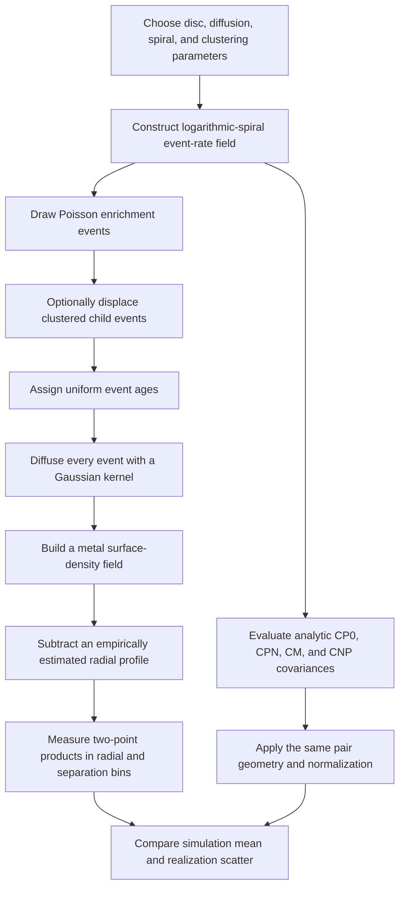

# KTZ26: theory background, notebook audit, and a MAUVE-MUSE plan for NGC4254

**Date:** 2026-07-13  
**Status:** Working technical note. KTZ26 is still under development; the equations and implementation described here refer to the current validation notebook, not to a frozen or published model.  
**Primary notebook:** [`KTZ_validation.ipynb`](./KTZ_validation.ipynb)  
**Notebook source:** [GitHub](https://github.com/Meowwish/KTZ_Theory_z_fluctuation_III/blob/main/KTZ_validation.ipynb)

## Executive summary

KT18 provides an analytic stochastic injection-diffusion model for the variance, power spectrum, and two-point correlation of the abundance field of a single element. Its central physical competition is simple: discrete enrichment events generate small-scale chemical structure, while turbulent diffusion erases it. The normalized spatial autocorrelation is therefore controlled mainly by an injection scale and a diffusion-age scale, rather than by the absolute yield.

KT25 extends this framework to multiple elements. It allows enrichment channels to have different yield histories, delay-time distributions, injection widths, and spatial drift, and it predicts both elemental autocorrelations and cross-correlations. This is important conceptually, but the MAUVE-MUSE application considered here is restricted to oxygen. An oxygen-only analysis therefore uses only a small part of the new KT25 machinery.

The proposed KTZ26 direction adds a structured, spiral-wave source field. In the current notebook, enrichment events are drawn from a logarithmic-spiral intensity function, optionally with Thomas-process-like clustering, and their ejecta are diffused with Gaussian kernels. The analytic calculation decomposes the covariance into four terms:

- `CP0`: the homogeneous KT18-like Poisson term;
- `CPN`: first-order modulation of Poisson shot noise by the spiral source rate;
- `CM`: covariance of the deterministic spiral mean field;
- `CNP`: covariance caused by clustered enrichment sites.

The notebook is a successful **forward validation toy**: with its own fixed parameters, geometry, window, and estimator, the analytic KTZ calculation follows the average of ten stochastic simulations reasonably well. It is not yet an observational inference tool. It has no data reader, likelihood, priors, posterior sampler, PSF or binning operator, measurement-noise model, or parameter-recovery test.

For NGC4254, directly fitting the notebook's default three-armed static spiral would be physically inappropriate. NGC4254 is strongly asymmetric and commonly described as disturbed and one-armed. The source geometry should instead be measured independently from stellar, H-alpha, or molecular-gas morphology and represented by an empirical template or a flexible combination beginning with an `m=1` mode. The abundance map must not be used both to define the spiral template and to claim a spiral-metallicity correlation.

The recommended first MAUVE-MUSE analysis is a simulation-based, observation-forward-modelled oxygen autocorrelation study:

1. use a spatially uniform oxygen calibration as the primary branch, preferably `O_H_O3N2_C20_HII`;
2. retain one measurement per gas bin rather than treating every member pixel as independent;
3. measure the autocorrelation in angular units first, because the local MAUVE and published PHANGS distance conventions differ;
4. compare a nested model ladder from KT18 to clustered KT18 to static KTZ;
5. apply the real PSF, bin map, valid-pixel mask, radial detrending, and estimator to every mock;
6. use radial and directional autocorrelations in addition to a single isotropic full-window curve;
7. treat the inference as a constraint on effective mixing, injection/clustering, and spiral power, not as an independent measurement of the diffusion coefficient and enrichment time.

The safest first scientific claim would be a detection or upper limit on non-monotonic, spiral-associated power in the oxygen-abundance correlation beyond a homogeneous KT18 model. A claim that the data directly measure `kappa`, the spiral pattern speed, or the density-wave dynamics would require substantially more modelling and external constraints.

## 1. Scope and provenance

This note combines four kinds of evidence:

1. the KT18 and KT25 theory papers;
2. later simulation and observational implementations of KT18-type correlation functions;
3. a cell-by-cell audit of the local `KTZ_validation.ipynb`;
4. a read-only audit of the current NGC4254 MAUVE-MUSE products.

The notebook inspected locally has:

- notebook format 4.5;
- nine code cells and no Markdown cells;
- saved execution counts 419 through 427;
- saved output in every cell;
- Python 3.13.5 recorded in the kernel metadata;
- SHA256 `ee81ace4b936ab5bfe5879f08bdf43a393bdbc539eba821670a803ae24ccfa01` at the time of inspection.

No notebook or science-data file was modified for this note. The notebook was inspected as saved; it was not fully re-executed. Thus, the audit establishes what the code and saved outputs contain, while exact reproducibility in a fresh environment remains to be tested separately.

## 2. Theory lineage

### 2.1 KT18: stochastically forced diffusion for one element

[Krumholz & Ting (2018), hereafter KT18](https://doi.org/10.1093/mnras/stx3286), introduce a minimal analytic model for metallicity fluctuations in galactic gas and young stars. The field is driven by discrete injection events and smoothed by turbulent diffusion. In its simplest local, thin-disc form, the fluctuation field obeys a forced diffusion equation of the schematic form

$$
\frac{\partial Z}{\partial t} = \kappa \nabla^2 Z + S(\mathbf{x},t),
$$

where `Z` is the surface-density-like abundance field, `kappa` is an effective turbulent diffusion coefficient, and `S` is a stochastic sum of enrichment events.

For a single event at position `x_i` with age `t_i`, a finite initial injection width produces a Gaussian contribution. In the convention used by the validation notebook,

$$
B_i = \frac{x_0^2}{2} + \kappa t_i,
$$

$$
Z_i(\mathbf{x}) = \frac{Y_i}{4\pi B_i}
\exp\left[-\frac{|\mathbf{x}-\mathbf{x}_i|^2}{4B_i}\right].
$$

The width therefore grows with time. A useful effective scale is

$$
\ell_{\rm mix}(t) = \sqrt{x_0^2 + 2\kappa t}.
$$

The physical interpretation is:

- `x0` sets the initial spatial scale of injection or unresolved deposition;
- `kappa t` sets the additional smoothing accumulated since injection;
- the source rate controls how many kernels overlap;
- the yield distribution controls the absolute amplitude of abundance variance;
- normalization to an autocorrelation coefficient removes much of the amplitude information.

For a homogeneous Poisson source field, the equal-time spatial covariance can be written in terms of exponential integrals. Using

$$
p_0=x_0^2, \qquad p_\star=x_0^2+2\kappa t_\star,
$$

the notebook's homogeneous component uses

$$
I_0(r)=\frac{1}{2}
\left[
E_1\left(\frac{r^2}{4p_\star}\right)
-E_1\left(\frac{r^2}{4p_0}\right)
\right],
$$

with the finite zero-separation limit

$$
I_0(0)=\frac{1}{2}\ln\left(\frac{p_\star}{p_0}\right).
$$

The normalized KT18-like correlation is then controlled primarily by the ratio and difference between `p0` and `p_star`. This immediately creates an identifiability limitation: unless there is independent information about the characteristic enrichment age `t_star`, a spatial autocorrelation mainly constrains the combination `kappa t_star`, not `kappa` and `t_star` separately.

#### What KT18 explains well

KT18 gives a transparent physical model for:

- why abundance fluctuations exist at all;
- why they are correlated across a finite spatial scale;
- how the injection width and turbulent mixing compete;
- how variance, power spectrum, and correlation encode related information;
- why different nucleosynthetic channels can produce different spatial statistics.

#### What KT18 deliberately omits

The minimal model assumes, or locally approximates:

- homogeneous and independent enrichment sites;
- a statistically stationary source process;
- an infinite or locally flat two-dimensional medium;
- diffusion without explicit galactic advection or differential rotation;
- one element at a time;
- no spiral-arm source modulation;
- no explicit clustered point process for enrichment sites;
- no observational PSF, adaptive binning, irregular mask, or calibration systematics.

These are controlled simplifications, not mistakes. They define the null model that KTZ26 is attempting to extend.

#### Equation-level caution from the KT18 audit

The audit found an internal power inconsistency in the printed `tau_f` dependence between KT18 equations 37-38 / the first equality of equation 106 and the latter equality of equation 106 / equation 107. This should be checked against the authors' intended nondimensional definitions before reusing those expressions for an absolute variance normalization. It does not alter the main notebook result discussed here, because the current KTZ validation focuses on a normalized equal-time spatial autocorrelation, where the common amplitude largely cancels.

### 2.2 KT25: multiple elements and abundance-space correlations

[Krumholz et al. (2025), hereafter KT25](https://arxiv.org/abs/2507.14572), extends the KT18 stochastic diffusion model from one element to multiple elements. The central idea is that elemental fields are correlated because the same star-formation events and enrichment channels can contribute to more than one element, while their detailed spatial patterns differ because the channels have different delay histories, yields, deposition scales, and drift.

KT25 therefore adds the machinery needed to describe:

- element-dependent yield histories;
- shared versus independent nucleosynthetic events;
- channel-dependent delay-time distributions;
- element- or channel-dependent injection widths;
- displacement or drift between birth and enrichment sites;
- auto-correlations for each element;
- cross-correlations between different elements;
- the resulting structure of multi-dimensional chemical-abundance space.

In schematic form, each elemental field can be written as a sum over events and channels,

$$
Z_a(\mathbf{x},t)
=
\sum_{i,c} Y_{a,c,i}\,
G_a\!\left(\mathbf{x}-\mathbf{x}_{i,c}-\Delta\mathbf{x}_{a,c},
t-t_{i,c}-\tau_{a,c}\right),
$$

where `a` labels the element, `c` labels a source channel, `tau` is a delay, `Delta x` is a drift or displacement, and `G` is the injection-plus-mixing kernel. Cross-correlations arise when two fields share event histories or channels.

This is a major conceptual expansion for stellar chemical tagging and for multi-element nebular abundance maps. However, a MAUVE-MUSE oxygen-only analysis cannot exploit most of it. With only `O/H`, there is no direct elemental cross-correlation, and multiple oxygen-producing subchannels are not separately observable from the abundance map alone. KTZ26 should still be built consistently on the KT25 formalism, but the first NGC4254 fit will effectively probe the oxygen auto-correlation sector.

### 2.3 Lessons from later KT18 implementations

The later papers are important because they show how a clean analytic theory behaves in simulations and real data.

#### Zhang et al. (2025): simulation test

[Zhang et al. (2025), *Understanding the mechanisms behind the distribution of galactic metals*](https://doi.org/10.1093/mnras/staf194), compare abundance-fluctuation statistics in simulations to KT18-type injection-diffusion predictions. The spatial autocorrelation is reasonably described at zeroth order, but spiral structure introduces oscillations and negative lobes that the homogeneous KT18 model cannot reproduce. Their fitting strategy restricts the usable range to before the first low-correlation crossing, rather than forcing KT18 to fit the spiral-induced structure.

That limitation is precisely the scientific opening for KTZ26: the negative or oscillatory part of the correlation should not simply be discarded if it contains coherent information about spiral-modulated enrichment.

The paper's functional-form agreement should not be interpreted as a unique physical validation of every inferred parameter. Different combinations of injection scale, mixing history, clustering, source structure, numerical resolution, and observational smoothing can produce similar normalized correlations.

#### Li et al. (2025): an observational abundance-correlation fit

[Li et al. (2025), *Element Nucleosynthetic Origins from Abundance Spatial Distributions beyond the Milky Way*](https://iopscience.iop.org/article/10.3847/2041-8213/ade7fa), apply KT18-type autocorrelation modelling to direct oxygen, nitrogen, and sulfur abundance maps of NGC5253. Their analysis demonstrates several requirements for observational work:

- fit the measured correlation together with the effects of measurement uncertainty;
- include the angular/spatial resolution and injection width;
- use independent abundance measurements if interpreting inter-element differences;
- propagate uncertainty through the correlation fit rather than treating all pairs as independent.

Their noise-corrected cross-correlations can formally exceed unity. This is a reminder that a corrected estimator is not necessarily bounded like an ordinary sample Pearson coefficient and must be interpreted through the full measurement model.

#### Zhang et al. (2026): RoSE

[Zhang et al. (2026), *Ripples of Stellar Enrichment (RoSE)*](https://arxiv.org/abs/2603.29242), use star-by-star enrichment simulations to study spatial, temporal, and inter-element abundance statistics. RoSE reinforces the KT25 idea that nucleosynthetic source composition is a primary organiser of elemental correlation structure. It also reports and corrects a temporal-correlation coding error in the earlier simulation analysis. The earlier paper's spatial application remains useful, but its temporal implementation should not be copied without the correction.

### 2.4 The proposed KTZ26 step

The working KTZ26 idea is to replace the homogeneous enrichment intensity with a non-axisymmetric source field associated with spiral structure. The current notebook uses

$$
\lambda(R,\phi)
=
\lambda_{00}\exp(-R/h_R)
\left[1+\eta h(\Theta)\right],
$$

where

$$
\Theta(R,\phi)
=
\frac{m}{\tan p}\ln\left(\frac{R}{R_{\rm in}}\right)
-m\phi+\Theta_0,
$$

and

$$
h(\Theta)=\sum_n g_n\cos(n\Theta+\alpha_n).
$$

Here `m` is the base arm multiplicity, `p` is the pitch angle, `eta` is the modulation amplitude, and the harmonics sharpen or reshape the arm profile.

The local wave number perpendicular to the logarithmic arm is

$$
Q_n(R)=n k_\perp(R),
$$

$$
k_\perp(R)
=
\sqrt{\left(\frac{m}{R\tan p}\right)^2+
\left(\frac{m}{R}\right)^2}
=
\frac{m}{R|\sin p|}.
$$

This immediately predicts a radial signature: the arm-normal wavelength grows with radius. A radius-conditioned or directional correlation contains far more information about this than a single full-window isotropic average.

The present formulation is a **static structured source model**, not yet a complete density-wave transport model. A dynamic extension should include the relative motion of gas and pattern,

$$
\frac{\partial Z}{\partial t}
+\mathbf{v}_{\rm rel}\cdot\nabla Z
=\kappa\nabla^2 Z+S,
$$

with, for example,

$$
\Theta(R,\phi,t)
=
\frac{m}{\tan p}\ln\left(\frac{R}{R_0}\right)
-m\left(\phi-\Omega_p t\right)+\Theta_0,
$$

and `v_rel` depending on `Omega(R)-Omega_p`. Such a model can represent downstream offsets, shear, corotation, and element-dependent delay/drift. Those effects are not present in the current notebook.

## 3. End-to-end notebook logic

The notebook implements the following chain:

The validation is strongest where the analytic and simulated branches share the same window and pair-weighting definition. It is weaker where one branch includes an operation that the other only approximates, especially the finite-bin radial detrending, finite grid, kernel truncation, and annular boundaries.

## 4. Cell-by-cell notebook breakdown

### Cell 0: imports, parameters, and numerical setup

The first cell imports NumPy, SciPy, and Matplotlib and defines every physical and numerical parameter. There are no local module or data-file imports; the notebook is a self-contained synthetic experiment.

The saved fiducial configuration is:

| Quantity | Value | Meaning |
|---|---:|---|
| `R_in` | 1.0 kpc | Inner simulation radius |
| `R_out` | 14.4 kpc | Outer simulation radius |
| `kappa` | 0.30 kpc^2 Gyr^-1 | Effective diffusion coefficient |
| `x0` | 0.10 kpc | Initial injection width parameter |
| `t_star` | 0.50 Gyr | Maximum event age / accumulation time |
| `m_arms` | 3 | Base spiral multiplicity |
| `pitch` | 20 deg | Logarithmic-spiral pitch angle |
| `Theta0` | 0 | Spiral phase zero-point |
| `eta` | 0.40 | Source-rate modulation amplitude |
| `n_harm` | 1, 2, 3 | Harmonics of the base spiral phase |
| `g_n` | 1.0, 0.4, 0.2 | Harmonic amplitudes |
| `alpha_n` | 0, 0, 0 | Harmonic phases |
| `lambda00` | 500 kpc^-2 Gyr^-1 | Central source-rate normalization |
| `h_R` | 4.8 kpc | Exponential source-rate scale length |
| clustering | enabled | Adds an approximate Thomas-process component |
| `f_cl` | 0.50 | Fraction assigned to clustered children |
| `sigma_cl` | 0.35 kpc | Cluster-child displacement scale |
| `mu_children` | 5 | Mean number of children per parent |
| quadrature nodes | 24 | Angular/numerical averaging resolution |
| `Y_val` | 1 | Identical yield for every event |
| `dx` | 0.20 kpc | Cartesian grid spacing |
| grid radius | 15.4 kpc | Computational extent beyond `R_out` |
| realizations | 10 | Independent stochastic fields |
| random seed | 42 | Reproducible random stream |

The code tests positivity of the spiral rate by sampling 4096 phases. This is important because `1+eta h(Theta)` must not become negative.

The implied maximum mixing width is

$$
\ell_{\rm mix,max}
=\sqrt{x_0^2+2\kappa t_\star}
=\sqrt{0.01+0.30}
\simeq 0.557\ {\rm kpc}.
$$

One immediate numerical concern is that `x0=0.10 kpc` is smaller than the grid spacing `dx=0.20 kpc`. The injected core is therefore under-resolved in the simulations even though it remains continuous in the analytic model.

### Cell 1: spiral geometry and event-rate field

This cell defines the logarithmic-spiral phase `Theta`, the harmonic arm profile `h(Theta)`, and the event intensity `lambda(R,phi)`. It also plots the three-arm skeleton and the modulation profile.

Because all harmonics multiply the same base phase, the saved model contains spatial modes `m=3`, `6`, and `9` with a shared pitch and exact three-fold symmetry. The harmonics change the cross-arm shape; they do not create independent one-, two-, and three-arm patterns.

That distinction matters for NGC4254. Replacing `m=3` by `m=1` while retaining harmonics would create `m=1`, `2`, and `3` modes that are phase-locked and share a pitch. This may be a useful low-dimensional approximation, but it is less flexible than independent Fourier/log-spiral components or an empirical arm template.

### Cell 2: stochastic enrichment-event simulation

The expected number of events is obtained by integrating the intensity over the annulus and over `t_star`. The saved output gives an expectation of about 28,300 events. The first realization contains 28,442 events, of which 14,066 are assigned to the clustered component.

The stochastic sequence is:

1. draw the total event count from a Poisson distribution;
2. split events into field and clustered populations with a binomial draw;
3. draw field positions from the inhomogeneous spiral intensity by rejection sampling;
4. create cluster parents and Gaussian-displaced children for the clustered population;
5. assign event ages uniformly over `[0,t_star]`;
6. deposit every event using the diffused Gaussian kernel.

For computational efficiency each Gaussian is truncated at five times `sqrt(2B_i)`. This is negligible in the far tail for an isolated kernel, but the analytic calculation integrates untruncated kernels. The difference should be included in a numerical-convergence audit.

The clustered generator is described most accurately as **Thomas-process-like**, not an exact unconstrained stationary Thomas process. The child count is forced toward a target, parents and children are restricted by the annular window, and rejected children are handled algorithmically. These choices are sensible for a toy disc, but a real inference model should define the generative point process and its window treatment precisely.

Uniform event ages are another strong assumption. In a density-wave model, ages and spiral phase are generally coupled because gas, stars, and the pattern move relative to each other. KT25 delay histories would further make the age distribution channel- and element-dependent.

### Cell 3: analysis window and radial-profile subtraction

The notebook constructs a disc mask, erodes the usable window by roughly `sqrt(2) dx`, divides the field into 49 radial bins, estimates an annular mean, interpolates that mean, and subtracts it to form the fluctuation field.

Conceptually, this is the correct operation for an observed metallicity map: the large radial gradient must be separated from residual azimuthal and local structure. However, the exact detrending operator matters. Subtracting a profile estimated from the same finite field removes some true long-wavelength covariance and couples the residuals.

The simulations use this empirical, finite-bin projection. The analytic covariance does not explicitly propagate the same 49-bin fitting operator. This is likely harmless at short separation but can matter at larger separation, particularly where spiral modes project onto the radial estimate. For MAUVE, the radial profile must be refitted inside every mock using exactly the same procedure as for the data.

The code defines both a disc mask and an `analysis_mask`; some of these intermediates are not used later. That is a maintainability issue, not a scientific result.

### Cell 4: the simulated radius-conditioned correlation `xi_2(R,r)`

The cell estimates a two-point normalized product in six radial bins with midpoint radii approximately

$$
R = 1.78,\ 4.15,\ 6.52,\ 8.88,\ 11.25,\ 13.62\ {\rm kpc}.
$$

It uses 29 separation bins from 0.1 to 14.4 kpc and attempts 50,000 pairs per radius bin per realization. Each pair is parameterized by its midpoint and separation vector; both endpoints must fall inside the valid window.

The estimator is

$$
\widehat{\xi}(r)
=
\frac{\langle \Delta Z_-\Delta Z_+\rangle}
{\sqrt{\langle \Delta Z_-^2\rangle
\langle \Delta Z_+^2\rangle}}.
$$

It is not exactly the ordinary Pearson correlation coefficient. There is no new mean subtraction within each separation bin; the field has already been radially detrended. This definition must be reproduced exactly when comparing theory, simulations, and data.

The ten-realization mean and standard deviation are saved. The standard deviation describes realization-to-realization scatter, not the standard error on the mean and not the full covariance between separation bins.

The saved output contains duplicated progress lines after the main prints. This appears to be stale or duplicated notebook output, not duplicated simulation physics. The output should be cleared and regenerated before publication.

### Cell 5: the analytic KTZ covariance

This is the core theory cell. It evaluates the homogeneous kernel and spiral/clustering corrections.

For a non-zero local wave number `Q`, the notebook defines

$$
I_n^P(r,Q)
=
\int_{p_0}^{p_\star}
\frac{1}{2p}
\exp\left[-\frac{r^2}{4p}-\frac{Q^2p}{4}\right]dp,
$$

and a time-integrated smoothing factor

$$
T_n(Q)
=
\exp\left(-\frac{x_0^2Q^2}{2}\right)
\frac{1-\exp(-\kappa t_\star Q^2)}{\kappa Q^2}.
$$

The clustered fraction receives harmonic damping

$$
D_n(Q)
=
(1-f_{\rm cl})
+f_{\rm cl}\exp\left[-\frac{(Q\sigma_{\rm cl})^2}{2}\right].
$$

The covariance is decomposed as follows:

| Term | Origin | Scaling and qualitative behaviour |
|---|---|---|
| `CP0` | Homogeneous Poisson shot noise | KT18-like, positive and monotonically decaying |
| `CPN` | First-order spiral modulation of shot noise | Linear in spiral modulation; phase-dependent; can cancel in full-window averaging |
| `CM` | Covariance of the coherent spiral mean field | Quadratic in the spiral mean amplitude; produces the dominant oscillatory ripple in the saved model |
| `CNP` | Correlated source positions | Adds covariance on the cluster-child scale; can mimic broader injection or weaker diffusion |

The common Poisson amplitude is represented by

$$
A_P(R)=\frac{Y^2\lambda_0(R)}{4\pi\kappa}.
$$

The local normalized correlation is assembled as

$$
\xi_1
=
\frac{C_{P0}+C_{PN}+C_M+C_{NP}}
{\sqrt{V_-V_+}}.
$$

The notebook supports two different averaging conventions:

- `pair_product`: average the covariance and endpoint variances over the pair distribution, then normalize;
- `mean_xi`: compute a local `xi_1` first, then average those normalized values.

These are mathematically different. The simulation estimator matches `pair_product`, so that is the relevant comparison. The notebook labels `mean_xi` as the paper-style definition, but it should not be substituted for the simulated estimator without showing the consequences.

The analytic geometry uses a local WKB-like linearization of the spiral phase at the pair midpoint. It holds local intensity, gradient, and wave number fixed while treating endpoint phase changes linearly. This is best for separations short compared with the radius and with the scales on which the disc background changes.

### Cell 6: local arm-phase dependence

This cell evaluates `xi_1` at `R=7.5 kpc` for three phases:

- arm ridge: `theta0=0`;
- inter-arm: `theta0=pi`;
- quadrature: `theta0=pi/2`.

The separation is oriented along the arm normal. The saved curves show strong phase dependence. The coherent mean term `CM` dominates the ripple: ridge and inter-arm phases show positive oscillatory structure, while quadrature can become strongly negative over parts of the separation range.

This figure is the clearest physical motivation for a directional or phase-conditioned observational statistic. A full isotropic average mixes together positions and orientations where the signal has different signs.

### Cell 7: simulation versus KTZ for `xi_2(R,r)`

The cell makes a 2-by-3 panel comparison between the six radial-bin simulations and the analytic calculation, shown to separations of 5 kpc. The theory generally follows the ten-realization mean within the saved realization scatter.

This demonstrates that the analytic local approximation is internally consistent with the synthetic generator at the tested fiducial point. It does **not** establish parameter recovery, uniqueness, or robustness to resolution, boundaries, detrending, clustering prescription, or observational effects.

There is a plotting-format bug in the raw `ylabel`: the math command lacks the surrounding dollar delimiters, so a literal backslash expression may be rendered. This is cosmetic but should be fixed in a publication version.

### Cell 8: full-window correlation `xi_3(r)`

The final cell measures a global correlation using 150,000 attempted pairs per realization. Pair midpoints are sampled uniformly in area across the usable annulus. The analytic calculation similarly samples radius with equal-area weighting, but it also carries the physical `A_P(R)` covariance amplitude before normalization.

This weighting is important. A simple arithmetic mean of local `xi_1` curves gives every location equal weight after local normalization, whereas the actual pair-product estimator weights regions by their contribution to covariance and endpoint variance. The pair-weighted KTZ prediction matches the simulations better.

The saved global curve has the qualitative KTZ signature:

- positive correlation at small separation;
- a zero crossing around 2 kpc;
- a negative trough roughly across 2.5-3.3 kpc;
- a return toward zero by about 5 kpc.

That non-monotonic behaviour is the feature a homogeneous KT18 model cannot reproduce. It is also the feature most vulnerable to radial detrending, finite window, and geometry mismatch, so those operators must be handled exactly in data applications.

The global plot contains the same missing-math-delimiter label issue as Cell 7.

## 5. What the notebook validates - and what it does not

### 5.1 Validated within the saved experiment

The notebook provides evidence that, at its single fiducial parameter point:

- the four-term covariance decomposition has the expected qualitative behaviour;
- the local WKB treatment reproduces the simulated radius dependence to the precision shown;
- the analytic pair-product weighting is the correct comparison to the Monte Carlo estimator;
- static spiral modulation can produce a zero crossing and negative correlation lobe;
- source clustering can be incorporated as an additional covariance term;
- the analytic calculation is computationally much cheaper than averaging many full event simulations.

This is a valuable theory-unit test. It shows that the static KTZ equations and their corresponding event generator agree under approximately matched conditions.

### 5.2 Not yet validated

The notebook does not test:

- recovery of known parameters from a simulated correlation;
- degeneracies or posterior shape;
- sensitivity to the PSF or finite spectral-map resolution;
- adaptive spatial binning;
- irregular signal-to-noise and BPT masks;
- correlated abundance-calibration errors;
- the difference between a linear metal surface density and logarithmic `12+log(O/H)`;
- numerical convergence with grid spacing, kernel truncation, pair count, quadrature nodes, or number of realizations;
- robustness to the radial-detrending method;
- accuracy close to annular boundaries;
- a lopsided or empirically measured spiral pattern;
- pattern speed, galactic rotation, shear, or time-dependent arm crossing;
- KT25 element-dependent delays, yields, or drift;
- a real galaxy.

The correct conclusion is therefore: **the analytic calculation reproduces its associated static synthetic generator at one tested setup**. It is premature to conclude that the current notebook can infer physical density-wave or diffusion parameters from MAUVE-MUSE.

## 6. Scientific and numerical audit of the current KTZ formulation

### 6.1 Static arms versus density-wave dynamics

All events, including events as old as 0.5 Gyr, are drawn from the same present-day spiral intensity. They remain statistically locked to that pattern while their kernels diffuse. In a real disc, material rotates relative to a quasi-stationary wave, and a transient or material arm evolves as well. The current model therefore represents **spiral-structured injection**, not the full time-dependent density-wave scenario.

A physically stronger KTZ26 model should specify:

- whether the arm is a rigid pattern, a material arm, or an empirical time-averaged source template;
- `Omega_p` or an alternative pattern-evolution prescription;
- the gas rotation curve `Omega(R)`;
- the relative arm-crossing time;
- the age/delay distribution of oxygen enrichment;
- downstream drift and shear;
- behaviour near corotation and resonances;
- whether diffusion is isotropic or differs parallel and perpendicular to the arm.

Without those ingredients, a fitted ripple wavelength should be described as an effective spatial source-structure scale, not a direct density-wave pattern-speed measurement.

### 6.2 Linear field versus logarithmic abundance

The simulation adds positive linear kernels to a field with identical yields. The observed map is normally in dex,

$$
z_{\rm obs}=12+\log_{10}({\rm O/H}).
$$

For small fractional fluctuations around a baseline `Z_bar`,

$$
\delta z
\simeq
\frac{\delta Z}{\ln(10)\,\overline{Z}},
$$

so a linearized treatment may be adequate. The inspected NGC4254 residual scatter is only about 0.027 dex, which helps. Nevertheless, a forward model should either:

1. generate a positive linear oxygen field, add it to a radial baseline, transform to dex, and then apply the observational estimator; or
2. explicitly state and test the small-fluctuation approximation.

Applying a linear-field covariance formula directly to dex residuals without this check risks a scale- and amplitude-dependent bias.

### 6.3 Resolution and continuous-theory mismatch

The fiducial injection width is 0.10 kpc while the simulation pixels are 0.20 kpc. The smallest physical scale is therefore not resolved. In addition:

- the simulation samples a Cartesian grid while the theory is continuous;
- the simulation truncates event kernels while the theory does not;
- the simulation interpolates endpoint values;
- the simulation averages over finite separation bins while the plotted theory is often evaluated at bin centres;
- the analytic model uses an infinite-plane/local approximation while the generator has an annular window and no sources outside it.

At minimum, a convergence suite should halve `dx`, vary the truncation radius, evaluate the theory averaged across each separation bin, and repeat with larger outer padding.

### 6.4 Radial detrending as a covariance operator

The observed residual is not the latent fluctuation field; it is the latent field after fitting and subtracting a radial model. Symbolically,

$$
\Delta \mathbf{z}=(\mathbf{I}-\mathbf{H})\mathbf{z},
$$

where `H` is the data-dependent smoothing or regression operator. Even if the latent covariance is `C`, the residual covariance is approximately

$$
\mathbf{C}_{\rm res}
=(\mathbf{I}-\mathbf{H})\mathbf{C}
(\mathbf{I}-\mathbf{H})^T.
$$

The notebook's analytic branch does not explicitly apply this finite-sample operator. The most reliable solution for MAUVE is not to derive a complicated closed form immediately, but to refit the radial trend to every forward mock before measuring its correlation.

### 6.5 Pair dependence and uncertainty

Pairs share endpoints and spatial regions, so the nominal number of pairs is not the number of independent data points. Neighbouring separation bins are correlated. The notebook's ten-realization standard deviation is useful for visual validation but does not yield a stable likelihood covariance.

For observations, uncertainty should combine:

- line-flux or abundance Monte Carlo realizations;
- spatial block jackknife or bootstrap;
- mock-to-mock cosmic/source-process variance;
- PSF and geometry uncertainty;
- calibration-branch variation;
- full covariance between separation bins.

### 6.6 Zero lag, PSF, and measurement noise

The notebook effectively normalizes the theoretical zero lag to one. An observed map does not contain the intrinsic zero-lag variance directly. PSF convolution suppresses small-scale variance and correlates neighbouring samples; measurement noise adds variance and usually reduces the observed normalized correlation away from zero.

Consequently, the first one or two separation bins can drive an apparently precise but biased injection width. The observational model must convolve before binning and must not silently force the measured zero-lag point to one.

### 6.7 Interpretation of component curves

When the notebook plots `CP0`, `CPN`, `CM`, and `CNP` contributions, they share the total covariance normalization. They are additive contributions to one model, not four independently normalized autocorrelation functions. Their plotted magnitudes should therefore be described as contributions under a common denominator.

### 6.8 Code-maintenance findings

The following do not invalidate the saved figures, but should be cleaned before a code release:

- all warnings are globally suppressed;
- numerical integration error estimates are discarded;
- some variables and wrapper functions are unused or overwritten, including plotting and correlation aliases;
- saved console output is duplicated in one cell;
- two axis labels lack math delimiters;
- no automated tests compare limiting cases (`eta=0`, `f_cl=0`, `Q->0`) to KT18;
- no parameter or unit validation is centralized;
- there are no Markdown cells documenting conventions and estimator definitions.

Recommended unit tests include:

1. `eta=0` and `f_cl=0` recovers `CP0` alone;
2. `Q->0` recovers the homogeneous exponential-integral limit;
3. `sigma_cl->0` and `f_cl->0` have the expected clustering limits;
4. analytic pair-product integration agrees with direct quadrature for selected geometries;
5. a high-resolution simulation converges to the analytic curve;
6. rotation of the complete synthetic disc leaves the isotropic `xi_3` unchanged;
7. arm phase changes the directional statistic as predicted.

## 7. What an oxygen autocorrelation can identify

A single isotropic oxygen autocorrelation is informative, but it does not identify every physical parameter in KTZ26.

| Quantity | Constraint from one isotropic O/H ACF | Reason |
|---|---|---|
| Effective mixed width `sqrt(x0^2+2 kappa t_star)` | Potentially useful | Directly shapes the short-range roll-off |
| `x0` separately | Weak unless resolved | Degenerate with PSF, binning, clustering, and diffusion |
| `kappa` separately | No | Appears mainly through `kappa t_star`; needs an external age scale |
| `t_star` separately | No | Same degeneracy as `kappa` |
| Yield `Y` | No from normalized ACF | Common amplitude largely cancels |
| Absolute event rate | Very weak from normalized ACF | Mostly affects variance amplitude, not normalized shape |
| Spiral power | Possible if geometry is fixed | Produces non-monotonic covariance |
| Signed arm phase | Poor after global averaging | Linear terms cancel and quadratic power survives |
| `m` and pitch separately | Weak | Local WKB mainly sees `m/sin(p)` |
| Cluster scale `sigma_cl` | Possible if resolved | Changes intermediate-scale covariance |
| Cluster fraction | Degenerate | Trades against injection width and diffusion |
| Pattern speed `Omega_p` | No in static model | Not included in current equations |
| KT25 delay/drift | No with present oxygen-only static model | Requires added dynamics and external constraints |

The first-order spiral term `CPN` tends to cancel over a complete symmetric window because positive and negative phases are averaged. The coherent mean term `CM` is quadratic and survives as power. A full-window isotropic correlation can therefore detect a preferred scale while losing the sign and detailed morphology of the arm modulation.

This is why the MAUVE analysis should retain radius, direction, or arm phase rather than compressing immediately to one curve.

## 8. NGC4254: live MAUVE-MUSE product inventory

### 8.1 Main file and sampling

The inspected product is:

[`NGC4254_gas_bin_maps_further.fits`](./v3tk_v7.6.8/NGC4254/NGC4254_gas_bin_maps_further.fits)

At the time of inspection it contained:

- 333 HDUs;
- image shape `(1190, 1012)`;
- WCS pixel scale 0.2 arcsec per pixel;
- WCS reference position `RA=184.71379280712 deg`, `Dec=14.414863991413 deg`;
- a `BIN_ID` map in which one fitted gas bin is repeated across all member pixels.

The repeated `BIN_ID` values are fundamental for the correlation analysis. Treating all image pixels as independent abundance samples would replicate the same fitted measurement many times and grossly understate the uncertainty. The analysis should operate on unique gas bins, using their centroids and, where needed, their areas or pixel footprints.

### 8.2 Available oxygen-abundance products

The current HII-selected products have the following approximate finite coverage:

| Product | Unique finite bins | Median `12+log(O/H)` | Median formal error | Recommended role |
|---|---:|---:|---:|---|
| D16 HII | 32,522 | 8.6855 | not audited here | Robustness branch |
| PG16 HII | 32,548 | 8.5292 | not audited here | Robustness branch |
| O3N2 M13 HII | 32,548 | 8.5544 | not audited here | Robustness branch |
| O3N2 C20 HII | 32,549 | 8.7671 | 0.0903 dex | **Recommended primary** |
| Combined C20 HII | 32,552 | 8.7621 | 0.0588 dex | Secondary; method-transition risk |
| NII K25 HII | 1,759 unique bin IDs | 8.3723 | 0.2497 dex | Qualitative only |
| BR24 direct HII | 0 | - | - | Unavailable for NGC4254 |

The NII K25 map has 2,302 finite member pixels but only 1,759 unique bin IDs and 608 unique abundance values. Its sparse and quantized sampling plus large quoted uncertainty make it unsuitable as the primary correlation field.

The BR24 direct-method abundance and error maps contain no finite NGC4254 values, so a direct oxygen-abundance correlation is not currently possible from this product.

### 8.3 Why O3N2 C20 should be primary

The Combined C20 product has slightly broader coverage and smaller formal errors, but it changes calibration method across the galaxy. For unique HII bins, the inspected method labels were approximately:

| Method label | Bin count | Calibration component |
|---:|---:|---|
| 0 | 2 | O3N2 |
| 2 | 6 | RS32 |
| 3 | 4,181 | R3 |
| 5 | 28,363 | S2 |

Spatial transitions between calibration methods can create or suppress apparent abundance correlations. A correlation analysis is especially sensitive to such coherent method structure. The primary branch should therefore use the spatially uniform `O_H_O3N2_C20_HII` map, even if its per-bin formal uncertainties are larger.

The Combined, D16, PG16, and O3N2-M13 products should be analysed as **separate robustness branches**, each with its own valid mask. They should not automatically be restricted to one common intersection mask, because that discards useful data and changes the selection function. A common-mask comparison can be an additional controlled test, not the default.

### 8.4 Meaning of the `HII` mask

The `HII` suffix does not denote a catalogue of independently segmented HII regions. In the current pipeline it denotes a strict Classification-2 BPT selection: a bin must lie in the star-forming region of both the N2 and S2 BPT diagrams, and the central value plus/minus one standard deviation must remain in the same class.

Thus:

- neighbouring HII-labelled gas bins can be part of one extended region;
- missing areas correlate with line signal-to-noise, excitation, and classification uncertainty;
- the mask is not missing at random;
- the exact valid mask can imprint scale-dependent structure.

Every forward mock must be sampled through the real calibration-specific mask. Filling holes, smoothing across them, or using a simple circular window would not reproduce the observed statistic.

### 8.5 Geometry and distance conventions

The local working values and published PHANGS values are not identical:

| Quantity | Local MAUVE/Brown convention | Published PHANGS convention |
|---|---:|---:|
| Distance | 16.5 Mpc | 13.1 Mpc |
| Centre RA | 12:18:49.68 | close but should be read from selected reference |
| Centre Dec | +14:25:05.52 | close but should be read from selected reference |
| Inclination | 39 deg | 34.4 deg |
| Position angle | 243 deg, equivalent to 63 deg modulo 180 | 68.1 deg |
| PHANGS-MUSE physical resolution | about 77 pc if rescaled to 16.5 Mpc | about 61 pc at 13.1 Mpc |

The local FITS primary header explicitly records `DIST_MPC=16.5` with reference text `Fixed MAUVE paper distance scale`.

The distance ratio is

$$
\frac{16.5}{13.1}=1.260.
$$

Any physical separation inferred at 16.5 Mpc is therefore about 26 percent larger than at 13.1 Mpc. Quantities proportional to length squared, including an inferred `kappa t` at fixed angular shape, differ by about 59 percent. One 0.2 arcsec image pixel corresponds to approximately 16.0 pc at 16.5 Mpc and 12.7 pc at 13.1 Mpc.

The clean strategy is:

1. measure and archive the correlation in angular separation;
2. declare one fiducial geometry and distance for the main physical interpretation;
3. provide the alternative distance conversion as a systematic branch;
4. never mix an arm mask deprojected with one geometry with abundance coordinates deprojected using another.

### 8.6 NGC4254 spiral morphology

NGC4254 is not a clean three-fold logarithmic spiral. It is strongly asymmetric and has long been discussed as a disturbed, lopsided, or one-armed system, likely influenced by its Virgo environment. The notebook's exact `m=3` symmetry should therefore be regarded only as a validation example.

PHANGS morphology products include stellar-mass/3.6-micron arm masks and related environmental classifications, but no such mask was found in the inspected local `further` tree. A suitable mask or template should be obtained and versioned locally before fitting KTZ.

Possible geometry choices, in order of scientific defensibility, are:

1. an external stellar-mass or 3.6-micron arm template;
2. an H-alpha or young-star source template if the model explicitly concerns current enrichment sites;
3. a CO molecular-gas ridge template;
4. an independent Fourier/log-spiral fit to one of those tracers;
5. a low-dimensional `m=1` plus optional independent `m=2` model.

The oxygen residual map itself should not define the spiral template used to test for an oxygen-spiral correlation.

### 8.7 Preliminary feasibility diagnostic

A read-only diagnostic was constructed during the audit from one unique value per Combined-C20 HII gas bin, using the local 16.5 Mpc distance, the PHANGS-like orientation, and the local centre. It found:

- 32,552 unique valid bins;
- deprojected radius range about 0.008-13.116 kpc;
- residual standard deviation about 0.02722 dex after radial detrending;
- residual median absolute deviation about 0.02635 dex;
- coherent non-radial structure remaining in the map.

This establishes that a spatial residual analysis is feasible. It is not an observed KTZ detection. In particular, the residual scatter is smaller than the median quoted Combined-C20 error, which means that measurement-error interpretation, bin covariance, and calibration systematics will be decisive. The scratch diagnostic was temporary and is not included as a persistent project deliverable.

No observed autocorrelation or KTZ fit has yet been run in this audit.

## 9. Recommended MAUVE-MUSE analysis for NGC4254

### 9.1 Primary scientific question

A suitably narrow first question is:

> Does the spatial autocorrelation of radially detrended oxygen abundance in NGC4254 contain non-monotonic, radius-dependent, or direction-dependent structure that is inconsistent with a homogeneous KT18 injection-diffusion field and consistent with independently measured spiral morphology?

This question is answerable with oxygen alone. It avoids claiming more than the data and current model identify.

### 9.2 Pre-registered hypotheses

- **H0 / M0:** homogeneous KT18-like injection plus diffusion is sufficient.
- **H1 / M1:** homogeneous injection plus clustered source positions is sufficient.
- **H2 / M2:** a fixed external spiral source template improves the covariance without source clustering.
- **H3 / M3:** spiral modulation and source clustering are both required.
- **Future M4:** a time-dependent spiral pattern with rotation, delay, and drift is required.

The static models should be nested where possible so that extra complexity is testable rather than guaranteed to improve the fit.

### 9.3 Data construction

#### Primary branch

Use `O_H_O3N2_C20_HII` and its associated error map. For each unique `BIN_ID`, record:

- sky-coordinate centroid;
- all member pixels or an equivalent polygon/area;
- oxygen abundance;
- formal abundance uncertainty;
- deprojected `R`, `phi`, arm phase, and arm-normal direction under the selected geometry;
- local PSF estimate or pointing identifier if the PSF varies;
- BPT/quality metadata needed to reconstruct the mask.

Use one abundance value per unique gas bin. If the target statistic is interpreted as an area-weighted continuous field, weight by the projected or face-on bin area explicitly. Do not obtain artificial precision by repeating the value for every member pixel.

#### Robustness branches

Repeat the complete measurement for:

- O3N2 M13;
- D16;
- PG16;
- Combined C20;
- a common-mask subset as an additional diagnostic;
- alternative radial-detrending methods.

NII K25 may be plotted qualitatively but should not carry the main inference. BR24 is unavailable.

### 9.4 Radial-background model

The main residual definition should be declared before inspecting the spiral statistic. Reasonable candidates are:

- robust annular median plus smooth spline;
- a one-dimensional Gaussian process in radius;
- a low-order monotonic or broken-linear gradient;
- the same 49-bin interpolation used by the validation notebook, after checking bin occupancy.

The preferred method should avoid fitting away arm-scale structure. Whatever method is chosen must be applied identically to data and every mock. Varying the method is a systematic test, not a post-hoc tuning knob.

### 9.5 Correlation statistics

Use a hierarchy rather than one global curve.

#### A. Full-window isotropic autocorrelation `xi_3(theta)`

This is the direct connection to the KT18 observational literature and the notebook's final cell. Measure it first in angular bins. It provides a compact test for the small-scale correlation length, zero crossing, and negative lobe.

#### B. Radius-conditioned autocorrelation `xi_2(R,theta)`

Use several broad radial bins with enough independent spatial area. The static logarithmic-wave model predicts `k_perp proportional to 1/R`, so the ripple wavelength should change systematically with radius. This is a stronger KTZ signature than a single global trough.

#### C. Directional autocorrelation

Split pairs by angle relative to the external arm normal, for example:

- arm-normal pairs;
- arm-parallel pairs;
- intermediate orientations.

The notebook predicts the strongest phase oscillation along the arm normal. A real density-wave source field should therefore be anisotropic in an arm-aligned coordinate system.

#### D. Phase-conditioned oxygen autocorrelation

Even with only one element, pairs can be separated by independently determined arm phase: ridge, downstream/upstream, and inter-arm. This retains information that cancels in a full-window average. Phase bins must be defined from the external tracer, not from oxygen.

#### E. Optional two-dimensional covariance

A two-dimensional separation map in local arm-parallel/arm-normal coordinates is the least compressed observable. It is useful for diagnosis and simulation comparison, although a lower-dimensional summary may be preferable for final inference.

### 9.6 Observation-forward model

The recommended approach is simulation-based. For each parameter draw:

1. **Create a fine face-on latent grid.** Use pixels substantially smaller than the PSF, preferably no larger than about 15-20 pc under the selected distance.
2. **Generate the source process.** Use the external NGC4254 arm template or a flexible `m=1`-dominated rate, plus optional clustered children.
3. **Generate oxygen injection and mixing.** Draw event ages/yields or use the analytic covariance to sample a Gaussian approximation, with clearly stated limitations.
4. **Transform consistently to abundance.** Add the fluctuation to a positive radial oxygen baseline and convert to `12+log(O/H)`, or validate the linearized dex approximation.
5. **Project to the sky.** Apply the same centre, inclination, position angle, and distance convention used for the data.
6. **Convolve with the observational response.** Apply the actual angular PSF and pixel response before adaptive binning.
7. **Apply the real gas-bin operator.** Aggregate the mock through the observed `BIN_ID` footprints or polygons.
8. **Add measurement and calibration uncertainty.** Include heteroscedastic per-bin noise plus a correlated calibration nuisance model; do not interpret strong-line calibration scatter as purely independent Gaussian noise.
9. **Apply the exact valid mask.** Use the calibration-specific HII/BPT and quality mask.
10. **Refit and subtract the radial profile.** Do not subtract the latent input profile directly.
11. **Measure exactly the same statistic.** Use identical separation bins, pair weighting, directional definitions, and finite-window rules.

This chain automatically propagates the PSF, binning, holes, detrending, and estimator nonlinearity. Those effects are difficult to capture reliably with a direct analytic fit.

### 9.7 Model ladder and parameterization

| Model | Covariance content | Purpose |
|---|---|---|
| M0 | `CP0` | KT18 homogeneous null |
| M1 | `CP0+CNP` | Tests source clustering without a spiral |
| M2 | `CP0+CPN+CM` | Tests static spiral power without clustering |
| M3 | `CP0+CPN+CM+CNP` | Full current static KTZ model |
| M4, future | M3 plus advection, `Omega_p`, delays/drift | Physical density-wave extension |

For the first fit, reduce the free parameter set to identifiable combinations:

- effective mixed scale or `p_star`;
- `x0` only if the PSF/binning allow it to be resolved;
- spiral-power amplitude with morphology fixed externally;
- effective cluster scale;
- effective cluster-amplitude parameter;
- noise/calibration nuisance terms;
- perhaps one global phase offset if the external template has a known registration uncertainty.

Adopt an external prior for `t_star` if converting `kappa t_star` to `kappa`. Report the posterior on the directly constrained product before reporting a derived diffusion coefficient.

Do not initially free `m`, pitch, all harmonic amplitudes, all harmonic phases, `eta`, `x0`, `kappa`, `t_star`, cluster fraction, cluster width, yield, rate, and noise simultaneously. A one-dimensional isotropic oxygen ACF cannot support that parameter volume.

### 9.8 Likelihood and covariance

Three implementation routes are possible.

#### Recommended: simulation-based Gaussian summary likelihood

Generate a sufficiently large mock ensemble at each design point or use an emulator. Estimate the mean summary vector and full covariance, then evaluate a multivariate likelihood. This is transparent if the summary distribution is close to Gaussian and the covariance is stable.

#### If the likelihood is unreliable: ABC or simulation-based inference

Approximate Bayesian computation or neural simulation-based inference can incorporate non-Gaussian summaries and complicated masks. This is more expensive and should follow, not precede, a successful injection-recovery programme.

#### Fast approximation: analytic pair covariance on real coordinates

Evaluate `CP0+CPN+CM+CNP` for all observed pair coordinates and average with the actual pair weights. Approximate the PSF and noise analytically. This is useful for exploration and emulation, but adaptive bin shapes, masked selection, and radial-profile refitting make it less exact.

Pair-count Poisson errors are not acceptable. The covariance should be estimated with a combination of:

- source-process mock ensembles;
- spatial block jackknife over areas larger than the PSF and bin scale;
- line-flux Monte Carlo realizations;
- calibration and PSF nuisance draws;
- spatial splits by pointing or sector.

### 9.9 Required validation and null tests

Before interpreting a KTZ preference physically, complete the following tests.

#### Injection-recovery

- inject M0-M3 signals through the real PSF, bin map, and mask;
- recover parameters at several points, not only the fiducial one;
- include deliberately misspecified arm morphology;
- verify coverage of reported credible intervals;
- quantify bias when fitting dex data with a linear approximation.

#### Geometry and spiral nulls

- rotate the arm mask relative to the abundance map;
- randomize arm phase while keeping the radial distribution fixed;
- azimuthally scramble abundance bins within narrow radial annuli;
- compare arm-normal and arm-parallel statistics;
- test an `m=1`-dominated template against the notebook's `m=3` pattern.

#### Observational systematics

- repeat all major calibrations separately;
- vary the radial detrending method;
- vary the PSF within its uncertainty;
- run both 13.1 and 16.5 Mpc physical conversions while retaining the same angular measurement;
- vary centre, inclination, and PA within justified ranges;
- split by MUSE pointing, galaxy sector, surface brightness, or bin size;
- inspect whether correlation features align with calibration-method boundaries in the Combined map.

#### Numerical convergence

- halve the latent-grid spacing;
- increase the mock count;
- increase pairs per bin;
- vary separation-bin edges;
- raise angular quadrature resolution;
- test larger padding and untruncated kernels;
- compare analytic bin-centre evaluation with bin-averaged theory;
- store and inspect the full inter-bin covariance.

### 9.10 Staged work plan

#### Phase A: observation-only measurement

Deliver a read-only NGC4254 notebook that:

- creates a unique-bin O3N2-C20 table;
- documents WCS, binning, mask, PSF, centre, PA, inclination, and distance;
- fits and visualizes the radial profile;
- measures angular `xi_3`, radial `xi_2`, and arm-aligned directional correlations;
- estimates uncertainties by spatial block resampling;
- does not yet fit KTZ parameters.

**Decision gate:** Is the non-monotonic feature statistically stable across resampling, detrending, and calibration branches?

#### Phase B: KT18 observational null

Implement M0 through the complete observational operator. Confirm that the code can recover KT18 mock parameters and reproduce the monotonic part of the observed correlation without relying on the negative lobe.

**Decision gate:** Are PSF, noise, binning, and radial-profile effects understood well enough to recover an effective mixing scale?

#### Phase C: static KTZ model comparison

Implement M1-M3 with the external NGC4254 geometry. Fit only the reduced identifiable parameter set and compare posterior predictive curves, information criteria or evidence, and held-out spatial sectors.

**Decision gate:** Does spiral power improve the fit beyond source clustering and observational systematics?

#### Phase D: exploit the KTZ-specific signature

Jointly fit the global, radial, and directional summaries. Test the predicted radial change of `k_perp` and the contrast between arm-normal and arm-parallel correlations.

**Decision gate:** Is the fitted spiral signature aligned with the independently measured arm morphology?

#### Phase E: dynamic density-wave KTZ26

Only after the static model is supported, add pattern speed, rotation, delay, and drift. External rotation-curve and pattern-speed information will be essential. This phase should be built on KT25's channel-aware formulation even if only oxygen is fitted initially.

#### Phase F: sample extension

After NGC4254 passes injection-recovery and null tests, repeat the pipeline on galaxies spanning grand-design, multi-arm, flocculent, barred, and disturbed morphology. The comparative sample will break degeneracies that one galaxy cannot.

### 9.11 Recommended figures and tables

For a first NGC4254 paper or internal report, produce:

1. O3N2-C20 abundance, radial model, residual, uncertainty, bin-size, and valid-mask maps;
2. external arm template overlaid on an independent tracer and separately on the O/H residual map;
3. angular full-window autocorrelation for every calibration branch;
4. radius-conditioned correlations with a common angular and physical scale convention;
5. arm-normal versus arm-parallel correlations;
6. null distributions from rotated/scrambled arm masks;
7. posterior predictive M0-M3 comparisons with full covariance;
8. injection-recovery and parameter-degeneracy plots;
9. a table of geometry, PSF, distance, calibration, mask, and detrending systematics;
10. a table distinguishing directly fitted effective parameters from externally derived physical quantities.

## 10. Recommended scientific interpretation

### 10.1 Claims the first analysis can support

If the tests succeed, defensible claims include:

- the oxygen-abundance residual field has a measured spatial correlation beyond the PSF/binning scale;
- a homogeneous KT18 model does or does not describe the monotonic short-range part;
- there is a statistically supported non-monotonic or anisotropic component;
- that component is aligned, or not aligned, with independently measured spiral morphology;
- a static spiral-modulated source model improves, or fails to improve, posterior predictive performance relative to KT18 and clustered KT18;
- the data constrain an effective mixing/injection scale and an effective spiral-power amplitude under stated priors.

### 10.2 Claims to avoid initially

Do not claim from one oxygen autocorrelation alone that:

- `kappa` and `t_star` have been independently measured;
- the spiral is a steady Lin-Shu density wave;
- `Omega_p` has been inferred;
- the sign of an arm/inter-arm abundance offset is known from an isotropic correlation;
- source clustering, diffusion, and injection width have been uniquely separated;
- the result is calibration-independent because several strong-line maps look similar;
- all gas-bin pairs are independent;
- the notebook's fiducial three-arm geometry describes NGC4254.

### 10.3 Paper-readiness criteria

A KTZ interpretation should be considered paper-ready only if:

1. the observed correlation is measured from unique gas bins with a documented observational operator;
2. its key feature persists across reasonable calibration and detrending branches;
3. rotated and scrambled arm nulls do not reproduce the same alignment;
4. M2 or M3 improves posterior predictive performance over M0 and M1;
5. the improvement is present in radial or directional summaries, not only one global bin;
6. the inference pipeline recovers injected parameters and has acceptable coverage;
7. PSF, geometry, and distance systematics are reported;
8. directly constrained combinations are separated from derived physical parameters;
9. the static-versus-dynamic interpretation is stated honestly;
10. the code and exact data-product versions are archived.

## 11. Immediate recommendation

The highest-value next artifact is a **read-only NGC4254 oxygen autocorrelation prototype**, not an immediate KTZ MCMC fit. It should:

- use `O_H_O3N2_C20_HII` as the primary map;
- collapse to one row per `BIN_ID`;
- retain the exact bin footprint and mask;
- measure all separations in arcsec first;
- implement robust radial detrending;
- report `xi_3`, several `xi_2` radial bins, and arm-normal/parallel curves;
- use a versioned external arm template;
- estimate a block-resampled covariance;
- repeat the measurement for the main calibration branches;
- stop at the measurement and stability assessment before physical fitting.

That prototype answers the crucial feasibility question: whether MAUVE-MUSE contains a stable KTZ-like signature after accounting for how the abundance map was actually made. If it does, the next step is an M0 KT18 forward model through the same operator, followed by the nested M1-M3 ladder.

## Appendix A. Compact parameter map for the validation notebook

| Symbol/code | Role | Fiducial value | First observational concern |
|---|---|---:|---|
| `R_in`, `R_out` | Disc window | 1.0, 14.4 kpc | Must follow observed usable footprint |
| `x0` | Injection width | 0.10 kpc | Smaller than simulation `dx`; PSF-degenerate |
| `kappa` | Diffusion coefficient | 0.30 kpc^2/Gyr | Degenerate with `t_star` |
| `t_star` | Age window | 0.50 Gyr | Unrealistic without arm-relative dynamics |
| `m_arms` | Base multiplicity | 3 | Inappropriate for lopsided NGC4254 |
| `pitch` | Spiral pitch | 20 deg | Should come from external morphology |
| `eta` | Rate modulation | 0.40 | Degenerate with harmonic amplitudes and clustering |
| `g_n` | Harmonic weights | 1, 0.4, 0.2 | Locked phases and common pitch |
| `lambda00` | Event rate | 500 kpc^-2/Gyr | Mostly lost in normalized ACF |
| `h_R` | Rate scale length | 4.8 kpc | Must be distinguished from radial detrending |
| `f_cl` | Clustered fraction | 0.50 | Degenerate with `x0` and mixing |
| `sigma_cl` | Child dispersion | 0.35 kpc | Must be PSF-resolved |
| `Y_val` | Yield | 1 | No yield distribution; cancels after normalization |
| `dx` | Simulation pixel | 0.20 kpc | Too coarse for `x0` convergence |
| realizations | Mock ensemble | 10 | Insufficient for likelihood covariance |

## Appendix B. Notebook-function conceptual map

| Notebook section | Conceptual responsibility | Required observational replacement or extension |
|---|---|---|
| parameter cell | Defines one fiducial synthetic galaxy | Config object with units, priors, geometry provenance |
| spiral helpers | Static log-spiral intensity | External NGC4254 template or flexible `m=1` model |
| event sampler | Poisson plus approximate clustered children | Precisely specified point process and mask treatment |
| diffusion deposition | Linear Gaussian event kernels | Resolution-converged latent field, then dex transform |
| radial subtraction | 49-bin empirical profile | Same robust fitter for data and mocks |
| simulated `xi_2` | Pair-product estimator in radial bins | Unique-bin coordinates, areas, masks, full covariance |
| analytic covariance | `CP0+CPN+CM+CNP` | PSF/bin/noise operator or emulator |
| local phase plot | Demonstrates anisotropy | Arm-normal and phase-conditioned observed statistic |
| global `xi_3` | Full-window validation | Angular first, distance systematic second |

## Appendix C. Three viable implementation strategies

### C.1 Simulation-forward modelling - recommended

**Advantages:** reproduces PSF, adaptive binning, mask, dex transform, and radial detrending exactly; easiest route to honest injection-recovery.  
**Disadvantages:** computationally expensive; requires an emulator or efficient covariance sampler for broad inference.

### C.2 Analytic covariance on observed coordinates

**Advantages:** fast and close to the existing notebook theory; useful for intuition and initial fits.  
**Disadvantages:** difficult to propagate non-circular bin footprints, finite-window detrending, calibration selection, and non-Gaussian noise exactly.

### C.3 Empirical template test without a diffusion interpretation

Fit a monotonic baseline plus a spiral-associated covariance template, and test it against rotated/scrambled nulls without mapping the parameters to `kappa`, `t_star`, or injection physics.

**Advantages:** lowest-risk first detection paper; minimal over-interpretation.  
**Disadvantages:** weaker physical connection to KT18/KT25 and less predictive.

The practical route can combine them: use C.2 for rapid exploration, C.1 for final inference, and C.3 as a robust model-independent statement.

## References and source links

1. Krumholz, M. R. & Ting, Y.-S. (2018), *Metallicity fluctuation statistics in the interstellar medium and young stars - I. Variance and correlation*, [MNRAS, DOI 10.1093/mnras/stx3286](https://doi.org/10.1093/mnras/stx3286).
2. Krumholz, M. R., Ting, Y.-S., Li, Z., Zhang, C., Mead, J., & Ness, M. K. (2025), *Metallicity fluctuation statistics in the interstellar medium and young stars - II. Elemental cross-correlations and the structure of chemical abundance space*, [arXiv:2507.14572](https://arxiv.org/abs/2507.14572).
3. Zhang et al. (2025), *Understanding the mechanisms behind the distribution of galactic metals*, [MNRAS, DOI 10.1093/mnras/staf194](https://doi.org/10.1093/mnras/staf194).
4. Li et al. (2025), *Element Nucleosynthetic Origins from Abundance Spatial Distributions beyond the Milky Way*, [ApJL, DOI 10.3847/2041-8213/ade7fa](https://iopscience.iop.org/article/10.3847/2041-8213/ade7fa); [arXiv:2506.21365](https://arxiv.org/abs/2506.21365).
5. Zhang, C. et al. (2026), *Ripples of Stellar Enrichment (RoSE) - simulating element production and mixing in the Milky Way star-by-star*, [arXiv:2603.29242](https://arxiv.org/abs/2603.29242).
6. Emsellem et al. / PHANGS-MUSE collaboration, PHANGS-MUSE survey description and physical resolution, [A&A, DOI 10.1051/0004-6361/202141727](https://doi.org/10.1051/0004-6361/202141727).
7. Groves et al. / PHANGS-MUSE collaboration, nebular catalogue and HII-region products, [MNRAS 520, 4902](https://academic.oup.com/mnras/article/520/4/4902/6987280).
8. Querejeta et al. (2021), PHANGS stellar structures and environmental masks, [arXiv:2109.04491](https://arxiv.org/abs/2109.04491).
9. Vollmer et al. (2005), discussion of the disturbed one-armed structure of NGC4254, [arXiv:astro-ph/0505021](https://arxiv.org/abs/astro-ph/0505021).
10. KTZ validation notebook, [GitHub source](https://github.com/Meowwish/KTZ_Theory_z_fluctuation_III/blob/main/KTZ_validation.ipynb) and [local audited copy](./KTZ_validation.ipynb).

## Document provenance

This is an internal technical research note assembled by Codex from the cited papers, the saved local validation notebook, and read-only inspection of the current NGC4254 MAUVE-MUSE products. It is not a peer-reviewed description of KTZ26, and the KTZ26 equations should be updated when the in-progress model is frozen. Numerical values reported from the local FITS product describe the inspected version and should be regenerated in the eventual analysis notebook for a fully reproducible paper trail.
