# Where star formation remains along the MAUVE RPS sequence

## Audit and interpretation of SF / ND / NSF fractions, radial profiles, mass profiles, and spatial maps

**Date:** 2026-09-05  
**Primary notebook:** `20260904_check_combined_SF_fraction_categories_by_stage_SNR_postfit.ipynb`  
**Cross-check notebooks:** the pre-peak, close-to-peak, and post-peak `20260901_check_*_SF_fraction_and_rSFMS_categories.ipynb` notebooks  
**Question addressed here:** how the *spatial occupancy* of the SF, non-detected (ND), and detected non-SF (NSF) classes changes from pre-peak to close-to-peak to post-peak. The intensity of the surviving SF regions is deliberately deferred.

---

## Executive answer

The present data support a strong first-order result, but not the simplest one-line version of it.

> **The resolved SF footprint contracts along the RPS sequence, and the strongest secure pre-to-post change is a galaxy-level transfer from SF-classified area to Balmer non-detection. The transformation is spatially differentiated: outer / low-$\Sigma_\star$ regions preferentially become ND, whereas central high-$\Sigma_\star$ regions remain emission-line detected but are increasingly NSF.**

The geometry is therefore **not pure uniform quenching**, but it is also not adequately summarized by one increasingly negative radial slope. The more faithful description is:

1. **Pre-peak to close-to-peak:** onset of outside-in erosion. The decline in $f_{\mathrm{SF}}$ is larger at $1$--$2R_e$ than inside $R_e$, and the outer loss is accompanied mainly by increasing $f_{\mathrm{ND}}$.
2. **Close-to-peak to post-peak:** a large additional loss of SF occupancy across the observed disc. Inside $2R_e$ its additive size is nearly uniform, but its observational destination remains radius dependent: NSF is important centrally and ND dominates outside.
3. **Overall pre-peak to post-peak:** a contracting SF edge plus a large normalization decrease. An illustrative half-occupancy radius contracts from about $2.16R_e$ to $1.63R_e$ to $0.95R_e$ after the post-fit S/N cut.

At the individual-galaxy level, the **pre/post separation is exceptionally consistent** in the retained footprint: all eight pre-peak systems have higher whole-footprint $f_{\mathrm{SF}}$ than all thirteen post-peak systems, and all have lower $f_{\mathrm{ND}}$. The close-to-peak group does not form a narrow intermediate sequence; it contains both pre-like and post-like galaxies. The radial shapes are also heterogeneous: some post-peak galaxies show dramatic truncation, while others are already SF-poor everywhere or retain rings/asymmetric patches. Therefore the stage curve is a population summary, not a universal evolutionary track followed by every galaxy.

The NSF fraction does **not** show a secure monotonic stage trend. Its spatial redistribution is interesting, but its physical interpretation requires BPT/EW/dispersion and morphological separation. NGC4383 remains a major pre-peak NSF outlier even after the S/N cut.

The $\mathrm{S/N}_{\mathrm{postfit}}\ge25$ selection does remove the faint NGC4383 footprint, but it is not a neutral or NGC4383-specific cleanup. It removes 77.3% of NGC4383 and preferentially removes ND pixels across the full sample. The post-cut curves are conditional on the retained footprint and should be presented as a sensitivity analysis alongside the uncut result, not as the sole occupancy measurement.

---

## 1. What the linked discussion is really asking

The linked meeting discussion frames Paper 2 Q1 as a decomposition of environmental transformation into three observables:

$$
\begin{aligned}
\text{resolved transformation}={}&\text{change in SF occupancy}\\
&+\text{change in surviving-SF intensity}\\
&+\text{change in ionisation state}.
\end{aligned}
$$

The current task is the first term: **where SF remains**. The fraction plots measure whether usable spaxels change observational class. They do not measure whether a spaxel that remains SF has become weaker or stronger in $\Sigma_{\mathrm{SFR}}$.

The meeting's key distinction between normalization and shape is correct:

- A near-constant downward offset in $f_{\mathrm{SF}}(R)$ resembles a disc-wide loss of SF occupancy.
- A difference that becomes progressively more negative with radius resembles outside-in transformation.
- A difference strongest at small radius resembles inside-out transformation.

However, bounded fraction profiles that reach zero do not remain linear. In a truncated disc, the pre- and post-peak curves can converge again at large radius because both have little SF. Consequently, a full-range straight-line slope can become *shallower* after severe truncation. A radius at which the curve turns down or crosses a fixed relative level is often a better shape diagnostic.

The meeting also explicitly requires four checks before interpreting a stacked curve:

1. show how many galaxies support each bin;
2. inspect galaxies one by one;
3. repeat the result without NGC4383;
4. separate the occupancy result from the later surviving-SF intensity analysis.

Those requirements guide this report.

---

## 2. Evidence and definitions

### 2.1 Sources inspected

- [Linked ChatGPT meeting synthesis](https://chatgpt.com/c/6a98d44f-d674-83ec-b822-8f7a87c890fc), including the underlying meeting transcript available in the conversation.
- `20260904_check_combined_SF_fraction_categories_by_stage_SNR_postfit.ipynb`, including code, stored tables, all 52 stage-plus-individual curve figures, and all 26 stored spatial maps.
- `20260901_check_pre_peak_SF_fraction_and_rSFMS_categories.ipynb`.
- `20260901_check_close_to_peak_SF_fraction_and_rSFMS_categories.ipynb`.
- `20260901_check_post_peak_SF_fraction_and_rSFMS_categories.ipynb`.
- The current live FITS products used by the combined notebook were read through a calculation-only execution of its data cells; none of the four source notebooks was modified.

The combined notebook has twelve sequentially executed code cells and no stored error outputs. Its bookkeeping checks end with `FINAL_VERIFICATION_OK`. That verifies category accounting and weights; it does not test the statistical significance or physical geometry of the stage differences.

### 2.2 Category partition

For each galaxy, the valid-disc footprint is

$$
V = \{\mathrm{finite}\ \Sigma_\star\}\cap\{\mathrm{finite\ gas\ BINID}\}
\cap\{\mathrm{MASK}=0\}\cap\{\mathrm{finite}\ R/R_e\}.
$$

The unchanged SF selection is

$$
S = V\cap\{\mathrm{finite}\ \Sigma_{\mathrm{SFR,HII}}\}
\cap\{\mathrm{EW(H\alpha)}>6\,\mathring{\mathrm A}\}
\cap\{\sigma_{\mathrm{H\alpha,int}}<45\ \mathrm{km\,s^{-1}}\}.
$$

Each Balmer line is detected when its flux and positive error are finite, $F/\sigma_F\ge3$, and $F\ge20$ in the pipeline map units. With $D_B=D_{\mathrm{H\alpha}}\cap D_{\mathrm{H\beta}}$,

$$
\begin{aligned}
\mathrm{SF}  &= S,\\
\mathrm{ND}  &= V\cap\neg D_B,\\
\mathrm{NSF} &= V\cap D_B\cap\neg S.
\end{aligned}
$$

The code asserts pixel by pixel that

$$
f_{\mathrm{SF}}+f_{\mathrm{ND}}+f_{\mathrm{NSF}}=1
$$

over the chosen denominator.

Interpretive limits are essential:

- **ND is a sensitivity-defined Balmer outcome**, not proof that SFR is exactly zero. A large fraction of ND pixels are H$\alpha$-detected but H$\beta$-failed.
- **NSF is detected but fails the HII/EW/dispersion selection.** It can include DIG, shocks, outflow emission, LI(N)ER/AGN-like excitation, old-star ionisation, or mixtures. It is not a single physical evolutionary state.

### 2.3 Sample

The live primary sample requires inclination $<80^\circ$ and complete products. It contains 26 product-level systems:

| Stage | Passing / candidates | Systems used |
|---|---:|---|
| Pre-peak | 8 / 8 | NGC4189, NGC4254, NGC4294, NGC4321, NGC4351, NGC4383, NGC4535, NGC4567_8 |
| Close-to-peak | 5 / 5 | NGC4298, NGC4424, NGC4501, NGC4654, NGC4694 |
| Post-peak | 13 / 16 | IC3392, NGC4064, NGC4293, NGC4380, NGC4394, NGC4405, NGC4419, NGC4450, NGC4457, NGC4569, NGC4580, NGC4606, NGC4698 |

NGC4548, NGC4579, and NGC4689 are excluded because the required mass, SFR, EW, mask, and SFH products are absent. `NGC4567_8` is one product representing two physical components; its radius is the minimum component $R/R_e$.

### 2.4 Estimators

The report treats galaxies as the independent environmental units. The primary stage estimator is therefore

$$
f_{c,b}^{\mathrm{equal}} =
\frac{1}{G_b}\sum_{g\in b}\frac{N_{c,g,b}}{N_{{\mathrm{valid}},g,b}},
$$

where a galaxy enters bin $b$ only if it has at least 50 valid pixels there. The pooled-spaxel estimator

$$
f_{c,b}^{\mathrm{pooled}} =
\frac{\sum_g N_{c,g,b}}{\sum_g N_{{\mathrm{valid}},g,b}}
$$

is retained as a description of all sampled spaxels, but it is not the preferred population-level environmental comparison.

The combined notebook uses common 0.25-dex $\log\Sigma_\star$ bins and 0.25-$R_e$ radial bins. For the derived figures in this report, a displayed stage bin additionally needs at least 1,000 retained pixels and at least three contributing galaxies. Whole-footprint uncertainty intervals use 20,000 percentile bootstrap resamples of complete galaxies within each stage. These resamples were added for this report; they are not present in the source notebook.

---

## 3. The global stage change: SF is primarily transferred to ND

### 3.1 Full valid footprint, before the post-fit S/N cut

| Estimator | Stage | $f_{\mathrm{SF}}$ | $f_{\mathrm{ND}}$ | $f_{\mathrm{NSF}}$ |
|---|---|---:|---:|---:|
| Equal galaxy | Pre | 0.388 | 0.312 | 0.300 |
| Equal galaxy | Close | 0.251 | 0.509 | 0.239 |
| Equal galaxy | Post | 0.066 | 0.727 | 0.206 |
| Pooled spaxels | Pre | 0.458 | 0.244 | 0.297 |
| Pooled spaxels | Close | 0.360 | 0.402 | 0.239 |
| Pooled spaxels | Post | 0.063 | 0.714 | 0.223 |

Both estimators give the same qualitative ordering: $f_{\mathrm{SF}}$ falls and $f_{\mathrm{ND}}$ rises strongly from pre to post. The pooled close-to-peak $f_{\mathrm{SF}}$ is higher because the large, blue-rich NGC4501 and NGC4654 footprints contribute many more pixels. This is exactly why equal-galaxy inference is needed.

### 3.2 Conditional on $\mathrm{S/N}_{\mathrm{postfit}}\ge25$

| Stage | $f_{\mathrm{SF}}$ | 95% galaxy-bootstrap interval | $f_{\mathrm{ND}}$ | 95% interval | $f_{\mathrm{NSF}}$ | 95% interval |
|---|---:|---:|---:|---:|---:|---:|
| Pre | 0.494 | 0.396--0.596 | 0.137 | 0.050--0.237 | 0.369 | 0.275--0.487 |
| Close | 0.332 | 0.107--0.556 | 0.386 | 0.199--0.578 | 0.282 | 0.215--0.354 |
| Post | 0.101 | 0.054--0.152 | 0.628 | 0.572--0.689 | 0.272 | 0.212--0.336 |

The whole-galaxy difference intervals are:

| Transition (later minus earlier) | $\Delta f_{\mathrm{SF}}$ | $\Delta f_{\mathrm{ND}}$ | $\Delta f_{\mathrm{NSF}}$ |
|---|---:|---:|---:|
| Close - pre | $-0.162$ [$-0.404,+0.079$] | $+0.249$ [$+0.039,+0.472$] | $-0.087$ [$-0.219,+0.032$] |
| Post - close | $-0.231$ [$-0.456,-0.006$] | $+0.242$ [$+0.030,+0.440$] | $-0.011$ [$-0.106,+0.082$] |
| Post - pre | $-0.393$ [$-0.506,-0.284$] | $+0.491$ [$+0.378,+0.596$] | $-0.098$ [$-0.228,+0.017$] |

The secure global signal is therefore the SF--ND exchange, especially pre to post. NSF is consistent with no monotonic change. These are cross-sectional stage comparisons, not measurements of the same galaxies at three times.

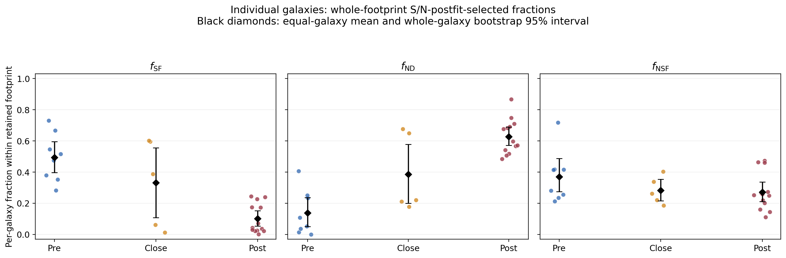

*Figure 1. Per-galaxy global fractions after the post-fit S/N cut. Black diamonds and bars show equal-galaxy means and whole-galaxy bootstrap intervals added for this report.*

---

## 4. The S/N cut is useful, but it changes the question

The cut retains 70.9% of pre-peak, 78.7% of close-to-peak, and 76.3% of post-peak originally valid pixels. Its action is strongly category dependent:

| Stage | SF retained | ND retained | NSF retained |
|---|---:|---:|---:|
| Pre | 0.813 | 0.379 | 0.819 |
| Close | 0.960 | 0.517 | 0.980 |
| Post | 0.958 | 0.676 | 0.986 |

It preferentially removes ND rather than removing each class at the same rate. Relative to the uncut equal-galaxy means, it changes the conditional fractions by:

| Stage | $\Delta f_{\mathrm{SF}}$ | $\Delta f_{\mathrm{ND}}$ | $\Delta f_{\mathrm{NSF}}$ |
|---|---:|---:|---:|
| Pre | +0.106 | -0.175 | +0.069 |
| Close | +0.081 | -0.123 | +0.042 |
| Post | +0.034 | -0.100 | +0.065 |

This is expected if low-continuum-S/N outskirts contain many weak or absent Balmer detections. It also means that the cut can censor the very regions used to diagnose outside-in erosion.

The S/N variable comes from the stellar-population post-fit product, not from the Balmer-line detection rule. The cut is defensible when reliable $\Sigma_\star$ placement is required, but its scientific denominator must be stated explicitly:

$$
f_c^{\mathrm{cut}} = \frac{N_c(\mathrm{S/N}_{\mathrm{postfit}}\ge25)}
{N_{\mathrm{valid}}(\mathrm{S/N}_{\mathrm{postfit}}\ge25)}.
$$

It is *not* the fraction of the original valid disc in category $c$. The maps preserve the difference by painting excluded pixels gray; the curves condition them away.

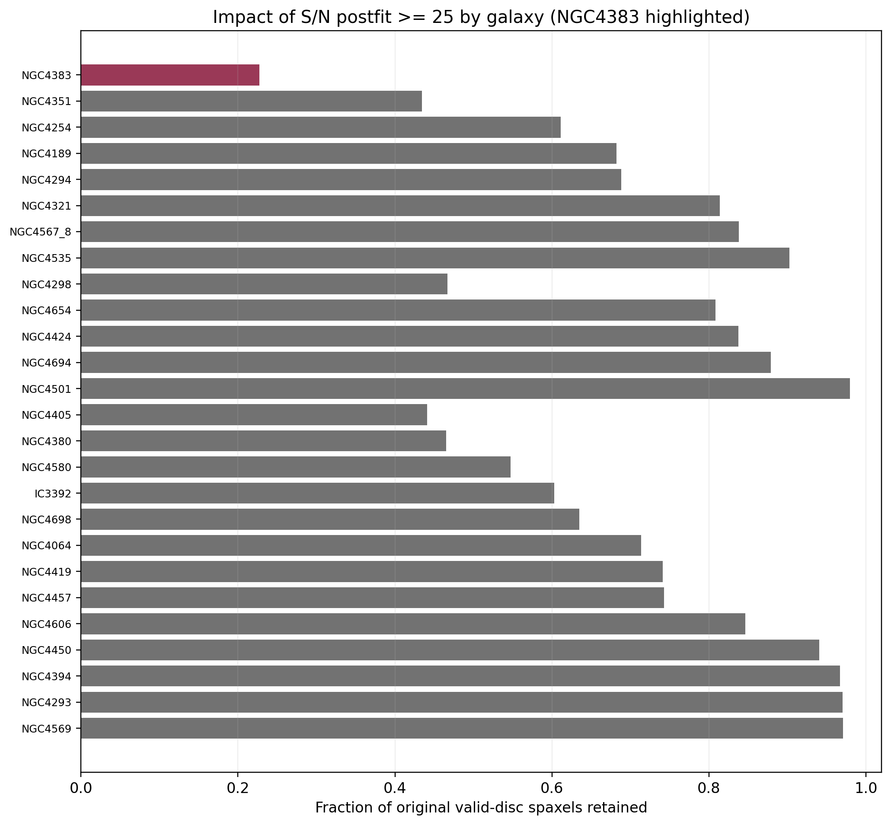

*Figure 2. Fraction of each galaxy's original valid-disc footprint retained. NGC4383 is the strongest case, but several other galaxies also lose roughly half their footprint.*

A clean final presentation should therefore show either:

- uncut and cut profiles together; or
- four fractions relative to the original denominator: SF, ND, NSF, and low-S/N excluded.

The stage profiles below explicitly compare the two denominators.

---

## 5. Radial result: contracting edge plus later disc-wide loss

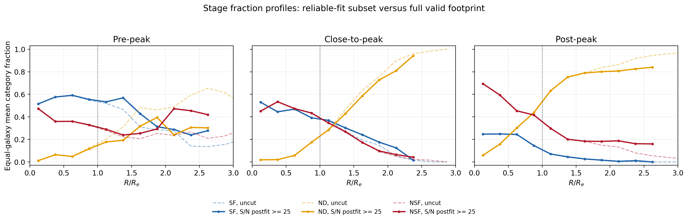

*Figure 3. Equal-galaxy radial profiles. Solid curves are conditional on $\mathrm{S/N}_{\mathrm{postfit}}\ge25$; faded dashed curves use the original valid footprint. Only bins with at least three galaxies and 1,000 pixels are shown in this report figure.*

### 5.1 Shape and normalization

The three $f_{\mathrm{SF}}$ profiles are not parallel translations:

- **Pre-peak:** $f_{\mathrm{SF}}\simeq0.52$--$0.59$ to about $1.4R_e$, then declines.
- **Close-to-peak:** the central value remains about 0.53, but the curve declines steadily and reaches near zero by about $2.2R_e$.
- **Post-peak:** the central plateau is only about 0.25 and the curve falls below 0.1 near $1.0R_e$.

An illustrative edge statistic makes this clearer. Define the inner baseline as the mean of the first three radial bins ($R/R_e=0.125,0.375,0.625$) and take the first outward crossing of half that value after the profile maximum:

| Stage | Inner baseline $f_{\mathrm{SF}}$ | Half-baseline radius, cut | Half-baseline radius, uncut |
|---|---:|---:|---:|
| Pre | 0.561 | $2.16R_e$ | $2.00R_e$ |
| Close | 0.481 | $1.63R_e$ | $1.48R_e$ |
| Post | 0.247 | $0.95R_e$ | $0.95R_e$ |

These are descriptive crossings, not fitted physical truncation radii, but their monotonic contraction is the clearest current evidence for outside-in evolution.

A single straight slope gives the misleading sequence $-0.151$, $-0.215$, and $-0.129$ per $R_e$ for pre, close, and post over the common 0.125--2.375 $R_e$ bins. The post slope becomes shallower because $f_{\mathrm{SF}}$ has already hit its floor. Thus the meeting's request to examine “slope” should be implemented as **shape/edge analysis**, not necessarily a one-parameter linear regression.

### 5.2 Inner and outer annuli

Equal-galaxy fractions integrated within broad annuli are:

| Stage | Region | $f_{\mathrm{SF}}$ | $f_{\mathrm{ND}}$ | $f_{\mathrm{NSF}}$ |
|---|---|---:|---:|---:|
| Pre | $R<R_e$ | 0.567 | 0.077 | 0.356 |
| Pre | $1\le R/R_e<2$ | 0.507 | 0.200 | 0.293 |
| Close | $R<R_e$ | 0.434 | 0.099 | 0.466 |
| Close | $1\le R/R_e<2$ | 0.294 | 0.469 | 0.238 |
| Post | $R<R_e$ | 0.200 | 0.318 | 0.482 |
| Post | $1\le R/R_e<2$ | 0.058 | 0.729 | 0.213 |

These values reveal the transition more directly:

| Transition | Inner $\Delta f_{\mathrm{SF}}$ | Outer $\Delta f_{\mathrm{SF}}$ | Inner $\Delta f_{\mathrm{ND}}$ | Outer $\Delta f_{\mathrm{ND}}$ | Inner $\Delta f_{\mathrm{NSF}}$ | Outer $\Delta f_{\mathrm{NSF}}$ |
|---|---:|---:|---:|---:|---:|---:|
| Close - pre | -0.133 | -0.213 | +0.023 | +0.268 | +0.110 | -0.055 |
| Post - close | -0.234 | -0.235 | +0.218 | +0.260 | +0.016 | -0.025 |
| Post - pre | -0.367 | -0.449 | +0.241 | +0.528 | +0.126 | -0.080 |

The interpretation is:

- The **pre-to-close** change is preferentially outside-in. The outer SF loss is larger, and almost all of the corresponding outer gain is ND. The centre changes differently: NSF increases while ND remains low.
- The **close-to-post** SF loss is almost identical in these two broad annuli. It resembles an additional normalization decrease after the close sample has already developed an outside-in gradient. Nevertheless, the destination remains spatially differentiated: ND grows outside and NSF remains important inside.
- The **full pre-to-post** difference is stronger outside but substantial everywhere. “Outside-in plus a disc-wide reduction” is more accurate than either “pure outside-in” or “pure uniform.”

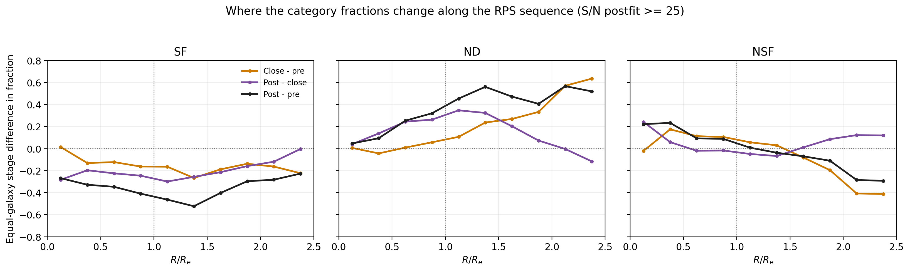

*Figure 4. Later-minus-earlier equal-galaxy fraction profiles. The non-monotonic differences show why one full-range slope is insufficient. The strongest post-minus-pre SF deficit occurs near the transition region around $1$--$1.5R_e$, then diminishes where both curves approach the floor.*

---

## 6. Stellar-surface-density result: low-$\Sigma_\star$ loss and high-$\Sigma_\star$ NSF

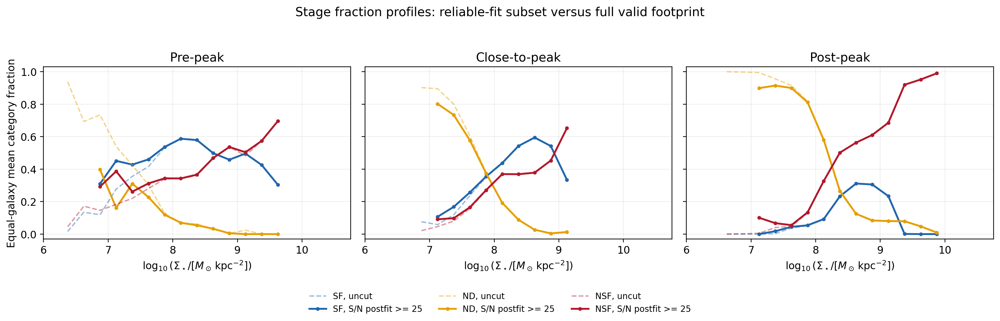

*Figure 5. Equal-galaxy profiles versus stellar surface density, with cut and uncut denominators shown separately.*

The low-$\Sigma_\star$ behaviour agrees with the radial result:

| $\log\Sigma_\star$ | Stage | $f_{\mathrm{SF}}$ | $f_{\mathrm{ND}}$ | $f_{\mathrm{NSF}}$ | Contributing galaxies |
|---:|---|---:|---:|---:|---:|
| 7.125 | Pre | 0.451 | 0.162 | 0.387 | 5 |
| 7.125 | Close | 0.107 | 0.802 | 0.091 | 5 |
| 7.125 | Post | 0.000 | 0.899 | 0.101 | 5 |
| 8.125 | Pre | 0.587 | 0.070 | 0.343 | 8 |
| 8.125 | Close | 0.438 | 0.192 | 0.370 | 5 |
| 8.125 | Post | 0.093 | 0.580 | 0.327 | 13 |
| 8.625 | Pre | 0.499 | 0.033 | 0.469 | 7 |
| 8.625 | Close | 0.595 | 0.027 | 0.378 | 5 |
| 8.625 | Post | 0.311 | 0.125 | 0.563 | 13 |
| 9.125 | Pre | 0.496 | 0.000 | 0.504 | 6 |
| 9.125 | Close | 0.334 | 0.013 | 0.653 | 4 |
| 9.125 | Post | 0.234 | 0.080 | 0.686 | 12 |

At low $\Sigma_\star$, the stage change is overwhelmingly SF to ND. At high $\Sigma_\star$, ND becomes rare and NSF becomes the dominant complement to SF. This is consistent with weakly bound outer discs being lost below line-detection thresholds while central emission remains detectable but often fails the HII-like selection.

The mass profile is not an independent proof of radial outside-in transformation. $\Sigma_\star$ and radius covary, the contributing-galaxy set changes across bins, and high-$\Sigma_\star$ points contain bulges/nuclei where NSF has multiple possible origins. The correct next test is a joint or matched comparison of stage, radius, and $\Sigma_\star$.

---

## 7. Spatial maps: the transition is not azimuthally uniform

The spatial maps add information that one-dimensional profiles erase. Gray shows S/N-excluded parts of the original valid footprint; blue, orange, and red are measured only in the retained footprint.

### 7.1 Pre-peak

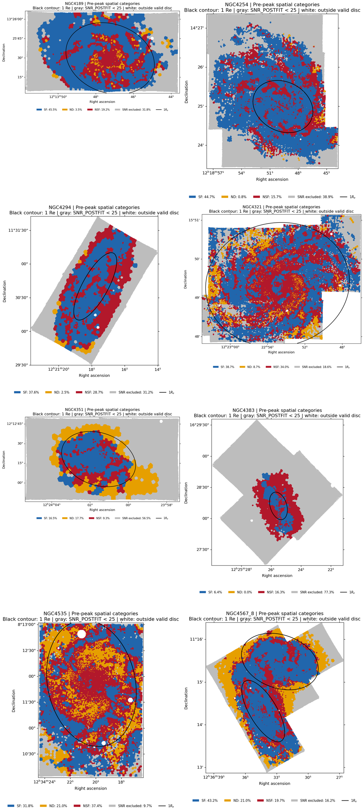

*Figure 6. Reused stored maps from cell 26 of the combined notebook.*

Most pre-peak systems retain blue SF over a large fraction of the disc. Peripheral orange is already visible in NGC4351 and NGC4567_8, and NGC4294 has a strong red outer component. NGC4535 is patchy. NGC4383 is qualitatively exceptional: its retained map is red dominated and most of its original footprint is gray.

### 7.2 Close-to-peak

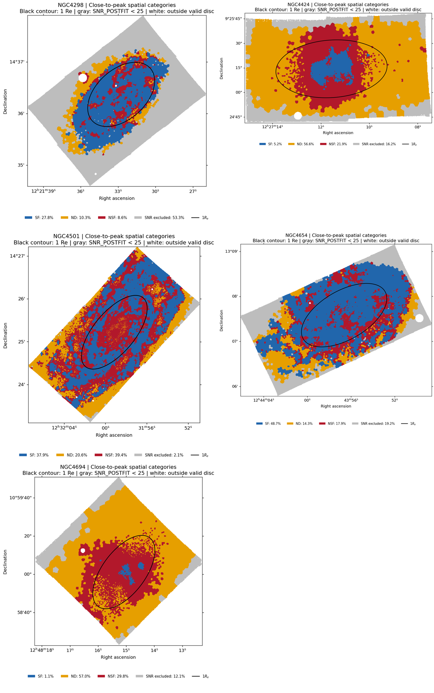

*Figure 7. Reused stored close-to-peak maps.*

The close stage visibly contains two regimes:

- NGC4298, NGC4501, and NGC4654 remain blue rich, with orange becoming more important toward edges or one side.
- NGC4424 and NGC4694 have compact central SF embedded in red and surrounded by extensive orange.

This is why the close-stage bootstrap interval is wide and why it should be described as a heterogeneous bridge, not a universal intermediate curve.

### 7.3 Post-peak

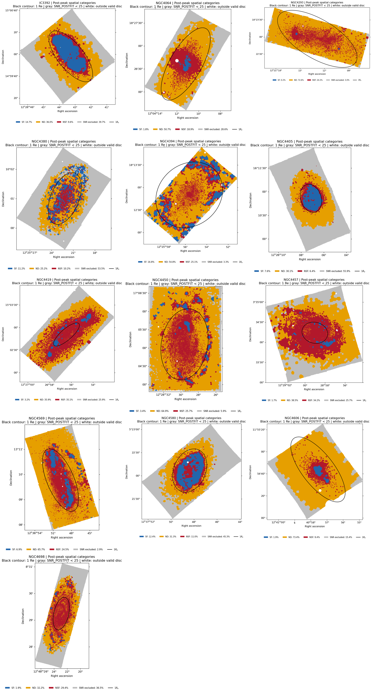

*Figure 8. Reused stored post-peak maps.*

The common post-peak pattern is a small central or patchy blue component, a large orange outer component, and red central/intermediate emission. Strongly truncated examples include IC3392, NGC4405, NGC4569, and NGC4580. NGC4293, NGC4064, NGC4606, and NGC4698 are nearly SF-free globally. NGC4394 and several other systems retain rings, edge patches, bars, or asymmetric structures that do not reduce to a simple radial law.

Therefore “uniform” in an azimuthally averaged annulus would not imply a spatially uniform physical process. One-sided stripping can produce a modest annular change if the opposite side remains blue, and a ring can give a positive outer-minus-inner contrast even in a strongly transformed galaxy.

---

## 8. Do individual galaxies follow the stage trend?

### 8.1 Global occupancy: yes for pre versus post, only partly for adjacent stages

For cut-footprint global fractions:

- $P(f_{\mathrm{SF,pre}}>f_{\mathrm{SF,post}})=1.000$ over all 104 pre/post galaxy pairs.
- $P(f_{\mathrm{ND,pre}}<f_{\mathrm{ND,post}})=1.000$.
- $P(f_{\mathrm{SF,pre}}>f_{\mathrm{SF,close}})=0.625$.
- $P(f_{\mathrm{SF,close}}>f_{\mathrm{SF,post}})=0.723$.

Thus the endpoints are not driven by one large galaxy. The adjacent-stage ordering is much less deterministic, especially because the close group spans from $f_{\mathrm{SF}}=0.013$ (NGC4694) to 0.602 (NGC4654).

NSF does not follow a monotonic sequence. Its between-galaxy scatter and spatial location are more informative than its global stage mean.

### 8.2 Radial shape: heterogeneous and affected by floor effects

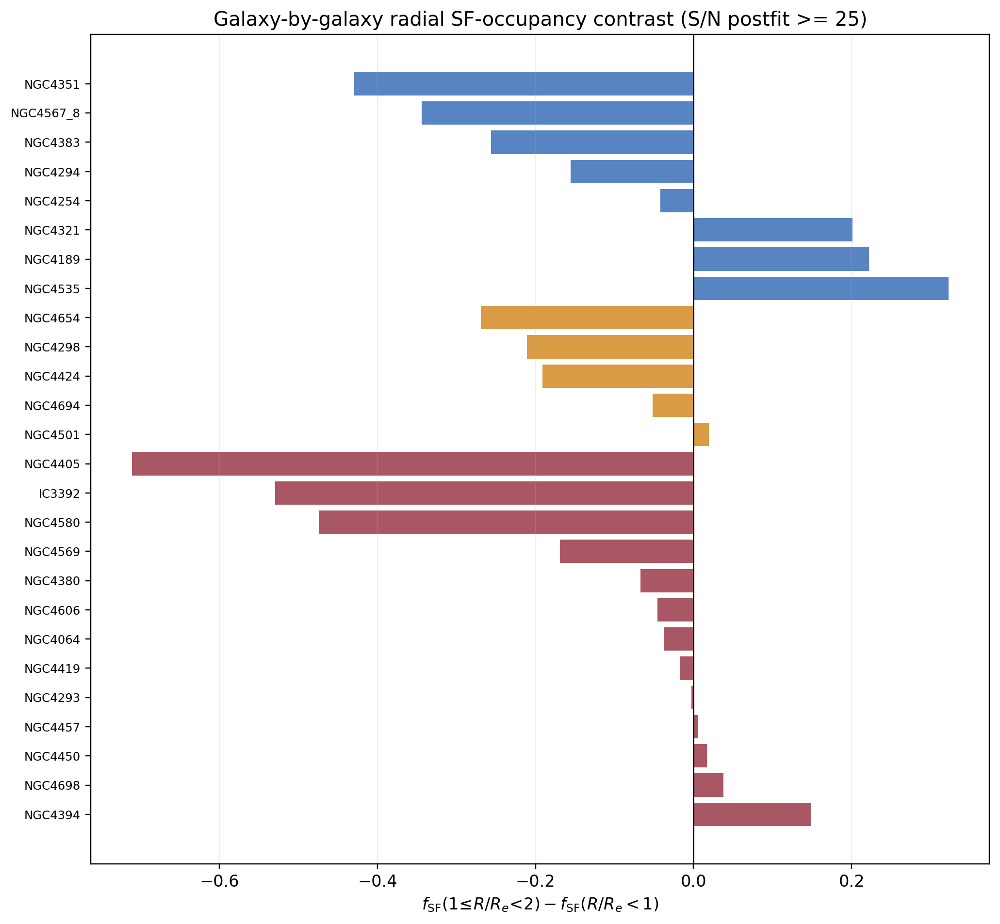

*Figure 9. Per-galaxy difference between the outer ($1$--$2R_e$) and inner ($<R_e$) SF fractions. Negative values mean less SF occupancy outside.*

Negative contrasts occur in 5/8 pre, 4/5 close, and 9/13 post systems. The means are $-0.060$, $-0.141$, and $-0.142$, but the post median is only $-0.038$. The post mean is pulled by a subset with very strong truncation: NGC4405 ($-0.711$), IC3392 ($-0.530$), NGC4580 ($-0.474$), and NGC4569 ($-0.169$).

Several post systems have near-zero contrast because they have very little SF in either annulus, not because their discs are untransformed. NGC4394 has a positive contrast because its residual SF is ring/edge weighted. This again shows why one radial slope or contrast cannot be the only stage statistic.

The defensible individual-galaxy conclusion is:

> **Galaxies broadly follow the stage trend in total SF occupancy, especially at the pre/post endpoints, but they do not follow one universal radial profile. Close-to-peak is a physical mixture, and post-peak combines strongly truncated discs, globally SF-poor floor cases, and residual ring/asymmetric morphologies.**

---

## 9. NGC4383 and the intended S/N diagnostic

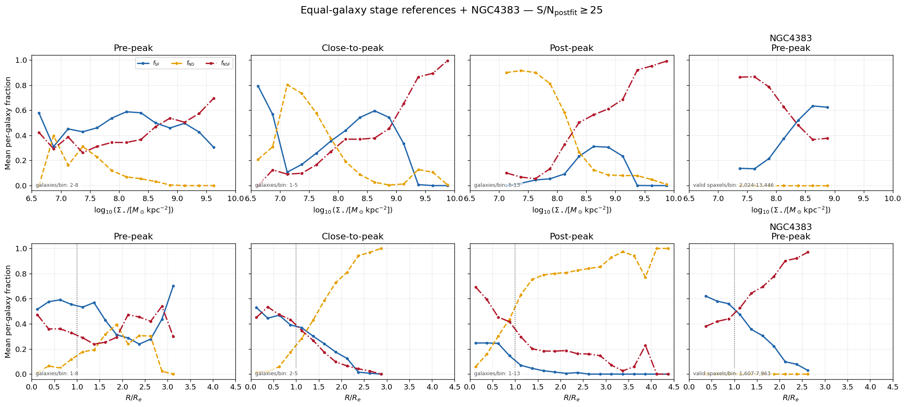

*Figure 10. Reused equal-galaxy reference plus NGC4383 figure from cell 21.*

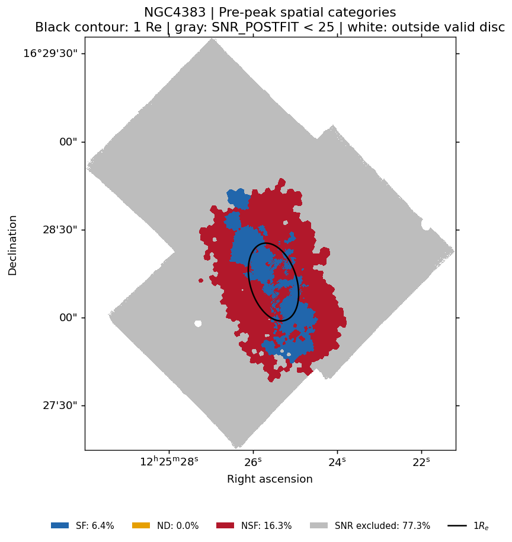

*Figure 11. Reused NGC4383 map from cell 26.*

The cut does what was intended in one important sense: it removes 175,482 of 227,031 originally valid NGC4383 pixels, leaving only 22.7%. The removed region includes most of the faint extended footprint.

It does **not** remove NGC4383 as an NSF influence. Within the retained denominator,

$$
(f_{\mathrm{SF}},f_{\mathrm{ND}},f_{\mathrm{NSF}})=(0.282,0.000,0.718).
$$

Relative to the original footprint, the map consists of 6.4% SF, 0.0% ND, 16.3% NSF, and 77.3% gray excluded area. The retained red component still surrounds/intersects the blue disc and is spatially compatible with the known exceptional outflow morphology, but the category map alone cannot prove its mechanism.

The explicit leave-NGC4383-out result is:

| Denominator | Pre sample | $f_{\mathrm{SF}}$ | $f_{\mathrm{ND}}$ | $f_{\mathrm{NSF}}$ |
|---|---|---:|---:|---:|
| Uncut | all 8 | 0.388 | 0.312 | 0.300 |
| Uncut | without NGC4383 | 0.428 | 0.315 | 0.257 |
| S/N cut | all 8 | 0.494 | 0.137 | 0.369 |
| S/N cut | without NGC4383 | 0.524 | 0.157 | 0.319 |

Removing it changes individual radial NSF bins by as much as 0.156. The primary pre/post SF--ND conclusion survives, but detailed NSF shape claims do not pass a leave-one-out standard yet.

There is also a bookkeeping correction to the meeting synthesis: **NGC4383 is pre-peak**, so it cannot cause a feature in a post-only curve. It can affect the pre-peak reference, all-stage curves, and any later-minus-pre difference.

The current combined notebook applies the S/N mask but never performs the meeting's requested complete NGC4383 exclusion. That is a genuine missing analysis.

---

## 10. Which toy geometry best matches the data?

| Toy scenario | Expected signature | Match to current data |
|---|---|---|
| Pure uniform occupancy loss | Nearly constant $\Delta f_{\mathrm{SF}}(R)$; no edge contraction | **Incomplete.** Close-to-post has an approximately equal inner/outer decrement, but the SF edge still contracts strongly and the destination differs with radius. |
| Pure outside-in loss | Central $f_{\mathrm{SF}}$ preserved; increasingly negative difference outward; outer SF becomes ND | **Core component, especially pre-to-close.** Low-$\Sigma_\star$/outer ND growth and the contracting half-occupancy radius support it. It is not the whole post-peak story. |
| Pure inside-out loss | Central deficit stronger than outer deficit | **Not dominant globally.** Central SF loss exists, but it mostly appears as detected NSF and coexists with strong outer ND. Some individual morphologies can look inside-out or ring-like. |
| Outside-in truncation plus disc-wide loss | Contracting edge plus lower normalization; radial destination differs | **Best current description.** Pre-to-close is preferentially outside-in; close-to-post adds a large disc-wide occupancy loss. |
| Outside-in stripping plus central/other ionisation | Outer SF$\rightarrow$ND and central SF$\rightarrow$NSF | **Consistent with the maps and annuli, but mechanism unproven.** NSF must be decomposed before assigning shocks, AGN, old stars, or outflow physics. |

The safest wording for a paper or meeting is:

> **The MAUVE stage sequence is consistent with progressive contraction of the SF-classified footprint. The onset from pre-peak to close-to-peak is preferentially outside-in, while the post-peak population shows an additional large loss of SF occupancy throughout the inner two effective radii. The observational endpoint depends on location: Balmer non-detections dominate at low stellar surface density and large radius, whereas detected non-SF emission dominates centrally.**

This says more than “environment suppresses SF,” while avoiding the unsupported claim that every galaxy follows a single monotonic slope.

---

## 11. What is missing from the combined notebook

The 2026-09-04 notebook successfully supplies common stage curves, individual curves, S/N-selected maps, and exact category accounting. It still lacks several pieces needed for a paper-level inference:

1. **The plotted post-cut numerical tables are not displayed.** Cell 23 displays only the uncut tables even though cells 19 and 21 plot the cut tables.
2. **No uncertainty bands or galaxy bootstrap are included.** Thousands of spaxels cannot substitute for the number of independent galaxies.
3. **No bin-by-bin support curve is shown.** A text range such as “galaxies/bin: 1--5” hides which bins are supported by one galaxy.
4. **No explicit common-support mask is enforced in the notebook figures.** Radii beyond roughly $2$--$2.5R_e$ rapidly become stage- and galaxy-specific.
5. **No shape statistic is computed.** A truncation/edge measure, inner--outer contrast, or flexible profile model is preferable to one straight slope.
6. **No leave-one-galaxy-out analysis is present**, including the explicitly requested NGC4383 exclusion.
7. **The S/N-excluded area disappears from the curve denominator.** The maps show gray, but the curves need either a fourth category or paired cut/uncut presentation.
8. **No individual-concordance summary is given.** The 26 figures exist, but the notebook does not count how many galaxies share the stage-level sign or edge change.
9. **Radius and $\Sigma_\star$ are not separated.** A two-dimensional or matched analysis is required.
10. **The analysis is cross-sectional.** Stage differences assume the classified samples represent an evolutionary ordering; they are not direct temporal transitions.
11. **No control for mass, morphology, spatial resolution, cluster history, or coverage is included.** These are explicitly acknowledged in the notebook prose but not modelled.
12. **NSF remains physically unresolved.** The notebook has useful first-failed-gate maps, but no population-level separation of central LI(N)ER/old-star/AGN-like emission from outer shocks/DIG/outflow/tail candidates.

---

## 12. Recommended next analysis for the occupancy question

Before moving to surviving-SF intensity, the minimal strong version of the current fraction analysis should be:

1. Use **equal-galaxy profiles as primary** and pooled-spaxel profiles as a clearly labelled sampling comparison.
2. Show **uncut and S/N-cut results together**. If the cut is retained, add low-S/N excluded as a fourth state relative to the original valid denominator.
3. Plot $N_{\mathrm{gal}}(b)$ directly below each curve and define a preregistered common-support rule, for example at least three galaxies per stage, while testing stricter choices.
4. Add **whole-galaxy bootstrap bands** and stage-difference curves $\Delta f_c(R)$ and $\Delta f_c(\Sigma_\star)$.
5. Replace the one-slope question with a small set of interpretable per-galaxy metrics: inner normalization, outer-minus-inner contrast, and an SF-edge/half-occupancy radius with uncertainty.
6. Run **leave-one-galaxy-out curves for every system**, with NGC4383 reported explicitly. Also test an NGC4383-specific outflow mask rather than assuming that continuum S/N is equivalent to an outflow mask.
7. Fit a galaxy-level or hierarchical binomial/multinomial model with stage-by-radius and stage-by-$\Sigma_\star$ terms, keeping galaxy as the independent cluster. A matched two-dimensional grid is an acceptable descriptive alternative.
8. Split NSF by spatial/diagnostic context: central versus outer, BPT class, EW, intrinsic dispersion, and recognisable outflow/tail/ring/bar morphology.

These steps would turn the current visual result into a defensible statement about whether the stage evolution is edge contraction, normalization loss, or both.

---

## 13. Deferred branch: intensity of the surviving SF regions

The fraction analysis cannot answer whether the remaining SF regions are enhanced or suppressed. That is a separate conditional quantity:

$$
\begin{aligned}
\Delta\log\Sigma_{\mathrm{SFR}}={}&\log\Sigma_{\mathrm{SFR}}
-\log\Sigma_{\mathrm{SFR,pre}}(\Sigma_\star),\\
&\qquad \mathrm{conditional\ on\ SF}.
\end{aligned}
$$

The later analysis should compare this residual at fixed $\Sigma_\star$ and radius using a frozen pre-peak reference, equal-galaxy weighting, and whole-galaxy resampling. It should distinguish four possibilities:

| SF occupancy | Surviving-SF intensity | Interpretation |
|---|---|---|
| lower | unchanged | regions disappear; survivors remain normal |
| lower | lower | fewer regions and weaker survivors |
| lower | higher | truncation plus compression/enhancement |
| unchanged | lower | widespread fading without much class loss |

Nothing in the present fractions alone selects among these intensity outcomes.

---

## 14. Final conclusions

1. **Strong endpoint result:** pre-peak to post-peak is a broad individual-galaxy shift from SF occupancy to ND, not a pooled-spaxel artefact.
2. **Spatial result:** the SF footprint contracts, with outer/low-$\Sigma_\star$ regions preferentially becoming ND and central regions increasingly occupying NSF.
3. **Geometry:** the best description is **outside-in truncation plus a later disc-wide occupancy decrease**, not pure uniform or pure one-slope outside-in quenching.
4. **Transition:** close-to-peak is heterogeneous and overlaps both endpoint populations; it should not be treated as a narrow deterministic middle state.
5. **Individual galaxies:** global endpoint ordering is strong, but radial shapes are diverse because of truncation strength, floor effects, rings, asymmetries, bars, and outflows.
6. **NSF:** no secure monotonic global stage trend is established. Its central/outer redistribution is potentially informative but requires diagnostic decomposition.
7. **S/N selection:** it removes unreliable faint regions, especially in NGC4383, but preferentially censors ND and changes the denominator. It is a sensitivity test, not a replacement for an explicit NGC4383/outflow exclusion.
8. **Next step:** complete the occupancy robustness tests above; then proceed to the independent surviving-SF intensity analysis.

---

## Appendix A. Per-galaxy values after the S/N cut

`Retained` is the fraction of the original valid-disc footprint satisfying $\mathrm{S/N}_{\mathrm{postfit}}\ge25$. The final column is $f_{\mathrm{SF}}(1\le R/R_e<2)-f_{\mathrm{SF}}(R<R_e)$.

| Galaxy | Stage | Retained | $f_{\mathrm{SF}}$ | $f_{\mathrm{ND}}$ | $f_{\mathrm{NSF}}$ | Outer - inner $f_{\mathrm{SF}}$ |
|---|---|---:|---:|---:|---:|---:|
| NGC4189 | pre-peak | 0.682 | 0.667 | 0.052 | 0.281 | +0.222 |
| NGC4254 | pre-peak | 0.611 | 0.731 | 0.013 | 0.256 | -0.042 |
| NGC4294 | pre-peak | 0.688 | 0.547 | 0.037 | 0.417 | -0.156 |
| NGC4321 | pre-peak | 0.814 | 0.475 | 0.107 | 0.417 | +0.201 |
| NGC4351 | pre-peak | 0.435 | 0.380 | 0.407 | 0.213 | -0.430 |
| NGC4383 | pre-peak | 0.227 | 0.282 | 0.000 | 0.718 | -0.257 |
| NGC4535 | pre-peak | 0.903 | 0.352 | 0.233 | 0.415 | +0.323 |
| NGC4567_8 | pre-peak | 0.838 | 0.515 | 0.250 | 0.235 | -0.344 |
| NGC4298 | close-to-peak | 0.467 | 0.595 | 0.220 | 0.185 | -0.211 |
| NGC4424 | close-to-peak | 0.838 | 0.062 | 0.676 | 0.262 | -0.191 |
| NGC4501 | close-to-peak | 0.979 | 0.387 | 0.211 | 0.403 | +0.019 |
| NGC4654 | close-to-peak | 0.808 | 0.602 | 0.177 | 0.221 | -0.269 |
| NGC4694 | close-to-peak | 0.879 | 0.013 | 0.649 | 0.339 | -0.052 |
| IC3392 | post-peak | 0.603 | 0.244 | 0.597 | 0.160 | -0.530 |
| NGC4064 | post-peak | 0.714 | 0.025 | 0.710 | 0.264 | -0.038 |
| NGC4293 | post-peak | 0.970 | 0.002 | 0.748 | 0.250 | -0.003 |
| NGC4380 | post-peak | 0.465 | 0.240 | 0.541 | 0.219 | -0.067 |
| NGC4394 | post-peak | 0.967 | 0.174 | 0.567 | 0.259 | +0.149 |
| NGC4405 | post-peak | 0.441 | 0.172 | 0.683 | 0.145 | -0.711 |
| NGC4419 | post-peak | 0.741 | 0.043 | 0.484 | 0.473 | -0.017 |
| NGC4450 | post-peak | 0.941 | 0.036 | 0.690 | 0.273 | +0.017 |
| NGC4457 | post-peak | 0.743 | 0.022 | 0.518 | 0.460 | +0.006 |
| NGC4569 | post-peak | 0.971 | 0.071 | 0.677 | 0.252 | -0.169 |
| NGC4580 | post-peak | 0.547 | 0.227 | 0.572 | 0.201 | -0.474 |
| NGC4606 | post-peak | 0.846 | 0.022 | 0.867 | 0.111 | -0.046 |
| NGC4698 | post-peak | 0.635 | 0.029 | 0.507 | 0.464 | +0.038 |

## Appendix B. Reproducibility and scope

Derived numeric tables and report figures are stored in `20260905_stage_SF_fraction_analysis_assets/`. The calculation-only audit executed the combined notebook's configuration, helper, inventory, counting, estimator, and S/N-estimator cells against the live products. It did not execute the 52 per-galaxy plotting loops again and did not change any source notebook. Stored notebook PNGs were extracted byte-for-byte for the spatial atlases and NGC4383 figures.

The additional bootstrap, annular contrasts, pairwise ordering, edge metrics, and leave-one-out values are report-level diagnostics, not claims that the source notebook already contained those tests.
