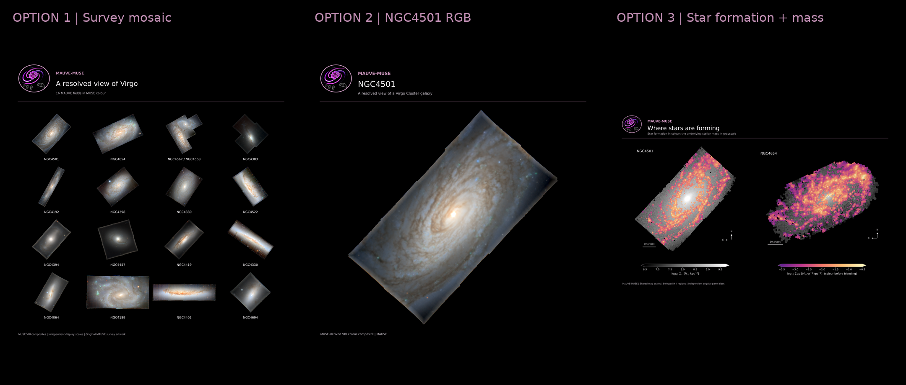

# MAUVE seminar poster image options - 2026-09-07

Generated by `../20260907_MAUVE_seminar_poster_image_options.ipynb`.

Start with **MAUVE_MUSE_20260907.png** for the final presentation poster, or **01_mosaic_curated.png** for the broad survey seminar.

| Image | Description | Pixels |
|---|---|---|
| 01_mosaic_curated [PNG](01_mosaic_curated.png) / [PDF](01_mosaic_curated.pdf) | MAUVE RGB mosaic | 8400 x 8400 |
| 01_mosaic_all_local_fields [PNG](01_mosaic_all_local_fields.png) | MAUVE RGB mosaic | 8400 x 10800 |
| 01_mosaic_9fields_equal_area [PNG](01_mosaic_9fields_equal_area.png) / [PDF](01_mosaic_9fields_equal_area.pdf) | MAUVE RGB mosaic (compact layout, equal panel area) | 8400 x 8400 |
| 01_mosaic_9fields_real_size [PNG](01_mosaic_9fields_real_size.png) / [PDF](01_mosaic_9fields_real_size.pdf) | MAUVE RGB mosaic (compact layout, uniform physical scale) | 8400 x 8400 |
| 02_NGC4501_RGB [PNG](02_NGC4501_RGB.png) / [PDF](02_NGC4501_RGB.pdf) | NGC4501: MUSE RGB poster image | 7200 x 7200 |
| 02_NGC4654_RGB [PNG](02_NGC4654_RGB.png) | NGC4654: MUSE RGB poster image | 7200 x 7200 |
| 02_RGB_pair [PNG](02_RGB_pair.png) | NGC4501 and NGC4654: paired MUSE RGB images | 9600 x 6000 |
| 03_SFR_on_stellar_mass_pair [PNG](03_SFR_on_stellar_mass_pair.png) / [PDF](03_SFR_on_stellar_mass_pair.pdf) | Star formation over stellar mass: NGC4501 and NGC4654 | 9600 x 6000 |
| 03_NGC4501_SFR_on_stellar_mass [PNG](03_NGC4501_SFR_on_stellar_mass.png) | NGC4501: SFR over stellar mass | 7200 x 7200 |
| 03_NGC4654_SFR_on_stellar_mass [PNG](03_NGC4654_SFR_on_stellar_mass.png) | NGC4654: SFR over stellar mass | 7200 x 7200 |
| 04_RGB_mass_SFR_comparison [PNG](04_RGB_mass_SFR_comparison.png) | RGB, stellar mass, and unblended SFR maps | 10200 x 7800 |
| 05_NGC4501_with_survey_thumbnails [PNG](05_NGC4501_with_survey_thumbnails.png) | NGC4501 RGB hero with four survey thumbnails | 9600 x 6600 |
| MAUVE_MUSE_20260907 [PNG](MAUVE_MUSE_20260907.png) / [PDF](MAUVE_MUSE_20260907.pdf) | A resolved view of Virgo spirals (MAUVE presentation poster) | 8400 x 8400 |

## Provenance and limits

- RGBs reuse the original MUSE-derived VRI renderings, with their original stretches and edge processing.
- Curated mosaic: 16 fields, omitting the three PHANGS exemplars. Full inventory: 35 fields / 36 named components.
- Logo: crop of the existing MAUVE banner, with its artwork unchanged.
- Presentation poster includes full MAUVE survey banner and QR codes for project website and presenter.
- Maps: unmasked, finite mass/bins, SFH post-fit S/N > 25; H II SFR, EW(Halpha) > 6 A, and intrinsic sigma < 45 km/s.
- Stored H II selection is retained; separate strict BPT class maps are not imposed as an extra cut.
- Both galaxies share fixed map colour scales. Constant 90% SFR alpha is visual blending, not uncertainty.
- Gray/absent regions do not prove zero SF. No stripping direction or environmental inference is encoded.
- `provenance.json` records exact inputs, selected-HDU hashes, cuts, WCS checks, and output metadata.
- Source products were read only; mass and SFR calibration pipelines were not rerun.

